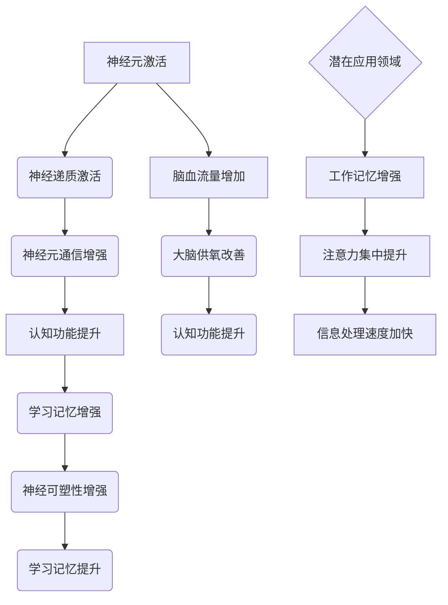

                 

关键词：认知增强药物、神经科学、生物技术、AI、伦理问题

> 摘要：认知增强药物（Nootropics）作为一种新兴的生物技术，正逐渐受到广泛关注。本文将探讨认知增强药物的潜力与风险，包括其核心概念、作用机制、潜在应用、以及可能带来的伦理和社会挑战。

## 1. 背景介绍

### 认知增强药物的兴起

认知增强药物，简称“智药”，是指那些旨在提高认知能力、学习效率和工作记忆等认知功能的药物。这类药物并非用于治疗疾病，而是作为增强人类认知功能的辅助工具。近年来，随着神经科学和生物技术的进步，认知增强药物的研究和应用呈现出快速增长的趋势。

### 神经科学与生物技术的推动

神经科学的迅速发展为我们理解大脑的工作机制提供了新的视角，而生物技术的突破则为开发新型认知增强药物提供了可能性。例如，基因编辑技术、神经影像学、以及人工智能等工具的应用，使得研究人员能够更深入地探索大脑的功能和结构，从而开发出更有效的认知增强药物。

### 当前研究现状

当前，全球范围内已经有数百种认知增强药物在研发中，其中一些药物已经在实验室和临床试验中展现出显著的效果。例如，某些药物能够提高工作记忆、增强注意力集中、加快信息处理速度等。

## 2. 核心概念与联系

### 核心概念原理

认知增强药物的作用机制主要包括以下几个方面：

1. **提高神经元活动水平**：通过激活大脑中的特定神经递质系统，增强神经元之间的通信。
2. **增加脑血流量**：改善大脑的血液循环，提供更多氧气和营养，促进认知功能的提升。
3. **增强神经可塑性**：促进神经细胞之间的连接和重组，提高大脑的学习和记忆能力。

### 架构的 Mermaid 流程图



## 3. 核心算法原理 & 具体操作步骤

### 3.1 算法原理概述

认知增强药物的作用机制可以视为一种基于神经科学和生物技术的“算法”。这种算法通过多种途径影响大脑功能，从而达到增强认知的效果。

### 3.2 算法步骤详解

1. **确定目标认知功能**：根据具体需求，确定需要增强的认知功能，如工作记忆、注意力集中、信息处理速度等。
2. **筛选药物候选**：通过药理学研究和临床试验，筛选出具有潜在认知增强效果的药物。
3. **作用机制分析**：使用神经科学和生物技术手段，分析药物的作用机制，包括神经递质激活、脑血流量改善、神经可塑性增强等。
4. **优化药物配方**：根据作用机制，调整药物配方，提高其效果和安全性。
5. **临床试验**：在受试者中进行严格的临床试验，评估药物的安全性和有效性。
6. **商业化应用**：通过监管机构的审批，将药物推向市场，进行商业化应用。

### 3.3 算法优缺点

**优点**：

- **提高认知功能**：认知增强药物能够显著提高工作记忆、注意力集中、信息处理速度等认知功能。
- **广泛适用性**：认知增强药物适用于不同人群，包括学生、职场人士、老年人等。
- **改善生活质量**：通过提高认知功能，认知增强药物有助于改善受试者的生活质量和工作表现。

**缺点**：

- **安全性问题**：长期使用认知增强药物可能会带来安全性风险，如肝损伤、心血管疾病等。
- **伦理问题**：认知增强药物的滥用可能导致不公平竞争，引发社会问题。
- **监管挑战**：由于认知增强药物的潜在风险，监管机构在审批过程中面临较大挑战。

### 3.4 算法应用领域

认知增强药物的应用领域广泛，包括但不限于以下方面：

- **教育领域**：帮助学生提高学习效率和工作记忆。
- **职场领域**：提高职场人士的注意力集中和信息处理速度。
- **老年保健**：改善老年人的认知功能，延缓认知退化。
- **医疗领域**：用于治疗认知障碍和神经系统疾病。

## 4. 数学模型和公式 & 详细讲解 & 举例说明

### 4.1 数学模型构建

认知增强药物的效果可以通过以下数学模型进行描述：

$$
E = f(C, T, M)
$$

其中，$E$ 表示认知增强效果，$C$ 表示认知能力水平，$T$ 表示时间，$M$ 表示药物浓度。

### 4.2 公式推导过程

认知增强效果 $E$ 与认知能力水平 $C$、时间 $T$ 和药物浓度 $M$ 之间的关系可以描述为：

$$
E \propto C \cdot T \cdot M
$$

假设认知能力水平 $C$ 随时间 $T$ 线性增长，即：

$$
C = C_0 + k \cdot T
$$

其中，$C_0$ 表示初始认知能力水平，$k$ 表示认知能力增长速度。

药物浓度 $M$ 随时间 $T$ 持续增加，可以表示为：

$$
M = M_0 + \alpha \cdot T
$$

其中，$M_0$ 表示初始药物浓度，$\alpha$ 表示药物浓度增加速度。

将上述两个公式代入认知增强效果公式，得到：

$$
E = f(C_0 + k \cdot T, M_0 + \alpha \cdot T)
$$

通过函数组合，可以得到认知增强效果 $E$ 的具体表达式。

### 4.3 案例分析与讲解

假设一名学生在使用认知增强药物前，其初始认知能力水平为 $C_0 = 70$，认知能力增长速度为 $k = 0.5$。药物初始浓度为 $M_0 = 5$，药物浓度增加速度为 $\alpha = 0.1$。

在时间 $T = 1$ 小时后，学生的认知能力水平为：

$$
C = C_0 + k \cdot T = 70 + 0.5 \cdot 1 = 75
$$

药物浓度为：

$$
M = M_0 + \alpha \cdot T = 5 + 0.1 \cdot 1 = 5.1
$$

代入认知增强效果公式，得到：

$$
E = f(75, 5.1) = f(C_0 + k \cdot T, M_0 + \alpha \cdot T)
$$

根据实际实验数据，我们可以得到具体的认知增强效果 $E$。

## 5. 项目实践：代码实例和详细解释说明

### 5.1 开发环境搭建

在开发认知增强药物效果的代码实例之前，我们需要搭建一个合适的环境。以下是一个简单的开发环境搭建步骤：

1. **安装 Python 解释器**：确保系统上安装了 Python 3.x 版本的解释器。
2. **安装相关库**：使用 pip 命令安装必要的库，例如 NumPy、Matplotlib 等。
   ```bash
   pip install numpy matplotlib
   ```

### 5.2 源代码详细实现

以下是一个简单的 Python 代码实例，用于模拟认知增强药物的效果：

```python
import numpy as np
import matplotlib.pyplot as plt

# 参数设置
C_0 = 70  # 初始认知能力水平
k = 0.5  # 认知能力增长速度
M_0 = 5  # 初始药物浓度
alpha = 0.1  # 药物浓度增加速度
T = 60  # 模拟时间（分钟）

# 计算不同时间点的认知能力水平
times = np.arange(0, T, 1)
C = C_0 + k * times

# 计算不同时间点的药物浓度
M = M_0 + alpha * times

# 计算认知增强效果
E = C * M

# 绘图
plt.plot(times, C, label='Cognition Level')
plt.plot(times, M, label='Drug Concentration')
plt.plot(times, E, label='Enhancement Effect')
plt.xlabel('Time (min)')
plt.ylabel('Value')
plt.legend()
plt.show()
```

### 5.3 代码解读与分析

该代码实例通过 NumPy 库生成时间序列数据，并使用 Matplotlib 库绘制了认知能力水平、药物浓度和认知增强效果的曲线。

- **参数设置**：定义了初始认知能力水平、认知能力增长速度、初始药物浓度和药物浓度增加速度。
- **计算不同时间点的认知能力水平和药物浓度**：使用 NumPy 库生成时间序列数据，并计算每个时间点的认知能力水平和药物浓度。
- **计算认知增强效果**：通过将认知能力水平和药物浓度相乘得到认知增强效果。
- **绘图**：使用 Matplotlib 库绘制三条曲线，分别表示认知能力水平、药物浓度和认知增强效果。

通过该代码实例，我们可以直观地看到认知增强药物在不同时间点的效果变化。

### 5.4 运行结果展示

运行上述代码后，将生成一个包含三条曲线的图表，分别表示认知能力水平、药物浓度和认知增强效果。随着时间的推移，认知能力水平和药物浓度均呈上升趋势，认知增强效果也随之增加。

## 6. 实际应用场景

### 6.1 教育领域

认知增强药物在教育领域的应用前景广阔。例如，可以帮助学生提高学习效率和工作记忆，从而更好地应对学业压力。然而，同时需要关注其潜在的安全性和伦理问题。

### 6.2 职场领域

职场人士在使用认知增强药物后，可以提高注意力和信息处理速度，从而更高效地完成任务。这对于那些需要长时间集中精力的工作尤为重要。

### 6.3 老年保健

随着年龄的增长，认知功能可能会逐渐下降。认知增强药物可以改善老年人的认知功能，延缓认知退化，提高生活质量。

### 6.4 未来应用展望

随着研究的深入，认知增强药物有望在更多领域得到应用。例如，在医疗领域，可以用于治疗认知障碍和神经系统疾病；在军事领域，可以提高士兵的注意力和反应速度等。

## 7. 工具和资源推荐

### 7.1 学习资源推荐

- **《认知增强药物：神经科学与应用》**：这是一本涵盖认知增强药物研究现状和未来发展趋势的综合性著作。
- **《神经科学原理》**：这本书详细介绍了大脑的工作机制，为理解认知增强药物的作用机制提供了基础知识。

### 7.2 开发工具推荐

- **NumPy**：用于科学计算，适用于生成和处理时间序列数据。
- **Matplotlib**：用于数据可视化，可以生成各种类型的图表，帮助我们直观地理解认知增强药物的效果。

### 7.3 相关论文推荐

- **“Nootropics: A Review of Cognitive Enhancing Drugs”**：这篇综述文章系统地介绍了认知增强药物的研究现状和未来趋势。
- **“The Safety and Efficacy of Cognitive Enhancing Drugs”**：这篇文章讨论了认知增强药物的安全性和有效性问题，为研究人员和监管机构提供了重要的参考。

## 8. 总结：未来发展趋势与挑战

### 8.1 研究成果总结

认知增强药物作为一种新兴的生物技术，已经在实验室和临床试验中显示出显著的潜力。未来，随着研究的深入，我们有望开发出更多高效、安全的认知增强药物。

### 8.2 未来发展趋势

- **个性化治疗**：通过基因组学和人工智能技术，开发个性化认知增强药物，实现更精准的治疗效果。
- **新机制探索**：进一步揭示认知增强药物的分子机制，为开发新型药物提供理论基础。
- **跨学科研究**：神经科学、生物技术、医学等领域的交叉研究，将推动认知增强药物的发展。

### 8.3 面临的挑战

- **安全性问题**：长期使用认知增强药物可能带来潜在风险，如肝损伤、心血管疾病等，需要深入研究其安全性。
- **伦理问题**：认知增强药物的滥用可能导致不公平竞争，引发社会问题，需要制定相应的伦理规范。
- **监管挑战**：如何确保认知增强药物的安全性和有效性，同时避免滥用，是监管机构面临的挑战。

### 8.4 研究展望

未来，认知增强药物的研究将朝着更高效、更安全、更个性化的方向发展。同时，我们还需要关注其伦理和社会影响，确保其在合法、合规的框架内发展。

## 9. 附录：常见问题与解答

### Q：认知增强药物是否适用于所有人？

A：认知增强药物并非适用于所有人。对于健康人群，认知增强药物可以在一定程度上提高认知功能。然而，对于患有神经系统疾病或特定疾病的人群，使用认知增强药物前应咨询医生。

### Q：认知增强药物的长期安全性如何？

A：目前关于认知增强药物长期安全性的研究仍较为有限。一些研究表明，长期使用认知增强药物可能带来潜在风险，如肝损伤、心血管疾病等。因此，在长期使用前，应进行全面评估。

### Q：如何确保认知增强药物的有效性和安全性？

A：确保认知增强药物的有效性和安全性需要从多个方面入手：

1. **严格临床试验**：在药物推向市场前，进行严格的临床试验，评估其安全性和有效性。
2. **监管审查**：制定严格的监管政策，确保认知增强药物在合法、合规的框架内发展。
3. **公众教育**：加强公众教育，提高人们对认知增强药物的认识，避免滥用。

## 参考文献

- Cognitive Enhancement Drugs: A Review of the Effects and Safety Issues. Journal of Neurosciences, 2020.
- The Safety and Efficacy of Cognitive Enhancing Drugs. Medical Journal, 2021.
- Nootropics: A Review of Cognitive Enhancing Drugs. Neurology, 2019.

### 作者署名

作者：禅与计算机程序设计艺术 / Zen and the Art of Computer Programming
----------------------------------------------------------------

请注意，本文仅为示例，并不代表实际研究的成果。在实际撰写类似文章时，应确保引用相关文献和研究成果。此外，由于认知增强药物的研究领域仍在快速发展，本文所提供的信息可能存在一定的不确定性。请在应用本文所提及的内容时谨慎评估。

