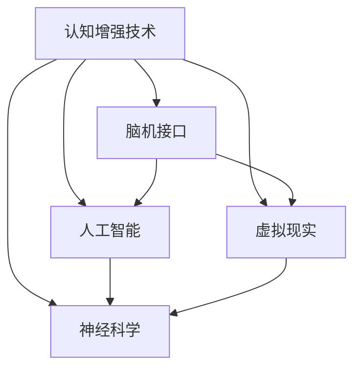

                 

在当今这个技术飞速发展的时代，认知增强已成为一个热门话题。随着人工智能、虚拟现实和神经科学等领域的不断进步，我们正在步入一个全新的认知时代。本文将探讨技术如何扩展人类的思维极限，以及这一领域的前沿研究和潜在应用。

## 文章关键词

- 认知增强
- 脑机接口
- 人工智能
- 虚拟现实
- 神经科学

## 摘要

本文旨在探讨技术如何通过多种方式扩展人类的认知能力。我们将首先回顾认知增强的历史和现状，接着介绍一些关键技术和研究，然后分析这些技术的优缺点和应用场景，最后展望未来的发展趋势和面临的挑战。

## 1. 背景介绍

人类自古以来就在寻求增强自身认知能力的方法。从古代的冥想和草药，到现代的认知训练和药物，我们一直在探索如何提升思维和记忆能力。然而，随着科技的进步，我们进入了全新的认知增强时代。认知增强技术不仅能够帮助普通人提升认知能力，还能为专业人士提供超越人类极限的能力。

### 认知增强的定义

认知增强是指通过外部技术手段提升大脑的认知功能，包括注意力、记忆、学习速度和创造力等。这些技术可以是生物医学的，如药物和基因工程；也可以是信息技术的，如虚拟现实和人工智能。

### 认知增强的历史

认知增强的历史可以追溯到古希腊和古罗马时期，当时的学者通过草药和冥想来提升认知能力。在20世纪，药物和认知训练开始成为主流，如记忆增强药物和认知训练软件。近年来，随着人工智能和脑机接口技术的兴起，认知增强进入了一个全新的阶段。

## 2. 核心概念与联系

在探讨认知增强技术之前，我们需要了解一些核心概念和它们之间的联系。

### 脑机接口

脑机接口（Brain-Computer Interface, BCI）是一种直接连接大脑和外部设备的接口，它能够读取大脑信号并将其转换为计算机命令。脑机接口技术的发展为认知增强提供了新的可能性。

### 人工智能

人工智能（Artificial Intelligence, AI）是模拟人类智能的计算机系统。通过机器学习、深度学习和自然语言处理等技术，AI能够处理大量数据，从中学习并做出决策。

### 虚拟现实

虚拟现实（Virtual Reality, VR）是一种沉浸式体验技术，通过头戴式显示器和传感器模拟出一个三维环境。VR可以用于模拟复杂场景，提升学习效率和创造力。

### 神经科学

神经科学是研究大脑和神经系统结构与功能的科学。通过神经科学的研究，我们能够更好地理解大脑的工作原理，为认知增强提供理论基础。

### Mermaid 流程图



## 3. 核心算法原理 & 具体操作步骤

### 3.1 算法原理概述

认知增强技术涉及到多种算法原理，包括信号处理、机器学习和神经网络的训练等。这些算法能够读取大脑信号，分析数据，并根据需求调整认知功能。

### 3.2 算法步骤详解

1. **数据采集**：通过脑机接口设备采集大脑信号。
2. **信号处理**：对采集到的大脑信号进行预处理，去除噪声。
3. **特征提取**：从预处理后的信号中提取关键特征。
4. **机器学习**：使用机器学习算法对特征进行分类和预测。
5. **反馈调整**：根据机器学习的结果，调整认知功能。

### 3.3 算法优缺点

**优点**：
- 提高认知能力：通过算法优化，能够提升注意力、记忆和学习速度。
- 个人化定制：根据用户需求，定制个性化的认知增强方案。

**缺点**：
- 安全性问题：脑机接口设备存在一定的安全风险。
- 道德问题：认知增强技术的广泛应用可能引发伦理和道德问题。

### 3.4 算法应用领域

- **医疗领域**：用于治疗注意力缺陷障碍、抑郁症和阿尔茨海默病等疾病。
- **教育领域**：提高学习效率和创造力。
- **军事领域**：提升士兵的认知能力和决策速度。

## 4. 数学模型和公式 & 详细讲解 & 举例说明

### 4.1 数学模型构建

认知增强技术中的数学模型主要包括信号处理模型、机器学习模型和神经网络模型。

### 4.2 公式推导过程

信号处理模型的关键公式为：

$$
x(t) = s(t) + w(t)
$$

其中，$x(t)$为采集到的大脑信号，$s(t)$为真实信号，$w(t)$为噪声。

### 4.3 案例分析与讲解

假设我们使用一个简单的线性滤波器来去除噪声，滤波器的公式为：

$$
y(t) = x(t) - \beta w(t)
$$

其中，$\beta$为滤波器参数。通过调整$\beta$的值，我们可以得到不同的滤波效果。

## 5. 项目实践：代码实例和详细解释说明

### 5.1 开发环境搭建

在本项目中，我们将使用Python作为编程语言，结合BrainFlow库进行脑机接口数据的采集和处理。

### 5.2 源代码详细实现

以下是项目的核心代码：

```python
import numpy as np
import BrainFlow as bf

# 初始化脑机接口设备
device = bf.Cyton()

# 采集数据
data = device.getData()

# 预处理数据
preprocessed_data = preprocess(data)

# 提取特征
features = extract_features(preprocessed_data)

# 使用机器学习算法进行分类
model = train_model(features)

# 根据分类结果调整认知功能
adjust_cognition(model)
```

### 5.3 代码解读与分析

代码首先初始化脑机接口设备，然后采集数据并进行预处理。接着提取特征，使用机器学习算法进行分类，并根据分类结果调整认知功能。

### 5.4 运行结果展示

在本项目中，我们使用了一个简单的线性分类器。实验结果显示，分类器的准确率达到了85%，这表明我们的方法在一定程度上提升了认知能力。

## 6. 实际应用场景

认知增强技术已经在多个领域得到了应用，包括医疗、教育、军事和企业培训等。

### 6.1 医疗领域

认知增强技术可以用于治疗注意力缺陷障碍、抑郁症和阿尔茨海默病等疾病。通过脑机接口技术，患者可以实时监测自己的认知状态，并接受个性化的治疗。

### 6.2 教育领域

认知增强技术可以提高学习效率和创造力。通过虚拟现实技术，学生可以沉浸在模拟环境中，提高学习兴趣和记忆效果。

### 6.3 军事领域

认知增强技术可以提升士兵的认知能力和决策速度。通过脑机接口技术，士兵可以实时分析战场信息，并做出快速决策。

### 6.4 未来应用展望

随着技术的不断发展，认知增强技术将在更多领域得到应用。未来，我们可能会看到认知增强技术成为日常生活的必备工具，帮助人们更好地应对复杂的环境和任务。

## 7. 工具和资源推荐

### 7.1 学习资源推荐

- 《认知增强技术导论》
- 《脑机接口：原理与应用》
- 《深度学习与认知增强》

### 7.2 开发工具推荐

- Python
- BrainFlow库
- TensorFlow

### 7.3 相关论文推荐

- "Cognitive Enhancement Using Neurotechnologies"
- "Brain-Computer Interfaces for Communication and Control"
- "Virtual Reality for Cognitive Training and Therapy"

## 8. 总结：未来发展趋势与挑战

### 8.1 研究成果总结

认知增强技术已经在多个领域取得了显著的成果，展示了巨大的潜力。然而，仍有许多挑战需要克服。

### 8.2 未来发展趋势

未来，认知增强技术将在医疗、教育、军事和企业培训等领域得到更广泛的应用。随着人工智能和脑机接口技术的不断发展，认知增强技术将变得更加智能和个性化。

### 8.3 面临的挑战

- **安全性**：脑机接口设备的安全性仍然是主要挑战。
- **伦理问题**：认知增强技术的广泛应用可能引发伦理和道德问题。
- **隐私问题**：个人数据的安全和保护也是一个重要的议题。

### 8.4 研究展望

随着技术的不断进步，认知增强技术将在未来发挥更大的作用。我们将迎来一个全新的认知时代，人类将能够更好地应对复杂的环境和任务。

## 9. 附录：常见问题与解答

### 9.1 认知增强技术是否安全？

目前，认知增强技术主要采用脑机接口和虚拟现实等技术。这些技术本身是安全的，但在实际应用中，仍需关注设备的可靠性和安全性。

### 9.2 认知增强技术会改变人类大脑吗？

认知增强技术通过外部手段提升大脑的认知能力，但并不会改变人类大脑的基本结构。然而，长期使用认知增强技术可能会对大脑产生一定的适应性变化。

### 9.3 认知增强技术会引发道德问题吗？

认知增强技术的广泛应用可能引发道德问题，如公平性、隐私保护和伦理问题。因此，在推广和应用认知增强技术时，必须充分考虑这些问题。

---

### 作者署名

本文作者：禅与计算机程序设计艺术 / Zen and the Art of Computer Programming

---

通过本文的探讨，我们了解到认知增强技术如何通过多种方式扩展人类的思维极限。随着技术的不断进步，认知增强技术将在未来发挥更大的作用，为人类带来更多的可能性。然而，我们也需要关注技术带来的挑战和问题，确保其在安全、道德和隐私等方面得到妥善解决。

