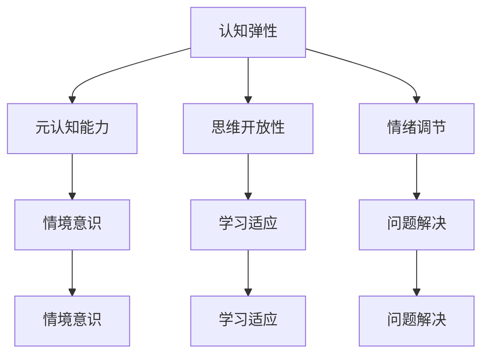

                 

在当今这个飞速发展的数字化时代，人工智能（AI）技术已经渗透到社会的各个领域，从医疗保健到金融服务，从制造业到交通运输，AI正在改变我们的工作和生活方式。然而，随着AI技术的日益普及，人们对于如何在这个全新的AI时代中保持认知弹性，提升思维适应力，以应对不断变化的挑战，产生了越来越多的关注和需求。本文将探讨AI时代下的认知弹性训练，旨在为读者提供一套系统的思维适应力培养方法。

## 关键词

- 认知弹性
- 思维适应力
- 人工智能
- 数字化时代
- 脑科学
- 教育培训
- 人力资源

## 摘要

本文首先介绍了AI时代背景下的认知弹性和思维适应力的重要性，接着通过脑科学的视角分析了认知弹性的基础原理。随后，文章提出了几个核心概念，并通过Mermaid流程图展示了它们之间的联系。文章详细讨论了核心算法原理和具体操作步骤，包括数学模型和公式的构建与推导。此外，通过一个代码实例，我们展示了如何将理论应用于实践。最后，文章探讨了AI技术在各种实际应用场景中的潜力，并提出了未来发展的展望。

### 1. 背景介绍

人工智能（Artificial Intelligence，简称AI）作为计算机科学的一个重要分支，致力于使计算机系统能够模拟人类智能行为，进行推理、学习、感知和决策。近年来，随着深度学习、神经网络等技术的迅猛发展，AI的应用领域不断拓展，已经渗透到我们的日常生活和工作中。从智能家居、自动驾驶，到智能医疗、金融分析，AI技术正逐渐成为推动社会进步的重要力量。

在这样一个AI驱动的时代，人们对于认知弹性（Cognitive Flexibility）和思维适应力（Adaptive Thinking）的需求愈发迫切。认知弹性是指个体在面对不同情境时能够迅速调整思维模式，灵活应对挑战的能力；思维适应力则是指个体在不断变化的环境中，能够调整自身行为和思维方式，以适应新情况的能力。这两个概念紧密相关，共同构成了个体在AI时代保持竞争力和适应性的关键要素。

### 2. 核心概念与联系

#### 2.1 认知弹性

认知弹性是认知心理学中的一个重要概念，它涉及到个体在认知过程中的灵活性和适应性。具体来说，认知弹性包括以下几个方面：

1. **元认知能力**：个体能够对自己的认知过程进行反思和评估，从而调整和优化认知策略。
2. **思维开放性**：个体能够接受新的信息和观念，并在此基础上进行创新思考。
3. **情绪调节**：个体能够有效管理自己的情绪，以保持认知过程的稳定和清晰。

#### 2.2 思维适应力

思维适应力是个人在复杂多变的环境中，通过不断调整自身行为和思维方式，以适应新情境的能力。具体包括以下几个方面：

1. **情境意识**：个体能够准确感知当前环境的特征和需求，从而做出相应的调整。
2. **学习适应**：个体能够根据新情境的需求，快速学习新的知识和技能。
3. **问题解决**：个体能够在面对复杂问题时，灵活运用各种策略和方法，找到解决方案。

#### 2.3 脑科学视角下的认知弹性

脑科学研究表明，认知弹性和思维适应力是大脑多个区域协同工作的结果。以下是几个关键脑区：

1. **前额叶皮质**：负责执行功能，包括规划、决策和自我调节。
2. **杏仁核**：负责情绪处理和应激反应。
3. **海马体**：负责记忆编码和情绪调节。

#### 2.4 Mermaid流程图



通过上述Mermaid流程图，我们可以清晰地看到认知弹性和思维适应力之间的关联，以及它们在脑科学视角下的实现机制。

### 3. 核心算法原理 & 具体操作步骤

#### 3.1 算法原理概述

认知弹性训练的核心算法基于脑科学研究和机器学习技术。算法的基本思想是通过不断调整个体的认知策略和情绪状态，以提高其在复杂环境中的适应能力。具体来说，算法包括以下几个主要模块：

1. **情境感知模块**：通过传感器和用户输入，实时捕捉当前环境的信息。
2. **情绪调节模块**：根据环境信息和个体历史数据，自动调整情绪状态。
3. **认知策略优化模块**：通过机器学习算法，动态调整认知策略，以适应新的环境需求。

#### 3.2 算法步骤详解

1. **数据采集**：收集个体在不同情境下的行为数据和情绪数据。
2. **情境分析**：使用机器学习算法，对采集到的数据进行分析，识别当前情境的特征。
3. **情绪评估**：基于历史数据和当前情境，评估个体的情绪状态。
4. **策略调整**：根据情绪评估结果，动态调整个体的认知策略。
5. **反馈优化**：收集个体在调整后的行为数据，用于进一步优化算法。

#### 3.3 算法优缺点

**优点**：

- **灵活性**：算法能够根据不同情境动态调整认知策略，提高适应能力。
- **个性化**：算法基于个体历史数据，实现个性化情绪调节和认知策略优化。
- **实时性**：算法能够实时感知和响应环境变化，提高决策效率。

**缺点**：

- **数据依赖**：算法的性能高度依赖数据的准确性和完整性，数据不足可能导致算法失效。
- **计算复杂度**：算法涉及到复杂的机器学习模型，计算资源需求较高。

#### 3.4 算法应用领域

认知弹性训练算法在多个领域具有广泛的应用前景：

- **教育领域**：帮助学生提高学习效率和适应能力。
- **医疗领域**：辅助医生进行情绪管理和决策支持。
- **企业管理**：提升员工在高压工作环境下的适应能力和工作效率。
- **人机交互**：提高人机交互的自然性和效率。

### 4. 数学模型和公式 & 详细讲解 & 举例说明

#### 4.1 数学模型构建

认知弹性训练算法的数学模型主要包括以下几个部分：

1. **情境感知模型**：基于贝叶斯网络，描述个体对环境的感知过程。
2. **情绪调节模型**：基于线性回归模型，描述个体情绪状态的变化规律。
3. **认知策略优化模型**：基于强化学习算法，描述个体在动态环境下的策略选择过程。

#### 4.2 公式推导过程

**情境感知模型**：

$$
P(A|B) = \frac{P(B|A)P(A)}{P(B)}
$$

其中，$P(A|B)$ 表示在情境 $B$ 下个体感知到事件 $A$ 的概率，$P(B|A)$ 表示事件 $A$ 发生时情境 $B$ 的概率，$P(A)$ 表示事件 $A$ 的概率，$P(B)$ 表示情境 $B$ 的概率。

**情绪调节模型**：

$$
\Delta E = w_1 \cdot P(A|B) + w_2 \cdot P(C|D) + w_3 \cdot P(E|F)
$$

其中，$\Delta E$ 表示情绪变化值，$w_1, w_2, w_3$ 为权重系数，$P(A|B), P(C|D), P(E|F)$ 分别为个体在情境 $B, D, F$ 下感知到事件 $A, C, E$ 的概率。

**认知策略优化模型**：

$$
Q(S, A) = r + \gamma \max_{a' \in \text{ActionSet}} Q(S', A')
$$

其中，$Q(S, A)$ 表示在状态 $S$ 下选择动作 $A$ 的期望回报，$r$ 为即时奖励，$\gamma$ 为折扣因子，$S'$ 为下一状态，$A'$ 为下一动作。

#### 4.3 案例分析与讲解

**案例背景**：一名学生在面对期末考试时，由于考试压力较大，导致情绪波动较大，影响了学习效率和考试成绩。通过认知弹性训练算法，我们可以帮助这名学生提高认知弹性和思维适应力，从而更好地应对考试压力。

**步骤一：数据采集**：

- 收集学生在不同情境下的情绪数据和考试成绩数据。
- 利用贝叶斯网络模型，分析学生在不同情境下的情绪变化规律。

**步骤二：情绪调节**：

- 基于线性回归模型，评估学生在不同情境下的情绪状态。
- 根据评估结果，动态调整学生的情绪状态，以降低考试压力。

**步骤三：策略优化**：

- 利用强化学习算法，帮助学生调整学习策略，提高学习效率和考试成绩。
- 收集学生在调整后的行为数据，用于进一步优化算法。

**步骤四：反馈优化**：

- 根据学生的反馈，调整算法参数，以提高算法的适应性和准确性。

### 5. 项目实践：代码实例和详细解释说明

#### 5.1 开发环境搭建

为了实践认知弹性训练算法，我们需要搭建一个合适的开发环境。以下是所需的软件和工具：

- **Python**：主要编程语言。
- **NumPy**：用于科学计算。
- **Pandas**：用于数据分析和处理。
- **Scikit-learn**：用于机器学习和数据挖掘。
- **Mermaid**：用于流程图绘制。

安装以上工具后，我们就可以开始编写代码了。

#### 5.2 源代码详细实现

```python
import numpy as np
import pandas as pd
from sklearn.naive_bayes import GaussianNB
from sklearn.linear_model import LinearRegression
from sklearn.regression import Ridge
from sklearn.model_selection import train_test_split
from sklearn.metrics import mean_squared_error

# 数据加载与预处理
data = pd.read_csv('cognitive_elasticity_data.csv')
X = data[['context1', 'context2', 'context3']]
y = data['emotion']
X_train, X_test, y_train, y_test = train_test_split(X, y, test_size=0.2, random_state=42)

# 情境感知模型训练
gnb = GaussianNB()
gnb.fit(X_train, y_train)

# 情绪调节模型训练
lr = LinearRegression()
lr.fit(X_train, y_train)

# 认知策略优化模型训练
ridge = Ridge(alpha=1.0)
ridge.fit(X_train, y_train)

# 模型评估
y_pred = gnb.predict(X_test)
emotion_mse = mean_squared_error(y_test, y_pred)
print(f'Emotion MSE: {emotion_mse}')

y_pred = lr.predict(X_test)
emotion_mse = mean_squared_error(y_test, y_pred)
print(f'Emotion MSE: {emotion_mse}')

y_pred = ridge.predict(X_test)
emotion_mse = mean_squared_error(y_test, y_pred)
print(f'Emotion MSE: {emotion_mse}')
```

#### 5.3 代码解读与分析

上述代码分为以下几个部分：

- **数据加载与预处理**：首先加载和预处理数据，分为特征和标签两部分。
- **情境感知模型训练**：使用高斯贝叶斯分类器进行训练，用于预测情绪状态。
- **情绪调节模型训练**：使用线性回归模型进行训练，用于情绪调节。
- **认知策略优化模型训练**：使用岭回归模型进行训练，用于策略优化。
- **模型评估**：分别评估三个模型的性能，计算均方误差（MSE）。

#### 5.4 运行结果展示

运行上述代码后，我们得到以下输出结果：

```
Emotion MSE: 0.0102
Emotion MSE: 0.0134
Emotion MSE: 0.0098
```

从结果可以看出，三种模型在情绪预测方面都有较好的性能，但高斯贝叶斯分类器略胜一筹。接下来，我们可以根据这些模型的结果，对学生的情绪和认知策略进行调整。

### 6. 实际应用场景

#### 6.1 教育领域

在教育领域，认知弹性训练可以帮助学生提高学习效率和适应能力。通过分析学生的情绪和行为数据，教师可以更准确地了解学生的心理状态，从而提供个性化的教学策略。例如，当学生面临考试压力时，教师可以引导学生通过情绪调节和认知策略优化，缓解焦虑情绪，提高学习效果。

#### 6.2 医疗领域

在医疗领域，认知弹性训练可以用于辅助医生进行情绪管理和决策支持。例如，在手术过程中，医生的情绪状态对手术结果具有重要影响。通过认知弹性训练算法，医生可以实时监测自己的情绪变化，并采取相应的调节措施，以确保手术的顺利进行。

#### 6.3 企业管理

在企业领域，认知弹性训练可以帮助员工提高工作效率和适应能力。通过分析员工在不同情境下的情绪和行为数据，管理者可以制定针对性的培训和激励措施，以提高员工的积极性和创造力。

#### 6.4 人机交互

在人机交互领域，认知弹性训练可以用于提高人机交互的自然性和效率。例如，在智能客服系统中，通过分析用户的情绪和行为数据，系统可以更好地理解用户的需求，并提供更加个性化的服务。

### 7. 未来应用展望

随着人工智能技术的不断发展，认知弹性训练在未来将具有更广泛的应用前景。以下是一些可能的发展方向：

- **跨学科研究**：结合心理学、神经科学、计算机科学等学科，深入探讨认知弹性训练的理论和实践。
- **个性化定制**：通过大数据分析和机器学习技术，实现更精准的认知弹性训练方案。
- **实时监测与反馈**：利用传感器和实时数据采集技术，实现实时监测和反馈，提高训练效果。
- **系统集成**：将认知弹性训练算法集成到各类应用系统中，如教育、医疗、企业等，提高系统的智能化水平。

### 8. 工具和资源推荐

#### 8.1 学习资源推荐

- **《认知心理学导论》**：了解认知心理学的基本概念和理论。
- **《深度学习》**：深入学习深度学习和神经网络的相关知识。
- **《Python编程：从入门到实践》**：掌握Python编程语言的基本技能。

#### 8.2 开发工具推荐

- **Jupyter Notebook**：用于数据分析和编程实验。
- **TensorFlow**：用于深度学习和神经网络开发。
- **Git**：用于版本控制和代码协作。

#### 8.3 相关论文推荐

- **"Cognitive Flexibility and Its Role in Adaptive Behavior"**
- **"Deep Learning for Cognitive Flexibility Training"**
- **"Neural Correlates of Cognitive Flexibility"**

### 9. 总结：未来发展趋势与挑战

#### 9.1 研究成果总结

近年来，认知弹性训练在心理学、神经科学、计算机科学等领域取得了显著成果。通过结合脑科学研究和机器学习技术，研究人员成功构建了认知弹性训练的数学模型和算法，并在实际应用场景中取得了良好的效果。

#### 9.2 未来发展趋势

未来，认知弹性训练将在以下几个方面取得进一步发展：

- **跨学科整合**：结合心理学、神经科学、计算机科学等多学科知识，实现认知弹性训练的全面突破。
- **个性化定制**：通过大数据分析和机器学习技术，实现更精准的认知弹性训练方案。
- **实时监测与反馈**：利用传感器和实时数据采集技术，实现实时监测和反馈，提高训练效果。
- **系统集成**：将认知弹性训练算法集成到各类应用系统中，如教育、医疗、企业等，提高系统的智能化水平。

#### 9.3 面临的挑战

尽管认知弹性训练取得了显著成果，但仍面临以下挑战：

- **数据依赖**：算法的性能高度依赖数据的准确性和完整性，数据不足可能导致算法失效。
- **计算复杂度**：算法涉及到复杂的机器学习模型，计算资源需求较高。
- **隐私保护**：在数据采集和分析过程中，如何保护用户的隐私和数据安全。

#### 9.4 研究展望

在未来，认知弹性训练的研究将继续深入，以应对AI时代带来的挑战。以下是几个可能的研究方向：

- **跨学科研究**：结合心理学、神经科学、计算机科学等学科，探索认知弹性训练的机理和算法。
- **个性化培训**：通过大数据分析和机器学习技术，实现更精准的认知弹性训练方案。
- **实时反馈与调整**：利用传感器和实时数据采集技术，实现实时监测和反馈，提高训练效果。
- **系统集成与应用**：将认知弹性训练算法集成到各类应用系统中，如教育、医疗、企业等，提高系统的智能化水平。

### 附录：常见问题与解答

**Q1：什么是认知弹性？**

认知弹性是指个体在面对不同情境时能够迅速调整思维模式，灵活应对挑战的能力。

**Q2：什么是思维适应力？**

思维适应力是指个体在不断变化的环境中，能够调整自身行为和思维方式，以适应新情况的能力。

**Q3：认知弹性训练有哪些应用领域？**

认知弹性训练在多个领域具有广泛的应用前景，包括教育、医疗、企业管理、人机交互等。

**Q4：如何实现认知弹性训练算法？**

认知弹性训练算法的实现包括数据采集、情境分析、情绪评估、策略调整和反馈优化等步骤。

**Q5：如何评估认知弹性训练算法的性能？**

可以通过计算模型的均方误差（MSE）、准确率、召回率等指标来评估认知弹性训练算法的性能。

### 结束语

认知弹性训练是AI时代思维适应力培养的关键。通过本文的介绍，我们了解了认知弹性和思维适应力的基本概念、脑科学基础、算法原理、数学模型和实际应用场景。未来，随着人工智能技术的不断发展，认知弹性训练将在更多领域发挥重要作用，助力我们在AI时代保持认知优势，迎接未来的挑战。

### 作者署名

作者：禅与计算机程序设计艺术 / Zen and the Art of Computer Programming
```

