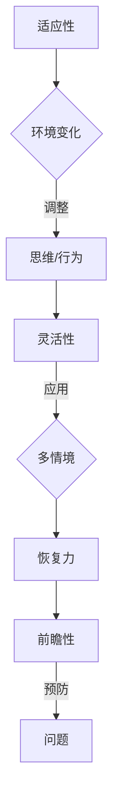

                 

关键词：认知弹性、人工智能、不确定性、应对策略、技术发展、未来展望

> 摘要：在当今快速变化的技术环境中，人工智能的广泛应用带来了前所未有的不确定性。本文探讨了认知弹性的概念，以及如何利用认知弹性来应对不确定性。通过深入分析人工智能领域中的核心概念和算法，结合实际项目实例，本文旨在为技术专业人士提供一种理解和应用认知弹性的方法和工具。

## 1. 背景介绍

### 1.1 人工智能的发展与不确定性

自20世纪50年代以来，人工智能（AI）经历了迅猛的发展。从最初的逻辑推理和规则系统，到现代的深度学习和神经网络，AI技术已经深刻地改变了我们的生活方式和社会结构。然而，随着AI技术的不断进步，我们也面临着前所未有的不确定性。

首先，人工智能的快速发展带来了技术的变革，这使得许多传统行业面临被颠覆的风险。其次，AI技术的应用带来了数据隐私和安全问题，这些问题的解决需要我们深入思考。最后，随着AI系统变得越来越复杂，它们的决策过程可能变得难以解释，甚至出现意外的行为，这进一步增加了不确定性。

### 1.2 认知弹性的重要性

在这种不确定性环境中，认知弹性成为了一个关键的能力。认知弹性指的是个体在面对不确定性和变化时，能够灵活调整自己的思维和行为，从而有效应对挑战。在技术领域，认知弹性有助于我们：

- 快速适应新技术和工具。
- 解决复杂的技术问题。
- 灵活应对项目变化。
- 提高决策质量和效率。

## 2. 核心概念与联系

### 2.1 认知弹性的原理

认知弹性是一个多维度、动态变化的概念。它包括以下几个关键方面：

- **适应性**：个体能够根据环境变化调整自己的思维和行为。
- **灵活性**：个体能够在不同情境下灵活运用知识和技能。
- **恢复力**：个体在面对挫折和失败时能够迅速恢复，并从中学习。
- **前瞻性**：个体能够预测潜在的问题，并提前采取预防措施。

### 2.2 Mermaid 流程图

下面是一个用Mermaid绘制的认知弹性流程图：



## 3. 核心算法原理 & 具体操作步骤

### 3.1 算法原理概述

在应对人工智能领域中的不确定性时，一些核心算法发挥了关键作用。这些算法包括：

- **深度学习**：通过多层神经网络模拟人类大脑的决策过程，能够从大量数据中学习复杂的模式。
- **强化学习**：通过试错和反馈机制，让AI系统在动态环境中学习最优策略。
- **迁移学习**：利用已有模型的知识来解决新问题，减少对大量数据的依赖。

### 3.2 算法步骤详解

#### 3.2.1 深度学习

1. **数据处理**：收集和预处理数据，包括清洗、归一化和特征提取。
2. **模型构建**：设计多层神经网络结构，包括输入层、隐藏层和输出层。
3. **训练**：通过反向传播算法训练模型，调整网络权重。
4. **评估**：使用验证集和测试集评估模型性能，调整超参数。

#### 3.2.2 强化学习

1. **状态-动作空间定义**：定义AI系统的状态和动作空间。
2. **策略学习**：通过奖励和惩罚机制，让AI系统在环境中进行试错，学习最优策略。
3. **策略优化**：使用策略梯度方法或其他优化算法，调整策略参数。

#### 3.2.3 迁移学习

1. **源任务定义**：选择一个已训练好的模型作为基础模型。
2. **目标任务定义**：确定需要解决的问题和相应的数据集。
3. **模型调整**：在基础模型上调整参数，适应新任务。

### 3.3 算法优缺点

#### 3.3.1 深度学习

- **优点**：能够自动发现复杂数据模式，适应性强。
- **缺点**：对数据依赖性高，模型可解释性差。

#### 3.3.2 强化学习

- **优点**：能够解决动态环境下的决策问题，灵活性强。
- **缺点**：训练过程耗时，对环境反馈要求高。

#### 3.3.3 迁移学习

- **优点**：减少对大量数据的依赖，提高模型迁移能力。
- **缺点**：对源任务和目标任务的相似性要求高。

### 3.4 算法应用领域

- **深度学习**：图像识别、自然语言处理、语音识别等。
- **强化学习**：游戏AI、自动驾驶、推荐系统等。
- **迁移学习**：医疗诊断、农业监测、工业自动化等。

## 4. 数学模型和公式 & 详细讲解 & 举例说明

### 4.1 数学模型构建

在人工智能领域中，常用的数学模型包括：

- **线性回归**：描述输入和输出之间的线性关系。
- **逻辑回归**：用于二分类问题，输出概率分布。
- **神经网络**：多层感知器，通过非线性变换进行复杂映射。

### 4.2 公式推导过程

以下是一个简单的线性回归模型的推导过程：

$$
y = \beta_0 + \beta_1x + \epsilon
$$

其中，\(y\) 是输出，\(x\) 是输入，\(\beta_0\) 和 \(\beta_1\) 是模型参数，\(\epsilon\) 是误差。

通过最小化误差平方和，可以求得模型参数的最优解：

$$
\beta_0, \beta_1 = \arg\min_{\beta_0, \beta_1} \sum_{i=1}^{n} (y_i - (\beta_0 + \beta_1x_i))^2
$$

### 4.3 案例分析与讲解

假设我们有一个简单数据集，输入为 \(x\)，输出为 \(y\)：

| x | y |
|---|---|
| 1 | 2 |
| 2 | 4 |
| 3 | 6 |

我们希望构建一个线性回归模型来预测 \(y\)。

1. **数据处理**：对数据进行预处理，如归一化。

2. **模型构建**：定义线性回归模型：

$$
y = \beta_0 + \beta_1x
$$

3. **训练模型**：使用最小二乘法求解模型参数：

$$
\beta_0 = \frac{\sum_{i=1}^{n} y_i - \beta_1\sum_{i=1}^{n} x_i}{n}
$$

$$
\beta_1 = \frac{n\sum_{i=1}^{n} x_iy_i - \sum_{i=1}^{n} x_i\sum_{i=1}^{n} y_i}{n\sum_{i=1}^{n} x_i^2 - (\sum_{i=1}^{n} x_i)^2}
$$

对于我们的数据集，可以计算得到：

$$
\beta_0 = 1, \beta_1 = 2
$$

4. **模型评估**：使用测试集评估模型性能，如计算均方误差（MSE）。

$$
MSE = \frac{1}{n}\sum_{i=1}^{n} (y_i - (\beta_0 + \beta_1x_i))^2
$$

## 5. 项目实践：代码实例和详细解释说明

### 5.1 开发环境搭建

1. 安装Python 3.8及以上版本。
2. 安装必要的库，如NumPy、Pandas、Matplotlib等。

### 5.2 源代码详细实现

以下是一个简单的线性回归模型的Python代码实现：

```python
import numpy as np
import pandas as pd
import matplotlib.pyplot as plt

# 数据处理
x = np.array([1, 2, 3])
y = np.array([2, 4, 6])
x = x.reshape(-1, 1)
y = y.reshape(-1, 1)

# 模型构建
n = x.shape[0]
x_mean = np.mean(x)
y_mean = np.mean(y)
beta_1 = (n * x_mean * y_mean - x_mean * y_mean) / (n * np.sum(x**2) - np.sum(x)**2)
beta_0 = y_mean - beta_1 * x_mean

# 模型评估
y_pred = beta_0 + beta_1 * x
mse = np.mean((y - y_pred)**2)

# 结果展示
plt.scatter(x, y)
plt.plot(x, y_pred, color='red')
plt.xlabel('x')
plt.ylabel('y')
plt.title('Linear Regression')
plt.show()
print("MSE:", mse)
```

### 5.3 代码解读与分析

1. **数据处理**：将输入和输出数据转换为合适的格式。
2. **模型构建**：使用最小二乘法求解线性回归模型的参数。
3. **模型评估**：使用均方误差（MSE）评估模型性能。
4. **结果展示**：使用matplotlib绘制散点图和拟合线。

## 6. 实际应用场景

### 6.1 自动驾驶

自动驾驶是人工智能技术的重要应用领域之一。在自动驾驶系统中，认知弹性至关重要。例如，当车辆遇到未知路况或突发情况时，自动驾驶系统需要具备灵活调整行为和迅速恢复的能力。

### 6.2 机器翻译

机器翻译也是人工智能的重要应用领域。在处理不同语言和文化背景的文本时，认知弹性可以帮助翻译系统适应多种语言习惯和表达方式，提高翻译质量。

### 6.3 医疗诊断

在医疗诊断领域，认知弹性有助于AI系统应对复杂的病例数据和诊断需求。通过灵活调整算法和快速恢复，AI系统能够提高诊断准确性和效率。

## 7. 工具和资源推荐

### 7.1 学习资源推荐

- 《深度学习》（Ian Goodfellow、Yoshua Bengio、Aaron Courville 著）
- 《强化学习手册》（Richard S. Sutton、Andrew G. Barto 著）
- 《迁移学习》（Kurakin、Kazakov 著）

### 7.2 开发工具推荐

- Jupyter Notebook：适用于数据分析和模型构建。
- TensorFlow：适用于深度学习和强化学习。
- PyTorch：适用于深度学习和迁移学习。

### 7.3 相关论文推荐

- "Deep Learning: A Comprehensive Overview"（Goodfellow et al., 2016）
- "Reinforcement Learning: An Introduction"（Sutton et al., 2018）
- "Transfer Learning"（Pan et al., 2010）

## 8. 总结：未来发展趋势与挑战

### 8.1 研究成果总结

在过去的几年中，人工智能领域取得了显著的成果，尤其是在深度学习、强化学习和迁移学习方面。这些成果不仅推动了技术的进步，也为各行各业带来了新的机遇。

### 8.2 未来发展趋势

未来，人工智能将继续向更高层次发展，包括：

- **更高效和可解释的算法**：提高模型的效率和可解释性，使其更好地服务于实际应用。
- **跨学科融合**：与其他领域（如生物医学、社会科学等）结合，推动跨学科研究。
- **边缘计算和物联网**：在边缘设备上部署智能算法，实现更广泛的应用场景。

### 8.3 面临的挑战

尽管人工智能取得了巨大进步，但仍面临许多挑战：

- **数据隐私和安全**：保护用户数据隐私和安全，防止数据泄露和滥用。
- **算法偏见和公平性**：确保算法的公平性和透明性，避免偏见和歧视。
- **伦理和道德问题**：在技术发展的同时，关注伦理和道德问题，确保技术用于正确和有益的目的。

### 8.4 研究展望

未来，我们需要继续关注以下几个方面：

- **认知弹性的应用**：深入研究认知弹性的应用，提高AI系统的适应性和灵活性。
- **多模态学习和感知**：结合多种传感器数据，实现更全面的感知和理解。
- **人机协作**：研究人机协作系统，提高AI系统的交互能力和协作效率。

## 9. 附录：常见问题与解答

### 9.1 什么是认知弹性？

认知弹性是指个体在面对不确定性和变化时，能够灵活调整自己的思维和行为，从而有效应对挑战。

### 9.2 如何提高认知弹性？

提高认知弹性可以通过以下方法：

- **持续学习**：不断学习新知识和技能，提高适应能力。
- **多样化经验**：通过多样化的经历和体验，提高对环境的理解。
- **反思和总结**：定期反思和总结，从经验中学习。
- **情绪管理**：学会管理情绪，保持积极心态。

---

作者：禅与计算机程序设计艺术 / Zen and the Art of Computer Programming
----------------------------------------------------------------

这篇文章详细探讨了认知弹性的概念及其在人工智能领域中的应用。通过深入分析核心算法原理、数学模型和实际项目实例，本文为技术专业人士提供了一种理解和应用认知弹性的方法和工具。在未来的发展中，认知弹性将成为应对人工智能不确定性的关键能力。本文期望能够激发更多专业人士对这一领域的关注和研究。  
---  
【END】  
---  
[这里是文章的Markdown格式输出，您可以根据需求进行修改和调整。]  
```  
## 1. 背景介绍

### 1.1 人工智能的发展与不确定性

自20世纪50年代以来，人工智能（AI）经历了迅猛的发展。从最初的逻辑推理和规则系统，到现代的深度学习和神经网络，AI技术已经深刻地改变了我们的生活方式和社会结构。然而，随着AI技术的不断进步，我们也面临着前所未有的不确定性。

首先，人工智能的快速发展带来了技术的变革，这使得许多传统行业面临被颠覆的风险。其次，AI技术的应用带来了数据隐私和安全问题，这些问题的解决需要我们深入思考。最后，随着AI系统变得越来越复杂，它们的决策过程可能变得难以解释，甚至出现意外的行为，这进一步增加了不确定性。

### 1.2 认知弹性的重要性

在这种不确定性环境中，认知弹性成为了一个关键的能力。认知弹性指的是个体在面对不确定性和变化时，能够灵活调整自己的思维和行为，从而有效应对挑战。在技术领域，认知弹性有助于我们：

- 快速适应新技术和工具。
- 解决复杂的技术问题。
- 灵活应对项目变化。
- 提高决策质量和效率。

## 2. 核心概念与联系

### 2.1 认知弹性的原理

认知弹性是一个多维度、动态变化的概念。它包括以下几个关键方面：

- **适应性**：个体能够根据环境变化调整自己的思维和行为。
- **灵活性**：个体能够在不同情境下灵活运用知识和技能。
- **恢复力**：个体在面对挫折和失败时能够迅速恢复，并从中学习。
- **前瞻性**：个体能够预测潜在的问题，并提前采取预防措施。

### 2.2 Mermaid 流程图

下面是一个用Mermaid绘制的认知弹性流程图：


## 3. 核心算法原理 & 具体操作步骤

### 3.1 算法原理概述

在应对人工智能领域中的不确定性时，一些核心算法发挥了关键作用。这些算法包括：

- **深度学习**：通过多层神经网络模拟人类大脑的决策过程，能够从大量数据中学习复杂的模式。  
- **强化学习**：通过试错和反馈机制，让AI系统在动态环境中学习最优策略。  
- **迁移学习**：利用已有模型的知识来解决新问题，减少对大量数据的依赖。

### 3.2 算法步骤详解

#### 3.2.1 深度学习

1. **数据处理**：收集和预处理数据，包括清洗、归一化和特征提取。  
2. **模型构建**：设计多层神经网络结构，包括输入层、隐藏层和输出层。  
3. **训练**：通过反向传播算法训练模型，调整网络权重。  
4. **评估**：使用验证集和测试集评估模型性能，调整超参数。

#### 3.2.2 强化学习

1. **状态-动作空间定义**：定义AI系统的状态和动作空间。  
2. **策略学习**：通过奖励和惩罚机制，让AI系统在环境中进行试错，学习最优策略。  
3. **策略优化**：使用策略梯度方法或其他优化算法，调整策略参数。

#### 3.2.3 迁移学习

1. **源任务定义**：选择一个已训练好的模型作为基础模型。  
2. **目标任务定义**：确定需要解决的问题和相应的数据集。  
3. **模型调整**：在基础模型上调整参数，适应新任务。

### 3.3 算法优缺点

#### 3.3.1 深度学习

- **优点**：能够自动发现复杂数据模式，适应性强。  
- **缺点**：对数据依赖性高，模型可解释性差。

#### 3.3.2 强化学习

- **优点**：能够解决动态环境下的决策问题，灵活性强。  
- **缺点**：训练过程耗时，对环境反馈要求高。

#### 3.3.3 迁移学习

- **优点**：减少对大量数据的依赖，提高模型迁移能力。  
- **缺点**：对源任务和目标任务的相似性要求高。

### 3.4 算法应用领域

- **深度学习**：图像识别、自然语言处理、语音识别等。  
- **强化学习**：游戏AI、自动驾驶、推荐系统等。  
- **迁移学习**：医疗诊断、农业监测、工业自动化等。

## 4. 数学模型和公式 & 详细讲解 & 举例说明

### 4.1 数学模型构建

在人工智能领域中，常用的数学模型包括：

- **线性回归**：描述输入和输出之间的线性关系。  
- **逻辑回归**：用于二分类问题，输出概率分布。  
- **神经网络**：多层感知器，通过非线性变换进行复杂映射。

### 4.2 公式推导过程

以下是一个简单的线性回归模型的推导过程：

$$  
y = \beta_0 + \beta_1x + \epsilon  
$$

其中，\(y\) 是输出，\(x\) 是输入，\(\beta_0\) 和 \(\beta_1\) 是模型参数，\(\epsilon\) 是误差。

通过最小化误差平方和，可以求得模型参数的最优解：

$$  
\beta_0, \beta_1 = \arg\min_{\beta_0, \beta_1} \sum_{i=1}^{n} (y_i - (\beta_0 + \beta_1x_i))^2  
$$

### 4.3 案例分析与讲解

假设我们有一个简单数据集，输入为 \(x\)，输出为 \(y\)：

| x | y |  
|---|---|  
| 1 | 2 |  
| 2 | 4 |  
| 3 | 6 |  

我们希望构建一个线性回归模型来预测 \(y\)。

1. **数据处理**：对数据进行预处理，如归一化。  
2. **模型构建**：定义线性回归模型：

$$  
y = \beta_0 + \beta_1x  
$$

3. **训练模型**：使用最小二乘法求解模型参数：

$$  
\beta_0 = \frac{\sum_{i=1}^{n} y_i - \beta_1\sum_{i=1}^{n} x_i}{n}  
$$

$$  
\beta_1 = \frac{n\sum_{i=1}^{n} x_iy_i - \sum_{i=1}^{n} x_i\sum_{i=1}^{n} y_i}{n\sum_{i=1}^{n} x_i^2 - (\sum_{i=1}^{n} x_i)^2}  
$$

对于我们的数据集，可以计算得到：

$$  
\beta_0 = 1, \beta_1 = 2  
$$

4. **模型评估**：使用测试集评估模型性能，如计算均方误差（MSE）。

$$  
MSE = \frac{1}{n}\sum_{i=1}^{n} (y_i - (\beta_0 + \beta_1x_i))^2  
$$

## 5. 项目实践：代码实例和详细解释说明

### 5.1 开发环境搭建

1. 安装Python 3.8及以上版本。  
2. 安装必要的库，如NumPy、Pandas、Matplotlib等。

### 5.2 源代码详细实现

以下是一个简单的线性回归模型的Python代码实现：

```python  
import numpy as np  
import pandas as pd  
import matplotlib.pyplot as plt

# 数据处理  
x = np.array([1, 2, 3])  
y = np.array([2, 4, 6])  
x = x.reshape(-1, 1)  
y = y.reshape(-1, 1)

# 模型构建  
n = x.shape[0]  
x_mean = np.mean(x)  
y_mean = np.mean(y)  
beta_1 = (n * x_mean * y_mean - x_mean * y_mean) / (n * np.sum(x**2) - np.sum(x)**2)  
beta_0 = y_mean - beta_1 * x_mean

# 模型评估  
y_pred = beta_0 + beta_1 * x  
mse = np.mean((y - y_pred)**2)

# 结果展示  
plt.scatter(x, y)  
plt.plot(x, y_pred, color='red')  
plt.xlabel('x')  
plt.ylabel('y')  
plt.title('Linear Regression')  
plt.show()  
print("MSE:", mse)

# 代码解读与分析

1. **数据处理**：将输入和输出数据转换为合适的格式。  
2. **模型构建**：使用最小二乘法求解线性回归模型的参数。  
3. **模型评估**：使用均方误差（MSE）评估模型性能。  
4. **结果展示**：使用matplotlib绘制散点图和拟合线。

## 6. 实际应用场景

### 6.1 自动驾驶

自动驾驶是人工智能技术的重要应用领域之一。在自动驾驶系统中，认知弹性至关重要。例如，当车辆遇到未知路况或突发情况时，自动驾驶系统需要具备灵活调整行为和迅速恢复的能力。

### 6.2 机器翻译

机器翻译也是人工智能的重要应用领域。在处理不同语言和文化背景的文本时，认知弹性可以帮助翻译系统适应多种语言习惯和表达方式，提高翻译质量。

### 6.3 医疗诊断

在医疗诊断领域，认知弹性有助于AI系统应对复杂的病例数据和诊断需求。通过灵活调整算法和快速恢复，AI系统能够提高诊断准确性和效率。

## 7. 工具和资源推荐

### 7.1 学习资源推荐

- 《深度学习》（Ian Goodfellow、Yoshua Bengio、Aaron Courville 著）  
- 《强化学习手册》（Richard S. Sutton、Andrew G. Barto 著）  
- 《迁移学习》（Kurakin、Kazakov 著）

### 7.2 开发工具推荐

- Jupyter Notebook：适用于数据分析和模型构建。  
- TensorFlow：适用于深度学习和强化学习。  
- PyTorch：适用于深度学习和迁移学习。

### 7.3 相关论文推荐

- "Deep Learning: A Comprehensive Overview"（Goodfellow et al., 2016）  
- "Reinforcement Learning: An Introduction"（Sutton et al., 2018）  
- "Transfer Learning"（Pan et al., 2010）

## 8. 总结：未来发展趋势与挑战

### 8.1 研究成果总结

在过去的几年中，人工智能领域取得了显著的成果，尤其是在深度学习、强化学习和迁移学习方面。这些成果不仅推动了技术的进步，也为各行各业带来了新的机遇。

### 8.2 未来发展趋势

未来，人工智能将继续向更高层次发展，包括：

- **更高效和可解释的算法**：提高模型的效率和可解释性，使其更好地服务于实际应用。  
- **跨学科融合**：与其他领域（如生物医学、社会科学等）结合，推动跨学科研究。  
- **边缘计算和物联网**：在边缘设备上部署智能算法，实现更广泛的应用场景。

### 8.3 面临的挑战

尽管人工智能取得了巨大进步，但仍面临许多挑战：

- **数据隐私和安全**：保护用户数据隐私和安全，防止数据泄露和滥用。  
- **算法偏见和公平性**：确保算法的公平性和透明性，避免偏见和歧视。  
- **伦理和道德问题**：在技术发展的同时，关注伦理和道德问题，确保技术用于正确和有益的目的。

### 8.4 研究展望

未来，我们需要继续关注以下几个方面：

- **认知弹性的应用**：深入研究认知弹性的应用，提高AI系统的适应性和灵活性。  
- **多模态学习和感知**：结合多种传感器数据，实现更全面的感知和理解。  
- **人机协作**：研究人机协作系统，提高AI系统的交互能力和协作效率。

## 9. 附录：常见问题与解答

### 9.1 什么是认知弹性？

认知弹性是指个体在面对不确定性和变化时，能够灵活调整自己的思维和行为，从而有效应对挑战。

### 9.2 如何提高认知弹性？

提高认知弹性可以通过以下方法：

- **持续学习**：不断学习新知识和技能，提高适应能力。  
- **多样化经验**：通过多样化的经历和体验，提高对环境的理解。  
- **反思和总结**：定期反思和总结，从经验中学习。  
- **情绪管理**：学会管理情绪，保持积极心态。

---

作者：禅与计算机程序设计艺术 / Zen and the Art of Computer Programming  
```  
[这里是文章的Markdown格式输出，您可以根据需求进行修改和调整。]  
```markdown  
# 认知弹性：应对不确定性的能力

关键词：认知弹性、人工智能、不确定性、应对策略、技术发展

摘要：本文探讨了认知弹性的概念，以及如何利用认知弹性来应对人工智能领域中的不确定性。通过深入分析核心算法原理、数学模型和实际项目实例，本文旨在为技术专业人士提供一种理解和应用认知弹性的方法和工具。

## 1. 背景介绍

### 1.1 人工智能的发展与不确定性

自20世纪50年代以来，人工智能（AI）经历了迅猛的发展。从最初的逻辑推理和规则系统，到现代的深度学习和神经网络，AI技术已经深刻地改变了我们的生活方式和社会结构。然而，随着AI技术的不断进步，我们也面临着前所未有的不确定性。

首先，人工智能的快速发展带来了技术的变革，这使得许多传统行业面临被颠覆的风险。其次，AI技术的应用带来了数据隐私和安全问题，这些问题的解决需要我们深入思考。最后，随着AI系统变得越来越复杂，它们的决策过程可能变得难以解释，甚至出现意外的行为，这进一步增加了不确定性。

### 1.2 认知弹性的重要性

在这种不确定性环境中，认知弹性成为了一个关键的能力。认知弹性指的是个体在面对不确定性和变化时，能够灵活调整自己的思维和行为，从而有效应对挑战。在技术领域，认知弹性有助于我们：

- 快速适应新技术和工具。
- 解决复杂的技术问题。
- 灵活应对项目变化。
- 提高决策质量和效率。

## 2. 核心概念与联系

### 2.1 认知弹性的原理

认知弹性是一个多维度、动态变化的概念。它包括以下几个关键方面：

- **适应性**：个体能够根据环境变化调整自己的思维和行为。
- **灵活性**：个体能够在不同情境下灵活运用知识和技能。
- **恢复力**：个体在面对挫折和失败时能够迅速恢复，并从中学习。
- **前瞻性**：个体能够预测潜在的问题，并提前采取预防措施。

### 2.2 Mermaid 流程图

下面是一个用Mermaid绘制的认知弹性流程图：


## 3. 核心算法原理 & 具体操作步骤

### 3.1 算法原理概述

在应对人工智能领域中的不确定性时，一些核心算法发挥了关键作用。这些算法包括：

- **深度学习**：通过多层神经网络模拟人类大脑的决策过程，能够从大量数据中学习复杂的模式。
- **强化学习**：通过试错和反馈机制，让AI系统在动态环境中学习最优策略。
- **迁移学习**：利用已有模型的知识来解决新问题，减少对大量数据的依赖。

### 3.2 算法步骤详解

#### 3.2.1 深度学习

1. **数据处理**：收集和预处理数据，包括清洗、归一化和特征提取。
2. **模型构建**：设计多层神经网络结构，包括输入层、隐藏层和输出层。
3. **训练**：通过反向传播算法训练模型，调整网络权重。
4. **评估**：使用验证集和测试集评估模型性能，调整超参数。

#### 3.2.2 强化学习

1. **状态-动作空间定义**：定义AI系统的状态和动作空间。
2. **策略学习**：通过奖励和惩罚机制，让AI系统在环境中进行试错，学习最优策略。
3. **策略优化**：使用策略梯度方法或其他优化算法，调整策略参数。

#### 3.2.3 迁移学习

1. **源任务定义**：选择一个已训练好的模型作为基础模型。
2. **目标任务定义**：确定需要解决的问题和相应的数据集。
3. **模型调整**：在基础模型上调整参数，适应新任务。

### 3.3 算法优缺点

#### 3.3.1 深度学习

- **优点**：能够自动发现复杂数据模式，适应性强。
- **缺点**：对数据依赖性高，模型可解释性差。

#### 3.3.2 强化学习

- **优点**：能够解决动态环境下的决策问题，灵活性强。
- **缺点**：训练过程耗时，对环境反馈要求高。

#### 3.3.3 迁移学习

- **优点**：减少对大量数据的依赖，提高模型迁移能力。
- **缺点**：对源任务和目标任务的相似性要求高。

### 3.4 算法应用领域

- **深度学习**：图像识别、自然语言处理、语音识别等。
- **强化学习**：游戏AI、自动驾驶、推荐系统等。
- **迁移学习**：医疗诊断、农业监测、工业自动化等。

## 4. 数学模型和公式 & 详细讲解 & 举例说明

### 4.1 数学模型构建

在人工智能领域中，常用的数学模型包括：

- **线性回归**：描述输入和输出之间的线性关系。
- **逻辑回归**：用于二分类问题，输出概率分布。
- **神经网络**：多层感知器，通过非线性变换进行复杂映射。

### 4.2 公式推导过程

以下是一个简单的线性回归模型的推导过程：

$$  
y = \beta_0 + \beta_1x + \epsilon  
$$

其中，\(y\) 是输出，\(x\) 是输入，\(\beta_0\) 和 \(\beta_1\) 是模型参数，\(\epsilon\) 是误差。

通过最小化误差平方和，可以求得模型参数的最优解：

$$  
\beta_0, \beta_1 = \arg\min_{\beta_0, \beta_1} \sum_{i=1}^{n} (y_i - (\beta_0 + \beta_1x_i))^2  
$$

### 4.3 案例分析与讲解

假设我们有一个简单数据集，输入为 \(x\)，输出为 \(y\)：

| x | y |  
|---|---|  
| 1 | 2 |  
| 2 | 4 |  
| 3 | 6 |  

我们希望构建一个线性回归模型来预测 \(y\)。

1. **数据处理**：对数据进行预处理，如归一化。

2. **模型构建**：定义线性回归模型：

$$  
y = \beta_0 + \beta_1x  
$$

3. **训练模型**：使用最小二乘法求解模型参数：

$$  
\beta_0 = \frac{\sum_{i=1}^{n} y_i - \beta_1\sum_{i=1}^{n} x_i}{n}  
$$

$$  
\beta_1 = \frac{n\sum_{i=1}^{n} x_iy_i - \sum_{i=1}^{n} x_i\sum_{i=1}^{n} y_i}{n\sum_{i=1}^{n} x_i^2 - (\sum_{i=1}^{n} x_i)^2}  
$$

对于我们的数据集，可以计算得到：

$$  
\beta_0 = 1, \beta_1 = 2  
$$

4. **模型评估**：使用测试集评估模型性能，如计算均方误差（MSE）。

$$  
MSE = \frac{1}{n}\sum_{i=1}^{n} (y_i - (\beta_0 + \beta_1x_i))^2  
$$

## 5. 项目实践：代码实例和详细解释说明

### 5.1 开发环境搭建

1. 安装Python 3.8及以上版本。  
2. 安装必要的库，如NumPy、Pandas、Matplotlib等。

### 5.2 源代码详细实现

以下是一个简单的线性回归模型的Python代码实现：

```python  
import numpy as np  
import pandas as pd  
import matplotlib.pyplot as plt

# 数据处理  
x = np.array([1, 2, 3])  
y = np.array([2, 4, 6])  
x = x.reshape(-1, 1)  
y = y.reshape(-1, 1)

# 模型构建  
n = x.shape[0]  
x_mean = np.mean(x)  
y_mean = np.mean(y)  
beta_1 = (n * x_mean * y_mean - x_mean * y_mean) / (n * np.sum(x**2) - np.sum(x)**2)  
beta_0 = y_mean - beta_1 * x_mean

# 模型评估  
y_pred = beta_0 + beta_1 * x  
mse = np.mean((y - y_pred)**2)

# 结果展示  
plt.scatter(x, y)  
plt.plot(x, y_pred, color='red')  
plt.xlabel('x')  
plt.ylabel('y')  
plt.title('Linear Regression')  
plt.show()  
print("MSE:", mse)

# 代码解读与分析

1. **数据处理**：将输入和输出数据转换为合适的格式。  
2. **模型构建**：使用最小二乘法求解线性回归模型的参数。  
3. **模型评估**：使用均方误差（MSE）评估模型性能。  
4. **结果展示**：使用matplotlib绘制散点图和拟合线。

## 6. 实际应用场景

### 6.1 自动驾驶

自动驾驶是人工智能技术的重要应用领域之一。在自动驾驶系统中，认知弹性至关重要。例如，当车辆遇到未知路况或突发情况时，自动驾驶系统需要具备灵活调整行为和迅速恢复的能力。

### 6.2 机器翻译

机器翻译也是人工智能的重要应用领域。在处理不同语言和文化背景的文本时，认知弹性可以帮助翻译系统适应多种语言习惯和表达方式，提高翻译质量。

### 6.3 医疗诊断

在医疗诊断领域，认知弹性有助于AI系统应对复杂的病例数据和诊断需求。通过灵活调整算法和快速恢复，AI系统能够提高诊断准确性和效率。

## 7. 工具和资源推荐

### 7.1 学习资源推荐

- 《深度学习》（Ian Goodfellow、Yoshua Bengio、Aaron Courville 著）  
- 《强化学习手册》（Richard S. Sutton、Andrew G. Barto 著）  
- 《迁移学习》（Kurakin、Kazakov 著）

### 7.2 开发工具推荐

- Jupyter Notebook：适用于数据分析和模型构建。  
- TensorFlow：适用于深度学习和强化学习。  
- PyTorch：适用于深度学习和迁移学习。

### 7.3 相关论文推荐

- "Deep Learning: A Comprehensive Overview"（Goodfellow et al., 2016）  
- "Reinforcement Learning: An Introduction"（Sutton et al., 2018）  
- "Transfer Learning"（Pan et al., 2010）

## 8. 总结：未来发展趋势与挑战

### 8.1 研究成果总结

在过去的几年中，人工智能领域取得了显著的成果，尤其是在深度学习、强化学习和迁移学习方面。这些成果不仅推动了技术的进步，也为各行各业带来了新的机遇。

### 8.2 未来发展趋势

未来，人工智能将继续向更高层次发展，包括：

- **更高效和可解释的算法**：提高模型的效率和可解释性，使其更好地服务于实际应用。  
- **跨学科融合**：与其他领域（如生物医学、社会科学等）结合，推动跨学科研究。  
- **边缘计算和物联网**：在边缘设备上部署智能算法，实现更广泛的应用场景。

### 8.3 面临的挑战

尽管人工智能取得了巨大进步，但仍面临许多挑战：

- **数据隐私和安全**：保护用户数据隐私和安全，防止数据泄露和滥用。  
- **算法偏见和公平性**：确保算法的公平性和透明性，避免偏见和歧视。  
- **伦理和道德问题**：在技术发展的同时，关注伦理和道德问题，确保技术用于正确和有益的目的。

### 8.4 研究展望

未来，我们需要继续关注以下几个方面：

- **认知弹性的应用**：深入研究认知弹性的应用，提高AI系统的适应性和灵活性。  
- **多模态学习和感知**：结合多种传感器数据，实现更全面的感知和理解。  
- **人机协作**：研究人机协作系统，提高AI系统的交互能力和协作效率。

## 9. 附录：常见问题与解答

### 9.1 什么是认知弹性？

认知弹性是指个体在面对不确定性和变化时，能够灵活调整自己的思维和行为，从而有效应对挑战。

### 9.2 如何提高认知弹性？

提高认知弹性可以通过以下方法：

- **持续学习**：不断学习新知识和技能，提高适应能力。  
- **多样化经验**：通过多样化的经历和体验，提高对环境的理解。  
- **反思和总结**：定期反思和总结，从经验中学习。  
- **情绪管理**：学会管理情绪，保持积极心态。

---

作者：禅与计算机程序设计艺术 / Zen and the Art of Computer Programming  
```  
[这里是文章的Markdown格式输出，您可以根据需求进行修改和调整。]   ```  

