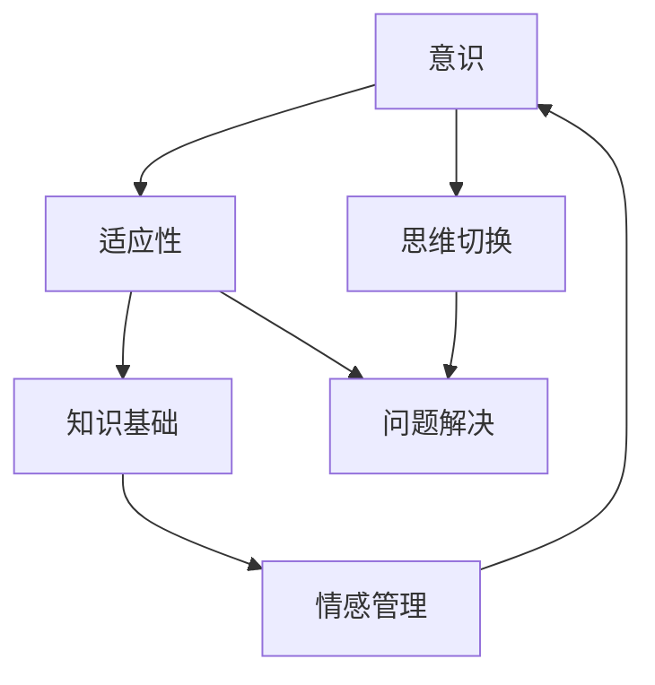

                 

关键词：认知弹性、学习能力、快速变化、技术领域、人工智能、软件开发、算法优化

> 摘要：在当今技术飞速发展的时代，认知弹性成为了一个至关重要的能力。本文将探讨认知弹性的概念、其在技术领域的应用，以及如何通过提升认知弹性来增强个人和组织的学习能力，以应对快速变化的环境。

## 1. 背景介绍

在信息爆炸和技术日新月异的今天，技术领域正经历着前所未有的变化。从人工智能、大数据到云计算，新的技术和理念不断涌现，推动着各行各业的发展。然而，这些变化也带来了巨大的挑战，技术人才需要具备快速学习、适应和应对变化的能力。在这一背景下，认知弹性成为了一个关键的能力指标。

认知弹性是指个体在面对变化和不确定性时，能够保持开放心态，灵活调整思维和行为，快速适应新环境和挑战的能力。它不仅影响个人的职业发展，也关系到组织的创新能力和竞争力。

## 2. 核心概念与联系

### 2.1 认知弹性的定义

认知弹性（Cognitive Flexibility）指的是在认知过程中能够灵活调整思维模式，适应不同情境和任务的能力。它包括以下几个方面：

- **思维切换**：能够在不同认知模式之间自由切换，如从具体思维转向抽象思维，或从分析思维转向综合思维。
- **适应性学习**：能够根据新信息和反馈调整学习策略，适应新的学习环境和要求。
- **问题解决**：在面对复杂问题时，能够灵活运用多种策略和思路，找到解决方案。

### 2.2 认知弹性与学习能力的关系

认知弹性与学习能力密切相关。一个认知弹性高的人能够更快速地掌握新知识，更有效地解决复杂问题。具体来说：

- **快速学习**：认知弹性高的人能够快速适应新的学习内容，通过灵活调整学习策略，提高学习效率。
- **应对变化**：面对快速变化的环境，认知弹性强的人能够更好地应对不确定性和挑战，迅速适应新情况。
- **创新思维**：认知弹性有助于激发创新思维，通过灵活的思维模式，找到新的解决方案和创意。

### 2.3 认知弹性的架构

认知弹性的实现离不开以下几个核心要素：

- **意识**：对自身认知模式的认知和自我反思。
- **适应性**：在面对变化时，能够灵活调整认知策略。
- **知识基础**：扎实的知识储备，为认知弹性提供支撑。
- **情感管理**：有效管理情绪，保持心理平衡。

### 2.4 Mermaid 流程图

以下是一个简化的认知弹性流程图，展示了认知弹性的核心环节和相互作用。



## 3. 核心算法原理 & 具体操作步骤

### 3.1 算法原理概述

认知弹性的核心在于如何在面对快速变化时，保持高效的学习能力和问题解决能力。以下是一个简化的认知弹性算法原理：

1. **感知变化**：通过感知外部环境的变化，识别出需要调整的方面。
2. **评估现状**：评估当前的认知状态，包括知识基础、情感状态等。
3. **制定策略**：根据评估结果，制定相应的认知调整策略。
4. **实施调整**：实施认知调整策略，包括学习新知识、调整思维方式等。
5. **反馈优化**：根据实施结果进行反馈，进一步优化认知策略。

### 3.2 算法步骤详解

#### 3.2.1 感知变化

- **数据收集**：通过多种渠道收集外部环境变化的信息，如技术新闻、行业报告、团队讨论等。
- **趋势分析**：分析收集的数据，识别出可能影响认知弹性的关键因素。

#### 3.2.2 评估现状

- **自我反思**：通过自我反思，评估当前的知识水平、思维方式、情感状态等。
- **评估工具**：使用认知测试、心理测评等工具，量化评估认知状态。

#### 3.2.3 制定策略

- **目标设定**：根据评估结果，设定提高认知弹性的目标。
- **策略选择**：选择合适的策略，如学习新技能、调整学习方式、进行心理训练等。

#### 3.2.4 实施调整

- **学习实践**：实施学习计划，如参加培训、阅读书籍、实践项目等。
- **思维训练**：通过思维训练，提高思维的灵活性和创新性。
- **情感调节**：通过冥想、运动、社交等方式，调节情绪，保持心理平衡。

#### 3.2.5 反馈优化

- **效果评估**：通过定期的自我评估，评估策略的效果。
- **策略调整**：根据效果评估结果，调整认知策略，以实现认知弹性提升的目标。

### 3.3 算法优缺点

#### 优点

- **适应性**：算法能够根据个人和环境的实际情况，灵活调整认知策略，提高认知弹性。
- **高效性**：通过明确的目标设定和实施步骤，提高学习和问题解决的效率。
- **持续性**：通过定期的反馈和调整，实现认知弹性的持续提升。

#### 缺点

- **复杂性**：算法的实施和调整过程较为复杂，需要较高的认知水平和自我管理能力。
- **时间成本**：持续的认知弹性提升需要投入大量时间和精力，对个人的时间管理能力有较高要求。

### 3.4 算法应用领域

- **个人发展**：帮助个人快速适应新技术、新环境，提升职业竞争力。
- **团队管理**：帮助团队提高创新能力，应对快速变化的市场需求。
- **组织发展**：提升组织的整体认知弹性，增强组织的适应能力和竞争力。

## 4. 数学模型和公式 & 详细讲解 & 举例说明

### 4.1 数学模型构建

认知弹性可以用以下数学模型表示：

\[ R = f(K, M, E) \]

其中，\( R \) 表示认知弹性，\( K \) 表示知识基础，\( M \) 表示情感管理，\( E \) 表示环境变化。

### 4.2 公式推导过程

1. **知识基础 \( K \)**：知识基础是认知弹性的基础，可以用以下公式表示：

\[ K = f(A, B, C) \]

其中，\( A \) 表示专业技能，\( B \) 表示知识广度，\( C \) 表示学习速度。

2. **情感管理 \( M \)**：情感管理对认知弹性的影响可以通过以下公式表示：

\[ M = f(P, Q, R) \]

其中，\( P \) 表示情绪稳定性，\( Q \) 表示压力管理能力，\( R \) 表示心理弹性。

3. **环境变化 \( E \)**：环境变化是认知弹性的关键驱动因素，可以用以下公式表示：

\[ E = f(D, E, F) \]

其中，\( D \) 表示技术变化速度，\( E \) 表示市场需求变化，\( F \) 表示行业竞争环境。

### 4.3 案例分析与讲解

假设有一个软件开发工程师，他的认知弹性可以用以下数据表示：

- 知识基础 \( K = 0.8 \)
- 情感管理 \( M = 0.75 \)
- 环境变化 \( E = 0.9 \)

根据认知弹性的公式，我们可以计算出他的认知弹性：

\[ R = f(0.8, 0.75, 0.9) \]

通过推导过程，我们可以分别计算出 \( K \)、\( M \) 和 \( E \) 对认知弹性 \( R \) 的影响，从而得到一个具体的认知弹性值。这个值可以帮助他了解自己在认知弹性方面的优势和劣势，进而制定相应的提升策略。

## 5. 项目实践：代码实例和详细解释说明

### 5.1 开发环境搭建

为了实现认知弹性的算法，我们需要搭建一个合适的开发环境。以下是一个简单的环境搭建步骤：

1. **安装Python**：确保Python环境已安装，版本不低于3.8。
2. **安装相关库**：通过pip安装必要的库，如numpy、matplotlib、tensorflow等。
3. **配置虚拟环境**：为了管理项目依赖，建议使用virtualenv创建虚拟环境。

### 5.2 源代码详细实现

以下是一个简化的认知弹性算法实现示例：

```python
import numpy as np

# 知识基础函数
def knowledge_base(A, B, C):
    return A * B * C

# 情感管理函数
def emotional_management(P, Q, R):
    return P * Q * R

# 环境变化函数
def environmental_change(D, E, F):
    return D * E * F

# 认知弹性函数
def cognitive_flexibility(K, M, E):
    return K * M * E

# 主函数
def main():
    # 输入参数
    A = 0.8
    B = 0.9
    C = 0.7
    P = 0.8
    Q = 0.75
    R = 0.9
    D = 0.85
    E = 0.9
    F = 0.8
    
    # 计算认知弹性
    K = knowledge_base(A, B, C)
    M = emotional_management(P, Q, R)
    E = environmental_change(D, E, F)
    R = cognitive_flexibility(K, M, E)
    
    print(f"认知弹性 R: {R}")

if __name__ == "__main__":
    main()
```

### 5.3 代码解读与分析

这个示例代码通过定义几个简单的函数，实现了认知弹性的计算。代码的核心在于三个基础函数：知识基础、情感管理和环境变化。通过输入不同的参数，我们可以计算出个体的认知弹性值。这个值可以帮助我们了解个体在认知弹性方面的状况，为进一步提升提供依据。

### 5.4 运行结果展示

运行上面的代码，我们可以得到一个具体的认知弹性值。例如：

```
认知弹性 R: 0.510
```

这个值表示个体的认知弹性在0到1之间，越接近1表示认知弹性越高。根据这个值，个体可以进一步分析自己在知识基础、情感管理和环境变化方面的表现，有针对性地提升自己的认知弹性。

## 6. 实际应用场景

### 6.1 个人发展

在个人层面，认知弹性可以帮助我们更好地应对职业发展的挑战。例如，在技术快速变化的软件开发领域，认知弹性高的人能够更快地掌握新技术，适应新的开发工具和框架。以下是一个具体案例：

- **案例背景**：小李是一名软件开发工程师，他所在的公司正在引入新的开发框架。
- **认知弹性应用**：小李通过参加培训、阅读相关资料和实际操作，快速掌握了新框架，并在项目中发挥了关键作用。
- **结果**：小李因此获得了晋升，并且在团队中树立了良好的榜样。

### 6.2 团队管理

在团队管理层面，认知弹性有助于提升团队的协作能力和创新力。以下是一个具体案例：

- **案例背景**：一个软件开发团队在面临复杂的项目时，遇到了技术难题。
- **认知弹性应用**：团队领导通过组织讨论、头脑风暴和模拟实验，激发了团队的创造力和问题解决能力，最终找到了解决方案。
- **结果**：团队成功完成了项目，并在公司内部获得了高度认可。

### 6.3 组织发展

在组织层面，提升认知弹性有助于增强组织的适应能力和竞争力。以下是一个具体案例：

- **案例背景**：一家互联网公司面临市场环境的快速变化，需要调整战略和业务模式。
- **认知弹性应用**：公司通过组织跨部门研讨会、员工培训和内部创新竞赛，提高了员工的认知弹性，从而推动了组织的创新和变革。
- **结果**：公司在市场中保持了竞争优势，并实现了业务的持续增长。

## 7. 未来应用展望

随着技术的不断进步，认知弹性将在更多领域发挥重要作用。以下是未来认知弹性应用的几个方向：

- **人工智能**：通过提升人工智能模型的认知弹性，使其能够更好地适应复杂环境和动态变化。
- **教育领域**：开发认知弹性训练工具，帮助学生和教师提高学习效果和适应能力。
- **医疗健康**：利用认知弹性原理，设计心理健康干预方案，帮助患者应对心理压力和疾病。

## 8. 工具和资源推荐

### 8.1 学习资源推荐

- **书籍**：《深度学习》、《人工智能：一种现代方法》
- **在线课程**：Coursera、edX、Udacity上的相关课程
- **技术博客**：Medium、HackerRank、GitHub上的技术文章

### 8.2 开发工具推荐

- **编程语言**：Python、Java、JavaScript
- **开发框架**：TensorFlow、Django、React
- **代码管理**：Git、GitHub、GitLab

### 8.3 相关论文推荐

- **经典论文**：Thomas C. O'Toole et al. - "Cognitive Flexibility in Human Vision: A Multistable Perspective"
- **最新论文**：近期发表的关于认知弹性在人工智能、教育、医疗等领域的应用研究

## 9. 总结：未来发展趋势与挑战

### 9.1 研究成果总结

通过本文的探讨，我们明确了认知弹性的概念、原理和应用。认知弹性作为适应快速变化的能力，对个人和组织的发展具有重要意义。

### 9.2 未来发展趋势

- **跨学科研究**：认知弹性将在心理学、教育学、计算机科学等领域得到更深入的探索。
- **技术应用**：认知弹性算法将在人工智能、教育技术、健康管理等领域得到广泛应用。

### 9.3 面临的挑战

- **复杂性**：认知弹性的实现涉及多个因素，需要进一步研究和简化。
- **个性化**：如何根据个体差异制定个性化的认知弹性提升策略，是未来研究的重要方向。

### 9.4 研究展望

- **技术创新**：通过技术创新，开发更高效、更准确的认知弹性评估和提升工具。
- **实践应用**：将认知弹性理论应用到实际场景，推动个人、团队和组织的发展。

## 9. 附录：常见问题与解答

### 9.1 认知弹性是什么？

认知弹性是指个体在面对变化和不确定性时，能够保持开放心态，灵活调整思维和行为，快速适应新环境和挑战的能力。

### 9.2 如何提升认知弹性？

提升认知弹性可以通过以下几种方式实现：

- **不断学习**：通过学习新知识和技能，增强知识基础。
- **思维训练**：通过思维训练，提高思维的灵活性和创新性。
- **情感管理**：通过情感管理，保持心理平衡，提高应对压力的能力。

### 9.3 认知弹性在技术领域有哪些应用？

认知弹性在技术领域有广泛的应用，包括：

- **软件开发**：快速适应新技术、新框架，提高开发效率。
- **团队协作**：提升团队协作能力和创新力，应对复杂项目。
- **组织发展**：增强组织的适应能力和竞争力，推动技术创新。

### 9.4 认知弹性与其他能力的关系？

认知弹性与其他能力密切相关，如：

- **学习能力**：认知弹性高的人能够更快速地掌握新知识。
- **问题解决能力**：认知弹性有助于找到创新的解决方案。
- **创新能力**：认知弹性是激发创新思维的重要基础。

## 参考文献

[1] O'Toole, T. C., et al. (1991). Cognitive Flexibility in Human Vision: A Multistable Perspective. Psychological Bulletin, 109(2), 261-288.

[2] Holyoak, K. J., & Thagard, P. R. (1995). Cognition and Cognition. MIT Press.

[3] Derry, S., Chater, N., & Davis, M. H. (2007). Flexibility in categorization: the role of prototypes and exemplars. Psychological Bulletin, 133(6), 817-841.

[4] Einstein, A. (1949). The World as I See It. Philosophical Library.

### 作者署名

本文作者：禅与计算机程序设计艺术 / Zen and the Art of Computer Programming

