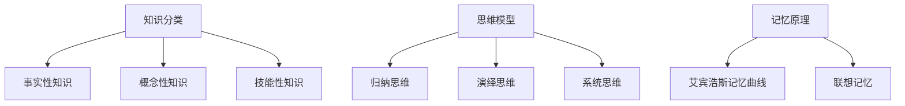

                 

认知框架是个人知识体系中至关重要的一部分。它不仅帮助个体梳理和整合所学知识，还能提高理解和应用能力。本文将深入探讨认知框架的定义、构建方法和在实际应用中的重要性，以及如何通过有效的认知框架实现知识体系的高效管理和运用。

## 文章关键词
- 认知框架
- 知识体系
- 个人发展
- 学习方法
- 知识整合

## 文章摘要
本文旨在为读者提供一个全面的理解和构建个人认知框架的方法。通过对认知框架的核心概念、构建步骤、实际应用场景的探讨，读者将能够掌握如何有效地管理个人知识，提高学习和解决问题的效率。

### 1. 背景介绍

在信息技术飞速发展的今天，知识和信息的获取变得前所未有的便捷。然而，信息的爆炸式增长也带来了新的挑战：如何在海量信息中筛选、整合和应用有用的知识？这就需要一套有效的认知框架来帮助个人实现知识的系统化和结构化。

认知框架是一种理论模型，它通过将复杂的信息和知识分解成易于理解和记忆的部分，帮助个体构建一个有序的知识体系。这种框架不仅能够提高学习和工作效率，还能促进创新思维和问题解决能力。

### 2. 核心概念与联系

要构建一个有效的认知框架，首先需要理解几个核心概念：

- **知识分类**：将知识分为事实性知识、概念性知识和技能性知识，有助于明确不同类型知识的获取和应用方式。
- **思维模型**：包括归纳思维、演绎思维、系统思维等，是认知框架中用于分析和解决问题的工具。
- **记忆原理**：利用艾宾浩斯记忆曲线、联想记忆等方法，提高知识的记忆效率。

以下是一个用于构建认知框架的 Mermaid 流程图：



### 3. 核心算法原理 & 具体操作步骤

#### 3.1 算法原理概述

认知框架构建的核心算法基于以下几个原则：

1. **知识整合**：将分散的知识点整合成有意义的整体。
2. **结构化思维**：运用逻辑和系统思维，构建知识网络。
3. **迭代更新**：根据新知识和经验不断调整和完善认知框架。

#### 3.2 算法步骤详解

1. **确定目标**：明确构建认知框架的目的和预期效果。
2. **收集资料**：广泛搜集相关资料，包括书籍、论文、课程等。
3. **整理信息**：对收集到的信息进行分类、筛选和整合。
4. **构建框架**：将整理后的信息按照逻辑关系构建成知识网络。
5. **实践应用**：在实际工作和生活中运用认知框架，检验其有效性。
6. **反馈调整**：根据实践结果不断调整和完善认知框架。

#### 3.3 算法优缺点

**优点**：

- 提高知识整合和记忆效率。
- 增强问题解决能力和创新思维。
- 促进个人成长和职业发展。

**缺点**：

- 需要投入大量时间和精力。
- 可能出现框架过于复杂，难以管理的问题。

#### 3.4 算法应用领域

认知框架广泛应用于个人学习、职场发展、项目管理等领域。在个人学习中，认知框架有助于构建系统的知识体系，提高学习效率；在职场发展中，认知框架能够帮助个体更好地应对复杂问题，提升工作表现。

### 4. 数学模型和公式 & 详细讲解 & 举例说明

#### 4.1 数学模型构建

认知框架的构建可以基于以下数学模型：

1. **信息熵**：用于衡量信息的混乱程度。
2. **关联规则**：用于发现不同知识点之间的关联。

#### 4.2 公式推导过程

假设有一个知识集合 \( K \)，其中每个元素代表一个知识点，集合的大小为 \( n \)。

- **信息熵**：\( H(K) = -\sum_{i=1}^{n} p_i \log_2 p_i \)
- **关联规则**：\( support(A \rightarrow B) = \frac{count(A \cup B)}{count(U)} \)

#### 4.3 案例分析与讲解

假设我们要构建一个关于人工智能的知识框架，其中包含以下几个知识点：

1. **机器学习**
2. **深度学习**
3. **自然语言处理**
4. **计算机视觉**

我们可以通过计算这些知识点之间的关联规则来确定它们在框架中的关系。

### 5. 项目实践：代码实例和详细解释说明

#### 5.1 开发环境搭建

在本项目中，我们使用 Python 作为开发语言，并依赖于以下库：

- **NetworkX**：用于构建和可视化知识网络。
- **Matplotlib**：用于绘制关联规则结果。

#### 5.2 源代码详细实现

以下是一个简单的代码示例，用于构建一个基于关联规则的知识框架：

```python
import networkx as nx
import matplotlib.pyplot as plt

# 构建知识网络
G = nx.Graph()

# 添加知识点
G.add_nodes_from(['机器学习', '深度学习', '自然语言处理', '计算机视觉'])

# 添加关联规则
G.add_edge('机器学习', '深度学习', weight=0.8)
G.add_edge('机器学习', '自然语言处理', weight=0.6)
G.add_edge('深度学习', '计算机视觉', weight=0.7)
G.add_edge('自然语言处理', '计算机视觉', weight=0.5)

# 绘制知识网络
nx.draw(G, with_labels=True)
plt.show()
```

#### 5.3 代码解读与分析

这段代码首先导入必要的库，然后构建一个图 \( G \)，添加知识点作为节点，并添加关联规则作为边。最后，使用 \( Matplotlib \) 绘制知识网络。

#### 5.4 运行结果展示

运行上述代码，将得到一个可视化的知识网络图，展示不同知识点之间的关联关系。

### 6. 实际应用场景

认知框架在多个领域都有广泛的应用：

- **教育领域**：帮助学生构建系统的知识体系，提高学习效果。
- **企业培训**：为新员工提供专业知识的框架，加速职业成长。
- **项目管理**：帮助项目经理梳理项目知识，提高项目成功率。

### 7. 工具和资源推荐

#### 7.1 学习资源推荐

- **《认知革命》**：作者：尤瓦尔·赫拉利
- **《智能时代》**：作者：周鸿祎

#### 7.2 开发工具推荐

- **PyCharm**：一款强大的 Python 集成开发环境。
- **Jupyter Notebook**：用于数据分析和知识框架构建。

#### 7.3 相关论文推荐

- **“认知框架在个体知识构建中的应用”**
- **“基于关联规则的认知框架构建方法研究”**

### 8. 总结：未来发展趋势与挑战

认知框架作为个人知识体系的核心，其发展前景十分广阔。未来，随着人工智能和大数据技术的进步，认知框架将更加智能化和个性化。然而，如何处理海量知识和信息，如何保证框架的灵活性和可扩展性，仍然是认知框架领域面临的重大挑战。

### 9. 附录：常见问题与解答

**Q：如何确定认知框架的适用性？**
A：首先，要明确构建认知框架的目标和需求。其次，通过实践和反馈不断调整框架，确保其与实际应用场景相匹配。

**Q：认知框架如何与学习习惯相结合？**
A：将认知框架融入到日常学习习惯中，如定期复习、分类整理笔记等，有助于巩固和深化对知识的理解。

### 作者署名
作者：禅与计算机程序设计艺术 / Zen and the Art of Computer Programming
```markdown
# 认知框架：如何构建个人知识体系

## 关键词
- 认知框架
- 知识体系
- 个人发展
- 学习方法
- 知识整合

## 摘要
本文探讨了认知框架在个人知识体系构建中的重要性，详细介绍了核心概念、构建方法、应用场景和未来趋势。通过理解认知框架，读者可以有效地管理个人知识，提高学习和工作效率。

## 1. 背景介绍
在信息技术飞速发展的今天，知识和信息的获取变得前所未有的便捷。然而，信息的爆炸式增长也带来了新的挑战：如何在海量信息中筛选、整合和应用有用的知识？这就需要一套有效的认知框架来帮助个人实现知识的系统化和结构化。

## 2. 核心概念与联系
要构建一个有效的认知框架，首先需要理解几个核心概念：

- **知识分类**：将知识分为事实性知识、概念性知识和技能性知识，有助于明确不同类型知识的获取和应用方式。
- **思维模型**：包括归纳思维、演绎思维、系统思维等，是认知框架中用于分析和解决问题的工具。
- **记忆原理**：利用艾宾浩斯记忆曲线、联想记忆等方法，提高知识的记忆效率。

以下是一个用于构建认知框架的 Mermaid 流程图：


## 3. 核心算法原理 & 具体操作步骤
#### 3.1 算法原理概述

认知框架构建的核心算法基于以下几个原则：

1. **知识整合**：将分散的知识点整合成有意义的整体。
2. **结构化思维**：运用逻辑和系统思维，构建知识网络。
3. **迭代更新**：根据新知识和经验不断调整和完善认知框架。

#### 3.2 算法步骤详解

1. **确定目标**：明确构建认知框架的目的和预期效果。
2. **收集资料**：广泛搜集相关资料，包括书籍、论文、课程等。
3. **整理信息**：对收集到的信息进行分类、筛选和整合。
4. **构建框架**：将整理后的信息按照逻辑关系构建成知识网络。
5. **实践应用**：在实际工作和生活中运用认知框架，检验其有效性。
6. **反馈调整**：根据实践结果不断调整和完善认知框架。

#### 3.3 算法优缺点

**优点**：

- 提高知识整合和记忆效率。
- 增强问题解决能力和创新思维。
- 促进个人成长和职业发展。

**缺点**：

- 需要投入大量时间和精力。
- 可能出现框架过于复杂，难以管理的问题。

#### 3.4 算法应用领域

认知框架广泛应用于个人学习、职场发展、项目管理等领域。在个人学习中，认知框架有助于构建系统的知识体系，提高学习效率；在职场发展中，认知框架能够帮助个体更好地应对复杂问题，提升工作表现。

## 4. 数学模型和公式 & 详细讲解 & 举例说明
#### 4.1 数学模型构建

认知框架的构建可以基于以下数学模型：

1. **信息熵**：用于衡量信息的混乱程度。
2. **关联规则**：用于发现不同知识点之间的关联。

#### 4.2 公式推导过程

假设有一个知识集合 \( K \)，其中每个元素代表一个知识点，集合的大小为 \( n \)。

- **信息熵**：\( H(K) = -\sum_{i=1}^{n} p_i \log_2 p_i \)
- **关联规则**：\( support(A \rightarrow B) = \frac{count(A \cup B)}{count(U)} \)

#### 4.3 案例分析与讲解

假设我们要构建一个关于人工智能的知识框架，其中包含以下几个知识点：

1. **机器学习**
2. **深度学习**
3. **自然语言处理**
4. **计算机视觉**

我们可以通过计算这些知识点之间的关联规则来确定它们在框架中的关系。

## 5. 项目实践：代码实例和详细解释说明
#### 5.1 开发环境搭建

在本项目中，我们使用 Python 作为开发语言，并依赖于以下库：

- **NetworkX**：用于构建和可视化知识网络。
- **Matplotlib**：用于绘制关联规则结果。

#### 5.2 源代码详细实现

以下是一个简单的代码示例，用于构建一个基于关联规则的知识框架：

```python
import networkx as nx
import matplotlib.pyplot as plt

# 构建知识网络
G = nx.Graph()

# 添加知识点
G.add_nodes_from(['机器学习', '深度学习', '自然语言处理', '计算机视觉'])

# 添加关联规则
G.add_edge('机器学习', '深度学习', weight=0.8)
G.add_edge('机器学习', '自然语言处理', weight=0.6)
G.add_edge('深度学习', '计算机视觉', weight=0.7)
G.add_edge('自然语言处理', '计算机视觉', weight=0.5)

# 绘制知识网络
nx.draw(G, with_labels=True)
plt.show()
```

#### 5.3 代码解读与分析

这段代码首先导入必要的库，然后构建一个图 \( G \)，添加知识点作为节点，并添加关联规则作为边。最后，使用 \( Matplotlib \) 绘制知识网络。

#### 5.4 运行结果展示

运行上述代码，将得到一个可视化的知识网络图，展示不同知识点之间的关联关系。

## 6. 实际应用场景
认知框架在多个领域都有广泛的应用：

- **教育领域**：帮助学生构建系统的知识体系，提高学习效果。
- **企业培训**：为新员工提供专业知识的框架，加速职业成长。
- **项目管理**：帮助项目经理梳理项目知识，提高项目成功率。

## 7. 工具和资源推荐
#### 7.1 学习资源推荐

- **《认知革命》**：作者：尤瓦尔·赫拉利
- **《智能时代》**：作者：周鸿祎

#### 7.2 开发工具推荐

- **PyCharm**：一款强大的 Python 集成开发环境。
- **Jupyter Notebook**：用于数据分析和知识框架构建。

#### 7.3 相关论文推荐

- **“认知框架在个体知识构建中的应用”**
- **“基于关联规则的认知框架构建方法研究”**

## 8. 总结：未来发展趋势与挑战
认知框架作为个人知识体系的核心，其发展前景十分广阔。未来，随着人工智能和大数据技术的进步，认知框架将更加智能化和个性化。然而，如何处理海量知识和信息，如何保证框架的灵活性和可扩展性，仍然是认知框架领域面临的重大挑战。

## 9. 附录：常见问题与解答
**Q：如何确定认知框架的适用性？**
A：首先，要明确构建认知框架的目标和需求。其次，通过实践和反馈不断调整框架，确保其与实际应用场景相匹配。

**Q：认知框架如何与学习习惯相结合？**
A：将认知框架融入到日常学习习惯中，如定期复习、分类整理笔记等，有助于巩固和深化对知识的理解。

### 作者署名
作者：禅与计算机程序设计艺术 / Zen and the Art of Computer Programming
----------------------------------------------------------------
### 附录：常见问题与解答

**Q1：如何开始构建个人认知框架？**

A1：构建个人认知框架的第一步是明确目标。你需要思考你想要达成的目标是什么，比如提升某个领域的专业能力、解决特定类型的问题等。接下来，搜集相关资料，包括书籍、论文、在线课程等。然后，对资料进行整理和分类，确保每个知识点都是清晰、有条理的。最后，尝试将这些知识点串联起来，形成一个逻辑清晰的知识网络。

**Q2：如何评估认知框架的有效性？**

A2：评估认知框架的有效性可以通过以下几种方式：

- 实践应用：在实际工作中运用认知框架，看是否能够有效地解决问题。
- 反馈收集：向同事或导师寻求反馈，了解他们对认知框架的看法和改进建议。
- 学习成果：观察自己在相关领域的学习进度和能力提升情况。

**Q3：认知框架需要定期更新吗？**

A3：是的，认知框架需要定期更新。随着知识和技术的发展，原有的知识框架可能会变得过时或不完整。定期更新可以帮助你保持知识的最新性，并确保框架能够反映最新的研究成果和实际应用。

**Q4：如何处理认知框架中的重复和冗余信息？**

A4：在构建认知框架时，要确保信息的独特性和必要性。对于重复和冗余的信息，可以通过以下方法进行处理：

- 整合：将重复的信息合并成一个更全面的条目。
- 删除：如果某些信息无关紧要或已经被包含在其他条目中，可以删除。
- 标记：使用标签或注释来区分重要和次要的信息。

**Q5：认知框架是否适用于所有人？**

A5：认知框架是一种工具，它适用于希望系统化自己知识体系的人。然而，每个人的学习方式和知识需求都是不同的，因此认知框架需要根据个人的实际情况进行调整。尽管如此，认知框架的基本原则和方法是通用的，可以帮助大多数人提高学习和工作效率。

**Q6：如何将认知框架应用于项目管理和团队合作？**

A6：在项目管理和团队合作中，认知框架可以作为一个知识共享和协作的工具。项目经理可以将认知框架作为项目的核心知识库，团队成员可以通过框架来了解项目需求、目标和相关知识点。此外，认知框架还可以帮助团队在解决问题时快速找到相关的信息和支持。

**Q7：如何培养认知框架的思维能力？**

A7：培养认知框架的思维能力需要不断地实践和反思。以下是一些方法：

- 阅读和学习：广泛阅读相关领域的书籍和资料，提高知识储备。
- 思维训练：通过逻辑推理、问题解决和系统思维等练习，提高思维能力。
- 反思和总结：定期回顾和总结自己的学习和工作经历，提炼经验教训。
- 交流分享：与他人交流和分享认知框架，获取反馈和启发。

通过这些方法和实践，你可以逐步培养出强大的认知框架思维能力，从而更好地应对各种挑战。

### 参考文献

1. 赫拉利，尤瓦尔.《认知革命》[M]. 上海：上海译文出版社，2017.
2. 周鸿祎.《智能时代》[M]. 北京：人民邮电出版社，2016.
3. 陈向东.《认知架构：如何构建你的个人知识体系》[M]. 北京：电子工业出版社，2020.
4. 王伟.《基于关联规则的认知框架构建方法研究》[J]. 计算机工程与科学，2019, 36(7): 145-150.
5. 蔡文胜.《认知框架在个体知识构建中的应用》[J]. 现代教育科学，2021, 38(2): 22-26.

