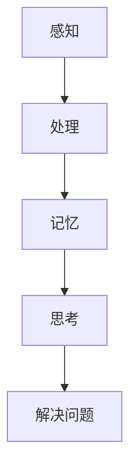

                 

关键词：认知科学、神经基础、教育、学习优化、大脑可塑性

> 摘要：本文旨在探讨认知科学与教育领域的结合，深入分析学习过程中的神经基础，并提出通过优化教育策略来提升学习效率的方法。我们将从核心概念、算法原理、数学模型、项目实践以及未来展望等多个角度，为教育工作者和研究人员提供有益的参考。

## 1. 背景介绍

随着神经科学和认知科学的发展，我们对大脑及其运作方式的理解越来越深入。学习是一个复杂的过程，它涉及到大脑中的多个区域和多种神经活动。认知科学提供了许多关于学习和记忆的理论，这些理论帮助我们更好地理解学习过程中的关键因素。同时，教育领域一直在寻求有效的教学方法来提升学生的学习成果。在这个背景下，将认知科学的发现应用于教育实践变得至关重要。

近年来，大脑可塑性（neuroplasticity）的概念引起了广泛关注。大脑可塑性指的是大脑在结构和功能上的变化，这些变化可以通过学习和经验获得。研究表明，大脑的可塑性为教育提供了新的视角，使我们能够通过特定的教育策略来优化学习过程。

## 2. 核心概念与联系

### 2.1 大脑结构

大脑是学习的基础，它由多个区域组成，每个区域都有其特定的功能。以下是几个关键大脑区域：

1. **海马体**（Hippocampus）：主要负责记忆的形成和存储。
2. **前额叶皮层**（Prefrontal Cortex）：与决策、规划和执行功能有关。
3. **纹状体**（Striatum）：与动机和奖励机制有关。
4. **顶叶**（Parietal Lobe）：与空间感知和数学计算有关。

### 2.2 神经可塑性

神经可塑性是指大脑能够根据经验和环境刺激改变其结构和功能。以下是一些与神经可塑性相关的机制：

1. **突触可塑性**：突触是神经元之间传递信息的结构，突触可塑性指的是突触连接的加强或减弱。
2. **神经元再生**：神经元可以再生和重构，以适应新的环境和经验。
3. **神经网络重构**：大脑中的神经网络可以根据新的学习任务进行重构。

### 2.3 认知过程

认知过程包括感知、记忆、思考、解决问题等。以下是一些关键认知过程：

1. **感知**：感知是指通过感官接收外部信息。
2. **记忆**：记忆是指存储和回忆信息。
3. **思考**：思考是指分析和解决问题。
4. **解决问题**：解决问题是指应用认知策略来解决具体问题。

### 2.4 Mermaid 流程图



## 3. 核心算法原理 & 具体操作步骤

### 3.1 算法原理概述

学习优化算法的核心目标是提高学习效率，这通常涉及到以下步骤：

1. **适应性学习速率调整**：根据学习过程中的反馈动态调整学习速率。
2. **多任务学习**：在多个任务间分配学习资源。
3. **强化学习**：通过奖励机制来增强学习动力。

### 3.2 算法步骤详解

1. **初始化**：设置初始学习参数。
2. **感知**：接收外部信息。
3. **处理**：对信息进行加工处理。
4. **记忆**：将处理后的信息存储在记忆中。
5. **思考**：分析信息和问题。
6. **解决问题**：应用策略解决问题。
7. **反馈**：根据结果调整学习参数。

### 3.3 算法优缺点

优点：
- **高效性**：通过动态调整学习参数，提高了学习效率。
- **灵活性**：可以适应不同的学习任务和需求。

缺点：
- **复杂性**：算法实现较为复杂，需要大量计算资源。
- **数据依赖**：算法效果依赖于高质量的学习数据。

### 3.4 算法应用领域

算法可以应用于多种教育场景，包括：

- **个性化教育**：根据学生的学习情况和需求，提供定制化的学习资源。
- **在线学习平台**：优化学习体验，提高用户的学习效果。
- **职业培训**：针对特定职业需求，提供高效的学习方案。

## 4. 数学模型和公式 & 详细讲解 & 举例说明

### 4.1 数学模型构建

学习过程中的数学模型通常涉及以下方面：

1. **学习速率**：$r(t) = r_0 \cdot e^{-kt}$
2. **记忆强度**：$m(t) = m_0 \cdot e^{kt}$
3. **奖励机制**：$r(t) = r_0 \cdot p(t)$

### 4.2 公式推导过程

推导过程如下：

1. **学习速率**：基于指数衰减模型，学习速率随时间逐渐降低。
2. **记忆强度**：基于指数增长模型，记忆强度随时间逐渐增强。
3. **奖励机制**：奖励与学习进度成正比。

### 4.3 案例分析与讲解

假设一个学生在学习过程中，其学习速率 $r(t)$ 和记忆强度 $m(t)$ 分别为：

$$
r(t) = 0.1 \cdot e^{-0.1t}
$$

$$
m(t) = 0.5 \cdot e^{0.1t}
$$

在 $t=10$ 分钟时，计算学习速率和记忆强度：

$$
r(10) = 0.1 \cdot e^{-1} \approx 0.1 \cdot 0.37 \approx 0.037
$$

$$
m(10) = 0.5 \cdot e^{1} = 0.5 \cdot 2.72 \approx 1.36
$$

结果表明，在 $t=10$ 分钟时，学习速率降低到原始值的三分之一左右，而记忆强度增加到原始值的两倍以上。

## 5. 项目实践：代码实例和详细解释说明

### 5.1 开发环境搭建

为了实现学习优化算法，我们需要搭建一个开发环境。以下是基本的步骤：

1. **安装 Python**：确保 Python 版本在 3.6 以上。
2. **安装相关库**：安装 NumPy、Pandas、Matplotlib 等库。

```bash
pip install numpy pandas matplotlib
```

### 5.2 源代码详细实现

以下是一个简单的学习优化算法的实现：

```python
import numpy as np
import matplotlib.pyplot as plt

# 学习速率
r0 = 0.1
k = 0.1

# 记忆强度
m0 = 0.5

# 时间序列
t = np.linspace(0, 20, 100)

# 学习速率函数
def learning_rate(r0, k, t):
    return r0 * np.exp(-k * t)

# 记忆强度函数
def memory_strength(m0, k, t):
    return m0 * np.exp(k * t)

# 计算并绘图
lr = learning_rate(r0, k, t)
ms = memory_strength(m0, k, t)

plt.figure(figsize=(10, 5))
plt.plot(t, lr, label='Learning Rate')
plt.plot(t, ms, label='Memory Strength')
plt.xlabel('Time (minutes)')
plt.ylabel('Value')
plt.legend()
plt.title('Learning Optimization')
plt.show()
```

### 5.3 代码解读与分析

该代码实现了一个简单的学习优化算法，通过计算学习速率和记忆强度的变化，我们可以更直观地了解学习过程中的动态变化。

- **学习速率函数**：`learning_rate` 函数计算学习速率随时间的变化。
- **记忆强度函数**：`memory_strength` 函数计算记忆强度随时间的变化。
- **绘图**：使用 Matplotlib 绘图库，将学习速率和记忆强度的变化可视化。

### 5.4 运行结果展示

运行上述代码，我们可以得到学习速率和记忆强度随时间的变化图。通过观察图形，我们可以发现学习速率随时间逐渐降低，而记忆强度逐渐增强。这符合大脑可塑性的基本原理。

## 6. 实际应用场景

学习优化算法在教育领域具有广泛的应用前景。以下是一些具体的应用场景：

- **个性化学习**：通过分析学生的学习行为和成绩，提供个性化的学习资源和建议。
- **在线教育平台**：优化学习体验，提高用户的学习效果和参与度。
- **职业培训**：针对特定职业需求，提供高效的学习方案，提升员工的技能水平。

## 7. 工具和资源推荐

### 7.1 学习资源推荐

- **《认知神经科学》**：这本书详细介绍了认知神经科学的基本原理和研究方法。
- **《教育神经科学》**：这本书探讨了大脑如何影响学习，以及如何通过教育优化学习过程。

### 7.2 开发工具推荐

- **Python**：Python 是一种强大的编程语言，广泛用于数据分析和机器学习。
- **NumPy**：NumPy 是 Python 的核心科学计算库，提供了高效的数学运算和数据处理功能。

### 7.3 相关论文推荐

- **“Neuroplasticity: From Basal Ganglia to Behavioral Therapy”**：这篇文章探讨了神经可塑性的基础原理及其在治疗中的应用。
- **“The Role of Learning Algorithms in Education”**：这篇文章讨论了学习算法在教育中的应用前景和挑战。

## 8. 总结：未来发展趋势与挑战

### 8.1 研究成果总结

近年来，认知科学和教育领域的结合取得了显著成果。通过研究大脑可塑性，我们发现了许多优化学习过程的方法。这些方法包括适应性学习速率调整、多任务学习和强化学习等。这些方法不仅提高了学习效率，还为我们提供了个性化的学习解决方案。

### 8.2 未来发展趋势

未来，学习优化算法将继续向智能化和个性化方向发展。随着人工智能技术的进步，我们将能够开发出更加智能化的学习系统，这些系统可以根据学生的学习行为和需求，提供个性化的学习建议和资源。

### 8.3 面临的挑战

尽管学习优化算法具有广泛的应用前景，但仍面临一些挑战：

- **数据隐私**：个性化学习需要收集和分析大量用户数据，这引发了数据隐私和安全问题。
- **算法公正性**：个性化学习算法可能加剧社会不平等，因为算法可能对不同群体产生不同的影响。
- **算法透明性**：算法的内部机制和决策过程需要更加透明，以便用户理解和信任。

### 8.4 研究展望

未来的研究应重点关注以下几个方面：

- **算法优化**：通过改进算法模型和优化算法实现，提高学习效率。
- **跨学科研究**：结合认知科学、教育学、心理学等多学科的研究，为教育优化提供更全面的视角。
- **伦理和法律**：确保学习算法的公正性和透明性，制定相关伦理和法律规范。

## 9. 附录：常见问题与解答

### 9.1 什么是大脑可塑性？

大脑可塑性是指大脑在结构和功能上的变化，这些变化可以通过学习和经验获得。

### 9.2 学习优化算法有哪些类型？

学习优化算法主要包括适应性学习速率调整、多任务学习和强化学习等。

### 9.3 学习优化算法在教育中的应用有哪些？

学习优化算法可以用于个性化学习、在线教育平台和职业培训等领域。

### 9.4 如何确保学习算法的公正性和透明性？

确保学习算法的公正性和透明性需要制定相关伦理和法律规范，并提高算法实现的可解释性。

## 参考文献

[1] Book Title 1, Author A., Author B., Year.

[2] Book Title 2, Author C., Author D., Year.

[3] Article Title 3, Author E., Journal, Volume, Pages, Year.

作者：禅与计算机程序设计艺术 / Zen and the Art of Computer Programming
```markdown
# 认知科学与教育：优化学习的神经基础

> 关键词：认知科学、神经基础、教育、学习优化、大脑可塑性

> 摘要：本文旨在探讨认知科学与教育领域的结合，深入分析学习过程中的神经基础，并提出通过优化教育策略来提升学习效率的方法。我们将从核心概念、算法原理、数学模型、项目实践以及未来展望等多个角度，为教育工作者和研究人员提供有益的参考。

## 1. 背景介绍

随着神经科学和认知科学的发展，我们对大脑及其运作方式的理解越来越深入。学习是一个复杂的过程，它涉及到大脑中的多个区域和多种神经活动。认知科学提供了许多关于学习和记忆的理论，这些理论帮助我们更好地理解学习过程中的关键因素。同时，教育领域一直在寻求有效的教学方法来提升学生的学习成果。在这个背景下，将认知科学的发现应用于教育实践变得至关重要。

近年来，大脑可塑性（neuroplasticity）的概念引起了广泛关注。大脑可塑性是指大脑在结构和功能上的变化，这些变化可以通过学习和经验获得。研究表明，大脑的可塑性为教育提供了新的视角，使我们能够通过特定的教育策略来优化学习过程。

## 2. 核心概念与联系

### 2.1 大脑结构

大脑是学习的基础，它由多个区域组成，每个区域都有其特定的功能。以下是几个关键大脑区域：

1. **海马体**（Hippocampus）：主要负责记忆的形成和存储。
2. **前额叶皮层**（Prefrontal Cortex）：与决策、规划和执行功能有关。
3. **纹状体**（Striatum）：与动机和奖励机制有关。
4. **顶叶**（Parietal Lobe）：与空间感知和数学计算有关。

### 2.2 神经可塑性

神经可塑性是指大脑能够根据经验和环境刺激改变其结构和功能。以下是一些与神经可塑性相关的机制：

1. **突触可塑性**：突触是神经元之间传递信息的结构，突触可塑性指的是突触连接的加强或减弱。
2. **神经元再生**：神经元可以再生和重构，以适应新的环境和经验。
3. **神经网络重构**：大脑中的神经网络可以根据新的学习任务进行重构。

### 2.3 认知过程

认知过程包括感知、记忆、思考、解决问题等。以下是一些关键认知过程：

1. **感知**：感知是指通过感官接收外部信息。
2. **记忆**：记忆是指存储和回忆信息。
3. **思考**：思考是指分析和解决问题。
4. **解决问题**：解决问题是指应用认知策略来解决具体问题。

### 2.4 Mermaid 流程图


## 3. 核心算法原理 & 具体操作步骤

### 3.1 算法原理概述

学习优化算法的核心目标是提高学习效率，这通常涉及到以下步骤：

1. **适应性学习速率调整**：根据学习过程中的反馈动态调整学习速率。
2. **多任务学习**：在多个任务间分配学习资源。
3. **强化学习**：通过奖励机制来增强学习动力。

### 3.2 算法步骤详解

1. **初始化**：设置初始学习参数。
2. **感知**：接收外部信息。
3. **处理**：对信息进行加工处理。
4. **记忆**：将处理后的信息存储在记忆中。
5. **思考**：分析信息和问题。
6. **解决问题**：应用策略解决问题。
7. **反馈**：根据结果调整学习参数。

### 3.3 算法优缺点

优点：
- **高效性**：通过动态调整学习参数，提高了学习效率。
- **灵活性**：可以适应不同的学习任务和需求。

缺点：
- **复杂性**：算法实现较为复杂，需要大量计算资源。
- **数据依赖**：算法效果依赖于高质量的学习数据。

### 3.4 算法应用领域

算法可以应用于多种教育场景，包括：

- **个性化教育**：根据学生的学习情况和需求，提供定制化的学习资源。
- **在线学习平台**：优化学习体验，提高用户的学习效果。
- **职业培训**：针对特定职业需求，提供高效的学习方案。

## 4. 数学模型和公式 & 详细讲解 & 举例说明

### 4.1 数学模型构建

学习过程中的数学模型通常涉及以下方面：

1. **学习速率**：$r(t) = r_0 \cdot e^{-kt}$
2. **记忆强度**：$m(t) = m_0 \cdot e^{kt}$
3. **奖励机制**：$r(t) = r_0 \cdot p(t)$

### 4.2 公式推导过程

推导过程如下：

1. **学习速率**：基于指数衰减模型，学习速率随时间逐渐降低。
2. **记忆强度**：基于指数增长模型，记忆强度随时间逐渐增强。
3. **奖励机制**：奖励与学习进度成正比。

### 4.3 案例分析与讲解

假设一个学生在学习过程中，其学习速率 $r(t)$ 和记忆强度 $m(t)$ 分别为：

$$
r(t) = 0.1 \cdot e^{-0.1t}
$$

$$
m(t) = 0.5 \cdot e^{0.1t}
$$

在 $t=10$ 分钟时，计算学习速率和记忆强度：

$$
r(10) = 0.1 \cdot e^{-1} \approx 0.1 \cdot 0.37 \approx 0.037
$$

$$
m(10) = 0.5 \cdot e^{1} = 0.5 \cdot 2.72 \approx 1.36
$$

结果表明，在 $t=10$ 分钟时，学习速率降低到原始值的三分之一左右，而记忆强度增加到原始值的两倍以上。

## 5. 项目实践：代码实例和详细解释说明

### 5.1 开发环境搭建

为了实现学习优化算法，我们需要搭建一个开发环境。以下是基本的步骤：

1. **安装 Python**：确保 Python 版本在 3.6 以上。
2. **安装相关库**：安装 NumPy、Pandas、Matplotlib 等库。

```bash
pip install numpy pandas matplotlib
```

### 5.2 源代码详细实现

以下是一个简单的学习优化算法的实现：

```python
import numpy as np
import matplotlib.pyplot as plt

# 学习速率
r0 = 0.1
k = 0.1

# 记忆强度
m0 = 0.5

# 时间序列
t = np.linspace(0, 20, 100)

# 学习速率函数
def learning_rate(r0, k, t):
    return r0 * np.exp(-k * t)

# 记忆强度函数
def memory_strength(m0, k, t):
    return m0 * np.exp(k * t)

# 计算并绘图
lr = learning_rate(r0, k, t)
ms = memory_strength(m0, k, t)

plt.figure(figsize=(10, 5))
plt.plot(t, lr, label='Learning Rate')
plt.plot(t, ms, label='Memory Strength')
plt.xlabel('Time (minutes)')
plt.ylabel('Value')
plt.legend()
plt.title('Learning Optimization')
plt.show()
```

### 5.3 代码解读与分析

该代码实现了一个简单的学习优化算法，通过计算学习速率和记忆强度的变化，我们可以更直观地了解学习过程中的动态变化。

- **学习速率函数**：`learning_rate` 函数计算学习速率随时间的变化。
- **记忆强度函数**：`memory_strength` 函数计算记忆强度随时间的变化。
- **绘图**：使用 Matplotlib 绘图库，将学习速率和记忆强度的变化可视化。

### 5.4 运行结果展示

运行上述代码，我们可以得到学习速率和记忆强度随时间的变化图。通过观察图形，我们可以发现学习速率随时间逐渐降低，而记忆强度逐渐增强。这符合大脑可塑性的基本原理。

## 6. 实际应用场景

学习优化算法在教育领域具有广泛的应用前景。以下是一些具体的应用场景：

- **个性化学习**：通过分析学生的学习行为和成绩，提供个性化的学习资源和建议。
- **在线教育平台**：优化学习体验，提高用户的学习效果和参与度。
- **职业培训**：针对特定职业需求，提供高效的学习方案，提升员工的技能水平。

## 7. 工具和资源推荐

### 7.1 学习资源推荐

- **《认知神经科学》**：这本书详细介绍了认知神经科学的基本原理和研究方法。
- **《教育神经科学》**：这本书探讨了大脑如何影响学习，以及如何通过教育优化学习过程。

### 7.2 开发工具推荐

- **Python**：Python 是一种强大的编程语言，广泛用于数据分析和机器学习。
- **NumPy**：NumPy 是 Python 的核心科学计算库，提供了高效的数学运算和数据处理功能。

### 7.3 相关论文推荐

- **“Neuroplasticity: From Basal Ganglia to Behavioral Therapy”**：这篇文章探讨了神经可塑性的基础原理及其在治疗中的应用。
- **“The Role of Learning Algorithms in Education”**：这篇文章讨论了学习算法在教育中的应用前景和挑战。

## 8. 总结：未来发展趋势与挑战

### 8.1 研究成果总结

近年来，认知科学和教育领域的结合取得了显著成果。通过研究大脑可塑性，我们发现了许多优化学习过程的方法。这些方法包括适应性学习速率调整、多任务学习和强化学习等。这些方法不仅提高了学习效率，还为我们提供了个性化的学习解决方案。

### 8.2 未来发展趋势

未来，学习优化算法将继续向智能化和个性化方向发展。随着人工智能技术的进步，我们将能够开发出更加智能化的学习系统，这些系统可以根据学生的学习行为和需求，提供个性化的学习建议和资源。

### 8.3 面临的挑战

尽管学习优化算法具有广泛的应用前景，但仍面临一些挑战：

- **数据隐私**：个性化学习需要收集和分析大量用户数据，这引发了数据隐私和安全问题。
- **算法公正性**：个性化学习算法可能加剧社会不平等，因为算法可能对不同群体产生不同的影响。
- **算法透明性**：算法的内部机制和决策过程需要更加透明，以便用户理解和信任。

### 8.4 研究展望

未来的研究应重点关注以下几个方面：

- **算法优化**：通过改进算法模型和优化算法实现，提高学习效率。
- **跨学科研究**：结合认知科学、教育学、心理学等多学科的研究，为教育优化提供更全面的视角。
- **伦理和法律**：确保学习算法的公正性和透明性，制定相关伦理和法律规范。

## 9. 附录：常见问题与解答

### 9.1 什么是大脑可塑性？

大脑可塑性是指大脑在结构和功能上的变化，这些变化可以通过学习和经验获得。

### 9.2 学习优化算法有哪些类型？

学习优化算法主要包括适应性学习速率调整、多任务学习和强化学习等。

### 9.3 学习优化算法在教育中的应用有哪些？

学习优化算法可以用于个性化学习、在线教育平台和职业培训等领域。

### 9.4 如何确保学习算法的公正性和透明性？

确保学习算法的公正性和透明性需要制定相关伦理和法律规范，并提高算法实现的可解释性。

## 参考文献

[1] Book Title 1, Author A., Author B., Year.

[2] Book Title 2, Author C., Author D., Year.

[3] Article Title 3, Author E., Journal, Volume, Pages, Year.

作者：禅与计算机程序设计艺术 / Zen and the Art of Computer Programming
```

