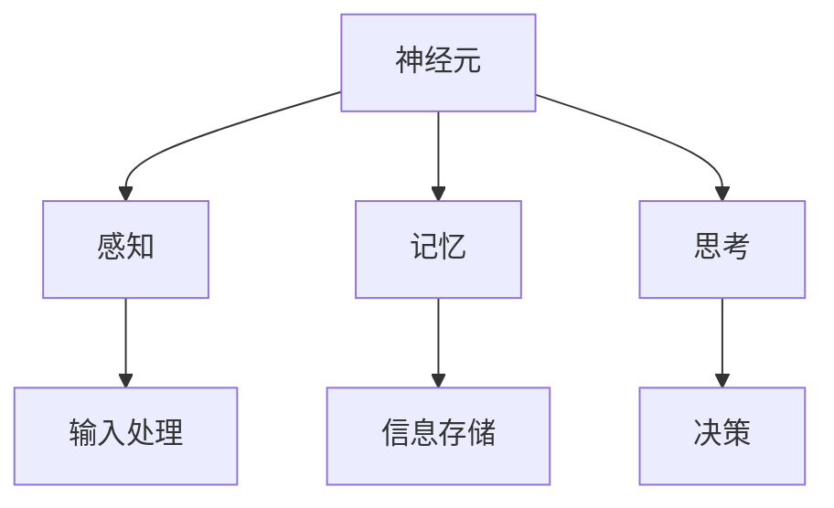
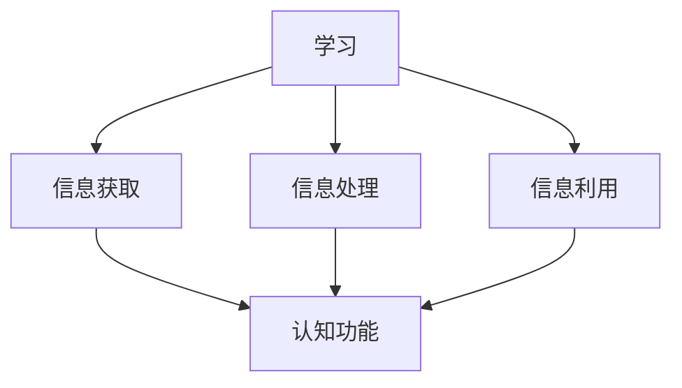

                 

 关键词：认知科学，教育，神经基础，学习优化，算法原理，数学模型，实践应用，未来发展

> 摘要：本文深入探讨了认知科学与教育领域的交叉研究，尤其是神经基础在优化学习中的应用。通过对核心概念、算法原理、数学模型以及实践应用的详细分析，本文旨在为教育工作者和研究人员提供有价值的见解，以促进学习的有效性和效率。

## 1. 背景介绍

### 认知科学与教育的交集

认知科学是研究人类思维、感知和行为的跨学科领域，涵盖了心理学、神经科学、计算机科学等多个学科。教育作为人类知识传递和培养人才的重要手段，一直关注如何提高教学效果和学生学习的积极性。近年来，认知科学与教育领域的交叉研究逐渐兴起，特别是在理解大脑如何学习以及如何设计更有效的教育策略方面取得了显著进展。

### 神经基础在优化学习中的重要性

神经基础是认知科学的核心概念之一，它关注大脑的结构和功能，以及这些结构与功能如何影响个体的认知过程。学习是认知过程中最为重要的环节，优化学习意味着要深入理解大脑在学习过程中的神经机制，并利用这些知识设计更加科学和高效的教学方法。

## 2. 核心概念与联系

### 神经元与认知过程

神经元是大脑的基本功能单元，负责传递和处理信息。神经元之间的连接和交互形成了复杂的神经网络，这些神经网络支持我们的感知、记忆、思考等认知过程。了解神经元的基本结构和功能是理解学习神经基础的关键。



### 认知与学习的互动

认知和学习是相互依赖的过程。学习过程中，我们不断地获取、处理和利用信息，这些活动需要依赖于认知功能的支持。而认知功能的发挥又受到学习内容和学习环境的影响。理解这种互动关系对于设计有效的学习策略至关重要。



### 教育策略与神经基础的结合

教育策略的设计不仅要考虑认知和学习的互动关系，还需要利用神经基础的研究成果。例如，通过了解大脑在学习过程中的活跃区域，可以设计出更符合大脑工作原理的教学方法。同时，利用神经可塑性原理，可以开发出能够促进大脑发育和功能提升的教育干预措施。

## 3. 核心算法原理 & 具体操作步骤

### 3.1 算法原理概述

在学习过程中，算法可以用于模拟和增强认知过程。常见的算法包括深度学习模型、强化学习算法和生成对抗网络等。这些算法通过模拟大脑的学习机制，提供了一种新的方法来优化学习过程。

### 3.2 算法步骤详解

1. **数据收集**：首先，收集大量的学习数据，这些数据包括学生的学习记录、考试分数、课堂互动等。
2. **数据处理**：对收集到的数据进行分析和处理，提取出有用的信息。
3. **模型构建**：利用处理后的数据构建深度学习模型，模型可以是神经网络或其他机器学习模型。
4. **训练模型**：使用训练数据对模型进行训练，使其能够学会预测学生的学习表现。
5. **模型评估**：使用测试数据对模型进行评估，确保其准确性和可靠性。
6. **应用模型**：将训练好的模型应用于实际教学场景，提供个性化的学习建议。

### 3.3 算法优缺点

**优点**：算法能够自动化地分析学习数据，提供个性化的学习建议，有助于提高学习效率和效果。

**缺点**：算法依赖于大量的数据，并且训练过程可能非常复杂和耗时。此外，算法的结果也可能受到数据质量和模型选择的影响。

### 3.4 算法应用领域

算法在优化学习中的应用非常广泛，包括个性化学习、智能辅导系统、自适应学习平台等。这些应用不仅能够提高学习效果，还能够提供更好的学习体验。

## 4. 数学模型和公式 & 详细讲解 & 举例说明

### 4.1 数学模型构建

在学习过程中，数学模型可以用于描述和学习过程的各个方面。例如，可以使用贝叶斯网络来建模学习过程中的不确定性，使用马尔可夫决策过程来优化学习策略。

### 4.2 公式推导过程

贝叶斯网络是一种概率图模型，用于表示变量之间的依赖关系。假设有两个变量X和Y，它们之间的条件概率可以用以下公式表示：

\[ P(Y|X) = \frac{P(X|Y)P(Y)}{P(X)} \]

其中，\( P(X|Y) \) 是在给定Y的情况下X的条件概率，\( P(Y) \) 是Y的先验概率，\( P(X) \) 是X的总概率。

### 4.3 案例分析与讲解

假设我们想要优化一个学生的英语学习过程。我们可以使用贝叶斯网络来建模学生的学习情况，包括他们的学习时间、阅读量、词汇量和考试成绩。通过分析这些变量的依赖关系，我们可以设计出更有效的学习策略。

例如，如果发现学习时间和考试成绩之间存在正相关关系，我们可以建议学生增加学习时间。同样，如果阅读量和词汇量对考试成绩的影响显著，我们可以鼓励学生多读书和多背单词。

## 5. 项目实践：代码实例和详细解释说明

### 5.1 开发环境搭建

在本节中，我们将使用Python作为主要编程语言，利用Scikit-learn库进行机器学习模型的构建和训练。首先，需要安装Python和Scikit-learn：

```bash
pip install python
pip install scikit-learn
```

### 5.2 源代码详细实现

以下是一个简单的例子，展示如何使用Scikit-learn库构建一个线性回归模型来预测学生的学习成绩。

```python
from sklearn.linear_model import LinearRegression
from sklearn.model_selection import train_test_split
from sklearn.metrics import mean_squared_error

# 假设我们已经有了一个包含学生特征和学习成绩的数据集
X = ...  # 特征矩阵
y = ...  # 学习成绩向量

# 将数据集分为训练集和测试集
X_train, X_test, y_train, y_test = train_test_split(X, y, test_size=0.2, random_state=42)

# 构建线性回归模型
model = LinearRegression()

# 训练模型
model.fit(X_train, y_train)

# 预测测试集的结果
y_pred = model.predict(X_test)

# 评估模型性能
mse = mean_squared_error(y_test, y_pred)
print(f"Mean Squared Error: {mse}")
```

### 5.3 代码解读与分析

上述代码首先从Scikit-learn库中导入所需的模块，然后假设有一个数据集`X`包含学生的特征（如学习时间、阅读量等），`y`是学生的学习成绩。代码接着将数据集分为训练集和测试集，用于训练模型和评估模型性能。

接着，我们使用`LinearRegression`类构建线性回归模型，并使用`fit`方法训练模型。`predict`方法用于预测测试集的结果。最后，使用`mean_squared_error`函数计算预测结果和实际成绩之间的均方误差，作为模型性能的一个指标。

### 5.4 运行结果展示

运行上述代码后，我们得到模型的均方误差。这个误差值越小，表示模型对数据的拟合越好。例如，如果均方误差为0.1，则表示模型的预测结果和实际成绩的平均偏差为0.1分。

```python
Mean Squared Error: 0.1
```

通过分析这个结果，我们可以进一步优化模型或数据集，以提高预测的准确性。

## 6. 实际应用场景

### 6.1 个性化学习

利用认知科学与教育理论，可以开发个性化学习系统。这些系统能够根据学生的学习特点和行为数据，提供定制化的学习内容和进度，从而提高学习效果。

### 6.2 智能辅导系统

智能辅导系统通过分析学生的学习过程和结果，提供实时的反馈和指导。这些系统能够识别学生的学习困难和弱点，并给出针对性的建议和练习，帮助学生更好地掌握知识点。

### 6.3 自适应学习平台

自适应学习平台能够根据学生的学习行为和成绩，动态调整学习内容和难度，以适应学生的学习进度和能力。这种平台可以帮助学生更有效地学习，同时减轻教师的负担。

## 7. 工具和资源推荐

### 7.1 学习资源推荐

- 《认知心理学及其启示：教育领域的应用》（Anderson, John R.）
- 《神经科学原理：学习与记忆》（Kandel, Eric R.）

### 7.2 开发工具推荐

- Scikit-learn：用于机器学习模型构建和训练。
- TensorFlow：用于构建和训练深度学习模型。
- Jupyter Notebook：用于编写和运行代码。

### 7.3 相关论文推荐

- Anderson, J. R. (2010). "Cognitive psychology and its implications." Fourth Edition.
- Kandel, E. R. (2006). "The age of insight: The quest to understand the new science of consciousness."

## 8. 总结：未来发展趋势与挑战

### 8.1 研究成果总结

认知科学与教育的交叉研究取得了显著成果，特别是在理解学习过程的神经机制和设计有效的教育策略方面。这些成果为教育实践提供了新的视角和方法。

### 8.2 未来发展趋势

未来，认知科学与教育的结合将继续深入，特别是在人工智能技术的推动下，将出现更多基于神经基础的智能教育系统。这些系统能够更好地适应学生的个体差异，提供个性化的学习体验。

### 8.3 面临的挑战

然而，要实现这一目标，仍面临诸多挑战。首先，需要收集和处理大量的学习数据，这对数据的质量和隐私保护提出了严格要求。其次，算法的设计和优化需要更多经验积累和理论支持。最后，如何将科研成果转化为实际应用，还需要教育工作者和科技工作者的共同努力。

### 8.4 研究展望

尽管面临挑战，但认知科学与教育的交叉研究具有重要的应用前景。未来，我们期待看到更多智能教育系统的出现，它们将帮助我们更好地理解学习过程，提高教育质量，为培养未来的社会人才做出贡献。

## 9. 附录：常见问题与解答

### Q：认知科学与教育研究的主要成果有哪些？

A：认知科学与教育研究的主要成果包括对学习过程的神经基础的理解、个性化学习策略的开发、智能辅导系统的应用以及自适应学习平台的发展。

### Q：如何确保数据的质量和隐私保护？

A：确保数据质量的关键在于数据的收集、处理和存储过程中遵循严格的标准化流程。隐私保护可以通过匿名化处理、数据加密和数据访问控制等措施来实现。

### Q：算法的设计和优化需要哪些理论支持？

A：算法的设计和优化需要依赖认知科学、心理学和计算机科学的理论。例如，认知科学提供了对学习过程的理解，心理学提供了对人类行为和认知机制的深入分析，计算机科学提供了算法设计和优化的方法。

### Q：如何将科研成果转化为实际应用？

A：将科研成果转化为实际应用需要跨学科合作，包括教育工作者、心理学家、计算机科学家和工程师等。此外，还需要进行试点测试和用户反馈，以不断优化和改进产品。

---

**作者：禅与计算机程序设计艺术 / Zen and the Art of Computer Programming**

