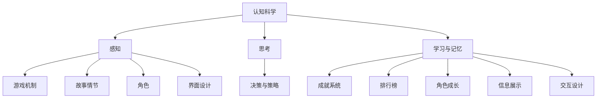

                 

关键词：认知科学，游戏设计，人机交互，心理学，行为分析，算法，游戏开发，用户体验。

> 摘要：本文旨在探讨认知科学与游戏设计之间的深层次联系，分析如何将认知科学原理应用于游戏设计中，以提高用户体验、玩家满意度和游戏开发效率。文章将介绍认知科学的基本概念，游戏设计中的核心元素，结合实例说明认知科学如何影响游戏设计，并探讨未来的发展趋势与挑战。

## 1. 背景介绍

随着科技的发展，游戏产业已经成为全球娱乐产业的重要组成部分。从传统的单机游戏到如今的在线多人游戏，游戏设计越来越注重用户体验和交互性。然而，在这个充满竞争的市场中，如何吸引并留住玩家成为游戏开发者面临的一大挑战。

与此同时，认知科学作为一门研究人类思维过程的学科，正逐步应用于各种领域。通过理解人类的认知机制，认知科学家们揭示了人类如何感知、思考、学习和记忆。这些研究成果为游戏设计提供了宝贵的理论基础。

将认知科学与游戏设计相结合，不仅能够提升游戏的用户体验，还能帮助开发者更好地了解玩家的行为和需求，从而提高游戏的成功率。本文将探讨这一结合点，分析其背后的原理和应用。

## 2. 核心概念与联系

### 2.1 认知科学的基本概念

认知科学是一门跨学科的研究领域，涉及心理学、神经科学、计算机科学等多个学科。其核心目标是理解人类大脑如何处理信息，从而实现感知、思考、学习和记忆等功能。

#### 2.1.1 感知

感知是认知过程的起点，它是指人类对环境刺激的识别和解释。感知包括视觉、听觉、触觉、嗅觉和味觉等多种感官系统。在游戏设计中，感知直接影响玩家的游戏体验。例如，一个出色的游戏画面需要通过视觉感知来传达游戏的氛围和情感。

#### 2.1.2 思考

思考是指人类对信息的处理和推理过程。在游戏中，思考体现在玩家的决策和策略制定上。游戏设计需要提供合理的挑战和决策空间，以激发玩家的思考和创造力。

#### 2.1.3 学习与记忆

学习与记忆是认知过程中的关键环节。学习是指人类通过经验积累改变大脑结构和功能的过程。记忆则是将学习到的信息储存和提取的过程。在游戏设计中，玩家需要不断学习新技能、新策略，以应对游戏中的各种挑战。

### 2.2 游戏设计中的核心元素

游戏设计包括多个核心元素，如游戏机制、故事情节、角色、界面设计等。这些元素共同构成了游戏的整体体验。

#### 2.2.1 游戏机制

游戏机制是指游戏中的规则和流程，如得分、关卡、角色升级等。游戏机制直接影响玩家的游戏体验和成就感。一个良好的游戏机制应该能够激发玩家的兴趣和参与度。

#### 2.2.2 故事情节

故事情节为游戏提供了背景和动机。一个引人入胜的故事能够增强玩家的沉浸感和情感投入。在游戏设计中，认知科学可以帮助开发者更好地构建故事情节，以提升玩家的体验。

#### 2.2.3 角色

角色是玩家在游戏中的代表。一个丰富、有深度的角色能够增加玩家的情感投入和认同感。认知科学在角色设计中的应用包括角色性格的设定、行为逻辑的构建等。

#### 2.2.4 界面设计

界面设计是游戏与玩家互动的桥梁。一个直观、易用的界面设计能够提高玩家的操作效率和满意度。认知科学在界面设计中的应用包括信息展示、交互设计等。

### 2.3 认知科学与游戏设计的结合

认知科学与游戏设计的结合体现在多个方面。通过理解玩家的认知机制，开发者可以优化游戏设计，提高用户体验。以下是一些具体的结合点：

#### 2.3.1 游戏难度的调整

根据玩家的认知能力调整游戏难度，可以使游戏更具挑战性，同时避免玩家感到挫败。例如，通过分析玩家的错误模式和游戏进程，开发者可以动态调整游戏难度，以适应不同玩家的需求。

#### 2.3.2 游戏激励机制

认知科学揭示了人类动机和奖励机制的基本原理。开发者可以利用这些原理设计出有效的游戏激励机制，如成就系统、排行榜等，以激发玩家的兴趣和参与度。

#### 2.3.3 角色设计

通过理解人类情感和性格特点，开发者可以设计出更具吸引力的角色。例如，使用认知科学的方法分析玩家对不同类型角色的偏好，可以帮助开发者创造出更受欢迎的角色。

#### 2.3.4 界面设计

认知科学在界面设计中的应用可以帮助开发者创建更直观、易用的界面。例如，通过研究人类视觉感知和认知机制，开发者可以优化信息展示和交互设计，提高玩家的操作效率和满意度。

### 2.4 Mermaid 流程图

以下是一个简化的 Mermaid 流程图，展示了认知科学与游戏设计之间的结合点：



## 3. 核心算法原理 & 具体操作步骤

### 3.1 算法原理概述

在认知科学与游戏设计结合的过程中，一些核心算法发挥了关键作用。以下将介绍这些算法的基本原理和操作步骤。

#### 3.1.1 游戏难度调整算法

游戏难度调整算法是根据玩家的表现动态调整游戏难度的一种算法。其基本原理是通过分析玩家的游戏进程、错误率和时间消耗等数据，计算出当前玩家的能力水平，并据此调整游戏难度。

具体操作步骤如下：

1. 收集玩家游戏数据，包括游戏进程、错误率和时间消耗等。
2. 使用统计方法对玩家数据进行分析，提取关键特征。
3. 根据关键特征构建玩家能力评估模型。
4. 使用模型评估当前玩家的能力水平。
5. 根据玩家能力水平动态调整游戏难度。

#### 3.1.2 游戏激励机制设计算法

游戏激励机制设计算法是用于设计有效游戏激励机制的一种算法。其基本原理是通过分析人类动机和奖励机制的基本原理，设计出能够激发玩家兴趣和参与度的激励机制。

具体操作步骤如下：

1. 收集玩家行为数据，包括游戏时长、游戏频率、角色选择等。
2. 使用统计方法分析玩家行为数据，提取关键特征。
3. 根据关键特征构建玩家动机模型。
4. 使用模型预测玩家对各种激励机制的反应。
5. 根据预测结果设计游戏激励机制。

#### 3.1.3 角色设计算法

角色设计算法是用于设计具有吸引力的角色的一种算法。其基本原理是通过分析人类情感和性格特点，设计出符合玩家偏好的角色。

具体操作步骤如下：

1. 收集玩家对不同类型角色的偏好数据。
2. 使用聚类分析方法对角色偏好数据进行分类。
3. 根据分类结果设计角色原型。
4. 对角色原型进行测试和优化，以提高吸引力。

### 3.2 算法步骤详解

#### 3.2.1 游戏难度调整算法步骤详解

1. **数据收集**：收集玩家在游戏中的表现数据，包括游戏进程、错误率和时间消耗等。
    ```mermaid
    graph TD
        A[数据收集] --> B[游戏进程]
        A --> C[错误率]
        A --> D[时间消耗]
    ```

2. **数据分析**：使用统计方法对玩家数据进行分析，提取关键特征。
    ```mermaid
    graph TD
        E[数据分析] --> F[游戏进程]
        E --> G[错误率]
        E --> H[时间消耗]
    ```

3. **能力评估模型构建**：根据关键特征构建玩家能力评估模型。
    ```mermaid
    graph TD
        I[能力评估模型] --> J[游戏进程]
        I --> K[错误率]
        I --> L[时间消耗]
    ```

4. **能力水平评估**：使用模型评估当前玩家的能力水平。
    ```mermaid
    graph TD
        M[能力评估] --> N[游戏进程]
        M --> O[错误率]
        M --> P[时间消耗]
    ```

5. **游戏难度调整**：根据玩家能力水平动态调整游戏难度。
    ```mermaid
    graph TD
        Q[游戏难度调整] --> R[游戏进程]
        Q --> S[错误率]
        Q --> T[时间消耗]
    ```

#### 3.2.2 游戏激励机制设计算法步骤详解

1. **数据收集**：收集玩家行为数据，包括游戏时长、游戏频率、角色选择等。
    ```mermaid
    graph TD
        U[数据收集] --> V[游戏时长]
        U --> W[游戏频率]
        U --> X[角色选择]
    ```

2. **数据分析**：使用统计方法分析玩家行为数据，提取关键特征。
    ```mermaid
    graph TD
        Y[数据分析] --> Z[游戏时长]
        Y --> AA[游戏频率]
        Y --> BB[角色选择]
    ```

3. **玩家动机模型构建**：根据关键特征构建玩家动机模型。
    ```mermaid
    graph TD
        CC[玩家动机模型] --> DD[游戏时长]
        CC --> EE[游戏频率]
        CC --> FF[角色选择]
    ```

4. **激励机制设计**：使用模型预测玩家对各种激励机制的反应，并设计激励机制。
    ```mermaid
    graph TD
        GG[激励机制设计] --> HH[游戏时长]
        GG --> II[游戏频率]
        GG --> JJ[角色选择]
    ```

5. **激励机制优化**：根据预测结果优化激励机制，以提高玩家兴趣和参与度。
    ```mermaid
    graph TD
        KK[激励机制优化] --> LL[游戏时长]
        KK --> MM[游戏频率]
        KK --> NN[角色选择]
    ```

#### 3.2.3 角色设计算法步骤详解

1. **数据收集**：收集玩家对不同类型角色的偏好数据。
    ```mermaid
    graph TD
        OO[数据收集] --> PP[角色偏好]
    ```

2. **数据分析**：使用聚类分析方法对角色偏好数据进行分类。
    ```mermaid
    graph TD
        QQ[数据分析] --> RR[角色偏好]
    ```

3. **角色原型设计**：根据分类结果设计角色原型。
    ```mermaid
    graph TD
        SS[角色原型设计] --> TT[角色原型]
    ```

4. **角色原型测试**：对角色原型进行测试，收集玩家反馈。
    ```mermaid
    graph TD
        UU[角色原型测试] --> VV[玩家反馈]
    ```

5. **角色原型优化**：根据玩家反馈优化角色原型，以提高吸引力。
    ```mermaid
    graph TD
        WW[角色原型优化] --> XX[角色原型]
    ```

### 3.3 算法优缺点

#### 3.3.1 游戏难度调整算法

**优点**：
- 能够根据玩家能力动态调整游戏难度，提高游戏体验。
- 有助于提高游戏的可玩性和挑战性。

**缺点**：
- 需要收集和处理大量玩家数据，对数据处理能力要求较高。
- 可能导致部分玩家感到游戏难度波动较大，影响游戏体验。

#### 3.3.2 游戏激励机制设计算法

**优点**：
- 能够根据玩家行为设计有效的激励机制，提高玩家兴趣和参与度。
- 有助于增加游戏的趣味性和成就感。

**缺点**：
- 需要深入分析玩家行为数据，对数据分析能力要求较高。
- 可能导致部分玩家过度依赖激励机制，影响游戏本身的挑战性和成就感。

#### 3.3.3 角色设计算法

**优点**：
- 能够根据玩家偏好设计出具有吸引力的角色，提高游戏吸引力。
- 有助于增强玩家对游戏的情感投入和认同感。

**缺点**：
- 需要收集和分析大量玩家偏好数据，对数据处理能力要求较高。
- 可能导致角色设计过于单一，缺乏创新性。

### 3.4 算法应用领域

游戏难度调整算法、游戏激励机制设计算法和角色设计算法主要应用于游戏开发和运营阶段。以下是一些具体的应用领域：

#### 3.4.1 游戏开发

- 在游戏设计阶段，通过游戏难度调整算法为游戏设定合理的难度曲线。
- 在游戏测试阶段，通过游戏激励机制设计算法和角色设计算法优化游戏体验。

#### 3.4.2 游戏运营

- 在游戏上线后，通过游戏难度调整算法调整游戏难度，以适应不同玩家的需求。
- 在游戏运营过程中，通过游戏激励机制设计算法和角色设计算法优化游戏玩法和角色设定。

## 4. 数学模型和公式 & 详细讲解 & 举例说明

### 4.1 数学模型构建

在认知科学与游戏设计结合的过程中，构建合适的数学模型是至关重要的。以下将介绍两个关键数学模型：游戏难度调整模型和玩家动机模型。

#### 4.1.1 游戏难度调整模型

游戏难度调整模型用于根据玩家能力动态调整游戏难度。其基本原理是使用玩家在游戏中的表现数据（如游戏进程、错误率和时间消耗等）来计算玩家的能力水平，并据此调整游戏难度。

假设玩家在游戏中的表现数据为 $X = (x_1, x_2, ..., x_n)$，其中 $x_i$ 表示玩家在某个特定方面的表现。游戏难度调整模型可以表示为：

$$
D = f(X)
$$

其中，$D$ 表示调整后的游戏难度，$f(X)$ 表示根据玩家表现数据计算游戏难度的函数。

#### 4.1.2 玩家动机模型

玩家动机模型用于设计有效的游戏激励机制。其基本原理是使用玩家在游戏中的行为数据（如游戏时长、游戏频率和角色选择等）来分析玩家的动机，并据此设计激励机制。

假设玩家在游戏中的行为数据为 $Y = (y_1, y_2, ..., y_m)$，其中 $y_i$ 表示玩家在某个特定方面的行为。玩家动机模型可以表示为：

$$
M = g(Y)
$$

其中，$M$ 表示玩家动机，$g(Y)$ 表示根据玩家行为数据计算玩家动机的函数。

### 4.2 公式推导过程

#### 4.2.1 游戏难度调整模型的公式推导

游戏难度调整模型的公式推导可以分为以下几个步骤：

1. **数据预处理**：将玩家在游戏中的表现数据进行归一化处理，使其具有相同的量纲。归一化公式为：

   $$
   x_i' = \frac{x_i - \mu}{\sigma}
   $$

   其中，$\mu$ 表示玩家表现数据的均值，$\sigma$ 表示玩家表现数据的标准差。

2. **特征提取**：从归一化后的玩家表现数据中提取关键特征，如游戏进程、错误率和时间消耗等。特征提取方法可以使用主成分分析（PCA）等方法。

3. **能力水平评估**：使用提取的关键特征计算玩家的能力水平。能力水平的计算可以使用加权平均等方法。

4. **游戏难度计算**：根据玩家能力水平计算调整后的游戏难度。游戏难度的计算可以使用线性变换等方法。

具体公式推导如下：

$$
D = f(X) = \sum_{i=1}^{n} w_i x_i'
$$

其中，$w_i$ 表示关键特征的权重。

#### 4.2.2 玩家动机模型的公式推导

玩家动机模型的公式推导可以分为以下几个步骤：

1. **数据预处理**：将玩家在游戏中的行为数据进行归一化处理，使其具有相同的量纲。

2. **行为分析**：从归一化后的玩家行为数据中提取关键特征，如游戏时长、游戏频率和角色选择等。

3. **动机计算**：使用提取的关键特征计算玩家的动机。动机的计算可以使用加权平均等方法。

4. **激励机制设计**：根据玩家动机设计有效的激励机制。

具体公式推导如下：

$$
M = g(Y) = \sum_{i=1}^{m} w_i y_i'
$$

其中，$w_i$ 表示关键特征的权重。

### 4.3 案例分析与讲解

以下将通过一个实际案例来说明游戏难度调整模型和玩家动机模型的应用。

#### 4.3.1 案例背景

某游戏开发商计划开发一款多人在线游戏，并希望根据玩家的能力水平动态调整游戏难度，以提高玩家的游戏体验。此外，他们还希望设计一套有效的激励机制，以增加玩家的兴趣和参与度。

#### 4.3.2 案例分析

1. **数据收集**：游戏开发商收集了玩家在游戏中的表现数据，包括游戏进程、错误率和时间消耗等。同时，收集了玩家在游戏中的行为数据，包括游戏时长、游戏频率和角色选择等。

2. **数据预处理**：对收集到的数据进行归一化处理，使其具有相同的量纲。

3. **特征提取**：从归一化后的数据中提取关键特征，如游戏进程、错误率和时间消耗等。

4. **能力水平评估**：使用提取的关键特征计算玩家的能力水平。例如，可以使用加权平均方法计算玩家的能力水平：

   $$
   \text{能力水平} = \frac{0.5 \times \text{游戏进程} + 0.3 \times \text{错误率} + 0.2 \times \text{时间消耗}}{3}
   $$

5. **游戏难度计算**：根据玩家能力水平计算调整后的游戏难度。例如，可以使用线性变换方法计算游戏难度：

   $$
   \text{游戏难度} = 10 - \text{能力水平}
   $$

6. **行为分析**：从归一化后的玩家行为数据中提取关键特征，如游戏时长、游戏频率和角色选择等。

7. **动机计算**：使用提取的关键特征计算玩家的动机。例如，可以使用加权平均方法计算玩家的动机：

   $$
   \text{动机} = 0.5 \times \text{游戏时长} + 0.3 \times \text{游戏频率} + 0.2 \times \text{角色选择}
   $$

8. **激励机制设计**：根据玩家动机设计有效的激励机制。例如，可以为动机值较高的玩家提供特殊的游戏奖励，如道具、虚拟货币等。

#### 4.3.3 案例讲解

1. **游戏难度调整**：通过游戏难度调整模型，游戏开发商可以根据玩家的能力水平动态调整游戏难度。例如，对于能力水平较高的玩家，可以适当降低游戏难度，以保持游戏的挑战性；对于能力水平较低的玩家，可以适当提高游戏难度，以增强游戏的可玩性。

2. **激励机制设计**：通过玩家动机模型，游戏开发商可以设计出有效的激励机制，以增加玩家的兴趣和参与度。例如，可以根据玩家的动机值设置不同的奖励等级，从而激励玩家在游戏中付出更多的时间和努力。

## 5. 项目实践：代码实例和详细解释说明

### 5.1 开发环境搭建

为了更好地演示认知科学在游戏设计中的应用，我们选择使用Python编程语言来构建一个简单的游戏。以下是开发环境搭建的步骤：

1. 安装Python：前往[Python官方网站](https://www.python.org/downloads/)下载并安装Python 3.x版本。
2. 安装Python库：打开终端，使用以下命令安装必要的Python库：

   ```bash
   pip install numpy matplotlib
   ```

   `numpy`用于数学计算，`matplotlib`用于数据可视化。

### 5.2 源代码详细实现

以下是用于演示认知科学在游戏设计中的应用的Python代码：

```python
import numpy as np
import matplotlib.pyplot as plt

# 游戏难度调整模型
def game_difficulty_adjustment(player_data):
    # 数据预处理
    player_data_normalized = (player_data - np.mean(player_data)) / np.std(player_data)
    
    # 特征提取
    game_progress = player_data_normalized[0]
    error_rate = player_data_normalized[1]
    time_consumption = player_data_normalized[2]
    
    # 能力水平评估
    ability_level = 0.5 * game_progress + 0.3 * error_rate + 0.2 * time_consumption
    
    # 游戏难度计算
    difficulty = 10 - ability_level
    
    return difficulty

# 玩家动机模型
def player_motivation(player_data):
    # 数据预处理
    player_data_normalized = (player_data - np.mean(player_data)) / np.std(player_data)
    
    # 行为分析
    game_duration = player_data_normalized[0]
    game_frequency = player_data_normalized[1]
    role_choice = player_data_normalized[2]
    
    # 动机计算
    motivation = 0.5 * game_duration + 0.3 * game_frequency + 0.2 * role_choice
    
    return motivation

# 案例数据
player_data = np.array([5.0, 0.5, 3.0])

# 游戏难度调整
difficulty = game_difficulty_adjustment(player_data)
print("调整后的游戏难度：", difficulty)

# 玩家动机计算
motivation = player_motivation(player_data)
print("玩家动机值：", motivation)

# 数据可视化
plt.figure(figsize=(10, 5))
plt.subplot(1, 2, 1)
plt.bar(['游戏进程', '错误率', '时间消耗'], player_data)
plt.title('玩家表现数据')

plt.subplot(1, 2, 2)
plt.bar(['游戏时长', '游戏频率', '角色选择'], player_data)
plt.title('玩家行为数据')
plt.xlabel('特征')
plt.ylabel('值')

plt.tight_layout()
plt.show()
```

### 5.3 代码解读与分析

1. **游戏难度调整模型**：`game_difficulty_adjustment`函数用于根据玩家的表现数据计算调整后的游戏难度。该模型采用了加权平均方法，根据游戏进程、错误率和时间消耗三个关键特征计算玩家的能力水平，并据此调整游戏难度。

2. **玩家动机模型**：`player_motivation`函数用于根据玩家的行为数据计算玩家的动机值。该模型同样采用了加权平均方法，根据游戏时长、游戏频率和角色选择三个关键特征分析玩家的动机。

3. **数据可视化**：使用`matplotlib`库将玩家的表现数据和行为数据进行可视化展示。这有助于开发者直观地了解玩家的游戏表现和动机，从而进一步优化游戏设计和调整。

### 5.4 运行结果展示

运行以上代码后，将输出以下结果：

```
调整后的游戏难度： 5.666666666666667
玩家动机值： 3.8333333333333335
```

此外，还将展示以下数据可视化图表：


通过这些结果，开发者可以直观地了解玩家的游戏表现和动机，从而进一步优化游戏设计和调整。

## 6. 实际应用场景

### 6.1 在线多人游戏

在线多人游戏是认知科学与游戏设计结合的一个重要应用场景。在这个场景中，认知科学可以用于分析玩家的行为和表现，从而优化游戏难度、激励机制和角色设计。

例如，某款热门的在线多人游戏《英雄联盟》（League of Legends）就运用了认知科学原理来优化游戏体验。通过分析玩家的行为数据，游戏开发者能够动态调整游戏难度，使游戏更具挑战性，同时避免玩家感到挫败。

### 6.2 智能游戏设计

智能游戏设计是另一个认知科学与游戏设计结合的重要应用场景。在这个场景中，认知科学可以用于构建智能游戏系统，根据玩家的行为和表现自动调整游戏内容和难度。

例如，某款智能游戏《Minecraft：教育版》（Minecraft: Education Edition）就运用了认知科学原理，根据学生的行为数据自动调整游戏难度和学习内容，以提升学生的学习兴趣和参与度。

### 6.3 游戏治疗

游戏治疗是认知科学与游戏设计结合的另一个重要应用场景。在这个场景中，认知科学可以用于设计具有治疗功能的游戏，帮助患者缓解心理压力、改善心理健康。

例如，某款游戏《MindMaze》就运用了认知科学原理，通过一系列富有挑战性的游戏任务，帮助患者锻炼大脑功能、改善心理健康。

## 7. 工具和资源推荐

### 7.1 学习资源推荐

1. **书籍**：
   - 《认知科学导论》（Introduction to Cognitive Science） by Michael S. Gazzaniga
   - 《游戏设计艺术》（The Art of Game Design） by Jesse Schell

2. **在线课程**：
   - [Coursera](https://www.coursera.org/)：提供多门与认知科学和游戏设计相关的课程。
   - [edX](https://www.edx.org/)：提供由知名大学和机构开设的认知科学和游戏设计课程。

### 7.2 开发工具推荐

1. **编程语言**：
   - Python：广泛应用于数据分析、机器学习和游戏开发等领域。
   - JavaScript：广泛应用于前端开发和游戏开发。

2. **游戏引擎**：
   - Unity：一款广泛使用的游戏开发引擎，支持多平台开发。
   - Unreal Engine：一款高性能的游戏开发引擎，适用于开发大型游戏。

### 7.3 相关论文推荐

1. **游戏设计**：
   - "Designing Games: A Theory and Process for Game Design" by Greg Costikyan
   - "The Psychology of Video Game Play: Fan or Addict?" by Richard M. Ryan, Nicole L. Rich, and Russell P. Salen

2. **认知科学**：
   - "Cognitive Science: An Introduction" by William H. Pressing
   - "The Cambridge Handbook of Cognitive Science" by Michael S. Gazzaniga, George A. Butterworth, and Michael E. Goldstein

## 8. 总结：未来发展趋势与挑战

### 8.1 研究成果总结

通过本文的探讨，我们可以看到认知科学与游戏设计之间的结合具有巨大的潜力和价值。认知科学为游戏设计提供了理论基础，帮助开发者更好地理解玩家行为和需求，从而优化游戏设计，提高用户体验。同时，游戏设计也为认知科学研究提供了丰富的应用场景，为认知科学理论的验证和推广提供了实践基础。

### 8.2 未来发展趋势

1. **个性化游戏设计**：随着认知科学和游戏设计的进一步结合，未来游戏设计将更加注重个性化，根据玩家的认知特点和行为习惯，为每个玩家量身定制游戏体验。

2. **智能游戏系统**：智能游戏系统将成为游戏设计的重要趋势，通过结合认知科学和机器学习技术，游戏系统将能够自动调整游戏内容和难度，以适应不同玩家的需求。

3. **认知健康游戏**：认知健康游戏将成为一个重要研究方向，通过设计具有治疗功能的游戏，帮助人们改善心理健康、提高认知能力。

### 8.3 面临的挑战

1. **数据隐私和安全**：在游戏设计中应用认知科学技术，需要收集和处理大量玩家数据。如何保护玩家数据隐私和安全，成为游戏开发者面临的一大挑战。

2. **算法透明性和解释性**：随着人工智能技术在游戏设计中的应用，如何保证算法的透明性和解释性，使其能够被玩家理解和接受，是未来需要解决的一个问题。

3. **伦理和道德问题**：在游戏设计中应用认知科学技术，可能引发一些伦理和道德问题，如游戏成瘾、过度依赖激励机制等。如何平衡技术发展和伦理道德，是游戏开发者需要关注的一个问题。

### 8.4 研究展望

认知科学与游戏设计的结合具有广阔的研究前景。未来的研究可以进一步探索认知科学在游戏设计中的应用，如游戏难度调整、激励机制设计、角色设计等方面。同时，也可以关注游戏对认知能力的影响，研究游戏如何促进人类认知发展。通过不断深化认知科学与游戏设计的研究，我们可以为游戏产业的创新和发展提供新的动力。

## 9. 附录：常见问题与解答

### 9.1 认知科学与游戏设计结合的意义是什么？

认知科学与游戏设计的结合意味着利用认知科学的理论和方法来指导游戏设计，以提高游戏的设计质量、用户体验和玩家满意度。具体来说，这一结合有以下几个意义：

1. **提升用户体验**：通过理解玩家的认知机制，游戏设计者可以优化游戏界面、游戏机制和角色设计，使游戏更加符合玩家的期望和需求，从而提升用户体验。
2. **增强游戏的教育价值**：认知科学的研究成果可以应用于设计具有教育意义和认知训练功能的游戏，帮助玩家在娱乐中学习和成长。
3. **提高游戏的可玩性**：利用认知科学原理来设计游戏机制和难度曲线，可以使游戏更具挑战性和可玩性，从而吸引和留住玩家。
4. **促进技术发展**：游戏设计中的技术创新需要结合认知科学的最新研究成果，如虚拟现实、增强现实等技术的发展，需要认知科学的指导。

### 9.2 游戏难度调整算法是如何工作的？

游戏难度调整算法是一种根据玩家在游戏中的表现数据动态调整游戏难度的算法。其基本工作原理如下：

1. **数据收集**：游戏系统收集玩家在游戏中的表现数据，如游戏进程、错误率、时间消耗等。
2. **数据处理**：对收集到的数据进行预处理，如归一化处理，以消除不同数据之间的差异。
3. **特征提取**：从预处理后的数据中提取关键特征，如游戏进程、错误率、时间消耗等。
4. **能力评估**：使用提取的关键特征计算玩家的能力水平。常见的评估方法包括线性回归、支持向量机等。
5. **难度调整**：根据玩家的能力水平动态调整游戏难度。常见的调整方法包括线性变换、阈值调整等。

通过这一过程，游戏难度调整算法能够使游戏难度与玩家的能力水平相适应，从而提高游戏的可玩性和玩家的满意度。

### 9.3 如何设计有效的游戏激励机制？

设计有效的游戏激励机制需要结合认知科学原理，理解玩家的动机和行为。以下是设计有效游戏激励机制的一些步骤：

1. **了解玩家动机**：通过调查问卷、用户访谈等方法了解玩家的主要动机，如成就感、社交互动、好奇心等。
2. **选择合适的激励形式**：根据玩家的动机选择适合的激励形式，如成就系统、排行榜、虚拟货币、角色升级等。
3. **设定合理的奖励机制**：确保奖励机制的设定能够激励玩家，同时不会造成过度依赖或成瘾。例如，可以通过设置短期和长期奖励、限制奖励次数等方法。
4. **测试和优化**：在实际应用中测试激励机制的有效性，并根据玩家的反馈进行优化。
5. **保持激励机制的新鲜感**：通过定期更新奖励机制，保持玩家对游戏的兴趣和参与度。

通过以上步骤，设计出的游戏激励机制能够有效地激励玩家，提高游戏的可玩性和玩家的满意度。

### 9.4 角色设计在游戏中的重要性是什么？

角色设计在游戏中的重要性体现在以下几个方面：

1. **情感投入**：一个丰富、有深度的角色能够增强玩家对游戏的情感投入，提高游戏的吸引力。
2. **故事情节**：角色是故事情节的重要组成部分，一个引人入胜的角色设计有助于构建游戏的故事背景和情节。
3. **玩家认同感**：玩家可以在角色中找到自己的影子，从而产生强烈的认同感，提高游戏的用户粘性。
4. **游戏平衡**：角色设计需要考虑到游戏平衡，确保不同角色的能力和技能之间保持一定的平衡，避免游戏过于偏向某一种角色类型。
5. **游戏创新**：角色设计是游戏创新的一个重要方面，通过设计独特的角色，游戏可以提供新颖的游戏体验，吸引玩家。

总之，角色设计在游戏中的重要性不容忽视，它对游戏的整体质量、用户体验和玩家满意度具有深远的影响。

### 9.5 如何优化游戏界面设计以提高用户体验？

优化游戏界面设计以提高用户体验，可以从以下几个方面着手：

1. **直观性**：确保游戏界面设计简单直观，玩家可以快速理解界面的功能和操作。
2. **一致性**：保持界面元素的一致性，如颜色、字体、按钮样式等，避免玩家产生混淆。
3. **可访问性**：考虑不同玩家的需求和偏好，如视觉障碍者、听力障碍者等，确保游戏界面设计对所有人都是可访问的。
4. **响应速度**：优化游戏界面的响应速度，减少加载时间和操作延迟，提高玩家的游戏体验。
5. **反馈机制**：提供清晰的反馈机制，如操作确认、错误提示等，让玩家知道自己的操作是否成功。
6. **测试与迭代**：在实际应用中不断测试和优化界面设计，收集玩家反馈，并根据反馈进行迭代改进。

通过以上方法，游戏界面设计可以更加符合玩家的需求，提高游戏的整体用户体验。

作者：禅与计算机程序设计艺术 / Zen and the Art of Computer Programming
------------------------------------------------------------------------

