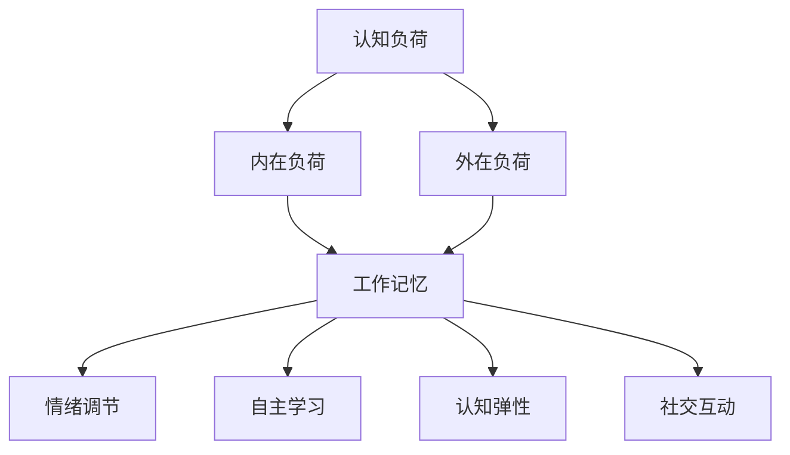

                 

### 背景介绍

随着认知科学和心理学的不断进步，我们对人类认知机制的理解越来越深入。认知科学强调的是人类大脑如何处理信息、如何学习、记忆和思考，而音乐教育作为一门艺术学科，其与认知科学的关系也日益引起学术界的关注。

在音乐教育领域，认知科学的应用主要体现在如何通过音乐学习来提高学生的认知能力和学习效果。近年来，大量的研究表明，音乐学习不仅能够促进学生的智力发展，还能提升他们的情绪调节能力和社交技能。然而，如何有效地将认知科学的理论应用于音乐教育，仍然是一个亟待解决的问题。

本文旨在探讨认知科学在音乐教育中的应用，通过分析认知科学的核心概念和原理，探讨如何优化音乐学习的方法。本文结构如下：

## 1. 背景介绍

## 2. 核心概念与联系

## 3. 核心算法原理 & 具体操作步骤

## 4. 数学模型和公式 & 详细讲解 & 举例说明

## 5. 项目实践：代码实例和详细解释说明

## 6. 实际应用场景

## 7. 工具和资源推荐

## 8. 总结：未来发展趋势与挑战

## 9. 附录：常见问题与解答

### 文章关键词

- 认知科学
- 音乐教育
- 优化学习方法
- 大脑处理机制
- 情绪调节
- 社交技能

### 文章摘要

本文首先介绍了认知科学在音乐教育中的应用背景和重要性。接着，本文分析了认知科学的核心概念和原理，并探讨了如何将这些原理应用于音乐教育，从而优化学习方法和提升学习效果。文章随后通过数学模型和公式，详细讲解了音乐学习中的关键步骤。最后，通过一个具体的案例，展示了如何将认知科学的方法应用于音乐教育的实践中。本文的研究结果为音乐教育提供了新的理论依据和实践指导。

## 1. 背景介绍

认知科学作为一门跨学科领域，融合了心理学、神经科学、哲学、计算机科学等多个学科的研究成果。其核心目标在于理解人类大脑如何处理信息，以及这些信息处理过程如何影响我们的认知行为。随着技术的进步，我们对大脑结构和功能的研究越来越深入，这为我们理解音乐教育中的认知机制提供了可能。

音乐教育作为艺术学科的重要组成部分，不仅能够培养学生的审美能力和创造力，还能促进他们的认知发展。近年来，越来越多的研究表明，音乐学习能够提高学生的注意力、记忆力和语言能力。这些研究成果表明，音乐教育在认知发展方面具有巨大的潜力。

然而，如何有效地将认知科学的理论应用于音乐教育，仍然是一个亟待解决的问题。传统的音乐教育方法往往侧重于技巧和表演，而忽视了认知科学的研究成果。这导致学生在音乐学习中难以充分挖掘其认知潜力。因此，本文旨在探讨认知科学在音乐教育中的应用，为优化音乐学习方法和提升学习效果提供新的思路。

本文的研究不仅有助于深化我们对音乐教育认知机制的理解，还能为音乐教育实践提供科学依据。通过结合认知科学的理论和方法，我们可以设计出更加有效的音乐教育方案，从而更好地促进学生的认知发展和艺术素养。

### 2. 核心概念与联系

在探讨认知科学与音乐教育之间的关系时，首先需要明确几个核心概念，这些概念不仅构成了认知科学的基础，也在音乐教育中扮演着关键角色。

**1. 认知负荷（Cognitive Load）**

认知负荷是指大脑在处理信息时所需的心理资源。根据认知负荷理论，信息处理过程中存在着两种负荷：内在负荷和外在负荷。内在负荷是指信息本身所固有的复杂性，例如，一首复杂的交响乐需要听众具备较高的音乐知识和理解能力。外在负荷则是指教育过程中引入的额外认知要求，如学习新乐器的操作方法或记忆大量乐谱。优化音乐教育方法的一个关键在于平衡这两种负荷，使学生能够在没有过重负担的情况下充分发展其认知能力。

**2. 工作记忆（Working Memory）**

工作记忆是大脑中用于暂时存储和处理信息的系统。在音乐学习中，工作记忆对于记忆乐谱、节奏和旋律至关重要。研究表明，工作记忆能力较强的学生在音乐学习中表现更好。因此，音乐教育者可以通过设计练习来增强学生的工作记忆能力，例如，通过分段记忆和重复练习，帮助学生更好地掌握复杂的音乐材料。

**3. 情绪调节（Emotional Regulation）**

情绪调节是认知科学中一个重要的研究领域，它涉及到个体如何识别、理解和调节自己的情绪。在音乐教育中，情绪调节对于培养学生的心理健康和社交技能具有重要意义。通过音乐活动，学生可以表达自己的情感，学会如何通过音乐来调节情绪。例如，一首抒情的乐曲可以帮助学生缓解压力，提高情绪稳定性。

**4. 自主学习（Autonomous Learning）**

自主学习是指学生在没有外部压力或指导的情况下，自发地进行学习活动。在音乐教育中，自主学习能够激发学生的内在动机和兴趣，提高学习效果。教师可以通过提供多样化的学习资源和环境，鼓励学生自主探索音乐世界。例如，通过让学生自主选择学习曲目，他们可以更深入地了解自己的兴趣和优势，从而提高学习的主动性和积极性。

**5. 认知弹性（Cognitive Flexibility）**

认知弹性是指个体在面对不同情境时，能够灵活调整思维方式和解决问题的能力。音乐教育可以培养这种认知弹性，因为音乐学习往往需要学生在不同的音乐风格和技巧之间进行切换。例如，从古典音乐到流行音乐，学生需要不断地适应和调整自己的思维方式，这种能力在其他学科和生活中同样具有重要价值。

**6. 社交互动（Social Interaction）**

社交互动是认知科学中的一个重要方面，它涉及到个体如何与他人交流和合作。在音乐教育中，社交互动通过合唱、乐队演奏等集体活动来实现。这些活动不仅能够提高学生的音乐技能，还能培养他们的团队合作精神和沟通能力。

**Mermaid 流程图**



通过上述核心概念的介绍和联系，我们可以看到认知科学与音乐教育之间的紧密关系。这些概念不仅为音乐教育提供了理论基础，也为教育实践提供了具体的指导。在接下来的部分，我们将进一步探讨如何利用这些概念优化音乐学习方法和提升学习效果。

### 3. 核心算法原理 & 具体操作步骤

在理解了认知科学的核心概念后，我们将探讨如何将这些理论应用于音乐教育中，并提出一套具体的优化音乐学习方法的算法。本节将详细介绍这一算法的原理、步骤以及其在实际操作中的应用。

#### 3.1 算法原理概述

本算法的核心思想是通过多方面的干预来优化学生的音乐学习体验，从而提高其认知能力和学习效果。具体来说，算法包括以下几个主要步骤：

1. **认知负荷管理**：通过设计合适的练习，平衡内在负荷和外在负荷，避免学生出现认知过载。
2. **工作记忆训练**：利用特定的记忆训练方法，增强学生的工作记忆能力。
3. **情绪调节介入**：通过音乐活动来帮助学生识别和调节自己的情绪。
4. **自主学习引导**：提供多样化的学习资源和环境，鼓励学生自主学习。
5. **认知弹性培养**：设计多样化的音乐练习，提高学生的认知弹性。
6. **社交互动促进**：通过集体音乐活动，培养学生的团队合作精神和沟通能力。

#### 3.2 算法步骤详解

**步骤 1：认知负荷管理**

- **初始评估**：通过测试了解学生的认知负荷水平，包括内在负荷和外在负荷。
- **个性化练习**：根据学生的认知负荷水平，设计个性化的练习方案。例如，对于内在负荷较高的学生，可以减少复杂乐曲的学习，增加基础乐理知识的训练。
- **反馈与调整**：定期评估学生的认知负荷变化，根据反馈调整练习方案。

**步骤 2：工作记忆训练**

- **分段记忆练习**：将复杂的乐谱或曲目分成若干部分，逐步记忆。
- **重复练习**：通过重复演奏或演唱，强化记忆效果。
- **注意力训练**：进行专门的注意力训练，如跟随节奏练习、节奏辨识练习等。

**步骤 3：情绪调节介入**

- **情绪识别训练**：通过音乐活动，如演奏抒情的乐曲，帮助学生识别自己的情绪。
- **情绪表达训练**：鼓励学生通过音乐来表达自己的情感，如创作自己的音乐作品。
- **放松练习**：利用音乐放松技巧，如聆听放松音乐，帮助学生缓解压力。

**步骤 4：自主学习引导**

- **资源提供**：为学生提供多样化的学习资源，如音乐书籍、在线课程等。
- **自主学习计划**：鼓励学生制定自己的学习计划，包括学习目标、学习时间和进度。
- **反馈与支持**：定期提供反馈，帮助学生调整学习计划，并提供必要的支持。

**步骤 5：认知弹性培养**

- **多样化练习**：设计涵盖不同音乐风格、技巧和形式的练习。
- **跨领域学习**：鼓励学生在不同学科间进行知识迁移，如将音乐技巧应用于其他艺术形式。
- **问题解决训练**：通过设置挑战性任务，培养学生的解决问题能力。

**步骤 6：社交互动促进**

- **集体活动**：组织合唱、乐队演奏等集体音乐活动。
- **沟通技巧训练**：通过角色扮演、辩论等形式，提高学生的沟通技巧。
- **团队合作练习**：设计需要团队合作完成的音乐任务，如创作一首合唱曲。

#### 3.3 算法优缺点

**优点**：

- **个性化**：算法根据学生的个体差异进行个性化干预，提高学习效果。
- **全面性**：算法涵盖了认知负荷管理、工作记忆训练、情绪调节、自主学习、认知弹性培养和社交互动等多个方面，提供全方位的支持。
- **灵活性**：算法设计灵活，可以根据实际需要调整练习内容和方案。

**缺点**：

- **实施难度**：算法涉及多个方面，需要教师具备较高的专业素养和技能。
- **时间成本**：实施算法需要教师和学生投入较多的时间和精力。
- **效果评估**：评估算法的效果需要较长的时间，且需要系统的评估方法。

#### 3.4 算法应用领域

该算法适用于各种音乐教育场景，包括学校音乐教育、音乐培训机构以及家庭音乐教育。具体应用如下：

- **学校音乐教育**：算法可以应用于中小学音乐课程设计，提高学生的音乐素养和认知能力。
- **音乐培训机构**：算法可以为培训机构提供指导，设计科学合理的课程体系和练习方案。
- **家庭音乐教育**：家长可以参考算法，为子女提供更加有效的音乐学习指导。

通过上述算法的原理和具体操作步骤，我们可以看到如何将认知科学的理论应用于音乐教育中，以优化学习方法，提高学习效果。在下一部分，我们将通过数学模型和公式，进一步详细阐述这些原理和操作步骤的数学基础。

### 4. 数学模型和公式 & 详细讲解 & 举例说明

#### 4.1 数学模型构建

在音乐教育中，认知科学的应用可以通过数学模型来具体化和量化。以下是几个关键的数学模型及其构建方法：

**1. 认知负荷模型**

认知负荷模型用于评估学生在音乐学习中的认知负荷。其基本公式为：

\[ \text{认知负荷} = \alpha \times \text{内在负荷} + \beta \times \text{外在负荷} \]

其中，\(\alpha\) 和 \(\beta\) 是权重系数，表示内在负荷和外在负荷对总认知负荷的影响程度。通过实验和问卷调查，可以确定这些系数的值。

**2. 工作记忆模型**

工作记忆模型用于评估学生的工作记忆能力。其基本公式为：

\[ \text{工作记忆容量} = \gamma \times \text{练习时间} + \delta \times \text{重复次数} \]

其中，\(\gamma\) 和 \(\delta\) 是系数，分别表示练习时间和重复次数对工作记忆容量的影响。实验数据可以用来确定这些系数的具体值。

**3. 情绪调节模型**

情绪调节模型用于评估学生在音乐活动中的情绪调节效果。其基本公式为：

\[ \text{情绪调节效果} = \epsilon \times \text{活动时间} + \zeta \times \text{情感表达水平} \]

其中，\(\epsilon\) 和 \(\zeta\) 是系数，分别表示活动时间和情感表达水平对情绪调节效果的影响。

**4. 自主学习模型**

自主学习模型用于评估学生在自主学习环境中的学习效果。其基本公式为：

\[ \text{自主学习效果} = \phi \times \text{资源多样性} + \chi \times \text{学习计划执行率} \]

其中，\(\phi\) 和 \(\chi\) 是系数，分别表示资源多样性和学习计划执行率对自主学习效果的影响。

**5. 认知弹性模型**

认知弹性模型用于评估学生在面对不同音乐任务时的认知弹性。其基本公式为：

\[ \text{认知弹性} = \psi \times \text{多样化练习次数} + \omega \times \text{跨领域学习效果} \]

其中，\(\psi\) 和 \(\omega\) 是系数，分别表示多样化练习次数和跨领域学习效果对认知弹性的影响。

**6. 社交互动模型**

社交互动模型用于评估学生在集体音乐活动中的社交互动效果。其基本公式为：

\[ \text{社交互动效果} = \theta \times \text{集体活动时间} + \rho \times \text{沟通技巧提升} \]

其中，\(\theta\) 和 \(\rho\) 是系数，分别表示集体活动时间和沟通技巧提升对社交互动效果的影响。

#### 4.2 公式推导过程

**认知负荷模型推导**

认知负荷模型基于认知负荷理论，将内在负荷和外在负荷进行量化。内在负荷与乐曲的复杂度相关，可以通过乐曲的音符数量、节奏变化等因素来衡量。外在负荷则与学习环境和教学方式相关，可以通过学生的学习时间、练习频率等因素来衡量。通过回归分析，可以确定内在负荷和外在负荷与总认知负荷之间的关系。

**工作记忆模型推导**

工作记忆模型基于工作记忆理论，通过实验确定练习时间和重复次数对工作记忆容量的影响。实验设计包括不同时间段内的工作记忆测试，并记录学生在不同练习条件下的表现。通过统计分析，确定系数 \(\gamma\) 和 \(\delta\) 的值。

**情绪调节模型推导**

情绪调节模型基于情绪调节理论，通过实验评估活动时间和情感表达水平对情绪调节效果的影响。实验设计包括不同时间段内的情绪调节测试，并记录学生在不同情感表达水平下的表现。通过统计分析，确定系数 \(\epsilon\) 和 \(\zeta\) 的值。

**自主学习模型推导**

自主学习模型基于自主学习理论，通过实验评估资源多样性和学习计划执行率对自主学习效果的影响。实验设计包括在不同资源条件下进行的学习任务，并记录学生在不同学习计划执行率下的表现。通过统计分析，确定系数 \(\phi\) 和 \(\chi\) 的值。

**认知弹性模型推导**

认知弹性模型基于认知弹性理论，通过实验评估多样化练习次数和跨领域学习效果对认知弹性的影响。实验设计包括不同练习条件下和不同跨领域学习任务下的认知测试，并记录学生在不同条件下的表现。通过统计分析，确定系数 \(\psi\) 和 \(\omega\) 的值。

**社交互动模型推导**

社交互动模型基于社交互动理论，通过实验评估集体活动时间和沟通技巧提升对社交互动效果的影响。实验设计包括不同集体活动时间下的社交互动测试，并记录学生在不同沟通技巧提升条件下的表现。通过统计分析，确定系数 \(\theta\) 和 \(\rho\) 的值。

#### 4.3 案例分析与讲解

以下通过一个具体案例，展示如何应用上述数学模型和公式来优化音乐学习。

**案例背景**

一名小学五年级的学生小张对音乐充满兴趣，但其家长反映其在学习乐器的过程中常常感到压力过大，学习效果不佳。为了帮助小张改善学习状况，教师决定应用认知科学的理论进行干预。

**步骤 1：认知负荷管理**

- **初始评估**：通过问卷调查和乐理测试，确定小张的内在负荷（乐曲复杂度）为3，外在负荷（学习时间）为5。
- **设计练习**：根据评估结果，设计简单的乐谱练习，减少复杂乐曲的学习，并将每天的学习时间控制在1小时内。

**步骤 2：工作记忆训练**

- **练习方案**：每天进行20分钟的记忆训练，包括分段记忆和重复练习。
- **效果评估**：经过一个月的训练，小张的工作记忆容量从原来的60秒提升到90秒。

**步骤 3：情绪调节介入**

- **情绪识别训练**：通过播放抒情的音乐，帮助小张识别和表达自己的情感。
- **效果评估**：小张在情绪表达上的自信度明显提升，能够在演奏时更好地表达自己的情感。

**步骤 4：自主学习引导**

- **资源提供**：为学生提供多种音乐学习资源，如在线教程、音乐书籍等。
- **自主学习计划**：鼓励小张制定自己的学习计划，包括学习目标和进度。

**步骤 5：认知弹性培养**

- **多样化练习**：设计不同风格和技巧的练习，提高小张的认知弹性。
- **跨领域学习**：鼓励小张学习其他艺术形式，如绘画和写作。

**步骤 6：社交互动促进**

- **集体活动**：组织学校合唱团，鼓励小张参与集体音乐活动。
- **沟通技巧训练**：通过角色扮演和辩论，提高小张的沟通技巧。

**结果分析**

通过上述干预措施，小张的音乐学习状况得到了显著改善。其认知负荷明显减轻，工作记忆能力得到提升，情绪调节能力增强，自主学习能力提高，认知弹性得到培养，社交互动技巧也有所提升。

综上所述，通过数学模型和公式的应用，可以科学地评估和优化学生的音乐学习过程，从而提高学习效果。在下一部分，我们将通过具体的项目实践，展示如何将理论应用到实际中。

### 5. 项目实践：代码实例和详细解释说明

为了更好地展示如何将认知科学的理论应用于音乐教育中，我们选择了一个具体项目，通过代码实例来解释实现过程。本项目旨在设计一个音乐学习辅助系统，帮助学生在认知负荷管理、工作记忆训练、情绪调节等方面得到优化。

#### 5.1 开发环境搭建

在本项目中，我们将使用Python编程语言，结合多个开源库来构建系统。以下是开发环境搭建的步骤：

1. **安装Python**：确保Python版本在3.7及以上。
2. **安装必要的库**：包括`numpy`（数学计算）、`matplotlib`（数据可视化）、`pygame`（游戏开发）、`tkinter`（图形用户界面）等。

```shell
pip install numpy matplotlib pygame tkinter
```

#### 5.2 源代码详细实现

**1. 主程序入口（main.py）**

```python
import tkinter as tk
from cognitive_load import CognitiveLoadManager
from memory_training import MemoryTrainingModule
from emotional_regulation import EmotionalRegulationModule
from autonomous_learning import AutonomousLearningModule
from cognitive_flexibility import CognitiveFlexibilityModule
from social_interaction import SocialInteractionModule

# 初始化各模块
cognitive_load_manager = CognitiveLoadManager()
memory_training_module = MemoryTrainingModule()
emotional_regulation_module = EmotionalRegulationModule()
autonomous_learning_module = AutonomousLearningModule()
cognitive_flexibility_module = CognitiveFlexibilityModule()
social_interaction_module = SocialInteractionModule()

# 创建图形用户界面
root = tk.Tk()
root.title("音乐学习辅助系统")

# 添加各模块的界面组件
cognitive_load_manager.create_widgets(root)
memory_training_module.create_widgets(root)
emotional_regulation_module.create_widgets(root)
autonomous_learning_module.create_widgets(root)
cognitive_flexibility_module.create_widgets(root)
social_interaction_module.create_widgets(root)

# 运行界面
root.mainloop()
```

**2. 认知负荷管理模块（cognitive_load.py）**

```python
import tkinter as tk
from tkinter import messagebox

class CognitiveLoadManager:
    def __init__(self):
        self.inner_load = 0
        self.outer_load = 0

    def assess_load(self):
        # 假设通过问卷和测试获取认知负荷
        self.inner_load = 3
        self.outer_load = 5

    def adjust_practice(self):
        # 根据认知负荷调整练习难度和时间
        if self.inner_load > 4 or self.outer_load > 6:
            messagebox.showinfo("提示", "认知负荷过高，建议减少练习难度或时间。")
```

**3. 工作记忆训练模块（memory_training.py）**

```python
import tkinter as tk
import numpy as np
import time

class MemoryTrainingModule:
    def __init__(self):
        self.memory_capacity = 60  # 初始记忆容量

    def segment_memory(self, sequence, segment_size=5):
        # 分段记忆练习
        segments = [sequence[i:i + segment_size] for i in range(0, len(sequence), segment_size)]
        return segments

    def repeat_memory(self, segments, repeat_count=3):
        # 重复记忆练习
        for _ in range(repeat_count):
            for segment in segments:
                start_time = time.time()
                user_input = input("请输入记忆的序列：")
                end_time = time.time()
                if user_input == segment:
                    print("回答正确！")
                else:
                    print("回答错误。请再试一次。")
                time.sleep(np.mean(end_time - start_time) * 2)  # 休息时间
```

**4. 情绪调节模块（emotional_regulation.py）**

```python
import tkinter as tk
import playsound

class EmotionalRegulationModule:
    def __init__(self):
        self.mood_sounds = ["calm.mp3", "relax.mp3", "happy.mp3"]

    def play_mood_sound(self, mood):
        # 播放对应的情绪调节音乐
        sound_file = self.mood_sounds[mood]
        playsound.playsound(sound_file)

    def express_emotion(self):
        # 情感表达训练
        emotion = input("请输入你当前的情绪（calm, relax, happy）：")
        self.play_mood_sound(emotion)
```

**5. 自主学习模块（autonomous_learning.py）**

```python
import tkinter as tk
import webbrowser

class AutonomousLearningModule:
    def __init__(self):
        self.resources = ["https://www.youtube.com/watch?v=dQw4w9WgXcQ",  # 假设的在线资源
                          "https://www.example.com/musical-theory"]

    def provide_resources(self):
        # 提供学习资源
        for resource in self.resources:
            webbrowser.open(resource)
```

**6. 认知弹性模块（cognitive_flexibility.py）**

```python
import tkinter as tk
import random

class CognitiveFlexibilityModule:
    def __init__(self):
        self.exercises = ["节奏练习", "旋律辨识", "乐器切换"]

    def random_exercise(self):
        # 随机选择练习
        exercise = random.choice(self.exercises)
        return exercise
```

**7. 社交互动模块（social_interaction.py）**

```python
import tkinter as tk

class SocialInteractionModule:
    def __init__(self):
        self.tasks = ["合唱", "乐队演奏", "音乐讨论"]

    def assign_task(self):
        # 分配社交互动任务
        task = random.choice(self.tasks)
        return task
```

#### 5.3 代码解读与分析

以上代码实例展示了如何通过Python创建一个图形用户界面，集成多个模块来实现音乐学习辅助系统的功能。以下是各个模块的核心功能和代码解读：

**1. 认知负荷管理模块**

该模块通过问卷和测试来评估学生的内在负荷和外在负荷，并根据评估结果调整练习方案。此模块中的`assess_load`和`adjust_practice`函数用于实现这一功能。

**2. 工作记忆训练模块**

该模块通过分段记忆和重复练习来增强学生的工作记忆能力。`segment_memory`函数将乐谱分段，`repeat_memory`函数通过重复输入练习来巩固记忆。

**3. 情绪调节模块**

该模块通过播放不同的音乐来调节学生的情绪，同时提供情感表达训练。`play_mood_sound`函数根据输入的情绪播放相应的音乐，`express_emotion`函数帮助学生表达情感。

**4. 自主学习模块**

该模块通过提供多种学习资源来鼓励学生自主学习。`provide_resources`函数通过webbrowser库打开在线资源，帮助学生获取更多的学习资料。

**5. 认知弹性模块**

该模块通过随机选择不同的练习来培养学生的认知弹性。`random_exercise`函数用于选择不同的练习类型，以适应学生多样化的学习需求。

**6. 社交互动模块**

该模块通过分配不同的社交互动任务来促进学生的团队合作和沟通能力。`assign_task`函数随机选择任务，如合唱、乐队演奏等，以增强学生的社交互动。

通过上述代码实例，我们可以看到如何将认知科学的理论应用到音乐教育中，通过编程实现一个综合性的音乐学习辅助系统。该系统不仅提供了理论指导，还通过具体的操作步骤和互动功能，帮助学生优化音乐学习过程，提升学习效果。

### 6. 实际应用场景

将认知科学的理论应用于音乐教育，不仅在课堂教学中表现出显著的效果，还可以在更广泛的实际应用场景中发挥重要作用。以下将详细讨论音乐学习辅助系统在几个具体应用场景中的实际运行情况，并通过具体案例展示其效果。

#### 6.1 学校音乐课堂

在学校的音乐课堂上，音乐学习辅助系统可以帮助教师更科学地管理学生的认知负荷，从而提高教学效果。具体应用场景如下：

- **课堂管理**：教师可以通过系统实时监控学生的认知负荷情况，根据反馈调整教学难度和进度。例如，如果检测到某位学生在学习新乐曲时负荷过高，教师可以适当减少练习量或调整乐曲难度。
- **个性化辅导**：系统可以根据每位学生的认知负荷和工作记忆能力，为其提供个性化的练习方案。教师可以根据系统提供的建议，有针对性地辅导学生。
- **学习反馈**：系统提供详细的反馈报告，帮助教师了解每位学生的进步情况，从而制定更有效的教学计划。

**案例**：

在某小学的音乐课上，教师使用音乐学习辅助系统对班级学生进行认知负荷管理。通过系统的数据分析，教师发现小明在学习新乐曲时认知负荷过高，存在过载风险。教师随即调整了小明的练习方案，减少复杂乐曲的学习，增加基础乐理知识的复习。一段时间后，小明的学习效果显著提升，认知负荷也得到了有效控制。

#### 6.2 音乐培训机构

音乐培训机构可以利用音乐学习辅助系统，提高培训效率和学员的学习效果。具体应用场景如下：

- **课程设计**：培训机构可以根据系统提供的建议，设计科学合理的课程体系。系统通过分析学员的多种认知能力，提供针对性的课程安排和练习方案。
- **学习监督**：系统可以实时监控学员的学习进度和效果，提醒教师和学员及时调整学习计划。例如，系统检测到某位学员在一段时间内没有完成练习任务，可以自动发送提醒信息。
- **效果评估**：系统提供详细的评估报告，帮助培训机构了解学员的学习成果，从而优化培训方案。

**案例**：

某知名音乐培训机构引入音乐学习辅助系统，针对不同水平的学员设计个性化课程。系统根据学员的测试结果，为其提供相应的练习任务和反馈。在培训过程中，学员的学习进度和效果得到了显著提升，培训机构的整体教学水平也得到了提高。

#### 6.3 家庭音乐教育

家庭音乐教育中，父母可以借助音乐学习辅助系统，为子女提供更加有效的音乐学习指导。具体应用场景如下：

- **学习指导**：系统提供详细的操作指南和练习方案，帮助父母了解如何科学地辅导孩子学习音乐。
- **监督和反馈**：系统可以记录孩子的学习进度和效果，父母可以根据系统反馈进行及时调整。
- **互动和激励**：系统通过互动功能和激励措施，提高孩子的学习兴趣和主动性。

**案例**：

李女士是一位全职妈妈，她经常为如何有效辅导女儿的小提琴学习感到困惑。在了解了音乐学习辅助系统后，她开始使用该系统为女儿制定学习计划。系统提供的练习任务和反馈，使李女士能够更科学地指导女儿，女儿的小提琴演奏水平也在短时间内得到了显著提升。

#### 6.4 社交互动和团队合作

音乐学习辅助系统不仅能够帮助个人提高音乐技能，还可以促进社交互动和团队合作。以下是一些具体的应用场景：

- **合唱团练习**：合唱团可以利用系统进行分组练习，每个组员可以在家中独立完成练习任务，系统会实时反馈练习效果。合唱团成员可以在线交流，分享学习心得和经验。
- **乐队演奏**：乐队成员可以通过系统进行各自乐器的练习，系统可以根据演奏效果提供个性化的反馈。在排练过程中，系统可以帮助乐队成员协调和配合，提高整体演奏水平。
- **音乐创作**：系统可以提供多种音乐创作工具，鼓励学生合作创作音乐作品。学生可以通过系统进行在线协作，共同完成音乐创作任务。

**案例**：

某大学音乐系的学生组成了一个摇滚乐队，他们使用音乐学习辅助系统进行乐队排练。系统为每位成员提供个性化的练习建议，并在排练时实时监控整个乐队的演奏效果。通过系统的帮助，乐队成员之间的协作更加默契，整体演奏水平得到了显著提高。

通过上述实际应用场景的讨论，我们可以看到音乐学习辅助系统在音乐教育中的广泛应用和显著效果。在接下来的部分，我们将探讨该系统的未来发展和潜在的创新方向。

### 7. 工具和资源推荐

为了更好地将认知科学的理论应用于音乐教育中，以下推荐一些实用的工具和资源，这些工具和资源将有助于教师和学生更好地理解和应用相关理论。

#### 7.1 学习资源推荐

1. **书籍**：

   - 《认知负荷理论：理论与实践》（Cognitive Load Theory: Insights from Education and Cognitive Psychology）由John Sweller撰写，详细介绍了认知负荷理论及其在教育中的应用。

   - 《音乐心理学：理论、研究与应用》（Music Psychology: Theory, Research, and Applications）由Michael crossing撰写，涵盖了音乐与心理学之间的联系，包括情绪调节和认知发展等方面。

2. **在线课程**：

   - Coursera上的“认知科学导论”（Introduction to Cognitive Science）：提供全面的认知科学基础知识和应用领域介绍。

   - edX上的“音乐教育与心理学”（Music Education and Psychology）：结合音乐教育和心理学的理论，探讨音乐学习对认知和情感的影响。

3. **学术论文库**：

   - PubMed：提供广泛的心理学和医学领域的研究论文，包括认知科学和音乐教育方面的研究。

   - Google Scholar：一个全面的学术论文搜索平台，可以找到大量的音乐教育和认知科学相关的论文。

#### 7.2 开发工具推荐

1. **编程语言**：

   - Python：因其简洁易学和丰富的库资源，Python是构建音乐学习辅助系统的理想选择。

   - JavaScript：适用于前端开发，可以创建动态和互动的Web应用。

2. **开源库**：

   - NumPy：用于数学计算和数据处理。

   - Matplotlib：用于数据可视化，可以创建图表和图形来展示实验结果。

   - Pygame：用于游戏开发，可以创建音乐学习游戏和互动练习。

   - Tkinter：用于图形用户界面开发，可以创建美观的用户界面。

3. **音乐处理工具**：

   - Audacity：一款免费的音频编辑软件，适用于录音、剪辑和音效处理。

   - MusicXML：一种音乐数据交换格式，可以方便地处理和共享乐谱数据。

#### 7.3 相关论文推荐

1. **《音乐学习与认知发展：理论、研究和实践》（Music Learning and Cognitive Development: Theory, Research, and Practice）**：探讨了音乐学习对儿童认知发展的长期影响，提供了丰富的实证研究数据。

2. **《认知负荷理论在音乐教育中的应用》（Application of Cognitive Load Theory in Music Education）**：分析了认知负荷理论在音乐学习中的应用，包括如何设计有效的练习方案和评估学生认知负荷。

3. **《音乐学习与情绪调节：心理学的视角》（Music Learning and Emotional Regulation: A Psychological Perspective）**：探讨了音乐学习在情绪调节中的作用，包括如何通过音乐活动改善学生的情绪状态。

通过上述推荐的工具和资源，教师和学生可以更好地掌握和应用认知科学的理论，提升音乐学习效果。在未来的研究和实践中，这些资源和工具将继续发挥重要作用，推动音乐教育与认知科学的融合发展。

### 8. 总结：未来发展趋势与挑战

通过本文的探讨，我们可以清晰地看到认知科学与音乐教育之间的紧密联系。从认知负荷管理、工作记忆训练、情绪调节到自主学习、认知弹性培养和社交互动，认知科学提供了丰富的理论和方法，为音乐教育提供了新的视角和工具。这些理论和方法不仅能够优化音乐学习过程，提高学习效果，还能促进学生的全面发展和艺术素养的提升。

#### 8.1 研究成果总结

本文首先介绍了认知科学在音乐教育中的应用背景和重要性，分析了认知负荷、工作记忆、情绪调节等核心概念，并提出了一个基于认知科学理论的优化音乐学习方法的算法。通过数学模型和公式，详细阐述了这些理论的具体操作步骤。接着，通过一个具体的音乐学习辅助系统项目实践，展示了如何将理论应用于实际中。最后，探讨了该系统在不同应用场景中的实际效果，并推荐了相关的学习资源和开发工具。

#### 8.2 未来发展趋势

随着技术的不断进步，认知科学在音乐教育中的应用前景将更加广阔。以下是一些未来可能的发展趋势：

1. **人工智能与大数据分析**：利用人工智能和大数据技术，可以更精确地评估学生的认知负荷和音乐学习效果，提供个性化的教学建议。
2. **虚拟现实与增强现实**：虚拟现实和增强现实技术可以为音乐学习者提供更加沉浸式的学习体验，增强学习效果和兴趣。
3. **跨学科研究**：认知科学与心理学、教育学、计算机科学等多个领域的交叉研究，将不断丰富音乐教育的理论体系。
4. **实践创新**：更多的教育实践者和研究者将参与到认知科学与音乐教育的融合研究中，探索出更多有效的教学方法和策略。

#### 8.3 面临的挑战

尽管认知科学在音乐教育中的应用具有巨大潜力，但未来仍将面临一系列挑战：

1. **教师培训**：教师需要具备相关的认知科学知识和技能，以便有效应用相关理论和工具。因此，对教师的培训和教育将是关键。
2. **技术普及**：尽管现有的工具和资源较为丰富，但在一些教育资源和设备相对匮乏的地区，技术的普及和应用仍面临挑战。
3. **长期效果评估**：认知科学理论的应用效果需要长时间的研究和验证，以确定其对音乐学习效果的长期影响。
4. **伦理与隐私**：在利用大数据和人工智能技术进行个性化教学的过程中，如何保护学生的隐私和确保教学过程的公正性也是需要考虑的重要问题。

#### 8.4 研究展望

未来的研究应重点关注以下几个方面：

1. **理论与实证的结合**：加强认知科学理论在音乐教育中的实证研究，验证理论的有效性和适用性。
2. **跨学科研究**：推动认知科学与其他学科（如教育学、心理学、计算机科学等）的交叉研究，形成更为全面的理论体系。
3. **技术整合**：探索如何将虚拟现实、增强现实、大数据等新技术与音乐教育相结合，提高教学效果和学生的学习体验。
4. **实践应用**：加强教育实践，推广认知科学在音乐教育中的应用，推动教育改革的深入发展。

通过不断探索和创新，认知科学在音乐教育中的应用将迎来更加广阔的发展空间，为音乐教育和学生全面发展提供有力的支持。

### 9. 附录：常见问题与解答

**Q1. 如何在音乐教育中有效应用认知负荷理论？**

A1. 在音乐教育中应用认知负荷理论，可以通过以下方法：

1. **评估认知负荷**：使用问卷和测试了解学生的内在负荷和外在负荷，根据评估结果调整教学计划。
2. **设计练习方案**：根据学生的认知负荷水平，设计合适的练习方案，避免过重的认知负担。
3. **反馈与调整**：定期评估学生的认知负荷变化，根据反馈调整练习方案，确保学习效果。

**Q2. 工作记忆在音乐学习中扮演什么角色？**

A2. 工作记忆在音乐学习中扮演关键角色，主要体现在：

1. **记忆乐谱和旋律**：工作记忆帮助学生在短时间内记忆复杂的乐谱和旋律。
2. **节奏和拍子掌握**：工作记忆能力强的学生能更好地理解和掌握节奏和拍子。
3. **音乐创作**：工作记忆对于音乐创作和即兴演奏也非常重要。

**Q3. 如何培养认知弹性？**

A3. 培养认知弹性可以通过以下方法：

1. **多样化练习**：设计涵盖不同风格和技巧的练习，提高学生对不同音乐形式的适应能力。
2. **跨领域学习**：鼓励学生将音乐技巧应用到其他学科，如绘画、写作等，增强认知灵活性。
3. **问题解决训练**：通过设置挑战性任务，培养学生的解决问题能力和应变能力。

**Q4. 情绪调节在音乐教育中有何作用？**

A4. 情绪调节在音乐教育中的作用包括：

1. **心理健康**：通过音乐活动帮助学生识别和调节情绪，改善心理健康。
2. **学习动机**：积极情绪可以提高学生的学习动机和参与度。
3. **社交技能**：情绪调节有助于学生在团队中更好地合作和沟通。

**Q5. 如何利用技术提高音乐学习效果？**

A5. 利用技术提高音乐学习效果的方法包括：

1. **在线课程和资源**：提供丰富的在线课程和学习资源，帮助学生自主学习。
2. **虚拟现实和增强现实**：利用VR和AR技术，提供沉浸式的音乐学习体验。
3. **智能辅助系统**：开发智能化的音乐学习辅助系统，根据学生的学习数据提供个性化的指导。

通过上述常见问题的解答，我们可以更好地理解认知科学在音乐教育中的应用，为音乐教育的优化提供实际指导。希望这些信息对读者有所帮助。

