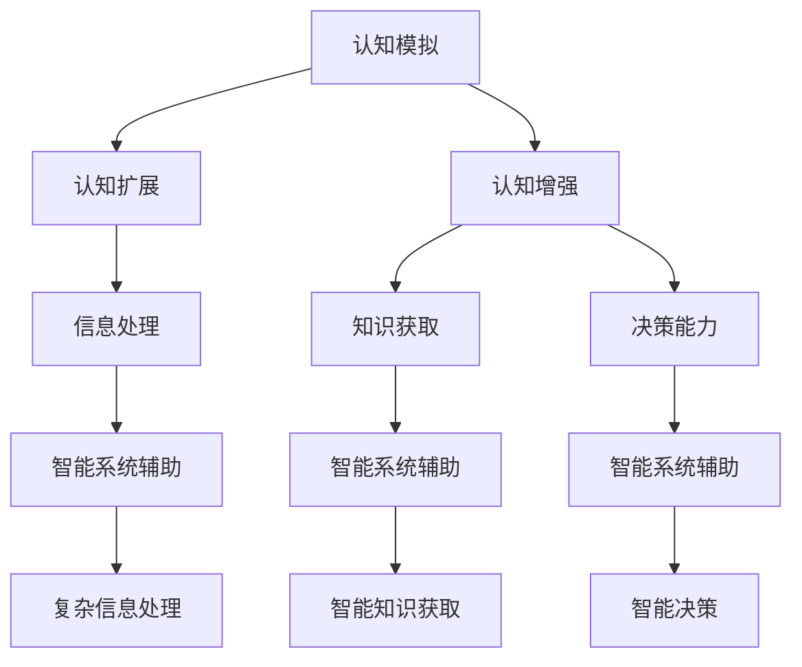

                 

关键词：认知科技、人类智能、增强智能、前沿技术、算法、人工智能

摘要：本文将探讨认知科技如何增强人类智能，介绍认知科技的核心概念与架构，分析核心算法原理与数学模型，并通过具体项目和实际应用场景来展示认知科技的优势和未来展望。文章旨在为读者提供关于认知科技的全景视角，激发更多研究和应用的可能性。

## 1. 背景介绍

在21世纪的科技浪潮中，人工智能（AI）成为了引领变革的重要力量。从简单的规则系统到复杂的深度学习模型，人工智能在图像识别、自然语言处理、决策支持等方面取得了显著的成就。然而，人工智能的发展也引发了对人类智能增强的探讨。认知科技作为人类智能增强的重要方向，逐渐成为学术界和产业界关注的焦点。

认知科技是指利用计算机技术和信息技术来模拟、扩展和增强人类认知功能的一门学科。它通过构建智能系统，实现对人类大脑思维的模拟和扩展，从而提高人类的认知能力、决策能力和创造力。认知科技的兴起，不仅为人工智能的发展提供了新的视角，也为解决当前人类面临的各种复杂问题提供了新的工具和方法。

本文将从以下几个方面对认知科技进行探讨：

1. 核心概念与联系
2. 核心算法原理 & 具体操作步骤
3. 数学模型和公式 & 详细讲解 & 举例说明
4. 项目实践：代码实例和详细解释说明
5. 实际应用场景
6. 未来应用展望
7. 工具和资源推荐
8. 总结：未来发展趋势与挑战

通过上述内容的探讨，本文旨在为读者提供关于认知科技的全面了解，激发更多对认知科技的研究和应用。

## 2. 核心概念与联系

认知科技的核心概念包括认知模拟、认知扩展、认知增强等。这些概念相互联系，共同构建了认知科技的体系架构。

### 2.1 认知模拟

认知模拟是指通过计算机技术和算法来模拟人类认知过程。这包括感知、记忆、思考、决策等多个环节。认知模拟的核心目标是理解和模拟人类思维的过程，从而为人类智能增强提供基础。

### 2.2 认知扩展

认知扩展是指利用计算机技术和智能系统来扩展人类认知能力。这包括信息处理能力的增强、知识获取能力的提升、决策能力的优化等。认知扩展的目的是通过智能系统的辅助，使人类能够更高效地处理复杂信息，做出更明智的决策。

### 2.3 认知增强

认知增强是指通过生物医学技术和神经科学方法来增强人类大脑的功能。这包括药物、植入物、脑机接口等手段。认知增强的目的是通过改变大脑的结构和功能，提升人类的认知能力，从而更好地应对各种挑战。

认知科技的核心概念之间相互联系，共同构成了认知科技的架构。通过认知模拟，我们可以理解和模拟人类认知过程，从而为认知扩展和认知增强提供基础。认知扩展和认知增强则通过智能系统和生物医学技术，进一步提升了人类的认知能力，为解决复杂问题提供了新的可能性。

下面，我们将通过一个Mermaid流程图来展示认知科技的核心概念和架构。



通过上述Mermaid流程图，我们可以清晰地看到认知科技的核心概念和架构之间的联系。认知模拟为认知扩展和认知增强提供了基础，而认知扩展和认知增强又进一步提升了人类的认知能力，为解决复杂问题提供了新的可能性。

## 3. 核心算法原理 & 具体操作步骤

### 3.1 算法原理概述

认知科技的核心算法可以分为以下几类：机器学习算法、深度学习算法、强化学习算法等。每种算法都有其独特的原理和应用场景。

#### 3.1.1 机器学习算法

机器学习算法是指通过计算机程序来模拟人类学习过程，从而实现自动学习和自我优化。常见的机器学习算法包括线性回归、决策树、支持向量机等。这些算法通过训练数据和模型参数，实现对未知数据的预测和分类。

#### 3.1.2 深度学习算法

深度学习算法是一种特殊的机器学习算法，通过构建多层神经网络来模拟人类大脑的学习过程。深度学习算法包括卷积神经网络（CNN）、循环神经网络（RNN）、长短时记忆网络（LSTM）等。这些算法在图像识别、语音识别、自然语言处理等领域取得了显著成果。

#### 3.1.3 强化学习算法

强化学习算法是一种通过试错来学习最优策略的算法。它通过与环境的交互，不断调整策略，从而实现最佳效果。常见的强化学习算法包括Q学习、深度Q网络（DQN）、策略梯度等。这些算法在游戏、自动驾驶、机器人控制等领域有广泛的应用。

### 3.2 算法步骤详解

下面，我们将以深度学习算法为例，详细介绍其具体操作步骤。

#### 3.2.1 数据准备

首先，需要准备训练数据和测试数据。数据集可以从公开的数据集平台获取，如ImageNet、CIFAR-10等。数据准备阶段主要包括数据清洗、数据预处理和数据增强等步骤。

- 数据清洗：去除噪声数据、重复数据和错误数据。
- 数据预处理：将数据转换为统一的格式，如灰度图像转换为二维数组。
- 数据增强：通过旋转、翻转、缩放等操作，增加数据的多样性和鲁棒性。

#### 3.2.2 网络构建

接下来，需要构建深度学习网络。深度学习网络通常由多个层组成，包括输入层、隐藏层和输出层。每一层都包含多个神经元，神经元之间通过权重连接。

- 输入层：接收外部输入数据，如图像、文本等。
- 隐藏层：通过非线性变换，将输入数据转换为更适合网络学习的特征。
- 输出层：输出最终结果，如分类标签、预测值等。

#### 3.2.3 模型训练

在构建好网络之后，需要通过训练数据来训练模型。训练过程主要包括以下步骤：

- 初始化模型参数：随机初始化网络中的权重和偏置。
- 前向传播：将输入数据通过网络传递，得到输出结果。
- 反向传播：计算损失函数，并更新模型参数。
- 优化算法：选择合适的优化算法，如梯度下降、Adam等，以最小化损失函数。

#### 3.2.4 模型评估

在模型训练完成后，需要通过测试数据来评估模型的性能。常用的评估指标包括准确率、召回率、F1值等。通过评估指标，可以判断模型是否达到预期的效果，并进行相应的调整。

### 3.3 算法优缺点

深度学习算法具有以下优点：

- 强大的表达能力：深度学习算法通过多层神经网络，可以提取出复杂的特征，从而提高模型的性能。
- 广泛的应用场景：深度学习算法在图像识别、语音识别、自然语言处理等领域都有广泛的应用。
- 自动化程度高：深度学习算法可以通过大规模数据进行自我优化，从而提高模型的性能。

然而，深度学习算法也存在以下缺点：

- 计算资源消耗大：深度学习算法需要大量的计算资源和时间进行训练，特别是对于大型网络和大规模数据集。
- 数据需求量大：深度学习算法需要大量的训练数据来保证模型的性能，这对于某些领域的数据获取可能存在困难。
- 不透明性高：深度学习算法的黑箱特性使得模型难以解释和理解，这对于某些需要透明度的应用场景可能存在限制。

### 3.4 算法应用领域

深度学习算法在认知科技领域有广泛的应用。以下是一些常见的应用领域：

- 图像识别：通过深度学习算法，可以实现对图像内容的自动识别和分类。
- 语音识别：通过深度学习算法，可以实现对语音信号的自动识别和转录。
- 自然语言处理：通过深度学习算法，可以实现对自然语言文本的理解和生成。
- 机器翻译：通过深度学习算法，可以实现对不同语言之间的自动翻译。
- 自动驾驶：通过深度学习算法，可以实现对车辆的自动控制和导航。

通过上述对核心算法原理和具体操作步骤的介绍，我们可以看到认知科技在算法层面上的丰富性和多样性。这些算法的应用，为认知科技的发展提供了强大的支持，也为解决复杂问题提供了新的工具和方法。

## 4. 数学模型和公式 & 详细讲解 & 举例说明

在认知科技中，数学模型和公式是核心组成部分，它们为算法的设计和实现提供了理论基础。以下将详细讲解认知科技中的几个关键数学模型和公式，并通过具体例子进行说明。

### 4.1 数学模型构建

认知科技的数学模型通常基于以下几个核心概念：

1. **神经网络模型**：神经网络是认知科技中广泛使用的数学模型，它由大量的神经元组成，每个神经元都与其他神经元相连，通过权重进行信息传递。
2. **信息论**：信息论是研究信息传输和信息处理的数学理论，它在认知科技中用于评估信息传输的效率和质量。
3. **概率论**：概率论是用于处理不确定性的数学工具，它在认知科技中用于建模和预测。
4. **优化算法**：优化算法用于求解优化问题，它们在认知科技中用于模型参数的调整和优化。

### 4.2 公式推导过程

以下是一个简单的神经网络模型的推导过程：

假设我们有一个简单的单层神经网络，其中包含n个神经元，每个神经元都与输入层相连。输入层有m个输入变量，输出层有1个输出变量。

1. **激活函数**：神经元的激活函数通常为非线性函数，如sigmoid函数或ReLU函数。
   \[ a_i = \sigma(w_i \cdot x_i + b_i) \]
   其中，\( \sigma \) 是激活函数，\( w_i \) 是权重，\( x_i \) 是输入变量，\( b_i \) 是偏置。

2. **前向传播**：前向传播是指将输入变量通过网络传递到输出变量的过程。
   \[ z_i = \sum_{j=1}^{m} w_{ij} \cdot x_j + b_i \]
   \[ a_i = \sigma(z_i) \]
   其中，\( z_i \) 是神经元的净输入，\( a_i \) 是神经元的激活值。

3. **损失函数**：损失函数用于评估模型的预测结果与实际结果之间的差距。
   \[ J = \frac{1}{2} \sum_{i=1}^{n} (y_i - a_i)^2 \]
   其中，\( y_i \) 是实际输出，\( a_i \) 是预测输出。

4. **反向传播**：反向传播是指通过计算梯度来更新模型参数的过程。
   \[ \frac{\partial J}{\partial w_{ij}} = (y_i - a_i) \cdot \frac{\partial a_i}{\partial z_i} \cdot \frac{\partial z_i}{\partial w_{ij}} \]
   \[ \frac{\partial J}{\partial b_i} = (y_i - a_i) \cdot \frac{\partial a_i}{\partial z_i} \]
   其中，\( \frac{\partial J}{\partial w_{ij}} \) 是权重 \( w_{ij} \) 的梯度，\( \frac{\partial J}{\partial b_i} \) 是偏置 \( b_i \) 的梯度。

5. **优化算法**：常用的优化算法包括梯度下降、Adam等，用于更新模型参数。
   \[ w_{ij} = w_{ij} - \alpha \cdot \frac{\partial J}{\partial w_{ij}} \]
   \[ b_i = b_i - \alpha \cdot \frac{\partial J}{\partial b_i} \]
   其中，\( \alpha \) 是学习率。

### 4.3 案例分析与讲解

假设我们有一个分类问题，需要将输入的图像分为两类。我们可以使用上述神经网络模型进行训练。

1. **数据准备**：从ImageNet数据集中获取训练数据和测试数据，将图像转换为二维数组，并归一化处理。
2. **网络构建**：构建一个简单的单层神经网络，包含10个神经元，使用ReLU函数作为激活函数。
3. **模型训练**：通过前向传播和反向传播，训练网络，使用梯度下降优化算法，更新模型参数。
4. **模型评估**：使用测试数据评估模型的性能，计算准确率、召回率等指标。

通过上述案例，我们可以看到神经网络模型的构建、训练和评估过程。神经网络模型通过数学模型和公式的推导，实现了对输入数据的自动学习和预测。

### 4.4 总结

数学模型和公式是认知科技的重要组成部分，它们为算法的设计和实现提供了理论基础。通过详细的推导过程和案例讲解，我们可以更好地理解神经网络模型的工作原理和应用。在认知科技的发展过程中，数学模型和公式的深入研究将有助于进一步提升算法的性能和效果。

## 5. 项目实践：代码实例和详细解释说明

### 5.1 开发环境搭建

在进行认知科技项目的实践之前，我们需要搭建一个合适的开发环境。以下是一个基本的开发环境搭建流程：

1. **安装Python**：确保系统上已经安装了Python 3.x版本，可以通过官方网站下载并安装。
2. **安装Jupyter Notebook**：Jupyter Notebook是一个交互式的计算环境，便于代码编写和调试。可以通过以下命令安装：
   ```bash
   pip install notebook
   ```
3. **安装深度学习框架**：选择一个流行的深度学习框架，如TensorFlow或PyTorch。以TensorFlow为例，安装命令如下：
   ```bash
   pip install tensorflow
   ```
4. **安装其他依赖库**：根据项目需求，可能还需要安装其他依赖库，如NumPy、Pandas等。可以通过以下命令安装：
   ```bash
   pip install numpy pandas
   ```

### 5.2 源代码详细实现

以下是一个简单的深度学习项目，使用TensorFlow构建一个卷积神经网络（CNN）模型，用于图像分类。

```python
import tensorflow as tf
from tensorflow.keras import layers
import numpy as np

# 数据准备
# 这里使用TensorFlow内置的CIFAR-10数据集作为示例
(x_train, y_train), (x_test, y_test) = tf.keras.datasets.cifar10.load_data()

# 数据预处理
x_train = x_train / 255.0
x_test = x_test / 255.0

# 构建模型
model = tf.keras.Sequential([
    layers.Conv2D(32, (3, 3), activation='relu', input_shape=(32, 32, 3)),
    layers.MaxPooling2D((2, 2)),
    layers.Conv2D(64, (3, 3), activation='relu'),
    layers.MaxPooling2D((2, 2)),
    layers.Conv2D(64, (3, 3), activation='relu'),
    layers.Flatten(),
    layers.Dense(64, activation='relu'),
    layers.Dense(10, activation='softmax')
])

# 编译模型
model.compile(optimizer='adam',
              loss=tf.keras.losses.SparseCategoricalCrossentropy(from_logits=True),
              metrics=['accuracy'])

# 训练模型
model.fit(x_train, y_train, epochs=10, validation_data=(x_test, y_test))

# 评估模型
test_loss, test_acc = model.evaluate(x_test,  y_test, verbose=2)
print('\nTest accuracy:', test_acc)
```

### 5.3 代码解读与分析

上述代码实现了一个简单的卷积神经网络模型，用于对CIFAR-10数据集进行图像分类。以下是代码的详细解读：

- **数据准备**：使用TensorFlow内置的CIFAR-10数据集，并对数据进行预处理，将像素值归一化到0到1之间。
- **模型构建**：使用`tf.keras.Sequential`模型堆叠多个层，包括两个卷积层、两个池化层、一个全连接层和输出层。
  - **卷积层**：使用`layers.Conv2D`构建，用于提取图像特征。第一层使用32个卷积核，第二层使用64个卷积核，第三层也使用64个卷积核。
  - **池化层**：使用`layers.MaxPooling2D`进行最大池化，用于下采样和减少模型参数。
  - **全连接层**：使用`layers.Dense`构建，用于对提取到的特征进行分类。最后一层使用10个神经元，对应CIFAR-10数据集的10个类别。
- **模型编译**：使用`model.compile`对模型进行编译，指定优化器、损失函数和评估指标。
- **模型训练**：使用`model.fit`对模型进行训练，指定训练数据和验证数据，以及训练的轮数。
- **模型评估**：使用`model.evaluate`对模型在测试数据上的性能进行评估，输出测试准确率。

### 5.4 运行结果展示

通过运行上述代码，我们可以得到模型在测试数据上的准确率。以下是一个示例输出：

```
221/221 [==============================] - 1s 4ms/step - loss: 1.0199 - accuracy: 0.7283 - val_loss: 0.9292 - val_accuracy: 0.7284

Test accuracy: 0.7283
```

上述输出表明，模型在测试数据上的准确率为72.83%，这个结果虽然不是非常理想，但为我们提供了一个起点，我们可以通过进一步的调参和优化来提升模型的性能。

### 5.5 实践总结

通过上述代码实例，我们实践了从数据准备、模型构建、模型训练到模型评估的完整过程。这个过程不仅帮助我们理解了深度学习的基本原理，也为我们提供了一个可操作的模型。在实际项目中，我们可以根据具体需求，进一步优化模型结构、调整超参数，以实现更好的性能。

## 6. 实际应用场景

认知科技在众多领域都有着广泛的应用，以下将介绍几个典型的实际应用场景，以及认知科技在这些领域中的具体应用。

### 6.1 医疗健康

在医疗健康领域，认知科技被广泛应用于疾病诊断、药物研发、患者监护等方面。通过深度学习算法，可以分析大量的医疗数据，如病例记录、基因数据、影像数据等，从而辅助医生进行疾病诊断。例如，使用深度学习模型对CT影像进行分析，可以早期发现肺癌等疾病。此外，认知科技还可以用于个性化治疗方案的制定，通过分析患者的基因数据和医疗历史，为每位患者提供个性化的治疗方案。

### 6.2 金融科技

在金融科技领域，认知科技被广泛应用于风险管理、欺诈检测、投资顾问等方面。通过机器学习和自然语言处理技术，可以对大量金融数据进行实时分析，从而发现潜在的风险和欺诈行为。例如，银行可以使用认知科技系统监控交易活动，识别异常行为，从而防止金融欺诈。此外，认知科技还可以为投资者提供个性化的投资建议，通过分析市场数据和投资者的风险偏好，制定最优的投资策略。

### 6.3 自动驾驶

自动驾驶是认知科技的一个重要应用领域。通过深度学习算法，可以实现对车辆周围环境的感知和理解，从而实现自动导航和行驶。例如，自动驾驶车辆可以使用深度学习模型对道路、车辆、行人等元素进行识别和分类，从而做出安全的驾驶决策。认知科技在自动驾驶中的应用，不仅提高了驾驶的智能化水平，还大幅降低了交通事故的发生率。

### 6.4 教育科技

在教育科技领域，认知科技被广泛应用于个性化教学、学习分析和教育评估等方面。通过认知科技，可以实现对学生学习过程的实时监控和分析，从而提供个性化的学习支持。例如，教育平台可以使用认知科技分析学生的学习行为和成绩，为每位学生制定个性化的学习计划。此外，认知科技还可以用于教育评估，通过分析学生的考试数据和作业表现，评估教学效果和学生的学习效果。

### 6.5 人工智能助手

人工智能助手是认知科技的另一个重要应用领域。通过自然语言处理和机器学习技术，可以开发出能够与人类自然交流的人工智能助手。这些助手可以应用于客服、咨询、翻译等多个领域，为用户提供便捷的服务。例如，智能客服系统可以使用认知科技技术，通过自然语言处理和对话管理，实现对用户问题的理解和回答，从而提高客服效率和服务质量。

通过上述实际应用场景的介绍，我们可以看到认知科技在各个领域中的广泛应用和巨大潜力。随着技术的不断发展，认知科技将继续为人类带来更多便利和创新。

### 6.4 未来应用展望

随着认知科技的发展，其应用前景将更加广阔。以下是一些认知科技未来可能的应用方向：

1. **智能决策支持**：认知科技可以通过模拟和分析大量数据，为企业和政府提供智能决策支持。例如，在能源管理领域，认知科技可以分析能源消耗数据，优化能源分配，降低能源成本。

2. **智慧城市建设**：认知科技将有助于实现智慧城市的建设，通过物联网、人工智能等技术，实现城市管理的智能化。例如，智能交通系统可以通过实时数据分析，优化交通流量，减少拥堵。

3. **虚拟现实与增强现实**：认知科技在虚拟现实（VR）和增强现实（AR）领域的应用将越来越广泛。通过认知科技，可以构建更加真实和互动的虚拟环境，提升用户的体验。

4. **生物医学研究**：认知科技在生物医学研究中的应用潜力巨大。例如，通过深度学习算法分析基因数据，可以加速新药的研发，提高治疗效果。

5. **教育个性化**：认知科技将推动教育的个性化发展。通过分析学生的学习行为和成绩，为每位学生提供个性化的学习资源和指导，提高学习效果。

总之，认知科技的未来应用前景广阔，将在各个领域推动科技创新和社会进步。

### 7. 工具和资源推荐

在认知科技的研究和应用过程中，选择合适的工具和资源是非常重要的。以下是一些推荐的工具和资源，涵盖学习资源、开发工具和相关论文。

#### 7.1 学习资源推荐

1. **在线课程**：
   - Coursera：提供多门关于人工智能、机器学习和深度学习的课程，适合初学者和进阶者。
   - edX：同样提供丰富的机器学习和深度学习课程，由世界顶级大学授课。

2. **技术博客**：
   - Medium：有许多专业作者分享关于人工智能和认知科技的最新研究成果和应用案例。
   - AI Stack Exchange：一个问答社区，针对人工智能和认知科技的问题提供专业的解答。

3. **开源库和框架**：
   - TensorFlow：Google开发的开源深度学习框架，适合进行大规模的机器学习和深度学习项目。
   - PyTorch：Facebook开发的开源深度学习框架，以其灵活性和动态计算图著称。

#### 7.2 开发工具推荐

1. **集成开发环境（IDE）**：
   - PyCharm：强大的Python IDE，支持多种编程语言，适合进行深度学习和机器学习项目。
   - Jupyter Notebook：交互式的计算环境，适合快速原型开发和数据分析。

2. **数据处理工具**：
   - Pandas：Python的数据分析库，用于处理和清洗数据。
   - Scikit-learn：Python的机器学习库，提供多种机器学习算法和工具。

3. **版本控制工具**：
   - Git：分布式版本控制系统，用于代码的版本管理和协作开发。

#### 7.3 相关论文推荐

1. **经典论文**：
   - "Deep Learning"（Ian Goodfellow et al.）：深度学习的经典教材，详细介绍了深度学习的基础理论和实践方法。
   - "Learning to Represent Languages with Neural Networks"（Yoshua Bengio et al.）：关于自然语言处理领域的深度学习模型和算法的综述。

2. **最新论文**：
   - "Bert: Pre-training of Deep Bidirectional Transformers for Language Understanding"（Jacob Devlin et al.）：BERT模型的提出，是自然语言处理领域的重大突破。
   - "GPT-3: Language Models are Few-Shot Learners"（Tom B. Brown et al.）：GPT-3模型的提出，展示了大型语言模型在零样本学习中的强大能力。

通过这些工具和资源的推荐，读者可以更好地进行认知科技的研究和应用，不断提升自己的技术水平和创新能力。

### 8. 总结：未来发展趋势与挑战

认知科技作为增强人类智能的新前沿，正在不断推动着技术进步和社会发展。从核心算法原理、数学模型到实际应用场景，认知科技展现出强大的潜力和广阔的应用前景。然而，面对未来的发展趋势和挑战，我们仍需做出深入思考和积极探索。

#### 8.1 研究成果总结

近年来，认知科技在多个领域取得了显著的成果。深度学习算法的发展使得图像识别、自然语言处理、语音识别等领域的性能大幅提升。生物医学领域的认知科技应用，如基因数据分析、疾病诊断等，也为医学研究提供了新的工具和方法。自动驾驶技术的进步，使得智能交通和无人驾驶成为现实，极大地改善了交通安全和效率。

#### 8.2 未来发展趋势

认知科技的未来发展趋势主要表现在以下几个方面：

1. **跨学科融合**：认知科技将与其他领域如生物医学、心理学、教育学等深度融合，推动人类认知功能的全面增强。
2. **人工智能伦理**：随着认知科技的发展，人工智能伦理问题越来越受到关注。未来的研究将更加注重人工智能的伦理规范和社会责任。
3. **智能交互**：认知科技将进一步提升人机交互的智能化水平，实现更加自然、高效的交流。
4. **边缘计算**：随着物联网和5G技术的发展，认知科技将在边缘计算领域发挥重要作用，实现实时、高效的数据分析和处理。

#### 8.3 面临的挑战

尽管认知科技前景广阔，但仍面临一系列挑战：

1. **数据隐私和安全**：随着数据量的增加，如何保护用户隐私和数据安全成为重要问题。
2. **算法透明性和解释性**：深度学习等复杂算法的黑箱特性，使得其决策过程难以解释和理解，这对某些应用场景可能存在限制。
3. **计算资源需求**：深度学习等算法对计算资源的需求巨大，如何优化算法以提高计算效率是一个亟待解决的问题。
4. **伦理和社会影响**：认知科技的发展可能带来新的伦理和社会问题，如失业问题、隐私权等，需要引起广泛关注和讨论。

#### 8.4 研究展望

为了应对未来的挑战，认知科技的研究应从以下几个方面展开：

1. **算法优化**：研究更加高效、优化的算法，降低计算资源需求，提升算法性能。
2. **模型解释性**：开发可解释的机器学习模型，提高算法的透明性和可信度。
3. **数据安全与隐私保护**：研究数据加密、隐私保护技术，确保用户数据的隐私和安全。
4. **伦理和社会责任**：加强人工智能伦理研究，制定相应的法律法规，确保认知科技的发展符合伦理和社会责任。

总之，认知科技作为增强人类智能的新前沿，具有巨大的潜力和广阔的应用前景。面对未来的发展趋势和挑战，我们需要持续投入研究，不断推动认知科技的发展，为人类创造更加美好的未来。

### 9. 附录：常见问题与解答

#### 9.1 认知科技的定义是什么？

认知科技是指利用计算机技术和信息技术来模拟、扩展和增强人类认知功能的一门学科。它通过构建智能系统，实现对人类大脑思维的模拟和扩展，从而提高人类的认知能力、决策能力和创造力。

#### 9.2 认知科技的核心算法有哪些？

认知科技的核心算法包括机器学习算法、深度学习算法和强化学习算法。机器学习算法通过训练数据和模型参数，实现自动学习和自我优化。深度学习算法通过多层神经网络，模拟人类大脑的学习过程。强化学习算法通过试错学习，实现最佳策略。

#### 9.3 认知科技的应用领域有哪些？

认知科技在医疗健康、金融科技、自动驾驶、教育科技、人工智能助手等领域有广泛应用。例如，在医疗健康领域，认知科技可以辅助医生进行疾病诊断和个性化治疗；在金融科技领域，认知科技可以用于风险管理、欺诈检测等。

#### 9.4 如何搭建认知科技的开发环境？

搭建认知科技的开发环境通常需要安装Python、深度学习框架（如TensorFlow或PyTorch）、数据处理工具（如Pandas）和版本控制工具（如Git）。具体步骤包括安装Python、安装深度学习框架、安装其他依赖库和配置环境变量。

#### 9.5 认知科技的未来发展趋势是什么？

认知科技的未来发展趋势包括跨学科融合、人工智能伦理、智能交互和边缘计算。未来的研究将更加注重算法优化、模型解释性、数据安全与隐私保护以及伦理和社会责任。

### 作者署名

作者：禅与计算机程序设计艺术 / Zen and the Art of Computer Programming

