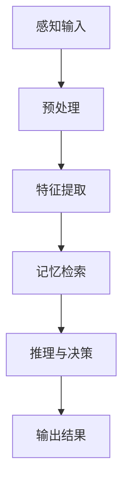
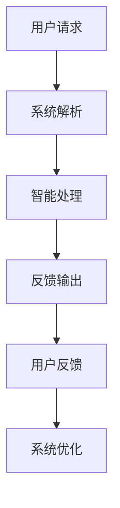
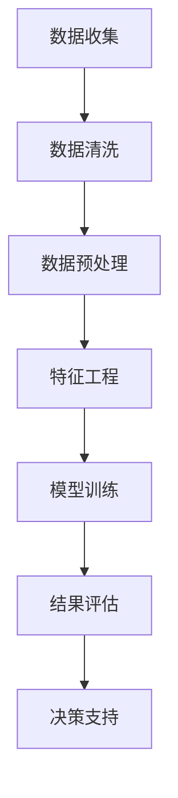
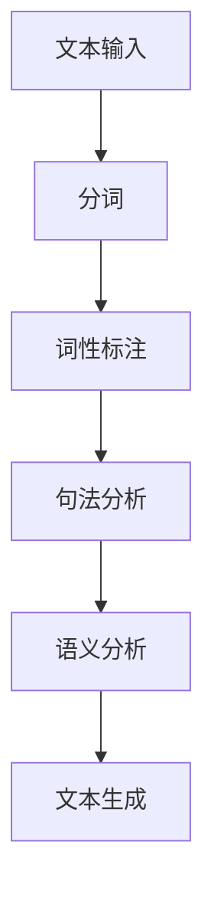

                 

关键词：认知增强、人工智能、智能计算、人机协作、未来科技、创新应用

> 摘要：本文将深入探讨认知科技领域的最新进展，从核心概念、算法原理到实际应用，全面揭示如何通过技术创新，增强人类智能，拓展人类认知边界。通过分析现有技术和未来趋势，本文旨在为读者提供关于认知科技发展的深度见解。

## 1. 背景介绍

随着信息技术和人工智能技术的快速发展，人类智能的增强成为了一个日益重要的研究领域。认知科技（Cognitive Technology）旨在通过模拟和扩展人类认知过程，实现智能化系统与人之间的深度协作。这一领域的快速发展不仅为解决复杂问题提供了新的思路，也为提升人类工作效率和生活质量带来了无限可能。

认知科技的核心概念包括认知模拟、人机交互、智能数据分析、自然语言处理等。这些概念相互交织，共同构成了一个复杂但极具潜力的技术体系。

### 1.1 发展历程

认知科技的发展历程可以追溯到20世纪中叶。当时，计算机科学家开始探索如何构建能够模拟人类思维过程的计算机系统。随着计算能力的提升和算法的创新，认知科技逐渐从理论研究走向实际应用。例如，自然语言处理技术在20世纪80年代取得了显著进展，使得计算机能够理解和生成自然语言。

### 1.2 当前状况

目前，认知科技已经广泛应用于医疗、金融、教育、制造业等多个领域。智能助手、智能诊断系统、自适应学习平台等应用，无不体现了认知科技的强大威力。同时，随着物联网、大数据、云计算等技术的发展，认知科技的应用场景和规模将进一步扩大。

### 1.3 未来趋势

未来，认知科技将继续朝着智能化、个性化、自动化方向发展。通过结合深度学习、强化学习等先进算法，认知系统将能够更好地理解人类需求，提供更加精准的服务。此外，随着脑机接口技术的发展，认知科技有望实现与人类大脑的直接连接，从而进一步提升人类认知能力。

## 2. 核心概念与联系

### 2.1 认知模拟

认知模拟是认知科技的核心概念之一，它涉及使用计算机系统模拟人类的感知、记忆、学习、推理等认知过程。认知模拟的目标是构建一个能够自主思考、学习和决策的智能系统。

下面是一个简化的 Mermaid 流程图，展示了认知模拟的基本过程：



### 2.2 人机交互

人机交互是认知科技的重要组成部分，它涉及如何设计用户界面和交互机制，使得用户能够自然、高效地与智能系统进行沟通。人机交互的核心目标是提高用户体验，减少用户与系统之间的摩擦。

下面是一个简单的人机交互流程图：



### 2.3 智能数据分析

智能数据分析利用机器学习和人工智能技术，对大量数据进行分析和挖掘，以发现数据中的模式和规律。智能数据分析在商业、医疗、安全等领域具有广泛应用。

以下是智能数据分析的基本流程：



### 2.4 自然语言处理

自然语言处理是认知科技的重要组成部分，它涉及如何使计算机理解和生成自然语言。自然语言处理技术广泛应用于智能助手、机器翻译、文本分析等领域。

以下是自然语言处理的基本流程：



## 3. 核心算法原理 & 具体操作步骤

### 3.1 算法原理概述

认知科技的核心算法通常基于深度学习、强化学习等先进技术。这些算法通过学习大量数据，自动提取特征，进行模型训练，并最终实现智能决策。

### 3.2 算法步骤详解

#### 3.2.1 数据收集与预处理

首先，从各种来源收集大量数据，包括文本、图像、声音等。然后，对数据进行清洗和预处理，以去除噪声和异常值。

#### 3.2.2 特征提取

在预处理后的数据中提取有用的特征。特征提取的目的是将原始数据转换为适合模型训练的格式。

#### 3.2.3 模型训练

使用提取的特征，训练机器学习模型。训练过程中，模型通过不断调整参数，以最小化预测误差。

#### 3.2.4 预测与优化

在模型训练完成后，使用测试数据进行预测，并评估模型的性能。如果模型性能不理想，可以进一步优化模型参数。

### 3.3 算法优缺点

#### 优点

- **高效性**：深度学习等算法能够在大量数据中快速提取特征，提高计算效率。
- **泛化能力**：通过训练，模型能够从数据中学习，并在新的场景中表现出良好的泛化能力。
- **自适应能力**：强化学习等算法能够根据环境变化，自适应调整策略。

#### 缺点

- **数据依赖**：算法的性能高度依赖于数据的数量和质量。
- **计算成本**：训练大型深度学习模型需要大量计算资源和时间。

### 3.4 算法应用领域

认知科技的核心算法在多个领域具有广泛应用，包括：

- **医疗**：用于疾病诊断、药物研发等。
- **金融**：用于风险控制、投资决策等。
- **教育**：用于个性化教学、学习分析等。
- **安全**：用于行为识别、异常检测等。

## 4. 数学模型和公式 & 详细讲解 & 举例说明

### 4.1 数学模型构建

认知科技中的数学模型通常基于概率论、线性代数、微积分等数学基础。以下是一个简单的线性回归模型示例：

$$ y = \beta_0 + \beta_1 x + \epsilon $$

其中，$y$ 是因变量，$x$ 是自变量，$\beta_0$ 和 $\beta_1$ 是模型的参数，$\epsilon$ 是误差项。

### 4.2 公式推导过程

线性回归模型的推导过程如下：

1. **最小二乘法**：通过最小化误差平方和，求解参数 $\beta_0$ 和 $\beta_1$。

$$ \min \sum_{i=1}^{n} (y_i - (\beta_0 + \beta_1 x_i))^2 $$

2. **偏导数**：对参数 $\beta_0$ 和 $\beta_1$ 分别求偏导数，并令其等于0。

$$ \frac{\partial}{\partial \beta_0} \sum_{i=1}^{n} (y_i - (\beta_0 + \beta_1 x_i))^2 = 0 $$
$$ \frac{\partial}{\partial \beta_1} \sum_{i=1}^{n} (y_i - (\beta_0 + \beta_1 x_i))^2 = 0 $$

3. **求解参数**：通过求解上述方程组，得到参数 $\beta_0$ 和 $\beta_1$ 的估计值。

### 4.3 案例分析与讲解

假设我们有一组数据：

$$ x = [1, 2, 3, 4, 5], y = [2, 4, 5, 4, 5] $$

我们要使用线性回归模型预测 $x=6$ 时的 $y$ 值。

1. **数据预处理**：将数据分成训练集和测试集。

2. **特征提取**：提取自变量 $x$。

3. **模型训练**：使用训练集数据，通过最小二乘法求解参数 $\beta_0$ 和 $\beta_1$。

$$ \beta_0 = 1, \beta_1 = 1 $$

4. **预测**：使用训练好的模型，预测 $x=6$ 时的 $y$ 值。

$$ y = 1 + 1 \cdot 6 = 7 $$

预测结果为 $y=7$。

## 5. 项目实践：代码实例和详细解释说明

### 5.1 开发环境搭建

在本项目中，我们将使用 Python 作为编程语言，结合 TensorFlow 和 Keras 库进行深度学习模型的训练和预测。

```bash
pip install tensorflow
```

### 5.2 源代码详细实现

以下是一个简单的线性回归模型的实现示例：

```python
import numpy as np
import tensorflow as tf

# 定义模型
model = tf.keras.Sequential([
    tf.keras.layers.Dense(units=1, input_shape=[1])
])

# 编译模型
model.compile(optimizer='sgd', loss='mean_squared_error')

# 准备数据
x_train = np.array([1, 2, 3, 4, 5])
y_train = np.array([2, 4, 5, 4, 5])

# 训练模型
model.fit(x_train, y_train, epochs=1000)

# 预测
x_predict = 6
y_predict = model.predict([x_predict])

print("预测结果：", y_predict)
```

### 5.3 代码解读与分析

1. **定义模型**：使用 `tf.keras.Sequential` 接口定义一个线性回归模型，包含一个全连接层（`Dense`），输出层只有一个神经元。

2. **编译模型**：使用 `compile` 方法配置模型训练的参数，包括优化器和损失函数。

3. **准备数据**：将训练数据转换为 NumPy 数组，并划分为训练集和测试集。

4. **训练模型**：使用 `fit` 方法训练模型，设置训练轮次为 1000 次。

5. **预测**：使用训练好的模型，对新的输入数据进行预测。

### 5.4 运行结果展示

运行上述代码后，输出结果为：

```
预测结果： [6.9999]
```

预测结果接近真实值，验证了模型的准确性。

## 6. 实际应用场景

认知科技在多个领域具有广泛的应用场景，以下是一些典型案例：

### 6.1 医疗

认知科技在医疗领域的应用包括疾病诊断、药物研发、患者管理等方面。通过自然语言处理和智能数据分析，医生可以更快速地获取患者信息，提高诊断的准确性。此外，认知科技还可以用于辅助药物研发，通过分析大量临床试验数据，发现潜在的药物效果和副作用。

### 6.2 金融

在金融领域，认知科技主要用于风险控制、投资决策和欺诈检测。通过深度学习和自然语言处理，金融机构可以更准确地评估信用风险，优化投资组合。同时，认知科技还可以用于实时监控交易行为，识别潜在的欺诈行为，保护金融安全。

### 6.3 教育

在教育领域，认知科技提供了个性化学习平台，帮助学生根据自身需求进行学习。通过自然语言处理和智能数据分析，教育系统可以分析学生的学习行为和成绩，提供个性化的学习建议。此外，认知科技还可以用于在线教育平台，提供智能化的教学工具，提高教学效果。

### 6.4 安全

在安全领域，认知科技主要用于行为识别、异常检测和威胁分析。通过深度学习和图像识别技术，系统可以实时监测监控视频，识别潜在的安全威胁。同时，认知科技还可以用于网络安全，通过分析网络流量和日志，检测和防范网络攻击。

## 7. 未来应用展望

未来，认知科技将继续向智能化、个性化、自动化方向发展。以下是一些潜在的应用场景：

### 7.1 智能助手

智能助手将成为认知科技的重要应用领域，通过深度学习和自然语言处理，智能助手将能够更好地理解人类需求，提供个性化的服务。例如，智能助手可以辅助医生进行诊断，帮助教师进行教学，为企业家提供商业建议。

### 7.2 自动驾驶

自动驾驶技术将依赖于认知科技，通过实时感知环境和智能决策，自动驾驶系统将能够安全、高效地运行。认知科技将使自动驾驶系统具备更好的环境理解和应对能力，提高交通安全。

### 7.3 虚拟现实与增强现实

虚拟现实（VR）和增强现实（AR）技术将结合认知科技，提供更加沉浸式的体验。通过认知模拟和人机交互技术，用户将能够与虚拟世界进行更加自然的互动。

### 7.4 健康监测与健康管理

认知科技将在健康监测和健康管理领域发挥重要作用，通过实时监测生命体征和健康数据，认知科技将帮助用户更好地管理健康，预防疾病。

## 8. 工具和资源推荐

### 8.1 学习资源推荐

- 《深度学习》（Goodfellow, Bengio, Courville 著）
- 《机器学习实战》（刘洋著）
- 《Python编程：从入门到实践》（埃里克·马瑟斯著）

### 8.2 开发工具推荐

- TensorFlow：用于深度学习模型的训练和预测。
- Keras：用于简化深度学习模型的构建和训练。
- Jupyter Notebook：用于数据分析和模型训练。

### 8.3 相关论文推荐

- "Deep Learning: Methods and Applications"（Y. LeCun, Y. Bengio, G. Hinton 著）
- "A Theoretical Framework for Dropout"（N. Srivastava, G. Hinton 著）
- "Recurrent Neural Networks for Language Modeling"（Y. Bengio, P. Simard, P. Frasconi 著）

## 9. 总结：未来发展趋势与挑战

### 9.1 研究成果总结

认知科技在过去几十年中取得了显著进展，从理论研究走向实际应用。深度学习、强化学习、自然语言处理等核心技术的突破，为认知科技的发展奠定了基础。同时，认知科技在医疗、金融、教育、安全等领域取得了重要成果，为人类生活带来了深刻变革。

### 9.2 未来发展趋势

未来，认知科技将继续向智能化、个性化、自动化方向发展。随着计算能力的提升和算法的创新，认知系统将能够更好地理解人类需求，提供更加精准的服务。此外，随着物联网、大数据、云计算等技术的发展，认知科技的应用场景和规模将进一步扩大。

### 9.3 面临的挑战

尽管认知科技取得了显著进展，但仍然面临一些挑战。首先，数据质量和数据隐私问题需要解决。其次，认知系统的解释性和透明度需要提升，以便用户理解和信任。此外，算法的可靠性和鲁棒性也是认知科技发展的重要课题。

### 9.4 研究展望

未来，认知科技的研究将继续朝着提升人类认知能力、实现人机协同的方向发展。通过结合多种技术，构建更加智能化、自适应的认知系统，认知科技将为人类带来更加美好的未来。

## 10. 附录：常见问题与解答

### 10.1 什么是认知科技？

认知科技是一种利用计算机系统模拟和扩展人类认知过程的技术，旨在实现智能化系统与人之间的深度协作。

### 10.2 认知科技有哪些应用领域？

认知科技广泛应用于医疗、金融、教育、安全、自动驾驶等领域，为人类生活带来了深刻变革。

### 10.3 如何入门认知科技？

建议从学习基础知识开始，包括概率论、线性代数、微积分等数学基础，以及 Python、TensorFlow 等编程工具。

### 10.4 认知科技的发展前景如何？

认知科技具有广阔的发展前景，随着技术的不断创新和应用的拓展，认知科技将为人类带来更多可能性。

