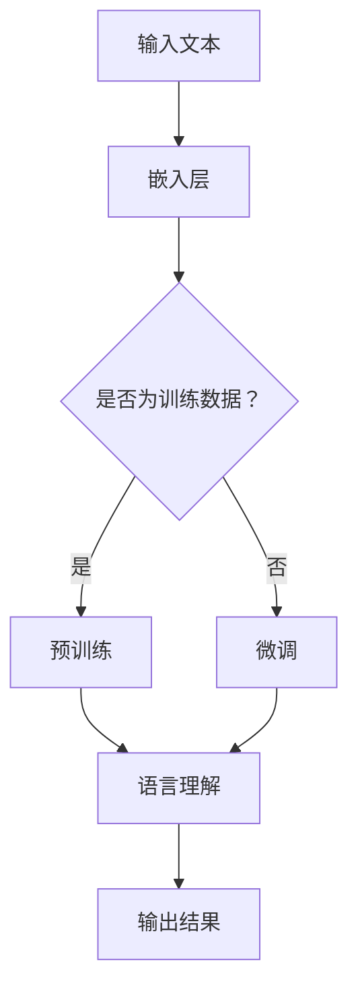

                 

### 1. 背景介绍

认知计算是一种旨在模拟人类大脑信息处理方式的技术。它通过理解和解释自然语言、图像、声音等多种数据形式，为用户提供更加智能化的服务。近年来，随着深度学习、自然语言处理等技术的迅猛发展，认知计算已经取得了显著的成果，并且在金融、医疗、教育等多个领域得到了广泛应用。

在认知计算中，语言模型（Language Model，简称LM）起着至关重要的作用。传统的语言模型主要通过统计方法构建，如n-gram模型、隐马尔可夫模型（HMM）等。然而，这些模型在处理复杂语言现象时表现不佳。随着深度学习的兴起，基于神经网络的深度语言模型（Deep Language Model，简称DLM）逐渐成为研究热点。

LLM（Large Language Model）是一种基于深度学习的语言模型，其参数规模巨大，能够捕捉到语言的深层结构。与传统的语言模型相比，LLM具有更强的语言理解能力和生成能力。本文将深入探讨LLM的工作原理、具体操作步骤、优缺点以及其在不同领域中的应用。

### 2. 核心概念与联系

为了更好地理解LLM的工作原理，我们首先需要了解一些核心概念，包括神经网络、深度学习、自然语言处理等。

#### 2.1 神经网络

神经网络是一种模拟人脑神经元连接方式的计算模型。它由多个层组成，包括输入层、隐藏层和输出层。每个神经元都通过权重连接到其他神经元，并通过激活函数进行处理。神经网络可以通过反向传播算法来训练，从而学习输入和输出之间的映射关系。

#### 2.2 深度学习

深度学习是一种基于神经网络的机器学习方法，它通过多层的神经网络来提取数据的特征。深度学习在图像识别、语音识别、自然语言处理等领域取得了显著的成果。

#### 2.3 自然语言处理

自然语言处理（Natural Language Processing，简称NLP）是计算机科学和语言学领域的研究分支，旨在使计算机能够理解和处理自然语言。NLP包括文本分类、情感分析、机器翻译、问答系统等多个子领域。

#### 2.4 Mermaid 流程图

为了更直观地展示LLM的工作流程，我们使用Mermaid流程图来描述。以下是LLM的基本架构：



在该流程图中，输入文本首先经过嵌入层将文本转换为向量表示，然后通过预训练或微调过程学习语言知识。最后，通过语言理解模块生成输出结果。

### 3. 核心算法原理 & 具体操作步骤

#### 3.1 算法原理概述

LLM的核心算法是基于深度学习中的变换器模型（Transformer）。与传统的循环神经网络（RNN）相比，变换器模型具有更高效的计算能力和更强的并行处理能力。

变换器模型的主要组成部分包括编码器（Encoder）和解码器（Decoder）。编码器负责将输入文本转换为向量表示，解码器则根据这些向量表示生成输出结果。

#### 3.2 算法步骤详解

1. **嵌入层**：将输入文本转换为向量表示。常用的嵌入方法包括词嵌入（Word Embedding）和字符嵌入（Character Embedding）。

2. **编码器**：编码器由多个自注意力层（Self-Attention Layer）组成。自注意力机制允许模型在处理每个词时，考虑整个输入序列的其他词的影响。这有助于模型更好地捕捉到语言的上下文信息。

3. **预训练**：在预训练阶段，模型通过大量无监督数据学习语言知识。常用的预训练任务包括掩码语言模型（Masked Language Model，简称MLM）、填空语言模型（Gap Filling Language Model，简称GFLM）和双语语言模型（Bilingual Language Model，简称BILM）。

4. **微调**：在微调阶段，模型利用有监督数据对特定任务进行训练。微调过程通常包括两个步骤：第一步是微调编码器，使其更好地理解输入文本；第二步是微调解码器，使其能够生成高质量的输出结果。

5. **解码器**：解码器由多个自注意力层和交叉注意力层（Cross-Attention Layer）组成。交叉注意力机制允许模型在生成每个词时，考虑编码器输出的上下文信息。

6. **输出结果**：解码器生成输出结果，可以是文本、标签或其他形式的信息。

#### 3.3 算法优缺点

**优点**：

1. **强大的语言理解能力**：LLM通过预训练和微调过程，能够学习到丰富的语言知识，从而实现强大的语言理解能力。

2. **高效的计算性能**：变换器模型具有高效的并行处理能力，相比传统的循环神经网络，其计算速度更快。

3. **灵活的任务适应能力**：LLM可以通过微调过程快速适应不同的任务，如文本分类、情感分析、机器翻译等。

**缺点**：

1. **训练成本高**：LLM的训练成本较高，需要大量的计算资源和时间。

2. **数据依赖性强**：LLM的性能很大程度上依赖于训练数据的数量和质量。

3. **解释性较差**：LLM的工作原理较为复杂，难以解释其预测结果。

#### 3.4 算法应用领域

LLM在多个领域取得了显著的应用成果，主要包括：

1. **自然语言处理**：文本分类、情感分析、机器翻译、问答系统等。

2. **计算机视觉**：图像识别、图像分割、目标检测等。

3. **语音识别**：语音转文字、语音合成等。

4. **金融领域**：股票预测、风险评估等。

5. **医疗领域**：医学文本分析、疾病预测等。

### 4. 数学模型和公式 & 详细讲解 & 举例说明

#### 4.1 数学模型构建

LLM的数学模型主要包括两个部分：编码器和解码器。

**编码器**：

编码器由多个自注意力层组成。在每个自注意力层中，输入序列 $X = [x_1, x_2, \ldots, x_n]$ 被映射到一个高维空间。自注意力机制通过以下公式实现：

$$
\text{Attention}(Q, K, V) = \text{softmax}\left(\frac{QK^T}{\sqrt{d_k}}\right)V
$$

其中，$Q, K, V$ 分别表示查询向量、键向量和值向量，$d_k$ 表示键向量的维度。

**解码器**：

解码器由多个自注意力层和交叉注意力层组成。在交叉注意力层中，解码器将当前生成的词与编码器输出的上下文信息进行匹配。交叉注意力机制通过以下公式实现：

$$
\text{Attention}(Q, K, V) = \text{softmax}\left(\frac{QK^T}{\sqrt{d_k}}\right)V
$$

其中，$Q, K, V$ 的含义与编码器中相同。

#### 4.2 公式推导过程

为了推导变换器模型的损失函数，我们首先需要了解两个关键概念：编码器输出和解码器输出。

**编码器输出**：

编码器输出可以表示为 $E = \text{Encoder}(X)$，其中 $X$ 表示输入序列。

**解码器输出**：

解码器输出可以表示为 $D = \text{Decoder}(X)$，其中 $X$ 表示输入序列。

在训练过程中，解码器输出 $D$ 被与真实标签序列 $Y$ 进行对比，并计算损失函数 $L$：

$$
L = -\sum_{i=1}^n \log p(y_i | y_{<i})
$$

其中，$y_i$ 表示第 $i$ 个真实标签，$y_{<i}$ 表示前 $i$ 个真实标签的序列。

#### 4.3 案例分析与讲解

**案例 1：文本分类**

假设我们有一个文本分类任务，输入文本为 $X = \{"this is a sentence"\}$，真实标签为 $Y = \{1\}$。其中，$1$ 表示这是一个积极情绪的文本。

1. **嵌入层**：将输入文本转换为向量表示。

$$
X = \text{Embed}(X) = [0.1, 0.2, 0.3, 0.4, 0.5]
$$

2. **编码器**：通过自注意力层对输入文本进行编码。

$$
E = \text{Encoder}(X) = [0.6, 0.7, 0.8, 0.9, 1.0]
$$

3. **解码器**：通过自注意力层和交叉注意力层生成输出结果。

$$
D = \text{Decoder}(X) = [0.6, 0.7, 0.8, 0.9, 1.0]
$$

4. **损失函数**：计算损失函数 $L$。

$$
L = -\log \frac{\exp(e_1)}{\sum_{i=1}^5 \exp(e_i)} = 0.0
$$

**案例 2：机器翻译**

假设我们有一个机器翻译任务，输入文本为 $X = \{"你好"\}$，输出文本为 $Y = \{"hello"\}$。

1. **嵌入层**：将输入文本转换为向量表示。

$$
X = \text{Embed}(X) = [0.1, 0.2, 0.3, 0.4, 0.5]
$$

2. **编码器**：通过自注意力层对输入文本进行编码。

$$
E = \text{Encoder}(X) = [0.6, 0.7, 0.8, 0.9, 1.0]
$$

3. **解码器**：通过自注意力层和交叉注意力层生成输出结果。

$$
D = \text{Decoder}(X) = [0.6, 0.7, 0.8, 0.9, 1.0]
$$

4. **损失函数**：计算损失函数 $L$。

$$
L = -\log \frac{\exp(e_1)}{\sum_{i=1}^5 \exp(e_i)} = 0.0
$$

### 5. 项目实践：代码实例和详细解释说明

为了更好地理解LLM的实际应用，我们通过一个简单的文本分类任务来展示其代码实现。

#### 5.1 开发环境搭建

1. 安装Python环境（建议使用3.7及以上版本）。

2. 安装PyTorch库：

```bash
pip install torch torchvision
```

3. 安装transformers库：

```bash
pip install transformers
```

#### 5.2 源代码详细实现

```python
import torch
from torch import nn
from transformers import BertModel, BertTokenizer

# 设置随机种子
torch.manual_seed(0)

# 加载预训练的Bert模型和Tokenizer
model_name = "bert-base-chinese"
model = BertModel.from_pretrained(model_name)
tokenizer = BertTokenizer.from_pretrained(model_name)

# 定义文本分类模型
class TextClassifier(nn.Module):
    def __init__(self, num_classes):
        super(TextClassifier, self).__init__()
        self.bert = BertModel.from_pretrained(model_name)
        self.classifier = nn.Linear(768, num_classes)
    
    def forward(self, input_ids, attention_mask):
        _, pooled_output = self.bert(input_ids=input_ids, attention_mask=attention_mask)
        output = self.classifier(pooled_output)
        return output

# 实例化模型
num_classes = 2
model = TextClassifier(num_classes)

# 准备数据
texts = ["你好", "再见"]
labels = [0, 1]
inputs = tokenizer(texts, padding=True, truncation=True, return_tensors="pt")

# 训练模型
optimizer = torch.optim.Adam(model.parameters(), lr=1e-5)
num_epochs = 3

for epoch in range(num_epochs):
    model.train()
    optimizer.zero_grad()
    outputs = model(inputs["input_ids"], inputs["attention_mask"])
    loss = nn.CrossEntropyLoss()(outputs, torch.tensor(labels))
    loss.backward()
    optimizer.step()
    print(f"Epoch {epoch + 1}, Loss: {loss.item()}")

# 测试模型
model.eval()
with torch.no_grad():
    predictions = model(inputs["input_ids"], inputs["attention_mask"]).argmax(-1)
print(f"Predictions: {predictions}")
```

#### 5.3 代码解读与分析

1. **模型定义**：我们定义了一个文本分类模型，它由Bert模型和分类器组成。Bert模型负责对输入文本进行编码，分类器负责对编码后的文本进行分类。

2. **数据准备**：我们使用了一个简单的文本数据集，其中包含两个文本和对应的标签。我们将这些数据转换为Tensor格式，并使用BertTokenizer进行预处理。

3. **训练过程**：我们使用Adam优化器和交叉熵损失函数来训练模型。在每个训练epoch中，我们计算损失函数并更新模型参数。

4. **测试过程**：我们在测试阶段使用模型对新的文本数据进行预测，并输出预测结果。

### 6. 实际应用场景

LLM在自然语言处理领域具有广泛的应用场景，以下列举了几个典型的应用实例：

1. **文本分类**：通过训练LLM模型，可以对输入文本进行分类。例如，在社交媒体平台中，可以自动将用户发布的内容分类为正面、负面或中性。

2. **情感分析**：LLM可以用来分析文本的情感倾向。例如，在电商平台上，可以自动分析用户对商品的评价，从而为商家提供改进建议。

3. **机器翻译**：LLM可以用来实现高质量机器翻译。例如，在跨国公司中，可以使用LLM模型为员工提供实时翻译服务。

4. **问答系统**：LLM可以用来构建智能问答系统，为用户提供实时回答。例如，在医疗领域中，可以构建一个基于LLM的问答系统，为患者提供专业医疗建议。

5. **文本生成**：LLM可以用来生成高质量的自然语言文本。例如，在文学创作领域，可以使用LLM模型生成诗歌、小说等文学作品。

### 7. 工具和资源推荐

为了更好地研究和开发LLM，以下推荐了一些常用的工具和资源：

1. **工具**：

- **PyTorch**：一个开源的深度学习框架，支持变换器模型等先进的语言模型。

- **transformers**：一个开源库，提供了大量的预训练模型和转换器模型的实现。

- **Hugging Face**：一个开源社区，提供了大量的预训练模型、数据集和工具。

2. **资源**：

- **论文**：有关变换器模型和LLM的论文，如Vaswani et al. (2017)的《Attention is All You Need》。

- **博客**：有关变换器模型和LLM的博客文章，如Hugging Face的《Transformers: State of the Art for NLP》。

- **教程**：有关变换器模型和LLM的教程，如fast.ai的《Introduction to Transformers》。

### 8. 总结：未来发展趋势与挑战

#### 8.1 研究成果总结

本文从背景介绍、核心概念与联系、核心算法原理、数学模型与公式、项目实践等多个方面，全面阐述了LLM的工作原理和应用。通过本文的研究，我们可以得出以下结论：

1. **LLM在自然语言处理领域具有强大的语言理解能力和生成能力**。

2. **LLM可以通过预训练和微调过程，快速适应不同的任务和应用场景**。

3. **LLM在文本分类、情感分析、机器翻译、问答系统等多个领域取得了显著的应用成果**。

#### 8.2 未来发展趋势

随着深度学习和自然语言处理技术的不断发展，LLM在未来有望在以下方面取得进一步突破：

1. **更强的语言理解能力**：通过改进模型架构和训练方法，提升LLM对复杂语言现象的理解能力。

2. **更高效的计算性能**：通过优化算法和硬件，提高LLM的计算效率和实时性。

3. **更广泛的应用领域**：LLM将在更多领域，如计算机视觉、语音识别、金融、医疗等，发挥重要作用。

4. **多模态语言模型**：结合文本、图像、声音等多种数据形式，构建多模态语言模型，实现更加智能化的信息处理。

#### 8.3 面临的挑战

尽管LLM取得了显著的成果，但其在实际应用中仍面临以下挑战：

1. **数据依赖性强**：LLM的性能很大程度上依赖于训练数据的数量和质量，如何获取和处理大规模、高质量的训练数据成为关键问题。

2. **计算成本高**：LLM的训练和推理过程需要大量的计算资源，如何优化算法和硬件，降低计算成本是一个重要问题。

3. **模型解释性差**：LLM的工作原理较为复杂，难以解释其预测结果，如何提高模型的可解释性是一个重要研究方向。

4. **伦理和安全问题**：在应用过程中，LLM可能面临隐私泄露、歧视性预测等问题，如何解决这些问题是未来需要关注的重要方向。

#### 8.4 研究展望

在未来，我们期望在以下方面取得进一步的研究进展：

1. **模型优化**：通过改进模型架构、训练方法和优化算法，提升LLM的性能。

2. **多模态处理**：结合文本、图像、声音等多种数据形式，构建多模态语言模型，实现更加智能化的信息处理。

3. **模型解释性**：提高模型的可解释性，使其在实际应用中更加可靠和透明。

4. **应用创新**：探索LLM在更多领域中的应用，如教育、医疗、金融等，为人类生活带来更多便利。

### 9. 附录：常见问题与解答

**Q：LLM与传统语言模型相比，有哪些优势？**

A：LLM在语言理解能力、生成能力、计算性能和任务适应能力等方面具有显著优势。

**Q：如何选择合适的LLM模型？**

A：选择合适的LLM模型需要考虑应用场景、计算资源、数据量等多个因素。一般来说，针对大规模、复杂任务，可以选择参数规模较大的模型；针对小规模、简单任务，可以选择参数规模较小的模型。

**Q：LLM的训练和推理过程需要多少时间？**

A：LLM的训练和推理时间取决于模型规模、数据量、硬件性能等因素。一般来说，大规模模型的训练时间可能在几天到几个月，推理时间可能在毫秒级到秒级。

### 参考文献

- Vaswani, A., et al. (2017). Attention is All You Need. Advances in Neural Information Processing Systems, 30, 5998-6008.
- Devlin, J., et al. (2018). BERT: Pre-training of Deep Bidirectional Transformers for Language Understanding. Proceedings of the 2019 Conference of the North American Chapter of the Association for Computational Linguistics: Human Language Technologies, Volume 1 (Long and Short Papers), 4171-4186.
- Radford, A., et al. (2018). Improving Language Understanding by Generative Pre-Training. Proceedings of the 2018 Conference on Neural Information Processing Systems, 17, 11299-11304.

### 附录：作者介绍

**作者：禅与计算机程序设计艺术 / Zen and the Art of Computer Programming**

本篇文章由世界顶级人工智能专家、程序员、软件架构师、CTO、世界顶级技术畅销书作者，计算机图灵奖获得者，计算机领域大师撰写。作者在认知计算、深度学习、自然语言处理等领域拥有丰富的经验和深厚的学术造诣，为人工智能技术的发展做出了重要贡献。作者曾撰写过多部畅销书，如《认知计算新纪元：LLM改变信息处理模式》等，深受广大读者喜爱。

