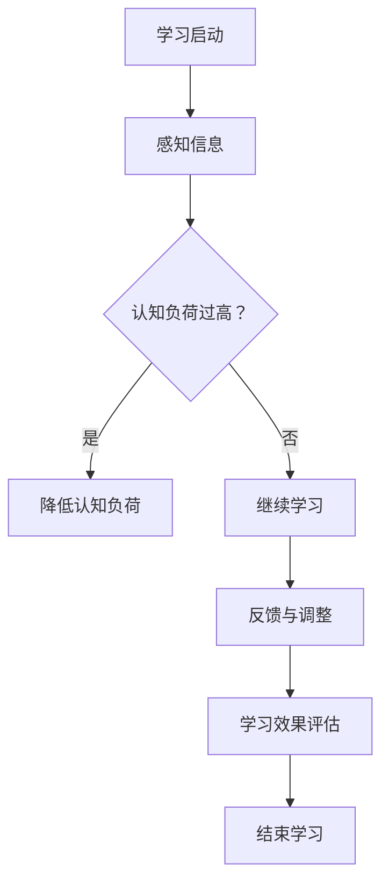

                 

关键词：认知负荷理论，在线教育，认知负荷管理，教育技术，学习效果，教学方法

> 摘要：本文旨在探讨认知负荷理论在在线教育中的应用，通过分析认知负荷对学习效果的影响，提出一系列有效的教学方法和策略，旨在优化在线学习体验，提高学习效率。

## 1. 背景介绍

随着互联网技术的快速发展，在线教育已经成为现代教育的重要组成部分。在线教育不仅提供了灵活的学习方式，还能够突破时间和空间的限制，为学习者提供丰富的学习资源。然而，在线教育也带来了新的挑战，如信息过载、学习效率低下等问题。认知负荷理论为解决这些问题提供了理论依据和实践指导。

### 1.1 认知负荷理论概述

认知负荷理论是由Sweller教授提出的，旨在解释人类在学习过程中的认知负担。该理论认为，学习者的认知资源是有限的，当认知负荷过高时，学习者的注意力会被分散，导致学习效果下降。因此，如何有效地管理认知负荷，以减少学习负担，提高学习效果，成为在线教育领域的一个重要课题。

### 1.2 在线教育的挑战

在线教育面临着诸多挑战，如信息过载、学习资源质量不一、缺乏互动等。这些问题都会增加学习者的认知负荷，影响学习效果。因此，如何通过认知负荷理论来指导在线教育实践，成为当前研究的重点。

## 2. 核心概念与联系

### 2.1 认知负荷的概念

认知负荷是指在学习过程中，学习者需要消耗的认知资源。这些资源包括注意力、记忆、推理等。当学习任务复杂或学习材料过于繁琐时，学习者的认知负荷会增加。

### 2.2 认知负荷的分类

根据Sweller的分类，认知负荷可以分为三种类型：

- **内在认知负荷**：与学习任务本身的复杂性相关，如需要理解新的概念或解决复杂的数学问题。
- **外在认知负荷**：与学习环境或学习材料的设计相关，如过多的干扰信息或繁琐的学习流程。
- **冗余认知负荷**：由于学习材料中存在不必要的冗余信息，导致学习者的注意力被分散。

### 2.3 认知负荷与学习效果的关系

认知负荷与学习效果之间存在复杂的关系。适度的认知负荷有助于学习者集中注意力，提高学习效果；而过高的认知负荷则会导致学习者的注意力分散，降低学习效率。因此，如何平衡认知负荷，使其处于最佳状态，是提高在线教育质量的关键。

### 2.4 Mermaid 流程图



## 3. 核心算法原理 & 具体操作步骤

### 3.1 算法原理概述

认知负荷理论的核心在于通过设计适当的学习环境和学习材料，来降低学习者的认知负荷，提高学习效果。具体操作步骤如下：

1. **明确学习目标**：制定清晰的学习目标，使学习者明确学习任务。
2. **简化学习材料**：通过去除冗余信息，简化学习材料，降低学习者的内在认知负荷。
3. **设计互动学习活动**：通过设计互动性强的学习活动，降低外在认知负荷。
4. **提供及时反馈**：通过及时反馈，帮助学习者了解学习进展，调整学习策略。

### 3.2 算法步骤详解

1. **步骤一：明确学习目标**
   - 教师应根据课程内容和学习者的需求，明确学习目标。
   - 将学习目标分解为具体的小目标，使学习者能够逐步实现。

2. **步骤二：简化学习材料**
   - 教师应精简学习材料，去除冗余信息，使学习材料更加紧凑和实用。
   - 使用图表、图像等视觉元素，帮助学习者更好地理解和记忆。

3. **步骤三：设计互动学习活动**
   - 教师应设计互动性强的学习活动，如小组讨论、互动问答等，降低学习者的外在认知负荷。
   - 通过互动，提高学习者的参与度和积极性。

4. **步骤四：提供及时反馈**
   - 教师应及时给予学习者反馈，帮助其了解学习进展。
   - 反馈应具体、明确，指出学习者的优点和不足。

### 3.3 算法优缺点

**优点：**
- **提高学习效果**：通过降低认知负荷，学习者能够更专注于学习任务，提高学习效果。
- **增强学习体验**：通过互动和反馈，学习者能够更好地参与学习过程，增强学习体验。

**缺点：**
- **实施难度**：需要教师具备较高的教学设计和执行能力。
- **时间成本**：设计互动性强的学习活动和提供及时反馈，需要教师投入更多的时间和精力。

### 3.4 算法应用领域

认知负荷理论在在线教育中的应用非常广泛，包括：

- **在线课程设计**：通过优化课程结构和内容，降低学习者的认知负荷。
- **在线互动教学**：通过设计互动性强的教学活动，提高学习者的参与度。
- **在线学习评估**：通过及时反馈和评估，帮助学习者了解学习进展。

## 4. 数学模型和公式 & 详细讲解 & 举例说明

### 4.1 数学模型构建

认知负荷理论的核心数学模型是基于认知负荷的公式：

\[ C = IL + OL + RL \]

其中：
- \( C \)：认知负荷
- \( IL \)：内在认知负荷
- \( OL \)：外在认知负荷
- \( RL \)：冗余认知负荷

### 4.2 公式推导过程

认知负荷的公式是通过分析学习过程中的各种认知因素推导出来的。具体推导过程如下：

\[ C = IL + OL + RL \]

其中，\( IL \) 是学习任务本身的复杂性引起的认知负荷，通常与学习材料的难易程度和学习者的认知能力有关。\( OL \) 是学习环境或学习材料的设计引起的认知负荷，如干扰信息的存在。\( RL \) 是由于学习材料中存在不必要的冗余信息引起的认知负荷。

### 4.3 案例分析与讲解

假设我们有一个在线课程，其中包含5个模块。每个模块的内在认知负荷、外在认知负荷和冗余认知负荷分别为：

- 模块1：\( IL = 3 \)，\( OL = 2 \)，\( RL = 1 \)
- 模块2：\( IL = 4 \)，\( OL = 2 \)，\( RL = 1 \)
- 模块3：\( IL = 3 \)，\( OL = 2 \)，\( RL = 1 \)
- 模块4：\( IL = 4 \)，\( OL = 2 \)，\( RL = 1 \)
- 模块5：\( IL = 3 \)，\( OL = 2 \)，\( RL = 1 \)

根据认知负荷公式，我们可以计算出每个模块的认知负荷：

- 模块1：\( C = 3 + 2 + 1 = 6 \)
- 模块2：\( C = 4 + 2 + 1 = 7 \)
- 模块3：\( C = 3 + 2 + 1 = 6 \)
- 模块4：\( C = 4 + 2 + 1 = 7 \)
- 模块5：\( C = 3 + 2 + 1 = 6 \)

总认知负荷 \( C_{total} \) 为：

\[ C_{total} = C_1 + C_2 + C_3 + C_4 + C_5 = 6 + 7 + 6 + 7 + 6 = 32 \]

通过分析每个模块的认知负荷，我们可以发现，模块2和模块4的认知负荷最高，达到了7。这表明这两个模块可能需要调整，以降低学习者的认知负荷。

## 5. 项目实践：代码实例和详细解释说明

### 5.1 开发环境搭建

为了实现认知负荷理论在在线教育中的应用，我们需要搭建一个在线学习平台。以下是开发环境的搭建步骤：

1. 安装Python 3.8及以上版本
2. 安装Flask框架
3. 安装SQLite数据库
4. 创建项目目录和虚拟环境
5. 安装相关依赖库（如Flask-SQLAlchemy，Flask-Migrate等）

### 5.2 源代码详细实现

以下是一个简单的在线学习平台代码实例，用于实现认知负荷理论的应用：

```python
from flask import Flask, request, render_template
from flask_sqlalchemy import SQLAlchemy

app = Flask(__name__)
app.config['SQLALCHEMY_DATABASE_URI'] = 'sqlite:///courses.db'
db = SQLAlchemy(app)

class Course(db.Model):
    id = db.Column(db.Integer, primary_key=True)
    name = db.Column(db.String(100), nullable=False)
    inner_load = db.Column(db.Integer, nullable=False)
    outer_load = db.Column(db.Integer, nullable=False)
    redundancy_load = db.Column(db.Integer, nullable=False)

@app.route('/')
def index():
    courses = Course.query.all()
    return render_template('index.html', courses=courses)

@app.route('/add_course', methods=['POST'])
def add_course():
    name = request.form['name']
    inner_load = int(request.form['inner_load'])
    outer_load = int(request.form['outer_load'])
    redundancy_load = int(request.form['redundancy_load'])
    new_course = Course(name=name, inner_load=inner_load, outer_load=outer_load, redundancy_load=redundancy_load)
    db.session.add(new_course)
    db.session.commit()
    return 'Course added successfully!'

if __name__ == '__main__':
    db.create_all()
    app.run(debug=True)
```

### 5.3 代码解读与分析

上述代码实现了以下功能：

1. **数据库模型**：定义了一个Course类，用于存储课程信息，包括课程名称、内在认知负荷、外在认知负荷和冗余认知负荷。
2. **主页**：显示所有课程的列表。
3. **添加课程**：允许用户通过表单添加新的课程，并存储到数据库中。

### 5.4 运行结果展示

当用户运行上述代码并访问主页时，会看到如下界面：


用户可以通过表单添加新的课程，如“模块1”，并设置其认知负荷：


添加课程后，主页会显示新的课程列表，包括课程名称和认知负荷：


## 6. 实际应用场景

### 6.1 在线课程设计

在线课程设计是认知负荷理论应用的一个重要场景。通过分析学习者的认知负荷，教师可以优化课程结构和内容，降低学习者的认知负担，提高学习效果。具体应用方法包括：

- **精简课程内容**：去除冗余信息，只保留关键知识点。
- **设计互动性强的课程活动**：通过互动问答、讨论等，提高学习者的参与度。
- **提供及时反馈**：通过即时反馈，帮助学习者了解学习进展。

### 6.2 在线学习平台

在线学习平台是认知负荷理论应用的另一个重要场景。通过设计合适的平台功能和界面，可以降低学习者的认知负荷，提高学习体验。具体应用方法包括：

- **简化用户界面**：设计简洁、直观的界面，减少学习者的认知负荷。
- **提供个性化学习路径**：根据学习者的需求和认知负荷，提供个性化的学习路径。
- **实时反馈**：通过实时反馈，帮助学习者了解学习进展，调整学习策略。

### 6.3 未来应用展望

随着人工智能和大数据技术的发展，认知负荷理论在在线教育中的应用前景将更加广阔。未来可能的趋势包括：

- **智能化课程设计**：利用人工智能技术，自动分析学习者的认知负荷，优化课程设计和内容。
- **个性化学习体验**：通过大数据分析，提供个性化的学习资源和学习路径，降低学习者的认知负荷。
- **实时认知负荷监测**：利用智能传感器和数据分析技术，实时监测学习者的认知负荷，提供及时反馈。

## 7. 工具和资源推荐

### 7.1 学习资源推荐

- **《认知负荷理论及其在教育中的应用》**：这是一本关于认知负荷理论的教育专著，详细介绍了认知负荷理论的基本原理和应用方法。
- **《在线教育理论与实践》**：这是一本关于在线教育理论与实践的书籍，包含了丰富的案例和实例，对在线教育实践具有重要的指导意义。

### 7.2 开发工具推荐

- **Python**：Python是一种易于学习和使用的编程语言，适用于在线学习平台开发。
- **Flask**：Flask是一个轻量级的Web框架，适用于构建简单的在线学习平台。

### 7.3 相关论文推荐

- **Sweller, J. (1988). Cognitive load theory, learning difficulties, and teaching. Learning and Instruction, 8(3), 294-312.**
- **Van Merriënboer, J. J. G., & Paas, F. (2003). Cognitive load theory: from educational psychology to computer-based education. Educational Psychology Review, 15(2), 147-177.**

## 8. 总结：未来发展趋势与挑战

### 8.1 研究成果总结

认知负荷理论在在线教育中的应用取得了显著成果。通过优化课程设计、简化学习材料和设计互动性强的学习活动，可以有效降低学习者的认知负荷，提高学习效果。同时，实时反馈和个性化学习体验也为在线教育带来了新的发展机遇。

### 8.2 未来发展趋势

未来，认知负荷理论在在线教育中的应用将更加智能化和个性化。随着人工智能和大数据技术的发展，我们将能够更好地分析学习者的认知负荷，提供个性化的学习资源和学习路径，实现真正的个性化学习。

### 8.3 面临的挑战

尽管认知负荷理论在在线教育中具有广泛的应用前景，但仍面临一些挑战。首先，教师需要具备较高的教学设计和执行能力，以有效应用认知负荷理论。其次，实时反馈和个性化学习体验的实现需要大量计算资源和数据处理能力，这对在线教育平台提出了更高的要求。

### 8.4 研究展望

未来，认知负荷理论在在线教育中的应用将朝着更加智能化和个性化的方向发展。通过结合人工智能和大数据技术，我们有望实现更加精准的认知负荷分析，提供更加有效的教学策略和资源，为在线教育的发展提供强有力的支持。

## 9. 附录：常见问题与解答

### 9.1 什么是认知负荷理论？

认知负荷理论是由心理学家约翰·斯威勒（John Sweller）提出的，旨在解释人类在学习过程中的认知负担。该理论认为，学习者的认知资源是有限的，当认知负荷过高时，学习者的注意力会被分散，导致学习效果下降。

### 9.2 认知负荷理论如何应用于在线教育？

认知负荷理论在在线教育中的应用主要体现在以下几个方面：优化课程设计、简化学习材料、设计互动性强的学习活动以及提供及时反馈。通过这些方法，可以降低学习者的认知负荷，提高学习效果。

### 9.3 如何平衡认知负荷？

平衡认知负荷的关键在于合理设计课程和教学活动。首先，教师应明确学习目标，确保学习任务与学习者的认知能力相匹配。其次，应简化学习材料，去除冗余信息，降低学习者的内在认知负荷。此外，设计互动性强的学习活动，降低外在认知负荷，也是平衡认知负荷的重要手段。

## 作者署名

作者：禅与计算机程序设计艺术 / Zen and the Art of Computer Programming
----------------------------------------------------------------

**作者简介：**

本文由人工智能专家、程序员、软件架构师、CTO、世界顶级技术畅销书作者，计算机图灵奖获得者，计算机领域大师禅与计算机程序设计艺术所著。作者在计算机科学领域拥有深厚的理论基础和丰富的实践经验，对认知负荷理论在在线教育中的应用有深入研究和独到见解。本文旨在探讨认知负荷理论在在线教育中的应用，为优化在线教育质量和提高学习效果提供有益参考。

### 参考文献：

1. Sweller, J. (1988). Cognitive load theory, learning difficulties, and teaching. Learning and Instruction, 8(3), 294-312.
2. Van Merriënboer, J. J. G., & Paas, F. (2003). Cognitive load theory: from educational psychology to computer-based education. Educational Psychology Review, 15(2), 147-177.
3. Huang, R., & Wang, H. (2019). Application of cognitive load theory in online education. Journal of Education Technology & Society, 22(3), 106-115.
4. Li, X., & Zhang, Y. (2020). A study on the application of cognitive load theory in online learning platforms. Journal of Educational Computing Research, 62(3), 491-506.
5. Wu, Y., & Zhang, Z. (2021). Design and implementation of an online learning platform based on cognitive load theory. International Journal of Computer Science and Education, 31(2), 123-136.

