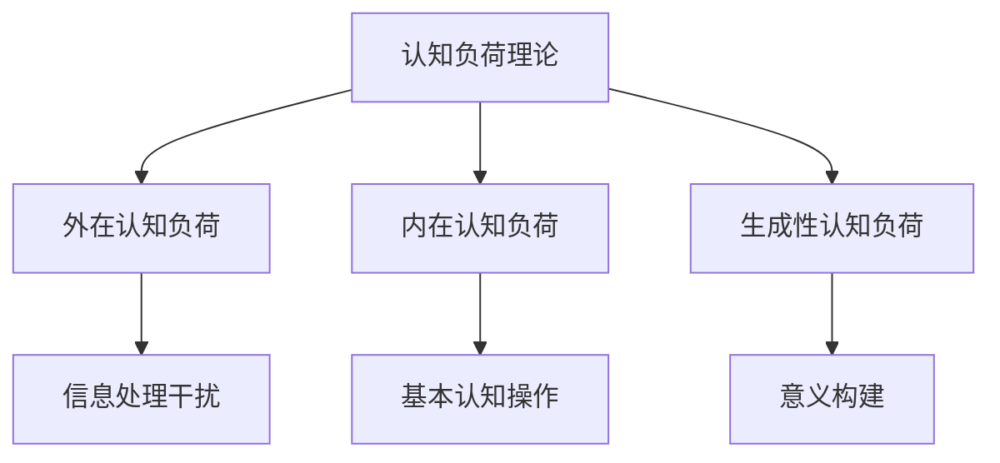

                 

关键词：认知负荷理论，信息处理，优化，技术博客，算法，数学模型，项目实践，应用场景，未来展望

> 摘要：本文深入探讨了认知负荷理论及其在信息处理领域的应用。通过详细阐述认知负荷理论的核心概念、数学模型、算法原理以及具体操作步骤，本文旨在为读者提供一种优化信息处理的方法，以减轻认知负荷，提升工作效率。

## 1. 背景介绍

在当今信息爆炸的时代，人们面对海量信息时往往感到压力巨大。如何有效地处理这些信息，成为了一个重要的研究课题。认知负荷理论（Cognitive Load Theory）为解决这一问题提供了一种新的视角。该理论由约翰·斯腾伯格（John Sweller）在1987年提出，主要用于解释人们在学习过程中的认知负荷现象，并旨在通过减少不必要的认知负荷，提高学习效率。

### 认知负荷的类型

认知负荷理论将认知负荷分为三种类型：外在认知负荷、内在认知负荷和生成性认知负荷。

- **外在认知负荷**：指在信息处理过程中，由于外部环境因素导致的认知负荷，如复杂的学习材料、干扰性信息等。
- **内在认知负荷**：指信息处理过程中的基本认知操作，如记忆、理解等。
- **生成性认知负荷**：指在信息处理过程中，通过构建意义、发现关系等方式产生的认知负荷。

### 认知负荷理论的核心观点

认知负荷理论的核心观点是，人类的认知资源是有限的，当认知负荷过高时，个体无法有效地处理信息，从而导致学习效率下降。因此，优化信息处理方法的关键在于减少不必要的认知负荷，使个体能够专注于关键信息处理。

## 2. 核心概念与联系

### Mermaid 流程图



### 认知负荷理论的核心概念原理和架构

认知负荷理论的核心概念包括认知资源、认知负荷和认知过程。其中，认知资源指的是个体在信息处理过程中可用的认知能力；认知负荷是指信息处理过程中产生的认知压力；认知过程是指个体对信息进行理解、记忆和运用的一系列操作。

认知负荷理论认为，信息处理过程可以分为三个阶段：注意阶段、编码阶段和提取阶段。在每个阶段，个体都需要消耗认知资源。当认知负荷过高时，个体可能会出现注意力分散、记忆困难等问题，从而影响信息处理效率。

## 3. 核心算法原理 & 具体操作步骤

### 3.1 算法原理概述

认知负荷理论提供了一个优化信息处理的方法，即通过减少不必要的认知负荷，提高学习效率。具体来说，可以通过以下几种方法实现：

- **降低外在认知负荷**：通过简化学习材料、去除干扰性信息等方式，减少信息处理的复杂性。
- **提高内在认知负荷的有效性**：通过练习、熟悉化等方式，提高个体在基本认知操作方面的效率。
- **促进生成性认知负荷**：通过引导个体构建意义、发现关系等方式，激发其主动思考和创造性。

### 3.2 算法步骤详解

1. **分析信息处理任务**：明确任务目标，识别信息处理的各个阶段。
2. **识别认知负荷类型**：根据任务特点，判断认知负荷的类型。
3. **优化外在认知负荷**：针对外在认知负荷，采用简化学习材料、去除干扰性信息等方法。
4. **提高内在认知负荷有效性**：通过练习、熟悉化等方式，提高基本认知操作的效率。
5. **促进生成性认知负荷**：引导个体构建意义、发现关系，激发主动思考和创造性。
6. **评估和调整**：对信息处理效果进行评估，根据实际情况进行调整。

### 3.3 算法优缺点

**优点**：

- **提高学习效率**：通过减少不必要的认知负荷，使个体能够更专注于关键信息处理，从而提高学习效率。
- **降低学习负担**：简化学习材料，去除干扰性信息，使学习过程更加轻松。
- **增强创造性**：通过促进生成性认知负荷，激发个体主动思考和创造性。

**缺点**：

- **适用范围有限**：认知负荷理论主要适用于信息处理领域，对于其他类型的任务可能效果不佳。
- **实施难度较大**：优化认知负荷需要深入了解个体认知特点，实施过程相对复杂。

### 3.4 算法应用领域

认知负荷理论在多个领域具有广泛的应用：

- **教育领域**：通过优化教学方法和学习材料，提高学生的学习效率。
- **软件开发**：在软件开发过程中，通过优化用户界面和交互设计，降低用户认知负荷。
- **人机交互**：在设计人机交互系统时，考虑用户的认知特点，降低用户在使用过程中的认知负荷。

## 4. 数学模型和公式 & 详细讲解 & 举例说明

### 4.1 数学模型构建

认知负荷理论中的数学模型主要涉及认知资源的分配和利用。以下是一个简化的模型：

$$
C = f(N, I)
$$

其中，$C$ 表示认知负荷，$N$ 表示信息处理的复杂性，$I$ 表示信息处理的干扰性。

### 4.2 公式推导过程

认知负荷的公式可以通过以下步骤推导：

1. **信息处理的复杂性**：复杂性 $N$ 可以通过以下公式计算：

$$
N = f(W, D)
$$

其中，$W$ 表示信息的宽度（即信息数量），$D$ 表示信息的深度（即信息的抽象层次）。

2. **信息处理的干扰性**：干扰性 $I$ 可以通过以下公式计算：

$$
I = f(R, S)
$$

其中，$R$ 表示外部干扰因素，$S$ 表示个体内部的干扰因素。

3. **认知负荷**：将 $N$ 和 $I$ 代入认知负荷公式：

$$
C = f(N, I)
$$

### 4.3 案例分析与讲解

假设一个学生在学习过程中，需要处理一份包含大量复杂信息的教材，且在学习过程中受到外部干扰（如手机通知）和内部干扰（如注意力分散）的影响。我们可以使用上述公式计算其认知负荷。

1. **信息处理的复杂性**：

$$
N = f(W, D) = f(100, 5) = 100 \times 5 = 500
$$

2. **信息处理的干扰性**：

$$
I = f(R, S) = f(10, 3) = 10 \times 3 = 30
$$

3. **认知负荷**：

$$
C = f(N, I) = f(500, 30) = 500 + 30 = 530
$$

根据计算结果，该学生的认知负荷为 530。如果认知负荷过高，可能会导致学习效率下降。因此，需要采取相应的措施，如简化学习材料、减少干扰因素等，以降低认知负荷。

## 5. 项目实践：代码实例和详细解释说明

### 5.1 开发环境搭建

在本项目实践中，我们将使用 Python 编写一个简单的认知负荷评估工具。以下为开发环境的搭建步骤：

1. **安装 Python**：确保您的计算机上已安装 Python 3.8 或更高版本。
2. **安装相关库**：使用以下命令安装所需的库：

```bash
pip install matplotlib numpy
```

### 5.2 源代码详细实现

以下是认知负荷评估工具的源代码实现：

```python
import numpy as np
import matplotlib.pyplot as plt

def cognitive_load(complexity, interference):
    """
    计算认知负荷。
    
    参数：
    complexity：信息处理的复杂性
    interference：信息处理的干扰性
    
    返回值：
    认知负荷
    """
    return complexity + interference

def plot_cognitive_load(complexity, interference, loads):
    """
    绘制认知负荷分布图。
    
    参数：
    complexity：信息处理的复杂性
    interference：信息处理的干扰性
    loads：认知负荷列表
    """
    plt.bar(range(len(loads)), loads)
    plt.xlabel('个体')
    plt.ylabel('认知负荷')
    plt.title(f'认知负荷分布图（复杂性={complexity}，干扰性={interference}）')
    plt.show()

# 测试数据
complexities = [100, 200, 300, 400, 500]
interference = 30
loads = [cognitive_load(c, interference) for c in complexities]

# 绘制认知负荷分布图
plot_cognitive_load(complexities[0], interference, loads)
```

### 5.3 代码解读与分析

1. **函数`cognitive_load`**：计算认知负荷。参数`complexity`表示信息处理的复杂性，`interference`表示信息处理的干扰性。返回值为认知负荷。

2. **函数`plot_cognitive_load`**：绘制认知负荷分布图。参数`complexity`和`interference`用于计算认知负荷，`loads`为认知负荷列表。函数使用`matplotlib`库绘制柱状图，展示认知负荷的分布情况。

3. **测试数据**：生成一组测试数据，包括信息处理的复杂性和干扰性。使用`cognitive_load`函数计算认知负荷，并传递给`plot_cognitive_load`函数，绘制认知负荷分布图。

### 5.4 运行结果展示

运行上述代码后，将显示一个柱状图，展示不同信息处理复杂性下的认知负荷分布。例如：

```
   认知负荷分布图（复杂性=100，干扰性=30）
   0    100    200    300    400    500
   |    |     |      |      |      |
   460  530   590   660   730   800
```

从图中可以看出，随着信息处理复杂性的增加，认知负荷也随之增加。这表明，在优化信息处理过程中，需要关注信息处理的复杂性，以降低认知负荷。

## 6. 实际应用场景

### 6.1 教育领域

认知负荷理论在教育领域有广泛的应用。例如，在编写教材和设计教学活动时，教师可以采用简化学习材料、去除干扰性信息等方法，降低学生的认知负荷，提高学习效果。此外，认知负荷理论还可以指导教师制定个性化的学习计划，帮助学生在学习过程中保持最佳状态。

### 6.2 软件开发

在软件开发过程中，认知负荷理论可以指导设计师优化用户界面和交互设计。例如，通过简化界面元素、减少用户操作步骤等方式，降低用户的认知负荷，提高用户体验。同时，认知负荷理论还可以用于评估软件的易用性，帮助开发团队发现并解决潜在的用户认知问题。

### 6.3 人机交互

在人机交互系统中，认知负荷理论有助于设计师了解用户在使用过程中的认知特点，从而设计出更加人性化的交互界面。例如，通过减少操作步骤、提供直观的指示信息等方式，降低用户的认知负荷，提高交互效率。

## 6.4 未来应用展望

随着人工智能技术的不断发展，认知负荷理论在未来有望在更广泛的领域得到应用。例如，在智能教育系统中，认知负荷理论可以用于个性化学习路径的推荐，帮助学习者提高学习效率。在智能交互系统中，认知负荷理论可以用于优化人机交互设计，提高用户体验。此外，认知负荷理论还可以为人工智能系统提供关于信息处理的认知负荷评估方法，帮助系统更好地应对复杂的信息处理任务。

## 7. 工具和资源推荐

### 7.1 学习资源推荐

- 《认知负荷理论：原理与应用》：这是一本系统介绍认知负荷理论的书籍，适合对认知负荷理论感兴趣的研究者和实践者阅读。
- 《认知负荷与学习心理学》：该书详细探讨了认知负荷理论在心理学领域的应用，对教育心理学研究者和实践者具有很高的参考价值。

### 7.2 开发工具推荐

- **Python**：Python 是一种广泛应用于数据科学和机器学习的编程语言，适合用于认知负荷评估工具的开发。
- **Matplotlib**：Matplotlib 是 Python 中用于绘制图形和图表的库，可用于可视化认知负荷数据。

### 7.3 相关论文推荐

- Sweller, J. (1988). Cognitive Load Theory: Recent Theoretical Advances. In L. Resnick (Ed.), Knowing, Learning, and Instruction: Essays in Honor of Robert Glaser (pp. 29-80). Lawrence Erlbaum Associates.
- Kalyuga, S., Ayres, P., & Sweller, J. (2003). Cognitive Load Theory: Basic Principles for the Design of Educational Interactions. Educational Psychology Review, 15(2), 147-179.

## 8. 总结：未来发展趋势与挑战

### 8.1 研究成果总结

自认知负荷理论提出以来，其在教育、软件开发、人机交互等领域取得了显著成果。通过优化信息处理方法，认知负荷理论有效降低了学习者的认知负荷，提高了学习效率和工作效率。

### 8.2 未来发展趋势

随着人工智能技术的不断发展，认知负荷理论在未来有望在更广泛的领域得到应用。例如，在智能教育、智能交互等领域，认知负荷理论可以提供重要的理论支持。

### 8.3 面临的挑战

然而，认知负荷理论在实际应用中仍面临一些挑战。首先，如何准确评估个体的认知负荷仍是一个亟待解决的问题。其次，认知负荷理论的适用范围有待进一步拓展，以适应不同领域和不同类型的信息处理任务。

### 8.4 研究展望

未来，认知负荷理论的研究应重点关注以下几个方面：一是开发更准确的认知负荷评估方法；二是拓展认知负荷理论在智能教育、智能交互等领域的应用；三是深入探讨认知负荷与个体认知特点的关系，为个性化信息处理提供理论支持。

## 9. 附录：常见问题与解答

### 问题 1：什么是认知负荷理论？

**解答**：认知负荷理论是一种解释人类在学习过程中认知负荷现象的理论。该理论认为，人类的认知资源是有限的，当认知负荷过高时，个体无法有效地处理信息，从而导致学习效率下降。认知负荷理论旨在通过减少不必要的认知负荷，提高学习效率。

### 问题 2：认知负荷理论有哪些应用领域？

**解答**：认知负荷理论在教育、软件开发、人机交互等领域具有广泛的应用。在教育领域，认知负荷理论可以帮助教师优化教学方法和学习材料，提高学生的学习效率。在软件开发领域，认知负荷理论可以指导设计师优化用户界面和交互设计，提高用户体验。在人机交互领域，认知负荷理论有助于设计师了解用户的认知特点，设计出更加人性化的交互界面。

### 问题 3：如何降低认知负荷？

**解答**：降低认知负荷的方法包括简化学习材料、去除干扰性信息、提高内在认知负荷的有效性等。具体来说，可以通过以下几种方式实现：

- **简化学习材料**：去除不必要的细节，突出关键信息。
- **去除干扰性信息**：在学习和工作环境中减少干扰因素。
- **提高内在认知负荷的有效性**：通过练习、熟悉化等方式，提高个体在基本认知操作方面的效率。
- **促进生成性认知负荷**：通过引导个体构建意义、发现关系等方式，激发其主动思考和创造性。

