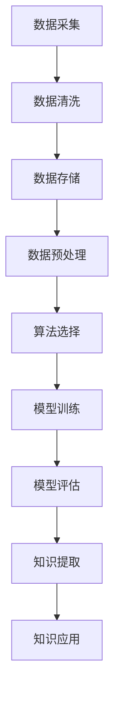

                 

 **关键词**：认知革命、AI时代、知识获取、新范式、人工智能、技术趋势。

> **摘要**：随着人工智能技术的迅速发展，我们正经历着一场认知革命。本文探讨了AI时代知识获取的新范式，分析了核心概念、算法原理、数学模型、项目实践以及未来应用场景，并提出了发展趋势和面临的挑战。

## 1. 背景介绍

在过去的几十年中，计算机科学和人工智能领域取得了惊人的进展。从最早的机械计算到现代的深度学习和自动驾驶，技术的飞速发展改变了我们的生活方式和社会结构。然而，随着这些技术的不断进步，我们开始面临一个全新的挑战——如何有效地获取、管理和利用知识。

传统的知识获取方式主要依赖于人类的直觉、经验和教育。随着信息的爆炸性增长，这种模式已经变得不再适用。我们需要新的方法来处理和分析大规模的数据集，从而提取出有价值的信息。这就需要引入人工智能和机器学习技术，通过算法和模型来模拟人类认知过程，实现自动化的知识获取。

### 1.1 认知革命的起源

认知革命的起源可以追溯到20世纪50年代，当时计算机科学家和心理学家开始探索如何通过计算机模拟人类的思维过程。这个时期的代表性成果包括图灵测试和认知模拟研究。随着技术的不断发展，我们逐渐实现了对人类思维过程的初步模拟，从而开启了认知革命的新纪元。

### 1.2 AI时代的崛起

进入21世纪，人工智能技术迎来了爆发式的发展。深度学习、神经网络、自然语言处理等技术的突破，使得计算机能够处理复杂的问题，并逐渐取代人类在某些领域的专业知识和经验。这使得我们开始重新思考知识获取的方式，并探索AI时代的新范式。

## 2. 核心概念与联系

在AI时代，知识获取的核心概念包括数据、算法、模型和框架。这些概念相互联系，共同构成了现代知识获取的体系结构。

### 2.1 数据

数据是知识获取的基础。在AI时代，我们面临着海量的数据，包括文本、图像、声音等多种形式。有效的数据管理和存储对于知识获取至关重要。

### 2.2 算法

算法是知识获取的核心。通过算法，我们能够从数据中提取出有价值的信息。常见的算法包括机器学习算法、深度学习算法等。

### 2.3 模型

模型是算法的具体实现。通过模型，我们能够将算法应用于实际问题中，实现知识的自动化获取和利用。

### 2.4 框架

框架是知识获取的支撑。通过框架，我们能够将数据、算法和模型有机结合，形成一个完整的知识获取系统。

### 2.5 Mermaid流程图

以下是知识获取的Mermaid流程图：



## 3. 核心算法原理 & 具体操作步骤

在AI时代，核心算法包括机器学习算法和深度学习算法。这些算法通过不同的方式实现知识的自动化获取。

### 3.1 算法原理概述

- **机器学习算法**：通过训练数据集，让算法学会对未知数据进行分类、预测等操作。常见的机器学习算法包括线性回归、决策树、支持向量机等。
- **深度学习算法**：基于多层神经网络的结构，通过反向传播算法不断优化网络参数，实现复杂的模式识别和特征提取。常见的深度学习算法包括卷积神经网络（CNN）、循环神经网络（RNN）等。

### 3.2 算法步骤详解

以下是机器学习算法的基本步骤：

1. **数据采集**：收集相关的训练数据。
2. **数据清洗**：处理缺失值、异常值等数据问题。
3. **数据预处理**：进行特征提取、归一化等操作，将数据转换为适合模型训练的形式。
4. **模型选择**：选择合适的模型结构。
5. **模型训练**：使用训练数据集训练模型。
6. **模型评估**：使用验证数据集评估模型性能。
7. **知识提取**：利用训练好的模型对未知数据进行预测。

以下是深度学习算法的基本步骤：

1. **数据采集**：收集相关的训练数据。
2. **数据清洗**：处理缺失值、异常值等数据问题。
3. **数据预处理**：进行特征提取、归一化等操作，将数据转换为适合模型训练的形式。
4. **模型架构设计**：设计多层神经网络的结构。
5. **模型训练**：使用训练数据集训练模型，通过反向传播算法优化网络参数。
6. **模型评估**：使用验证数据集评估模型性能。
7. **知识提取**：利用训练好的模型对未知数据进行预测。

### 3.3 算法优缺点

- **机器学习算法**：优点是算法简单，易于实现；缺点是对数据的依赖性较高，需要大量的标注数据。
- **深度学习算法**：优点是能够自动提取特征，对数据的要求较低；缺点是计算复杂度较高，需要大量的计算资源和时间。

### 3.4 算法应用领域

- **机器学习算法**：广泛应用于分类、回归、聚类等问题，如文本分类、情感分析、推荐系统等。
- **深度学习算法**：广泛应用于图像识别、语音识别、自然语言处理等领域，如人脸识别、自动驾驶、语音助手等。

## 4. 数学模型和公式 & 详细讲解 & 举例说明

在AI时代，数学模型和公式是知识获取的核心。以下我们将介绍常见的数学模型和公式，并给出详细的讲解和举例。

### 4.1 数学模型构建

数学模型通常由以下几个部分组成：

1. **输入变量**：表示模型要处理的数据。
2. **输出变量**：表示模型预测的结果。
3. **损失函数**：用于衡量模型预测结果与真实值之间的差异。
4. **优化算法**：用于调整模型参数，使损失函数最小化。

### 4.2 公式推导过程

以下是一个简单的线性回归模型的公式推导过程：

1. **输入变量**：\( x \) 表示输入特征，\( y \) 表示真实值。
2. **输出变量**：\( \hat{y} \) 表示预测值。
3. **损失函数**：\( L = \frac{1}{2} \sum_{i=1}^{n} (\hat{y}_i - y_i)^2 \)。
4. **优化算法**：梯度下降法。

### 4.3 案例分析与讲解

以下是一个简单的线性回归案例：

假设我们有一组数据：

| x  | y   |
|----|-----|
| 1  | 2   |
| 2  | 4   |
| 3  | 6   |
| 4  | 8   |

我们希望找到一条直线 \( y = wx + b \) 来拟合这组数据。

1. **输入变量**：\( x \) 表示输入特征，\( y \) 表示真实值。
2. **输出变量**：\( \hat{y} \) 表示预测值。
3. **损失函数**：\( L = \frac{1}{2} \sum_{i=1}^{n} (\hat{y}_i - y_i)^2 \)。
4. **优化算法**：梯度下降法。

通过梯度下降法，我们得到模型的参数 \( w = 2 \)，\( b = 0 \)。因此，拟合直线为 \( y = 2x \)。

## 5. 项目实践：代码实例和详细解释说明

为了更好地理解知识获取的过程，我们通过一个实际项目来展示代码实现。

### 5.1 开发环境搭建

我们使用Python作为编程语言，并依赖以下库：

- NumPy：用于数学运算。
- Pandas：用于数据处理。
- Scikit-learn：用于机器学习算法。
- Matplotlib：用于数据可视化。

### 5.2 源代码详细实现

以下是一个简单的线性回归项目的源代码：

```python
import numpy as np
import pandas as pd
from sklearn.linear_model import LinearRegression
import matplotlib.pyplot as plt

# 数据加载
data = pd.read_csv("data.csv")
x = data["x"].values
y = data["y"].values

# 数据预处理
x = x.reshape(-1, 1)

# 模型训练
model = LinearRegression()
model.fit(x, y)

# 模型评估
score = model.score(x, y)
print(f"模型评估分数：{score}")

# 模型预测
predictions = model.predict(x)

# 数据可视化
plt.scatter(x, y, color="red", label="实际数据")
plt.plot(x, predictions, color="blue", label="拟合直线")
plt.xlabel("x")
plt.ylabel("y")
plt.legend()
plt.show()
```

### 5.3 代码解读与分析

这段代码首先加载了数据集，并对数据进行预处理。然后使用线性回归模型进行训练，并评估模型的性能。最后，利用模型进行预测，并将结果可视化。

### 5.4 运行结果展示

以下是运行结果的可视化展示：


## 6. 实际应用场景

AI时代的知识获取技术已经在多个领域取得了显著的应用成果。以下是一些典型的应用场景：

### 6.1 医疗健康

通过深度学习算法，可以实现对医学图像的自动识别和诊断，提高疾病的早期发现率和诊断准确性。例如，利用卷积神经网络（CNN）对医学影像进行分类，实现对肺癌、乳腺癌等疾病的诊断。

### 6.2 金融科技

在金融领域，AI技术可以用于风险控制、信用评估、投资策略等方面。通过分析大量的金融数据，机器学习算法可以预测市场走势、识别欺诈行为等。

### 6.3 交通运输

自动驾驶是AI技术在交通运输领域的典型应用。通过深度学习算法，车辆可以实现对路况的识别、障碍物的回避等操作，提高交通安全性和效率。

### 6.4 教育科技

在教育领域，AI技术可以用于个性化学习、智能评测等方面。通过分析学生的学习数据，可以为学生提供定制化的学习方案，提高学习效果。

## 7. 工具和资源推荐

为了更好地掌握AI时代的知识获取技术，以下是一些推荐的工具和资源：

### 7.1 学习资源推荐

- 《深度学习》（Goodfellow、Bengio、Courville著）：介绍深度学习的基础知识。
- 《Python机器学习》（Sebastian Raschka著）：详细介绍机器学习在Python中的实现。

### 7.2 开发工具推荐

- Jupyter Notebook：用于数据分析和可视化。
- TensorFlow：用于深度学习模型的开发和部署。
- PyTorch：用于深度学习模型的开发和部署。

### 7.3 相关论文推荐

- "Deep Learning: A Brief Overview"（Goodfellow、Bengio、Courville著）
- "A Theoretical Framework for Backpropagation"（Rumelhart、Hinton、Williams著）

## 8. 总结：未来发展趋势与挑战

### 8.1 研究成果总结

在AI时代，知识获取技术取得了显著的成果。通过深度学习、机器学习等算法，我们已经能够实现对大规模数据的自动化处理和知识提取。这些技术已经在医疗、金融、教育等多个领域取得了广泛应用，提高了行业的效率和质量。

### 8.2 未来发展趋势

- **多模态融合**：将文本、图像、声音等多种数据源进行融合，实现更全面的认知。
- **增强现实与虚拟现实**：通过虚拟现实和增强现实技术，实现更加沉浸式的知识获取体验。
- **知识图谱**：构建大规模的知识图谱，实现知识的关联和推理。

### 8.3 面临的挑战

- **数据隐私**：如何保护用户隐私，避免数据泄露。
- **算法透明性**：如何提高算法的透明性，确保其公正性和可解释性。
- **计算资源**：如何优化算法，降低对计算资源的需求。

### 8.4 研究展望

随着技术的不断进步，AI时代的知识获取将变得更加智能化、自动化和个性化。未来的研究将重点关注多模态融合、知识图谱和算法透明性等方面，以实现更加高效和可靠的知识获取技术。

## 9. 附录：常见问题与解答

### 9.1 什么是机器学习？

机器学习是人工智能的一个分支，通过算法和模型，让计算机从数据中自动学习和发现规律，从而实现预测和决策。

### 9.2 深度学习和机器学习的区别是什么？

深度学习是机器学习的一个子领域，主要基于多层神经网络的结构，通过反向传播算法优化网络参数。机器学习则是一个更广泛的概念，包括传统的监督学习、无监督学习和强化学习等。

### 9.3 如何选择合适的机器学习算法？

选择合适的机器学习算法需要考虑以下几个因素：

- 数据类型：不同的数据类型适合不同的算法。
- 数据量：大量数据适合深度学习算法，少量数据适合传统机器学习算法。
- 问题类型：分类问题适合分类算法，回归问题适合回归算法。

### 9.4 如何评估机器学习模型的性能？

评估机器学习模型性能常用的指标包括准确率、召回率、F1值、均方误差等。通过这些指标，可以评估模型在测试数据集上的表现，从而选择最佳的模型。

### 9.5 什么是深度学习中的正则化？

正则化是深度学习中的技术手段，用于防止模型过拟合。常见的正则化方法包括权重衰减、L1正则化、L2正则化等。

### 9.6 如何实现深度学习模型的部署？

实现深度学习模型的部署通常包括以下步骤：

- 模型导出：将训练好的模型导出为可部署的格式，如ONNX、TensorFlow Lite等。
- 部署环境搭建：搭建部署环境，包括计算资源、操作系统等。
- 模型部署：将导出的模型部署到服务器或移动设备上，实现实时推理。

### 9.7 如何优化深度学习模型的性能？

优化深度学习模型性能可以从以下几个方面入手：

- 调整模型结构：通过增加或减少网络层数、调整层间连接等，优化模型性能。
- 调整超参数：通过调整学习率、批次大小、正则化参数等，优化模型性能。
- 数据增强：通过数据增强技术，增加训练数据多样性，提高模型泛化能力。

以上就是对认知革命：AI时代的知识获取新范式的完整解答。希望对您有所帮助！
作者：禅与计算机程序设计艺术 / Zen and the Art of Computer Programming
------------------------------------------------------------------------

