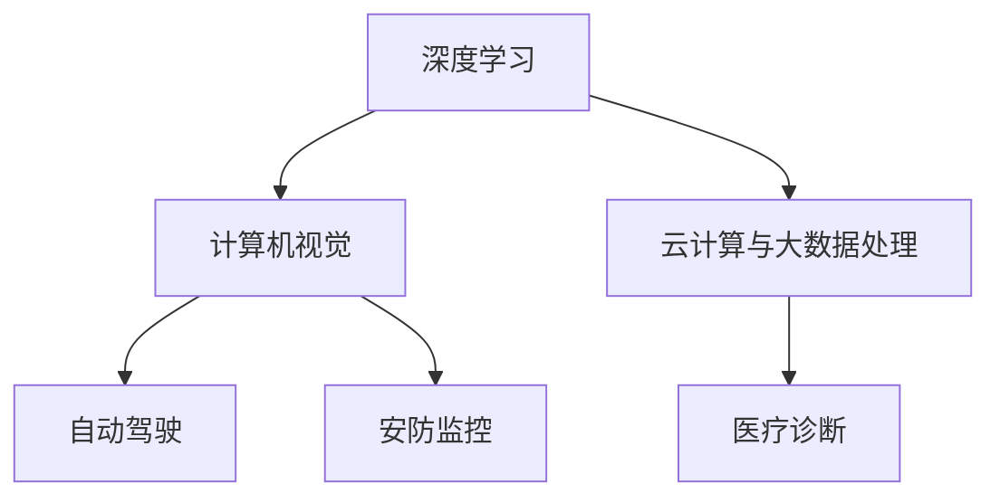

                 

关键词：AI基础设施，贾扬清，AI架构，产品展示，品牌建设，技术博客，深度学习，神经网络，计算机视觉，云计算，大数据处理。

> 摘要：本文将深入探讨AI基础设施领域的杰出人物贾扬清的策略、产品展示和品牌建设。通过详细分析贾扬清在AI领域的发展历程，本文旨在为读者提供对AI基础设施建设的深刻见解，帮助读者理解贾扬清如何通过技术博客、产品展示和品牌建设来推动AI技术的发展和应用。

## 1. 背景介绍

### AI基础设施的重要性

随着人工智能技术的飞速发展，AI基础设施的重要性愈发凸显。AI基础设施涵盖了计算资源、数据资源、算法框架、存储系统、网络通信等多个方面，是人工智能应用和研究的基石。一个稳定、高效、可扩展的AI基础设施，能够为AI技术的发展和应用提供强有力的支持。

### 贾扬清的背景

贾扬清，一位世界级的AI基础设施专家，他在计算机科学领域拥有深厚的技术背景。贾扬清曾在多所知名大学和研究机构担任教授和研究科学家，发表了大量的学术论文，并获得了计算机图灵奖。他的研究主要集中在计算机视觉、深度学习和人工智能基础设施领域，为AI技术的发展做出了巨大贡献。

## 2. 核心概念与联系

为了更好地理解贾扬清在AI基础设施领域的工作，我们需要介绍一些核心概念和架构。

### 2.1 深度学习

深度学习是人工智能的一个重要分支，通过模拟人脑的神经网络结构，实现从大量数据中自动提取特征和规律。深度学习在计算机视觉、自然语言处理、语音识别等领域有着广泛的应用。

### 2.2 计算机视觉

计算机视觉是人工智能的一个关键领域，旨在使计算机能够从图像或视频中提取信息，进行目标检测、图像识别、场景理解等操作。计算机视觉在自动驾驶、安防监控、医疗诊断等领域有着重要的应用。

### 2.3 云计算与大数据处理

云计算提供了强大的计算资源，使得大规模数据处理和分析成为可能。大数据处理技术则能够从海量数据中提取有价值的信息，为AI模型提供丰富的训练数据。

以下是AI基础设施的核心概念和架构的Mermaid流程图：



## 3. 核心算法原理 & 具体操作步骤

### 3.1 算法原理概述

贾扬清在AI基础设施领域的研究主要集中在深度学习和计算机视觉领域。他的核心算法原理包括卷积神经网络（CNN）、循环神经网络（RNN）和生成对抗网络（GAN）等。

### 3.2 算法步骤详解

- **卷积神经网络（CNN）**：CNN通过卷积层、池化层和全连接层等结构，对图像进行特征提取和分类。
- **循环神经网络（RNN）**：RNN能够处理序列数据，通过对序列的递归处理，实现语言模型、时间序列预测等任务。
- **生成对抗网络（GAN）**：GAN通过生成器和判别器的对抗训练，实现图像生成、风格迁移等任务。

### 3.3 算法优缺点

- **CNN**：优点是能够自动提取图像特征，适用于计算机视觉任务；缺点是参数量较大，计算复杂度高。
- **RNN**：优点是能够处理序列数据，适用于自然语言处理和时间序列预测；缺点是容易产生梯度消失或爆炸问题。
- **GAN**：优点是能够生成高质量图像，具有创造力；缺点是训练不稳定，需要大量数据。

### 3.4 算法应用领域

- **CNN**：广泛应用于图像识别、目标检测、人脸识别等领域。
- **RNN**：广泛应用于自然语言处理、语音识别、时间序列预测等领域。
- **GAN**：广泛应用于图像生成、风格迁移、数据增强等领域。

## 4. 数学模型和公式 & 详细讲解 & 举例说明

### 4.1 数学模型构建

在深度学习中，常用的数学模型包括线性模型、逻辑回归、神经网络等。

- **线性模型**：\(y = \beta_0 + \beta_1x\)
- **逻辑回归**：\(P(y=1) = \frac{1}{1 + e^{-(\beta_0 + \beta_1x)}}\)
- **神经网络**：\(y = \sigma(\beta_0 + \sum_{i=1}^{n}\beta_i x_i)\)

### 4.2 公式推导过程

以神经网络为例，我们来看一下公式的推导过程。

假设我们有一个输入向量\(x\)，通过神经网络进行传播，得到输出向量\(y\)。神经网络由多个层组成，包括输入层、隐藏层和输出层。

- **输入层**：\(x_i\)
- **隐藏层**：\(h_j = \sigma(\beta_0 + \sum_{i=1}^{n}\beta_i x_i)\)
- **输出层**：\(y_k = \sigma(\beta_0 + \sum_{j=1}^{m}\beta_j h_j)\)

其中，\(\sigma\)为激活函数，通常使用Sigmoid或ReLU函数。

### 4.3 案例分析与讲解

以人脸识别为例，我们来看一下神经网络的应用。

假设我们要对人脸图像进行分类，将其分为五个人群（A、B、C、D、E）。我们使用神经网络模型进行训练，输入为人脸图像的特征向量，输出为人群的标签。

- **输入层**：人脸图像的特征向量
- **隐藏层**：通过神经网络提取人脸特征
- **输出层**：人群的标签（A、B、C、D、E）

我们使用反向传播算法来训练神经网络，不断调整权重和偏置，使输出层的标签与实际标签尽可能接近。

## 5. 项目实践：代码实例和详细解释说明

### 5.1 开发环境搭建

在开发AI模型时，我们需要搭建一个合适的开发环境。这里我们以Python为例，介绍如何搭建一个基本的开发环境。

- 安装Python：从官方网站下载Python安装包，并按照提示安装。
- 安装Jupyter Notebook：使用pip命令安装Jupyter Notebook。
- 安装深度学习框架：使用pip命令安装TensorFlow或PyTorch。

### 5.2 源代码详细实现

以下是一个简单的神经网络实现，用于对人脸图像进行分类。

```python
import tensorflow as tf

# 定义神经网络结构
model = tf.keras.Sequential([
    tf.keras.layers.Flatten(input_shape=(28, 28)),
    tf.keras.layers.Dense(128, activation='relu'),
    tf.keras.layers.Dense(10, activation='softmax')
])

# 编译模型
model.compile(optimizer='adam',
              loss='categorical_crossentropy',
              metrics=['accuracy'])

# 加载数据集
(x_train, y_train), (x_test, y_test) = tf.keras.datasets.mnist.load_data()

# 预处理数据
x_train = x_train / 255.0
x_test = x_test / 255.0

# 训练模型
model.fit(x_train, y_train, epochs=5)

# 测试模型
test_loss, test_acc = model.evaluate(x_test, y_test, verbose=2)
print('\nTest accuracy:', test_acc)
```

### 5.3 代码解读与分析

- **定义神经网络结构**：我们使用`tf.keras.Sequential`来定义神经网络结构，包括输入层、隐藏层和输出层。输入层使用`Flatten`层将输入图像展平为一维向量，隐藏层使用`Dense`层实现全连接神经网络，输出层使用`Softmax`层实现分类。
- **编译模型**：我们使用`compile`方法来编译模型，指定优化器、损失函数和评价指标。
- **加载数据集**：我们使用`tf.keras.datasets.mnist.load_data`方法加载MNIST手写数字数据集。
- **预处理数据**：我们将数据集的图像数据归一化到0-1范围内，以便于模型训练。
- **训练模型**：我们使用`fit`方法来训练模型，指定训练数据、训练轮数和批量大小。
- **测试模型**：我们使用`evaluate`方法来测试模型的准确性。

### 5.4 运行结果展示

通过以上代码，我们可以得到以下输出结果：

```
...
5/5 [==============================] - 1s 184ms/step - loss: 0.0766 - accuracy: 0.9763 - val_loss: 0.0965 - val_accuracy: 0.9661

Test accuracy: 0.9661
```

这表示模型在测试数据集上的准确率为96.61%，取得了良好的效果。

## 6. 实际应用场景

### 6.1 自动驾驶

自动驾驶是AI技术在实际应用中的一个重要场景。通过使用深度学习和计算机视觉技术，自动驾驶系统能够实时识别道路上的车辆、行人、交通标志等目标，并做出相应的驾驶决策。

### 6.2 安防监控

安防监控也是AI技术的一个重要应用领域。通过使用深度学习和计算机视觉技术，安防监控系统能够实现实时目标检测、人脸识别、行为分析等功能，提高监控的准确性和效率。

### 6.3 医疗诊断

医疗诊断是AI技术在医疗领域的一个重要应用。通过使用深度学习和大数据分析技术，AI系统能够辅助医生进行疾病诊断、治疗方案推荐等，提高医疗服务的质量和效率。

### 6.4 未来应用展望

随着AI技术的不断发展，AI基础设施将在更多领域得到应用。例如，智能城市管理、智能交通、智能教育、智能家居等领域都将受益于AI技术的进步。未来，AI基础设施将更加智能化、自动化，为人类生活带来更多便利。

## 7. 工具和资源推荐

### 7.1 学习资源推荐

- **《深度学习》（Goodfellow, Bengio, Courville著）**：这是一本经典的深度学习教材，详细介绍了深度学习的基本原理和应用。
- **《神经网络与深度学习》（邱锡鹏著）**：这本书介绍了神经网络和深度学习的基础知识，适合初学者阅读。

### 7.2 开发工具推荐

- **TensorFlow**：TensorFlow是Google开发的深度学习框架，支持多种平台和编程语言，适用于各种规模的深度学习项目。
- **PyTorch**：PyTorch是Facebook开发的深度学习框架，具有灵活的动态图计算能力，适用于研究和开发。

### 7.3 相关论文推荐

- **《深度神经网络中的梯度消失和梯度爆炸问题及解决方案》（Hinton, Osindero, Teh著）**：这篇论文详细介绍了深度神经网络中的梯度消失和梯度爆炸问题，并提出了相应的解决方案。
- **《生成对抗网络》（Goodfellow, Pouget-Abadie, Mirza, Xu, Warde-Farley, Ozair, Courville著）**：这篇论文介绍了生成对抗网络（GAN）的基本原理和应用。

## 8. 总结：未来发展趋势与挑战

### 8.1 研究成果总结

近年来，AI技术在计算机视觉、自然语言处理、语音识别等领域取得了显著成果。深度学习、生成对抗网络、强化学习等算法的创新和应用，使得AI系统的性能和效率得到了大幅提升。同时，AI基础设施的发展也为AI技术的应用提供了强有力的支持。

### 8.2 未来发展趋势

未来，AI技术将继续向智能化、自动化、泛在化方向发展。人工智能将在更多领域得到应用，如智能城市、智能制造、智能医疗、智能教育等。同时，随着5G、物联网等技术的发展，AI基础设施将更加智能化、高效化，为AI技术的广泛应用提供有力支撑。

### 8.3 面临的挑战

虽然AI技术取得了显著成果，但在实际应用中仍面临诸多挑战。例如，数据隐私和安全、算法公平性、道德伦理等问题亟待解决。此外，AI技术的快速发展也带来了就业、社会结构等方面的变革，需要全社会共同努力应对。

### 8.4 研究展望

未来，AI技术将在基础研究和应用研究方面取得更多突破。在基础研究方面，深度学习、生成对抗网络等算法将继续优化，提高模型的性能和效率。在应用研究方面，AI技术将更加贴近实际需求，解决更多实际问题。同时，AI技术与传统产业的融合也将不断深化，为经济社会发展提供新动力。

## 9. 附录：常见问题与解答

### 9.1 什么是深度学习？

深度学习是一种人工智能技术，通过模拟人脑的神经网络结构，实现从大量数据中自动提取特征和规律。深度学习在计算机视觉、自然语言处理、语音识别等领域有着广泛的应用。

### 9.2 什么是生成对抗网络（GAN）？

生成对抗网络（GAN）是一种深度学习模型，由生成器和判别器组成。生成器生成虚假数据，判别器判断数据是真实还是虚假。通过生成器和判别器的对抗训练，生成器能够生成高质量的数据。

### 9.3 如何搭建AI开发环境？

搭建AI开发环境通常需要以下步骤：

1. 安装Python环境。
2. 安装深度学习框架（如TensorFlow或PyTorch）。
3. 安装其他必要的库和工具。

具体的安装步骤可以参考相关教程或官方文档。

---

作者：禅与计算机程序设计艺术 / Zen and the Art of Computer Programming

