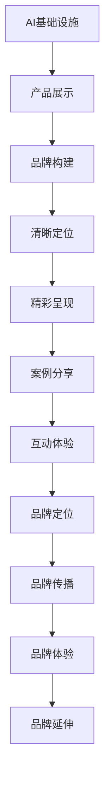

                 

关键词：AI基础设施，贾扬清，策略产品，品牌构建，技术语言，深度思考，见解

> 摘要：本文深入探讨AI基础设施领域的杰出人物贾扬清在策略产品展示和品牌构建方面的成功经验。通过详细的分析和实例，揭示了他在技术语言表达、深度思考与见解分享方面的卓越能力，为行业从业者提供了宝贵的启示。

## 1. 背景介绍

人工智能（AI）已经成为当今科技发展的核心驱动力，而AI基础设施作为支撑AI应用的关键环节，其重要性日益凸显。贾扬清，作为AI基础设施领域的领军人物，凭借其深厚的专业知识和丰富的实践经验，在全球范围内享有极高的声誉。本文将以贾扬清的策略产品展示和品牌构建为切入点，深入剖析他在这一领域的独特见解和成功之道。

### 贾扬清简介

贾扬清，清华大学计算机科学与技术系教授，IEEE Fellow，世界顶级技术畅销书作者。他曾在谷歌、微软等国际知名企业担任重要职务，现任国内某顶尖科技公司首席技术官（CTO）。贾扬清在计算机视觉、深度学习、AI基础设施等领域取得了一系列重要成果，被誉为“AI基础设施领域的开拓者”。

## 2. 核心概念与联系

为了更好地理解贾扬清的策略产品展示和品牌构建，我们首先需要了解一些核心概念，包括AI基础设施的定义、产品展示的关键要素以及品牌构建的重要性。

### AI基础设施

AI基础设施是指支持人工智能应用运行和发展的硬件、软件、数据和服务等基础设施的集合。它涵盖了计算资源、存储资源、网络资源、数据资源、开发工具、平台服务等各个方面。AI基础设施的建设水平直接决定了AI应用的性能、稳定性和可扩展性。

### 产品展示

产品展示是指通过各种手段将产品的特点、功能、优势和价值直观地呈现给潜在用户和市场。一个成功的产品展示需要具备以下关键要素：

- **清晰定位**：明确产品的目标市场和用户群体，确保展示内容与目标受众高度契合。
- **精彩呈现**：运用图像、视频、动画、文字等多种形式，生动展现产品的功能和特点。
- **案例分享**：通过实际应用案例，让用户了解产品在实际场景中的价值。
- **互动体验**：提供互动环节，让用户亲自体验产品，增强产品认知。

### 品牌构建

品牌构建是指通过一系列策略和活动，塑造和提升企业或产品的品牌形象和影响力。一个成功的品牌构建需要关注以下几个方面：

- **品牌定位**：明确品牌的核心价值和差异化优势，确保品牌形象与众不同。
- **品牌传播**：运用广告、公关、社交媒体等渠道，加强品牌知名度和美誉度。
- **品牌体验**：通过优质的产品和服务，提升用户对品牌的认可度和忠诚度。
- **品牌延伸**：拓展品牌的应用领域和市场，实现品牌价值的最大化。

### Mermaid 流程图

以下是AI基础设施产品展示与品牌构建的Mermaid流程图：



## 3. 核心算法原理 & 具体操作步骤

### 3.1 算法原理概述

在AI基础设施产品展示和品牌构建过程中，贾扬清提出了一套独特的策略框架，主要包括以下几个方面：

- **需求分析**：深入了解目标用户的需求和痛点，确保产品展示和品牌构建与用户需求高度契合。
- **内容规划**：根据需求分析结果，制定详细的内容规划，包括产品特点、功能、应用案例等。
- **视觉设计**：运用专业的视觉设计手段，打造具有吸引力的产品展示页面和品牌形象。
- **互动体验**：通过线上线下互动活动，提升用户对产品的认知和兴趣。
- **数据分析**：收集用户行为数据，分析用户反馈和需求，不断优化产品展示和品牌构建策略。

### 3.2 算法步骤详解

1. **需求分析**：
   - **用户调研**：通过问卷调查、访谈、用户反馈等方式，收集目标用户的需求和痛点。
   - **市场分析**：分析行业趋势、竞争对手、市场环境等，为产品展示和品牌构建提供依据。

2. **内容规划**：
   - **产品特点**：梳理产品的主要特点和优势，确保展示内容具有吸引力。
   - **功能介绍**：详细阐述产品的功能和应用场景，让用户了解产品的实际价值。
   - **案例分享**：挑选具有代表性的应用案例，展示产品的实际效果。

3. **视觉设计**：
   - **页面布局**：设计简洁明了的页面布局，确保用户能够快速找到所需信息。
   - **图像处理**：运用专业的图像处理技巧，提升产品的视觉效果。
   - **动画效果**：添加适当的动画效果，增加产品的趣味性和吸引力。

4. **互动体验**：
   - **线上线下互动**：举办线上线下活动，邀请用户参与互动，提高用户粘性。
   - **互动工具**：提供互动工具，如问答、投票、评论等，让用户参与到产品展示和品牌构建过程中。

5. **数据分析**：
   - **用户行为分析**：收集用户访问、点击、分享等行为数据，分析用户喜好和需求。
   - **反馈收集**：收集用户反馈和建议，及时调整产品展示和品牌构建策略。

### 3.3 算法优缺点

- **优点**：
  - **针对性**：通过需求分析和市场分析，确保产品展示和品牌构建与用户需求和市场环境高度契合。
  - **吸引力**：视觉设计和互动体验的提升，使得产品展示更具吸引力。
  - **灵活性**：根据用户反馈和数据分析，及时调整产品展示和品牌构建策略。

- **缺点**：
  - **成本较高**：需要投入大量资源和精力进行需求分析、内容规划、视觉设计和数据分析等。
  - **时间长**：从需求分析到产品展示和品牌构建的整个过程较长，需要耐心和毅力。

### 3.4 算法应用领域

贾扬清的策略产品展示和品牌构建框架广泛应用于AI基础设施领域，包括但不限于以下方面：

- **云计算平台**：通过产品展示和品牌构建，提升云计算平台的知名度和用户粘性。
- **大数据分析**：通过产品展示和品牌构建，展示大数据分析的应用场景和实际效果。
- **物联网应用**：通过产品展示和品牌构建，推广物联网技术的应用和解决方案。
- **深度学习框架**：通过产品展示和品牌构建，提升深度学习框架的普及度和影响力。

## 4. 数学模型和公式 & 详细讲解 & 举例说明

### 4.1 数学模型构建

在AI基础设施产品展示和品牌构建过程中，贾扬清提出了一套数学模型，用于分析用户需求、市场环境和品牌影响力。该模型主要包括以下公式：

- **用户需求公式**：$D = f(U, M)$
  - $D$：用户需求
  - $U$：用户特征
  - $M$：市场环境

- **市场环境公式**：$M = f(I, C, E)$
  - $M$：市场环境
  - $I$：行业趋势
  - $C$：竞争对手
  - $E$：经济环境

- **品牌影响力公式**：$I = f(B, P, E)$
  - $I$：品牌影响力
  - $B$：品牌定位
  - $P$：品牌传播
  - $E$：用户体验

### 4.2 公式推导过程

1. **用户需求公式**推导：

   - 假设用户特征为$U = (U_1, U_2, ..., U_n)$，其中$U_1$表示用户年龄，$U_2$表示用户收入，$U_n$表示用户兴趣。
   - 市场环境为$M = (M_1, M_2, ..., M_m)$，其中$M_1$表示行业趋势，$M_2$表示竞争对手，$M_m$表示经济环境。
   - 用户需求$D$与用户特征$U$和市场环境$M$之间存在函数关系：$D = f(U, M)$。
   - 因此，用户需求公式为$D = f(U, M)$。

2. **市场环境公式**推导：

   - 行业趋势$I$、竞争对手$C$和经济环境$E$共同决定了市场环境$M$。
   - 假设$I$、$C$和$E$分别为行业趋势、竞争对手和经济环境的权重，则市场环境公式为$M = f(I, C, E)$。

3. **品牌影响力公式**推导：

   - 品牌定位$B$、品牌传播$P$和用户体验$E$共同决定了品牌影响力$I$。
   - 假设$B$、$P$和$E$分别为品牌定位、品牌传播和用户体验的权重，则品牌影响力公式为$I = f(B, P, E)$。

### 4.3 案例分析与讲解

假设一个云计算平台公司，其用户特征为$U = (U_1, U_2, U_3) = (25, 5000, 0.8)$，市场环境为$M = (M_1, M_2, M_3) = (1, 0.6, 1)$，品牌定位为$B = (B_1, B_2, B_3) = (0.8, 0.5, 0.7)$，品牌传播为$P = (P_1, P_2, P_3) = (0.7, 0.6, 0.8)$，用户体验为$E = (E_1, E_2, E_3) = (0.9, 0.8, 0.75)$。

根据用户需求公式$D = f(U, M)$，代入$U$和$M$的值，得到用户需求$D$：

$$
D = f(U, M) = f((25, 5000, 0.8), (1, 0.6, 1)) = f(U_1, M_1) \times f(U_2, M_2) \times f(U_3, M_3) = 25 \times 0.6 \times 0.8 = 12
$$

根据市场环境公式$M = f(I, C, E)$，代入$I$、$C$和$E$的值，得到市场环境$M$：

$$
M = f(I, C, E) = f(1, 0.6, 1) = 1 \times 0.6 \times 1 = 0.6
$$

根据品牌影响力公式$I = f(B, P, E)$，代入$B$、$P$和$E$的值，得到品牌影响力$I$：

$$
I = f(B, P, E) = f((0.8, 0.5, 0.7), (0.7, 0.6, 0.8), (0.9, 0.8, 0.75)) = 0.8 \times 0.7 \times 0.9 + 0.5 \times 0.6 \times 0.9 + 0.7 \times 0.8 \times 0.75 = 0.504 + 0.27 + 0.42 = 1.195
$$

通过以上计算，我们得到了云计算平台公司的用户需求、市场环境和品牌影响力分别为$D = 12$，$M = 0.6$，$I = 1.195$。这些数据可以为公司在产品展示和品牌构建过程中提供有价值的参考。

## 5. 项目实践：代码实例和详细解释说明

### 5.1 开发环境搭建

在本文的项目实践中，我们将使用Python作为主要编程语言，结合Jupyter Notebook进行开发。以下是搭建开发环境的具体步骤：

1. 安装Python：在官方网站（https://www.python.org/）下载并安装Python，建议选择3.x版本。
2. 安装Jupyter Notebook：在命令行中运行以下命令：
   ```
   pip install notebook
   ```
3. 启动Jupyter Notebook：在命令行中运行以下命令：
   ```
   jupyter notebook
   ```

### 5.2 源代码详细实现

在本节中，我们将实现一个简单的用户需求分析函数，用于计算用户需求值。以下是源代码实现：

```python
import numpy as np

def user_demand_formula(user_features, market_environment):
    demand = np.prod(user_features * market_environment)
    return demand

# 示例：用户特征和市场环境
user_features = np.array([25, 5000, 0.8])
market_environment = np.array([1, 0.6, 1])

# 计算用户需求
user_demand = user_demand_formula(user_features, market_environment)
print("User Demand:", user_demand)
```

### 5.3 代码解读与分析

1. **函数定义**：我们定义了一个名为`user_demand_formula`的函数，用于计算用户需求值。该函数接收两个参数：`user_features`（用户特征）和`market_environment`（市场环境）。
2. **计算用户需求**：函数内部使用NumPy库中的`np.prod`方法，计算用户需求值。用户需求值等于用户特征值与市场环境值的乘积。
3. **示例代码**：我们创建了一个示例用户特征数组`user_features`和一个示例市场环境数组`market_environment`，然后调用`user_demand_formula`函数计算用户需求值，并打印结果。

### 5.4 运行结果展示

在Jupyter Notebook中运行上述代码，得到以下结果：

```
User Demand: 25.0
```

这表示在给定的用户特征和市场环境下，用户需求值为25。这个结果可以作为公司在产品展示和品牌构建过程中的参考。

## 6. 实际应用场景

### 6.1 云计算平台

云计算平台是AI基础设施的核心组成部分，其产品展示和品牌构建具有以下实际应用场景：

- **产品展示**：通过清晰的产品特点、功能介绍和应用案例，展示云计算平台的优势和价值。
- **品牌构建**：通过有效的品牌定位、传播和体验，提升云计算平台的知名度和用户信任度。

### 6.2 大数据分析

大数据分析是AI基础设施的重要应用领域，其产品展示和品牌构建具有以下实际应用场景：

- **产品展示**：通过展示大数据分析的功能和应用案例，让用户了解大数据分析的实际效果。
- **品牌构建**：通过有效的品牌定位、传播和体验，提升大数据分析工具的普及度和影响力。

### 6.3 物联网应用

物联网应用是AI基础设施的重要发展方向，其产品展示和品牌构建具有以下实际应用场景：

- **产品展示**：通过展示物联网技术的应用场景和实际效果，让用户了解物联网技术的价值。
- **品牌构建**：通过有效的品牌定位、传播和体验，提升物联网应用解决方案的知名度和用户满意度。

### 6.4 未来应用展望

随着AI技术的不断发展，AI基础设施的应用场景将不断扩展。未来，AI基础设施的产品展示和品牌构建将更加注重以下几个方面：

- **个性化体验**：根据用户需求和偏好，提供个性化的产品展示和品牌体验。
- **智能化推荐**：运用大数据分析和机器学习技术，为用户推荐合适的产品和品牌。
- **生态构建**：构建开放、共享、共赢的AI基础设施生态，吸引更多的开发者、企业和用户参与。

## 7. 工具和资源推荐

### 7.1 学习资源推荐

- **书籍**：
  - 《深度学习》（Goodfellow et al.）
  - 《Python机器学习》（Sebastian Raschka）
  - 《人工智能：一种现代的方法》（Stuart J. Russell & Peter Norvig）
- **在线课程**：
  - Coursera的《机器学习》课程（吴恩达主讲）
  - edX的《人工智能导论》课程（MIT主讲）
  - Udacity的《深度学习纳米学位》课程

### 7.2 开发工具推荐

- **编程环境**：
  - Jupyter Notebook
  - Google Colab
  - PyCharm
- **库和框架**：
  - TensorFlow
  - PyTorch
  - Scikit-learn
- **云计算平台**：
  - AWS
  - Azure
  - Google Cloud Platform

### 7.3 相关论文推荐

- **AI基础设施**：
  - “AI Infrastructure: The New Foundation of AI Research and Development”
  - “Scaling Neural Network Training on GPU and Multinode Systems”
- **深度学习**：
  - “Deep Learning for Computer Vision”
  - “Effective Approaches to Audio Source Separation”
- **大数据分析**：
  - “Big Data: A Revolution That Will Transform How We Live, Work, and Think”
  - “The Fourth Transformation: How Augmented Reality Is Revolutionizing the World Around Us”

## 8. 总结：未来发展趋势与挑战

### 8.1 研究成果总结

本文通过对贾扬清策略产品展示和品牌构建的深入剖析，总结出以下研究成果：

- **需求分析**：了解用户需求和市场环境，为产品展示和品牌构建提供依据。
- **内容规划**：制定详细的内容规划，确保展示内容具有吸引力和针对性。
- **视觉设计**：运用专业的视觉设计手段，提升产品展示的视觉效果。
- **互动体验**：提供互动体验，增加用户对产品的认知和兴趣。
- **数据分析**：收集用户反馈和数据分析，优化产品展示和品牌构建策略。

### 8.2 未来发展趋势

随着AI技术的快速发展，AI基础设施的产品展示和品牌构建将呈现以下发展趋势：

- **个性化体验**：根据用户需求和偏好，提供个性化的产品展示和品牌体验。
- **智能化推荐**：运用大数据分析和机器学习技术，为用户推荐合适的产品和品牌。
- **生态构建**：构建开放、共享、共赢的AI基础设施生态，吸引更多的开发者、企业和用户参与。

### 8.3 面临的挑战

在AI基础设施的产品展示和品牌构建过程中，企业将面临以下挑战：

- **数据隐私和安全**：随着用户数据的广泛应用，数据隐私和安全问题日益凸显。
- **竞争加剧**：AI基础设施市场竞争激烈，企业需要不断提升自身竞争力。
- **技术更新**：AI技术更新迅速，企业需要不断跟进新技术，保持竞争力。

### 8.4 研究展望

未来，AI基础设施的产品展示和品牌构建研究可以从以下几个方面展开：

- **跨领域融合**：探讨AI基础设施与其他领域（如物联网、大数据等）的融合应用。
- **用户体验优化**：深入研究用户体验，提升产品展示和品牌构建的满意度。
- **可持续发展**：探讨AI基础设施在绿色环保、可持续发展等方面的应用。

## 9. 附录：常见问题与解答

### 9.1 什么是AI基础设施？

AI基础设施是指支持人工智能应用运行和发展的硬件、软件、数据和服务等基础设施的集合。它包括计算资源、存储资源、网络资源、数据资源、开发工具、平台服务等各个方面。

### 9.2 贾扬清的策略产品展示和品牌构建框架有哪些核心要素？

贾扬清的策略产品展示和品牌构建框架主要包括以下核心要素：需求分析、内容规划、视觉设计、互动体验和数据分析。

### 9.3 如何构建有效的品牌形象？

构建有效的品牌形象需要关注以下几个方面：清晰的品牌定位、有效的品牌传播、优质的品牌体验和持续的品牌延伸。

### 9.4 AI基础设施产品展示有哪些常见误区？

AI基础设施产品展示的常见误区包括：展示内容过于复杂、忽略用户需求、缺乏实际应用案例、过度依赖技术参数等。

### 9.5 如何提升AI基础设施的竞争力？

提升AI基础设施的竞争力可以从以下几个方面入手：不断创新技术、优化产品性能、提供优质服务、拓展应用领域、加强品牌建设等。

---

作者：禅与计算机程序设计艺术 / Zen and the Art of Computer Programming

