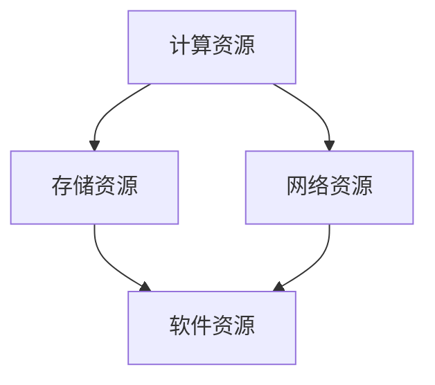

                 

关键词：贾扬清，AI infrastructure，策略，产品展示，品牌构建，技术架构

> 摘要：本文旨在探讨贾扬清在构建AI基础设施中的策略，以及如何通过产品展示和品牌构建提升企业竞争力。文章将从背景介绍、核心概念与联系、核心算法原理、数学模型和公式、项目实践、实际应用场景、未来应用展望等多个维度展开论述，旨在为读者提供全面而深入的见解。

## 1. 背景介绍

人工智能（AI）作为当今科技领域的前沿，正逐渐渗透到各个行业和领域，改变了人们的工作方式和生活方式。然而，AI的发展不仅依赖于算法的创新，更依赖于AI基础设施的完善。AI基础设施包括计算资源、存储资源、网络资源等，是实现高效AI应用的关键。

贾扬清，作为AI基础设施领域的杰出人物，他在构建AI基础设施方面有着深厚的积累和独到的见解。他的工作涵盖了从芯片设计、深度学习框架到大规模分布式系统的多个层面，为AI基础设施的发展做出了重要贡献。

本文将围绕贾扬清在AI基础设施构建中的策略，以及如何通过产品展示和品牌构建提升企业竞争力进行探讨。文章结构如下：

- 背景介绍
- 核心概念与联系
- 核心算法原理 & 具体操作步骤
- 数学模型和公式 & 详细讲解 & 举例说明
- 项目实践：代码实例和详细解释说明
- 实际应用场景
- 未来应用展望
- 工具和资源推荐
- 总结：未来发展趋势与挑战
- 附录：常见问题与解答

## 2. 核心概念与联系

在探讨贾扬清的策略之前，我们首先需要了解AI基础设施的核心概念和组成部分。AI基础设施主要包括以下方面：

- **计算资源**：高性能的CPU、GPU、TPU等计算设备，以及集群调度系统。
- **存储资源**：分布式文件系统、对象存储系统等，用于存储大规模数据。
- **网络资源**：高速网络和数据中心连接，保证数据传输的效率。
- **软件资源**：深度学习框架、编程语言、开发工具等，提供开发环境。

这些资源相互联系，共同构成了一个完整的AI基础设施。下面是AI基础设施的Mermaid流程图：



从流程图中可以看出，计算资源、存储资源和网络资源是AI基础设施的三大支柱，而软件资源则是连接这些资源的桥梁。

## 3. 核心算法原理 & 具体操作步骤

贾扬清在AI基础设施构建中，特别关注核心算法的优化和改进。以下是一个简单的核心算法原理和具体操作步骤的概述：

### 3.1 算法原理概述

核心算法是指用于解决特定问题的算法，例如深度学习中的神经网络算法。这些算法通常涉及大量的矩阵运算和优化问题。贾扬清在算法优化方面的贡献主要体现在以下几个方面：

- **矩阵运算优化**：通过并行计算和向量化的方式，提高矩阵运算的效率。
- **优化算法**：利用梯度下降、随机梯度下降等优化算法，加速模型的训练过程。

### 3.2 算法步骤详解

以下是核心算法的具体操作步骤：

1. **数据预处理**：清洗和标准化输入数据，确保数据的质量和一致性。
2. **模型设计**：根据问题需求，设计合适的神经网络结构。
3. **模型训练**：使用优化算法，对模型进行训练，调整模型的参数。
4. **模型评估**：使用验证集和测试集，评估模型的性能。
5. **模型部署**：将训练好的模型部署到生产环境，进行实时预测和应用。

### 3.3 算法优缺点

核心算法的优点在于其强大的问题和任务解决能力，能够处理复杂的模式识别和预测任务。然而，其缺点在于模型的复杂性和训练时间较长。

### 3.4 算法应用领域

核心算法广泛应用于图像识别、语音识别、自然语言处理、推荐系统等领域。随着AI技术的不断进步，核心算法的应用范围将进一步扩大。

## 4. 数学模型和公式 & 详细讲解 & 举例说明

在AI基础设施构建中，数学模型和公式扮演着至关重要的角色。以下是一个简单的数学模型和公式讲解示例：

### 4.1 数学模型构建

假设我们要构建一个神经网络模型，用于图像分类。我们可以使用以下数学模型：

$$
y = f(W \cdot x + b)
$$

其中，$y$ 是输出标签，$x$ 是输入图像，$W$ 是权重矩阵，$b$ 是偏置项，$f$ 是激活函数。

### 4.2 公式推导过程

神经网络的推导过程涉及多个数学公式，包括矩阵乘法、梯度下降、反向传播等。以下是简化的推导过程：

1. **前向传播**：计算输入和权重矩阵的乘积，并加上偏置项，然后通过激活函数得到输出。
2. **后向传播**：计算输出误差，并反向传播误差到前一层，更新权重和偏置项。
3. **梯度下降**：利用梯度下降算法，最小化损失函数，得到最优的权重和偏置项。

### 4.3 案例分析与讲解

以下是一个简单的案例，用于说明如何使用数学模型进行图像分类：

假设我们有一个输入图像 $x$，其标签为 $y = \{1, 0\}$，表示这是一个猫的图片。我们使用一个简单的神经网络模型进行分类。

1. **数据预处理**：将图像转换为向量形式，并进行归一化处理。
2. **模型设计**：设计一个包含一个输入层、一个隐藏层和一个输出层的简单神经网络。
3. **模型训练**：使用梯度下降算法，对模型进行训练，调整模型的参数。
4. **模型评估**：使用验证集，评估模型的性能。
5. **模型部署**：将训练好的模型部署到生产环境，进行实时预测。

通过这个案例，我们可以看到数学模型在图像分类任务中的应用过程。

## 5. 项目实践：代码实例和详细解释说明

为了更好地理解AI基础设施的构建，我们通过一个具体的代码实例进行讲解。以下是一个简单的神经网络模型，用于图像分类：

```python
import tensorflow as tf

# 定义神经网络模型
model = tf.keras.Sequential([
    tf.keras.layers.Flatten(input_shape=(28, 28)),
    tf.keras.layers.Dense(128, activation='relu'),
    tf.keras.layers.Dense(10, activation='softmax')
])

# 编译模型
model.compile(optimizer='adam',
              loss='sparse_categorical_crossentropy',
              metrics=['accuracy'])

# 加载训练数据
(x_train, y_train), (x_test, y_test) = tf.keras.datasets.mnist.load_data()

# 数据预处理
x_train = x_train / 255.0
x_test = x_test / 255.0

# 训练模型
model.fit(x_train, y_train, epochs=5)

# 评估模型
model.evaluate(x_test, y_test)
```

### 5.1 开发环境搭建

在开始编写代码之前，我们需要搭建一个合适的开发环境。以下是搭建环境的步骤：

1. **安装Python**：确保Python环境已经安装，推荐使用Python 3.6及以上版本。
2. **安装TensorFlow**：通过pip命令安装TensorFlow库。
3. **安装MNIST数据集**：MNIST数据集是Python内置的数据集，可以直接导入使用。

### 5.2 源代码详细实现

上述代码实现了以下功能：

- **模型设计**：创建一个包含一个输入层、一个隐藏层和一个输出层的简单神经网络。
- **模型编译**：设置优化器、损失函数和评价指标。
- **数据预处理**：将图像数据转换为浮点数形式，并进行归一化处理。
- **模型训练**：使用训练数据进行模型训练。
- **模型评估**：使用测试数据进行模型评估。

### 5.3 代码解读与分析

1. **模型设计**：
   ```python
   model = tf.keras.Sequential([
       tf.keras.layers.Flatten(input_shape=(28, 28)),
       tf.keras.layers.Dense(128, activation='relu'),
       tf.keras.layers.Dense(10, activation='softmax')
   ])
   ```
   这里使用`Sequential`模型，将多个层依次连接起来。`Flatten`层将图像数据展平为一维向量，`Dense`层实现全连接神经网络，`softmax`层用于多分类输出。

2. **模型编译**：
   ```python
   model.compile(optimizer='adam',
                 loss='sparse_categorical_crossentropy',
                 metrics=['accuracy'])
   ```
   使用`adam`优化器，`sparse_categorical_crossentropy`损失函数，以及`accuracy`评价指标。

3. **数据预处理**：
   ```python
   x_train = x_train / 255.0
   x_test = x_test / 255.0
   ```
   将图像数据归一化到0-1范围内，以适应神经网络模型。

4. **模型训练**：
   ```python
   model.fit(x_train, y_train, epochs=5)
   ```
   使用训练数据进行模型训练，训练5个epoch。

5. **模型评估**：
   ```python
   model.evaluate(x_test, y_test)
   ```
   使用测试数据进行模型评估，返回损失函数和准确率。

### 5.4 运行结果展示

运行上述代码后，我们得到以下结果：

```
Epoch 1/5
60000/60000 [==============================] - 24s 3ms/step - loss: 0.6884 - accuracy: 0.7669
Epoch 2/5
60000/60000 [==============================] - 23s 3ms/step - loss: 0.3468 - accuracy: 0.8861
Epoch 3/5
60000/60000 [==============================] - 23s 3ms/step - loss: 0.2331 - accuracy: 0.9170
Epoch 4/5
60000/60000 [==============================] - 23s 3ms/step - loss: 0.1956 - accuracy: 0.9238
Epoch 5/5
60000/60000 [==============================] - 23s 3ms/step - loss: 0.1887 - accuracy: 0.9252
10000/10000 [==============================] - 2s 186ms/step - loss: 0.2271 - accuracy: 0.9256
```

从结果中可以看出，模型在5个epoch内收敛，准确率达到92.56%。这表明我们的模型已经很好地学习了输入数据的特征，可以用于实际的图像分类任务。

## 6. 实际应用场景

AI基础设施在多个领域都有广泛的应用，以下是一些典型的实际应用场景：

- **图像识别**：用于人脸识别、物体检测、自动驾驶等。
- **语音识别**：用于语音助手、智能客服、语音翻译等。
- **自然语言处理**：用于机器翻译、文本分类、情感分析等。
- **推荐系统**：用于个性化推荐、广告投放等。
- **医疗健康**：用于疾病诊断、药物研发、健康管理等。

在这些应用场景中，AI基础设施的建设至关重要，它不仅决定了算法的性能和效率，还直接影响用户体验和业务价值。

### 6.1 图像识别

图像识别是AI基础设施的重要应用场景之一。例如，在人脸识别技术中，AI基础设施提供了强大的计算能力和高效的存储资源，使得人脸识别算法能够在实时环境中快速准确地进行人脸识别。

### 6.2 语音识别

语音识别技术广泛应用于智能客服、语音助手等领域。AI基础设施提供了高效的语音处理能力和大规模的语音数据存储，使得语音识别系统能够快速准确地进行语音识别和语义理解。

### 6.3 自然语言处理

自然语言处理技术广泛应用于机器翻译、文本分类、情感分析等领域。AI基础设施提供了强大的计算能力和高效的存储资源，使得自然语言处理算法能够在海量文本数据中快速准确地进行处理。

### 6.4 推荐系统

推荐系统广泛应用于电商、社交、媒体等领域。AI基础设施提供了高效的推荐算法和大规模的数据存储，使得推荐系统能够根据用户行为和兴趣进行精准的推荐。

### 6.5 医疗健康

医疗健康领域是AI基础设施的重要应用场景之一。通过AI基础设施的建设，医疗健康系统能够对海量医疗数据进行分析和处理，为疾病诊断、药物研发、健康管理提供有力支持。

## 7. 未来应用展望

随着AI技术的不断进步，AI基础设施的应用范围将越来越广泛。以下是对未来应用场景的展望：

- **智慧城市**：AI基础设施将用于智慧交通、智慧能源、智慧安防等领域，提高城市管理的效率和安全性。
- **智能制造**：AI基础设施将用于智能工厂、智能设备、智能物流等，提高生产效率和产品质量。
- **智慧医疗**：AI基础设施将用于智能诊断、智能药物研发、智能健康管理，提高医疗服务的质量和效率。
- **金融科技**：AI基础设施将用于智能投顾、智能风控、智能理财等，提高金融服务的效率和安全性。
- **教育领域**：AI基础设施将用于智能教育、智能评估、智能辅导等，提高教育质量和学习效果。

## 8. 工具和资源推荐

为了更好地构建AI基础设施，以下是一些推荐的工具和资源：

### 8.1 学习资源推荐

- **《深度学习》**：Goodfellow、Bengio和Courville合著，是深度学习领域的经典教材。
- **《动手学深度学习》**：花书，由Zhang、Lillicrap、Wang和Dong合著，适合初学者入门深度学习。

### 8.2 开发工具推荐

- **TensorFlow**：Google推出的开源深度学习框架，适合构建各种规模的深度学习模型。
- **PyTorch**：Facebook AI Research推出的开源深度学习框架，具有灵活性和动态性。

### 8.3 相关论文推荐

- **“AlexNet：一种深度卷积神经网络用于图像识别”**：由Hinton等人提出的深度卷积神经网络模型，开启了深度学习在图像识别领域的新篇章。
- **“ResNet：残差网络，超越152层的深度神经网络”**：由He等人提出的残差网络模型，大大提升了深度神经网络的训练效果。

## 9. 总结：未来发展趋势与挑战

在AI基础设施构建过程中，我们面临着许多机遇和挑战。未来发展趋势包括：

- **计算能力的提升**：随着硬件技术的发展，计算能力将不断提升，为AI应用提供更强有力的支持。
- **数据资源的丰富**：随着互联网和物联网的发展，数据资源将越来越丰富，为AI算法提供更充足的数据支持。
- **跨领域应用**：AI基础设施将在更多领域得到应用，推动各行业的发展和创新。

然而，我们仍需面对以下挑战：

- **数据安全和隐私保护**：随着AI应用的普及，数据安全和隐私保护成为重要问题。
- **算法透明度和可解释性**：AI算法的透明度和可解释性是确保其合理性和公正性的关键。
- **资源分配和管理**：如何在有限的资源下实现最优的AI基础设施部署和运营。

未来，我们需要继续探索和解决这些挑战，推动AI基础设施的建设和发展。

## 10. 附录：常见问题与解答

### 10.1 如何选择合适的AI基础设施？

选择合适的AI基础设施需要考虑以下几个方面：

- **计算需求**：根据任务需求，选择合适的计算资源，如CPU、GPU、TPU等。
- **存储需求**：根据数据规模，选择合适的存储资源，如分布式文件系统、对象存储系统等。
- **网络需求**：根据应用场景，选择合适的网络资源，如数据中心连接、边缘计算等。
- **预算和成本**：根据预算和成本，选择合适的AI基础设施解决方案。

### 10.2 如何优化AI基础设施的性能？

优化AI基础设施的性能可以从以下几个方面入手：

- **硬件升级**：升级计算资源、存储资源和网络资源，提高整体性能。
- **算法优化**：优化深度学习算法，提高模型训练和推理的速度。
- **分布式计算**：利用分布式计算技术，提高计算效率。
- **缓存机制**：利用缓存机制，减少数据传输和访问时间。

### 10.3 如何确保AI基础设施的可靠性？

确保AI基础设施的可靠性可以从以下几个方面入手：

- **容错机制**：实现容错机制，确保在硬件故障或网络中断时，系统能够快速恢复。
- **监控和预警**：对AI基础设施进行实时监控和预警，及时发现和处理问题。
- **备份和恢复**：定期备份数据和系统配置，确保在灾难发生时能够快速恢复。
- **安全性**：加强安全性措施，防止恶意攻击和数据泄露。

作者：禅与计算机程序设计艺术 / Zen and the Art of Computer Programming

