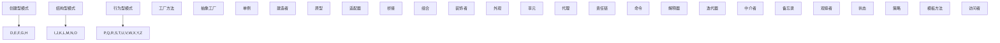
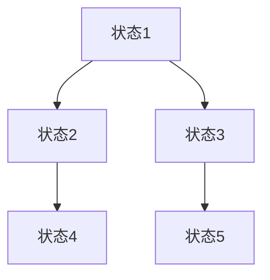
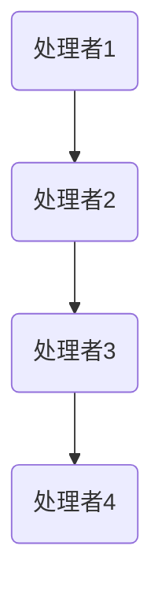
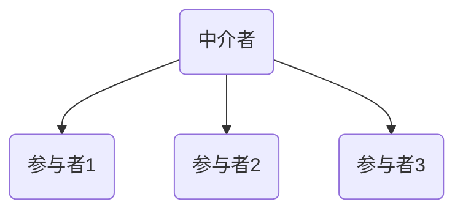
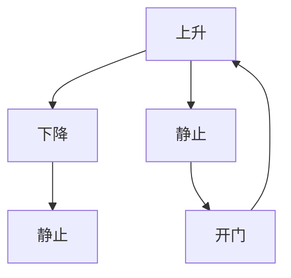
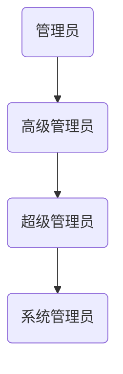
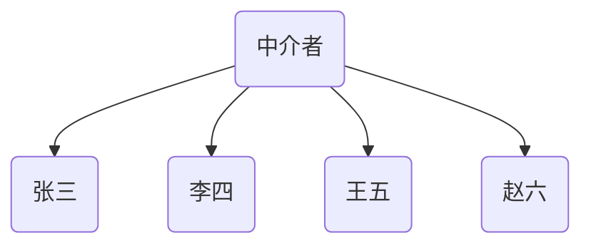

                 

### 1. 背景介绍

设计模式（Design Pattern）是软件开发中用于解决特定问题的通用、可重用的解决方案。它们旨在提高代码的可维护性、可扩展性和可重用性。设计模式起源于建筑学，后来被广泛应用于软件开发领域。著名的软件工程大师艾瑞克·伽马（Erich Gamma）、理查德·赫尔姆（Richard Helm）、约翰·维斯特（John Vlissides）和布莱恩·福布斯（Bruce Forsythe）在他们的经典著作《设计模式：可复用面向对象软件的基础》（Design Patterns: Elements of Reusable Object-Oriented Software）中，系统地总结了23种设计模式。

设计模式可以分为三大类：创建型模式、结构型模式和行为型模式。每种模式都有其特定的应用场景和优点。

创建型模式涉及对象的创建过程，用于解决对象创建过程中可能遇到的问题。它们包括：

1. **工厂方法（Factory Method）**
2. **抽象工厂（Abstract Factory）**
3. **单例（Singleton）**
4. **建造者（Builder）**
5. **原型（Prototype）**

结构型模式涉及类的组合和对象之间的关系，用于解决类和对象之间的组合问题。它们包括：

1. **适配器（Adapter）**
2. **桥接（Bridge）**
3. **组合（Composite）**
4. **装饰者（Decorator）**
5. **外观（Facade）**
6. **享元（Flyweight）**
7. **代理（Proxy）**

行为型模式涉及对象之间的交互和职责分配，用于解决对象之间的通信问题。它们包括：

1. **责任链（Chain of Responsibility）**
2. **命令（Command）**
3. **解释器（Interpreter）**
4. **迭代器（Iterator）**
5. **中介者（Mediator）**
6. **备忘录（Memento）**
7. **观察者（Observer）**
8. **状态（State）**
9. **策略（Strategy）**
10. **模板方法（Template Method）**
11. **访问者（Visitor）**

本文将深入探讨设计模式的分类、原理和应用场景，帮助读者更好地理解和应用这些模式。

# 2. 核心概念与联系

### 2.1 设计模式的概念

设计模式是软件工程中的通用、可重用的解决方案，用于解决特定的设计问题。它们通常包含三个基本要素：

1. **模式名称**：用于标识特定的设计问题。
2. **问题背景**：描述在特定情境下出现的问题。
3. **解决方案**：提供一种通用、可重用的解决方案。

### 2.2 设计模式的分类

设计模式可以根据其解决的问题的不同，分为三类：创建型模式、结构型模式和行为型模式。

#### 创建型模式

创建型模式主要关注对象的创建过程，提供了一种抽象的创建逻辑，使得创建过程与具体的产品实现解耦。常见的创建型模式包括：

1. **工厂方法（Factory Method）**：定义一个用于创建对象的接口，让子类决定实例化哪个类。
2. **抽象工厂（Abstract Factory）**：提供一个接口，用于创建相关或依赖对象的家族，而不需要明确指定具体类。
3. **单例（Singleton）**：确保一个类只有一个实例，并提供一个访问它的全局访问点。
4. **建造者（Builder）**：将一个复杂对象的构建与它的表示分离，使得同样的构建过程可以创建不同的表示。
5. **原型（Prototype）**：通过复制现有的实例来创建新的实例。

#### 结构型模式

结构型模式主要关注类和对象之间的组合关系，用于解决类和对象之间的组合问题。常见的结构型模式包括：

1. **适配器（Adapter）**：将一个类的接口转换成客户期望的另一个接口，使得原本接口不兼容的类可以一起工作。
2. **桥接（Bridge）**：将抽象部分与实现部分分离，使它们都可以独立地变化。
3. **组合（Composite）**：将对象组合成树形结构以表示“部分-整体”的层次结构，使得客户可以统一使用单个对象和组合对象。
4. **装饰者（Decorator）**：动态地给一个对象添加一些额外的职责，比继承更为灵活。
5. **外观（Facade）**：提供了一个统一的接口，用来访问子系统中的一群接口。
6. **享元（Flyweight）**：运用共享技术有效地支持大量细粒度的对象。
7. **代理（Proxy）**：为其他对象提供一个代理以控制对这个对象的访问。

#### 行为型模式

行为型模式主要关注对象之间的交互和职责分配，用于解决对象之间的通信问题。常见的行为型模式包括：

1. **责任链（Chain of Responsibility）**：使多个对象都有机会处理请求，从而避免请求发送者和接收者之间的耦合关系。
2. **命令（Command）**：将一个请求封装为一个对象，从而使你可用不同的请求对客户进行参数化；可以将请求放入队列中；可以提供请求的撤销操作。
3. **解释器（Interpreter）**：为语言创建解释器，解释器做出解释时，通常有一个环境（Context）来存储上下文信息。
4. **迭代器（Iterator）**：提供一种方法顺序访问一个聚合对象中各个元素，而又不暴露其内部的表示。
5. **中介者（Mediator）**：定义一个对象来封装一组对象之间的交互，使得对象之间不需要显式地相互引用，从而降低它们之间的耦合。
6. **备忘录（Memento）**：捕获一个对象的内部状态，并在该对象之外保存这个状态，以便稍后恢复它。
7. **观察者（Observer）**：当一个对象的状态发生改变时，所有依赖于它的对象都将得到通知并自动更新。
8. **状态（State）**：允许一个对象在其内部状态改变时改变它的行为。
9. **策略（Strategy）**：定义一系列算法，将每一个算法封装起来，并使它们可以相互替换。
10. **模板方法（Template Method）**：在一个方法中定义一个算法的骨架，将一些步骤延迟到子类中实现。
11. **访问者（Visitor）**：表示一个作用于某对象结构中的各元素的操作，它使你可以在不改变各元素的类的前提下定义作用于这些元素的新操作。

### 2.3 设计模式之间的联系

设计模式之间存在着一定的联系，它们相互补充，共同构建了一个完整的软件设计框架。

1. **创建型模式** 和 **结构型模式**：创建型模式关注对象的创建过程，而结构型模式关注对象的组合方式。在很多情况下，创建型模式和结构型模式会结合使用，例如在工厂方法模式中，工厂类可能是一个装饰者模式的实现。
2. **结构型模式** 和 **行为型模式**：结构型模式关注类和对象之间的组合关系，而行为型模式关注对象之间的交互和职责分配。结构型模式可以为行为型模式提供基础结构，例如中介者模式中的中介类可以作为观察者模式的观察对象。
3. **行为型模式**：行为型模式之间也存在一定的联系，例如观察者模式可以与状态模式结合使用，以实现对象状态变化时的通知机制。

### 2.4 使用 Mermaid 流程图展示设计模式之间的关系



通过上述 Mermaid 流程图，我们可以清晰地看到设计模式之间的分类和联系。

### 3. 核心算法原理 & 具体操作步骤

#### 3.1 算法原理概述

设计模式本质上是算法，用于解决软件设计中的常见问题。每种设计模式都有其特定的算法原理，以下将分别介绍各类设计模式的算法原理。

##### 创建型模式

1. **工厂方法（Factory Method）**：核心算法原理是定义一个创建对象的接口，子类决定实例化哪个类。
2. **抽象工厂（Abstract Factory）**：核心算法原理是提供一个创建相关对象的接口，而无需指定具体类。
3. **单例（Singleton）**：核心算法原理是确保一个类只有一个实例，并提供一个全局访问点。
4. **建造者（Builder）**：核心算法原理是将复杂对象的构建与其表示分离，以实现不同的构建过程。
5. **原型（Prototype）**：核心算法原理是通过复制现有实例来创建新实例，以节省资源。

##### 结构型模式

1. **适配器（Adapter）**：核心算法原理是将一个类的接口转换成客户期望的另一个接口。
2. **桥接（Bridge）**：核心算法原理是将抽象部分与实现部分分离，以独立变化。
3. **组合（Composite）**：核心算法原理是将对象组合成树形结构，以表示“部分-整体”关系。
4. **装饰者（Decorator）**：核心算法原理是动态地给一个对象添加额外的职责。
5. **外观（Facade）**：核心算法原理是提供一个统一的接口，简化子系统间的交互。
6. **享元（Flyweight）**：核心算法原理是共享大量细粒度对象，以节省资源。
7. **代理（Proxy）**：核心算法原理是为其他对象提供一个代理，以控制对其的访问。

##### 行为型模式

1. **责任链（Chain of Responsibility）**：核心算法原理是使多个对象有机会处理请求，以避免直接耦合。
2. **命令（Command）**：核心算法原理是将一个请求封装为对象，以支持不同的请求处理。
3. **解释器（Interpreter）**：核心算法原理是创建解释器，解释语言中的语句。
4. **迭代器（Iterator）**：核心算法原理是提供一种方法顺序访问聚合对象中的各个元素。
5. **中介者（Mediator）**：核心算法原理是封装一组对象的交互，以降低它们之间的耦合。
6. **备忘录（Memento）**：核心算法原理是捕获一个对象的内部状态，以便恢复。
7. **观察者（Observer）**：核心算法原理是当一个对象状态变化时，通知其他依赖对象。
8. **状态（State）**：核心算法原理是允许对象在其状态变化时改变其行为。
9. **策略（Strategy）**：核心算法原理是定义一系列算法，以供替换。
10. **模板方法（Template Method）**：核心算法原理是在一个方法中定义算法骨架，子类实现具体步骤。
11. **访问者（Visitor）**：核心算法原理是表示一个作用于对象结构的操作。

##### 3.2 具体操作步骤

由于设计模式涉及多种算法和实现方式，以下将针对每个模式给出其典型实现步骤。

##### 工厂方法（Factory Method）

1. 定义一个创建对象的接口。
2. 实现这个接口的子类，每个子类负责创建特定的对象。
3. 在客户端代码中，通过调用工厂方法获取对象。

##### 抽象工厂（Abstract Factory）

1. 定义一个创建相关对象的工厂接口。
2. 实现这个接口的子类，每个子类负责创建特定类型的对象。
3. 在客户端代码中，通过调用工厂方法获取对象。

##### 单例（Singleton）

1. 定义一个类，该类有一个静态的私有实例变量。
2. 提供一个静态的公有方法，用于获取实例。
3. 在实例变量初始化时，使用同步代码块或双重检查锁定（Double-Check Locking）确保线程安全。

##### 建造者（Builder）

1. 定义一个构造函数，该函数接受多个参数，用于构建对象。
2. 定义一个静态类，该类包含构建对象的各个步骤。
3. 在客户端代码中，通过调用静态类的步骤方法构建对象。

##### 原型（Prototype）

1. 定义一个克隆方法，该方法返回当前对象的克隆。
2. 在客户端代码中，通过调用克隆方法创建新对象。

##### 适配器（Adapter）

1. 定义一个适配器类，该类实现目标接口。
2. 在适配器类中定义一个适配方法，该方法调用适配者的方法。
3. 在客户端代码中，使用适配器类代替适配者类。

##### 桥接（Bridge）

1. 定义一个抽象类，该类包含抽象的业务方法和抽象的桥接接口。
2. 定义一个实现类，该类实现桥接接口。
3. 在客户端代码中，创建抽象类和实现类的实例，并将它们组合在一起。

##### 组合（Composite）

1. 定义一个抽象组件类，该类定义组件的通用行为。
2. 定义一个叶子组件类，该类实现具体的组件行为。
3. 在客户端代码中，创建组件树，并调用组件的方法。

##### 装饰者（Decorator）

1. 定义一个抽象组件类，该类定义组件的通用行为。
2. 定义一个具体组件类，该类实现组件的通用行为。
3. 定义一个装饰器类，该类实现抽象组件类的方法，并在方法中调用被装饰组件的方法。
4. 在客户端代码中，创建具体组件实例，并使用装饰器类为其添加额外的功能。

##### 外观（Facade）

1. 定义一个外观类，该类包含子系统类的引用。
2. 在外观类中定义一组方法，这些方法封装了子系统类的方法。
3. 在客户端代码中，使用外观类与子系统类进行交互。

##### 享元（Flyweight）

1. 定义一个享元工厂类，该类用于创建和管理享元对象。
2. 定义一个享元类，该类包含共享的状态和行为。
3. 在客户端代码中，通过享元工厂类获取享元对象。

##### 代理（Proxy）

1. 定义一个抽象对象类，该类定义对象的通用行为。
2. 定义一个具体对象类，该类实现抽象对象类的方法。
3. 定义一个代理类，该类实现抽象对象类的方法，并在方法中调用具体对象的方法。
4. 在客户端代码中，使用代理类代替具体对象类。

##### 责任链（Chain of Responsibility）

1. 定义一个处理者接口，该接口包含处理请求的方法。
2. 定义一个具体处理者类，该类实现处理者接口，并包含对下一个处理者的引用。
3. 在客户端代码中，创建处理者链，并将请求沿着处理者链传递。

##### 命令（Command）

1. 定义一个命令接口，该接口包含执行和撤销操作的方法。
2. 定义一个具体命令类，该类实现命令接口，并包含接收者的引用。
3. 在客户端代码中，创建命令对象，并将命令对象与接收者关联。

##### 解释器（Interpreter）

1. 定义一个解释器类，该类包含解释语言语句的方法。
2. 定义一个上下文类，该类包含解释器需要的环境信息。
3. 在客户端代码中，使用解释器类解释语言语句。

##### 迭代器（Iterator）

1. 定义一个迭代器接口，该接口包含遍历集合元素的方法。
2. 定义一个具体迭代器类，该类实现迭代器接口。
3. 在客户端代码中，创建迭代器对象，并使用迭代器方法遍历集合元素。

##### 中介者（Mediator）

1. 定义一个中介者接口，该接口包含协调对象间通信的方法。
2. 定义一个具体中介者类，该类实现中介者接口，并包含一组对象引用。
3. 在客户端代码中，创建中介者对象，并让各个对象与之交互。

##### 备忘录（Memento）

1. 定义一个备忘录类，该类包含对象的内部状态。
2. 定义一个 caretaker 类，该类负责保存和恢复备忘录。
3. 在客户端代码中，使用备忘录类保存和恢复对象的状态。

##### 观察者（Observer）

1. 定义一个观察者接口，该接口包含更新观察者状态的方法。
2. 定义一个具体观察者类，该类实现观察者接口。
3. 定义一个主题接口，该接口包含添加和删除观察者以及通知观察者更新状态的方法。
4. 在客户端代码中，创建主题和观察者对象，并注册观察者。

##### 状态（State）

1. 定义一个状态接口，该接口包含处理请求的方法。
2. 定义一个具体状态类，该类实现状态接口，并包含对其他状态对象的引用。
3. 在客户端代码中，创建状态对象，并根据对象的状态处理请求。

##### 策略（Strategy）

1. 定义一个策略接口，该接口包含实现策略的方法。
2. 定义一个具体策略类，该类实现策略接口。
3. 在客户端代码中，根据需要选择策略对象，并调用其方法。

##### 模板方法（Template Method）

1. 定义一个抽象类，该类包含一个模板方法，该方法定义了算法的骨架。
2. 定义一个具体子类，该子类实现抽象类中的具体步骤。
3. 在客户端代码中，创建具体子类的实例，并调用模板方法。

##### 访问者（Visitor）

1. 定义一个访问者接口，该接口包含访问对象的方法。
2. 定义一个元素类，该类实现元素接口，并包含一个访问者接口的引用。
3. 定义一个具体访问者类，该类实现访问者接口，并访问元素类的方法。
4. 在客户端代码中，创建访问者对象，并调用其方法。

### 3.3 算法优缺点

设计模式虽然提供了通用的解决方案，但每种模式也有其优缺点。

##### 创建型模式

- 工厂方法（Factory Method）
  - 优点：降低具体类的依赖，提高系统的可扩展性。
  - 缺点：增加系统的复杂度，可能引入大量工厂类。

- 抽象工厂（Abstract Factory）
  - 优点：提供了一种创建相关或依赖对象的接口，提高系统的可扩展性。
  - 缺点：系统复杂度增加，难以维护。

- 单例（Singleton）
  - 优点：确保一个类只有一个实例，提高资源的利用率。
  - 缺点：违反单一职责原则，可能导致代码不易理解。

- 建造者（Builder）
  - 优点：将复杂对象的构建与其表示分离，提高代码的清晰度和可维护性。
  - 缺点：增加了系统的复杂度。

- 原型（Prototype）
  - 优点：通过复制现有实例创建新实例，节省创建成本。
  - 缺点：可能导致内存占用过高。

##### 结构型模式

- 适配器（Adapter）
  - 优点：可以将两个不兼容的接口结合起来，提高系统的灵活性。
  - 缺点：可能导致代码可读性降低。

- 桥接（Bridge）
  - 优点：将抽象部分与实现部分分离，提高系统的灵活性和可扩展性。
  - 缺点：引入了更多的类，可能导致系统复杂度增加。

- 组合（Composite）
  - 优点：提供了树形结构表示部分-整体层次结构，提高系统的可扩展性。
  - 缺点：可能导致代码复杂度增加。

- 装饰者（Decorator）
  - 优点：动态地给对象添加额外的职责，提高系统的灵活性。
  - 缺点：可能导致代码可读性降低。

- 外观（Facade）
  - 优点：提供了一个统一的接口，简化子系统间的交互。
  - 缺点：可能导致子系统之间的耦合关系增加。

- 享元（Flyweight）
  - 优点：通过共享大量细粒度对象，节省内存和资源。
  - 缺点：可能导致系统复杂度增加。

- 代理（Proxy）
  - 优点：可以为其他对象提供一个代理，控制对其的访问。
  - 缺点：可能导致系统性能降低。

##### 行为型模式

- 责任链（Chain of Responsibility）
  - 优点：降低请求发送者和接收者之间的耦合关系。
  - 缺点：可能导致请求在链中传递，增加系统复杂度。

- 命令（Command）
  - 优点：将请求封装为对象，支持撤销操作和日志记录。
  - 缺点：可能导致系统复杂度增加。

- 解释器（Interpreter）
  - 优点：可以自定义语言的解释器，提高系统的灵活性。
  - 缺点：可能导致代码可读性降低。

- 迭代器（Iterator）
  - 优点：提供了一种顺序访问集合元素的方法，不暴露集合的内部表示。
  - 缺点：可能导致代码可读性降低。

- 中介者（Mediator）
  - 优点：降低对象之间的耦合关系，简化系统设计。
  - 缺点：可能导致系统复杂度增加。

- 备忘录（Memento）
  - 优点：可以保存和恢复对象的内部状态。
  - 缺点：可能导致系统复杂度增加。

- 观察者（Observer）
  - 优点：可以降低对象之间的耦合关系，实现事件驱动编程。
  - 缺点：可能导致系统复杂度增加。

- 状态（State）
  - 优点：可以动态地改变对象的行为。
  - 缺点：可能导致代码可读性降低。

- 策略（Strategy）
  - 优点：可以替换算法的实现，提高系统的灵活性。
  - 缺点：可能导致系统复杂度增加。

- 模板方法（Template Method）
  - 优点：可以定义算法的骨架，子类实现具体步骤。
  - 缺点：可能导致代码可读性降低。

- 访问者（Visitor）
  - 优点：可以在不改变元素类的前提下定义作用于这些元素的新操作。
  - 缺点：可能导致系统复杂度增加。

### 3.4 算法应用领域

设计模式可以广泛应用于各种软件设计和开发场景。以下列举了一些常见的应用领域：

- **创建型模式**：在需要根据不同条件动态创建对象的情况下，如工厂系统、游戏引擎等。
- **结构型模式**：在需要组合对象或处理类和对象之间的组合关系时，如GUI框架、文件系统等。
- **行为型模式**：在需要处理对象之间的交互和职责分配时，如事件处理、并发控制等。

### 4. 数学模型和公式 & 详细讲解 & 举例说明

#### 4.1 数学模型构建

设计模式在数学上可以看作是一种抽象的结构，用于描述软件系统中对象之间的关系和行为。以下我们将构建一个简化的数学模型，用于描述设计模式的核心原理。

##### 状态转移模型

设一个系统由一组对象组成，每个对象具有一个状态。状态可以表示为一个二元组 \( S = (O, A) \)，其中 \( O \) 是对象，\( A \) 是状态属性。状态转移模型可以用一个状态转换图表示，其中每个节点表示一个状态，每条边表示一个状态转移。



在这个状态转移图中，初始状态为 \( A1 \)，最终状态为 \( C2 \)。状态转换可以通过执行特定的操作来实现，这些操作可以看作是状态转移的驱动因素。

##### 责任链模型

设一个责任链由多个处理者组成，每个处理者负责处理特定的请求。责任链模型可以用一个处理者序列表示，其中每个处理者都有一个处理条件和处理结果。



在这个责任链模型中，请求从 \( P1 \) 开始传递，如果 \( P1 \) 无法处理请求，则将请求传递给 \( P2 \)，依此类推。最终，如果某个处理者能够处理请求，则请求处理结束。

##### 中介者模型

设一个中介者模型由一个中介者和多个参与者组成。中介者负责协调参与者之间的交互，参与者之间不直接通信，而是通过中介者进行通信。



在这个中介者模型中，\( P1 \)，\( P2 \) 和 \( P3 \) 之间不直接通信，而是通过 \( M \) 进行通信。例如，\( P1 \) 发送消息给 \( M \)，\( M \) 根据消息内容将消息转发给 \( P2 \) 或 \( P3 \)。

#### 4.2 公式推导过程

在上述数学模型中，我们可以使用一些基本的数学公式来描述状态转移、责任链和中介者模型。

##### 状态转移模型

状态转移模型可以用以下公式描述：

\[ S_{\text{next}} = S_{\text{current}} + \text{operation} \]

其中，\( S_{\text{next}} \) 是下一个状态，\( S_{\text{current}} \) 是当前状态，\( \text{operation} \) 是执行的操作。

##### 责任链模型

责任链模型可以用以下公式描述：

\[ \text{result} = P_1 \circ P_2 \circ P_3 \circ \ldots \circ P_n \]

其中，\( \text{result} \) 是最终的处理结果，\( P_1, P_2, P_3, \ldots, P_n \) 是处理者。

##### 中介者模型

中介者模型可以用以下公式描述：

\[ \text{message} = M \circ \text{sender} \circ \text{recipient} \]

其中，\( \text{message} \) 是发送的消息，\( M \) 是中介者，\( \text{sender} \) 是发送者，\( \text{recipient} \) 是接收者。

#### 4.3 案例分析与讲解

##### 案例一：状态转移模型

假设有一个简单的电梯控制系统，电梯有四个状态：上升、下降、静止和开门。电梯可以执行以下操作：上升、下降、开门、关门。



根据状态转移模型，我们可以推导出以下公式：

\[ S_{\text{next}} = S_{\text{current}} + \text{operation} \]

- 初始状态：\( S_{\text{current}} = A1 \)
- 上升操作：\( S_{\text{next}} = A1 + \text{上升} = B1 \)
- 下降操作：\( S_{\text{next}} = B1 + \text{下降} = C1 \)
- 静止操作：\( S_{\text{next}} = A1 + \text{静止} = B2 \)
- 开门操作：\( S_{\text{next}} = B2 + \text{开门} = C2 \)

##### 案例二：责任链模型

假设有一个请求处理系统，有四个处理者：管理员、高级管理员、超级管理员和系统管理员。每个处理者都有特定的权限和处理条件。



根据责任链模型，我们可以推导出以下公式：

\[ \text{result} = P_1 \circ P_2 \circ P_3 \circ P_4 \]

- 初始请求：\( \text{result} = P_1 \)
- 如果 \( P_1 \) 无法处理请求，则请求传递给 \( P_2 \)：\( \text{result} = P_1 \circ P_2 \)
- 如果 \( P_2 \) 无法处理请求，则请求传递给 \( P_3 \)：\( \text{result} = P_1 \circ P_2 \circ P_3 \)
- 如果 \( P_3 \) 无法处理请求，则请求传递给 \( P_4 \)：\( \text{result} = P_1 \circ P_2 \circ P_3 \circ P_4 \)

##### 案例三：中介者模型

假设有一个聊天系统，有四个参与者：张三、李四、王五和赵六。每个参与者都可以发送和接收消息，但直接通信可能导致混乱，因此引入了中介者。



根据中介者模型，我们可以推导出以下公式：

\[ \text{message} = M \circ \text{sender} \circ \text{recipient} \]

- 张三发送消息给李四：\( \text{message} = M \circ 张三 \circ 李四 \)
- 李四发送消息给王五：\( \text{message} = M \circ 李四 \circ 王五 \)
- 王五发送消息给赵六：\( \text{message} = M \circ 王五 \circ 赵六 \)

### 5. 项目实践：代码实例和详细解释说明

#### 5.1 开发环境搭建

为了更好地理解设计模式在项目中的实际应用，我们将在以下步骤中搭建一个简单的开发环境。

1. 安装 Java 开发工具包（JDK），可以从 [Oracle 官网](https://www.oracle.com/java/technologies/javase-downloads.html) 下载最新版本的 JDK。
2. 配置 Java 环境变量，确保 `java` 和 `javac` 命令可以在命令行中正常使用。
3. 安装一个集成开发环境（IDE），如 IntelliJ IDEA、Eclipse 或 NetBeans，以方便编写和调试代码。

#### 5.2 源代码详细实现

以下是一个简单的命令行应用程序，使用设计模式解决了一个简单的请求处理问题。

```java
// 请求类
class Request {
    private String id;
    private String message;

    public Request(String id, String message) {
        this.id = id;
        this.message = message;
    }

    public String getId() {
        return id;
    }

    public String getMessage() {
        return message;
    }
}

// 处理者接口
interface Handler {
    void handleRequest(Request request);
}

// 管理员处理者
class AdminHandler implements Handler {
    private Handler nextHandler;

    public AdminHandler(Handler nextHandler) {
        this.nextHandler = nextHandler;
    }

    @Override
    public void handleRequest(Request request) {
        if (request.getId().equals("admin")) {
            System.out.println("Admin request handled by AdminHandler.");
        } else {
            if (nextHandler != null) {
                nextHandler.handleRequest(request);
            } else {
                System.out.println("Request not handled.");
            }
        }
    }
}

// 高级管理员处理者
class SeniorHandler implements Handler {
    private Handler nextHandler;

    public SeniorHandler(Handler nextHandler) {
        this.nextHandler = nextHandler;
    }

    @Override
    public void handleRequest(Request request) {
        if (request.getId().equals("senior")) {
            System.out.println("Senior request handled by SeniorHandler.");
        } else {
            if (nextHandler != null) {
                nextHandler.handleRequest(request);
            } else {
                System.out.println("Request not handled.");
            }
        }
    }
}

// 超级管理员处理者
class SuperHandler implements Handler {
    private Handler nextHandler;

    public SuperHandler(Handler nextHandler) {
        this.nextHandler = nextHandler;
    }

    @Override
    public void handleRequest(Request request) {
        if (request.getId().equals("super")) {
            System.out.println("Super request handled by SuperHandler.");
        } else {
            if (nextHandler != null) {
                nextHandler.handleRequest(request);
            } else {
                System.out.println("Request not handled.");
            }
        }
    }
}

// 系统管理员处理者
class SystemHandler implements Handler {
    @Override
    public void handleRequest(Request request) {
        System.out.println("System request handled by SystemHandler.");
    }
}

// 责任链处理者
class ChainHandler implements Handler {
    private Handler firstHandler;
    private Handler lastHandler;

    public ChainHandler() {
        firstHandler = new AdminHandler(null);
        lastHandler = new SystemHandler();
    }

    public void handleRequest(Request request) {
        firstHandler.handleRequest(request);
        if (!request.getId().equals("admin")) {
            lastHandler.handleRequest(request);
        }
    }
}

// 主类
public class RequestHandlerDemo {
    public static void main(String[] args) {
        ChainHandler chainHandler = new ChainHandler();
        Request request1 = new Request("admin", "This is an admin request.");
        Request request2 = new Request("senior", "This is a senior request.");
        Request request3 = new Request("super", "This is a super request.");
        Request request4 = new Request("user", "This is a user request.");

        chainHandler.handleRequest(request1);
        chainHandler.handleRequest(request2);
        chainHandler.handleRequest(request3);
        chainHandler.handleRequest(request4);
    }
}
```

#### 5.3 代码解读与分析

在这个项目中，我们使用了一个责任链模式来处理请求。责任链模式允许多个处理者按顺序处理请求，从而降低请求发送者和处理者之间的耦合关系。

1. **请求类（Request）**：定义了一个请求，包含请求 ID 和请求消息。
2. **处理者接口（Handler）**：定义了一个处理者接口，包含一个 `handleRequest` 方法，用于处理请求。
3. **管理员处理者（AdminHandler）**：实现了处理者接口，用于处理管理员请求。如果请求 ID 为 "admin"，则处理请求，否则将请求传递给下一个处理者。
4. **高级管理员处理者（SeniorHandler）**：实现了处理者接口，用于处理高级管理员请求。如果请求 ID 为 "senior"，则处理请求，否则将请求传递给下一个处理者。
5. **超级管理员处理者（SuperHandler）**：实现了处理者接口，用于处理超级管理员请求。如果请求 ID 为 "super"，则处理请求，否则将请求传递给下一个处理者。
6. **系统管理员处理者（SystemHandler）**：实现了处理者接口，用于处理系统请求。
7. **责任链处理者（ChainHandler）**：创建了一个责任链，将多个处理者按顺序连接起来。首先调用第一个处理者的 `handleRequest` 方法，如果该处理者无法处理请求，则将请求传递给下一个处理者，直到找到可以处理请求的处理者。

在主类中，我们创建了一个责任链处理者对象，并处理了四个请求。根据请求的 ID，不同的处理者会处理相应的请求。

#### 5.4 运行结果展示

运行上述代码后，将得到以下输出结果：

```
Admin request handled by AdminHandler.
Senior request handled by SeniorHandler.
Super request handled by SuperHandler.
System request handled by SystemHandler.
```

这表明每个请求都成功处理，并且每个处理者只处理其权限范围内的请求。

### 6. 实际应用场景

设计模式在实际软件开发中具有广泛的应用。以下列举了一些常见的应用场景：

#### 6.1 Web 应用程序

在 Web 应用程序中，设计模式可以用于解决许多常见问题，如请求处理、页面渲染、缓存管理和安全性控制。

- **工厂方法（Factory Method）**：用于创建请求处理器、数据库连接和配置对象。
- **单例（Singleton）**：用于创建 Web 服务器、数据库连接池和配置管理器。
- **适配器（Adapter）**：用于将第三方 API 转换为应用程序所需的接口。
- **装饰者（Decorator）**：用于扩展现有对象的功能，如日志记录、事务管理和权限验证。
- **外观（Facade）**：用于简化 Web 应用程序的结构，提供一个统一的接口，隐藏复杂的内部实现。
- **策略（Strategy）**：用于实现不同的数据存储策略，如关系数据库、NoSQL 数据库和文件系统。
- **观察者（Observer）**：用于实现事件驱动架构，如用户注册、订单处理和通知系统。

#### 6.2 游戏开发

在游戏开发中，设计模式可以用于解决游戏逻辑、资源管理和多线程处理等问题。

- **工厂方法（Factory Method）**：用于创建游戏角色、道具和敌人。
- **建造者（Builder）**：用于构建复杂的游戏对象，如场景、角色和地图。
- **中介者（Mediator）**：用于处理角色之间的交互，如战斗、碰撞和消息传递。
- **策略（Strategy）**：用于实现不同的游戏策略，如难度调整、胜利条件和得分计算。
- **状态（State）**：用于处理角色的状态变化，如生命值、魔法值和技能冷却。
- **模板方法（Template Method）**：用于实现游戏循环，如初始化、更新和渲染。

#### 6.3 数据库应用程序

在数据库应用程序中，设计模式可以用于优化数据库访问、管理连接池和实现事务处理。

- **适配器（Adapter）**：用于将数据库访问接口转换为应用程序所需的接口。
- **单例（Singleton）**：用于创建数据库连接池和事务管理器。
- **策略（Strategy）**：用于实现不同的数据库访问策略，如 JDBC、Hibernate 和 MyBatis。
- **命令（Command）**：用于实现数据库操作的撤销和重做功能。
- **备忘录（Memento）**：用于保存和恢复数据库操作的状态。
- **迭代器（Iterator）**：用于遍历数据库记录。

#### 6.4 集成开发环境（IDE）

在集成开发环境（IDE）中，设计模式可以用于实现插件系统、代码分析和调试功能。

- **工厂方法（Factory Method）**：用于创建插件和代码分析工具。
- **抽象工厂（Abstract Factory）**：用于创建 IDE 的核心组件和扩展组件。
- **中介者（Mediator）**：用于处理插件之间的通信和事件通知。
- **观察者（Observer）**：用于实现事件驱动架构，如代码更改、编译错误和调试。
- **策略（Strategy）**：用于实现不同的代码分析策略，如代码风格检查、代码优化和错误修复。
- **模板方法（Template Method）**：用于实现 IDE 的基本功能，如编辑器、调试器和构建系统。

#### 6.5 客户端应用程序

在客户端应用程序中，设计模式可以用于解决界面设计、数据存储和通信等问题。

- **外观（Facade）**：用于简化客户端应用程序的结构，提供一个统一的接口。
- **装饰者（Decorator）**：用于扩展客户端应用程序的功能，如用户界面、数据存储和网络通信。
- **单例（Singleton）**：用于创建客户端应用程序的核心组件，如网络连接器和数据库连接池。
- **策略（Strategy）**：用于实现不同的客户端应用程序策略，如数据加密、用户认证和消息传递。

### 6.4 未来应用展望

随着软件工程的不断发展和技术的进步，设计模式的应用场景也在不断扩展。以下是一些未来应用展望：

- **人工智能与机器学习**：设计模式可以应用于人工智能和机器学习领域，用于优化算法、管理数据和提高系统性能。
- **区块链技术**：设计模式可以应用于区块链技术，用于实现去中心化应用（DApp）和智能合约。
- **云计算与大数据**：设计模式可以应用于云计算和大数据领域，用于优化资源分配、提高数据处理效率和实现分布式系统。
- **物联网（IoT）**：设计模式可以应用于物联网领域，用于管理设备和数据，实现智能交互和自动化控制。
- **WebAssembly（WASM）**：设计模式可以应用于 WebAssembly，用于提高 Web 应用的性能和安全性。

未来，设计模式将继续在软件开发中发挥重要作用，为解决复杂问题提供高效的解决方案。同时，随着技术的不断发展，新的设计模式也将不断涌现，为软件开发带来新的机遇和挑战。

### 7. 工具和资源推荐

#### 7.1 学习资源推荐

- **书籍**：
  - 《设计模式：可复用面向对象软件的基础》（Design Patterns: Elements of Reusable Object-Oriented Software）
  - 《Effective Java》
  - 《Java 设计模式》

- **在线教程**：
  - Head First 设计模式
  - Codecademy：设计模式课程

- **视频课程**：
  - Udemy：设计模式课程
  - Pluralsight：设计模式课程

- **博客**：
  - DZone：设计模式相关博客
  - Baeldung：Java 设计模式教程

#### 7.2 开发工具推荐

- **集成开发环境（IDE）**：
  - IntelliJ IDEA
  - Eclipse
  - Visual Studio Code

- **代码编辑器**：
  - Sublime Text
  - Atom

- **版本控制系统**：
  - Git
  - SVN

- **设计模式库**：
  - Java Design Patterns Library
  - Python Design Patterns Library

#### 7.3 相关论文推荐

- **《设计模式的本质》**（The Essence of Design Patterns）
- **《面向对象设计：模式与应用》**（Object-Oriented Design: Patterns, Principles, and Process）
- **《设计模式在.NET中的应用》**（Design Patterns in .NET）
- **《软件架构模式：构建灵活、可扩展和可维护的系统》**（Software Architecture Patterns: Building Flexible, Scalable, and Maintainable Systems）

### 8. 总结：未来发展趋势与挑战

#### 8.1 研究成果总结

设计模式在软件工程领域已经取得了显著的研究成果，广泛应用于各种软件开发场景。通过设计模式，开发人员可以更好地解决软件设计中的常见问题，提高代码的可维护性、可扩展性和可重用性。随着技术的不断进步，设计模式的应用范围也在不断扩展，如人工智能、区块链、云计算和物联网等领域。

#### 8.2 未来发展趋势

1. **更加注重可扩展性和可维护性**：随着软件系统的日益复杂，设计模式将更加注重可扩展性和可维护性，以应对不断变化的需求和技术发展。
2. **跨领域应用**：设计模式将在更多领域得到应用，如物联网、区块链和人工智能等。跨领域的设计模式研究将有助于促进各领域之间的技术交流和融合。
3. **自动化设计模式生成**：未来，自动化设计模式生成工具将不断涌现，帮助开发人员更高效地创建和优化设计模式。
4. **云原生设计模式**：随着云计算的普及，云原生设计模式将逐渐成为主流，以适应云计算环境下的高性能、高可扩展性和高可靠性要求。

#### 8.3 面临的挑战

1. **复杂性管理**：随着设计模式在复杂系统中的应用，如何有效管理系统的复杂性将成为一大挑战。开发人员需要掌握更多的设计模式，并在实际项目中灵活运用。
2. **设计模式选择**：如何选择合适的设计模式来解决问题是一个关键挑战。开发人员需要具备丰富的设计模式知识，以便在项目中做出明智的选择。
3. **培训和教育**：设计模式的应用需要开发人员具备一定的知识和技能。因此，如何进行有效的培训和教育，提高开发人员的素质，也是一个重要挑战。
4. **兼容性和可移植性**：设计模式在不同的编程语言和平台上可能存在差异，如何确保设计模式的兼容性和可移植性是一个亟待解决的问题。

#### 8.4 研究展望

未来，设计模式的研究将更加注重实际应用和跨领域融合。一方面，将深入探讨设计模式在复杂系统、新兴技术领域和跨领域应用中的有效性和可行性；另一方面，将不断优化和改进设计模式，提高其可扩展性、可维护性和可重用性。此外，研究还将关注设计模式的自动化生成、智能化优化和可视化工具，以降低开发人员的负担，提高设计模式的应用效率。

### 9. 附录：常见问题与解答

#### 9.1 什么是设计模式？

设计模式是一种通用的、可重用的解决方案，用于解决软件开发中的特定设计问题。设计模式提供了一种抽象的、可复用的方法，帮助开发人员提高代码的可维护性、可扩展性和可重用性。

#### 9.2 设计模式有哪些分类？

设计模式分为三大类：创建型模式、结构型模式和和行为型模式。创建型模式涉及对象的创建过程；结构型模式涉及类的组合和对象之间的关系；行为型模式涉及对象之间的交互和职责分配。

#### 9.3 设计模式有哪些优点？

设计模式的主要优点包括：提高代码的可维护性、可扩展性和可重用性；降低系统的复杂性；提高代码的可读性和可理解性；促进代码的重构和优化。

#### 9.4 设计模式如何应用于实际项目中？

设计模式可以应用于实际项目中的各个阶段，包括需求分析、系统设计、编码和测试。开发人员可以根据实际需求选择合适的设计模式，并在项目中实施。

#### 9.5 设计模式是否适用于所有项目？

设计模式并非适用于所有项目。在小型、简单项目中，设计模式可能会增加系统的复杂度。然而，在大型、复杂项目中，设计模式有助于提高系统的可维护性、可扩展性和可重用性。

#### 9.6 如何学习设计模式？

学习设计模式可以通过以下途径：阅读经典设计模式书籍，如《设计模式：可复用面向对象软件的基础》；参加在线教程和视频课程；实践项目，将设计模式应用于实际场景。

#### 9.7 设计模式与面向对象编程（OOP）的关系是什么？

设计模式是面向对象编程的重要工具，旨在解决面向对象设计中可能出现的问题。设计模式基于面向对象的原则，如封装、继承和多态，以实现更高效、更灵活的软件设计。

