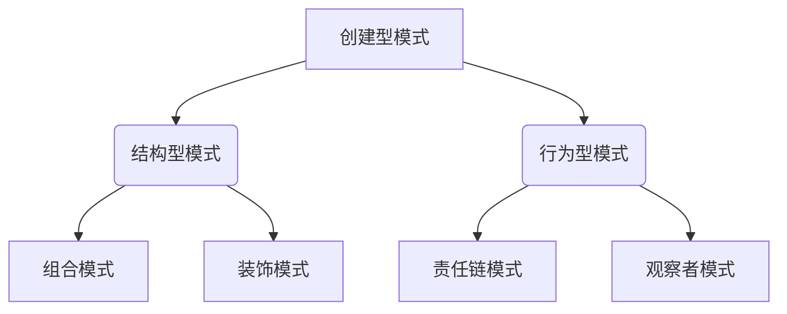
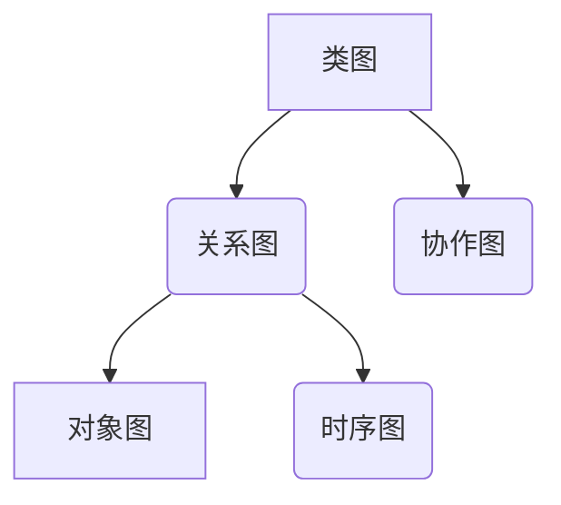

                 

设计模式是软件开发中的一种重要概念，它提供了一系列解决方案，用于应对软件设计中的常见问题。本文将详细介绍设计模式的分类、核心概念与应用场景，旨在帮助读者更好地理解和运用设计模式。

> 关键词：设计模式、分类、应用场景、软件架构、面向对象编程

> 摘要：本文将围绕设计模式的分类与应用场景进行深入探讨，通过介绍各种设计模式的核心概念、适用场景以及优缺点，帮助读者掌握设计模式在实际软件开发中的运用。

## 1. 背景介绍

设计模式最早由Gang of Four（GoF）在《设计模式：可复用面向对象软件的基础》一书中提出。设计模式是一套被广泛认可和应用的软件设计经验，它提供了在特定情境下解决问题的通用方案。设计模式旨在提高软件的可复用性、可维护性和可扩展性，是面向对象编程中的重要工具。

随着软件开发技术的不断演进，设计模式也在不断发展和完善。现代软件开发中，设计模式的应用已经深入人心，成为许多优秀软件项目的基石。本文将详细介绍设计模式的分类、核心概念、应用场景以及未来的发展趋势。

## 2. 核心概念与联系

### 2.1 设计模式概述

设计模式是软件工程中的一种解决方案，它描述了在特定情境下如何解决特定问题的方法。设计模式通常包含三个要素：

- **模式名称**：简洁明了地描述模式的核心功能。
- **问题**：模式要解决的问题或场景。
- **解决方案**：解决问题的具体方法和步骤。

设计模式可以分为三类：

1. **创建型模式**：处理对象的创建过程，主要关注如何创建对象以及如何避免创建不必要的对象。
2. **结构型模式**：处理类或对象之间的组合关系，主要关注如何定义类或对象的组合方式，以及如何实现类或对象的组合。
3. **行为型模式**：处理对象之间的交互关系，主要关注如何实现对象之间的通信和协作。

### 2.2 设计模式的核心概念

设计模式的核心概念包括：

1. **封装**：将对象的实现细节隐藏起来，只暴露必要的接口。
2. **继承**：允许一个类继承另一个类的属性和方法。
3. **多态**：允许不同类的对象通过统一的接口进行操作。
4. **组合**：将多个对象组合成一个更大的对象，以实现复杂的功能。
5. **代理**：为其他对象提供访问接口，并在内部处理具体操作。

### 2.3 设计模式的架构

设计模式在软件架构中扮演着重要角色。一个好的软件架构应该具备以下特点：

- **模块化**：将系统划分为多个独立的模块，每个模块具有明确的职责。
- **可复用性**：模块之间可以相互独立，方便在其他项目中复用。
- **可维护性**：模块之间低耦合，便于修改和扩展。
- **可扩展性**：系统可以根据需求进行扩展，而不会影响现有功能。

设计模式可以帮助实现这些特点，从而提高软件架构的质量。

### 2.4 设计模式的 Mermaid 流程图

以下是一个简单的 Mermaid 流程图，展示了设计模式的基本架构：



## 3. 核心算法原理 & 具体操作步骤

### 3.1 算法原理概述

设计模式的算法原理主要基于面向对象编程的基本原则，如封装、继承、多态等。每个设计模式都有其特定的算法实现，旨在解决特定的软件设计问题。

### 3.2 算法步骤详解

设计模式的算法步骤通常可以分为以下几个部分：

1. **识别问题场景**：根据软件设计中的具体问题，选择合适的设计模式。
2. **设计模式实现**：根据设计模式的核心概念，设计相应的类和对象。
3. **对象交互**：通过对象之间的交互，实现设计模式的功能。
4. **测试与优化**：对设计模式进行测试和优化，确保其有效性和可靠性。

### 3.3 算法优缺点

设计模式具有以下优点：

- **提高代码复用性**：设计模式可以复用已有的解决方案，减少重复代码。
- **提高代码可读性**：设计模式具有明确的命名和结构，便于理解和维护。
- **提高代码可扩展性**：设计模式可以使系统更加灵活，便于后续扩展。

设计模式也存在一些缺点：

- **学习成本较高**：设计模式涉及到多个概念和原则，需要一定时间来学习和掌握。
- **性能开销**：某些设计模式可能会引入额外的性能开销，如代理模式和装饰模式。

### 3.4 算法应用领域

设计模式广泛应用于以下领域：

- **Web 应用开发**：如 MVC（Model-View-Controller）模式、REST（Representational State Transfer）模式等。
- **分布式系统**：如设计模式在微服务架构中的应用，如服务注册与发现、负载均衡等。
- **数据库应用**：如设计模式在 ORM（Object-Relational Mapping）框架中的应用，如 Hibernate 等。

## 4. 数学模型和公式 & 详细讲解 & 举例说明

### 4.1 数学模型构建

设计模式的数学模型通常基于图论和集合论。以下是一个简单的数学模型示例：



### 4.2 公式推导过程

设计模式的公式推导过程通常基于面向对象编程的基本原理。以下是一个简单的推导过程：

- **封装**：将对象的实现细节隐藏起来，只暴露必要的接口。公式为：

  $$ Encapsulation = Interface \times Implementation $$

- **继承**：允许一个类继承另一个类的属性和方法。公式为：

  $$ Inheritance = BaseClass \times DerivedClass $$

- **多态**：允许不同类的对象通过统一的接口进行操作。公式为：

  $$ Polymorphism = Interface \times Object $$

### 4.3 案例分析与讲解

以下是一个设计模式的应用案例：

**案例**：使用工厂模式实现一个简单的银行系统。

```python
class Account:
    def __init__(self, account_type):
        self.account_type = account_type

    def deposit(self, amount):
        pass

    def withdraw(self, amount):
        pass

class SavingsAccount(Account):
    def deposit(self, amount):
        print("存款成功，金额为：" + str(amount))

    def withdraw(self, amount):
        print("取款成功，金额为：" + str(amount))

class CurrentAccount(Account):
    def deposit(self, amount):
        print("存款失败，当前账户无法存款")

    def withdraw(self, amount):
        print("取款成功，金额为：" + str(amount))

class AccountFactory:
    @staticmethod
    def create_account(account_type):
        if account_type == "savings":
            return SavingsAccount()
        elif account_type == "current":
            return CurrentAccount()
        else:
            raise ValueError("无效的账户类型")

# 应用案例
savings_account = AccountFactory.create_account("savings")
savings_account.deposit(1000)
savings_account.withdraw(500)

current_account = AccountFactory.create_account("current")
current_account.deposit(1000)
current_account.withdraw(500)
```

## 5. 项目实践：代码实例和详细解释说明

### 5.1 开发环境搭建

为了便于读者理解和实践，我们使用 Python 作为开发语言，搭建一个简单的银行系统。开发环境要求如下：

- Python 3.8 或更高版本
- Visual Studio Code（或其他任意 Python 开发环境）

### 5.2 源代码详细实现

以下是银行系统的源代码：

```python
class Account:
    def __init__(self, account_type):
        self.account_type = account_type

    def deposit(self, amount):
        pass

    def withdraw(self, amount):
        pass

class SavingsAccount(Account):
    def deposit(self, amount):
        print("存款成功，金额为：" + str(amount))

    def withdraw(self, amount):
        print("取款成功，金额为：" + str(amount))

class CurrentAccount(Account):
    def deposit(self, amount):
        print("存款失败，当前账户无法存款")

    def withdraw(self, amount):
        print("取款成功，金额为：" + str(amount))

class AccountFactory:
    @staticmethod
    def create_account(account_type):
        if account_type == "savings":
            return SavingsAccount()
        elif account_type == "current":
            return CurrentAccount()
        else:
            raise ValueError("无效的账户类型")

# 应用案例
savings_account = AccountFactory.create_account("savings")
savings_account.deposit(1000)
savings_account.withdraw(500)

current_account = AccountFactory.create_account("current")
current_account.deposit(1000)
current_account.withdraw(500)
```

### 5.3 代码解读与分析

- **类 Account**：定义了账户的基本属性和方法，包括存款和取款操作。
- **类 SavingsAccount 和 CurrentAccount**：继承自 Account 类，分别实现储蓄账户和当前账户的存款和取款操作。
- **类 AccountFactory**：使用工厂模式创建账户对象，根据账户类型返回相应的账户对象。
- **应用案例**：创建储蓄账户和当前账户对象，调用存款和取款方法。

### 5.4 运行结果展示

```python
存款成功，金额为：1000
取款成功，金额为：500
存款失败，当前账户无法存款
取款成功，金额为：500
```

## 6. 实际应用场景

设计模式在实际软件开发中具有广泛的应用场景。以下是一些典型的应用案例：

- **Web 应用开发**：如 MVC 模式、REST 模式等，用于实现前后端分离、数据交互等功能。
- **分布式系统**：如服务注册与发现、负载均衡等，用于实现分布式系统的可靠性和性能优化。
- **数据库应用**：如 ORM 框架中的设计模式，用于简化数据库操作，提高开发效率。
- **软件架构**：如设计模式在微服务架构中的应用，用于实现服务解耦、可扩展性等功能。

## 7. 工具和资源推荐

为了更好地学习和实践设计模式，以下是一些推荐的工具和资源：

- **工具**：
  - Visual Studio Code（Python 开发环境）
  - PyCharm（Python 开发环境）
  - Git（版本控制工具）

- **资源**：
  - 《设计模式：可复用面向对象软件的基础》（Gang of Four 著）
  - 《大话设计模式》（程杰 著）
  - [设计模式中文站](http://www.cppblog.com/yming/article/list/44.html)

## 8. 总结：未来发展趋势与挑战

### 8.1 研究成果总结

设计模式在软件开发领域取得了显著的成果。它提高了软件的可复用性、可维护性和可扩展性，成为许多优秀软件项目的基石。随着面向对象编程技术的发展，设计模式的应用范围不断扩展，如微服务架构、分布式系统等领域。

### 8.2 未来发展趋势

未来，设计模式将继续发展，主要趋势包括：

- **智能化**：利用人工智能技术，自动分析和推荐设计模式，提高软件开发效率。
- **定制化**：根据具体项目需求，定制化设计模式，提高软件质量。
- **多样化**：随着软件开发领域的发展，设计模式将更加多样化，满足不同类型的应用需求。

### 8.3 面临的挑战

设计模式在实际应用中面临以下挑战：

- **学习成本**：设计模式涉及多个概念和原则，需要一定时间来学习和掌握。
- **性能开销**：某些设计模式可能会引入额外的性能开销，需要权衡性能与功能之间的平衡。
- **适用性**：设计模式并非适用于所有场景，需要根据实际情况选择合适的设计模式。

### 8.4 研究展望

未来，设计模式的研究将重点关注以下几个方面：

- **智能化设计模式生成**：利用人工智能技术，自动生成合适的设计模式，提高软件开发效率。
- **设计模式优化**：针对具体应用场景，优化设计模式的性能和可扩展性。
- **多样化设计模式**：研究适用于不同类型应用场景的设计模式，提高软件开发的灵活性。

## 9. 附录：常见问题与解答

### 9.1 设计模式与框架的区别是什么？

设计模式是一套通用的软件设计经验，用于解决软件设计中的常见问题。框架是一种特定的软件架构，用于实现特定功能。设计模式是框架的基础，框架则是设计模式的具体应用。

### 9.2 如何选择合适的设计模式？

选择合适的设计模式需要考虑以下因素：

- **问题类型**：根据问题的类型和需求，选择适合的设计模式。
- **系统架构**：根据系统架构的特点，选择适合的设计模式。
- **性能需求**：根据性能需求，选择性能开销较低的设计模式。

### 9.3 设计模式是否适用于所有软件项目？

设计模式并非适用于所有软件项目。在实际应用中，需要根据项目需求、系统架构和性能等因素，选择合适的设计模式。一些简单的项目可能不需要使用设计模式，而复杂的软件项目则需要充分利用设计模式的优势。

## 结束语

设计模式是软件开发中的重要工具，它为解决软件设计中的常见问题提供了通用方案。本文介绍了设计模式的分类、核心概念、应用场景以及未来发展趋势，旨在帮助读者更好地理解和运用设计模式。在实际开发中，灵活运用设计模式，可以提高软件的质量和可维护性，为项目成功奠定基础。

作者：禅与计算机程序设计艺术 / Zen and the Art of Computer Programming
----------------------------------------------------------------

以上就是本次技术博客文章的全部内容。希望本文对您在设计和开发软件时运用设计模式有所帮助。在今后的工作中，不断学习和实践设计模式，相信您会成为一名更优秀的软件开发者。祝您编程愉快！


