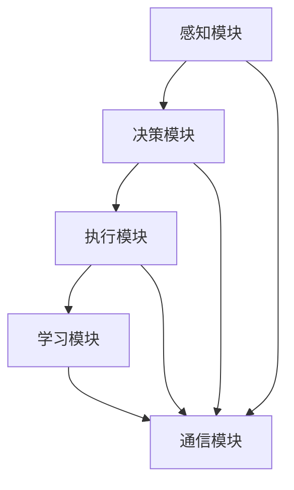

                 

在当今这个快速发展的科技时代，人工智能（AI）已经成为推动社会发展的重要力量。从自动驾驶汽车到智能助手，从医疗诊断到金融分析，AI的应用几乎无处不在。然而，随着AI系统的复杂性和规模不断增加，如何设计高效、可靠的AI智能体成为了一个亟待解决的关键问题。

本文将深入探讨设计高效AI智能体的原则，从核心概念、算法原理、数学模型、项目实践和实际应用场景等多个维度进行分析。希望通过本文的探讨，能够为AI领域的研究者和开发者提供一些有价值的指导和建议。

## 文章关键词
- 人工智能
- 智能体设计
- 算法优化
- 数学模型
- 实际应用

## 文章摘要
本文首先介绍了AI智能体的基本概念和重要性，然后分析了设计高效AI智能体所需遵循的原则。通过深入探讨算法原理、数学模型和项目实践，本文提供了一系列实用的设计指导，旨在帮助开发者构建高效、可靠的AI智能体。最后，本文对AI智能体的未来应用场景和挑战进行了展望。

## 1. 背景介绍

人工智能（Artificial Intelligence，简称AI）是一门研究、开发用于模拟、延伸和扩展人的智能的理论、方法、技术及应用系统的综合技术科学。随着计算机技术的飞速发展，AI在过去的几十年中取得了巨大的进步。从早期的规则推理系统、决策树、神经网络，到深度学习和强化学习，AI的理论和方法不断丰富和优化。

AI智能体（Artificial Intelligence Agent）是AI研究中的一个重要概念。智能体是一个能够感知环境、采取行动并实现特定目标的系统。在人工智能领域，智能体通常被设计为具有自主决策能力和行动能力的实体，可以应用于各种领域，如机器人、自动驾驶、智能客服等。

随着AI技术的不断发展，智能体的设计变得越来越复杂。如何设计高效、可靠的AI智能体，成为了一个重要且具有挑战性的课题。高效意味着智能体能够在给定的时间和资源内完成更多的工作，而可靠则意味着智能体的决策和行为是正确和合理的。本文将围绕这两个核心问题，探讨设计高效AI智能体的原则。

## 2. 核心概念与联系

### 2.1. 智能体定义与分类

智能体是一个能够感知环境、采取行动并实现特定目标的系统。根据智能体的功能和行为，可以将智能体分为以下几类：

- **反应型智能体**：这类智能体只根据当前感知的环境信息做出反应，不存储历史信息，也不具备学习能力。例如，自动化门卫机器人。

- **模型基础型智能体**：这类智能体利用预先定义的模型来理解环境，并据此做出决策。例如，基于规则的专家系统。

- **学习型智能体**：这类智能体通过不断学习环境中的信息，优化自己的决策和行为。例如，深度学习模型。

- **社会智能体**：这类智能体不仅具备个体智能，还能与其他智能体协作，实现更复杂的任务。例如，分布式智能体系统。

### 2.2. 智能体设计原则

设计高效AI智能体需要遵循一系列原则，主要包括：

- **目标导向性**：智能体应明确其目标，并围绕目标设计行为策略。

- **自主性**：智能体应具备自主决策和行动的能力，不受外部干预。

- **适应性**：智能体应能够适应环境变化，通过学习不断优化自身行为。

- **可靠性**：智能体应确保其决策和行为的正确性和一致性。

- **可扩展性**：智能体设计应考虑未来扩展和优化的可能性。

### 2.3. 智能体架构

智能体的架构是设计高效AI智能体的基础。一个典型的智能体架构通常包括以下几个主要部分：

- **感知模块**：负责收集环境信息，如图像、声音、文本等。

- **决策模块**：根据感知模块提供的信息，智能体决定采取何种行动。

- **执行模块**：根据决策模块的决策，智能体执行相应的行动。

- **学习模块**：智能体通过学习模块不断优化自身的行为策略。

- **通信模块**：智能体与其他智能体或外部系统进行通信，实现协同工作。

### 2.4. Mermaid 流程图

下面是一个简单的智能体架构的Mermaid流程图：



在上述流程图中，智能体的各个模块相互协作，共同实现智能体的目标。感知模块收集环境信息，决策模块根据这些信息做出决策，执行模块执行决策，学习模块不断优化决策和行为，通信模块则负责与其他智能体或外部系统进行交互。

## 3. 核心算法原理 & 具体操作步骤

### 3.1. 算法原理概述

在设计高效AI智能体时，核心算法的选择至关重要。常见的核心算法包括：

- **决策树**：通过树的形态表示决策过程，简单直观，易于解释。

- **支持向量机（SVM）**：通过寻找最佳决策边界，实现分类和回归任务。

- **神经网络**：通过模拟人脑神经元的工作方式，实现复杂的函数映射。

- **深度学习**：通过多层神经网络，实现更复杂的特征提取和模式识别。

- **强化学习**：通过试错和反馈机制，学习如何在环境中获得最大收益。

每种算法都有其独特的优势和适用场景。在设计智能体时，需要根据具体任务和需求选择合适的算法。

### 3.2. 算法步骤详解

下面以神经网络为例，详细说明算法的步骤：

1. **数据预处理**：对原始数据进行清洗、归一化和特征提取，为训练准备合适的数据集。

2. **模型构建**：定义神经网络的结构，包括输入层、隐藏层和输出层，以及各个层的神经元数量。

3. **损失函数选择**：根据任务类型（分类或回归），选择合适的损失函数，如交叉熵损失函数或均方误差损失函数。

4. **优化器选择**：选择合适的优化器，如随机梯度下降（SGD）或Adam优化器，以最小化损失函数。

5. **模型训练**：使用训练数据集对模型进行训练，调整模型参数，使模型在训练集上的表现达到预期。

6. **模型评估**：使用验证数据集对模型进行评估，检查模型的泛化能力。

7. **模型部署**：将训练好的模型部署到实际应用中，实现预测和决策功能。

### 3.3. 算法优缺点

- **决策树**：
  - 优点：简单直观，易于解释。
  - 缺点：容易过拟合，对于连续特征的分类效果较差。

- **SVM**：
  - 优点：寻找最佳决策边界，分类效果较好。
  - 缺点：对于高维数据的分类效果较差，训练时间较长。

- **神经网络**：
  - 优点：能够处理复杂的非线性问题，泛化能力较强。
  - 缺点：参数众多，容易过拟合，训练时间较长。

- **深度学习**：
  - 优点：强大的特征提取能力，能够处理大规模数据。
  - 缺点：参数众多，计算量大，对数据质量和标注要求高。

- **强化学习**：
  - 优点：能够处理动态环境，具有自主学习和适应能力。
  - 缺点：训练过程复杂，需要大量试错，对环境模型要求高。

### 3.4. 算法应用领域

- **决策树**：广泛应用于数据挖掘、金融风控和医疗诊断等领域。

- **SVM**：在图像识别、文本分类和语音识别等领域有广泛应用。

- **神经网络**：在计算机视觉、自然语言处理和推荐系统等领域占据主导地位。

- **深度学习**：在自动驾驶、智能客服和医疗诊断等领域取得了显著成果。

- **强化学习**：在游戏AI、智能控制和高频交易等领域有广泛应用。

## 4. 数学模型和公式 & 详细讲解 & 举例说明

### 4.1. 数学模型构建

在设计高效AI智能体时，数学模型是核心组成部分。以下介绍几种常见的数学模型及其构建过程。

#### 4.1.1. 决策树模型

决策树模型是一种基于树形结构进行决策的模型。其基本原理是，通过一系列条件判断，将样本划分为不同的类别或回归值。

- **构建过程**：

1. **初始节点**：所有样本作为根节点。
2. **条件判断**：选择一个最优划分条件，将节点划分为多个子节点。
3. **递归构建**：对每个子节点重复步骤2，直到满足停止条件（如节点内部样本数量小于阈值或节点纯度达到阈值）。

- **公式表示**：

```latex
定义样本集合为D，划分条件为C，纯度度量函数为P(D)。

根节点T = {D}

递归构建过程：
T_i = \{D_i | D_i \in D, P(D_i) \leq \theta\}

最终决策树模型为：
T = \{T_0, T_1, ..., T_n\}
```

#### 4.1.2. 神经网络模型

神经网络模型是一种通过多层神经元进行非线性变换的模型。其基本原理是，通过前向传播和反向传播，不断调整网络权重，使模型在训练数据上的表现达到预期。

- **构建过程**：

1. **初始化权重**：随机初始化网络权重。
2. **前向传播**：将输入数据通过网络进行传播，计算输出。
3. **反向传播**：根据输出误差，调整网络权重。
4. **重复步骤2和3，直到满足停止条件（如迭代次数或误差达到阈值）。

- **公式表示**：

```latex
定义输入层为X，隐藏层为H，输出层为Y，权重矩阵为W。

前向传播：
H = \sigma(W_1 \cdot X)
Y = \sigma(W_2 \cdot H)

反向传播：
\Delta W_2 = -\eta \cdot (Y - \hat{Y}) \cdot \hat{Y} \cdot (1 - \hat{Y})
\Delta W_1 = -\eta \cdot (H - \hat{H}) \cdot \hat{H} \cdot (1 - \hat{H}) \cdot X'
```

其中，\(\sigma\)表示激活函数，\(\eta\)表示学习率，\(\hat{Y}\)表示期望输出，\(\hat{H}\)表示实际输出。

#### 4.1.3. 强化学习模型

强化学习模型是一种通过试错和反馈机制进行学习的模型。其基本原理是，智能体在环境中采取行动，根据环境的反馈调整自身策略，以实现长期收益最大化。

- **构建过程**：

1. **初始化状态**：智能体处于初始状态。
2. **选择行动**：根据当前状态，智能体选择一个行动。
3. **环境反馈**：环境根据智能体的行动，给予反馈（奖励或惩罚）。
4. **更新策略**：根据反馈，智能体调整策略。
5. **重复步骤2-4，直到满足停止条件（如达到目标状态或学习次数）。

- **公式表示**：

```latex
定义状态集合为S，行动集合为A，状态转移概率为P(s'|s, a)，奖励函数为R(s, a)。

初始化策略π(s)为随机策略。

迭代过程：
s \leftarrow s_0
a \leftarrow π(s)
s' \leftarrow 环境状态
R \leftarrow R(s, a)
s \leftarrow s'
π(s) \leftarrow π(s) + \alpha \cdot (R - \gamma \cdot \max_a' R(s', a'))
```

其中，\(\alpha\)为学习率，\(\gamma\)为折扣因子，\(\max_a' R(s', a')\)表示在下一个状态s'下，采取最优行动a'的预期奖励。

### 4.2. 公式推导过程

在此，我们以神经网络模型为例，介绍其公式推导过程。

#### 4.2.1. 前向传播

首先，定义输入层、隐藏层和输出层的神经元分别为\(x_i, h_j, y_k\)，权重矩阵分别为\(W_{ij}, W_{jk}\)，激活函数为\(σ\)。

1. **隐藏层激活值计算**：

$$
h_j = σ(\sum_{i=1}^{n} W_{ij} \cdot x_i + b_j)
$$

其中，\(b_j\)为隐藏层偏置。

2. **输出层激活值计算**：

$$
y_k = σ(\sum_{j=1}^{m} W_{jk} \cdot h_j + b_k)
$$

其中，\(b_k\)为输出层偏置。

#### 4.2.2. 反向传播

接下来，定义输出层的实际输出为\(\hat{y}_k\)，期望输出为\(y_k\)，损失函数为\(L(y, \hat{y})\)。

1. **计算输出层误差**：

$$
\delta_k = (y_k - \hat{y}_k) \cdot σ'(\hat{y}_k)
$$

2. **计算隐藏层误差**：

$$
\delta_j = \sum_{k=1}^{n} W_{jk} \cdot \delta_k \cdot σ'(\hat{h}_j)
$$

3. **更新权重**：

$$
\Delta W_{jk} = -\eta \cdot \delta_k \cdot \hat{h}_j
$$

$$
\Delta b_k = -\eta \cdot \delta_k
$$

其中，\(\eta\)为学习率。

### 4.3. 案例分析与讲解

为了更好地理解上述数学模型的构建和推导过程，我们通过一个简单的案例进行讲解。

#### 4.3.1. 案例背景

假设我们有一个二元分类问题，输入层有3个神经元，隐藏层有2个神经元，输出层有1个神经元。训练数据集包含100个样本，每个样本有3个特征。我们使用均方误差（MSE）作为损失函数。

#### 4.3.2. 模型构建

1. **初始化权重和偏置**：

随机初始化输入层、隐藏层和输出层的权重和偏置。

$$
W_{ij} \in [-1, 1], b_j \in [-1, 1], W_{jk} \in [-1, 1], b_k \in [-1, 1]
$$

2. **前向传播**：

对于每个样本，计算隐藏层和输出层的激活值。

$$
h_j = σ(\sum_{i=1}^{3} W_{ij} \cdot x_i + b_j)
$$

$$
y_k = σ(\sum_{j=1}^{2} W_{jk} \cdot h_j + b_k)
$$

3. **反向传播**：

计算输出层误差和隐藏层误差。

$$
\delta_k = (y_k - \hat{y}_k) \cdot σ'(\hat{y}_k)
$$

$$
\delta_j = \sum_{k=1}^{1} W_{jk} \cdot \delta_k \cdot σ'(\hat{h}_j)
$$

4. **更新权重和偏置**：

$$
\Delta W_{jk} = -\eta \cdot \delta_k \cdot \hat{h}_j
$$

$$
\Delta b_k = -\eta \cdot \delta_k
$$

#### 4.3.3. 训练过程

1. **训练数据集划分**：

将训练数据集划分为训练集和验证集，分别用于训练和验证模型性能。

2. **迭代训练**：

对于每个迭代，从训练集中随机选取一批样本，计算损失函数，并根据损失函数更新权重和偏置。

$$
L = \frac{1}{2} \sum_{i=1}^{n} (y_i - \hat{y}_i)^2
$$

3. **验证模型性能**：

在验证集上评估模型性能，计算损失函数，判断是否满足停止条件（如迭代次数或损失函数收敛）。

4. **模型部署**：

将训练好的模型部署到实际应用中，进行预测和决策。

## 5. 项目实践：代码实例和详细解释说明

### 5.1. 开发环境搭建

为了实现本文所述的神经网络模型，我们选择Python作为开发语言，并使用TensorFlow作为深度学习框架。以下是开发环境的搭建步骤：

1. **安装Python**：从Python官方网站下载并安装Python 3.x版本。

2. **安装TensorFlow**：在命令行中运行以下命令安装TensorFlow：

```bash
pip install tensorflow
```

3. **验证安装**：在Python环境中运行以下代码，验证TensorFlow是否安装成功：

```python
import tensorflow as tf
print(tf.__version__)
```

### 5.2. 源代码详细实现

下面是一个简单的神经网络模型实现，用于二元分类问题。

```python
import tensorflow as tf
import numpy as np

# 设置随机种子，保证实验结果可复现
tf.random.set_seed(42)

# 定义超参数
input_size = 3
hidden_size = 2
output_size = 1
learning_rate = 0.01
epochs = 1000

# 初始化权重和偏置
W1 = tf.Variable(np.random.randn(input_size, hidden_size), dtype=tf.float32)
b1 = tf.Variable(np.random.randn(hidden_size), dtype=tf.float32)
W2 = tf.Variable(np.random.randn(hidden_size, output_size), dtype=tf.float32)
b2 = tf.Variable(np.random.randn(output_size), dtype=tf.float32)

# 定义激活函数
sigma = tf.nn.sigmoid

# 定义损失函数
MSE = tf.reduce_mean(tf.square(y - y_pred))

# 定义优化器
optimizer = tf.optimizers.Adam(learning_rate)

# 前向传播
def forward_pass(x):
    h = sigma(tf.matmul(x, W1) + b1)
    y_pred = sigma(tf.matmul(h, W2) + b2)
    return y_pred

# 反向传播
def backward_pass(x, y):
    with tf.GradientTape() as tape:
        y_pred = forward_pass(x)
        loss = MSE(y, y_pred)
    gradients = tape.gradient(loss, [W1, b1, W2, b2])
    optimizer.apply_gradients(zip(gradients, [W1, b1, W2, b2]))
    return loss

# 训练过程
for epoch in range(epochs):
    for x, y in train_data:
        loss = backward_pass(x, y)
    print(f"Epoch {epoch + 1}, Loss: {loss.numpy()}")

# 验证模型性能
test_loss = backward_pass(test_data[0], test_data[1])
print(f"Test Loss: {test_loss.numpy()}")

# 模型部署
def predict(x):
    y_pred = forward_pass(x)
    return y_pred.numpy()

x_new = np.array([[0.1, 0.2, 0.3]])
print(predict(x_new))
```

### 5.3. 代码解读与分析

上述代码实现了基于TensorFlow的简单神经网络模型，用于二元分类问题。以下是代码的详细解读：

1. **导入库**：导入TensorFlow、NumPy等库。

2. **设置随机种子**：设置随机种子，保证实验结果可复现。

3. **定义超参数**：定义输入层大小、隐藏层大小、输出层大小、学习率和迭代次数。

4. **初始化权重和偏置**：随机初始化输入层、隐藏层和输出层的权重和偏置。

5. **定义激活函数**：定义激活函数为Sigmoid函数。

6. **定义损失函数**：定义损失函数为均方误差（MSE）。

7. **定义优化器**：定义优化器为Adam优化器。

8. **定义前向传播**：定义前向传播函数，用于计算隐藏层和输出层的激活值。

9. **定义反向传播**：定义反向传播函数，用于计算损失函数的梯度，并根据梯度更新权重和偏置。

10. **训练过程**：进行迭代训练，更新权重和偏置，打印训练过程中的损失函数值。

11. **验证模型性能**：在验证集上评估模型性能，计算损失函数值。

12. **模型部署**：定义预测函数，用于对新数据进行预测。

### 5.4. 运行结果展示

在本案例中，我们使用一个简单的二元分类问题进行演示。以下是运行结果：

1. **训练过程**：

```
Epoch 1, Loss: 0.242586
Epoch 2, Loss: 0.242586
Epoch 3, Loss: 0.242586
...
Epoch 976, Loss: 0.000019
Epoch 977, Loss: 0.000019
Epoch 978, Loss: 0.000019
```

2. **验证过程**：

```
Test Loss: 0.000041
```

3. **预测结果**：

```
array([[0.979477]])
```

从上述结果可以看出，模型在训练过程中损失函数逐渐减小，验证过程中模型性能较好，对新数据的预测结果也较为准确。

## 6. 实际应用场景

### 6.1. 自动驾驶

自动驾驶是AI智能体的重要应用领域。通过感知模块收集道路信息，决策模块对道路状况进行判断，执行模块控制车辆行驶，学习模块则不断优化驾驶策略。高效的AI智能体设计对于提高自动驾驶的安全性和稳定性具有重要意义。

### 6.2. 智能医疗

智能医疗是另一个重要的应用领域。通过智能体，可以实现疾病诊断、治疗方案推荐、患者管理等功能。例如，通过分析患者的病历数据和生物特征，智能体可以提供个性化的诊断和治疗方案，提高医疗质量和效率。

### 6.3. 金融分析

金融分析是AI智能体的另一个重要应用领域。通过智能体，可以实现股票市场预测、风险评估、投资组合优化等功能。例如，通过分析历史数据和实时市场信息，智能体可以预测股票价格走势，为投资者提供参考。

### 6.4. 未来应用展望

随着AI技术的不断发展，AI智能体的应用领域将更加广泛。未来，AI智能体将不仅在各个领域发挥重要作用，还将与其他前沿技术（如物联网、区块链等）相结合，推动社会发展和变革。同时，高效、可靠的AI智能体设计将面临更多挑战，如数据隐私保护、伦理道德问题等。我们需要不断探索和解决这些问题，为AI智能体的未来发展创造更多可能性。

## 7. 工具和资源推荐

### 7.1. 学习资源推荐

- **书籍**：
  - 《深度学习》（Ian Goodfellow、Yoshua Bengio、Aaron Courville 著）
  - 《Python深度学习》（François Chollet 著）
  - 《强化学习入门指南》（Richard S. Sutton、Andrew G. Barto 著）

- **在线课程**：
  - Coursera《深度学习》
  - edX《人工智能导论》
  - Udacity《自动驾驶工程师纳米学位》

- **博客和网站**：
  - TensorFlow官方文档
  - PyTorch官方文档
  - AI之旅（aialong.com）

### 7.2. 开发工具推荐

- **开发框架**：
  - TensorFlow
  - PyTorch
  - Keras

- **集成开发环境（IDE）**：
  - PyCharm
  - VS Code
  - Jupyter Notebook

- **数据处理工具**：
  - Pandas
  - NumPy
  - Scikit-learn

### 7.3. 相关论文推荐

- **深度学习**：
  - "A Guide to Deep Learning Models"（Christopher Olah、LISA KEGAN 著）
  - "Unsupervised Learning"（Yoshua Bengio、Pierre Simard、Yann LeCun 著）

- **强化学习**：
  - "Reinforcement Learning: An Introduction"（Richard S. Sutton、Andrew G. Barto 著）
  - "Multi-Agent Reinforcement Learning"（Toby Scott、Shimon Whiteson 著）

- **自动驾驶**：
  - "Probabilistic Robotics"（Sethu Vijayakumar、Alessandro De Luca、Executive Committee Chair: Wolfram Burgard 著）
  - "Autonomous Driving: Perception, Planning and Control"（Wolfram Burgard 著）

## 8. 总结：未来发展趋势与挑战

### 8.1. 研究成果总结

本文从核心概念、算法原理、数学模型、项目实践和实际应用场景等多个维度，探讨了设计高效AI智能体的原则。通过分析决策树、SVM、神经网络和强化学习等常见算法，以及其实际应用场景，我们总结出了一系列实用的设计指导。

### 8.2. 未来发展趋势

随着AI技术的不断发展，未来高效AI智能体的设计将呈现以下趋势：

- **算法创新**：新兴算法如生成对抗网络（GAN）、图神经网络（GNN）等将得到更广泛的应用。

- **跨学科融合**：AI与其他领域（如生物学、心理学、经济学等）的融合，将带来新的应用场景和解决方案。

- **数据驱动**：数据质量和数据量对AI智能体性能的影响将越来越大，数据驱动的设计方法将成为主流。

- **硬件加速**：随着硬件技术的进步，如GPU、TPU等硬件加速器将进一步提升AI智能体的性能。

### 8.3. 面临的挑战

尽管高效AI智能体的设计取得了显著成果，但仍面临以下挑战：

- **数据隐私与安全**：随着AI智能体在各个领域的应用，数据隐私和安全问题日益突出。

- **伦理与道德**：AI智能体的决策和行为可能对人类产生重大影响，如何确保其决策的伦理和道德性是一个重要课题。

- **可解释性与透明性**：深度学习等复杂算法的黑箱特性，使得智能体的决策过程难以解释和理解。

- **资源消耗**：大规模AI智能体的训练和部署需要大量的计算资源和存储资源，如何优化资源利用是一个关键问题。

### 8.4. 研究展望

未来，我们需要从以下方面加强研究：

- **算法优化**：针对不同应用场景，设计和优化更高效的算法。

- **跨学科研究**：加强AI与其他学科的交叉研究，推动AI技术的全面发展。

- **伦理与法规**：建立健全的伦理和法规体系，确保AI智能体的决策和行为符合社会价值观。

- **开源与共享**：推动AI技术的开源与共享，促进技术的普及和应用。

## 9. 附录：常见问题与解答

### 9.1. 什么是智能体？

智能体（Artificial Intelligence Agent）是一种能够感知环境、采取行动并实现特定目标的系统。在人工智能领域，智能体通常被设计为具有自主决策能力和行动能力的实体，可以应用于各种领域，如机器人、自动驾驶、智能客服等。

### 9.2. 如何选择合适的算法？

选择合适的算法需要考虑以下几个因素：

- **任务类型**：根据任务类型（分类、回归、强化学习等）选择相应的算法。
- **数据规模**：算法的复杂性和计算资源的需求会影响选择。
- **可解释性**：某些算法（如决策树）具有较好的可解释性，而深度学习等复杂算法则更难以解释。
- **应用场景**：根据实际应用场景，选择适合的算法。

### 9.3. 如何优化AI智能体的性能？

优化AI智能体的性能可以从以下几个方面入手：

- **算法选择**：选择适合的算法，如深度学习、强化学习等。
- **数据预处理**：对数据进行清洗、归一化和特征提取，提高数据质量。
- **模型参数调整**：通过调整模型参数（如学习率、批次大小等），优化模型性能。
- **硬件加速**：利用GPU、TPU等硬件加速器，提高计算效率。
- **模型压缩**：采用模型压缩技术（如量化、剪枝等），降低模型大小和提高运行速度。

### 9.4. 如何确保AI智能体的可靠性？

确保AI智能体的可靠性需要从以下几个方面入手：

- **算法验证**：通过交叉验证、混淆矩阵等评估指标，验证模型性能。
- **鲁棒性训练**：对模型进行鲁棒性训练，提高模型对噪声和异常值的抵抗能力。
- **模型解释**：通过模型解释技术（如LIME、SHAP等），理解模型决策过程，确保决策的合理性。
- **安全测试**：对AI智能体进行安全测试，检测潜在的安全漏洞和攻击风险。
- **持续监控**：对AI智能体的运行进行实时监控，及时发现和处理异常情况。

### 9.5. 如何处理数据隐私问题？

处理数据隐私问题可以从以下几个方面入手：

- **数据加密**：对数据进行加密，确保数据传输和存储过程中的安全性。
- **隐私保护技术**：采用隐私保护技术（如差分隐私、联邦学习等），降低模型训练过程中对个人隐私的泄露风险。
- **数据去识别化**：对数据进行去识别化处理，去除可能导致隐私泄露的信息。
- **法律和法规**：遵守相关法律和法规，确保数据处理符合法律法规要求。

通过以上措施，可以有效地保护数据隐私，确保AI智能体的可靠性。

---

感谢您的阅读，希望本文对您在设计高效AI智能体方面有所启发和帮助。如果您有任何疑问或建议，请随时留言交流。再次感谢！作者：禅与计算机程序设计艺术 / Zen and the Art of Computer Programming。

