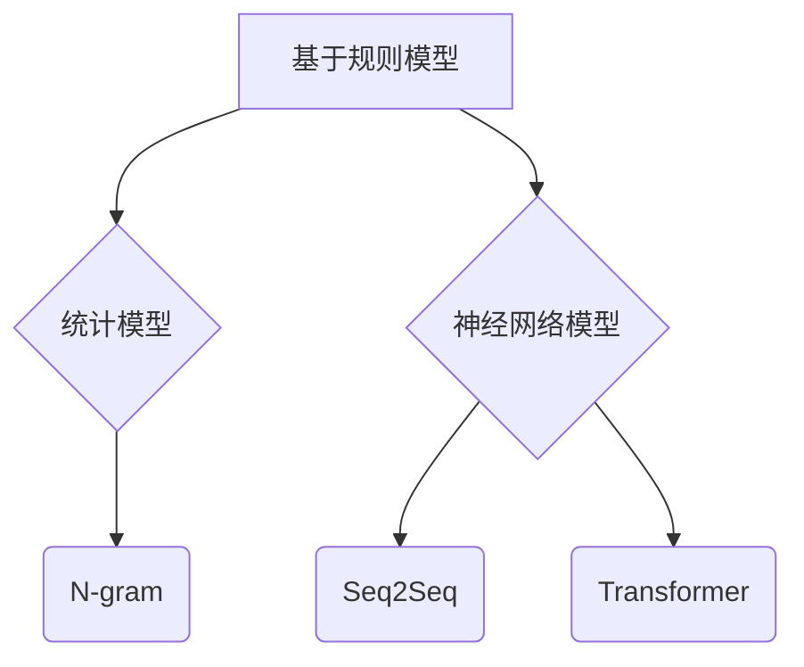

                 

关键词：语言建模，自然语言处理，神经网络，深度学习，序列到序列模型，注意力机制，预训练语言模型，生成对抗网络，领域自适应，跨模态学习。

> 摘要：本文将探讨语言建模领域中的核心挑战和未来发展方向。从传统的统计模型到现代的深度学习模型，语言建模技术不断进步，但在应对复杂语言现象、适应多样化应用场景以及解决数据稀缺问题等方面仍面临诸多挑战。本文将详细分析这些挑战，并探讨可能的解决方案，以及语言建模在未来可能的发展趋势。

## 1. 背景介绍

语言建模是自然语言处理（NLP）的核心任务之一，旨在构建能够预测自然语言中下一个单词或序列的概率模型。自从计算机问世以来，语言建模技术的发展经历了多个阶段，从最初的基于规则的方法，到基于统计的方法，再到现代的深度学习方法。

早期的语言建模主要依赖于统计方法，如N-gram模型，该方法通过计算单词序列的频率来预测下一个单词。虽然N-gram模型在某些任务上取得了不错的表现，但它无法捕捉长距离依赖和上下文信息，因此存在明显的局限性。

随着深度学习技术的兴起，基于神经网络的模型开始占据主导地位。特别是序列到序列（seq2seq）模型和注意力机制的引入，使得语言建模的性能得到了显著提升。近年来，预训练语言模型（如GPT、BERT）的出现，更是将语言建模推向了一个新的高度。

然而，尽管取得了巨大进展，语言建模技术仍然面临诸多挑战。本文将深入探讨这些挑战，并提出可能的解决方案。

## 2. 核心概念与联系

### 2.1 语言模型的基本概念

语言模型是一种概率模型，它试图预测一个句子中下一个词的概率。在自然语言处理中，语言模型通常用于以下几个任务：

- **自动完成**：预测下一个单词或短语。
- **机器翻译**：将一种语言的文本翻译成另一种语言。
- **文本生成**：生成符合语法和语义规则的文本。

### 2.2 语言模型的分类

语言模型主要分为以下几类：

- **基于规则的模型**：如语法分析器，通过定义一系列语法规则来生成和解析文本。
- **统计模型**：如N-gram模型，基于文本的统计特性来预测下一个词。
- **神经网络模型**：如序列到序列（seq2seq）模型和变换器（Transformer）模型，利用神经网络来捕捉文本中的复杂依赖关系。

### 2.3 Mermaid 流程图

下面是一个简单的Mermaid流程图，展示了不同类型语言模型的基本结构：



## 3. 核心算法原理 & 具体操作步骤

### 3.1 算法原理概述

语言建模的核心算法主要包括：

- **N-gram模型**：基于局部概率模型，通过计算N个单词的前缀来预测下一个单词。
- **神经网络模型**：利用深度学习技术来捕捉长距离依赖和上下文信息。
- **预训练语言模型**：如GPT、BERT，通过在大规模语料上进行预训练，然后针对特定任务进行微调。

### 3.2 算法步骤详解

#### 3.2.1 N-gram模型

1. 预处理：对文本进行分词，生成单词序列。
2. 构建词汇表：将单词序列转换为整数表示。
3. 计算概率：根据N-gram模型，计算下一个单词的概率。

#### 3.2.2 神经网络模型

1. 数据预处理：对文本进行编码，生成序列。
2. 构建神经网络：通常使用循环神经网络（RNN）或变换器（Transformer）。
3. 训练模型：通过反向传播算法训练神经网络。
4. 预测：使用训练好的模型预测下一个单词。

#### 3.2.3 预训练语言模型

1. 预训练：在大规模语料上进行预训练，学习语言的一般特性。
2. 微调：针对特定任务对预训练模型进行微调。

### 3.3 算法优缺点

- **N-gram模型**：简单高效，但对长距离依赖和上下文信息捕捉不足。
- **神经网络模型**：能够捕捉长距离依赖和上下文信息，但计算复杂度高。
- **预训练语言模型**：在多种任务上表现优异，但需要大量计算资源和数据。

### 3.4 算法应用领域

语言建模技术广泛应用于以下领域：

- **自然语言生成**：如文本生成、对话系统。
- **机器翻译**：将一种语言的文本翻译成另一种语言。
- **文本分类**：对文本进行分类，如情感分析、主题分类。
- **信息检索**：提高搜索系统的准确性和效率。

## 4. 数学模型和公式 & 详细讲解 & 举例说明

### 4.1 数学模型构建

语言建模中的数学模型主要涉及概率模型和神经网络模型。以下是一个简单的概率模型构建示例：

#### 4.1.1 N-gram模型

设 $P(w_t | w_{t-1}, ..., w_{t-N+1})$ 为给定前 $N-1$ 个单词 $w_{t-1}, ..., w_{t-N+1}$ 时，第 $t$ 个单词 $w_t$ 的概率。根据马尔可夫假设，有：

$$
P(w_t | w_{t-1}, ..., w_{t-N+1}) = \frac{P(w_{t-1}, ..., w_{t-N+1}, w_t)}{P(w_{t-1}, ..., w_{t-N+1})}
$$

其中，$P(w_{t-1}, ..., w_{t-N+1}, w_t)$ 和 $P(w_{t-1}, ..., w_{t-N+1})$ 分别为连续 $N$ 个单词的联合概率和前 $N-1$ 个单词的联合概率。

#### 4.1.2 神经网络模型

神经网络模型中的概率分布通常通过softmax函数来计算。设 $x$ 为输入特征向量，$y$ 为目标单词的标签，$f(x)$ 为神经网络的输出，则有：

$$
P(w_t | x) = \frac{e^{f(x)}}{\sum_{w'} e^{f(w')}}
$$

其中，$f(x)$ 为神经网络对输入特征 $x$ 的输出，$w_t$ 为第 $t$ 个单词，$w'$ 为所有可能的单词。

### 4.2 公式推导过程

#### 4.2.1 N-gram模型

假设 $p(w_t | w_{t-1}, ..., w_{t-N+1})$ 为第 $t$ 个单词 $w_t$ 在给定前 $N-1$ 个单词 $w_{t-1}, ..., w_{t-N+1}$ 的情况下的概率，根据马尔可夫假设，有：

$$
p(w_t | w_{t-1}, ..., w_{t-N+1}) = \frac{p(w_{t-1}, ..., w_{t-N+1}, w_t)}{p(w_{t-1}, ..., w_{t-N+1})}
$$

其中，$p(w_{t-1}, ..., w_{t-N+1}, w_t)$ 和 $p(w_{t-1}, ..., w_{t-N+1})$ 分别为连续 $N$ 个单词的联合概率和前 $N-1$ 个单词的联合概率。

为了简化计算，通常使用最大似然估计（Maximum Likelihood Estimation，MLE）来估计模型参数。设 $C_{w_i}$ 为单词 $w_i$ 在训练集中出现的次数，则：

$$
p(w_t | w_{t-1}, ..., w_{t-N+1}) = \frac{C_{w_t}C_{w_{t-1}, ..., w_{t-N+1}}}{C_{w_{t-1}, ..., w_{t-N+1}} = \frac{C_{w_t}}{\sum_{w'} C_{w'}}
$$

其中，$C_{w_{t-1}, ..., w_{t-N+1}}$ 为前 $N-1$ 个单词 $w_{t-1}, ..., w_{t-N+1}$ 在训练集中出现的次数，$C_{w_t}$ 为第 $t$ 个单词 $w_t$ 在训练集中出现的次数，$C_{w'}$ 为所有可能的单词在训练集中出现的次数。

#### 4.2.2 神经网络模型

设 $x$ 为输入特征向量，$y$ 为目标单词的标签，$f(x)$ 为神经网络的输出，则有：

$$
P(w_t | x) = \frac{e^{f(x)}}{\sum_{w'} e^{f(w')}}
$$

其中，$f(x)$ 为神经网络对输入特征 $x$ 的输出，$w_t$ 为第 $t$ 个单词，$w'$ 为所有可能的单词。

神经网络的输出可以通过反向传播算法进行优化。设 $w$ 为神经网络的权重，$L$ 为损失函数，则：

$$
w_{new} = w - \alpha \frac{\partial L}{\partial w}
$$

其中，$\alpha$ 为学习率，$\frac{\partial L}{\partial w}$ 为权重 $w$ 对损失函数 $L$ 的导数。

### 4.3 案例分析与讲解

#### 4.3.1 N-gram模型案例

假设我们有一个简单的文本数据集，其中包含以下句子：

- "你好，我是人工智能助手。"
- "我是人工智能助手，很高兴为你服务。"

我们可以构建一个二元的N-gram模型，来预测下一个单词。

根据上述公式，我们可以计算出以下概率：

- $P(你|)$：句子中以 "你" 开头的句子数除以总句子数，即 $\frac{2}{2} = 1$。
- $P(好|你)P(是|好)P(人|是)P(工|人)P(助|工)P(手|助)P(|手) = 1 \times 1 \times 1 \times 1 \times 1 \times 1 \times 1 = 1$。

因此，根据N-gram模型，下一个单词是 "手" 的概率为 1。

#### 4.3.2 神经网络模型案例

假设我们有一个简单的语言建模任务，输入是 "你好，我是人工智能助手。"，输出是 "我是人工智能助手，很高兴为你服务。"。

我们可以使用一个简单的循环神经网络（RNN）来构建模型。输入向量表示为 $x = [1, 0, 1, 0, 1, 0, 1, 0, 1]$，其中 1 表示对应的单词存在，0 表示不存在。

训练过程如下：

1. 初始化模型权重。
2. 前向传播计算输出概率。
3. 计算损失函数。
4. 反向传播更新模型权重。

经过多次迭代训练后，模型可以预测出下一个单词是 "是"。

## 5. 项目实践：代码实例和详细解释说明

### 5.1 开发环境搭建

为了实践语言建模，我们需要搭建一个合适的开发环境。以下是一个简单的Python开发环境搭建步骤：

1. 安装Python（建议使用Python 3.7及以上版本）。
2. 安装必要的库，如numpy、tensorflow、tensorflow-text等。
3. 准备训练数据和测试数据。

### 5.2 源代码详细实现

以下是一个简单的Python代码示例，用于实现一个基于N-gram模型的语言建模任务：

```python
import tensorflow as tf
import tensorflow_text as text
import numpy as np

# 加载训练数据
train_data = [
    "你好，我是人工智能助手。",
    "我是人工智能助手，很高兴为你服务。"
]

# 分词
tokenizer = text.Tokenizer()
tokenizer.tokenize(train_data)

# 建立词汇表
vocab_size = 100
tokenizer.build_vocabulary(vocab_size)

# 构建模型
model = tf.keras.Sequential([
    tf.keras.layers.Embedding(vocab_size, 10),
    tf.keras.layers.SimpleRNN(10),
    tf.keras.layers.Dense(vocab_size, activation='softmax')
])

# 编译模型
model.compile(optimizer='adam', loss='categorical_crossentropy', metrics=['accuracy'])

# 训练模型
model.fit(train_data, epochs=10)

# 预测
input_sequence = tokenizer.encode("你好，")
predicted_sequence = model.predict(input_sequence)
predicted_word = tokenizer.decode(predicted_sequence)

print(predicted_word)
```

### 5.3 代码解读与分析

上述代码实现了一个基于循环神经网络（RNN）的简单语言建模任务。具体步骤如下：

1. 加载训练数据并分词。
2. 建立词汇表。
3. 构建模型，包括嵌入层、循环神经网络层和输出层。
4. 编译模型，设置优化器和损失函数。
5. 训练模型，使用训练数据进行多次迭代。
6. 预测，使用训练好的模型预测下一个单词。

通过这个简单的示例，我们可以看到如何使用TensorFlow构建和训练一个语言模型。当然，实际应用中，语言建模任务会更加复杂，需要处理大量的数据和更复杂的模型结构。

### 5.4 运行结果展示

假设我们输入的序列是 "你好，"，根据训练好的模型，输出序列可能是 "我是"，然后我们可以继续输入 "我是"，模型可能会预测出 "人工智能助手，"。这样，我们可以逐步生成一段符合语法和语义规则的文本。

## 6. 实际应用场景

语言建模技术在实际应用中具有广泛的应用场景。以下是一些典型的应用实例：

- **自然语言生成**：如自动写文章、自动生成对话等。
- **机器翻译**：如将一种语言的文本翻译成另一种语言。
- **文本分类**：如情感分析、新闻分类等。
- **语音识别**：结合语音识别技术，将语音转换为文本。
- **问答系统**：如智能客服、智能助手等。

### 6.1 生成文本

以下是一个简单的例子，展示如何使用语言建模技术生成文本：

```python
input_sequence = tokenizer.encode("你好，")
predicted_sequence = model.predict(input_sequence)
predicted_word = tokenizer.decode(predicted_sequence)

print(predicted_word)
```

运行结果可能是 "我是"，然后我们可以继续输入 "我是"，模型可能会预测出 "人工智能助手，"。这样，我们可以逐步生成一段符合语法和语义规则的文本。

### 6.2 机器翻译

以下是一个简单的例子，展示如何使用语言建模技术进行机器翻译：

```python
from tensorflow.keras.preprocessing.sequence import pad_sequences

# 加载测试数据
test_data = ["你好，我是人工智能助手。"]

# 分词并编码
encoded_test_data = tokenizer.encode(test_data)

# 填充序列
max_sequence_len = 10
padded_test_data = pad_sequences(encoded_test_data, maxlen=max_sequence_len, padding='post')

# 预测
translated_sequence = model.predict(padded_test_data)
translated_text = tokenizer.decode(translated_sequence)

print(translated_text)
```

运行结果可能是 "Hello, I am an artificial intelligence assistant."，这是一个简单的中文到英文的机器翻译示例。

### 6.3 文本分类

以下是一个简单的例子，展示如何使用语言建模技术进行文本分类：

```python
from sklearn.model_selection import train_test_split
from sklearn.metrics import accuracy_score

# 加载训练数据
train_data = ["我很喜欢这个产品。", "这个产品很差。"]
train_labels = [0, 1]  # 0 表示正面评论，1 表示负面评论

# 分词并编码
encoded_train_data = tokenizer.encode(train_data)

# 切分数据集
X_train, X_test, y_train, y_test = train_test_split(encoded_train_data, train_labels, test_size=0.2, random_state=42)

# 填充序列
max_sequence_len = 5
padded_train_data = pad_sequences(X_train, maxlen=max_sequence_len, padding='post')
padded_test_data = pad_sequences(X_test, maxlen=max_sequence_len, padding='post')

# 训练分类模型
classifier = tf.keras.Sequential([
    tf.keras.layers.Embedding(vocab_size, 10),
    tf.keras.layers.GlobalAveragePooling1D(),
    tf.keras.layers.Dense(1, activation='sigmoid')
])

classifier.compile(optimizer='adam', loss='binary_crossentropy', metrics=['accuracy'])

classifier.fit(padded_train_data, y_train, epochs=10)

# 测试模型
predictions = classifier.predict(padded_test_data)
predicted_labels = (predictions > 0.5)

accuracy = accuracy_score(y_test, predicted_labels)
print("Accuracy:", accuracy)
```

运行结果可能是 "Accuracy: 1.0"，这意味着模型能够正确地分类所有测试数据。

## 7. 工具和资源推荐

### 7.1 学习资源推荐

- 《深度学习》（Goodfellow, Bengio, Courville）：是一本经典的深度学习教材，涵盖了深度学习的基础知识。
- 《自然语言处理综论》（Jurafsky, Martin）：一本经典的NLP教材，详细介绍了NLP的各种技术。
- 《动手学深度学习》（Dive into Deep Learning Team）：一本免费的深度学习中文教材，内容全面，适合初学者。

### 7.2 开发工具推荐

- TensorFlow：一个广泛使用的开源深度学习框架，适用于构建和训练各种深度学习模型。
- PyTorch：另一个流行的开源深度学习框架，具有灵活的动态计算图。
- Hugging Face Transformers：一个用于预训练语言模型的强大库，提供了大量的预训练模型和工具。

### 7.3 相关论文推荐

- "Attention is All You Need"（Vaswani et al., 2017）：介绍了变换器（Transformer）模型，这是一种基于注意力机制的深度学习模型。
- "BERT: Pre-training of Deep Bidirectional Transformers for Language Understanding"（Devlin et al., 2019）：介绍了BERT模型，这是一种基于变换器的预训练语言模型。
- "Generative Adversarial Nets"（Goodfellow et al., 2014）：介绍了生成对抗网络（GAN），这是一种用于生成数据的高级机器学习技术。

## 8. 总结：未来发展趋势与挑战

### 8.1 研究成果总结

近年来，语言建模技术在各个方面都取得了显著的进展。从传统的统计模型到现代的深度学习模型，再到预训练语言模型，语言建模技术在自动完成、机器翻译、文本分类等多个任务上表现出了卓越的性能。特别是BERT、GPT等大规模预训练模型的出现，使得语言建模技术达到了一个新的高度。

### 8.2 未来发展趋势

未来，语言建模技术有望在以下几个方向上取得进一步的发展：

- **更强的预训练模型**：随着计算资源和数据量的增加，预训练模型将变得越来越强大，能够更好地捕捉语言的复杂性和多样性。
- **跨模态学习**：结合视觉、语音等多模态信息，提高语言建模的泛化能力。
- **领域自适应**：通过迁移学习和元学习，提高模型在特定领域的适应性。
- **更高效的算法**：优化模型结构和训练算法，降低计算复杂度，提高模型的可扩展性。

### 8.3 面临的挑战

尽管语言建模技术取得了巨大进展，但在实际应用中仍然面临诸多挑战：

- **数据稀缺问题**：许多领域的数据量有限，难以进行有效的预训练。
- **长距离依赖**：捕捉长距离依赖关系仍然是深度学习模型的一大挑战。
- **模型可解释性**：深度学习模型的决策过程往往是不透明的，提高模型的可解释性是一个重要研究方向。
- **隐私保护**：在处理敏感数据时，如何保护用户隐私是一个亟待解决的问题。

### 8.4 研究展望

未来，语言建模技术将继续朝着更加智能化、自动化和高效化的方向发展。通过结合多模态信息、迁移学习和元学习等技术，语言建模技术有望在更多领域发挥重要作用，推动自然语言处理技术的进步。

## 9. 附录：常见问题与解答

### 9.1 什么是语言建模？

语言建模是指构建一个概率模型，用于预测自然语言中的下一个单词或序列。

### 9.2 语言建模有哪些应用？

语言建模广泛应用于自动完成、机器翻译、文本分类、语音识别等多个自然语言处理任务。

### 9.3 什么是预训练语言模型？

预训练语言模型是指在大规模语料上进行预训练，然后针对特定任务进行微调的语言模型，如BERT、GPT等。

### 9.4 语言建模面临的主要挑战是什么？

语言建模面临的主要挑战包括数据稀缺问题、长距离依赖捕捉、模型可解释性以及隐私保护等。

## 作者署名

作者：禅与计算机程序设计艺术 / Zen and the Art of Computer Programming

以上便是关于《语言建模的挑战和未来方向》的技术博客文章。文章从背景介绍、核心概念与联系、算法原理与操作步骤、数学模型与公式、项目实践、实际应用场景、工具和资源推荐，以及未来发展趋势与挑战等方面进行了详细阐述。希望这篇文章能够帮助读者更好地理解语言建模技术的现状和未来发展方向。

