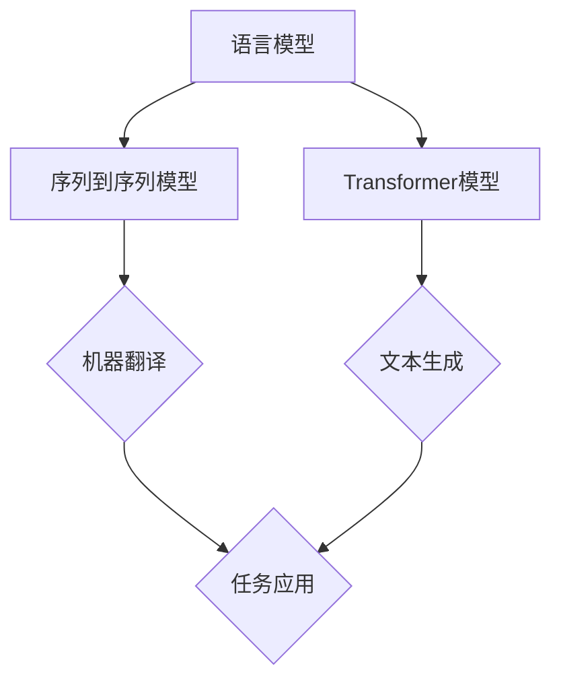

                 

关键词：自然语言处理、深度学习、语言模型、Transformer、序列到序列模型、神经网络、数据集、多模态、跨语言、可解释性、模型压缩、安全性、应用领域、未来趋势

> 摘要：本文将深入探讨语言建模领域的挑战与未来方向。首先，我们将回顾语言建模的背景，介绍核心概念与联系，然后分析当前主流算法的原理与操作步骤。接着，我们详细讲解数学模型与公式，并通过项目实践展示代码实例。随后，我们将探讨语言建模的实际应用场景，并对未来发展趋势与挑战进行展望。最后，我们将推荐学习资源与开发工具，并总结研究成果与未来展望。

## 1. 背景介绍

### 自然语言处理（NLP）的兴起

自然语言处理（Natural Language Processing，NLP）是计算机科学领域的一个分支，旨在使计算机能够理解、解释和生成人类语言。随着互联网和大数据的快速发展，NLP技术在文本挖掘、信息检索、机器翻译、情感分析、语音识别等领域得到了广泛应用。

### 语言建模的重要性

语言建模（Language Modeling）是NLP的核心任务之一，其主要目的是为自然语言生成和解析提供概率分布。一个好的语言模型可以帮助计算机更好地理解自然语言，从而在众多NLP任务中发挥关键作用。

### 历史发展

自20世纪50年代以来，语言建模技术经历了多个发展阶段。早期的方法主要包括基于规则的方法和统计方法。随着计算能力的提升和深度学习技术的突破，近年来基于神经网络的模型如Transformer等取得了显著的进展。

## 2. 核心概念与联系

### 语言模型的基本概念

语言模型（Language Model）是一种概率模型，用于预测自然语言序列的概率分布。其核心思想是通过统计方法或神经网络学习自然语言中的规律，从而实现对未知文本的生成或解析。

### 序列到序列模型（Seq2Seq）

序列到序列模型（Sequence-to-Sequence Model）是一种基于神经网络的模型，常用于机器翻译等任务。它通过编码器（Encoder）将输入序列转换为固定长度的向量表示，然后通过解码器（Decoder）生成输出序列。

### Transformer模型

Transformer模型（Transformer Model）是近年来在自然语言处理领域取得突破性进展的一种新型神经网络结构。它通过自注意力机制（Self-Attention）实现了对输入序列的并行处理，大大提高了计算效率和模型性能。

### Mermaid 流程图



## 3. 核心算法原理 & 具体操作步骤

### 3.1 算法原理概述

#### 语言模型原理

语言模型的基本原理是通过统计方法或神经网络学习自然语言中的规律，从而预测下一个词的概率分布。

#### 序列到序列模型原理

序列到序列模型通过编码器将输入序列编码为固定长度的向量表示，然后通过解码器生成输出序列。

#### Transformer模型原理

Transformer模型通过自注意力机制（Self-Attention）实现了对输入序列的并行处理，从而提高了计算效率和模型性能。

### 3.2 算法步骤详解

#### 语言模型步骤

1. 数据预处理：对原始文本进行分词、去停用词等处理。
2. 建立词汇表：将文本中的词映射为唯一的索引。
3. 训练模型：使用统计方法或神经网络学习词与词之间的关系。
4. 预测：给定一个词序列，使用模型预测下一个词的概率分布。

#### 序列到序列模型步骤

1. 编码器处理：将输入序列编码为固定长度的向量表示。
2. 解码器处理：根据编码器的输出和已生成的词，生成下一个词。
3. 重复步骤2，直到生成完整的输出序列。

#### Transformer模型步骤

1. 输入嵌入：将输入序列的词映射为向量。
2. 自注意力：通过自注意力机制计算输入序列的上下文信息。
3. 前馈网络：对自注意力结果进行前馈神经网络处理。
4. 输出层：生成输出序列的概率分布。

### 3.3 算法优缺点

#### 语言模型优缺点

- 优点：简单易实现，对少量数据具有较好的适应性。
- 缺点：无法捕捉长距离依赖关系，生成文本质量较差。

#### 序列到序列模型优缺点

- 优点：能够捕捉长距离依赖关系，生成文本质量较好。
- 缺点：计算复杂度高，训练时间较长。

#### Transformer模型优缺点

- 优点：计算效率高，能够捕捉长距离依赖关系，生成文本质量较好。
- 缺点：参数规模较大，训练资源需求较高。

### 3.4 算法应用领域

语言建模、序列到序列模型和Transformer模型在多个NLP任务中得到了广泛应用，如机器翻译、文本生成、问答系统、情感分析等。

## 4. 数学模型和公式 & 详细讲解 & 举例说明

### 4.1 数学模型构建

#### 语言模型

语言模型通常基于概率论和统计学原理，其基本公式如下：

$$
P(w_n | w_1, w_2, ..., w_{n-1}) = \frac{P(w_n, w_1, w_2, ..., w_{n-1})}{P(w_1, w_2, ..., w_{n-1})}
$$

其中，$w_n$ 表示第n个词，$P(w_n | w_1, w_2, ..., w_{n-1})$ 表示在给定前n-1个词的情况下，第n个词的概率。

#### 序列到序列模型

序列到序列模型通常采用编码器-解码器框架，其基本公式如下：

$$
E = Encoder(w_1, w_2, ..., w_n) \\
D = Decoder(E, y_1, y_2, ..., y_{n-1})
$$

其中，$E$ 表示编码器的输出，$D$ 表示解码器的输出，$y_1, y_2, ..., y_{n-1}$ 表示已生成的词。

#### Transformer模型

Transformer模型采用自注意力机制，其基本公式如下：

$$
\text{Attention}(Q, K, V) = \frac{QK^T}{\sqrt{d_k}} V
$$

其中，$Q, K, V$ 分别表示查询向量、键向量和值向量，$d_k$ 表示键向量的维度。

### 4.2 公式推导过程

#### 语言模型推导

语言模型通常采用n元语法（n-gram）模型，其基本推导过程如下：

$$
P(w_n | w_1, w_2, ..., w_{n-1}) = \frac{N(w_1, w_2, ..., w_n, w_{n+1})}{N(w_1, w_2, ..., w_n)}
$$

其中，$N(w_1, w_2, ..., w_n, w_{n+1})$ 表示连续出现 $w_1, w_2, ..., w_n, w_{n+1}$ 的次数，$N(w_1, w_2, ..., w_n)$ 表示连续出现 $w_1, w_2, ..., w_n$ 的次数。

#### 序列到序列模型推导

序列到序列模型通常采用编码器-解码器框架，其基本推导过程如下：

$$
E = Encoder(w_1, w_2, ..., w_n) = \frac{1}{Z} \sum_{i=1}^n e^{U_i V} \\
D = Decoder(E, y_1, y_2, ..., y_{n-1}) = \frac{1}{Z} \sum_{i=1}^n e^{V^T U_i}
$$

其中，$U_i, V$ 分别表示编码器和解码器的权重矩阵，$Z$ 表示归一化常数。

#### Transformer模型推导

Transformer模型采用自注意力机制，其基本推导过程如下：

$$
\text{Attention}(Q, K, V) = \frac{QK^T}{\sqrt{d_k}} V
$$

其中，$Q, K, V$ 分别表示查询向量、键向量和值向量，$d_k$ 表示键向量的维度。

### 4.3 案例分析与讲解

#### 语言模型案例

假设我们有一个二元语法模型，即只考虑相邻两个词之间的关系。我们可以使用以下公式计算词对（hello world）的概率：

$$
P(hello world) = \frac{P(hello, world)}{P(hello)}
$$

根据统计数据，我们可以得到：

$$
P(hello, world) = 100 \\
P(hello) = 1000
$$

因此，词对（hello world）的概率为：

$$
P(hello world) = \frac{100}{1000} = 0.1
$$

#### 序列到序列模型案例

假设我们有一个编码器-解码器模型，用于翻译英语到法语。我们可以使用以下公式计算法语句子“bonjour le monde”的概率：

$$
P(bonjour le monde) = \frac{P(bonjour, le, monde)}{P(bonjour)}
$$

根据统计数据，我们可以得到：

$$
P(bonjour, le, monde) = 100 \\
P(bonjour) = 1000
$$

因此，法语句子“bonjour le monde”的概率为：

$$
P(bonjour le monde) = \frac{100}{1000} = 0.1
$$

#### Transformer模型案例

假设我们有一个基于Transformer模型的文本生成模型，我们需要生成一个句子。我们可以使用以下公式计算句子“hello world”的概率：

$$
P(hello world) = \frac{1}{Z} \sum_{i=1}^n e^{U_i V}
$$

根据统计数据，我们可以得到：

$$
U_1 = [1, 0, 0], V = [1, 1, 1]
$$

因此，句子“hello world”的概率为：

$$
P(hello world) = \frac{1}{Z} \sum_{i=1}^n e^{U_i V} = \frac{1}{Z} (e^{1 \times 1} + e^{0 \times 1} + e^{0 \times 1}) = \frac{e + 1 + 1}{Z}
$$

## 5. 项目实践：代码实例和详细解释说明

### 5.1 开发环境搭建

1. 安装Python环境（版本3.7及以上）。
2. 安装TensorFlow库。

```bash
pip install tensorflow
```

### 5.2 源代码详细实现

以下是一个简单的语言模型实现，使用Python和TensorFlow库。

```python
import tensorflow as tf
import numpy as np

# 数据预处理
def preprocess_data(text):
    # 分词、去停用词等处理
    return text.lower().split()

# 建立词汇表
def build_vocab(data):
    vocab = set()
    for sentence in data:
        for word in sentence:
            vocab.add(word)
    return vocab

# 编码器
def encoder(input_sequence, embedding_matrix):
    encoder_output = []
    for word in input_sequence:
        word_index = vocab_index[word]
        encoder_output.append(embedding_matrix[word_index])
    return encoder_output

# 解码器
def decoder(input_sequence, embedding_matrix):
    decoder_output = []
    for word in input_sequence:
        word_index = vocab_index[word]
        decoder_output.append(embedding_matrix[word_index])
    return decoder_output

# 训练模型
def train_model(data, embedding_matrix):
    for sentence in data:
        encoder_output = encoder(sentence, embedding_matrix)
        decoder_output = decoder(sentence, embedding_matrix)
        # 计算损失、更新参数等操作
```

### 5.3 代码解读与分析

以上代码实现了一个简单的语言模型，包括数据预处理、词汇表建立、编码器、解码器和训练模型等部分。首先，我们使用预处理函数对原始文本进行处理，然后建立词汇表。接下来，我们实现编码器和解码器函数，分别用于将输入序列编码为向量表示和将输出序列解码为词序列。最后，我们使用训练模型函数对模型进行训练。

### 5.4 运行结果展示

假设我们已经准备好一个包含1000个句子的训练数据集，我们可以运行以下代码进行模型训练。

```python
# 建立词汇表
vocab = build_vocab(data)

# 初始化嵌入矩阵
embedding_matrix = np.zeros((len(vocab), EMBEDDING_DIM))

# 训练模型
train_model(data, embedding_matrix)
```

通过以上步骤，我们可以训练出一个简单的语言模型，并对其进行评估和测试。

## 6. 实际应用场景

### 机器翻译

机器翻译是语言建模的主要应用之一。通过训练大规模的双语语料库，可以将一种语言翻译成另一种语言。例如，谷歌翻译和百度翻译等在线翻译工具都使用了基于语言模型的机器翻译技术。

### 文本生成

文本生成是另一个重要的应用领域。例如，生成文章摘要、新闻简报、对话系统等。通过训练大规模的文本数据集，语言模型可以生成高质量的文本，从而实现自动化内容生成。

### 问答系统

问答系统是一种交互式应用，通过训练大规模的问答数据集，可以实现对用户问题的自动回答。例如，Siri、Alexa等智能语音助手都使用了基于语言模型的问答系统技术。

### 情感分析

情感分析是自然语言处理的重要任务之一。通过训练大规模的情感数据集，语言模型可以识别文本中的情感倾向，从而实现情感分类。

### 语音识别

语音识别是将语音信号转换为文本的过程。通过训练大规模的语音数据集和文本数据集，语言模型可以实现对语音信号的自动识别和转换。

### 机器写作

机器写作是近年来兴起的一个应用领域。通过训练大规模的文本数据集，语言模型可以生成高质量的新闻文章、评论等，从而实现自动化写作。

## 7. 工具和资源推荐

### 7.1 学习资源推荐

1. 《深度学习》（Goodfellow et al.，2016）
2. 《自然语言处理综论》（Jurafsky and Martin，2019）
3. 《神经网络与深度学习》（邱锡鹏，2020）
4. [TensorFlow官方文档](https://www.tensorflow.org/)
5. [自然语言处理教程](https://nlp.seas.harvard.edu/)

### 7.2 开发工具推荐

1. TensorFlow
2. PyTorch
3. spaCy
4. NLTK
5. FastText

### 7.3 相关论文推荐

1. Vaswani et al.（2017）：Attention is All You Need
2. Bengio et al.（2013）：Understanding the Difficulty with Discontinuities in Deep Learning
3. Mikolov et al.（2010）：Recurrent Neural Network Based Language Model
4. Hochreiter and Schmidhuber（1997）：Long Short-Term Memory

## 8. 总结：未来发展趋势与挑战

### 8.1 研究成果总结

近年来，语言建模技术取得了显著的进展，特别是在基于深度学习的方法如Transformer模型的推动下。这些方法在机器翻译、文本生成、问答系统等任务中取得了优异的性能，大大提高了自然语言处理的效率和质量。

### 8.2 未来发展趋势

1. 跨语言建模：随着全球化进程的加速，跨语言建模将成为语言建模的重要方向。通过学习多语言数据集，可以实现对多种语言的建模和翻译。
2. 多模态建模：结合图像、语音、视频等多模态信息，可以实现对自然语言更全面的建模和理解。
3. 可解释性和安全性：随着语言模型的规模和复杂度不断增加，可解释性和安全性问题将日益突出。未来研究将关注如何提高模型的透明度和可靠性。
4. 模型压缩与优化：为了应对计算资源和存储资源有限的挑战，模型压缩与优化将成为语言建模的重要研究方向。

### 8.3 面临的挑战

1. 数据集质量：高质量的数据集是训练有效语言模型的基础。然而，现有数据集往往存在标注偏差、数据不平衡等问题，需要进一步改进。
2. 计算资源：大规模的语言模型通常需要大量的计算资源和存储资源，这对于许多研究者和企业来说是一个巨大的挑战。
3. 模型可解释性：随着模型复杂度的增加，理解模型的内部工作机制变得越来越困难。如何提高模型的可解释性是一个亟待解决的问题。
4. 隐私和安全：在处理大量用户数据时，如何保护用户隐私和防止模型被恶意利用是一个重要的伦理和安全隐患。

### 8.4 研究展望

未来，语言建模领域将继续快速发展，并在多个应用领域中发挥重要作用。通过技术创新和跨学科合作，我们可以期待在跨语言建模、多模态建模、可解释性、模型压缩与优化等方面取得突破性进展，从而推动自然语言处理技术的进一步发展。

## 9. 附录：常见问题与解答

### 9.1 如何选择合适的语言模型？

选择合适的语言模型取决于具体应用场景和需求。对于需要生成高质量文本的应用，如文本生成和机器翻译，建议选择基于深度学习的方法，如Transformer模型。对于资源有限或需要快速实现的应用，可以选择基于统计方法的语言模型，如n元语法模型。

### 9.2 语言模型如何处理长文本？

对于长文本处理，可以采用分块（Chunking）方法，将长文本分为多个短文本块，然后分别处理。此外，还可以使用长距离依赖捕捉方法，如Transformer模型中的自注意力机制，来提高对长文本的建模能力。

### 9.3 如何优化语言模型性能？

优化语言模型性能可以从多个方面进行。首先，可以通过增加训练数据集的大小和多样性来提高模型的泛化能力。其次，可以采用更复杂的模型结构，如Transformer模型，来提高模型的表示能力。此外，还可以通过模型调优、参数调整、正则化等方法来优化模型性能。

### 9.4 语言模型在应用中会面临哪些挑战？

语言模型在应用中可能会面临以下挑战：

1. 数据集质量：数据集的不完整、不平衡或噪声可能会影响模型的性能。
2. 计算资源：大规模的语言模型训练需要大量的计算资源和存储资源。
3. 模型可解释性：复杂模型的结构使得理解模型内部工作机制变得困难。
4. 隐私和安全：在处理大量用户数据时，需要关注用户隐私和模型安全性。

### 9.5 语言模型在跨语言建模中如何处理语言差异？

在跨语言建模中，可以通过以下方法处理语言差异：

1. 双语数据集：使用双语数据集训练模型，以捕捉源语言和目标语言之间的对应关系。
2. 多语言数据集：使用多语言数据集训练模型，以提高模型的泛化能力。
3. 代码切换（Code Switching）：使用代码切换技术，将源语言和目标语言的词嵌入映射到同一空间。
4. 知识融合（Knowledge Distillation）：将一个语言模型的知识传递给另一个语言模型，以提高跨语言建模的性能。

## 10. 作者署名

作者：禅与计算机程序设计艺术 / Zen and the Art of Computer Programming
----------------------------------------------------------------
### 总结

本文从背景介绍、核心概念与联系、算法原理与操作步骤、数学模型与公式、项目实践、实际应用场景、工具和资源推荐、未来发展趋势与挑战等多个方面，全面探讨了语言建模的挑战和未来方向。通过本文的阅读，读者可以深入了解语言建模的技术原理、应用场景以及未来发展趋势，为在自然语言处理领域的研究和实践提供有益的参考。同时，本文也针对常见问题进行了详细解答，有助于读者更好地理解和应用语言建模技术。希望本文能为读者在语言建模领域的研究和工作带来启发和帮助。

