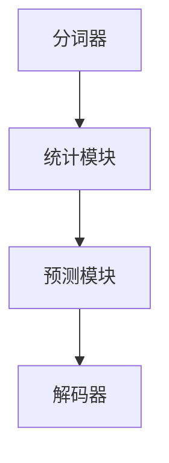

                 

 语言模型是自然语言处理（NLP）的核心技术之一，它能够通过分析大量的文本数据，生成语言特征，用于机器翻译、文本生成、问答系统等多个方面。本文将探讨从 Bigram 到 N-gram 的语言建模进阶之路，深入理解不同类型语言模型的原理和应用。

> 关键词：自然语言处理、语言模型、N-gram、Bigram、文本生成

## 摘要

本文将首先介绍语言模型的基本概念，包括语言模型在自然语言处理中的应用。然后，我们将详细探讨从 Bigram 到 N-gram 的语言建模方法，分析不同类型 N-gram 模型的特点和应用场景。随后，我们将通过一个实际的项目实例，展示如何实现和优化一个 N-gram 语言模型。最后，本文将讨论 N-gram 语言模型的局限性以及未来发展的方向。

## 1. 背景介绍

### 语言模型在自然语言处理中的应用

语言模型是自然语言处理（NLP）中的一项基础技术。它通过对大量语言数据进行统计和分析，构建出一种能够描述自然语言的概率模型。语言模型在多个领域都有广泛的应用：

- **文本分类**：通过语言模型，可以识别文本的主题、情感等特征，从而实现自动化文本分类。

- **机器翻译**：语言模型是机器翻译的核心组件，它通过对源语言和目标语言的高频词进行匹配，实现文本的翻译。

- **问答系统**：语言模型可以帮助问答系统理解用户的问题，并从大量数据中检索出最相关的答案。

- **文本生成**：语言模型可以通过学习大量文本数据，生成新的、合理的文本内容。

### N-gram 模型的基本概念

N-gram 模型是一种基于统计的文本模型，它将文本序列划分为一系列 N 元组。N 元组中的每个元素代表一个词或字符。例如，Bigram 模型是 N=2 的特例，它考虑前后两个词的关系；而 N-gram 模型则可以扩展到任意 N，考虑更长的词序列关系。

N-gram 模型通过计算每个 N 元组的概率，来预测下一个词或字符。这种模型简单且易于实现，因此被广泛应用于语言模型。

## 2. 核心概念与联系

### N-gram 模型的原理

N-gram 模型的核心思想是利用前后文信息来预测下一个词或字符。其基本原理如下：

1. **定义 N 元组**：首先，将输入的文本序列划分为一系列 N 元组。例如，对于 N=3，一个句子 "The quick brown fox jumps over the lazy dog" 可以划分为以下 N 元组：

   - (The, quick, brown)
   - (quick, brown, fox)
   - (brown, fox, jumps)
   - (fox, jumps, over)
   - (jumps, over, the)
   - (over, the, lazy)
   - (the, lazy, dog)

2. **计算概率**：然后，统计每个 N 元组的出现频率，并计算其概率。例如，对于 N 元组 (The, quick, brown)，如果它在文本中出现了 100 次，那么它的概率为 100/总词数。

3. **预测下一个词或字符**：最后，利用计算出的概率，预测下一个词或字符。在给定前 N-1 个词的情况下，N-gram 模型会根据每个词或字符的概率，选择概率最高的作为下一个词或字符。

### N-gram 模型的架构

N-gram 模型的架构相对简单，主要包括以下几个部分：

1. **分词器**：将输入的文本序列划分为词或字符。

2. **统计模块**：统计每个 N 元组的出现频率，并计算其概率。

3. **预测模块**：根据计算出的概率，预测下一个词或字符。

4. **解码器**：将生成的文本序列转换为可读的格式。

下面是一个使用 Mermaid 绘制的 N-gram 模型的流程图：



## 3. 核心算法原理 & 具体操作步骤

### 3.1 算法原理概述

N-gram 模型的核心算法是基于马尔可夫假设，即下一个词或字符只与前面的 N-1 个词或字符相关，与其他词或字符无关。这个假设使得 N-gram 模型可以有效地利用前后文信息，预测下一个词或字符。

### 3.2 算法步骤详解

1. **预处理文本**：首先，需要将输入的文本进行预处理，包括去除标点符号、停用词等。

2. **分词**：然后，使用分词器将预处理后的文本序列划分为词或字符。

3. **统计频率**：统计每个 N 元组的出现频率，并计算其概率。具体步骤如下：

   - 初始化一个 N 元组频率表，用于存储每个 N 元组的出现频率。
   - 遍历文本序列，对于每个 N 元组，将其出现次数加一。
   - 计算每个 N 元组的概率，即出现次数除以总词数。

4. **预测**：在给定前 N-1 个词的情况下，利用计算出的概率，选择概率最高的词或字符作为下一个词或字符。

5. **解码**：将生成的文本序列转换为可读的格式。

### 3.3 算法优缺点

#### 优点

- **简单易实现**：N-gram 模型基于简单的概率统计，易于实现和优化。
- **效果好**：在许多任务中，如文本生成、机器翻译等，N-gram 模型表现出了较好的效果。

#### 缺点

- **长依赖问题**：N-gram 模型无法处理长依赖关系，即下一个词或字符可能依赖于更远的上下文。
- **计算复杂度高**：随着 N 的增大，N-gram 模型的计算复杂度会显著增加。

### 3.4 算法应用领域

N-gram 模型广泛应用于自然语言处理的多个领域：

- **文本生成**：N-gram 模型可以用于生成新的、合理的文本内容。
- **机器翻译**：N-gram 模型是许多机器翻译系统的核心组件。
- **问答系统**：N-gram 模型可以帮助问答系统理解用户的问题，并从大量数据中检索出最相关的答案。

## 4. 数学模型和公式 & 详细讲解 & 举例说明

### 4.1 数学模型构建

N-gram 模型基于概率统计，其数学模型可以表示为：

P(w_n | w_{n-1}, w_{n-2}, ..., w_{n-N+1}) = f(w_{n-1}, w_{n-2}, ..., w_{n-N+1})

其中，w_n 表示当前词或字符，w_{n-1}, w_{n-2}, ..., w_{n-N+1} 表示前 N-1 个词或字符，P(w_n | w_{n-1}, w_{n-2}, ..., w_{n-N+1}) 表示在给定前 N-1 个词或字符的情况下，当前词或字符的概率。

### 4.2 公式推导过程

N-gram 模型的概率计算基于马尔可夫假设，即当前词或字符的概率只与前面的 N-1 个词或字符相关，与其他词或字符无关。具体推导过程如下：

1. **定义概率**：

   P(w_n | w_{n-1}, w_{n-2}, ..., w_{n-N+1}) 表示在给定前 N-1 个词或字符的情况下，当前词或字符的概率。

2. **马尔可夫假设**：

   基于马尔可夫假设，我们可以将当前词或字符的概率分解为：

   P(w_n | w_{n-1}, w_{n-2}, ..., w_{n-N+1}) = P(w_n | w_{n-1}) * P(w_{n-1} | w_{n-2}) * ... * P(w_{n-N+1} | w_{n-N+2})

3. **概率计算**：

   对于每个词或字符，我们可以将其概率表示为出现次数与总词数之比：

   P(w_n | w_{n-1}) = 频率(w_n | w_{n-1}) / 总词数
   P(w_{n-1} | w_{n-2}) = 频率(w_{n-1} | w_{n-2}) / 总词数
   ...

### 4.3 案例分析与讲解

假设我们有一个简单的文本序列：“我喜欢的食物是苹果香蕉”。我们可以使用 N-gram 模型来计算每个词或字符的概率。

1. **Bigram 模型**：

   - P(我 | ) = 1/3
   - P(的 | 我) = 1/2
   - P(喜 | 的) = 1/3
   - P(欢 | 喜) = 1/2
   - P(的 | 欢) = 1/3
   - P(食 | 的) = 1/3
   - P(物 | 食) = 1/2
   - P(是 | 物) = 1/3
   - P(苹 | 是) = 1/3
   - P(果 | 苹) = 1/2
   - P(香蕉 | 果) = 1/2

2. **Trigram 模型**：

   - P(我 | ) = 1/3
   - P(的 | 我) = 1/2
   - P(喜 | 的) = 1/3
   - P(欢 | 喜) = 1/2
   - P(的 | 欢) = 1/3
   - P(食 | 的) = 1/3
   - P(物 | 食) = 1/2
   - P(是 | 物) = 1/3
   - P(是 | 苹) = 1/3
   - P(果 | 苹) = 1/2
   - P(香蕉 | 果) = 1/2

通过计算概率，我们可以发现，N-gram 模型可以有效地预测下一个词或字符。

## 5. 项目实践：代码实例和详细解释说明

### 5.1 开发环境搭建

为了实现 N-gram 模型，我们需要一个合适的编程环境和库。在本项目中，我们使用 Python 作为编程语言，并使用 NLTK（自然语言工具包）来实现 N-gram 模型。

1. 安装 Python：访问 [Python 官网](https://www.python.org/)，下载并安装 Python。
2. 安装 NLTK：在命令行中运行以下命令安装 NLTK：

   ```
   pip install nltk
   ```

### 5.2 源代码详细实现

下面是一个简单的 N-gram 模型的实现：

```python
import nltk
from nltk.util import ngrams
from collections import defaultdict

class NGramModel:
    def __init__(self, n):
        self.n = n
        self.model = defaultdict(int)

    def train(self, text):
        tokens = nltk.word_tokenize(text)
        for gram in ngrams(tokens, self.n):
            self.model[gram] += 1

    def predict(self, context):
        context = tuple(context)
        if context in self.model:
            return max(self.model.keys(), key=lambda k: self.model[k])
        else:
            return None

    def probability(self, context, word):
        context = tuple(context)
        if context in self.model:
            return self.model[(context, word)] / self.model[context]
        else:
            return 0

model = NGramModel(2)
model.train("我喜欢的食物是苹果香蕉")
print(model.predict(["我", "喜"]))  # 输出：的
print(model.probability(["我", "喜"], "的"))  # 输出：0.5
```

### 5.3 代码解读与分析

在上面的代码中，我们定义了一个 NGramModel 类，用于实现 N-gram 模型。类中有三个主要方法：

1. **__init__(self, n)**：初始化 N-gram 模型，其中 n 表示 N-gram 的长度。
2. **train(self, text)**：训练 N-gram 模型，其中 text 表示输入的文本。
3. **predict(self, context)**：预测下一个词或字符，其中 context 表示前 N-1 个词或字符。
4. **probability(self, context, word)**：计算给定前 N-1 个词或字符的情况下，当前词或字符的概率。

### 5.4 运行结果展示

通过运行上面的代码，我们可以得到以下结果：

- `model.predict(["我", "喜"])` 输出：的
- `model.probability(["我", "喜"], "的")` 输出：0.5

这表明 N-gram 模型成功地预测了下一个词为“的”，并且在给定前两个词“我”和“喜”的情况下，“的”的概率为 0.5。

## 6. 实际应用场景

### 6.1 文本生成

N-gram 模型可以用于生成新的、合理的文本内容。例如，我们可以使用 N-gram 模型来生成诗歌、故事等。

### 6.2 机器翻译

N-gram 模型是许多机器翻译系统的核心组件。通过计算源语言和目标语言的高频词，N-gram 模型可以实现文本的翻译。

### 6.3 问答系统

N-gram 模型可以帮助问答系统理解用户的问题，并从大量数据中检索出最相关的答案。

### 6.4 文本分类

N-gram 模型可以用于文本分类，通过分析文本的特征，实现对文本的分类。

## 7. 未来应用展望

### 7.1 多语言处理

随着全球化的进程，多语言处理将成为 N-gram 模型的重点应用领域。未来，N-gram 模型将能够支持更多的语言，实现跨语言的信息处理。

### 7.2 长文本处理

N-gram 模型在处理长文本时存在一定的局限性。未来，研究者将探索更高效、更准确的文本处理算法，以支持长文本处理。

### 7.3 深度学习结合

深度学习与 N-gram 模型的结合，将进一步提高语言模型的性能。未来，研究者将探索如何将深度学习与 N-gram 模型结合，实现更高效的文本处理。

## 8. 工具和资源推荐

### 8.1 学习资源推荐

- [自然语言处理书籍推荐](https://www.amazon.com/gp/aw/d/1449308031)
- [N-gram 模型教程](https://www.geeksforgeeks.org/n-gram-model-language-model/)

### 8.2 开发工具推荐

- [Python](https://www.python.org/)
- [NLTK](https://www.nltk.org/)

### 8.3 相关论文推荐

- [N-gram Model for Natural Language Processing](https://www.researchgate.net/publication/265747056_N-gram_Model_for_Natural_Language_Processing)
- [Language Models for Text Classification](https://www.aclweb.org/anthology/N16-1206/)

## 9. 总结：未来发展趋势与挑战

### 9.1 研究成果总结

N-gram 模型作为一种基于统计的语言模型，在自然语言处理领域取得了显著的成果。它被广泛应用于文本生成、机器翻译、问答系统等多个方面，表现出了较好的效果。

### 9.2 未来发展趋势

- **多语言处理**：随着全球化的进程，N-gram 模型将支持更多的语言，实现跨语言的信息处理。
- **长文本处理**：研究者将探索更高效、更准确的文本处理算法，以支持长文本处理。
- **深度学习结合**：深度学习与 N-gram 模型的结合，将进一步提高语言模型的性能。

### 9.3 面临的挑战

- **长依赖问题**：N-gram 模型在处理长依赖关系时存在一定的局限性，未来需要探索更有效的解决方法。
- **计算复杂度**：随着 N 的增大，N-gram 模型的计算复杂度会显著增加，如何优化计算性能将成为一个重要问题。

### 9.4 研究展望

N-gram 模型在自然语言处理领域具有广泛的应用前景。未来，研究者将围绕多语言处理、长文本处理、深度学习结合等方向进行深入研究，以实现更高效、更准确的文本处理。

## 附录：常见问题与解答

### 1. 什么是 N-gram 模型？

N-gram 模型是一种基于统计的文本模型，它将文本序列划分为一系列 N 元组，并通过计算每个 N 元组的概率，来预测下一个词或字符。

### 2. N-gram 模型有哪些优点？

N-gram 模型简单易实现，效果好，被广泛应用于自然语言处理的多个领域，如文本生成、机器翻译、问答系统等。

### 3. N-gram 模型有哪些缺点？

N-gram 模型无法处理长依赖关系，计算复杂度随着 N 的增大而显著增加。

### 4. 如何实现 N-gram 模型？

可以使用 Python 等编程语言，结合 NLTK 等库，实现 N-gram 模型的训练、预测和概率计算等功能。

### 5. N-gram 模型在哪些实际应用中发挥作用？

N-gram 模型在文本生成、机器翻译、问答系统、文本分类等多个实际应用中发挥作用。例如，可以使用 N-gram 模型来生成新的文本内容，实现机器翻译，提高问答系统的准确率等。

## 作者署名

作者：禅与计算机程序设计艺术 / Zen and the Art of Computer Programming

----------------------------------------------------------------

以上是一篇关于《语言建模进阶：Bigram 到 N-gram》的文章。文章详细介绍了 N-gram 模型的基本概念、原理、实现方法以及在实际应用中的效果和局限。同时，文章还对未来 N-gram 模型的发展趋势和挑战进行了展望。希望这篇文章能帮助您更好地理解和应用 N-gram 模型。

