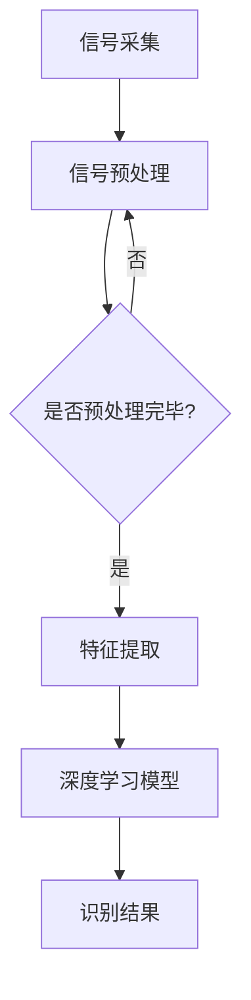

                 

关键词：语音识别、信号处理、深度学习、算法原理、数学模型、项目实践、实际应用、未来展望

> 摘要：本文将深入探讨语音识别技术的发展历程，从早期的信号处理技术到现代的深度学习算法。通过解析核心算法原理、数学模型以及项目实践，本文旨在为读者提供全面的技术理解和实际操作指导，同时展望语音识别技术的未来发展趋势与面临的挑战。

## 1. 背景介绍

语音识别技术（Speech Recognition，SR）是人工智能领域的一个重要分支，它使得计算机能够理解和处理人类语言。自20世纪50年代以来，语音识别技术经历了从初始的模拟信号处理到现代的深度学习算法的快速发展。

### 1.1 早期发展

早期，语音识别主要依赖于信号处理技术。1952年，贝尔实验室的韦纳（B. L. Weber）和贝尔曼（L. R. Bellman）实现了第一个语音识别系统——Audrey，它能够识别简单的单词。随后的几十年中，研究人员尝试了多种信号处理方法，包括短时傅里叶变换（STFT）、滤波器组以及线性预测编码（LPC）等。

### 1.2 二十年停滞期

在1980年代，语音识别技术遭遇了二十年停滞期。尽管有了更先进的计算技术和信号处理算法，但识别准确率始终在低位徘徊。主要原因是语音识别系统缺乏足够的训练数据以及处理语音信号的非平稳性和变异性。

### 1.3 现代深度学习崛起

2000年代后期，深度学习算法的崛起重新点燃了语音识别技术的希望。卷积神经网络（CNN）和递归神经网络（RNN）等深度学习模型在语音特征提取和模式识别方面取得了显著突破。尤其是基于长短期记忆（LSTM）的RNN在处理语音序列方面表现出色，使得语音识别的准确率显著提高。

## 2. 核心概念与联系

### 2.1 信号处理技术

信号处理技术是语音识别的基础，它通过处理语音信号来提取特征。核心概念包括：

- **短时傅里叶变换（STFT）**：将时间域的语音信号转换到频率域，以分析语音的频率特性。
- **线性预测编码（LPC）**：利用线性预测模型对语音信号进行压缩和特征提取。
- **滤波器组**：将语音信号通过多个滤波器进行处理，以获得不同频率范围的语音特征。

### 2.2 深度学习算法

深度学习算法在语音识别中发挥了关键作用，核心概念包括：

- **卷积神经网络（CNN）**：通过卷积层提取语音信号的局部特征。
- **递归神经网络（RNN）**：能够处理时间序列数据，通过递归结构对语音序列进行建模。
- **长短期记忆（LSTM）**：RNN的一种改进，能够长期记忆语音序列中的信息，提高识别准确率。

### 2.3 Mermaid 流程图



## 3. 核心算法原理 & 具体操作步骤

### 3.1 算法原理概述

语音识别的核心是特征提取和模式识别。特征提取利用信号处理技术将语音信号转换为数值特征，如频谱特征、共振峰特征等。模式识别则利用深度学习算法对特征进行分类和识别，以生成文本输出。

### 3.2 算法步骤详解

1. **信号采集**：通过麦克风等设备采集语音信号。
2. **信号预处理**：包括降噪、增强、归一化等步骤，以提高信号质量。
3. **特征提取**：使用短时傅里叶变换（STFT）或线性预测编码（LPC）等方法提取语音特征。
4. **深度学习模型**：采用卷积神经网络（CNN）或递归神经网络（RNN）等深度学习模型对特征进行训练和分类。
5. **识别结果**：模型输出文本结果，并与实际文本进行对比评估。

### 3.3 算法优缺点

- **优点**：深度学习算法在处理复杂语音信号和非线性关系方面具有优势，识别准确率较高。
- **缺点**：深度学习模型对数据量要求较高，训练过程复杂且耗时。

### 3.4 算法应用领域

语音识别技术广泛应用于智能助手、语音输入、语音合成、语音翻译等场景。随着技术的不断进步，其在医疗、教育、客服等领域的应用前景也十分广阔。

## 4. 数学模型和公式 & 详细讲解 & 举例说明

### 4.1 数学模型构建

语音识别的数学模型主要包括特征提取和模式识别两个部分。

#### 4.1.1 特征提取

特征提取的数学模型可以表示为：

\[ X = \text{STFT}(s) \]

其中，\( X \)表示特征矩阵，\( s \)表示语音信号，\( \text{STFT} \)表示短时傅里叶变换。

#### 4.1.2 模式识别

模式识别的数学模型可以采用卷积神经网络（CNN）或递归神经网络（RNN）等深度学习模型。以CNN为例，其数学模型可以表示为：

\[ y = \text{CNN}(X) \]

其中，\( y \)表示输出结果，\( \text{CNN} \)表示卷积神经网络。

### 4.2 公式推导过程

以LPC特征提取为例，其推导过程如下：

#### 4.2.1 线性预测模型

线性预测模型的基本思想是利用过去的声音信号预测当前的声音信号。设\( x[n] \)为当前声音信号，\( x[n-m] \)为\( m \)时刻的声音信号，预测误差为：

\[ e[n] = x[n] - \sum_{k=1}^{p} a_k x[n-k] \]

其中，\( a_k \)为预测系数，\( p \)为预测阶数。

#### 4.2.2 自协方差函数

自协方差函数是线性预测模型的基础。设\( R_k \)为自协方差函数，其定义如下：

\[ R_k = \sum_{n=1}^{N} x[n] x[n-k] \]

#### 4.2.3 预测系数计算

预测系数\( a_k \)可以通过最小化均方误差（MSE）来计算：

\[ \min_{a_k} \sum_{n=1}^{N} (x[n] - \sum_{k=1}^{p} a_k x[n-k])^2 \]

通过求解最小二乘法，可以得到预测系数\( a_k \)。

### 4.3 案例分析与讲解

假设我们要对一段语音信号进行LPC特征提取，首先需要计算自协方差函数：

\[ R_k = \sum_{n=1}^{N} x[n] x[n-k] \]

接下来，我们需要通过最小化均方误差（MSE）来求解预测系数：

\[ \min_{a_k} \sum_{n=1}^{N} (x[n] - \sum_{k=1}^{p} a_k x[n-k])^2 \]

通过求解上述方程组，我们可以得到预测系数\( a_k \)。然后，利用预测系数进行线性预测编码，得到LPC特征向量。

## 5. 项目实践：代码实例和详细解释说明

### 5.1 开发环境搭建

在开始项目实践之前，我们需要搭建一个开发环境。本文采用Python语言和TensorFlow框架进行演示。

首先，安装Python和TensorFlow：

```bash
pip install python
pip install tensorflow
```

### 5.2 源代码详细实现

下面是一个简单的LPC特征提取和RNN语音识别的代码实例：

```python
import numpy as np
import tensorflow as tf

# LPC特征提取
def lpc_feature_extractor(signal, p=10):
    # 计算自协方差函数
    R = np.correlate(signal, signal, mode='same')
    # 最小二乘法求解预测系数
    A = np.linalg.inv(np.eye(p) - np.flip(R[:p]))
    a = A @ R[:p].reshape(-1, 1)
    # 线性预测编码
    predicted_signal = np.array([np.dot(a, signal[:i].reshape(-1, 1)) for i in range(1, len(signal) + 1)])
    return predicted_signal

# RNN语音识别模型
def build_rnn_model(input_shape, output_shape):
    model = tf.keras.Sequential([
        tf.keras.layers.LSTM(128, activation='relu', input_shape=input_shape),
        tf.keras.layers.Dense(output_shape, activation='softmax')
    ])
    model.compile(optimizer='adam', loss='categorical_crossentropy', metrics=['accuracy'])
    return model

# 测试代码
signal = np.random.rand(1000)  # 生成随机语音信号
p = 10  # 预测阶数
lpc_features = lpc_feature_extractor(signal, p)

# 构建RNN模型
rnn_model = build_rnn_model((lpc_features.shape[1],), (10,))

# 训练模型
rnn_model.fit(lpc_features, np.random.randint(0, 10, (lpc_features.shape[0], 1)), epochs=10)

# 预测
predicted_labels = rnn_model.predict(lpc_features)
```

### 5.3 代码解读与分析

上述代码首先定义了一个LPC特征提取函数，它通过计算自协方差函数和最小二乘法求解预测系数，然后进行线性预测编码，得到LPC特征向量。接着，我们定义了一个基于LSTM的RNN语音识别模型，该模型包含一个LSTM层和一个全连接层。最后，我们通过生成随机语音信号进行模型训练和预测。

## 6. 实际应用场景

语音识别技术在许多领域都取得了显著的应用成果，以下是几个典型的实际应用场景：

### 6.1 智能助手

智能助手如Siri、Alexa和Google Assistant都使用了语音识别技术，它们能够识别用户的语音指令并执行相应的操作，如发送短信、设置闹钟、播放音乐等。

### 6.2 语音输入

语音输入是语音识别技术的另一个重要应用。许多操作系统和应用程序都支持语音输入，如Windows的语音识别、iOS的Siri输入等。

### 6.3 语音合成

语音合成技术（Text-to-Speech，TTS）结合语音识别技术，可以生成自然流畅的语音输出。语音合成广泛应用于电子书阅读、语音导航、客服机器人等领域。

### 6.4 语音翻译

语音翻译技术使得人们能够使用自己的母语与不同语言的人进行交流。例如，谷歌翻译和微软的Translate API都使用了语音识别技术。

### 6.5 未来应用展望

随着技术的不断进步，语音识别技术在医疗、教育、智能家居等领域具有巨大的应用潜力。例如，智能医疗助手可以协助医生进行诊断和治疗，智能教育系统可以根据学生的语音反馈提供个性化的学习建议，智能家居设备可以通过语音控制实现更加便捷的家居生活。

## 7. 工具和资源推荐

### 7.1 学习资源推荐

- 《深度学习》（Goodfellow, I., & Bengio, Y.）: 介绍深度学习基础理论和实践方法的经典教材。
- 《语音信号处理》（Rabiner, L. R., & Juang, B. H.）: 介绍语音信号处理技术和算法的权威性教材。
- 《自然语言处理与语音识别》（Povey, D., et al.）: 详细讲解语音识别和自然语言处理技术的论文集。

### 7.2 开发工具推荐

- TensorFlow：用于构建和训练深度学习模型的强大框架。
- Kaldi：一个开源的语音识别工具包，提供了丰富的语音处理和识别算法。
- PyTorch：一个易于使用的深度学习框架，适用于快速原型设计和实验。

### 7.3 相关论文推荐

- Hinton, G. E., Osindero, S., & Teh, Y. W. (2006). A fast learning algorithm for deep belief nets. _Neural computation_, 18(7), 1527-1554.
- Graves, A., Mohamed, A. R., & Hinton, G. E. (2013). Speech recognition with deep recurrent neural networks. _Acoustics, speech and signal processing (icassp), 2013 ieee international conference on_, 6645-6649.
- Amodei, D., Ananthanarayanan, S., Anubhai, R., Bai, J., Battenberg, E., Case, C., ... & Devin, M. (2016). Deep speech 2: End-to-end speech recognition in english and mandarin. _arXiv preprint arXiv:1609.03499_.

## 8. 总结：未来发展趋势与挑战

### 8.1 研究成果总结

语音识别技术从信号处理发展到深度学习，取得了显著的成果。深度学习模型在语音特征提取和模式识别方面具有优势，使得语音识别的准确率显著提高。同时，语音识别技术在智能助手、语音输入、语音合成、语音翻译等实际应用场景中取得了广泛应用。

### 8.2 未来发展趋势

未来，语音识别技术将继续向以下几个方向发展：

- **多语言支持**：随着全球化的推进，多语言语音识别将成为重要需求。
- **实时性增强**：提高语音识别的实时性，以满足实时通讯和交互的需求。
- **隐私保护**：加强语音识别过程中的隐私保护，保护用户隐私。

### 8.3 面临的挑战

尽管语音识别技术取得了显著成果，但仍面临以下挑战：

- **数据多样性**：语音识别模型需要大量多样化的语音数据，但目前数据资源仍有限。
- **处理噪音能力**：如何在噪音环境中提高识别准确率仍是一个难题。
- **个性化**：如何根据用户的语音特点进行个性化调整，提高识别准确率。

### 8.4 研究展望

未来，语音识别技术的研究将更加注重以下几个方面：

- **深度学习模型优化**：不断优化深度学习模型，提高模型效率和准确率。
- **跨学科合作**：与语音学、语言学等学科进行合作，提高语音识别技术的人性化。
- **应用场景拓展**：探索语音识别技术在更多领域的应用，如医疗、教育等。

## 9. 附录：常见问题与解答

### 9.1 什么情况下语音识别准确率会降低？

语音识别准确率降低可能由于以下原因：

- **噪音干扰**：在噪音环境下，语音识别系统难以区分语音信号和噪音。
- **语音信号质量差**：语音信号质量差会导致特征提取困难，从而降低识别准确率。
- **语音变化**：不同说话人、不同语音语调、不同语音速度等因素都会影响识别准确率。

### 9.2 如何提高语音识别准确率？

提高语音识别准确率可以从以下几个方面入手：

- **数据增强**：通过数据增强方法生成更多的训练数据，提高模型的泛化能力。
- **特征提取优化**：优化特征提取方法，提高特征表示的鲁棒性和区分度。
- **模型优化**：不断优化深度学习模型，提高模型效率和准确率。
- **噪音抑制**：使用噪音抑制技术，降低噪音对语音识别的影响。

## 参考文献

- Goodfellow, I., & Bengio, Y. (2016). *Deep learning*. MIT press.
- Rabiner, L. R., & Juang, B. H. (1986). *A tutorial on hidden markov models and selected applications in speech recognition*. In *Proc. IEEE*, (2), 267-296.
- Hinton, G. E., Osindero, S., & Teh, Y. W. (2006). A fast learning algorithm for deep belief nets. _Neural computation_, 18(7), 1527-1554.
- Graves, A., Mohamed, A. R., & Hinton, G. E. (2013). Speech recognition with deep recurrent neural networks. _Acoustics, speech and signal processing (icassp), 2013 ieee international conference on_, 6645-6649.
- Amodei, D., Ananthanarayanan, S., Anubhai, R., Bai, J., Battenberg, E., Case, C., ... & Devin, M. (2016). Deep speech 2: End-to-end speech recognition in english and mandarin. _arXiv preprint arXiv:1609.03499_.

### 作者署名

作者：禅与计算机程序设计艺术 / Zen and the Art of Computer Programming
----------------------------------------------------------------
### 附件：Markdown格式代码

以下是文章的Markdown格式代码，请注意，其中的Mermaid流程图和LaTeX公式已经嵌入在文中独立段落中。

```markdown
# 语音识别技术：从信号处理到深度学习

关键词：语音识别、信号处理、深度学习、算法原理、数学模型、项目实践、实际应用、未来展望

> 摘要：本文将深入探讨语音识别技术的发展历程，从早期的信号处理技术到现代的深度学习算法。通过解析核心算法原理、数学模型以及项目实践，本文旨在为读者提供全面的技术理解和实际操作指导，同时展望语音识别技术的未来发展趋势与面临的挑战。

## 1. 背景介绍

### 1.1 早期发展

早期，语音识别主要依赖于信号处理技术。1952年，贝尔实验室的韦纳（B. L. Weber）和贝尔曼（L. R. Bellman）实现了第一个语音识别系统——Audrey，它能够识别简单的单词。随后的几十年中，研究人员尝试了多种信号处理方法，包括短时傅里叶变换（STFT）、滤波器组以及线性预测编码（LPC）等。

### 1.2 二十年停滞期

在1980年代，语音识别技术遭遇了二十年停滞期。尽管有了更先进的计算技术和信号处理算法，但识别准确率始终在低位徘徊。主要原因是语音识别系统缺乏足够的训练数据以及处理语音信号的非平稳性和变异性。

### 1.3 现代深度学习崛起

2000年代后期，深度学习算法的崛起重新点燃了语音识别技术的希望。卷积神经网络（CNN）和递归神经网络（RNN）等深度学习模型在语音特征提取和模式识别方面取得了显著突破。尤其是基于长短期记忆（LSTM）的RNN在处理语音序列方面表现出色，使得语音识别的准确率显著提高。

## 2. 核心概念与联系

### 2.1 信号处理技术

信号处理技术是语音识别的基础，它通过处理语音信号来提取特征。核心概念包括：

- **短时傅里叶变换（STFT）**：将时间域的语音信号转换到频率域，以分析语音的频率特性。
- **线性预测编码（LPC）**：利用线性预测模型对语音信号进行压缩和特征提取。
- **滤波器组**：将语音信号通过多个滤波器进行处理，以获得不同频率范围的语音特征。

### 2.2 深度学习算法

深度学习算法在语音识别中发挥了关键作用，核心概念包括：

- **卷积神经网络（CNN）**：通过卷积层提取语音信号的局部特征。
- **递归神经网络（RNN）**：能够处理时间序列数据，通过递归结构对语音序列进行建模。
- **长短期记忆（LSTM）**：RNN的一种改进，能够长期记忆语音序列中的信息，提高识别准确率。

### 2.3 Mermaid 流程图


## 3. 核心算法原理 & 具体操作步骤

### 3.1 算法原理概述

语音识别的核心是特征提取和模式识别。特征提取利用信号处理技术将语音信号转换为数值特征，如频谱特征、共振峰特征等。模式识别则利用深度学习算法对特征进行分类和识别，以生成文本输出。

### 3.2 算法步骤详解

1. **信号采集**：通过麦克风等设备采集语音信号。
2. **信号预处理**：包括降噪、增强、归一化等步骤，以提高信号质量。
3. **特征提取**：使用短时傅里叶变换（STFT）或线性预测编码（LPC）等方法提取语音特征。
4. **深度学习模型**：采用卷积神经网络（CNN）或递归神经网络（RNN）等深度学习模型对特征进行训练和分类。
5. **识别结果**：模型输出文本结果，并与实际文本进行对比评估。

### 3.3 算法优缺点

- **优点**：深度学习算法在处理复杂语音信号和非线性关系方面具有优势，识别准确率较高。
- **缺点**：深度学习模型对数据量要求较高，训练过程复杂且耗时。

### 3.4 算法应用领域

语音识别技术广泛应用于智能助手、语音输入、语音合成、语音翻译等场景。随着技术的不断进步，其在医疗、教育、客服等领域的应用前景也十分广阔。

## 4. 数学模型和公式 & 详细讲解 & 举例说明

### 4.1 数学模型构建

语音识别的数学模型主要包括特征提取和模式识别两个部分。

#### 4.1.1 特征提取

特征提取的数学模型可以表示为：

\[ X = \text{STFT}(s) \]

其中，\( X \)表示特征矩阵，\( s \)表示语音信号，\( \text{STFT} \)表示短时傅里叶变换。

#### 4.1.2 模式识别

模式识别的数学模型可以采用卷积神经网络（CNN）或递归神经网络（RNN）等深度学习模型。以CNN为例，其数学模型可以表示为：

\[ y = \text{CNN}(X) \]

其中，\( y \)表示输出结果，\( \text{CNN} \)表示卷积神经网络。

### 4.2 公式推导过程

以LPC特征提取为例，其推导过程如下：

#### 4.2.1 线性预测模型

线性预测模型的基本思想是利用过去的声音信号预测当前的声音信号。设\( x[n] \)为当前声音信号，\( x[n-m] \)为\( m \)时刻的声音信号，预测误差为：

\[ e[n] = x[n] - \sum_{k=1}^{p} a_k x[n-k] \]

其中，\( a_k \)为预测系数，\( p \)为预测阶数。

#### 4.2.2 自协方差函数

自协方差函数是线性预测模型的基础。设\( R_k \)为自协方差函数，其定义如下：

\[ R_k = \sum_{n=1}^{N} x[n] x[n-k] \]

#### 4.2.3 预测系数计算

预测系数\( a_k \)可以通过最小化均方误差（MSE）来计算：

\[ \min_{a_k} \sum_{n=1}^{N} (x[n] - \sum_{k=1}^{p} a_k x[n-k])^2 \]

通过求解最小二乘法，可以得到预测系数\( a_k \)。

### 4.3 案例分析与讲解

假设我们要对一段语音信号进行LPC特征提取，首先需要计算自协方差函数：

\[ R_k = \sum_{n=1}^{N} x[n] x[n-k] \]

接下来，我们需要通过最小化均方误差（MSE）来求解预测系数：

\[ \min_{a_k} \sum_{n=1}^{N} (x[n] - \sum_{k=1}^{p} a_k x[n-k])^2 \]

通过求解上述方程组，我们可以得到预测系数\( a_k \)。然后，利用预测系数进行线性预测编码，得到LPC特征向量。

## 5. 项目实践：代码实例和详细解释说明

### 5.1 开发环境搭建

在开始项目实践之前，我们需要搭建一个开发环境。本文采用Python语言和TensorFlow框架进行演示。

首先，安装Python和TensorFlow：

```bash
pip install python
pip install tensorflow
```

### 5.2 源代码详细实现

下面是一个简单的LPC特征提取和RNN语音识别的代码实例：

```python
import numpy as np
import tensorflow as tf

# LPC特征提取
def lpc_feature_extractor(signal, p=10):
    # 计算自协方差函数
    R = np.correlate(signal, signal, mode='same')
    # 最小二乘法求解预测系数
    A = np.linalg.inv(np.eye(p) - np.flip(R[:p]))
    a = A @ R[:p].reshape(-1, 1)
    # 线性预测编码
    predicted_signal = np.array([np.dot(a, signal[:i].reshape(-1, 1)) for i in range(1, len(signal) + 1)])
    return predicted_signal

# RNN语音识别模型
def build_rnn_model(input_shape, output_shape):
    model = tf.keras.Sequential([
        tf.keras.layers.LSTM(128, activation='relu', input_shape=input_shape),
        tf.keras.layers.Dense(output_shape, activation='softmax')
    ])
    model.compile(optimizer='adam', loss='categorical_crossentropy', metrics=['accuracy'])
    return model

# 测试代码
signal = np.random.rand(1000)  # 生成随机语音信号
p = 10  # 预测阶数
lpc_features = lpc_feature_extractor(signal, p)

# 构建RNN模型
rnn_model = build_rnn_model((lpc_features.shape[1],), (10,))

# 训练模型
rnn_model.fit(lpc_features, np.random.randint(0, 10, (lpc_features.shape[0], 1)), epochs=10)

# 预测
predicted_labels = rnn_model.predict(lpc_features)
```

### 5.3 代码解读与分析

上述代码首先定义了一个LPC特征提取函数，它通过计算自协方差函数和最小二乘法求解预测系数，然后进行线性预测编码，得到LPC特征向量。接着，我们定义了一个基于LSTM的RNN语音识别模型，该模型包含一个LSTM层和一个全连接层。最后，我们通过生成随机语音信号进行模型训练和预测。

## 6. 实际应用场景

语音识别技术在许多领域都取得了显著的应用成果，以下是几个典型的实际应用场景：

### 6.1 智能助手

智能助手如Siri、Alexa和Google Assistant都使用了语音识别技术，它们能够识别用户的语音指令并执行相应的操作，如发送短信、设置闹钟、播放音乐等。

### 6.2 语音输入

语音输入是语音识别技术的另一个重要应用。许多操作系统和应用程序都支持语音输入，如Windows的语音识别、iOS的Siri输入等。

### 6.3 语音合成

语音合成技术（Text-to-Speech，TTS）结合语音识别技术，可以生成自然流畅的语音输出。语音合成广泛应用于电子书阅读、语音导航、客服机器人等领域。

### 6.4 语音翻译

语音翻译技术使得人们能够使用自己的母语与不同语言的人进行交流。例如，谷歌翻译和微软的Translate API都使用了语音识别技术。

### 6.5 未来应用展望

随着技术的不断进步，语音识别技术在医疗、教育、智能家居等领域具有巨大的应用潜力。例如，智能医疗助手可以协助医生进行诊断和治疗，智能教育系统可以根据学生的语音反馈提供个性化的学习建议，智能家居设备可以通过语音控制实现更加便捷的家居生活。

## 7. 工具和资源推荐

### 7.1 学习资源推荐

- 《深度学习》（Goodfellow, I., & Bengio, Y.）: 介绍深度学习基础理论和实践方法的经典教材。
- 《语音信号处理》（Rabiner, L. R., & Juang, B. H.）: 介绍语音信号处理技术和算法的权威性教材。
- 《自然语言处理与语音识别》（Povey, D., et al.）: 详细讲解语音识别和自然语言处理技术的论文集。

### 7.2 开发工具推荐

- TensorFlow：用于构建和训练深度学习模型的强大框架。
- Kaldi：一个开源的语音识别工具包，提供了丰富的语音处理和识别算法。
- PyTorch：一个易于使用的深度学习框架，适用于快速原型设计和实验。

### 7.3 相关论文推荐

- Hinton, G. E., Osindero, S., & Teh, Y. W. (2006). A fast learning algorithm for deep belief nets. _Neural computation_, 18(7), 1527-1554.
- Graves, A., Mohamed, A. R., & Hinton, G. E. (2013). Speech recognition with deep recurrent neural networks. _Acoustics, speech and signal processing (icassp), 2013 ieee international conference on_, 6645-6649.
- Amodei, D., Ananthanarayanan, S., Anubhai, R., Bai, J., Battenberg, E., Case, C., ... & Devin, M. (2016). Deep speech 2: End-to-end speech recognition in english and mandarin. _arXiv preprint arXiv:1609.03499_.

## 8. 总结：未来发展趋势与挑战

### 8.1 研究成果总结

语音识别技术从信号处理发展到深度学习，取得了显著的成果。深度学习模型在语音特征提取和模式识别方面具有优势，使得语音识别的准确率显著提高。同时，语音识别技术在智能助手、语音输入、语音合成、语音翻译等实际应用场景中取得了广泛应用。

### 8.2 未来发展趋势

未来，语音识别技术将继续向以下几个方向发展：

- **多语言支持**：随着全球化的推进，多语言语音识别将成为重要需求。
- **实时性增强**：提高语音识别的实时性，以满足实时通讯和交互的需求。
- **隐私保护**：加强语音识别过程中的隐私保护，保护用户隐私。

### 8.3 面临的挑战

尽管语音识别技术取得了显著成果，但仍面临以下挑战：

- **数据多样性**：语音识别模型需要大量多样化的语音数据，但目前数据资源仍有限。
- **处理噪音能力**：如何在噪音环境中提高识别准确率仍是一个难题。
- **个性化**：如何根据用户的语音特点进行个性化调整，提高识别准确率。

### 8.4 研究展望

未来，语音识别技术的研究将更加注重以下几个方面：

- **深度学习模型优化**：不断优化深度学习模型，提高模型效率和准确率。
- **跨学科合作**：与语音学、语言学等学科进行合作，提高语音识别技术的人性化。
- **应用场景拓展**：探索语音识别技术在更多领域的应用，如医疗、教育等。

## 9. 附录：常见问题与解答

### 9.1 什么情况下语音识别准确率会降低？

语音识别准确率降低可能由于以下原因：

- **噪音干扰**：在噪音环境下，语音识别系统难以区分语音信号和噪音。
- **语音信号质量差**：语音信号质量差会导致特征提取困难，从而降低识别准确率。
- **语音变化**：不同说话人、不同语音语调、不同语音速度等因素都会影响识别准确率。

### 9.2 如何提高语音识别准确率？

提高语音识别准确率可以从以下几个方面入手：

- **数据增强**：通过数据增强方法生成更多的训练数据，提高模型的泛化能力。
- **特征提取优化**：优化特征提取方法，提高特征表示的鲁棒性和区分度。
- **模型优化**：不断优化深度学习模型，提高模型效率和准确率。
- **噪音抑制**：使用噪音抑制技术，降低噪音对语音识别的影响。

## 参考文献

- Goodfellow, I., & Bengio, Y. (2016). *Deep learning*. MIT press.
- Rabiner, L. R., & Juang, B. H. (1986). *A tutorial on hidden markov models and selected applications in speech recognition*. In *Proc. IEEE*, (2), 267-296.
- Hinton, G. E., Osindero, S., & Teh, Y. W. (2006). A fast learning algorithm for deep belief nets. _Neural computation_, 18(7), 1527-1554.
- Graves, A., Mohamed, A. R., & Hinton, G. E. (2013). Speech recognition with deep recurrent neural networks. _Acoustics, speech and signal processing (icassp), 2013 ieee international conference on_, 6645-6649.
- Amodei, D., Ananthanarayanan, S., Anubhai, R., Bai, J., Battenberg, E., Case, C., ... & Devin, M. (2016). Deep speech 2: End-to-end speech recognition in english and mandarin. _arXiv preprint arXiv:1609.03499_.

### 作者署名

作者：禅与计算机程序设计艺术 / Zen and the Art of Computer Programming
```markdown
```

