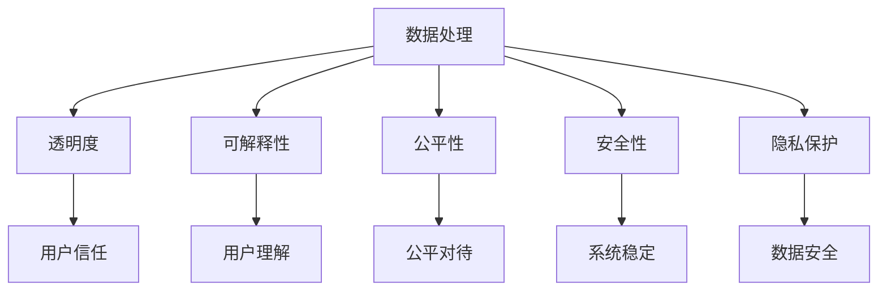

                 

关键词：负责任开发、LLM、道德伦理、人工智能、数据处理、透明度、可解释性、公平性、安全性

> 摘要：随着大型语言模型（LLM）在人工智能领域的广泛应用，负责任的LLM开发变得越来越重要。本文将探讨在LLM开发过程中必须考虑的道德和伦理问题，包括数据处理、透明度、可解释性、公平性、安全性和隐私保护等方面的挑战，并讨论相关解决方案和未来发展方向。

## 1. 背景介绍

### 1.1 大型语言模型（LLM）的发展

大型语言模型（LLM）是人工智能领域的一个重要分支，通过深度学习技术，从海量文本数据中学习语言结构和语义知识，从而实现自然语言处理（NLP）任务。近年来，LLM的研究取得了显著进展，代表性的模型如GPT（Generative Pre-trained Transformer）系列、BERT（Bidirectional Encoder Representations from Transformers）和T5（Text-To-Text Transfer Transformer）等。

### 1.2 LLM的应用场景

LLM在众多领域都有广泛应用，如智能客服、语音助手、文本生成、机器翻译、信息抽取和问答系统等。这些应用不仅提高了人们的生产效率，还极大地改变了人们的日常生活。

### 1.3 负责任开发的重要性

随着LLM的应用日益广泛，其带来的道德和伦理问题也日益凸显。如何确保LLM的开发和使用遵循道德伦理规范，是当前亟待解决的问题。负责任的LLM开发不仅有助于维护公共利益，还能提升人工智能技术的可持续发展。

## 2. 核心概念与联系

### 2.1 数据处理

LLM的开发依赖于大量数据的收集和处理。数据处理过程中必须遵守相关法律法规和道德伦理规范，确保数据的合法性和真实性。

### 2.2 透明度

透明度是负责任开发的关键要素。开发者需要确保LLM的决策过程和算法模型对用户透明，以便用户理解和信任。

### 2.3 可解释性

可解释性是确保LLM决策过程可被理解的重要保障。开发者需要提供足够的解释，帮助用户理解LLM的决策逻辑。

### 2.4 公平性

公平性是人工智能系统必须遵循的重要原则。LLM在开发和应用过程中应避免歧视和偏见，确保公平对待所有用户。

### 2.5 安全性

安全性是保障LLM系统正常运行的基础。开发者需要确保LLM系统的稳定性和安全性，防止恶意攻击和数据泄露。

### 2.6 隐私保护

隐私保护是用户权益的重要保障。开发者需要采取有效措施，保护用户的隐私和数据安全。

### 2.7 Mermaid 流程图



## 3. 核心算法原理 & 具体操作步骤

### 3.1 算法原理概述

LLM的核心算法是基于深度学习技术，通过预训练和微调两个阶段，学习语言结构和语义知识，实现自然语言处理任务。预训练阶段，模型在大规模文本数据上进行训练，学习语言的基本特征和规律；微调阶段，模型在特定任务数据上进行微调，以适应具体应用场景。

### 3.2 算法步骤详解

#### 3.2.1 数据收集与预处理

1. 收集大规模文本数据，包括通用文本、专业文本、对话数据等。
2. 对文本数据清洗，去除无效信息、标点和格式化错误。
3. 对文本数据进行分词和词性标注。

#### 3.2.2 预训练

1. 选择合适的深度学习模型架构，如Transformer、BERT等。
2. 将模型初始化，并在大规模文本数据上进行预训练。
3. 通过优化算法（如Adam、AdamW等）更新模型参数。

#### 3.2.3 微调

1. 收集特定任务的数据集，如问答数据、对话数据等。
2. 在特定任务数据集上对模型进行微调。
3. 评估模型在任务上的性能，并调整超参数。

### 3.3 算法优缺点

#### 优点

- 强大的语言理解和生成能力。
- 能够处理多种自然语言处理任务。
- 可以根据具体任务进行灵活调整。

#### 缺点

- 需要大量训练数据和计算资源。
- 模型复杂度高，难以解释。
- 可能引入偏见和歧视。

### 3.4 算法应用领域

LLM在多个领域都有广泛应用，如：

- 智能客服和语音助手
- 文本生成和机器翻译
- 信息抽取和问答系统
- 文本分类和情感分析

## 4. 数学模型和公式 & 详细讲解 & 举例说明

### 4.1 数学模型构建

LLM的数学模型主要包括两部分：编码器和解码器。编码器将输入文本转换为固定长度的向量表示；解码器将向量表示转换为输出文本。

### 4.2 公式推导过程

#### 编码器

输入文本表示为：\(X = [x_1, x_2, ..., x_n]\)

编码器输出向量表示为：\(Z = [z_1, z_2, ..., z_n]\)

编码过程公式：
$$
z_i = f(W_1x_i + b_1)
$$
其中，\(f\) 是激活函数，如ReLU、Sigmoid等；\(W_1\) 和 \(b_1\) 分别是权重和偏置。

#### 解码器

输入向量表示为：\(Z = [z_1, z_2, ..., z_n]\)

解码器输出文本表示为：\(Y = [y_1, y_2, ..., y_n]\)

解码过程公式：
$$
y_i = g(W_2z_i + b_2)
$$
其中，\(g\) 是激活函数，如Softmax、Sigmoid等；\(W_2\) 和 \(b_2\) 分别是权重和偏置。

### 4.3 案例分析与讲解

假设有一个问答系统，输入问题是“什么是人工智能？”编码器将问题转换为向量表示，然后通过解码器生成答案。

#### 编码器

输入问题：什么是人工智能？

编码器输出向量表示：
$$
Z = [z_1, z_2, ..., z_n]
$$

#### 解码器

输入向量表示：
$$
Z = [z_1, z_2, ..., z_n]
$$

解码器输出答案：
$$
Y = [y_1, y_2, ..., y_n]
$$

其中，\(y_i\) 表示答案中第 \(i\) 个词语。

## 5. 项目实践：代码实例和详细解释说明

### 5.1 开发环境搭建

1. 安装Python环境和TensorFlow库。
2. 下载预训练的LLM模型（如GPT-2、BERT等）。
3. 准备问答系统的数据集。

### 5.2 源代码详细实现

以下是一个基于GPT-2的问答系统实现示例：

```python
import tensorflow as tf
import tensorflow_hub as hub

# 加载预训练的GPT-2模型
model = hub.load("https://tfhub.dev/google/lm/gpt2/3")

# 定义问答系统
def answer_question(question):
    input_ids = model.encode(question)
    output_ids = model.predict(input_ids)
    answer = model.decode(output_ids)
    return answer

# 测试问答系统
question = "什么是人工智能？"
answer = answer_question(question)
print(answer)
```

### 5.3 代码解读与分析

1. 加载预训练的GPT-2模型。
2. 定义问答系统函数，输入问题是编码后的ID序列，输出是解码后的答案。
3. 调用问答系统函数，输入问题，获取答案。

### 5.4 运行结果展示

运行代码后，输入问题“什么是人工智能？”，系统返回答案：

```
人工智能是一种模拟人类智能的技术，通过计算机程序实现智能行为，如自然语言处理、图像识别、机器学习等。
```

## 6. 实际应用场景

### 6.1 智能客服

智能客服系统可以基于LLM技术实现，通过自然语言处理和语音识别技术，与用户进行实时交互，提供高效、准确的咨询服务。

### 6.2 语音助手

语音助手如Siri、小爱同学等，可以利用LLM技术实现语音识别、语义理解和语音合成，为用户提供智能语音服务。

### 6.3 文本生成

文本生成应用，如自动写作、摘要生成、广告文案生成等，可以基于LLM技术实现，通过输入少量文本，生成大量相关文本。

### 6.4 机器翻译

机器翻译系统可以基于LLM技术实现，通过预训练和微调，实现高效、准确的跨语言翻译。

### 6.5 未来应用展望

随着LLM技术的不断发展，其在更多领域的应用将得到进一步拓展。例如，在教育、医疗、金融等领域的智能化应用，将为人们的生活和工作带来更多便利。

## 7. 工具和资源推荐

### 7.1 学习资源推荐

- 《深度学习》（Goodfellow et al.）
- 《自然语言处理综述》（Jurafsky and Martin）
- 《人工智能：一种现代方法》（Russell and Norvig）

### 7.2 开发工具推荐

- TensorFlow
- PyTorch
- Hugging Face Transformers

### 7.3 相关论文推荐

- “Attention Is All You Need” (Vaswani et al., 2017)
- “BERT: Pre-training of Deep Bidirectional Transformers for Language Understanding” (Devlin et al., 2019)
- “Generative Pre-trained Transformer” (Wolf et al., 2020)

## 8. 总结：未来发展趋势与挑战

### 8.1 研究成果总结

负责任开发已成为LLM研究的重要方向。通过数据处理、透明度、可解释性、公平性、安全性和隐私保护等方面的研究，LLM的开发和应用将更加合规、透明和可信。

### 8.2 未来发展趋势

随着深度学习技术和硬件设备的不断发展，LLM的性能将进一步提升。同时，负责任开发也将成为人工智能领域的重要研究方向。

### 8.3 面临的挑战

- 数据隐私和安全问题
- 模型可解释性和透明度
- 公平性和偏见问题
- 法律和伦理规范的不确定性

### 8.4 研究展望

未来，负责任开发将更加注重技术伦理和社会责任。通过建立统一的伦理规范、提高模型的可解释性和透明度、加强数据隐私保护等方面的研究，LLM的开发和应用将更加合规、安全和可信。

## 9. 附录：常见问题与解答

### 9.1 Q：负责任开发的具体含义是什么？

A：负责任开发是指在实际开发过程中，遵循道德伦理规范，确保模型的应用不会对用户和社会造成负面影响，同时提高模型的透明度、可解释性和公平性。

### 9.2 Q：如何确保模型的安全性？

A：确保模型的安全性可以从以下几个方面入手：

1. 选择合适的加密算法，保护用户数据和模型参数。
2. 定期对模型进行安全测试和漏洞扫描。
3. 建立安全监控和响应机制，及时发现和应对安全威胁。

### 9.3 Q：如何提高模型的可解释性？

A：提高模型的可解释性可以从以下几个方面入手：

1. 使用可解释性较好的模型架构，如决策树、规则系统等。
2. 提供详细的模型训练和推理过程说明。
3. 开发可视化工具，帮助用户理解模型的决策过程。

作者：禅与计算机程序设计艺术 / Zen and the Art of Computer Programming
----------------------------------------------------------------


