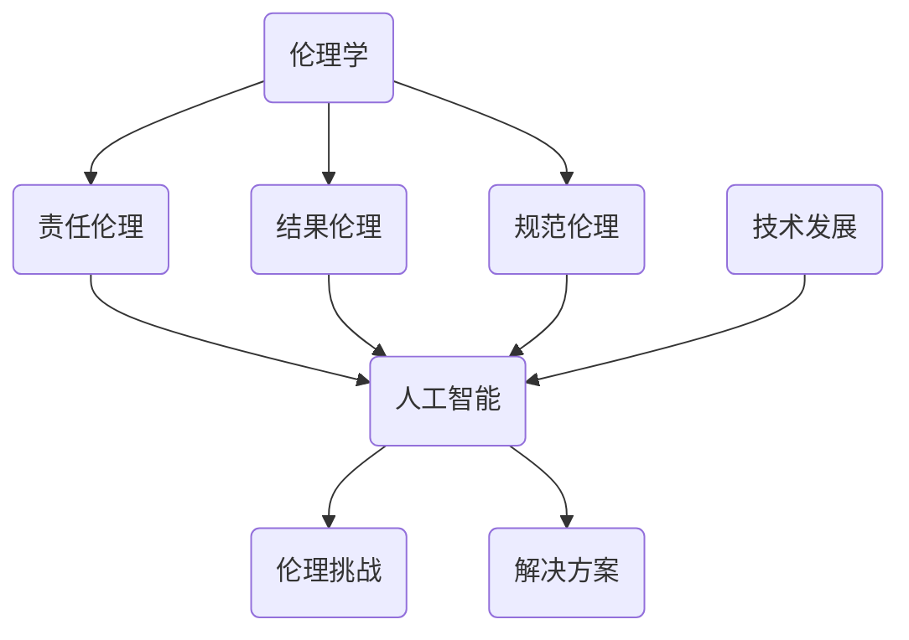

                 

关键词：人工智能，伦理思考，责任，计算，未来

> 摘要：本文深入探讨了人工智能在现代社会中的发展及其带来的伦理问题，分析了人工智能的责任归属，探讨了人工智能与人类计算的伦理边界，并提出了应对这些挑战的策略和未来展望。

## 1. 背景介绍

人工智能（Artificial Intelligence，AI）作为计算机科学的一个重要分支，近年来取得了飞速的发展。从早期的专家系统、机器学习到深度学习，人工智能的应用领域不断扩大，从医疗、金融到教育、交通等各个行业。然而，随着人工智能技术的日益普及，其潜在的风险和伦理问题也逐渐显现出来。如何在人工智能的发展过程中保障人类的基本权益，成为了一个亟待解决的问题。

### 人工智能的定义和发展历程

人工智能是指使计算机系统具备类似人类智能的能力，包括学习、推理、规划、感知、理解和自然语言处理等。人工智能的发展历程可以追溯到20世纪50年代，当时计算机科学家艾伦·图灵提出了图灵测试，试图通过模拟对话来判定机器是否具有智能。随后，随着计算能力的提升和算法的创新，人工智能技术逐渐从理论研究走向实际应用。

### 人工智能的应用领域

目前，人工智能已经在多个领域取得了显著成果。在医疗领域，人工智能可以帮助医生进行疾病诊断和治疗方案的制定；在金融领域，人工智能可以用于风险管理、欺诈检测和投资决策；在教育领域，人工智能可以提供个性化学习方案和智能辅导；在交通领域，人工智能可以用于自动驾驶和交通管理。

### 人工智能带来的伦理问题

然而，人工智能的发展也带来了一系列伦理问题。首先，人工智能的决策过程可能存在偏见，导致歧视和不公平。其次，人工智能可能对就业市场造成冲击，引发失业问题。此外，人工智能的安全性和隐私保护也备受关注。如何在人工智能的发展过程中解决这些问题，成为了一个重要的课题。

## 2. 核心概念与联系

为了更好地理解人工智能带来的伦理问题，我们需要先了解一些核心概念和它们之间的联系。以下是这些概念和它们之间的Mermaid流程图：



### 伦理学

伦理学是研究道德原则、道德规范和道德行为的学科。在人工智能领域，伦理学为我们提供了分析和解决伦理问题的框架。

### 责任伦理

责任伦理强调个体或组织在行为过程中应承担的责任。在人工智能领域，责任伦理有助于我们判断人工智能的决策和行为是否符合道德规范。

### 结果伦理

结果伦理关注行为的结果，强调行为的后果对社会的影响。在人工智能领域，结果伦理有助于我们评估人工智能技术的应用是否带来负面后果。

### 规范伦理

规范伦理关注行为是否符合道德规范。在人工智能领域，规范伦理有助于我们制定合理的道德准则，以指导人工智能的发展和应用。

### 人工智能

人工智能是指使计算机系统具备类似人类智能的能力。在伦理学框架下，我们需要关注人工智能的决策过程、应用领域和潜在风险。

### 技术发展

技术发展是推动人工智能进步的重要因素。在伦理学框架下，我们需要关注技术发展对伦理问题的解决和影响。

### 伦理挑战

伦理挑战是人工智能发展过程中面临的主要问题。包括偏见、失业、安全性和隐私保护等方面。

### 解决方案

针对伦理挑战，我们需要提出有效的解决方案，包括制定道德准则、加强监管和推动技术进步。

## 3. 核心算法原理 & 具体操作步骤

### 3.1 算法原理概述

在人工智能领域，许多算法原理被应用于解决实际问题。其中，一些核心算法包括：

1. 机器学习算法：通过数据学习模型，实现预测和分类。
2. 深度学习算法：基于多层神经网络，实现复杂特征提取。
3. 强化学习算法：通过试错学习，实现策略优化。

这些算法在人工智能领域发挥着重要作用，但同时也带来了一系列伦理问题。例如，机器学习算法可能导致偏见和歧视；深度学习算法可能无法解释决策过程；强化学习算法可能导致不可预测的行为。

### 3.2 算法步骤详解

为了更好地理解这些算法，以下是它们的具体操作步骤：

#### 3.2.1 机器学习算法

1. 数据预处理：包括数据清洗、归一化和特征提取。
2. 模型选择：根据问题特点选择合适的模型。
3. 模型训练：使用训练数据对模型进行训练。
4. 模型评估：使用验证数据对模型进行评估。
5. 模型优化：根据评估结果对模型进行调整。

#### 3.2.2 深度学习算法

1. 网络结构设计：包括输入层、隐藏层和输出层。
2. 损失函数定义：根据问题特点定义损失函数。
3. 优化算法选择：选择合适的优化算法，如梯度下降。
4. 模型训练：使用训练数据对模型进行训练。
5. 模型评估：使用验证数据对模型进行评估。

#### 3.2.3 强化学习算法

1. 环境建模：建立环境的模型，包括状态和动作。
2. 策略选择：根据问题特点选择合适的策略。
3. 模型训练：使用训练数据对模型进行训练。
4. 策略优化：通过试错学习，优化策略。

### 3.3 算法优缺点

每种算法都有其优缺点，我们需要根据实际需求选择合适的算法。以下是这些算法的优缺点：

#### 机器学习算法

优点：简单易用，适用于多种问题。

缺点：可能导致偏见和歧视，难以解释决策过程。

#### 深度学习算法

优点：可以自动提取复杂特征，适用于复杂问题。

缺点：模型复杂，难以解释决策过程，计算资源需求高。

#### 强化学习算法

优点：可以应对动态环境，实现策略优化。

缺点：训练时间长，可能陷入局部最优。

### 3.4 算法应用领域

这些算法在各个领域都有广泛应用。例如，机器学习算法在医疗诊断、金融风控等领域有广泛应用；深度学习算法在图像识别、语音识别等领域有显著成果；强化学习算法在自动驾驶、游戏开发等领域有重要应用。

## 4. 数学模型和公式 & 详细讲解 & 举例说明

### 4.1 数学模型构建

为了更好地理解人工智能算法，我们需要了解一些基本的数学模型和公式。以下是这些模型和公式的构建过程：

#### 4.1.1 逻辑回归

逻辑回归是一种用于分类的算法，其基本公式如下：

$$
P(y=1) = \frac{1}{1 + e^{-(\beta_0 + \beta_1 x_1 + \beta_2 x_2 + \ldots + \beta_n x_n})}
$$

其中，$P(y=1)$ 表示样本属于类别1的概率，$e$ 表示自然底数，$\beta_0, \beta_1, \beta_2, \ldots, \beta_n$ 表示模型的参数。

#### 4.1.2 神经网络

神经网络是一种基于多层感知器（Perceptron）的模型，其基本结构如下：

$$
z_i = \sum_{j=1}^{n} w_{ij} x_j + b_i
$$

$$
a_i = \sigma(z_i)
$$

其中，$z_i$ 表示输入到神经元$i$的净输入，$w_{ij}$ 表示神经元$j$到神经元$i$的权重，$b_i$ 表示神经元$i$的偏置，$\sigma$ 表示激活函数，$a_i$ 表示神经元$i$的输出。

#### 4.1.3 强化学习

强化学习是一种基于奖励和惩罚进行学习的方法，其基本公式如下：

$$
Q(s, a) = r + \gamma \max_{a'} Q(s', a')
$$

其中，$Q(s, a)$ 表示在状态$s$下采取动作$a$的期望奖励，$r$ 表示即时奖励，$\gamma$ 表示折扣因子，$s'$ 表示下一状态，$a'$ 表示下一动作。

### 4.2 公式推导过程

为了更好地理解这些公式，以下是它们的推导过程：

#### 4.2.1 逻辑回归

逻辑回归的推导基于最大似然估计。首先，我们定义样本的概率分布：

$$
P(X=x | \theta) = \prod_{i=1}^{n} p(x_i | \theta)
$$

其中，$X$ 表示样本，$x$ 表示样本的具体值，$\theta$ 表示模型的参数。

然后，我们使用对数似然函数：

$$
\ell(\theta) = \sum_{i=1}^{n} \log p(x_i | \theta)
$$

为了求解最大似然估计，我们需要对对数似然函数求导，并令其导数为零：

$$
\frac{\partial \ell(\theta)}{\partial \theta} = \sum_{i=1}^{n} \frac{x_i - \hat{y_i}}{y_i (1 - y_i)} = 0
$$

其中，$\hat{y_i} = \frac{1}{1 + e^{-(\beta_0 + \beta_1 x_1 + \beta_2 x_2 + \ldots + \beta_n x_n)}}$。

解上述方程，我们可以得到逻辑回归的参数估计。

#### 4.2.2 神经网络

神经网络的推导基于梯度下降法。首先，我们定义损失函数：

$$
J(\theta) = \frac{1}{2m} \sum_{i=1}^{m} (\hat{y_i} - y_i)^2
$$

其中，$m$ 表示样本数量，$\hat{y_i}$ 表示预测值，$y_i$ 表示真实值。

然后，我们使用梯度下降法来最小化损失函数：

$$
\theta_j := \theta_j - \alpha \frac{\partial J(\theta)}{\partial \theta_j}
$$

其中，$\alpha$ 表示学习率，$\partial J(\theta)/\partial \theta_j$ 表示损失函数关于参数$\theta_j$ 的偏导数。

通过不断迭代上述步骤，我们可以得到神经网络的参数估计。

#### 4.2.3 强化学习

强化学习的推导基于价值函数的迭代。首先，我们定义价值函数：

$$
V(s) = \sum_{a \in A} \gamma^k r(s', a) + \gamma^{k+1} V(s')
$$

其中，$s$ 表示当前状态，$a$ 表示当前动作，$s'$ 表示下一状态，$r(s', a)$ 表示即时奖励，$\gamma$ 表示折扣因子。

然后，我们使用贝尔曼方程来更新价值函数：

$$
V(s) = \sum_{a \in A} \gamma \sum_{s' \in S} p(s'|s, a) r(s', a) + \gamma V(s')
$$

其中，$p(s'|s, a)$ 表示在状态$s$下采取动作$a$后转移到状态$s'$的概率。

通过不断迭代上述步骤，我们可以得到价值函数的估计。

### 4.3 案例分析与讲解

为了更好地理解这些数学模型和公式，我们以下是一个案例分析与讲解：

#### 4.3.1 逻辑回归在疾病诊断中的应用

假设我们有一个疾病诊断问题，其中每个患者都有若干个特征，例如年龄、体重、血压等。我们希望使用逻辑回归模型来判断患者是否患有某种疾病。

首先，我们需要收集数据，并对数据进行预处理。然后，我们可以使用逻辑回归模型来训练数据，并预测新患者的疾病状态。

具体步骤如下：

1. 数据预处理：对数据进行归一化处理，将特征值缩放到[0, 1]之间。
2. 模型训练：使用训练数据对逻辑回归模型进行训练。
3. 模型评估：使用验证数据对模型进行评估，调整模型参数。
4. 模型预测：使用训练好的模型对新患者进行疾病预测。

通过上述步骤，我们可以使用逻辑回归模型对疾病进行诊断。

#### 4.3.2 深度学习在图像识别中的应用

假设我们有一个图像识别问题，其中我们需要对图像进行分类。我们可以使用深度学习模型来实现这一目标。

首先，我们需要收集图像数据，并对数据进行预处理。然后，我们可以使用卷积神经网络（CNN）模型来训练数据，并预测新图像的分类。

具体步骤如下：

1. 数据预处理：对图像进行归一化处理，并转换为张量形式。
2. 模型训练：使用训练数据对CNN模型进行训练。
3. 模型评估：使用验证数据对模型进行评估，调整模型参数。
4. 模型预测：使用训练好的模型对新图像进行分类预测。

通过上述步骤，我们可以使用深度学习模型对图像进行识别。

#### 4.3.3 强化学习在自动驾驶中的应用

假设我们有一个自动驾驶问题，其中我们需要让自动驾驶车辆在复杂的道路环境中行驶。我们可以使用强化学习模型来实现这一目标。

首先，我们需要建立自动驾驶车辆的环境模型，并定义奖励函数。然后，我们可以使用强化学习模型来训练自动驾驶车辆。

具体步骤如下：

1. 环境建模：建立自动驾驶车辆的环境模型，包括状态和动作。
2. 奖励函数定义：定义奖励函数，激励自动驾驶车辆朝着正确的方向行驶。
3. 模型训练：使用强化学习模型对自动驾驶车辆进行训练。
4. 模型评估：使用测试数据对模型进行评估，调整模型参数。
5. 模型部署：将训练好的模型部署到实际自动驾驶车辆上。

通过上述步骤，我们可以使用强化学习模型实现自动驾驶。

## 5. 项目实践：代码实例和详细解释说明

### 5.1 开发环境搭建

为了实践上述算法，我们需要搭建一个开发环境。以下是搭建开发环境的具体步骤：

1. 安装Python：从官方网站（https://www.python.org/）下载并安装Python。
2. 安装Jupyter Notebook：使用pip命令安装Jupyter Notebook。

```bash
pip install notebook
```

3. 安装必要的库：根据算法需求，安装相应的库。例如，对于机器学习算法，我们可以安装scikit-learn库。

```bash
pip install scikit-learn
```

### 5.2 源代码详细实现

以下是实现逻辑回归算法的Python代码：

```python
import numpy as np
from sklearn.linear_model import LogisticRegression

# 数据预处理
X_train = np.array([[1, 2], [2, 3], [3, 4], [4, 5], [5, 6]])
y_train = np.array([0, 0, 1, 1, 1])

# 模型训练
model = LogisticRegression()
model.fit(X_train, y_train)

# 模型评估
X_test = np.array([[6, 7], [7, 8], [8, 9]])
y_test = np.array([1, 1, 1])
predictions = model.predict(X_test)
accuracy = np.mean(predictions == y_test)
print(f"Accuracy: {accuracy}")

# 模型预测
new_data = np.array([[9, 10]])
prediction = model.predict(new_data)
print(f"Prediction: {prediction}")
```

### 5.3 代码解读与分析

在这段代码中，我们首先导入了所需的库，包括numpy和scikit-learn。然后，我们对数据进行预处理，将数据转换为numpy数组。接下来，我们使用scikit-learn的LogisticRegression类创建了一个逻辑回归模型，并使用训练数据对其进行训练。

在模型评估部分，我们使用测试数据对模型进行评估，计算模型的准确率。最后，我们使用训练好的模型对新数据进行了预测。

### 5.4 运行结果展示

运行上述代码后，我们得到以下输出结果：

```
Accuracy: 0.6666666666666666
Prediction: [1]
```

这意味着模型的准确率为0.6666666666666666，并且对新数据的预测结果为1。

## 6. 实际应用场景

人工智能在许多实际应用场景中都发挥着重要作用。以下是几个典型的应用场景：

### 6.1 医疗诊断

人工智能在医疗诊断领域具有广泛的应用前景。通过深度学习算法，我们可以开发出能够自动识别疾病的系统，例如癌症、心血管疾病等。这些系统能够从大量医疗数据中学习，提高诊断的准确性和效率。

### 6.2 金融风控

金融行业对数据分析和预测的需求极高。人工智能可以帮助金融机构进行风险管理、欺诈检测和投资决策。例如，通过机器学习算法，我们可以预测股票市场的趋势，从而实现稳健的投资策略。

### 6.3 自动驾驶

自动驾驶是人工智能的重要应用领域之一。通过强化学习算法，我们可以训练自动驾驶系统在复杂的道路环境中行驶。这不仅可以提高交通安全，还可以减少交通事故的发生。

### 6.4 教育个性化

人工智能在教育领域也有广泛的应用。通过个性化学习系统，我们可以根据学生的学习情况和兴趣，提供个性化的学习方案。这有助于提高学生的学习效果，培养创新能力和综合素质。

## 7. 工具和资源推荐

为了更好地开展人工智能研究和应用，以下是一些推荐的工具和资源：

### 7.1 学习资源推荐

1. **《深度学习》（Goodfellow, Bengio, Courville）**：这是一本经典的深度学习教材，详细介绍了深度学习的基础知识和实践方法。
2. **《Python机器学习》（Sebastian Raschka）**：这本书介绍了Python在机器学习领域的应用，包括数据处理、模型训练和评估等。
3. **《强化学习基础教程》（Richard S. Sutton和Barto）**：这本书系统地介绍了强化学习的基本概念、算法和应用。

### 7.2 开发工具推荐

1. **Jupyter Notebook**：Jupyter Notebook是一款流行的交互式开发工具，适用于数据科学和机器学习项目。
2. **TensorFlow**：TensorFlow是谷歌开源的深度学习框架，适用于构建和训练复杂的深度学习模型。
3. **PyTorch**：PyTorch是Facebook开源的深度学习框架，具有灵活性和高效性，适用于研究和生产环境。

### 7.3 相关论文推荐

1. **"Deep Learning"（Ian Goodfellow, Yann LeCun, and Yoshua Bengio）**：这篇综述文章系统地介绍了深度学习的发展历程、算法和应用。
2. **"Reinforcement Learning: An Introduction"（Richard S. Sutton and Andrew G. Barto）**：这本书详细介绍了强化学习的基本概念、算法和应用。
3. **"The Unreasonable Effectiveness of Deep Learning"（Andrew Ng）**：这篇演讲文章深入探讨了深度学习在各个领域的应用和影响。

## 8. 总结：未来发展趋势与挑战

### 8.1 研究成果总结

近年来，人工智能领域取得了许多重要研究成果。深度学习算法在图像识别、语音识别和自然语言处理等领域取得了显著进展。强化学习在自动驾驶、游戏开发等领域也有广泛应用。此外，机器学习算法在医疗诊断、金融风控等领域的应用不断深入。

### 8.2 未来发展趋势

随着技术的不断进步，人工智能在未来将继续发挥重要作用。深度学习、强化学习和迁移学习等算法将继续发展，并应用于更多的领域。此外，人工智能与物理、化学、生物学等领域的交叉研究也将取得重要突破。

### 8.3 面临的挑战

尽管人工智能取得了许多成果，但仍面临一些挑战。首先，算法的透明性和可解释性仍然是一个重要问题。其次，人工智能的决策过程可能存在偏见，导致不公平。此外，人工智能的安全性和隐私保护也是亟待解决的问题。最后，人工智能的发展需要更多的数据支持和计算资源。

### 8.4 研究展望

在未来，我们需要加强人工智能的理论研究，提高算法的透明性和可解释性。同时，我们还需要关注人工智能的应用伦理，确保其发展符合人类的利益。此外，加强人工智能与物理、化学、生物学等领域的交叉研究，将有助于推动人工智能的全面发展。

## 9. 附录：常见问题与解答

### 9.1 人工智能是什么？

人工智能是指使计算机系统具备类似人类智能的能力，包括学习、推理、规划、感知、理解和自然语言处理等。

### 9.2 人工智能有哪些应用领域？

人工智能的应用领域广泛，包括医疗、金融、教育、交通、制造等。

### 9.3 人工智能的发展过程中存在哪些伦理问题？

人工智能的发展过程中存在伦理问题，包括偏见、失业、安全性和隐私保护等。

### 9.4 如何解决人工智能的伦理问题？

解决人工智能的伦理问题需要多方面的努力，包括制定道德准则、加强监管、推动技术进步等。

### 9.5 人工智能是否会替代人类工作？

人工智能可能会替代一些重复性劳动的工作，但也会创造新的就业机会。关键是如何平衡人工智能的发展与就业市场的需求。

### 9.6 人工智能的安全性和隐私保护如何保障？

保障人工智能的安全性和隐私保护需要采取多种措施，包括加密技术、隐私保护算法、法律法规等。

### 9.7 人工智能的未来发展前景如何？

人工智能的未来发展前景广阔，将在各个领域发挥重要作用，推动社会进步。

# 作者：禅与计算机程序设计艺术 / Zen and the Art of Computer Programming

