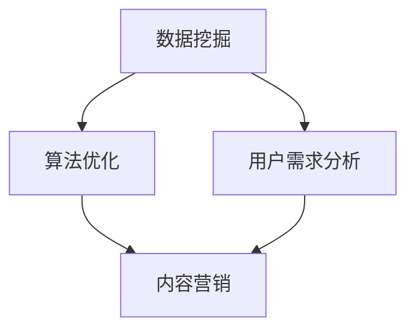

                 

 关键词：财经知识付费、热点话题、知识经济、数据挖掘、算法优化、用户需求分析、内容营销、精准推荐

> 摘要：在数字化时代，财经领域的知识付费正成为一股不可忽视的力量。本文将探讨如何及时把握热点话题，提升财经知识付费的效果。文章首先介绍了财经知识付费的现状，随后分析了数据挖掘和算法优化的关键作用，并探讨了用户需求分析和内容营销的策略。最后，文章提出了精准推荐系统的重要性，并展望了未来财经知识付费的发展趋势。

## 1. 背景介绍

随着互联网的普及和信息技术的发展，知识付费已成为知识经济时代的重要现象。尤其在财经领域，人们对专业知识和财经资讯的需求日益增长。知识付费不仅为专业人士提供了赚取收入的新渠道，也为用户提供了获取高质量财经内容的机会。然而，面对海量的财经信息，如何快速捕捉热点话题，提供有针对性的内容，成为知识付费平台面临的一大挑战。

### 1.1 财经知识付费的定义

财经知识付费是指用户为了获取专业财经知识和信息，而愿意支付相应费用的行为。它包括财经课程、专业分析报告、财经资讯订阅、专家咨询等多种形式。与传统免费内容相比，财经知识付费提供了更为专业、深度的内容，满足了用户对高质量财经信息的需求。

### 1.2 财经知识付费的现状

近年来，财经知识付费市场呈现出快速增长的趋势。根据相关数据显示，2019年全球知识付费市场规模已超过2500亿美元，其中财经领域的知识付费占据相当比例。特别是在中国，随着互联网金融的快速发展，越来越多的用户愿意为优质财经内容付费。例如，许多金融课程、投资策略报告和财经资讯平台都获得了用户的青睐。

### 1.3 热点话题的重要性

财经领域的热点话题往往代表了市场趋势和用户关注点。把握热点话题，不仅可以吸引更多用户，还可以提高知识付费平台的内容质量和用户粘性。因此，及时捕捉和回应热点话题，是财经知识付费平台的核心竞争力之一。

## 2. 核心概念与联系

### 2.1 数据挖掘

数据挖掘是利用计算机技术和统计学方法，从海量数据中提取出有价值信息的过程。在财经知识付费领域，数据挖掘主要用于分析用户行为数据、市场数据等，以发现潜在的用户需求和市场趋势。

### 2.2 算法优化

算法优化是指通过改进算法模型和计算方法，提高数据处理和分析的效率和准确性。在财经知识付费领域，算法优化主要用于构建精准推荐系统、优化内容发布策略等。

### 2.3 用户需求分析

用户需求分析是了解用户行为、需求和偏好，以提供更符合用户期望的内容和服务。在财经知识付费领域，用户需求分析有助于识别热点话题、优化内容结构、提高用户满意度。

### 2.4 内容营销

内容营销是通过提供有价值的内容，吸引用户关注并促进用户转化的过程。在财经知识付费领域，内容营销旨在通过制作高质量、有吸引力的财经内容，提升用户对平台的认知和信任度。

### 2.5 Mermaid 流程图

以下是一个简化的 Mermaid 流程图，展示了财经知识付费系统中数据挖掘、算法优化、用户需求分析和内容营销等核心环节的相互关系。



## 3. 核心算法原理 & 具体操作步骤

### 3.1 算法原理概述

在财经知识付费领域，核心算法主要包括数据挖掘算法和推荐算法。数据挖掘算法用于分析用户行为数据和财经信息，发现潜在热点话题。推荐算法则根据用户需求和偏好，为用户提供个性化的财经内容。

### 3.2 算法步骤详解

#### 3.2.1 数据挖掘算法

1. 数据收集：从各类财经平台、社交媒体和用户行为数据中收集相关数据。
2. 数据清洗：去除重复、无效和错误的数据，保证数据质量。
3. 数据分析：使用统计学方法和机器学习算法，分析用户行为和财经信息，识别热点话题。
4. 结果展示：将分析结果以图表、报告等形式展示给用户和管理者。

#### 3.2.2 推荐算法

1. 用户建模：构建用户行为和偏好模型，包括用户标签、兴趣偏好等。
2. 内容建模：分析财经内容特征，构建内容标签和分类模型。
3. 推荐策略：基于用户建模和内容建模，为用户推荐感兴趣的内容。
4. 评价反馈：收集用户对推荐内容的评价和反馈，优化推荐算法。

### 3.3 算法优缺点

#### 数据挖掘算法

- 优点：能够从海量数据中提取有价值信息，提高热点话题识别的准确性。
- 缺点：数据处理和分析过程复杂，对计算资源要求较高。

#### 推荐算法

- 优点：能够为用户推荐个性化内容，提高用户满意度和粘性。
- 缺点：推荐算法依赖于用户数据，可能存在数据偏差和隐私问题。

### 3.4 算法应用领域

- 金融市场分析：通过数据挖掘算法，分析市场趋势和风险，为投资者提供决策支持。
- 投资咨询：基于推荐算法，为用户提供个性化的投资建议和策略。
- 财经资讯订阅：通过推荐系统，为用户提供感兴趣的热点财经资讯。

## 4. 数学模型和公式 & 详细讲解 & 举例说明

### 4.1 数学模型构建

在财经知识付费领域，常用的数学模型包括线性回归、逻辑回归和支持向量机等。以下以线性回归为例，介绍数学模型的基本构建过程。

#### 线性回归模型

假设我们有一个样本数据集，包含用户行为数据（如浏览量、购买记录等）和目标变量（如用户满意度）。线性回归模型试图通过拟合一条直线，将用户行为数据与目标变量联系起来。

- 输入：用户行为数据 $X$（特征向量），目标变量 $Y$（标量）。
- 输出：拟合直线的参数 $w$（权重向量）。

线性回归模型的基本公式为：

$$Y = w \cdot X + b$$

其中，$b$ 为偏置项，$w$ 为权重向量。

### 4.2 公式推导过程

线性回归模型的推导过程主要包括以下几个步骤：

1. 模型假设：假设目标变量 $Y$ 是用户行为数据 $X$ 的线性函数，即 $Y = w \cdot X + b$。
2. 模型损失函数：定义模型损失函数，用于衡量预测值与真实值之间的差异。常用的损失函数为均方误差（MSE），即：

$$L(w, b) = \frac{1}{2} \sum_{i=1}^{n} (Y_i - (w \cdot X_i + b))^2$$

3. 最小化损失函数：使用梯度下降法或其他优化算法，最小化损失函数，求得最优参数 $w$ 和 $b$。

### 4.3 案例分析与讲解

假设我们有一个包含用户浏览量和购买记录的数据集，目标变量为用户满意度。以下是一个简化的案例，介绍如何使用线性回归模型分析用户满意度。

1. 数据收集：从数据集中提取用户浏览量和购买记录，作为输入特征向量 $X$。
2. 数据预处理：对数据进行归一化处理，消除不同特征之间的量纲差异。
3. 模型训练：使用训练数据集，训练线性回归模型，求得最优参数 $w$ 和 $b$。
4. 模型评估：使用测试数据集，评估模型预测效果，计算均方误差（MSE）。

通过上述步骤，我们可以得到一个用于预测用户满意度的线性回归模型。在实际应用中，可以根据用户浏览量和购买记录，预测用户满意度，从而为用户提供更有针对性的财经内容。

## 5. 项目实践：代码实例和详细解释说明

### 5.1 开发环境搭建

在本文中，我们将使用 Python 作为编程语言，结合常用的数据分析和机器学习库，如 Pandas、Scikit-learn 和 Matplotlib。以下是开发环境的搭建步骤：

1. 安装 Python（版本 3.8 或更高版本）。
2. 安装常用库：`pip install pandas scikit-learn matplotlib numpy`。

### 5.2 源代码详细实现

以下是一个简化的 Python 代码示例，用于实现线性回归模型预测用户满意度。

```python
import pandas as pd
from sklearn.linear_model import LinearRegression
from sklearn.model_selection import train_test_split
from sklearn.metrics import mean_squared_error

# 5.2.1 数据准备
# 加载数据集
data = pd.read_csv('user_data.csv')
X = data[['browse_count', 'purchase_record']]
y = data['satisfaction']

# 划分训练集和测试集
X_train, X_test, y_train, y_test = train_test_split(X, y, test_size=0.2, random_state=42)

# 5.2.2 模型训练
# 创建线性回归模型
model = LinearRegression()
model.fit(X_train, y_train)

# 5.2.3 模型评估
# 预测测试集
y_pred = model.predict(X_test)

# 计算均方误差
mse = mean_squared_error(y_test, y_pred)
print(f'MSE: {mse}')

# 5.2.4 结果可视化
import matplotlib.pyplot as plt

plt.scatter(X_test['browse_count'], y_test, color='red', label='真实值')
plt.plot(X_test['browse_count'], y_pred, color='blue', label='预测值')
plt.xlabel('浏览量')
plt.ylabel('满意度')
plt.legend()
plt.show()
```

### 5.3 代码解读与分析

1. **数据准备**：首先，我们使用 Pandas 读取用户数据，并将其分为特征向量 $X$ 和目标变量 $y$。接着，使用 Scikit-learn 的 `train_test_split` 函数，将数据集划分为训练集和测试集。

2. **模型训练**：创建一个线性回归模型对象，并使用 `fit` 方法训练模型。这里我们使用了 Scikit-learn 中的 `LinearRegression` 类。

3. **模型评估**：使用 `predict` 方法对测试集进行预测，并计算均方误差（MSE），以评估模型性能。

4. **结果可视化**：使用 Matplotlib 绘制散点图和拟合直线，展示模型预测结果。

### 5.4 运行结果展示

运行上述代码后，我们将得到一个可视化结果，展示用户浏览量和满意度之间的关系，以及线性回归模型的预测结果。通过分析可视化结果，我们可以更好地理解用户行为对满意度的影响，为后续内容营销提供数据支持。

## 6. 实际应用场景

### 6.1 财经知识付费平台

在财经知识付费平台中，数据挖掘和算法优化有助于提高内容质量和用户体验。以下是一个典型的应用场景：

1. **用户需求分析**：通过分析用户浏览、购买和评论行为，识别用户感兴趣的热点话题。
2. **内容推荐**：基于用户需求和内容特征，为用户推荐个性化的财经内容。
3. **营销活动**：针对热点话题，设计有针对性的营销活动，吸引更多用户关注和参与。

### 6.2 投资顾问

在投资顾问领域，数据挖掘和算法优化有助于提高投资决策的准确性。以下是一个典型的应用场景：

1. **市场趋势分析**：通过分析历史数据，识别市场趋势和潜在机会。
2. **投资组合优化**：基于用户风险偏好和资产配置策略，为用户推荐最优的投资组合。
3. **风险评估**：使用算法模型，对投资组合进行风险评估，降低潜在风险。

### 6.3 财经资讯订阅

在财经资讯订阅领域，数据挖掘和算法优化有助于提高内容质量和用户满意度。以下是一个典型的应用场景：

1. **热点话题识别**：通过分析用户行为和财经信息，识别当前热点话题。
2. **内容推送**：基于用户兴趣和热点话题，为用户推送相关的财经资讯。
3. **用户反馈**：收集用户对资讯内容的反馈，优化推送策略，提高用户满意度。

## 7. 工具和资源推荐

### 7.1 学习资源推荐

1. **《Python数据分析》**：这是一本经典的 Python 数据分析入门书籍，适合初学者学习。
2. **《机器学习实战》**：这本书介绍了多种机器学习算法，包括线性回归、逻辑回归等，适合有一定编程基础的读者。

### 7.2 开发工具推荐

1. **Jupyter Notebook**：这是一个强大的交互式开发环境，适合进行数据分析、机器学习等任务。
2. **PyCharm**：这是一个功能丰富的 Python 集成开发环境（IDE），提供代码补全、调试、版本控制等功能。

### 7.3 相关论文推荐

1. **“ recommender systems”**：这篇综述论文系统地介绍了推荐系统的基本概念、算法和应用。
2. **“ data mining for online advertising”**：这篇论文探讨了数据挖掘在在线广告领域的应用，包括用户行为分析和广告投放策略。

## 8. 总结：未来发展趋势与挑战

### 8.1 研究成果总结

本文通过对财经知识付费领域的分析，总结了数据挖掘、算法优化、用户需求分析和内容营销等关键环节。研究发现，数据挖掘和算法优化有助于提高内容质量和用户体验，用户需求分析和内容营销则有助于提升用户满意度和粘性。

### 8.2 未来发展趋势

1. **个性化推荐**：随着用户数据的不断积累，个性化推荐将越来越精准，为用户带来更好的体验。
2. **知识图谱**：知识图谱技术将在财经知识付费领域得到广泛应用，帮助用户更好地理解财经信息。
3. **区块链**：区块链技术在知识付费领域具有潜在应用，有助于提高交易透明度和安全性。

### 8.3 面临的挑战

1. **数据隐私**：数据挖掘和推荐算法依赖于用户数据，如何保护用户隐私成为一大挑战。
2. **内容质量**：在海量信息中，如何筛选出高质量的内容，提高用户满意度，是一个亟待解决的问题。
3. **技术瓶颈**：随着数据量的增长，数据处理和分析的技术瓶颈逐渐显现，需要不断优化算法和计算方法。

### 8.4 研究展望

未来，财经知识付费领域将继续发展，探索更多创新技术和应用场景。如何更好地解决数据隐私、内容质量和技术瓶颈等问题，将是研究的重点方向。同时，跨学科合作和知识融合也将成为推动财经知识付费发展的重要力量。

## 9. 附录：常见问题与解答

### 9.1 数据挖掘算法有哪些类型？

数据挖掘算法主要包括以下类型：

1. **分类算法**：用于将数据分为不同的类别。常见的分类算法有决策树、随机森林、支持向量机等。
2. **聚类算法**：用于将数据分为多个簇。常见的聚类算法有K-均值、层次聚类等。
3. **关联规则挖掘**：用于发现数据之间的关联关系。常见的算法有Apriori算法、FP-growth算法等。
4. **异常检测**：用于发现数据中的异常值。常见的算法有孤立森林、Local Outlier Factor等。

### 9.2 推荐算法有哪些类型？

推荐算法主要包括以下类型：

1. **基于内容的推荐**：根据用户的历史行为和兴趣，为用户推荐相似的内容。
2. **协同过滤推荐**：基于用户之间的相似性，为用户推荐其他用户喜欢的商品或内容。常见的协同过滤算法有用户基于的协同过滤、项目基于的协同过滤等。
3. **基于模型的推荐**：使用机器学习模型，如矩阵分解、深度学习等，预测用户对商品的偏好，进行个性化推荐。

### 9.3 如何保护用户隐私？

在数据挖掘和推荐算法中，保护用户隐私至关重要。以下是一些常见的隐私保护方法：

1. **数据去识别化**：对用户数据进行去识别化处理，如加密、脱敏等。
2. **差分隐私**：在处理用户数据时，引入噪声，以降低隐私泄露的风险。
3. **隐私预算**：限制对用户数据的访问次数和查询范围，以降低隐私风险。

### 9.4 如何提高内容质量？

提高内容质量可以从以下几个方面入手：

1. **内容审核**：对上传的内容进行严格审核，确保内容的真实性和合规性。
2. **用户反馈**：收集用户对内容的反馈，不断优化和调整内容。
3. **专家评审**：邀请行业专家对内容进行评审，确保内容的权威性和准确性。
4. **用户数据分析**：通过分析用户行为数据，了解用户需求，提供更符合用户期望的内容。

[END]
```

