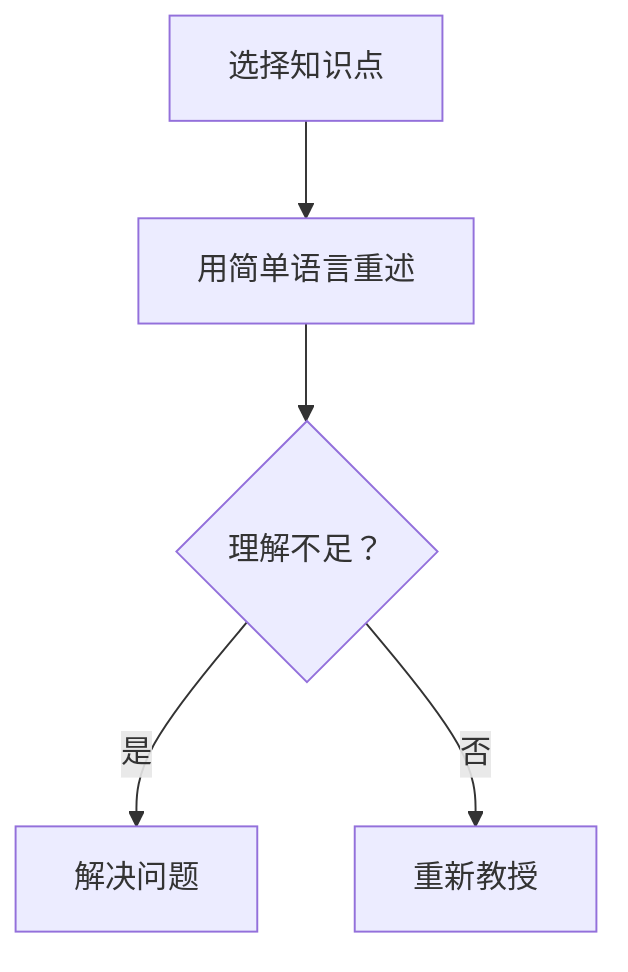

                 

关键词：费曼学习法、误解、真相、技术学习、认知迭代、教育方法

> 摘要：费曼学习法是一种广受欢迎的学习策略，但其应用和理解中存在许多误解。本文旨在揭示这些误解，阐述费曼学习法的真正价值，并提供实用的技术学习建议，帮助读者更有效地掌握知识。

## 1. 背景介绍

费曼学习法，起源于著名物理学家理查德·费曼的学习技巧，是一种以“教授”作为学习检验手段的学习方法。费曼学习法的核心思想是通过将知识传授给他人来加深对知识点的理解。这种方法强调以简单、清晰的语言表达复杂概念，从而验证自己的知识是否扎实。

尽管费曼学习法在教育和自学领域受到广泛推崇，但其应用和理解过程中存在许多误区。本文将探讨这些误区，并深入分析费曼学习法的真正价值和适用场景。

## 2. 核心概念与联系

### 2.1 费曼学习法的核心概念

费曼学习法的主要步骤包括：

1. **选择知识点**：确定要学习的知识点。
2. **用简单语言重述**：尝试用自己的话来解释这些知识点。
3. **识别不理解的部分**：在重述过程中，注意识别自己不理解的点。
4. **解决问题**：通过查阅资料或请教他人，解决不理解的部分。
5. **重新教授**：再次尝试用简单、清晰的语言传授这些知识点。

### 2.2 费曼学习法的Mermaid流程图



## 3. 核心算法原理 & 具体操作步骤

### 3.1 算法原理概述

费曼学习法基于以下认知原理：

- **主动学习**：通过主动教授他人，促进知识的内化和记忆。
- **反馈机制**：通过他人的反馈，发现和弥补知识盲点。
- **认知迭代**：通过反复的教授和反馈，逐步深化对知识的理解。

### 3.2 算法步骤详解

1. **选择知识点**：从学习材料中选择一个具体的知识点。
2. **用简单语言重述**：尝试用自己的语言解释这个知识点，使其变得简单易懂。
3. **识别不理解的部分**：在重述过程中，注意识别那些难以解释或理解不深刻的部分。
4. **解决问题**：通过查阅资料、请教他人或进一步学习，解决不理解的部分。
5. **重新教授**：再次尝试用简单、清晰的语言传授这个知识点，并寻求他人的反馈。

### 3.3 算法优缺点

**优点**：

- **促进深度理解**：通过教授他人，加深对知识点的理解和记忆。
- **发现知识盲点**：在重述过程中，能够发现自己的理解不足，及时补充。
- **提高表达能力**：通过用简单语言解释复杂概念，提升自己的表达能力。

**缺点**：

- **时间成本**：费曼学习法需要花费大量时间，不适合急于求成的学习者。
- **适用范围**：对于某些知识点，可能难以通过教授他人来验证自己的理解。

### 3.4 算法应用领域

费曼学习法适用于各个学科领域，尤其适合以下场景：

- **技术学习**：帮助程序员、数据科学家等理解复杂的技术概念。
- **学术研究**：帮助研究生、博士生等整理和深化研究课题。
- **职业教育**：帮助专业人士提升对专业知识的理解和应用能力。

## 4. 数学模型和公式 & 详细讲解 & 举例说明

### 4.1 数学模型构建

费曼学习法的数学模型可以表示为：

\[ L(t) = f(P(t), I(t), R(t)) \]

其中：

- \( L(t) \) 表示在时间 \( t \) 的学习效果。
- \( P(t) \) 表示在时间 \( t \) 的教授次数。
- \( I(t) \) 表示在时间 \( t \) 的理解深度。
- \( R(t) \) 表示在时间 \( t \) 的反馈质量。

### 4.2 公式推导过程

\[ L(t) = f(P(t), I(t), R(t)) \]

- \( P(t) \) 与 \( L(t) \) 成正相关，教授次数越多，学习效果越好。
- \( I(t) \) 与 \( L(t) \) 成正相关，理解深度越高，学习效果越好。
- \( R(t) \) 与 \( L(t) \) 成正相关，反馈质量越高，学习效果越好。

### 4.3 案例分析与讲解

**案例**：学习一个复杂的算法。

1. **选择知识点**：选择一个复杂的算法作为学习目标。
2. **用简单语言重述**：尝试用自己的语言解释这个算法，使其变得简单易懂。
3. **识别不理解的部分**：在解释过程中，注意识别那些难以解释的部分。
4. **解决问题**：查阅资料或请教他人，解决不理解的部分。
5. **重新教授**：再次尝试用简单、清晰的语言传授这个算法，并寻求他人的反馈。

通过这个案例，我们可以看到费曼学习法在技术学习中的应用。

## 5. 项目实践：代码实例和详细解释说明

### 5.1 开发环境搭建

为了更好地理解费曼学习法在编程中的应用，我们首先需要搭建一个简单的编程环境。以下是使用Python搭建开发环境的步骤：

1. **安装Python**：在官方网站下载并安装Python。
2. **安装IDE**：选择一个合适的集成开发环境（如PyCharm、Visual Studio Code等）。
3. **安装依赖库**：根据项目需求，安装必要的依赖库。

### 5.2 源代码详细实现

以下是一个简单的Python代码实例，用于演示费曼学习法在编程中的应用：

```python
# 费曼学习法示例

def explain_concept():
    """
    用简单语言解释一个复杂概念。
    """
    print("这是一个简单的算法，用于计算两个数的和。")

def main():
    """
    主函数，用于执行程序。
    """
    explain_concept()
    # 获取用户输入
    num1 = int(input("请输入第一个数："))
    num2 = int(input("请输入第二个数："))
    # 计算和
    sum = num1 + num2
    # 输出结果
    print("两数之和为：", sum)

if __name__ == "__main__":
    main()
```

### 5.3 代码解读与分析

1. **explain_concept函数**：用于解释一个复杂概念，这里是一个简单的算法。
2. **main函数**：主函数，用于执行程序，包括解释概念、获取用户输入、计算和输出结果。
3. **if __name__ == "__main__":**：确保程序在直接运行时执行main函数。

### 5.4 运行结果展示

```shell
$ python feynman_example.py
这是一个简单的算法，用于计算两个数的和。
请输入第一个数：5
请输入第二个数：10
两数之和为： 15
```

通过这个示例，我们可以看到费曼学习法在编程中的应用，通过解释概念来加深对代码的理解。

## 6. 实际应用场景

### 6.1 技术学习

费曼学习法非常适合技术学习，尤其是在理解和掌握复杂算法、架构和系统时。通过将知识传授给他人，可以更好地验证自己的理解，并发现潜在的知识盲点。

### 6.2 教育教学

在教育教学领域，费曼学习法可以作为一种有效的教学方法。教师可以引导学生使用费曼学习法来整理和深化知识点，从而提高学习效果。

### 6.3 专业培训

在专业培训中，费曼学习法可以帮助学员快速掌握知识点，并通过实践和教授他人来加深理解。这种方法特别适用于需要快速掌握大量知识的培训课程。

## 7. 未来应用展望

随着人工智能和教育的融合，费曼学习法有望在更广泛的领域中发挥作用。未来，我们可以预见以下应用场景：

- **在线教育平台**：在线教育平台可以集成费曼学习法，帮助学习者更好地理解和掌握知识。
- **智能学习系统**：智能学习系统可以基于费曼学习法，为学习者提供个性化的学习建议和反馈。
- **虚拟现实教学**：虚拟现实教学可以结合费曼学习法，提供沉浸式的学习体验。

## 8. 总结：未来发展趋势与挑战

### 8.1 研究成果总结

费曼学习法作为一种有效的学习策略，已经在多个领域得到验证和应用。研究表明，费曼学习法可以显著提高学习效果，帮助学习者更深入地理解和掌握知识。

### 8.2 未来发展趋势

未来，费曼学习法有望在以下方面得到进一步发展和应用：

- **在线教育**：随着在线教育的普及，费曼学习法将成为在线教育的重要组成部分。
- **智能学习**：智能学习系统可以结合费曼学习法，为学习者提供更加个性化的学习体验。
- **跨学科应用**：费曼学习法将在更多学科领域得到应用，特别是在需要深入理解复杂知识的领域。

### 8.3 面临的挑战

尽管费曼学习法具有许多优势，但在实际应用中仍面临以下挑战：

- **时间成本**：费曼学习法需要花费大量时间，不适合急于求成的学习者。
- **反馈质量**：费曼学习法的效果很大程度上取决于反馈质量，如何获得高质量反馈是一个挑战。
- **适用范围**：费曼学习法并不适用于所有学习场景，需要根据实际情况选择合适的学习方法。

### 8.4 研究展望

未来的研究可以关注以下方向：

- **效率优化**：研究如何优化费曼学习法的效率，使其在更短的时间内达到更好的学习效果。
- **反馈机制**：研究如何设计有效的反馈机制，提高费曼学习法的反馈质量。
- **跨学科应用**：探索费曼学习法在不同学科领域的应用，并总结其通用方法和经验。

## 9. 附录：常见问题与解答

### 9.1 费曼学习法是否适用于所有人？

费曼学习法并非适用于所有人，但它的核心思想——通过教授他人来加深对知识的理解——是普遍适用的。对于理解能力强、喜欢表达和分享的学习者，费曼学习法的效果尤为显著。

### 9.2 费曼学习法需要多少时间才能见效？

费曼学习法的效果因人而异，但通常在几周内就能看到显著的效果。关键在于持续不断地使用这种方法，并在实践中不断调整和完善。

### 9.3 费曼学习法是否适用于所有学科？

费曼学习法适用于大多数学科，特别是那些需要深入理解和应用知识的领域。对于一些高度实践性的学科，如体育和艺术，费曼学习法可能需要结合其他学习策略。

## 作者署名

本文作者：禅与计算机程序设计艺术 / Zen and the Art of Computer Programming

