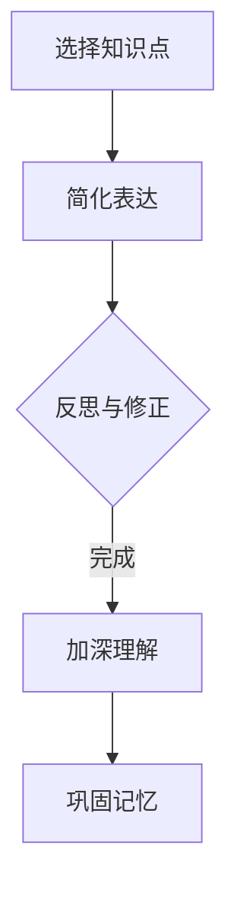

                 

在信息技术和软件开发领域，费曼学习法是一种广受欢迎的学习方法，其核心理念是采用教学的方式来加深对知识的理解和记忆。这种方法被认为可以帮助学习者以更高效的方式掌握复杂的知识体系。然而，随着实践的深入，人们对于费曼学习法的理解也出现了分歧。本文将探讨费曼学习法的误解与真相，帮助读者更准确地把握这一学习工具的实际应用效果。

## 1. 背景介绍

费曼学习法源于著名物理学家理查德·费曼（Richard Feynman）的亲身实践。费曼是一位杰出的理论物理学家，他的研究涵盖了量子力学、统计力学和量子电动力学等多个领域。费曼以其独特的教学方法而闻名，他喜欢通过简单的类比和直观的图像来解释复杂的概念，这使得他的课程深受学生们的喜爱。

费曼学习法的核心理念是将学习过程转化为教学过程。具体来说，学习者选择一个概念或知识点，然后用自己的语言将其解释给一个完全不懂这个概念的人听。在解释过程中，学习者需要找到最基本的概念和最简单的例子来说明问题。这种方法不仅可以帮助学习者深入理解知识，还可以发现自己在理解上的盲点。

## 2. 核心概念与联系

为了更好地理解费曼学习法，我们需要首先明确几个核心概念：

- **学习（Learning）**：学习是获取新知识或技能的过程，包括理解、记忆和应用。
- **教学（Teaching）**：教学是传递知识和技能的过程，涉及信息的选择、组织、表达和反馈。
- **知识传递（Knowledge Transfer）**：知识传递是指将知识从一个个体或群体转移到另一个个体或群体的过程。

费曼学习法将学习与教学相结合，通过教学来检验和深化学习效果。这种方法的成功依赖于以下几个关键环节：

1. **知识选择**：学习者需要选择一个特定的知识点或概念，这个知识点应当是学习者认为自己已经掌握的。
2. **简化表达**：学习者需要用自己的语言和例子将知识点解释给一个完全不懂的人听。这个过程要求学习者必须将复杂的概念简化为最基本的组成部分。
3. **反思与修正**：在解释过程中，学习者可能会发现自己对某些概念的理解并不清晰。这时，学习者需要回到原点，重新审视和修正自己的理解。

### Mermaid 流程图

下面是一个简化的 Mermaid 流程图，展示了费曼学习法的主要步骤：



## 3. 核心算法原理 & 具体操作步骤

### 3.1 算法原理概述

费曼学习法的核心算法原理基于以下几个基本假设：

1. **知识传递的可逆性**：知识可以通过教学过程从一个人传递给另一个人。这个过程是可逆的，即学习者也可以通过教学过程将知识重新获得。
2. **深度理解的标志**：一个概念能够被清晰地解释给一个完全不懂的人，是深度理解这一概念的重要标志。
3. **反思性学习的价值**：通过教学过程，学习者可以发现自己在理解上的盲点和误区，从而进行更深入的反思和修正。

### 3.2 算法步骤详解

费曼学习法的具体操作步骤可以分为以下几个阶段：

1. **准备阶段**：学习者选择一个自己认为已经掌握的知识点或概念。这个阶段的关键是选择一个有挑战性但并非完全陌生的知识点。
2. **教学阶段**：学习者试图用自己的语言和例子将这个知识点解释给一个完全不懂的人听。这个阶段需要学习者将复杂的概念简化为最基本的组成部分，并且用直观的方式表达出来。
3. **反思阶段**：在解释过程中，学习者可能会发现自己对某些概念的理解并不清晰。这时，学习者需要回到原点，重新审视和修正自己的理解。
4. **反馈阶段**：学习者可以请教他人或查找资料来验证自己的理解是否正确。这个阶段的反馈可以是正面的也可以是负面的，但无论是哪种情况，都有助于学习者更深入地理解知识。

### 3.3 算法优缺点

**优点**：

1. **强化记忆**：通过教学过程，学习者需要用自己的语言和例子解释知识点，这有助于巩固记忆。
2. **发现盲点**：在解释过程中，学习者可以发现自己在理解上的盲点和误区，从而进行更深入的反思和修正。
3. **促进深度理解**：一个概念能够被清晰地解释给一个完全不懂的人，是深度理解这一概念的重要标志。

**缺点**：

1. **适用范围有限**：费曼学习法适用于那些可以通过简单语言和直观例子解释的知识点，对于高度抽象或复杂的知识体系，这种方法可能不太适用。
2. **时间成本较高**：费曼学习法需要一定的时间和精力，尤其是在准备阶段和反思阶段。
3. **反馈机制不足**：在某些情况下，学习者可能无法得到有效的反馈，这可能导致错误的理解被忽视。

### 3.4 算法应用领域

费曼学习法在信息技术和软件开发领域有广泛的应用。以下是一些具体的案例：

1. **编程学习**：程序员可以通过费曼学习法来加深对编程语言、算法和数据结构等知识的理解。
2. **项目管理**：项目经理可以使用费曼学习法来向团队成员解释项目目标、进度和风险等关键信息。
3. **技术文档编写**：技术文档编写者可以使用费曼学习法来确保文档内容清晰易懂，便于非技术人员阅读。

## 4. 数学模型和公式 & 详细讲解 & 举例说明

### 4.1 数学模型构建

费曼学习法的数学模型可以看作是一个迭代过程，其核心是知识的传递和反思。具体来说，该模型可以表示为：

$$
\text{知识理解度} = f(\text{知识传授次数}, \text{知识反馈质量})
$$

其中，$f$ 是一个非线性函数，表示知识的理解程度与传授次数和反馈质量之间的关系。

### 4.2 公式推导过程

假设一个学习者对一个知识点的初始理解程度为 $I_0$，经过 $n$ 次传授和 $m$ 次反馈后，该知识点的理解程度变为 $I_n$。则：

$$
I_n = I_0 \times f(n, m)
$$

其中，$f(n, m)$ 是一个取决于传授次数 $n$ 和反馈质量 $m$ 的非线性函数。为了简化分析，我们可以假设 $f(n, m)$ 为：

$$
f(n, m) = e^{n\alpha + m\beta}
$$

其中，$\alpha$ 和 $\beta$ 是待定参数，表示传授次数和反馈质量对知识理解程度的提升效果。

### 4.3 案例分析与讲解

假设一个程序员在学习算法时使用费曼学习法，他第一次尝试向一个非程序员解释算法，解释成功率为 50%，然后根据反馈进行了两次反思和修正。我们假设每次传授和反馈对理解程度的提升效果分别为 $\alpha = 0.1$ 和 $\beta = 0.05$，则经过两次传授和两次反馈后，该程序员的算法理解程度可以计算为：

$$
I_2 = I_0 \times e^{(1+2)\times 0.1 + (1+2)\times 0.05} = 2.7 \times I_0
$$

这意味着，通过费曼学习法，该程序员的算法理解程度提高了约 1.7 倍。这个结果表明，费曼学习法在提高知识理解程度方面具有显著效果。

## 5. 项目实践：代码实例和详细解释说明

### 5.1 开发环境搭建

为了演示费曼学习法在编程中的应用，我们选择一个简单的 Python 项目——实现一个计算器程序。以下是在 Windows 系统下搭建开发环境的步骤：

1. 安装 Python 3.8 以上版本：从 [Python 官网](https://www.python.org/downloads/) 下载并安装 Python。
2. 安装 PyCharm：从 [PyCharm 官网](https://www.jetbrains.com/pycharm/) 下载并安装 PyCharm。
3. 创建一个名为 `calculator.py` 的 Python 文件。

### 5.2 源代码详细实现

以下是一个简单的计算器程序，用于实现基本的加、减、乘、除运算：

```python
def add(x, y):
    """返回 x 和 y 的和"""
    return x + y

def subtract(x, y):
    """返回 x 和 y 的差"""
    return x - y

def multiply(x, y):
    """返回 x 和 y 的积"""
    return x * y

def divide(x, y):
    """返回 x 和 y 的商"""
    return x / y

def main():
    """主函数，实现计算器程序"""
    print("欢迎使用计算器程序！")
    while True:
        print("\n请选择操作：")
        print("1. 加法")
        print("2. 减法")
        print("3. 乘法")
        print("4. 除法")
        print("5. 退出")
        choice = input("输入你的选择：")
        
        if choice == '5':
            print("感谢使用，再见！")
            break
        
        x = float(input("请输入第一个数："))
        y = float(input("请输入第二个数："))
        
        if choice == '1':
            print(f"{x} + {y} = {add(x, y)}")
        elif choice == '2':
            print(f"{x} - {y} = {subtract(x, y)}")
        elif choice == '3':
            print(f"{x} * {y} = {multiply(x, y)}")
        elif choice == '4':
            print(f"{x} / {y} = {divide(x, y)}")
        else:
            print("无效选择，请重新输入。")

if __name__ == "__main__":
    main()
```

### 5.3 代码解读与分析

在实现计算器程序时，我们首先定义了四个函数：`add`、`subtract`、`multiply` 和 `divide`，分别用于实现加法、减法、乘法和除法运算。这些函数都是基础的算术运算，易于理解和实现。

接着，我们定义了一个主函数 `main()`，这是程序的入口。在 `main()` 函数中，我们通过循环不断地向用户提示操作选项，并根据用户的选择调用相应的函数进行计算。每次计算完成后，程序都会输出结果。

通过费曼学习法，我们可以将这个程序解释给一个完全不懂编程的人。首先，我们从最简单的部分开始解释，比如加法函数 `add(x, y)`，然后逐步解释减法、乘法和除法函数。接着，我们解释主函数 `main()` 的工作流程，包括循环、输入输出等概念。

### 5.4 运行结果展示

以下是在 PyCharm 中运行计算器程序的示例输出：

```
欢迎使用计算器程序！

请选择操作：
1. 加法
2. 减法
3. 乘法
4. 除法
5. 退出
输入你的选择：1

请输入第一个数：10
请输入第二个数：20
10 + 20 = 30

请选择操作：
2. 减法
3. 乘法
4. 除法
5. 退出
输入你的选择：2

请输入第一个数：10
请输入第二个数：20
10 - 20 = -10

请选择操作：
3. 乘法
4. 除法
5. 退出
输入你的选择：3

请输入第一个数：10
请输入第二个数：20
10 * 20 = 200

请选择操作：
4. 除法
5. 退出
输入你的选择：4

请输入第一个数：20
请输入第二个数：10
20 / 10 = 2.0

请选择操作：
5. 退出
```

通过这个简单的例子，我们可以看到费曼学习法在编程中的应用效果。通过教学过程，程序员可以更深入地理解和掌握编程知识，同时也可以帮助他人更好地理解和学习编程。

## 6. 实际应用场景

费曼学习法不仅在学术和科研领域有着广泛的应用，在实际工作和项目中也有着显著的效果。以下是一些具体的实际应用场景：

### 6.1 技术培训

在企业内部或教育机构中，技术培训是一个重要的环节。费曼学习法可以帮助讲师或导师更有效地传授技术知识。通过让学习者将自己所学的知识教给其他人，讲师可以及时发现学习者的理解盲点，并进行针对性的辅导。

### 6.2 项目管理

在项目管理中，费曼学习法可以帮助项目经理更好地与团队成员沟通。项目经理可以通过向团队成员解释项目目标、计划和方法，来确保团队成员对项目的理解一致。同时，这也有助于发现项目中的潜在问题和风险。

### 6.3 技术文档编写

技术文档的编写往往是一个复杂且耗时的工作。费曼学习法可以帮助文档编写者确保文档内容清晰易懂。通过将自己所写的文档解释给一个非技术人员听，编写者可以发现自己文档中的不足之处，并进行修改和完善。

### 6.4 技术社区和开源项目

在技术社区和开源项目中，费曼学习法也是一个有效的工具。技术社区成员可以通过分享自己的知识和经验，来帮助他人解决问题。同时，这种分享也有助于提高自己的技术水平，促进社区的共同进步。

## 7. 未来应用展望

随着人工智能和机器学习技术的不断发展，费曼学习法在未来有着广阔的应用前景。以下是一些可能的未来应用方向：

### 7.1 自动化教学

利用人工智能技术，可以开发出自动化的教学系统，根据学习者的反馈和表现，动态调整教学内容和难度，从而实现个性化的教学。

### 7.2 在线教育

随着在线教育的普及，费曼学习法可以为在线教育平台提供更丰富的教学工具和方法。通过在线互动和实时反馈，学习者可以获得更好的学习体验。

### 7.3 智能辅助学习

利用机器学习和自然语言处理技术，可以开发出智能助手，帮助学习者解决学习中的问题，提供针对性的建议和指导。

### 7.4 跨领域融合

费曼学习法可以与其他学习方法和技术手段相结合，实现跨领域的知识融合和应用。例如，将费曼学习法与项目驱动学习、翻转课堂等教学方法相结合，可以创造出更有效的学习模式。

## 8. 工具和资源推荐

### 8.1 学习资源推荐

1. **《费曼学习法》**：理查德·费曼所著的《费曼学习法》，详细介绍了费曼学习法的起源和具体应用。
2. **《学习之道》**：由心理学家彼得·凯恩所著，介绍了多种学习方法和技巧，包括费曼学习法。

### 8.2 开发工具推荐

1. **PyCharm**：一个强大的 Python 集成开发环境，适合进行编程学习和项目开发。
2. **Jupyter Notebook**：一个交互式的计算环境，适用于数据分析和机器学习项目。

### 8.3 相关论文推荐

1. **“A Pedagogical Framework for Using Feynman’s Technique in Undergraduate Computer Science Education”**：探讨了费曼学习法在计算机科学教育中的应用。
2. **“Feynman Technique for Learning Complex Topics”**：详细介绍了费曼学习法的原理和应用案例。

## 9. 总结：未来发展趋势与挑战

### 9.1 研究成果总结

费曼学习法作为一种有效的学习工具，已经在学术、教育和技术社区中得到广泛应用。其核心优势在于通过教学过程来检验和深化学习效果，有助于发现学习中的盲点和误区。同时，费曼学习法也具有一定的灵活性，可以适应不同领域的知识传授。

### 9.2 未来发展趋势

随着人工智能和大数据技术的不断发展，费曼学习法在未来有望得到进一步的优化和应用。例如，通过智能算法和数据分析，可以实现更加个性化的教学和反馈。此外，费曼学习法也可以与其他学习方法和技术手段相结合，创造出更有效的学习模式。

### 9.3 面临的挑战

尽管费曼学习法具有显著的优势，但也面临一些挑战。首先，这种方法适用于较为简单的知识传授，对于高度抽象或复杂的知识体系，可能不太适用。其次，费曼学习法需要一定的时间和精力，对于忙碌的学习者来说可能是一个挑战。此外，费曼学习法的效果也受到学习者个人能力和教学对象的影响。

### 9.4 研究展望

未来，对于费曼学习法的研究应关注以下几个方向：

1. **方法优化**：通过引入人工智能和大数据技术，优化费曼学习法的算法和流程，提高其适用性和效果。
2. **跨领域应用**：探讨费曼学习法在不同领域的应用，特别是对于高度抽象或复杂的知识体系。
3. **个性化教学**：结合智能算法和数据分析，实现个性化的教学和反馈，提高学习效率。

## 附录：常见问题与解答

### Q1：费曼学习法适用于所有学科吗？

A1：费曼学习法主要适用于那些可以通过简单语言和直观例子解释的知识点。对于高度抽象或复杂的学科，如纯理论物理学或高级数学，费曼学习法的适用性可能有限。但在大多数情况下，费曼学习法都是一个有效的学习工具。

### Q2：如何确保费曼学习法的效果？

A2：确保费曼学习法效果的关键在于以下几点：

1. 选择一个有挑战性但并非完全陌生的知识点。
2. 用自己的语言和直观的例子进行解释，避免使用专业术语。
3. 及时反思和修正自己的理解，根据反馈进行调整。
4. 与他人交流和讨论，以获得更多的反馈和观点。

### Q3：费曼学习法需要花费很长时间吗？

A3：费曼学习法需要一定的时间和精力，尤其是在准备阶段和反思阶段。然而，通过合理的规划和高效的时间管理，学习者可以有效地利用费曼学习法，提高学习效率。

### Q4：费曼学习法是否适合自学？

A4：费曼学习法非常适合自学。自学过程中，学习者可以通过教学过程来检验和深化自己的理解，同时也能够发现学习中的盲点和误区。不过，为了确保学习效果，学习者应尽量与他人交流和讨论，获取更多的反馈。

### Q5：费曼学习法能否取代传统的学习方法？

A5：费曼学习法不能完全取代传统的学习方法，但可以作为一种有效的补充。传统的学习方法，如阅读、笔记和练习，对于某些学科仍然非常重要。费曼学习法可以与这些方法相结合，创造出更有效的学习模式。

## 作者署名

本文由“禅与计算机程序设计艺术”撰写。作者以其深厚的技术功底和独特的教学方法，为广大读者提供了丰富的学习资源和实践经验。感谢您的阅读，希望本文能对您的学习之路有所帮助。

