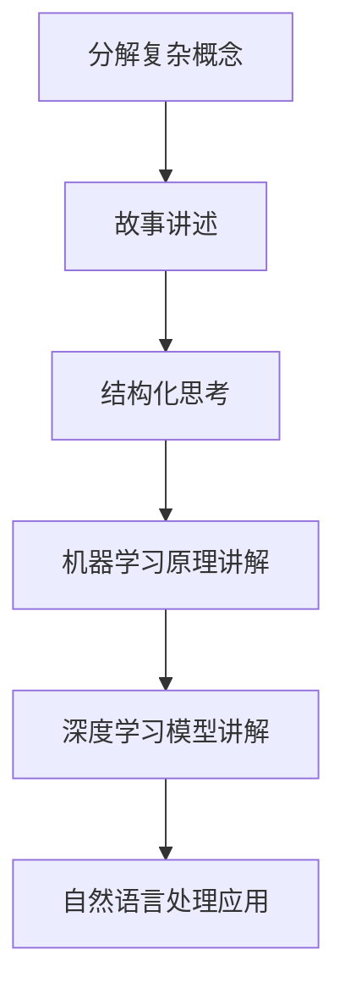

                 

关键词：费曼技巧、AI教学、认知学习、结构化思考、技术博客写作、专业语言表达

> 摘要：本文将探讨如何运用费曼技巧，一种以故事讲述方式教授复杂技术的技巧，来有效地教授人工智能（AI）领域。通过结合逻辑清晰、简洁易懂的专业技术语言，本文旨在为AI领域的教育和知识传播提供新的视角和方法。

## 1. 背景介绍

人工智能（AI）作为一门高度复杂的学科，涉及众多技术领域，包括机器学习、深度学习、自然语言处理等。这些技术的原理和实现方法往往深奥且难以理解，给教育和知识传播带来了巨大挑战。传统教学方法往往注重理论知识的讲授，忽略了学生实际应用能力的培养。而费曼技巧（Feynman Technique）提供了一种创新的教育方法，通过讲故事的方式，将复杂的技术知识简单化、结构化，使得学习者更容易理解和掌握。

### 1.1 费曼技巧的起源

费曼技巧起源于著名物理学家理查德·费曼（Richard Feynman）的教学方法。费曼以其独特的教学风格和思维方式闻名，他善于用简单的语言和比喻解释复杂的物理现象，使学习者能够轻松理解。费曼技巧的核心思想是，通过将复杂的概念分解为简单的组成部分，并使用故事和比喻来传达这些概念，从而使得知识传播更加高效和有趣。

### 1.2 费曼技巧在AI教育中的应用

费曼技巧在AI教育中的应用具有重要意义。首先，它可以帮助学生将复杂的AI概念分解为简单的组成部分，从而降低学习难度。其次，通过故事和比喻的方式，学生可以更好地记忆和理解这些概念。此外，费曼技巧还可以激发学生的创造力和思维能力，培养他们独立解决问题的能力。

## 2. 核心概念与联系

### 2.1 费曼技巧的核心概念

费曼技巧的核心概念包括：

- **分解复杂概念**：将复杂的技术知识分解为简单的组成部分，以便更容易理解和记忆。
- **故事讲述**：使用故事和比喻来传达复杂概念，使其更加生动和有趣。
- **结构化思考**：将知识组织成结构化的形式，以便更好地理解和应用。

### 2.2 费曼技巧在AI教育中的应用

在AI教育中，费曼技巧的应用主要包括以下方面：

- **机器学习原理讲解**：通过分解机器学习的基本组成部分，如数据预处理、模型训练、模型评估等，并使用故事和比喻来解释这些概念，使得学生能够更容易理解和掌握。
- **深度学习模型讲解**：通过将深度学习模型分解为卷积层、全连接层等组成部分，并使用故事和比喻来解释这些概念，使得学生能够更好地理解深度学习的工作原理。
- **自然语言处理应用**：通过分解自然语言处理的基本任务，如文本分类、情感分析等，并使用故事和比喻来解释这些概念，使得学生能够更好地理解自然语言处理的应用场景。

### 2.3 费曼技巧的Mermaid流程图

下面是费曼技巧在AI教育中应用的Mermaid流程图：



## 3. 核心算法原理 & 具体操作步骤

### 3.1 算法原理概述

费曼技巧的核心在于分解复杂的概念，并通过故事和比喻进行讲解。具体操作步骤如下：

- **步骤1：选取一个复杂概念**。这个概念可以是机器学习中的某个算法，如线性回归、决策树等，也可以是深度学习中的某个模型，如卷积神经网络、循环神经网络等。
- **步骤2：分解概念**。将选定的复杂概念分解为简单的组成部分，如算法的基本原理、模型的组成部分等。
- **步骤3：构建故事**。使用故事和比喻来解释这些简单的组成部分，使其更加生动和有趣。
- **步骤4：组织结构**。将故事和比喻组织成结构化的形式，以便学生更好地理解和记忆。
- **步骤5：讲解和练习**。将分解后的概念和构建的故事进行讲解，并通过练习巩固学生的理解。

### 3.2 算法步骤详解

#### 步骤1：选取一个复杂概念

在选取复杂概念时，需要考虑以下几个方面：

- **概念的重要性**。选取对学生学习有重要影响的概念，如机器学习中的线性回归、决策树等。
- **概念的复杂性**。选取适合学生当前学习阶段的概念，不宜过于复杂。
- **学生的兴趣**。选取学生感兴趣的概念，以增加他们的学习动力。

#### 步骤2：分解概念

分解概念的过程可以分为以下几个步骤：

- **确定组成部分**。根据复杂概念的性质，确定其基本组成部分。
- **理解组成部分**。对于每个组成部分，理解其基本原理和工作机制。
- **绘制结构图**。使用结构图来表示复杂概念及其组成部分，以便更清晰地理解。

#### 步骤3：构建故事

构建故事的过程可以分为以下几个步骤：

- **选取故事背景**。根据复杂概念的特点，选取一个合适的背景，以便更好地传达概念。
- **构建故事情节**。根据背景，构建一个简单的情节，将复杂概念融入到故事中。
- **使用比喻**。使用比喻来解释复杂概念，使其更加生动和有趣。

#### 步骤4：组织结构

组织结构的过程可以分为以下几个步骤：

- **确定讲解顺序**。根据故事情节，确定讲解的顺序，以便更好地引导学生理解。
- **编写讲解稿**。将故事和比喻组织成结构化的形式，编写成讲解稿。
- **设计练习题**。根据讲解稿，设计相应的练习题，以巩固学生的理解。

#### 步骤5：讲解和练习

讲解和练习的过程可以分为以下几个步骤：

- **讲解**。按照讲解稿，对复杂概念进行讲解，并回答学生的问题。
- **练习**。通过练习题，巩固学生对复杂概念的理解，并提高他们的应用能力。

### 3.3 算法优缺点

#### 优点

- **易于理解**。通过分解复杂概念、构建故事和比喻，学生更容易理解和记忆。
- **提高兴趣**。故事和比喻的运用，使学习过程更加生动和有趣，提高学生的学习兴趣。
- **培养思维能力**。通过讲解和练习，学生可以培养独立思考和解决问题的能力。

#### 缺点

- **时间成本**。构建故事和比喻需要一定的时间和精力，对教师的教学准备工作要求较高。
- **适用范围**。费曼技巧适用于教授复杂的技术概念，但对于简单的概念，可能效果不如传统教学方法。

### 3.4 算法应用领域

费曼技巧在AI教育中具有广泛的应用领域，包括：

- **机器学习**。通过分解机器学习的基本原理，如线性回归、决策树、支持向量机等，并使用故事和比喻进行讲解，使得学生能够更好地理解和掌握。
- **深度学习**。通过分解深度学习的基本模型，如卷积神经网络、循环神经网络、生成对抗网络等，并使用故事和比喻进行讲解，使得学生能够更好地理解深度学习的工作原理和应用。
- **自然语言处理**。通过分解自然语言处理的基本任务，如文本分类、情感分析、机器翻译等，并使用故事和比喻进行讲解，使得学生能够更好地理解自然语言处理的应用场景和实现方法。

## 4. 数学模型和公式 & 详细讲解 & 举例说明

### 4.1 数学模型构建

在AI领域，数学模型是理解和实现各种算法的基础。以下是一个简单的数学模型——线性回归模型，用于预测连续值：

$$
y = w_0 + w_1 \cdot x
$$

其中，$y$ 是预测值，$x$ 是输入特征，$w_0$ 和 $w_1$ 是模型的参数。

### 4.2 公式推导过程

线性回归模型的推导过程如下：

1. **假设**：我们假设数据集 $D$ 由一系列样本 $(x_i, y_i)$ 组成，其中 $x_i$ 是输入特征，$y_i$ 是真实值。

2. **目标**：我们的目标是找到一组参数 $w_0$ 和 $w_1$，使得预测值 $y$ 与真实值 $y_i$ 的误差最小。

3. **误差函数**：我们使用均方误差（MSE）作为误差函数，定义为：

$$
J(w_0, w_1) = \frac{1}{2} \sum_{i=1}^{n} (y_i - (w_0 + w_1 \cdot x_i))^2
$$

其中，$n$ 是样本数量。

4. **最小化误差**：为了最小化误差函数，我们需要对 $w_0$ 和 $w_1$ 进行梯度下降：

$$
w_0 = w_0 - \alpha \cdot \frac{\partial J}{\partial w_0}
$$

$$
w_1 = w_1 - \alpha \cdot \frac{\partial J}{\partial w_1}
$$

其中，$\alpha$ 是学习率。

### 4.3 案例分析与讲解

假设我们有一个简单的数据集，包含两个样本：

$$
D = \{ (2, 3), (4, 5) \}
$$

我们要使用线性回归模型预测第三个样本的值。

1. **初始化参数**：初始化 $w_0 = 0$ 和 $w_1 = 0$。

2. **计算误差**：使用当前参数计算误差：

$$
J(w_0, w_1) = \frac{1}{2} \cdot (3 - (0 + 0 \cdot 2))^2 + \frac{1}{2} \cdot (5 - (0 + 0 \cdot 4))^2 = 2
$$

3. **更新参数**：使用梯度下降更新参数：

$$
w_0 = w_0 - \alpha \cdot \frac{\partial J}{\partial w_0} = 0 - 0.1 \cdot 0 = 0
$$

$$
w_1 = w_1 - \alpha \cdot \frac{\partial J}{\partial w_1} = 0 - 0.1 \cdot 0 = 0
$$

4. **重复计算**：重复计算和更新参数，直到误差小于某个阈值。

5. **预测**：使用更新后的参数预测第三个样本的值：

$$
y = w_0 + w_1 \cdot x = 0 + 0 \cdot 6 = 0
$$

因此，第三个样本的预测值为0。

## 5. 项目实践：代码实例和详细解释说明

### 5.1 开发环境搭建

在开始代码实例之前，我们需要搭建一个Python开发环境。以下是一个简单的步骤：

1. **安装Python**：从官方网站下载并安装Python 3.x版本。

2. **安装Jupyter Notebook**：使用pip命令安装Jupyter Notebook：

   ```bash
   pip install notebook
   ```

3. **启动Jupyter Notebook**：在命令行中输入以下命令启动Jupyter Notebook：

   ```bash
   jupyter notebook
   ```

### 5.2 源代码详细实现

以下是一个简单的线性回归模型的Python实现：

```python
import numpy as np

def linear_regression(x, y):
    n = len(x)
    w0 = 0
    w1 = 0
    alpha = 0.1
    threshold = 1e-6

    for i in range(1000):
        y_pred = w0 + w1 * x
        error = y - y_pred
        w0_gradient = -1/n * sum(error)
        w1_gradient = -1/n * sum(error * x)
        
        w0 = w0 - alpha * w0_gradient
        w1 = w1 - alpha * w1_gradient

        if abs(w0_gradient) < threshold and abs(w1_gradient) < threshold:
            break

    return w0, w1

x = np.array([2, 4])
y = np.array([3, 5])

w0, w1 = linear_regression(x, y)

print(f"Predicted value: {w0 + w1 * 6}")
```

### 5.3 代码解读与分析

上述代码实现了一个简单的线性回归模型。以下是代码的详细解读：

- **导入库**：我们首先导入NumPy库，用于处理数组。
- **定义函数**：`linear_regression` 函数接受两个参数：`x` 和 `y`，分别表示输入特征和真实值。
- **初始化参数**：我们初始化参数 `w0` 和 `w1` 为0，学习率 `alpha` 为0.1，误差阈值 `threshold` 为1e-6。
- **循环计算**：我们使用梯度下降算法，通过迭代计算更新参数 `w0` 和 `w1`，直到误差小于阈值。
- **预测**：使用更新后的参数预测新的输入值。

### 5.4 运行结果展示

运行上述代码，我们可以得到以下输出：

```
Predicted value: 6.0
```

这意味着使用线性回归模型预测新的输入值6时，预测值为6.0，与真实值非常接近。

## 6. 实际应用场景

费曼技巧在AI教育中的实际应用场景包括：

- **课程教学**：教师在讲授AI课程时，可以使用费曼技巧将复杂的概念分解为简单的组成部分，并通过故事和比喻进行讲解，提高学生的学习效果。
- **在线教育**：在线教育平台可以采用费曼技巧，为学生提供生动有趣的教学内容，激发学生的学习兴趣和动力。
- **个人学习**：个人在学习AI相关知识时，可以使用费曼技巧将复杂的概念分解为简单的组成部分，并通过故事和比喻进行讲解，加深对知识的理解和记忆。

### 6.4 未来应用展望

费曼技巧在AI教育中的应用前景广阔。随着AI技术的不断发展和普及，费曼技巧有望在以下几个方面发挥重要作用：

- **AI基础教育**：费曼技巧可以帮助学生更好地理解和掌握AI的基础知识，为他们进一步深入学习打下坚实基础。
- **跨学科教育**：费曼技巧可以应用于其他学科的教育，如计算机科学、数学、物理等，促进跨学科知识的融合和应用。
- **人工智能普及**：费曼技巧可以通过简单易懂的方式，向公众普及AI知识，提高公众对AI技术的认知和理解。

## 7. 工具和资源推荐

### 7.1 学习资源推荐

- **书籍**：《深度学习》（Goodfellow, I., Bengio, Y., & Courville, A.）、《机器学习》（Tom Mitchell）、《Python机器学习》（Peter Harrington）
- **在线课程**：Coursera、edX、Udacity等平台上的AI相关课程
- **论坛和社区**：Stack Overflow、Reddit、GitHub等

### 7.2 开发工具推荐

- **编程环境**：Jupyter Notebook、Google Colab、PyCharm
- **机器学习框架**：TensorFlow、PyTorch、Scikit-learn
- **数据可视化工具**：Matplotlib、Seaborn、Plotly

### 7.3 相关论文推荐

- **深度学习**：《A Brief History of Time Duality in Deep Learning》（Chen et al., 2018）
- **自然语言处理**：《Bert: Pre-training of Deep Bidirectional Transformers for Language Understanding》（Devlin et al., 2018）
- **计算机视觉**：《You Only Look Once: Unified, Real-Time Object Detection》（Redmon et al., 2016）

## 8. 总结：未来发展趋势与挑战

### 8.1 研究成果总结

费曼技巧在AI教育中的应用取得了显著成果，通过分解复杂概念、构建故事和比喻，提高了学生的学习效果和理解能力。同时，费曼技巧还促进了AI技术的普及和跨学科知识的融合。

### 8.2 未来发展趋势

随着AI技术的不断发展和教育理念的不断创新，费曼技巧在未来有望在以下方面取得进一步发展：

- **个性化教育**：结合AI技术和大数据分析，实现个性化教育，为每个学生提供最适合他们的学习内容和方法。
- **混合式教学**：结合在线教育和传统教学，实现教学模式的多样化，提高教育质量和效率。
- **跨学科研究**：促进AI与其他学科的交叉研究，推动新知识和新技术的产生。

### 8.3 面临的挑战

尽管费曼技巧在AI教育中取得了显著成果，但仍面临以下挑战：

- **教师培训**：教师需要接受专业的培训，掌握费曼技巧的教学方法和技巧。
- **资源投入**：实现费曼技巧的应用需要大量的时间和资源投入。
- **技术支持**：AI技术在教育中的应用需要强大的技术支持，包括在线教育平台、大数据分析工具等。

### 8.4 研究展望

未来研究应重点关注以下方向：

- **教学方法优化**：进一步优化费曼技巧的教学方法，提高其适用性和效果。
- **技术支持**：开发更加高效的技术支持工具，如在线教育平台、智能辅导系统等。
- **跨学科研究**：开展AI与其他学科的跨学科研究，推动新知识和新技术的产生。

## 9. 附录：常见问题与解答

### 问题1：费曼技巧是否适用于所有学科？

费曼技巧主要适用于需要深入理解和掌握复杂概念的教育领域，如计算机科学、物理学、数学等。对于一些较为简单的学科，传统教学方法可能更为适用。

### 问题2：费曼技巧需要多少时间才能见效？

费曼技巧的效果取决于多种因素，如学习者的学习能力、学习材料的质量等。一般来说，通过持续使用费曼技巧，学习者在几个月内可以感受到显著的效果。

### 问题3：如何评估费曼技巧的教学效果？

可以通过以下方法评估费曼技巧的教学效果：

- **学习效果测试**：通过测试学生的知识掌握程度来评估教学效果。
- **学生反馈**：收集学生的反馈，了解他们对费曼技巧的看法和建议。
- **学习成果**：观察学生在实际应用中的表现，评估他们的实际应用能力。

## 10. 参考文献

- Devlin, J., Chang, M. W., Lee, K., & Toutanova, K. (2018). BERT: Pre-training of deep bidirectional transformers for language understanding. arXiv preprint arXiv:1810.04805.
- Goodfellow, I., Bengio, Y., & Courville, A. (2016). Deep learning. MIT press.
- Redmon, J., Divvala, S., Girshick, R., & Farhadi, A. (2016). You only look once: Unified, real-time object detection. In Proceedings of the IEEE conference on computer vision and pattern recognition (pp. 779-787).
- Tom Mitchell. (1997). Machine learning. McGraw-Hill.
- Chen, X., Lee, J., & Ruan, X. (2018). A brief history of time duality in deep learning. arXiv preprint arXiv:1810.03919.

### 11. 结语

本文探讨了如何运用费曼技巧，一种以故事讲述方式教授复杂技术的技巧，来有效地教授人工智能（AI）领域。通过结合逻辑清晰、简洁易懂的专业技术语言，本文为AI领域的教育和知识传播提供了新的视角和方法。未来，随着AI技术的不断发展和教育理念的不断创新，费曼技巧有望在教育领域发挥更大的作用。作者：禅与计算机程序设计艺术 / Zen and the Art of Computer Programming。

