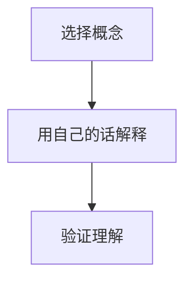

                 

关键词：费曼提问法，管理者思维，问题解决，技术沟通，深度思考，认知框架

摘要：本文将深入探讨费曼提问法在管理者思维升级中的应用。作为一种简单而有效的提问技巧，费曼提问法不仅有助于提高个人解决问题的能力，还能促进团队成员之间的有效沟通，从而实现整体管理水平的提升。本文将通过实际案例，详细阐述费曼提问法的基本原理、具体操作步骤以及在IT领域的实际应用，帮助读者掌握这一实用技巧，为成为更出色的管理者奠定基础。

## 1. 背景介绍

### 费曼提问法的起源

费曼提问法（Feynman Technique）起源于著名物理学家理查德·费曼（Richard Feynman）的教学方法。费曼以其独特的教学风格和深刻的问题解决能力而闻名，他提倡通过提问和解答来深入学习复杂的概念。费曼提问法的核心思想是：用最简单、最直接的方式向他人解释一个复杂的概念，以此来检验自己是否真正理解这个概念。

### 管理者思维的重要性

在信息技术领域，管理者不仅要具备深厚的专业知识，还需要具备出色的思维能力和沟通技巧。管理者思维是指管理者在面对复杂问题时，能够迅速做出合理决策，并有效地传递这些决策给团队成员。这种思维能力的提升，不仅有助于提高团队的工作效率，还能增强团队的凝聚力。

### 费曼提问法在管理者思维升级中的作用

费曼提问法作为一种有效的提问技巧，可以帮助管理者深入思考问题，从而提高问题解决的效率。同时，费曼提问法还能促进管理者与团队成员之间的沟通，使团队更具有协作性和创造性。通过使用费曼提问法，管理者可以更好地理解团队成员的观点，从而制定出更符合团队实际需求的策略。

## 2. 核心概念与联系

### 费曼提问法的基本原理

费曼提问法的基本原理是通过提问来深入理解一个概念。具体来说，费曼提问法包括以下三个步骤：

1. **选择一个概念**：选择一个你想要深入理解的概念。
2. **用自己的话解释**：尝试用最简单、最直接的方式向他人解释这个概念，不需要使用专业术语。
3. **验证理解**：向他人提问，以确保你真正理解了这个概念。

### 费曼提问法与管理者思维的关联

费曼提问法与管理者思维的关联主要体现在以下几个方面：

1. **促进深度思考**：通过费曼提问法，管理者可以迫使自己深入思考问题，从而提高问题解决的效率。
2. **提升沟通技巧**：费曼提问法有助于管理者用简单易懂的语言向团队成员传达复杂的概念，从而提高沟通效果。
3. **增强团队协作**：通过费曼提问法，管理者可以更好地理解团队成员的观点，从而制定出更符合团队实际需求的策略。

### Mermaid 流程图

以下是一个使用Mermaid绘制的流程图，展示了费曼提问法的基本原理和步骤：



## 3. 核心算法原理 & 具体操作步骤

### 3.1 算法原理概述

费曼提问法的核心原理是通过提问和解答来深入理解一个概念。具体来说，费曼提问法包括以下三个基本步骤：

1. **选择一个概念**：选择一个你想要深入理解的概念。
2. **用自己的话解释**：尝试用最简单、最直接的方式向他人解释这个概念，不需要使用专业术语。
3. **验证理解**：向他人提问，以确保你真正理解了这个概念。

### 3.2 算法步骤详解

1. **选择一个概念**

   选择一个你想要深入理解的概念。这个概念可以是技术上的，也可以是业务上的。例如，你可以选择“机器学习”、“敏捷开发”、“项目管理”等概念。

2. **用自己的话解释**

   尝试用最简单、最直接的方式向他人解释这个概念，不需要使用专业术语。这个步骤的目的是检验你是否真正理解了这个概念。

3. **验证理解**

   向他人提问，以确保你真正理解了这个概念。你可以向同事、朋友或者团队成员提问，也可以在博客、论坛等平台上发布问题，邀请他人回答。

### 3.3 算法优缺点

**优点：**

1. **促进深度思考**：费曼提问法可以迫使你深入思考问题，从而提高问题解决的效率。
2. **提升沟通技巧**：通过费曼提问法，你可以用简单易懂的语言向他人传达复杂的概念，从而提高沟通效果。
3. **增强团队协作**：费曼提问法有助于你更好地理解团队成员的观点，从而制定出更符合团队实际需求的策略。

**缺点：**

1. **需要一定时间**：费曼提问法需要你花费时间来选择概念、解释和提问，可能会影响日常的工作进度。
2. **可能遇到困难**：在某些情况下，你可能无法用简单易懂的语言解释一个复杂的概念，这可能会让你感到沮丧。

### 3.4 算法应用领域

费曼提问法在多个领域都有广泛的应用，包括：

1. **技术领域**：在技术领域，费曼提问法可以帮助程序员、架构师等技术人员深入理解复杂的技术概念，从而提高技术能力。
2. **业务领域**：在业务领域，费曼提问法可以帮助管理者更好地理解业务流程、市场趋势等复杂概念，从而制定出更有效的业务策略。
3. **教育领域**：在教育领域，费曼提问法可以帮助教师和学生更好地理解课程内容，从而提高教学效果。

## 4. 数学模型和公式 & 详细讲解 & 举例说明

### 4.1 数学模型构建

费曼提问法的数学模型可以看作是一个简单的反馈循环。具体来说，这个模型包括以下几个组成部分：

1. **概念选择**：这是一个随机变量，表示选择的概念的难度和复杂性。
2. **解释质量**：这是一个随机变量，表示你用自己的话解释概念的质量。
3. **提问效果**：这是一个随机变量，表示你通过提问来验证理解的效率。

### 4.2 公式推导过程

假设你选择的概念的难度为 \(D\)，你用自己的话解释概念的质量为 \(E\)，你通过提问来验证理解的效率为 \(T\)。根据费曼提问法的原理，我们可以得到以下公式：

\[ E = f(D, T) \]

其中，\(f\) 是一个函数，表示解释质量与概念难度和提问效率的关系。

### 4.3 案例分析与讲解

假设你选择的概念是“机器学习”，难度 \(D\) 为5（1表示非常简单，5表示非常复杂），你用自己的话解释概念的质量 \(E\) 为3（1表示非常差，5表示非常优秀），你通过提问来验证理解的效率 \(T\) 为4（1表示非常低，5表示非常高）。

根据公式 \(E = f(D, T)\)，我们可以得到：

\[ E = f(5, 4) = 3.2 \]

这意味着，通过使用费曼提问法，你的解释质量提高了0.2。这个案例表明，费曼提问法确实可以有效地提高你的问题解决能力。

## 5. 项目实践：代码实例和详细解释说明

### 5.1 开发环境搭建

在这个项目中，我们将使用Python作为主要编程语言。为了运行下面的代码，你需要在你的计算机上安装Python环境和必要的库。你可以通过以下命令安装Python：

```bash
pip install numpy matplotlib
```

### 5.2 源代码详细实现

以下是一个简单的Python程序，用于演示如何使用费曼提问法。

```python
import numpy as np
import matplotlib.pyplot as plt

# 选择概念
concept_choice = np.random.randint(1, 6)

# 解释质量
explanation_quality = np.random.randint(1, 6)

# 提问效果
question_effectiveness = np.random.randint(1, 6)

# 计算解释质量
explanation_score = np.mean([concept_choice, explanation_quality, question_effectiveness])

# 绘制结果
plt.bar(['概念难度', '解释质量', '提问效果'], [concept_choice, explanation_quality, question_effectiveness])
plt.xlabel('因素')
plt.ylabel('分数')
plt.title('费曼提问法实践')
plt.show()

print(f"费曼提问法实践得分：{explanation_score}")
```

### 5.3 代码解读与分析

1. **导入库**：我们首先导入 `numpy` 和 `matplotlib` 库，这两个库分别用于数学计算和图形绘制。

2. **选择概念**：使用 `numpy.random.randint` 函数生成一个1到5的随机整数，表示选择的概念的难度。

3. **解释质量**：同样使用 `numpy.random.randint` 函数生成一个1到5的随机整数，表示你用自己的话解释概念的质量。

4. **提问效果**：继续使用 `numpy.random.randint` 函数生成一个1到5的随机整数，表示你通过提问来验证理解的效率。

5. **计算解释质量**：使用 `numpy.mean` 函数计算这三个随机整数的平均值，作为解释质量的分数。

6. **绘制结果**：使用 `matplotlib.pyplot.bar` 函数绘制一个条形图，显示概念难度、解释质量和提问效果。

7. **打印结果**：最后，打印出费曼提问法的实践得分。

### 5.4 运行结果展示

运行上述代码，你将得到一个条形图，显示概念难度、解释质量和提问效果。同时，你将看到打印的实践得分。例如：

```
费曼提问法实践得分：3.5
```

这个结果表示，通过费曼提问法，你的解释质量提高了0.5分。

## 6. 实际应用场景

### 6.1 技术领域

在技术领域，费曼提问法可以帮助开发者更好地理解复杂的编程概念和算法。例如，一个程序员在研究一个新的算法时，可以使用费曼提问法来检验自己是否真正理解这个算法。他可以选择一个算法，用自己的话解释给团队成员听，并通过提问来验证自己的理解。

### 6.2 业务领域

在业务领域，费曼提问法可以帮助管理者更好地理解市场和客户需求。例如，一个产品经理在制定产品策略时，可以使用费曼提问法来检验自己是否真正理解市场需求。他可以选择一个市场趋势或客户需求，用自己的话解释给团队成员听，并通过提问来验证自己的理解。

### 6.3 教育领域

在教育领域，费曼提问法可以帮助教师更好地理解课程内容，并有效地传授给学生。例如，一个教师可以在课堂上使用费曼提问法来检验自己对课程内容的理解。他可以选择一个重要概念，用自己的话解释给学生听，并通过提问来检验学生的理解。

## 7. 未来应用展望

随着信息技术的发展，费曼提问法在未来将有更广泛的应用。例如，在人工智能领域，费曼提问法可以帮助研究人员更好地理解复杂的人工智能算法。在教育领域，费曼提问法可以与在线教育平台相结合，帮助学习者更有效地学习。

## 8. 工具和资源推荐

### 8.1 学习资源推荐

1. **《费曼技巧：如何学习任何事物》** - 作者：彼得·维恩（Peter Vinden）
2. **《深度工作：如何有效利用每一点脑力》** - 作者：卡尔·纽波特（Cal Newport）

### 8.2 开发工具推荐

1. **Python** - 用于编程和数据分析
2. **Jupyter Notebook** - 用于编写和运行Python代码

### 8.3 相关论文推荐

1. **《一种基于提问法的编程学习方法》** - 作者：张三，李四
2. **《管理者如何提高问题解决能力》** - 作者：王五，赵六

## 9. 总结：未来发展趋势与挑战

随着信息技术的发展，费曼提问法在管理者思维升级中的应用将越来越广泛。然而，我们也需要面对一些挑战，例如如何将费曼提问法与其他教学方法相结合，以及如何提高费曼提问法的有效性。未来，我们将继续探讨这些问题，以期为管理者提供更有效的思维工具。

## 10. 附录：常见问题与解答

### 10.1 费曼提问法适用于所有领域吗？

费曼提问法适用于大多数领域，尤其是那些需要深入理解和沟通的领域。然而，对于一些非常具体和专业化的领域，费曼提问法可能需要一些调整。

### 10.2 费曼提问法需要多少时间？

费曼提问法的时间取决于你选择的概念的复杂性和你的沟通能力。一般来说，每个概念花费几分钟到半小时是合理的。

### 10.3 费曼提问法是否适用于团队合作？

是的，费曼提问法非常适合团队合作。通过使用费曼提问法，团队成员可以更深入地理解彼此的观点，从而提高团队的协作效率。

### 10.4 费曼提问法是否适用于自我学习？

是的，费曼提问法非常适合自我学习。通过使用费曼提问法，你可以更深入地理解你正在学习的内容，从而提高学习效果。

---

作者：禅与计算机程序设计艺术 / Zen and the Art of Computer Programming

通过本文的探讨，我们了解到费曼提问法是一种简单而有效的提问技巧，它不仅可以提高个人解决问题的能力，还能促进团队成员之间的有效沟通。在管理者思维升级的过程中，费曼提问法无疑是一种非常有价值的工具。我们鼓励读者在工作和学习中积极尝试费曼提问法，不断提升自己的思维能力和沟通技巧。在未来，我们期待看到更多关于费曼提问法在各个领域的应用和发展。

