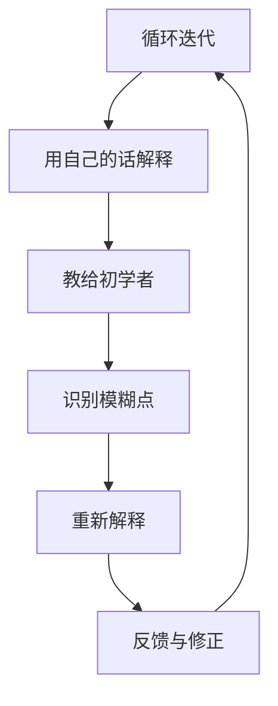

                 

关键词：费曼提问法、团队学习、技术博客、专业成长

> 摘要：本文探讨了费曼提问法在促进团队学习与成长中的重要作用。通过分析其原理和应用，结合实际案例，展示了费曼提问法在技术博客撰写、团队知识共享和问题解决等方面的实际效果。文章旨在为团队管理者和技术从业者提供一种有效的方法论，以提升团队整体的技术素养和创新能力。

## 1. 背景介绍

在当今快速变化的技术领域，团队学习和成长显得尤为重要。一个高效的团队不仅需要具备专业技能的成员，更需要具备持续学习和适应新知识的能力。费曼提问法（Feynman Technique）作为一种有效的学习方法，起源于著名物理学家理查德·费曼（Richard Feynman）的教学实践。其核心思想是将复杂的概念简化，通过口头表达来检验自己的理解深度。

费曼提问法的基本步骤包括选择一个概念、用自己的话解释它、将其教给一个初学者、识别解释中的模糊点并重新解释。这种方法不仅能够检验个人的理解程度，还能促进知识的内化和深化。

## 2. 核心概念与联系

### 2.1 费曼提问法的原理

费曼提问法的原理可以总结为以下几点：

- **简化与抽象**：将复杂的概念简化为最基本的形式，用简单的语言描述。
- **互动与反馈**：通过与他人的互动和反馈来检验自己的理解是否准确。
- **反思与修正**：在解释过程中识别自己知识中的模糊点，并进行修正。

### 2.2 费曼提问法的 Mermaid 流程图



## 3. 核心算法原理 & 具体操作步骤

### 3.1 算法原理概述

费曼提问法的核心在于将复杂知识转化为简单易懂的形式，并通过互动来深化理解。这种方法适用于任何需要学习和记忆的知识领域。

### 3.2 算法步骤详解

#### 3.2.1 选择概念

选择一个你希望深入理解的概念，可以是技术领域的复杂算法，也可以是团队管理的方法论。

#### 3.2.2 用自己的话解释

用简单明了的语言将这个概念解释出来，就像在教一个初学者一样。

#### 3.2.3 教给初学者

找一个愿意学习的初学者，尝试将你的解释传授给他们。

#### 3.2.4 识别模糊点

在传授过程中，注意听他们的反馈，识别自己解释中的模糊或不准确之处。

#### 3.2.5 重新解释

针对模糊点进行重新解释，直到你能够清楚地传达概念为止。

#### 3.2.6 反馈与修正

根据反馈进一步修正你的解释，确保概念的准确性。

### 3.3 算法优缺点

#### 优点：

- **增强理解**：通过口头表达，能够更好地检验自己的理解深度。
- **知识内化**：在教他人的过程中，能够加深对知识的记忆和掌握。
- **互动学习**：与他人互动能够带来新的见解和认识。

#### 缺点：

- **时间成本**：需要投入较多的时间进行解释和修正。
- **适应性要求**：需要具备较强的口头表达能力和适应不同听众的能力。

### 3.4 算法应用领域

费曼提问法广泛应用于教育、技术培训、团队建设等多个领域。在技术博客撰写中，可以帮助作者更深入地理解技术概念，并将其清晰地传达给读者。

## 4. 数学模型和公式 & 详细讲解 & 举例说明

### 4.1 数学模型构建

费曼提问法的数学模型可以表示为：

\[ \text{理解度} = f(\text{解释清晰度}, \text{互动频率}) \]

其中，解释清晰度和互动频率是影响理解度的两个关键因素。

### 4.2 公式推导过程

理解度的提升可以通过提高解释清晰度和增加互动频率来实现。因此，我们可以推导出上述公式。

### 4.3 案例分析与讲解

#### 案例一：技术博客撰写

假设一个技术博主在使用费曼提问法撰写一篇关于深度学习的文章。他首先选择了卷积神经网络（CNN）这个概念，然后用自己的话解释了CNN的基本原理。在将文章内容教给一个初学者后，他根据反馈修正了自己的解释，最终撰写出了一篇清晰易懂的文章。

#### 案例二：团队知识共享

在一个软件开发团队中，成员们通过费曼提问法来分享他们的专业知识。每个成员选择一个自己擅长的技术点，用自己的语言解释给团队其他成员听。通过这种互动，团队成员不仅加深了对该技术的理解，还提高了团队的整体技术水平。

## 5. 项目实践：代码实例和详细解释说明

### 5.1 开发环境搭建

为了演示费曼提问法在代码学习中的应用，我们将在一个Python环境中实现一个简单的冒泡排序算法。

### 5.2 源代码详细实现

```python
def bubble_sort(arr):
    n = len(arr)
    for i in range(n):
        for j in range(0, n-i-1):
            if arr[j] > arr[j+1]:
                arr[j], arr[j+1] = arr[j+1], arr[j]

# 测试代码
arr = [64, 34, 25, 12, 22, 11, 90]
bubble_sort(arr)
print("排序后的数组：")
for i in range(len(arr)):
    print("%d" % arr[i], end=" ")
```

### 5.3 代码解读与分析

在这段代码中，`bubble_sort` 函数实现了冒泡排序算法。算法的基本思想是重复遍历要排序的数列，一次比较两个元素，如果它们的顺序错误就把它们交换过来。遍历数列的工作是重复地进行，直到没有再需要交换的元素为止。

### 5.4 运行结果展示

运行上述代码，输出结果为：

```
排序后的数组：
11 12 22 25 34 64 90
```

这表明冒泡排序算法成功地将数组进行了升序排列。

## 6. 实际应用场景

费曼提问法在多个实际应用场景中展现出其价值。例如：

- **技术博客撰写**：通过费曼提问法，作者可以更深入地理解技术概念，并将其清晰传达给读者。
- **团队知识共享**：团队成员通过费曼提问法分享专业知识，提高团队整体技术水平。
- **个人学习**：使用费曼提问法，个人可以更有效地掌握新知识，提升学习效果。

## 7. 未来应用展望

随着人工智能和自动化技术的发展，费曼提问法有望在更多领域得到应用。例如：

- **在线教育**：通过虚拟现实和人工智能，费曼提问法可以应用于在线教育平台，提高学生的学习效果。
- **企业培训**：企业可以采用费曼提问法进行员工培训，提升团队整体素质。

## 8. 总结：未来发展趋势与挑战

### 8.1 研究成果总结

费曼提问法作为一种有效的学习方法，已在多个领域得到广泛应用，取得了显著的成果。

### 8.2 未来发展趋势

随着技术的进步，费曼提问法有望在更多领域得到应用，提高学习效率。

### 8.3 面临的挑战

费曼提问法在实施过程中可能面临以下挑战：

- **时间成本**：实施费曼提问法需要投入较多的时间和精力。
- **听众适应性**：需要根据不同听众的特点进行调整。

### 8.4 研究展望

未来研究可以关注以下几个方面：

- **优化费曼提问法的实施策略**：通过研究不同领域的应用特点，优化费曼提问法的实施方法。
- **开发相关工具**：利用人工智能和大数据技术，开发辅助费曼提问法的工具，提高实施效果。

## 9. 附录：常见问题与解答

### 9.1 费曼提问法适用于哪些领域？

费曼提问法适用于教育、技术培训、团队建设等多个领域。

### 9.2 如何实施费曼提问法？

实施费曼提问法的基本步骤包括选择概念、用自己的话解释、教给初学者、识别模糊点并重新解释。

### 9.3 费曼提问法有哪些优点？

费曼提问法的优点包括增强理解、知识内化和互动学习。

### 9.4 费曼提问法有哪些缺点？

费曼提问法的缺点包括时间成本和适应性要求。

----------------------------------------------------------------

**作者：禅与计算机程序设计艺术 / Zen and the Art of Computer Programming**

