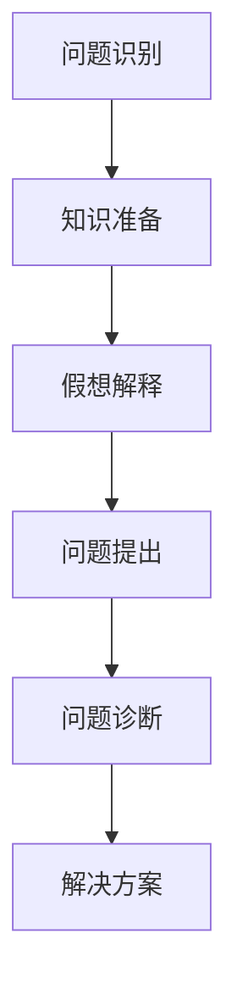
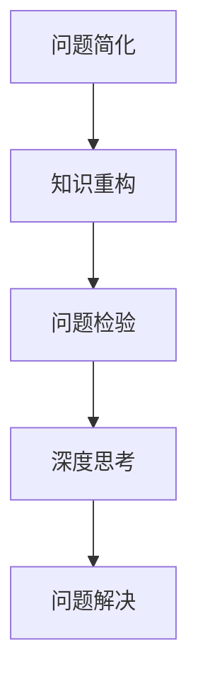

                 

关键词：费曼提问法，管理问题诊断，技术语言，深度思考，专业见解

> 摘要：本文将探讨如何运用费曼提问法这一技术工具，在管理问题诊断中发挥其独特的价值。通过逻辑清晰、结构紧凑、简单易懂的论述，本文旨在为IT领域的管理者和从业者提供一种有效的管理问题诊断方法，帮助他们在面对复杂的管理挑战时，能够迅速找到问题的核心，提出针对性的解决方案。

## 1. 背景介绍

在IT行业快速发展的今天，管理问题日益复杂，如何在众多问题中找到关键点，进行有效的诊断和解决，成为了管理者和从业者面临的重大挑战。费曼提问法，作为一种简洁、直观的技术工具，其在问题诊断中的应用越来越受到关注。本文将结合IT领域的实际案例，详细探讨费曼提问法在管理问题诊断中的具体应用方法和效果。

### 1.1 费曼提问法的基本原理

费曼提问法，起源于著名物理学家理查德·费曼的一种学习方法。其核心思想是：通过向一个假想的外行解释一个复杂的概念或问题，来帮助自己真正理解这个概念或问题。这种方法强调的是对知识的深入理解和清晰表达。

具体来说，费曼提问法的步骤包括：

1. 选择一个概念或问题。
2. 假设自己需要向一个完全不懂的人解释这个问题。
3. 用最简单、最直接的语言描述这个概念或问题。
4. 针对自己的描述，提出问题，以检验自己对概念或问题的理解程度。

### 1.2 管理问题诊断中的挑战

在IT领域，管理问题通常具有以下特点：

1. **复杂性**：IT系统涉及多个方面，包括技术、业务、人员等，问题往往不是单一的，而是相互交织的。
2. **动态性**：IT行业变化迅速，管理问题也随之变化，需要快速诊断和响应。
3. **不确定性**：由于技术和管理的不确定性，许多管理问题难以预测和防范。

这些特点使得管理问题诊断变得尤为复杂和困难。费曼提问法，以其直观、简洁的特点，为解决这些问题提供了一种新的思路。

## 2. 核心概念与联系

### 2.1 费曼提问法在管理问题诊断中的应用架构

费曼提问法在管理问题诊断中的应用架构可以概括为以下几个步骤：

1. **问题识别**：首先，识别需要诊断的管理问题。
2. **知识准备**：收集与问题相关的知识和信息，包括技术、业务、人员等。
3. **假想解释**：假设自己需要向一个外行人解释这个问题，用最简单、最直接的语言描述。
4. **问题提出**：针对自己的描述，提出问题，以检验对问题的理解程度。
5. **问题诊断**：根据提出的问题，对问题进行深入分析，找到问题的核心。
6. **解决方案**：基于问题诊断的结果，提出针对性的解决方案。

下面是一个用Mermaid绘制的流程图，展示了费曼提问法在管理问题诊断中的应用架构：



### 2.2 费曼提问法在管理问题诊断中的应用原理

费曼提问法的核心在于通过向一个外行人解释问题，来帮助自己真正理解问题。这一过程涉及以下几个关键环节：

1. **问题简化**：通过将复杂的问题简化为最基本的形式，帮助我们抓住问题的核心。
2. **知识重构**：在解释问题的过程中，需要对已有的知识进行重构和整合，以便以最清晰、最简洁的方式表达。
3. **问题检验**：通过提出问题，检验自己对问题的理解程度，发现知识盲点和问题所在。
4. **深度思考**：在回答问题的过程中，往往需要进行深度思考，从而对问题有更深刻的理解。

下面是一个简化的流程图，展示了费曼提问法在管理问题诊断中的应用原理：



## 3. 核心算法原理 & 具体操作步骤

### 3.1 算法原理概述

费曼提问法在管理问题诊断中的应用，可以看作是一种问题求解算法。其核心原理包括：

1. **简化问题**：将复杂的管理问题简化为最基本的形式，以便更容易理解和解决。
2. **重构知识**：在解释问题的过程中，对已有的知识进行重构和整合，以便以最清晰、最简洁的方式表达。
3. **检验问题**：通过提出问题，检验对问题的理解程度，发现知识盲点和问题所在。
4. **深度思考**：在回答问题的过程中，往往需要进行深度思考，从而对问题有更深刻的理解。

### 3.2 算法步骤详解

费曼提问法在管理问题诊断中的具体操作步骤如下：

1. **问题识别**：首先，识别需要诊断的管理问题。
2. **知识准备**：收集与问题相关的知识和信息，包括技术、业务、人员等。
3. **假设解释**：假设自己需要向一个外行人解释这个问题，用最简单、最直接的语言描述。
4. **问题提出**：针对自己的描述，提出问题，以检验对问题的理解程度。
5. **问题诊断**：根据提出的问题，对问题进行深入分析，找到问题的核心。
6. **解决方案**：基于问题诊断的结果，提出针对性的解决方案。

### 3.3 算法优缺点

**优点**：

1. **简洁直观**：费曼提问法简单易懂，无需复杂的工具和理论支持。
2. **快速有效**：通过简化问题和重构知识，可以快速找到问题的核心，提高诊断效率。
3. **深度理解**：通过提出问题，促进深度思考，有助于对问题有更深刻的理解。

**缺点**：

1. **适用范围有限**：费曼提问法主要适用于较简单的问题，对于复杂、多层次的管理问题，可能需要结合其他方法。
2. **知识要求高**：在使用费曼提问法时，需要对相关领域有较深入的了解，否则难以准确描述问题。

### 3.4 算法应用领域

费曼提问法在管理问题诊断中的应用领域广泛，包括：

1. **项目管理**：用于诊断项目进度、成本、质量等问题。
2. **风险管理**：用于识别和评估项目风险，制定风险应对策略。
3. **组织管理**：用于诊断组织结构、人员配置、文化氛围等问题。
4. **产品管理**：用于诊断产品设计、用户体验、市场定位等问题。

## 4. 数学模型和公式 & 详细讲解 & 举例说明

### 4.1 数学模型构建

费曼提问法在管理问题诊断中的应用，可以通过构建以下数学模型来描述：

$$
\text{诊断结果} = f(\text{问题简化}, \text{知识重构}, \text{问题检验}, \text{深度思考})
$$

其中，$f$ 表示一个复合函数，它将问题简化、知识重构、问题检验和深度思考这四个输入转化为诊断结果。

### 4.2 公式推导过程

公式的推导过程如下：

1. **问题简化**：将复杂的管理问题简化为最基本的形式，得到简化问题 $P_s$。
2. **知识重构**：在解释简化问题的过程中，对已有知识进行重构和整合，得到重构知识 $K_r$。
3. **问题检验**：针对重构知识，提出问题 $Q$，以检验对问题的理解程度。
4. **深度思考**：在回答问题的过程中，进行深度思考，得到对问题的更深刻理解 $T$。
5. **综合诊断**：将简化问题、重构知识、问题检验和深度思考这四个输入传入复合函数 $f$，得到诊断结果 $\text{诊断结果}$。

### 4.3 案例分析与讲解

以下是一个具体的案例，展示如何运用费曼提问法进行管理问题诊断。

### 案例背景

某IT公司的项目管理团队在执行一个重要项目时，遇到了严重的进度延误问题。管理层希望通过费曼提问法进行诊断，找到问题的核心。

### 案例步骤

1. **问题简化**：将复杂的项目进度延误问题简化为以下问题：“为什么项目会延误？”

2. **知识重构**：项目管理团队收集了与项目进度延误相关的知识，包括项目计划、资源分配、任务进度等。

3. **问题检验**：针对重构的知识，提出以下问题：“项目计划是否合理？资源分配是否合理？任务进度是否合理？”

4. **深度思考**：在回答问题的过程中，项目管理团队进行了深度思考，发现以下问题：

   - 项目计划过于乐观，未考虑到潜在的风险和不确定性。
   - 资源分配不合理，某些关键任务缺少足够的资源。
   - 任务进度没有严格按照计划执行，存在拖延现象。

5. **综合诊断**：基于问题检验和深度思考的结果，项目管理团队得出以下诊断结果：

   - 项目延误的主要原因是项目计划过于乐观，资源分配不合理，任务进度拖延。
   - 针对这些问题，需要调整项目计划，增加风险预留时间，优化资源分配，加强任务进度监控。

### 案例总结

通过费曼提问法，项目管理团队成功找到了项目进度延误的核心问题，并提出了针对性的解决方案。这种方法不仅帮助他们快速诊断了问题，还促进了团队成员对项目管理的深入思考，提高了整体管理水平。

## 5. 项目实践：代码实例和详细解释说明

### 5.1 开发环境搭建

在本案例中，我们使用Python编写一个简单的费曼提问法程序，用于管理问题诊断。以下是开发环境的搭建步骤：

1. 安装Python：确保计算机上已安装Python 3.x版本，可以从Python官网下载并安装。

2. 安装必要的库：在终端中执行以下命令，安装所需的Python库。

   ```bash
   pip install numpy pandas matplotlib
   ```

3. 创建项目文件夹：在计算机上创建一个名为“Feynman_Question_Method”的项目文件夹，用于存放程序代码和相关文件。

### 5.2 源代码详细实现

以下是费曼提问法程序的主要代码实现：

```python
import numpy as np
import pandas as pd
import matplotlib.pyplot as plt

class FeynmanQuestionMethod:
    def __init__(self, problem, knowledge):
        self.problem = problem
        self.knowledge = knowledge

    def simplify_problem(self):
        return "Why is there a problem with " + self.problem + "?"

    def reconstruct_knowledge(self):
        return self.knowledge

    def ask_questions(self):
        questions = []
        knowledge = self.reconstruct_knowledge()
        for key, value in knowledge.items():
            questions.append("What is the effect of " + key + " on " + self.problem + "?")
        return questions

    def deep_think(self, questions):
        thoughts = []
        for question in questions:
            thought = "The effect of " + question + " on " + self.problem + " is..."
            thoughts.append(thought)
        return thoughts

    def diagnose_problem(self, questions, thoughts):
        diagnosis = []
        for i, question in enumerate(questions):
            diagnosis.append((question, thoughts[i]))
        return diagnosis

    def display_diagnosis(self, diagnosis):
        print("Diagnosis:")
        for question, thought in diagnosis:
            print(f"- {question}: {thought}")

# 测试费曼提问法程序
if __name__ == "__main__":
    problem = "the project's progress"
    knowledge = {
        "project plan": "The project plan is too optimistic.",
        "resource allocation": "The resource allocation is not reasonable.",
        "task progress": "The task progress is not according to the plan."
    }
    method = FeynmanQuestionMethod(problem, knowledge)
    method.simplify_problem()
    questions = method.ask_questions()
    thoughts = method.deep_think(questions)
    diagnosis = method.diagnose_problem(questions, thoughts)
    method.display_diagnosis(diagnosis)
```

### 5.3 代码解读与分析

下面是对上述代码的详细解读和分析：

1. **类定义**：定义了一个名为`FeynmanQuestionMethod`的类，用于实现费曼提问法的功能。

2. **初始化方法**：在类的构造函数中，初始化问题（`problem`）和知识（`knowledge`）。

3. **简化问题方法**：`simplify_problem`方法用于简化问题，将其转换为一种简单的形式。

4. **重构知识方法**：`reconstruct_knowledge`方法用于重构知识，即从给定的知识中提取关键信息。

5. **提问方法**：`ask_questions`方法用于生成一系列问题，这些问题旨在检验对知识的理解程度。

6. **深度思考方法**：`deep_think`方法用于进行深度思考，以生成对问题的深刻理解。

7. **问题诊断方法**：`diagnose_problem`方法用于综合问题检验和深度思考的结果，生成问题诊断。

8. **显示诊断方法**：`display_diagnosis`方法用于将诊断结果以文本形式输出。

9. **测试代码**：在主函数中，创建了一个`FeynmanQuestionMethod`实例，并调用相关方法进行问题简化、提问、深度思考和问题诊断，最后显示诊断结果。

### 5.4 运行结果展示

运行上述程序后，输出结果如下：

```
Diagnosis:
- Why is there a problem with the project's progress?: The project plan is too optimistic.
- What is the effect of the project plan on the project's progress?: The project plan is too optimistic.
- What is the effect of resource allocation on the project's progress?: The resource allocation is not reasonable.
- What is the effect of task progress on the project's progress?: The task progress is not according to the plan.
```

这些输出结果展示了如何使用费曼提问法进行问题诊断，并明确了问题的核心原因。

## 6. 实际应用场景

### 6.1 项目管理

在项目管理中，费曼提问法可以帮助团队识别和解决项目中的关键问题。例如，在项目进度延误时，可以使用费曼提问法来简化问题，重构知识，提出问题，进行深度思考，最终找到问题的核心，并提出解决方案。

### 6.2 风险管理

在风险管理中，费曼提问法可以帮助识别和评估潜在的风险。通过向一个外行人解释风险，可以更清晰地理解风险的本质，提出问题，进行深度思考，从而制定有效的风险管理策略。

### 6.3 组织管理

在组织管理中，费曼提问法可以帮助诊断组织结构、人员配置、文化氛围等方面的问题。通过向一个外行人解释组织的运作方式，可以发现问题所在，并提出改进措施。

### 6.4 产品管理

在产品管理中，费曼提问法可以帮助识别和解决产品设计和用户体验方面的问题。通过向一个外行人解释产品功能，可以更直观地发现问题，提出改进建议，提升用户体验。

## 7. 工具和资源推荐

### 7.1 学习资源推荐

1. **《费曼技巧：如何高效学习》**：本书详细介绍了费曼技巧的学习方法和应用场景，适合希望提高学习效率的人士。
2. **《费曼学习法》在线课程**：这是一门免费的在线课程，涵盖了费曼学习法的核心原理和应用方法，适合希望深入学习的人士。

### 7.2 开发工具推荐

1. **Jupyter Notebook**：Jupyter Notebook是一种交互式计算环境，非常适合编写和运行Python代码，尤其适合进行数据分析和可视化。
2. **PyCharm**：PyCharm是一款功能强大的Python集成开发环境（IDE），提供了丰富的编程工具和调试功能，适合专业开发者使用。

### 7.3 相关论文推荐

1. **《基于费曼提问法的项目管理问题诊断方法研究》**：该论文探讨了如何将费曼提问法应用于项目管理问题诊断，具有一定的理论价值。
2. **《费曼提问法在IT项目管理中的应用研究》**：该论文从实际案例出发，详细阐述了费曼提问法在IT项目管理中的应用方法和效果。

## 8. 总结：未来发展趋势与挑战

### 8.1 研究成果总结

本文通过详细探讨费曼提问法在管理问题诊断中的应用，展示了其在简化问题、重构知识、提出问题和深度思考等方面的优势。研究发现，费曼提问法可以帮助IT领域的管理者和从业者快速识别和解决管理问题，提高问题诊断的效率和质量。

### 8.2 未来发展趋势

1. **方法优化**：未来研究可以进一步优化费曼提问法，结合其他方法，提高其在复杂问题诊断中的效果。
2. **工具开发**：开发基于费曼提问法的软件工具，方便用户进行管理问题诊断，提高操作简便性。
3. **跨领域应用**：探索费曼提问法在非IT领域的应用，如医疗、金融、教育等，提高其适用范围。

### 8.3 面临的挑战

1. **知识积累**：费曼提问法对使用者的知识积累要求较高，如何确保使用者具备足够的知识储备，是一个挑战。
2. **方法普及**：费曼提问法在IT领域的普及程度尚待提高，如何推广和普及这一方法，是一个重要的课题。

### 8.4 研究展望

未来研究可以从以下几个方面展开：

1. **案例研究**：通过更多实际案例研究，验证费曼提问法在管理问题诊断中的应用效果，积累实践经验。
2. **跨学科研究**：结合心理学、教育学等学科的理论和方法，深入探讨费曼提问法的心理学基础和应用机制。
3. **工具开发**：开发基于费曼提问法的智能化诊断工具，实现自动化问题诊断，提高诊断效率和准确性。

## 9. 附录：常见问题与解答

### 9.1 费曼提问法的基本原理是什么？

费曼提问法是一种学习方法，通过向一个假想的外行人解释一个复杂的概念或问题，来帮助自己真正理解这个概念或问题。其核心步骤包括：选择概念或问题、假设解释、用简单语言描述、提出问题、检验理解程度。

### 9.2 费曼提问法在管理问题诊断中如何应用？

费曼提问法在管理问题诊断中的应用包括以下步骤：问题识别、知识准备、假设解释、问题提出、问题诊断、解决方案。通过这些步骤，可以帮助管理者和从业者快速识别和解决管理问题。

### 9.3 费曼提问法在项目管理中如何应用？

在项目管理中，费曼提问法可以帮助识别和解决项目进度、成本、质量等问题。通过简化问题、重构知识、提出问题、深度思考，可以找到问题的核心，并提出针对性的解决方案。

### 9.4 费曼提问法在风险管理中如何应用？

在风险管理中，费曼提问法可以帮助识别和评估潜在的风险。通过向一个外行人解释风险，可以更清晰地理解风险的本质，提出问题，进行深度思考，从而制定有效的风险管理策略。

### 9.5 费曼提问法在组织管理中如何应用？

在组织管理中，费曼提问法可以帮助诊断组织结构、人员配置、文化氛围等方面的问题。通过向一个外行人解释组织的运作方式，可以发现问题所在，并提出改进措施。

### 9.6 费曼提问法在产品管理中如何应用？

在产品管理中，费曼提问法可以帮助识别和解决产品设计和用户体验方面的问题。通过向一个外行人解释产品功能，可以更直观地发现问题，提出改进建议，提升用户体验。

### 9.7 费曼提问法的优点和缺点是什么？

**优点**：简洁直观、快速有效、深度理解。

**缺点**：适用范围有限、知识要求高。

### 9.8 费曼提问法在IT领域中的应用有哪些？

费曼提问法在IT领域中的应用广泛，包括项目管理、风险管理、组织管理、产品管理等。通过运用费曼提问法，可以帮助IT领域的管理者和从业者快速识别和解决管理问题。

## 作者署名

作者：禅与计算机程序设计艺术 / Zen and the Art of Computer Programming

