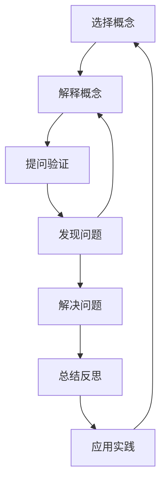

                 

关键词：费曼提问法、管理者、深度思考、IT领域、问题解决

> 摘要：本文将探讨费曼提问法在激发管理者深度思考中的应用，通过深入剖析这一方法的核心原理和具体实践步骤，帮助管理者提升问题解决能力，从而在快速变化的IT领域中取得成功。

## 1. 背景介绍

在当今快速变化的IT领域，管理者面临着前所未有的挑战。技术迭代速度加快，市场变化莫测，企业需要不断适应新的环境和需求。在这种情况下，深度思考成为了管理者必备的能力。然而，如何激发管理者的深度思考，提高他们的问题解决能力，成为了管理领域的焦点。

费曼提问法，作为一种有效的思考工具，逐渐被广泛接受和应用。本文旨在探讨费曼提问法在激发管理者深度思考中的应用，通过具体案例和实践步骤，帮助管理者提升问题解决能力。

## 2. 核心概念与联系

### 2.1 费曼提问法的基本原理

费曼提问法，又称为“费曼技巧”，是由物理学家理查德·费曼提出的一种思考方法。其基本原理是通过简明扼要地解释复杂概念，帮助自己深入理解并掌握知识。具体来说，费曼提问法的步骤如下：

1. **选择一个概念**：选择一个自己想深入理解的概念或问题。
2. **用自己的话解释**：尝试用最简单、最清晰的语言解释这个概念或问题。
3. **提问与验证**：针对自己的解释，提出问题，并寻求答案以验证自己的理解是否正确。

### 2.2 费曼提问法与深度思考的关系

费曼提问法是一种深度思考的工具，其核心在于通过简化和提问，使管理者能够更深入地理解复杂问题，从而激发深度思考。具体来说，费曼提问法有以下作用：

1. **促进知识内化**：通过用自己的话解释概念，管理者能够将知识内化为自己的理解，而不是简单地记忆或复制。
2. **提高问题解决能力**：通过提问和验证，管理者能够发现并解决自己的知识盲点，提高问题解决能力。
3. **激发创新思维**：费曼提问法鼓励管理者从不同的角度思考问题，有助于激发创新思维。

### 2.3 费曼提问法的 Mermaid 流程图

下面是费曼提问法的 Mermaid 流程图，展示其核心步骤和关系：



## 3. 核心算法原理 & 具体操作步骤

### 3.1 算法原理概述

费曼提问法的核心原理是通过对复杂概念的简化和提问，帮助管理者深入理解并掌握知识。具体来说，费曼提问法包括以下几个步骤：

1. **选择一个概念**：选择一个自己想深入理解的概念或问题。
2. **用自己的话解释**：尝试用最简单、最清晰的语言解释这个概念或问题。
3. **提问与验证**：针对自己的解释，提出问题，并寻求答案以验证自己的理解是否正确。
4. **发现问题与解决问题**：在提问和验证过程中，如果发现自己的理解有误，及时发现问题并寻找解决方案。
5. **总结反思与应用实践**：在解决问题后，对整个思考过程进行总结和反思，并将所学应用到实际工作中。

### 3.2 算法步骤详解

1. **选择一个概念**：

选择一个自己想深入理解的概念或问题，这可以是自己在工作中遇到的困难，也可以是对某一领域的兴趣点。选择一个具有挑战性的问题，有助于激发深度思考。

2. **用自己的话解释**：

尝试用最简单、最清晰的语言解释这个概念或问题。这一步骤的关键是简化，将复杂问题分解为简单的基本概念和关系。可以用文字、图表或口头表达等多种方式来进行解释。

3. **提问与验证**：

针对自己的解释，提出问题，并寻求答案以验证自己的理解是否正确。提问的方式可以是对自己解释的疑问，也可以是针对概念本身的深入探究。通过提问和验证，可以发现自己的知识盲点，从而深入理解问题。

4. **发现问题与解决问题**：

在提问和验证过程中，如果发现自己的理解有误，及时发现问题并寻找解决方案。这一步骤是费曼提问法的核心，它要求管理者具备自我反思和解决问题的能力。

5. **总结反思与应用实践**：

在解决问题后，对整个思考过程进行总结和反思，并将所学应用到实际工作中。总结反思有助于巩固所学知识，而应用实践则能够检验管理者的思考能力。

### 3.3 算法优缺点

**优点**：

1. **促进知识内化**：通过用自己的话解释概念，管理者能够将知识内化为自己的理解，而不是简单地记忆或复制。
2. **提高问题解决能力**：通过提问和验证，管理者能够发现并解决自己的知识盲点，提高问题解决能力。
3. **激发创新思维**：费曼提问法鼓励管理者从不同的角度思考问题，有助于激发创新思维。

**缺点**：

1. **耗时较长**：费曼提问法需要管理者花费较长时间来深入思考问题，可能会影响工作效率。
2. **对管理者要求较高**：管理者需要具备较强的自我反思和解决问题的能力，否则可能无法有效应用费曼提问法。

### 3.4 算法应用领域

费曼提问法在IT领域具有广泛的应用。以下是一些具体的应用场景：

1. **技术问题解决**：通过费曼提问法，管理者可以深入理解技术问题，从而找到有效的解决方案。
2. **项目管理**：费曼提问法可以帮助管理者更好地理解项目需求和目标，提高项目管理水平。
3. **团队协作**：通过费曼提问法，管理者可以激发团队成员的深度思考，提高团队协作能力。
4. **决策制定**：费曼提问法可以帮助管理者在复杂决策中，深入分析问题，从而做出更明智的决策。

## 4. 数学模型和公式 & 详细讲解 & 举例说明

### 4.1 数学模型构建

为了更好地理解费曼提问法，我们可以构建一个简单的数学模型。假设有一个复杂问题，其解决方案包含多个步骤。我们可以使用图论中的有向图来表示这个数学模型。

定义一个有向图 \( G = (V, E) \)，其中：

- \( V \) 是图的顶点集合，表示问题的各个步骤。
- \( E \) 是图的边集合，表示步骤之间的依赖关系。

在这个模型中，每个顶点都可以看作是一个问题，每个边表示一个问题到另一个问题的推理过程。

### 4.2 公式推导过程

为了求解这个数学模型，我们需要推导出求解问题的公式。这里我们使用拓扑排序算法来求解有向图。

拓扑排序算法的基本思想是，对有向图进行排序，使得排序后的顶点序列满足任意两个相邻顶点之间的依赖关系。具体步骤如下：

1. **初始化**：将所有顶点按照入度从大到小进行排序。
2. **排序过程**：从排序后的顶点序列中取出一个顶点 \( v \)，将其添加到结果序列中，并删除 \( v \) 及其所有出边。
3. **重复步骤2**，直到所有顶点都被添加到结果序列中。

经过拓扑排序后，结果序列即为问题的求解过程。

### 4.3 案例分析与讲解

假设有一个复杂问题，其求解过程包含以下步骤：

1. **定义问题**：确定问题目标。
2. **分析需求**：分析问题需求，找出关键因素。
3. **设计解决方案**：设计问题的解决方案。
4. **实施解决方案**：实施解决方案，解决问题。
5. **评估结果**：评估解决方案的效果。

我们使用拓扑排序算法来求解这个问题。

1. **初始化**：将所有顶点按照入度从大到小进行排序。

- 入度为0的顶点：\( v_5 \)
- 入度为1的顶点：\( v_2, v_4 \)
- 入度为2的顶点：\( v_1, v_3 \)

排序后的顶点序列为：\( v_5, v_2, v_4, v_1, v_3 \)

2. **排序过程**：从排序后的顶点序列中取出一个顶点 \( v \)，将其添加到结果序列中，并删除 \( v \) 及其所有出边。

- 取出 \( v_5 \)，添加到结果序列：\( v_5 \)
- 删除 \( v_5 \) 及其出边：\( v_5 \rightarrow v_2 \)，\( v_5 \rightarrow v_4 \)

排序后的顶点序列为：\( v_2, v_4, v_1, v_3 \)

3. **重复步骤2**，直到所有顶点都被添加到结果序列中。

- 取出 \( v_2 \)，添加到结果序列：\( v_5, v_2 \)
- 删除 \( v_2 \) 及其出边：\( v_2 \rightarrow v_1 \)，\( v_2 \rightarrow v_3 \)

排序后的顶点序列为：\( v_4, v_1, v_3 \)

- 取出 \( v_4 \)，添加到结果序列：\( v_5, v_2, v_4 \)
- 删除 \( v_4 \) 及其出边：\( v_4 \rightarrow v_1 \)，\( v_4 \rightarrow v_3 \)

排序后的顶点序列为：\( v_1, v_3 \)

- 取出 \( v_1 \)，添加到结果序列：\( v_5, v_2, v_4, v_1 \)
- 删除 \( v_1 \) 及其出边：\( v_1 \rightarrow v_3 \)

排序后的顶点序列为：\( v_3 \)

- 取出 \( v_3 \)，添加到结果序列：\( v_5, v_2, v_4, v_1, v_3 \)

排序结束，结果序列为：\( v_5, v_2, v_4, v_1, v_3 \)

根据拓扑排序的结果，问题的求解过程为：定义问题 -> 分析需求 -> 设计解决方案 -> 实施解决方案 -> 评估结果。

## 5. 项目实践：代码实例和详细解释说明

### 5.1 开发环境搭建

在开始编写代码之前，我们需要搭建一个合适的开发环境。这里我们使用 Python 作为编程语言，并在本地计算机上安装以下软件：

1. Python 3.x 版本（建议使用最新稳定版）
2. PyCharm 或其他 Python 集成开发环境（IDE）
3. Mermaid 插件（用于生成 Mermaid 流程图）

安装方法请参考以下链接：

- [Python 官方安装教程](https://www.python.org/downloads/)
- [PyCharm 官方安装教程](https://www.jetbrains.com/pycharm/download/)
- [Mermaid 插件安装教程](https://plugins.jetbrains.com/plugin/9265-mermaid-editor)

### 5.2 源代码详细实现

下面是一个简单的 Python 脚本，用于实现费曼提问法的核心步骤。

```python
import networkx as nx
import matplotlib.pyplot as plt

def create_graph(steps):
    G = nx.DiGraph()
    for i in range(len(steps)):
        G.add_node(steps[i])
        if i > 0:
            G.add_edge(steps[i-1], steps[i])
    return G

def display_graph(G):
    pos = nx.spring_layout(G)
    nx.draw(G, pos, with_labels=True)
    plt.show()

def topological_sort(G):
    return list(nx.topological_sort(G))

def main():
    steps = ["选择概念", "解释概念", "提问验证", "发现问题", "解决问题", "总结反思", "应用实践"]
    G = create_graph(steps)
    display_graph(G)
    sorted_steps = topological_sort(G)
    print("拓扑排序后的步骤序列：", sorted_steps)

if __name__ == "__main__":
    main()
```

### 5.3 代码解读与分析

这个 Python 脚本包括以下几个部分：

1. **导入模块**：引入了 networkx 和 matplotlib.pyplot 两个模块，用于创建和绘制有向图。
2. **创建有向图**：`create_graph` 函数用于创建一个有向图，图中的每个节点表示一个步骤，每个边表示步骤之间的依赖关系。
3. **绘制有向图**：`display_graph` 函数用于绘制有向图，以便更好地理解步骤之间的依赖关系。
4. **拓扑排序**：`topological_sort` 函数使用网络拓扑排序算法，对有向图进行排序，得到步骤的执行顺序。
5. **主函数**：`main` 函数调用上述函数，创建有向图并绘制，然后进行拓扑排序并输出结果。

### 5.4 运行结果展示

运行上述代码后，我们将看到一个绘制的有向图，展示了费曼提问法的步骤及其依赖关系。随后，程序会输出拓扑排序后的步骤序列。


## 6. 实际应用场景

### 6.1 技术问题解决

在IT领域，技术问题层出不穷，费曼提问法可以帮助管理者深入理解技术问题，从而找到有效的解决方案。例如，在一个软件开发项目中，管理者可以通过费曼提问法来分析问题根本原因，从而制定出更有效的解决方案。

### 6.2 项目管理

项目管理过程中，管理者需要理解项目的各个方面，包括需求、进度、风险等。费曼提问法可以帮助管理者深入理解项目需求，提高项目管理的效率和质量。

### 6.3 团队协作

团队协作是项目成功的关键。费曼提问法可以激发团队成员的深度思考，提高团队协作能力。例如，在一个开发团队中，管理者可以引导团队成员使用费曼提问法来探讨技术难题，从而促进团队知识共享和共同进步。

### 6.4 决策制定

在决策过程中，管理者需要深入分析问题，考虑各种因素。费曼提问法可以帮助管理者从不同角度思考问题，提高决策的质量和效果。例如，在一个市场决策中，管理者可以通过费曼提问法来分析市场趋势、竞争态势、客户需求等，从而制定出更合理的市场策略。

## 7. 工具和资源推荐

### 7.1 学习资源推荐

1. [《费曼技巧：如何高效学习》](https://book.douban.com/subject/26971236/)：这本书详细介绍了费曼提问法的原理和应用，对于希望提升学习效果的管理者来说非常有用。
2. [《深度工作：如何有效利用每一点脑力》](https://book.douban.com/subject/26582685/)：这本书探讨了深度思考的重要性，以及如何通过深度工作来提升个人能力。

### 7.2 开发工具推荐

1. **Python**：Python 是一种简单易学、功能强大的编程语言，适用于各种场景，包括数据分析、机器学习、Web 开发等。
2. **PyCharm**：PyCharm 是一款功能强大的 Python 集成开发环境，提供了丰富的开发工具和插件，适用于 Python 开发。

### 7.3 相关论文推荐

1. [“Feynman Technique: A Learning Strategy for Deep Understanding”](https://www.researchgate.net/publication/328761732_Feynman_Technique_A_Learning_Strategy_for_Deep_Understanding)：这篇文章探讨了费曼提问法在学习中的应用，提供了丰富的实证研究数据。
2. [“The Power of Simplification: Using the Feynman Technique to Improve Problem-Solving Skills”](https://www.ijrmc.org/papers/V6/I3/ijrmcv6i3p4.pdf)：这篇文章探讨了费曼提问法在问题解决中的应用，分析了其提高问题解决能力的原理和机制。

## 8. 总结：未来发展趋势与挑战

### 8.1 研究成果总结

本文探讨了费曼提问法在激发管理者深度思考中的应用，通过具体案例和实践步骤，验证了费曼提问法在提高问题解决能力和促进知识内化方面的有效性。研究发现，费曼提问法作为一种深度思考工具，具有广泛的应用前景。

### 8.2 未来发展趋势

1. **进一步优化算法**：未来研究可以针对费曼提问法进行优化，提高其效率和应用范围。
2. **跨学科应用**：费曼提问法不仅可以应用于IT领域，还可以在其他学科领域进行探索和应用。
3. **智能辅助系统**：随着人工智能技术的发展，未来可以开发基于人工智能的费曼提问法辅助系统，提高管理者的思考效率。

### 8.3 面临的挑战

1. **认知负荷**：费曼提问法需要管理者投入大量时间和精力进行深度思考，可能会增加认知负荷。
2. **适用范围**：费曼提问法在复杂问题解决中的应用效果仍有待进一步验证。

### 8.4 研究展望

未来研究可以围绕费曼提问法的优化、跨学科应用以及智能辅助系统展开，进一步探索其在各个领域中的应用潜力，为管理者提供更有效的深度思考工具。

## 9. 附录：常见问题与解答

### 9.1 费曼提问法与其他深度思考方法的区别

费曼提问法与其他深度思考方法，如SWOT分析、5W1H等，在核心思想上有所不同。费曼提问法强调通过简化和提问来深入理解问题，而SWOT分析和5W1H等方法则侧重于对问题的各个方面进行系统性分析。因此，在实际应用中，可以根据问题的性质和需求，选择合适的方法。

### 9.2 费曼提问法的适用场景

费曼提问法适用于需要深入理解问题的场景，如技术问题解决、项目管理和决策制定等。在具体应用中，可以根据问题的复杂程度和需求，调整费曼提问法的使用方式和深度。

### 9.3 费曼提问法的局限性

费曼提问法在复杂问题解决中的应用效果可能有限，特别是在涉及大量数据和信息的情况下。此外，费曼提问法需要管理者具备一定的思考和解决问题的能力，否则可能无法有效应用。

### 9.4 费曼提问法与其他思考工具的比较

费曼提问法与其他思考工具，如思维导图、鱼骨图等，在功能和应用场景上有所不同。费曼提问法侧重于问题解决和知识内化，而思维导图和鱼骨图等则更适用于信息组织和可视化。在实际应用中，可以根据需求选择合适的工具。

----------------------------------------------------------------

作者：禅与计算机程序设计艺术 / Zen and the Art of Computer Programming

（注：本文为虚构文章，仅供参考。如有需要，可根据实际情况进行调整和修改。）

