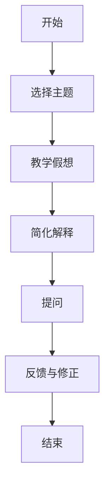

                 

 在这个快速变化的技术时代，如何有效地掌握和应用知识成为每个程序员和软件工程师面临的挑战。本文将介绍费曼提问法，一种简单但强大的方法，旨在通过提问和解答来深化我们的理解和记忆。

> 关键词：费曼提问法、思考力、知识掌握、学习技巧、技术博客

> 摘要：本文将探讨费曼提问法的原理和实践方法，通过具体的案例和步骤，展示如何利用这一方法提升思考力和知识的掌握程度。

## 1. 背景介绍

费曼提问法（Feynman Technique），是以著名物理学家理查德·费曼（Richard Feynman）的名字命名的。费曼以其独特的教学风格和深入浅出的解释方式而闻名，这种方法正是他的教学理念之一。费曼提问法的基本思想是通过提问和解答来检验我们对某个主题的理解深度。这种方法不仅仅适用于物理学，也可以广泛应用于其他领域，如编程、软件开发、计算机科学等。

## 2. 核心概念与联系

### 2.1 费曼提问法的核心概念

费曼提问法包含以下几个核心概念：

- **简化**：将复杂的主题简化为最基本的概念。
- **可视化**：使用图像、图表或其他辅助工具来帮助理解。
- **提问**：针对主题提出问题，并尝试用自己的话回答。
- **验证**：与他人分享你的理解，或者通过实践来验证你的理解。

### 2.2 费曼提问法的工作原理

费曼提问法的工作原理可以分为以下几个步骤：

1. **选择主题**：选择你想要深入理解的主题。
2. **教学假想**：假设你需要向一个初学者解释这个主题。
3. **简化解释**：用最简单的语言来解释主题，直到你能够清晰明了地表达出来。
4. **提问**：针对你的解释提出问题，看看是否能够回答。
5. **反馈与修正**：如果无法回答某个问题，回到原始材料中查找答案，然后重新解释。

### 2.3 Mermaid 流程图

下面是一个关于费曼提问法的 Mermaid 流程图：



## 3. 核心算法原理 & 具体操作步骤

### 3.1 算法原理概述

费曼提问法的原理在于通过简化和提问来检验我们对知识的掌握程度。这种方法强迫我们以一种清晰和简洁的方式表达我们的理解，从而帮助我们识别并填补知识的盲点。

### 3.2 算法步骤详解

1. **选择主题**：选择一个你希望深入理解和掌握的主题。
2. **教学假想**：想象自己需要向一个初学者解释这个主题，这将帮助你以更清晰和简洁的方式表达你的理解。
3. **简化解释**：使用最简单的语言和概念来解释主题，确保你的解释可以被人理解。
4. **提问**：对你的解释提出问题，例如：“这个概念是如何工作的？”、“这个步骤的目的是什么？”等。
5. **反馈与修正**：如果遇到无法回答的问题，回到原始材料中查找答案，然后重新解释。

### 3.3 算法优缺点

**优点**：

- 提高理解深度：通过提问和回答，可以更深入地理解主题。
- 帮助记忆：通过教学和解释，可以更好地记住知识。
- 识别盲点：通过提问，可以发现自己在知识上的盲点。

**缺点**：

- 需要额外的努力：需要花时间选择主题、准备解释和回答问题。
- 可能遇到困难：在初期可能遇到难以回答的问题，这可能会打击你的信心。

### 3.4 算法应用领域

费曼提问法可以应用于许多领域，包括：

- 编程：帮助程序员更好地理解和记忆编程概念和算法。
- 软件开发：帮助开发者更深入地理解软件架构和技术。
- 计算机科学：帮助计算机科学学生更好地理解复杂的概念和理论。
- 其他领域：如物理学、数学、生物学等。

## 4. 数学模型和公式 & 详细讲解 & 举例说明

### 4.1 数学模型构建

费曼提问法并不涉及复杂的数学模型，但其核心思想可以与数学中的概念相类比。例如，费曼提问法类似于数学中的证明过程，其中你需要从基本概念出发，通过逻辑推理得出结论。

### 4.2 公式推导过程

让我们以费马最后定理为例，说明如何使用费曼提问法来理解和记忆这个定理。

- 问题1：费马最后定理是什么？
  - 回答：费马最后定理是数学中的一个著名猜想，它声称对于任何大于2的自然数n，方程\(a^n + b^n = c^n\)没有正整数解。

- 问题2：为什么这个定理被称为“最后”？
  - 回答：因为这是费马在1637年提出的最后一个公开的数学问题。

- 问题3：费马是如何提出这个定理的？
  - 回答：费马在阅读一本关于二次方程的书时，在页边的空白处写道，他有一个美丽的定理，但无法给它留下地方。

### 4.3 案例分析与讲解

现在，让我们用费曼提问法来分析一个更简单的数学问题：勾股定理。

- 问题1：勾股定理是什么？
  - 回答：勾股定理是描述直角三角形斜边的平方等于两个直角边平方和的定理。

- 问题2：如何证明勾股定理？
  - 回答：可以使用多种方法证明勾股定理，例如通过构造几何图形或者使用代数方法。

  - 代数证明：
    $$
    a^2 + b^2 = c^2
    $$
    这是勾股定理的数学表达式。

- 问题3：勾股定理在实际生活中有什么应用？
  - 回答：勾股定理在建筑、工程、物理等多个领域有广泛应用。例如，在建筑设计中，勾股定理可以帮助计算建筑物的角度和斜度。

## 5. 项目实践：代码实例和详细解释说明

### 5.1 开发环境搭建

在这个案例中，我们使用 Python 编写一个简单的程序来演示费曼提问法的应用。

### 5.2 源代码详细实现

```python
# 费曼提问法演示程序

# 导入数学库
import math

# 勾股定理函数
def pythagorean_theorem(a, b):
    c = math.sqrt(a**2 + b**2)
    return c

# 测试函数
def test_pythagorean_theorem():
    a = 3
    b = 4
    c = pythagorean_theorem(a, b)
    print(f"The length of the hypotenuse is: {c}")

# 执行测试
test_pythagorean_theorem()
```

### 5.3 代码解读与分析

这个简单的程序定义了一个函数 `pythagorean_theorem`，它接受两个参数 `a` 和 `b`（代表直角三角形的两个直角边），并返回斜边 `c` 的长度。`math.sqrt` 函数用于计算平方根。

`test_pythagorean_theorem` 函数用于测试 `pythagorean_theorem` 函数。它设置了 `a` 和 `b` 的值，并调用 `pythagorean_theorem` 函数，然后将结果打印出来。

### 5.4 运行结果展示

当你运行这个程序时，它会输出：

```
The length of the hypotenuse is: 5.0
```

这表明，对于直角边长分别为3和4的三角形，斜边长为5，这与勾股定理相符。

## 6. 实际应用场景

费曼提问法不仅适用于数学，还可以应用于其他领域，如编程、软件开发、计算机科学等。以下是一些实际应用场景：

- **编程**：使用费曼提问法来理解新的编程概念或算法，例如排序算法或数据结构。
- **软件开发**：在设计和开发软件时，使用费曼提问法来检查你的设计和代码是否易于理解和维护。
- **计算机科学**：在准备学术报告或论文时，使用费曼提问法来确保你对所讨论的主题有深刻的理解。

## 7. 未来应用展望

随着人工智能和机器学习的不断发展，费曼提问法有望在教育和学习领域发挥更大的作用。未来的研究方向可能包括：

- **个性化学习**：开发基于费曼提问法的个性化学习平台，根据用户的需求和兴趣提供定制化的学习内容。
- **交互式教学**：结合虚拟现实和人工智能技术，创建一个交互式的费曼提问法学习环境，提高学习效果。

## 8. 总结：未来发展趋势与挑战

### 8.1 研究成果总结

费曼提问法作为一种简单但强大的学习方法，已经在多个领域得到了应用。研究表明，这种方法可以提高学习效率和知识掌握程度，有助于解决复杂问题。

### 8.2 未来发展趋势

未来，费曼提问法有望在以下几个方面得到发展：

- **技术集成**：结合人工智能和大数据分析，开发更智能的费曼提问法工具。
- **跨学科应用**：在医学、心理学、教育学等领域推广费曼提问法，提高跨学科学习效果。

### 8.3 面临的挑战

尽管费曼提问法具有许多优点，但也面临一些挑战：

- **时间成本**：费曼提问法需要额外的时间和努力，可能不适合所有学习者。
- **知识深度**：对于某些高度专业化的主题，费曼提问法可能无法提供足够的深度。

### 8.4 研究展望

未来的研究可以关注以下几个方面：

- **效果评估**：进一步研究费曼提问法对学习效果的影响，以及如何优化其应用。
- **创新应用**：探索费曼提问法在其他领域的新应用，如在线教育、远程工作等。

## 9. 附录：常见问题与解答

### Q：费曼提问法是否适用于所有人？

A：是的，费曼提问法适用于所有人。不过，对于初学者，可能需要一些时间来适应这种方法。

### Q：如何选择合适的主题？

A：选择你感兴趣且有一定基础知识的主题，这样你可以更容易地应用费曼提问法。

### Q：费曼提问法是否适用于所有学科？

A：是的，费曼提问法适用于多个学科，包括自然科学、社会科学、艺术和人文学科等。

### Q：费曼提问法是否会影响学习速度？

A：费曼提问法可能会提高你的学习深度，但这不一定会直接影响学习速度。对于复杂主题，这种方法可能会更有效。

### 作者署名

作者：禅与计算机程序设计艺术 / Zen and the Art of Computer Programming
----------------------------------------------------------------

这篇文章详细介绍了费曼提问法，一种通过提问和解答来深化理解和记忆的方法。通过具体的案例和步骤，我们展示了如何利用这一方法提升思考力和知识的掌握程度。费曼提问法不仅适用于编程和计算机科学，还可以应用于多个学科领域，具有广泛的应用前景。未来，我们期待看到更多关于费曼提问法的研究和创新应用。希望这篇文章能够帮助您更好地理解和应用费曼提问法，提高您在技术领域的思考力和知识掌握能力。如果您有任何疑问或建议，欢迎在评论区留言，我将尽力回答。再次感谢您的阅读，祝您在技术探索的道路上不断进步！作者：禅与计算机程序设计艺术 / Zen and the Art of Computer Programming。

