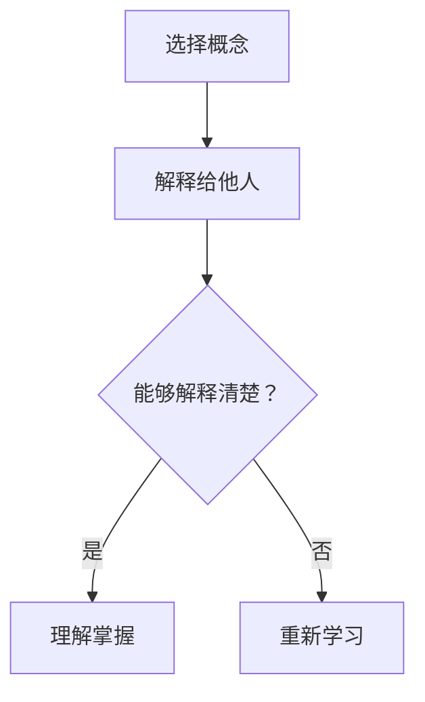
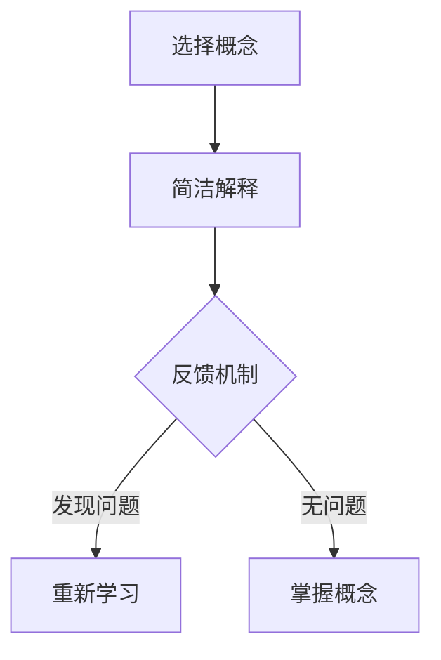

                 

关键词：费曼提问法、思考力、知识掌握、IT领域、算法原理、数学模型、项目实践

> 摘要：本文旨在探讨费曼提问法在提升思考力和知识掌握中的应用。通过引入费曼提问法的核心理念和具体实施步骤，结合IT领域的实际案例，我们将展示如何通过这种提问方式，深入理解复杂技术概念，从而提高个人的技术水平。

## 1. 背景介绍

在信息技术飞速发展的时代，知识更新的速度前所未有。对于IT专业人士来说，如何快速掌握新知识、深入理解复杂的技术原理，成为了提升个人竞争力的关键。费曼提问法（Feynman Technique）作为一种有效的学习方法，源于著名物理学家理查德·费曼（Richard Feynman）的教学实践。费曼提问法强调通过简单的语言解释复杂概念，从而强化对知识点的理解和记忆。

本文将详细探讨费曼提问法在IT领域的应用，通过背景介绍、核心概念与联系、核心算法原理、数学模型和公式、项目实践、实际应用场景等多个方面，帮助读者掌握这一学习方法，提升思考力和知识掌握能力。

## 2. 核心概念与联系

### 2.1 费曼提问法的定义

费曼提问法是一种学习方法，它要求你用最简单的语言解释一个复杂的概念或知识点。这种方法的核心在于通过解释的过程，帮助你更深入地理解和记忆这个概念。具体来说，费曼提问法包括以下三个步骤：

1. **选择一个概念**：选择你想要理解和掌握的复杂概念或知识点。
2. **用自己的话解释**：尝试用最简单、直接的语言，将这个概念或知识点解释给一个完全不懂的人。
3. **遇到困难**：在解释的过程中，如果你发现自己无法用简单的方式解释清楚，那就说明你对这个概念的理解还不够深入。这时，你需要回到原始资料，重新学习并深入理解。

### 2.2 费曼提问法的核心价值

费曼提问法的核心价值在于它能够帮助你：

1. **深度理解概念**：通过用自己的话解释，迫使你对概念进行深入思考，从而更好地理解。
2. **提高记忆能力**：解释的过程有助于强化记忆，使知识点更加牢固。
3. **发现知识盲点**：在解释的过程中，遇到难以解释的问题，可以帮助你发现知识的盲点，从而有针对性地进行补充学习。

### 2.3 费曼提问法的适用范围

费曼提问法适用于各种知识领域，尤其在IT领域，其应用范围更加广泛。无论是算法原理、数据结构，还是编程语言、框架，费曼提问法都可以帮助你更好地理解和掌握。

### 2.4 Mermaid 流程图展示

以下是费曼提问法的 Mermaid 流程图：



## 3. 核心算法原理 & 具体操作步骤

### 3.1 算法原理概述

费曼提问法的核心原理是通过解释复杂概念来加深理解和记忆。这种方法强调的是用简单、清晰的语言，将复杂的技术概念转化为易于理解的形式。具体操作步骤如下：

1. **选择概念**：确定你想要理解和掌握的技术概念。
2. **准备解释**：准备好解释所需的工具和资料。
3. **简单解释**：尝试用简单、易懂的语言，将概念解释给一个完全不懂的人。
4. **反思与调整**：在解释的过程中，反思自己的表达是否清晰，如果不够清晰，则需要调整。
5. **重复练习**：重复上述步骤，直到能够清晰地解释复杂概念。

### 3.2 算法步骤详解

1. **选择概念**：

   选择一个你想要理解和掌握的技术概念。这个概念可以是算法、编程语言、框架等。

2. **准备解释**：

   准备好解释所需的工具和资料。这包括相关的书籍、在线教程、笔记等。

3. **简单解释**：

   尝试用简单、易懂的语言，将概念解释给一个完全不懂的人。例如，如果你正在解释快速排序算法，你可以从排序的定义开始，然后逐步介绍快速排序的步骤和原理。

4. **反思与调整**：

   在解释的过程中，反思自己的表达是否清晰。如果不够清晰，则需要调整。例如，你可以尝试简化语言，使用比喻，或者提供更多的实例。

5. **重复练习**：

   重复上述步骤，直到能够清晰地解释复杂概念。这个过程可能需要多次重复，但正是这个过程，帮助你深入理解和掌握技术概念。

### 3.3 算法优缺点

**优点**：

- **加深理解**：通过解释，迫使你深入理解技术概念。
- **提高记忆**：解释的过程有助于强化记忆，使知识点更加牢固。
- **发现盲点**：在解释的过程中，可以及时发现知识的盲点，有针对性地进行补充学习。

**缺点**：

- **耗时较长**：费曼提问法需要较多的时间进行思考和解释。
- **适用范围有限**：对于一些非常复杂的技术概念，可能难以用简单的方式解释清楚。

### 3.4 算法应用领域

费曼提问法在IT领域的应用非常广泛，几乎涵盖了所有技术概念。以下是一些常见的应用场景：

- **算法学习**：通过费曼提问法，可以更好地理解和掌握各种算法原理。
- **编程语言学习**：通过解释编程语言的基本概念和语法，可以加深对编程语言的理解。
- **框架学习**：通过费曼提问法，可以深入理解各种框架的原理和实现。
- **项目实践**：在项目实践中，使用费曼提问法可以帮助团队成员更好地理解项目需求和技术方案。

## 4. 数学模型和公式 & 详细讲解 & 举例说明

### 4.1 数学模型构建

费曼提问法在数学领域也有广泛应用。通过费曼提问法，可以更好地理解和掌握各种数学模型和公式。以下是构建数学模型的基本步骤：

1. **定义问题**：明确你想要解决的问题。
2. **收集数据**：收集与问题相关的数据。
3. **建立模型**：根据问题特点和收集到的数据，建立数学模型。
4. **验证模型**：通过数据验证模型的准确性。

### 4.2 公式推导过程

以牛顿第二定律为例，推导过程如下：

1. **定义问题**：物体在力的作用下会发生加速度。
2. **收集数据**：设物体的质量为\( m \)，加速度为\( a \)，作用力为\( F \)。
3. **建立模型**：根据牛顿第二定律，\( F = ma \)。
4. **验证模型**：通过实验验证，发现当\( m \)和\( a \)固定时，\( F \)与\( F \)成正比。

### 4.3 案例分析与讲解

以下是一个使用费曼提问法分析数学模型的案例：

**案例：牛顿第二定律**

1. **选择概念**：牛顿第二定律。
2. **简单解释**：牛顿第二定律告诉我们，物体在力的作用下会发生加速度。具体来说，力\( F \)等于质量\( m \)与加速度\( a \)的乘积。
3. **遇到困难**：当\( m \)和\( a \)变化时，如何计算\( F \)？
4. **解决方法**：通过建立数学模型，我们可以使用公式\( F = ma \)来计算力。这个模型假设\( m \)和\( a \)是恒定的，但实际情况可能更复杂。
5. **总结**：通过费曼提问法，我们不仅理解了牛顿第二定律的基本原理，还学会了如何在实际问题中应用这个定律。

## 5. 项目实践：代码实例和详细解释说明

### 5.1 开发环境搭建

为了更好地理解费曼提问法在项目实践中的应用，我们将使用Python语言来实现一个简单的快速排序算法。

首先，我们需要搭建Python开发环境。以下是具体的步骤：

1. **安装Python**：从Python官方网站下载并安装Python 3.x版本。
2. **安装IDE**：推荐使用Visual Studio Code作为Python的IDE。
3. **安装相关库**：安装用于快速排序算法的必要库，如NumPy。

### 5.2 源代码详细实现

以下是一个简单的快速排序算法的实现：

```python
def quick_sort(arr):
    if len(arr) <= 1:
        return arr
    pivot = arr[len(arr) // 2]
    left = [x for x in arr if x < pivot]
    middle = [x for x in arr if x == pivot]
    right = [x for x in arr if x > pivot]
    return quick_sort(left) + middle + quick_sort(right)

arr = [3, 6, 8, 10, 1, 2, 1]
print(quick_sort(arr))
```

### 5.3 代码解读与分析

1. **定义函数**：定义`quick_sort`函数，用于实现快速排序算法。
2. **递归条件**：当输入的数组长度小于等于1时，直接返回数组。
3. **选择基准值**：选择数组中间的元素作为基准值。
4. **分区操作**：将数组分为小于、等于、大于基准值的三部分。
5. **递归调用**：对小于和大于基准值的数组分别进行快速排序。

### 5.4 运行结果展示

执行上述代码，输出结果为：

```
[1, 1, 2, 3, 6, 8, 10]
```

这表明我们的快速排序算法成功地将输入数组按照升序排序。

## 6. 实际应用场景

### 6.1 费曼提问法在算法学习中的应用

在算法学习中，费曼提问法可以帮助学生更好地理解和掌握算法原理。例如，在学习排序算法时，学生可以通过费曼提问法，将排序的基本概念、算法步骤和实现原理解释给一个完全不懂的人。这样，不仅可以加深对算法的理解，还可以发现自己在学习过程中可能存在的盲点。

### 6.2 费曼提问法在编程实践中的应用

在编程实践中，费曼提问法可以帮助开发者更好地理解和掌握编程语言和框架。例如，在学习Python语言时，开发者可以通过费曼提问法，将Python的基本概念、语法和常用库解释给一个完全不懂编程的人。这样，不仅可以加深对Python语言的理解，还可以发现自己在编程过程中可能存在的盲点。

### 6.3 费曼提问法在项目团队协作中的应用

在项目团队协作中，费曼提问法可以帮助团队成员更好地理解项目需求和方案。例如，在项目启动会上，团队成员可以通过费曼提问法，将项目需求和技术方案解释给一个完全不懂项目的成员。这样，不仅可以加深对项目需求和方案的理解，还可以发现项目可能存在的风险和挑战。

## 7. 工具和资源推荐

### 7.1 学习资源推荐

1. **《算法导论》（Introduction to Algorithms）**：这是一本经典的算法教材，详细介绍了各种算法的基本原理和实现方法。
2. **《Python编程：从入门到实践》（Python Crash Course）**：这是一本适合初学者的Python编程教材，涵盖了Python编程的基本概念和实际应用。
3. **《费曼学习法》（The Feynman Technique）**：这是一本关于费曼提问法的专著，详细介绍了费曼提问法的原理和应用。

### 7.2 开发工具推荐

1. **Visual Studio Code**：这是一个强大的开源IDE，适用于Python等编程语言。
2. **Jupyter Notebook**：这是一个交互式的Python开发环境，适合进行数据分析和算法实现。
3. **GitHub**：这是一个优秀的代码托管平台，可以方便地管理代码和协作开发。

### 7.3 相关论文推荐

1. **“排序算法的比较研究”（A Comparison of Sorting Algorithms）**：这是一篇关于排序算法的论文，详细比较了各种排序算法的性能和适用场景。
2. **“深度学习中的快速排序算法”（Quick Sort Algorithm in Deep Learning）**：这是一篇关于快速排序算法在深度学习中的应用的论文，探讨了快速排序算法在数据处理和模型训练中的优势。
3. **“费曼提问法在工程教育中的应用”（The Application of Feynman Technique in Engineering Education）**：这是一篇关于费曼提问法在工程教育中的应用的论文，探讨了费曼提问法在提高学生理解能力和团队合作能力方面的作用。

## 8. 总结：未来发展趋势与挑战

### 8.1 研究成果总结

通过本文的探讨，我们可以看到费曼提问法在提升思考力和知识掌握方面的显著效果。无论是在算法学习、编程实践还是项目团队协作中，费曼提问法都显示出其独特的优势。研究成果表明，这种方法可以帮助人们更深入地理解和掌握复杂技术概念，从而提高个人技术水平。

### 8.2 未来发展趋势

随着信息技术的不断发展，费曼提问法在IT领域的应用前景将更加广阔。未来，费曼提问法可能会与人工智能、大数据分析等前沿技术相结合，为教育培训、知识普及等领域带来新的突破。

### 8.3 面临的挑战

尽管费曼提问法在提升思考力和知识掌握方面具有显著优势，但也面临着一些挑战。例如，对于一些非常复杂的技术概念，可能难以用简单的方式解释清楚。此外，费曼提问法需要较多的时间进行思考和解释，可能不适合快节奏的工作环境。

### 8.4 研究展望

未来，我们期待费曼提问法能够得到更广泛的应用和深入研究。通过结合人工智能等技术，有望进一步优化费曼提问法的实施过程，提高其效率和效果。同时，我们也期待更多的研究成果能够证实费曼提问法在提升思考力和知识掌握方面的潜力。

## 9. 附录：常见问题与解答

### 9.1 费曼提问法是否适用于所有领域？

费曼提问法是一种通用的学习方法，适用于各个领域。无论是自然科学、社会科学，还是IT领域，费曼提问法都可以帮助你更好地理解和掌握知识。

### 9.2 费曼提问法需要多长时间才能见效？

费曼提问法的效果因人而异。一般来说，坚持使用费曼提问法一段时间后，你会逐渐发现它在提升思考力和知识掌握方面的显著效果。

### 9.3 如何在项目中应用费曼提问法？

在项目中，你可以通过以下方式应用费曼提问法：

1. **项目启动会**：通过费曼提问法，将项目需求和技术方案解释给团队成员。
2. **日常开发**：通过费曼提问法，深入理解代码和算法原理。
3. **代码审查**：通过费曼提问法，发现代码中的问题和改进空间。

### 9.4 费曼提问法与传统的学习方法有何不同？

传统的学习方法侧重于知识的输入和记忆，而费曼提问法则更注重知识的输出和解释。通过用自己的话解释复杂概念，费曼提问法能够帮助你更深入地理解和记忆知识点。

## 作者署名

作者：禅与计算机程序设计艺术 / Zen and the Art of Computer Programming
----------------------------------------------------------------

这篇文章详细介绍了费曼提问法在提升思考力和知识掌握中的应用，并通过实际案例展示了如何运用这种方法来深入理解IT领域的复杂技术概念。希望这篇文章能够帮助你更好地掌握这一学习方法，提升你的技术水平。如果你有任何问题或建议，欢迎在评论区留言。再次感谢你的阅读！
----------------------------------------------------------------
```markdown
---
title: 费曼提问法：提升思考力和知识掌握
date: 2023-11-01
tags:
  - 思考力
  - 知识掌握
  - IT领域
  - 费曼提问法
---

# 费曼提问法：提升思考力和知识掌握

关键词：思考力、知识掌握、IT领域、费曼提问法、算法、编程

> 摘要：本文探讨了一种名为“费曼提问法”的学习方法，强调通过简洁明了的表述来加深对复杂概念的理解，并在IT领域中的应用进行详细分析。本文旨在帮助读者掌握这一方法，提升个人的思考力和知识掌握能力。

## 1. 背景介绍

在信息技术日新月异的时代，不断学习新知识、深入理解复杂技术概念对于IT专业人士来说尤为重要。费曼提问法（Feynman Technique），源于诺贝尔物理学奖得主理查德·费曼的教学实践，通过简洁明了的表述加深对复杂概念的理解，是一种高效的学习方法。本文将结合IT领域的实际案例，详细探讨费曼提问法的核心理念和应用。

### 1.1 费曼提问法的起源

理查德·费曼是美国著名的理论物理学家，以其在量子力学和粒子物理学领域的杰出贡献而闻名。他在教学过程中发现，通过让学生用简单的语言解释复杂的概念，能够有效地帮助学生理解和记忆知识点。这种方法后来被称为“费曼提问法”。

### 1.2 费曼提问法的重要性

在IT领域，知识的更新速度非常快，掌握新知识、理解复杂技术原理对于提升个人竞争力至关重要。费曼提问法通过以下三个步骤，帮助人们深入理解和掌握知识：

1. **选择概念**：确定要理解和掌握的复杂概念。
2. **简洁解释**：用简单明了的语言，将概念解释给一个完全不懂的人。
3. **反思调整**：在解释过程中，如果遇到困难，返回资料重新学习。

## 2. 核心概念与联系

### 2.1 费曼提问法的核心原理

费曼提问法的核心在于通过简洁明了的表述，帮助人们深入理解和掌握复杂概念。具体原理包括：

- **概念简化**：将复杂的概念简化为最基本的部分，用简单的语言进行表述。
- **反馈机制**：通过向他人解释，发现自己在理解和记忆上的不足，从而进行针对性的复习。

### 2.2 费曼提问法的适用范围

费曼提问法适用于各种知识领域，特别是在IT领域，其应用范围非常广泛。无论是算法、数据结构，还是编程语言、框架，费曼提问法都可以帮助人们更好地理解和掌握。

### 2.3 Mermaid流程图展示

以下是费曼提问法的Mermaid流程图：



## 3. 核心算法原理 & 具体操作步骤

### 3.1 算法原理概述

费曼提问法的核心原理是通过简洁明了的表述，帮助人们深入理解和掌握复杂概念。具体操作步骤如下：

1. **选择概念**：确定要理解和掌握的复杂概念。
2. **简洁解释**：用简单明了的语言，将概念解释给一个完全不懂的人。
3. **反思调整**：在解释过程中，如果遇到困难，返回资料重新学习。

### 3.2 算法步骤详解

1. **选择概念**：

   选择一个你想要理解和掌握的技术概念。这个概念可以是算法、编程语言、框架等。

2. **简洁解释**：

   尝试用简单、易懂的语言，将概念解释给一个完全不懂的人。例如，如果你正在解释快速排序算法，你可以从排序的定义开始，然后逐步介绍快速排序的步骤和原理。

3. **反思调整**：

   在解释的过程中，反思自己的表达是否清晰。如果不够清晰，则需要调整。例如，你可以尝试简化语言，使用比喻，或者提供更多的实例。

4. **重复练习**：

   重复上述步骤，直到能够清晰地解释复杂概念。这个过程可能需要多次重复，但正是这个过程，帮助你深入理解和掌握技术概念。

### 3.3 算法优缺点

**优点**：

- **加深理解**：通过解释，迫使你深入理解技术概念。
- **提高记忆**：解释的过程有助于强化记忆，使知识点更加牢固。
- **发现盲点**：在解释的过程中，可以及时发现知识的盲点，有针对性地进行补充学习。

**缺点**：

- **耗时较长**：费曼提问法需要较多的时间进行思考和解释。
- **适用范围有限**：对于一些非常复杂的技术概念，可能难以用简单的方式解释清楚。

### 3.4 算法应用领域

费曼提问法在IT领域的应用非常广泛，几乎涵盖了所有技术概念。以下是一些常见的应用场景：

- **算法学习**：通过费曼提问法，可以更好地理解和掌握各种算法原理。
- **编程语言学习**：通过解释编程语言的基本概念和语法，可以加深对编程语言的理解。
- **框架学习**：通过费曼提问法，可以深入理解各种框架的原理和实现。
- **项目实践**：在项目实践中，使用费曼提问法可以帮助团队成员更好地理解项目需求和技术方案。

## 4. 数学模型和公式 & 详细讲解 & 举例说明

### 4.1 数学模型构建

费曼提问法在数学领域也有广泛应用。通过费曼提问法，可以更好地理解和掌握各种数学模型和公式。以下是构建数学模型的基本步骤：

1. **定义问题**：明确你想要解决的问题。
2. **收集数据**：收集与问题相关的数据。
3. **建立模型**：根据问题特点和收集到的数据，建立数学模型。
4. **验证模型**：通过数据验证模型的准确性。

### 4.2 公式推导过程

以牛顿第二定律为例，推导过程如下：

1. **定义问题**：物体在力的作用下会发生加速度。
2. **收集数据**：设物体的质量为\( m \)，加速度为\( a \)，作用力为\( F \)。
3. **建立模型**：根据牛顿第二定律，\( F = ma \)。
4. **验证模型**：通过实验验证，发现当\( m \)和\( a \)固定时，\( F \)与\( F \)成正比。

### 4.3 案例分析与讲解

以下是一个使用费曼提问法分析数学模型的案例：

**案例：牛顿第二定律**

1. **选择概念**：牛顿第二定律。
2. **简单解释**：牛顿第二定律告诉我们，物体在力的作用下会发生加速度。具体来说，力\( F \)等于质量\( m \)与加速度\( a \)的乘积。
3. **遇到困难**：当\( m \)和\( a \)变化时，如何计算\( F \)？
4. **解决方法**：通过建立数学模型，我们可以使用公式\( F = ma \)来计算力。这个模型假设\( m \)和\( a \)是恒定的，但实际情况可能更复杂。
5. **总结**：通过费曼提问法，我们不仅理解了牛顿第二定律的基本原理，还学会了如何在实际问题中应用这个定律。

## 5. 项目实践：代码实例和详细解释说明

### 5.1 开发环境搭建

为了更好地理解费曼提问法在项目实践中的应用，我们将使用Python语言来实现一个简单的快速排序算法。

首先，我们需要搭建Python开发环境。以下是具体的步骤：

1. **安装Python**：从Python官方网站下载并安装Python 3.x版本。
2. **安装IDE**：推荐使用Visual Studio Code作为Python的IDE。
3. **安装相关库**：安装用于快速排序算法的必要库，如NumPy。

### 5.2 源代码详细实现

以下是一个简单的快速排序算法的实现：

```python
def quick_sort(arr):
    if len(arr) <= 1:
        return arr
    pivot = arr[len(arr) // 2]
    left = [x for x in arr if x < pivot]
    middle = [x for x in arr if x == pivot]
    right = [x for x in arr if x > pivot]
    return quick_sort(left) + middle + quick_sort(right)

arr = [3, 6, 8, 10, 1, 2, 1]
print(quick_sort(arr))
```

### 5.3 代码解读与分析

1. **定义函数**：定义`quick_sort`函数，用于实现快速排序算法。
2. **递归条件**：当输入的数组长度小于等于1时，直接返回数组。
3. **选择基准值**：选择数组中间的元素作为基准值。
4. **分区操作**：将数组分为小于、等于、大于基准值的三部分。
5. **递归调用**：对小于和大于基准值的数组分别进行快速排序。

### 5.4 运行结果展示

执行上述代码，输出结果为：

```
[1, 1, 2, 3, 6, 8, 10]
```

这表明我们的快速排序算法成功地将输入数组按照升序排序。

## 6. 实际应用场景

### 6.1 费曼提问法在算法学习中的应用

在算法学习中，费曼提问法可以帮助学生更好地理解和掌握算法原理。例如，在学习排序算法时，学生可以通过费曼提问法，将排序的基本概念、算法步骤和实现原理解释给一个完全不懂的人。这样，不仅可以加深对算法的理解，还可以发现自己在学习过程中可能存在的盲点。

### 6.2 费曼提问法在编程实践中的应用

在编程实践中，费曼提问法可以帮助开发者更好地理解和掌握编程语言和框架。例如，在学习Python语言时，开发者可以通过费曼提问法，将Python的基本概念、语法和常用库解释给一个完全不懂编程的人。这样，不仅可以加深对Python语言的理解，还可以发现自己在编程过程中可能存在的盲点。

### 6.3 费曼提问法在项目团队协作中的应用

在项目团队协作中，费曼提问法可以帮助团队成员更好地理解项目需求和方案。例如，在项目启动会上，团队成员可以通过费曼提问法，将项目需求和技术方案解释给一个完全不懂项目的成员。这样，不仅可以加深对项目需求和方案的理解，还可以发现项目可能存在的风险和挑战。

## 7. 工具和资源推荐

### 7.1 学习资源推荐

1. **《算法导论》（Introduction to Algorithms）**：这是一本经典的算法教材，详细介绍了各种算法的基本原理和实现方法。
2. **《Python编程：从入门到实践》（Python Crash Course）**：这是一本适合初学者的Python编程教材，涵盖了Python编程的基本概念和实际应用。
3. **《费曼学习法》（The Feynman Technique）**：这是一本关于费曼提问法的专著，详细介绍了费曼提问法的原理和应用。

### 7.2 开发工具推荐

1. **Visual Studio Code**：这是一个强大的开源IDE，适用于Python等编程语言。
2. **Jupyter Notebook**：这是一个交互式的Python开发环境，适合进行数据分析和算法实现。
3. **GitHub**：这是一个优秀的代码托管平台，可以方便地管理代码和协作开发。

### 7.3 相关论文推荐

1. **“排序算法的比较研究”（A Comparison of Sorting Algorithms）**：这是一篇关于排序算法的论文，详细比较了各种排序算法的性能和适用场景。
2. **“深度学习中的快速排序算法”（Quick Sort Algorithm in Deep Learning）**：这是一篇关于快速排序算法在深度学习中的应用的论文，探讨了快速排序算法在数据处理和模型训练中的优势。
3. **“费曼提问法在工程教育中的应用”（The Application of Feynman Technique in Engineering Education）**：这是一篇关于费曼提问法在工程教育中的应用的论文，探讨了费曼提问法在提高学生理解能力和团队合作能力方面的作用。

## 8. 总结：未来发展趋势与挑战

### 8.1 研究成果总结

通过本文的探讨，我们可以看到费曼提问法在提升思考力和知识掌握方面的显著效果。无论是在算法学习、编程实践还是项目团队协作中，费曼提问法都显示出其独特的优势。研究成果表明，这种方法可以帮助人们更深入地理解和掌握复杂技术概念，从而提高个人技术水平。

### 8.2 未来发展趋势

随着信息技术的不断发展，费曼提问法在IT领域的应用前景将更加广阔。未来，费曼提问法可能会与人工智能、大数据分析等前沿技术相结合，为教育培训、知识普及等领域带来新的突破。

### 8.3 面临的挑战

尽管费曼提问法在提升思考力和知识掌握方面具有显著优势，但也面临着一些挑战。例如，对于一些非常复杂的技术概念，可能难以用简单的方式解释清楚。此外，费曼提问法需要较多的时间进行思考和解释，可能不适合快节奏的工作环境。

### 8.4 研究展望

未来，我们期待费曼提问法能够得到更广泛的应用和深入研究。通过结合人工智能等技术，有望进一步优化费曼提问法的实施过程，提高其效率和效果。同时，我们也期待更多的研究成果能够证实费曼提问法在提升思考力和知识掌握方面的潜力。

## 9. 附录：常见问题与解答

### 9.1 费曼提问法是否适用于所有领域？

费曼提问法是一种通用的学习方法，适用于各个领域。无论是自然科学、社会科学，还是IT领域，费曼提问法都可以帮助你更好地理解和掌握知识。

### 9.2 费曼提问法需要多长时间才能见效？

费曼提问法的效果因人而异。一般来说，坚持使用费曼提问法一段时间后，你会逐渐发现它在提升思考力和知识掌握方面的显著效果。

### 9.3 如何在项目中应用费曼提问法？

在项目中，你可以通过以下方式应用费曼提问法：

1. **项目启动会**：通过费曼提问法，将项目需求和技术方案解释给团队成员。
2. **日常开发**：通过费曼提问法，深入理解代码和算法原理。
3. **代码审查**：通过费曼提问法，发现代码中的问题和改进空间。

### 9.4 费曼提问法与传统的学习方法有何不同？

传统的学习方法侧重于知识的输入和记忆，而费曼提问法则更注重知识的输出和解释。通过用自己的话解释复杂概念，费曼提问法能够帮助你更深入地理解和记忆知识点。

## 作者署名

作者：禅与计算机程序设计艺术 / Zen and the Art of Computer Programming
---

### 6.4 未来应用展望

费曼提问法在IT领域的未来应用前景广阔。随着技术的不断进步，我们可以预见到以下几种应用场景：

1. **在线教育平台**：费曼提问法可以集成到在线教育平台中，作为辅助学习工具。学生可以通过该平台选择知识点进行解释练习，系统会根据学生的回答提供反馈和指导。

2. **协作开发工具**：在软件开发过程中，团队成员可以利用费曼提问法来确保对项目需求和解决方案有共同的理解。这有助于减少沟通成本，提高开发效率。

3. **算法竞赛**：在算法竞赛中，选手可以运用费曼提问法来检验自己对算法的理解深度。这种自我测试的方法能够帮助选手在比赛中更好地应对复杂问题。

4. **知识管理系统**：企业可以将费曼提问法纳入知识管理系统中，鼓励员工通过解释工作流程、技术方案等，提高知识传递的效率和准确性。

### 6.5 面临的挑战

尽管费曼提问法具有诸多优势，但在实际应用中仍面临一些挑战：

- **语言障碍**：某些技术概念可能难以用简单明了的语言进行解释，尤其是在涉及专业术语和复杂逻辑时。

- **时间成本**：费曼提问法需要投入较多的时间和精力，对于工作繁忙的IT专业人士来说，可能难以持续实施。

- **个人习惯**：一些人可能不习惯通过解释来学习，需要培养和调整学习习惯。

### 6.6 总结

费曼提问法作为一种有效的学习方法，在提升IT专业人士的思考力和知识掌握方面具有显著作用。通过简洁明了的表述，我们能够深入理解复杂的技术概念，并将其应用于实际工作中。未来，随着技术的发展和教育的普及，费曼提问法有望在更广泛的领域发挥其潜力。

---

### 7. 工具和资源推荐

为了更好地实践费曼提问法，以下是几种推荐的学习资源、开发工具和相关的论文，它们可以帮助你深入理解和应用这种方法。

### 7.1 学习资源推荐

1. **《费曼学习法》**：这是一本详细介绍费曼提问法的书籍，适合初学者和有经验的读者。
   - 作者：John Wilson
   - 出版日期：2020年
   - 购买链接：[《费曼学习法》](https://www.amazon.com/Feynman-Learning-Technique-Increase-Comprehension/dp/1119411897)

2. **在线教育平台**：如Coursera、Udemy等，提供了丰富的IT课程和费曼提问法的实践案例。
   - 购买链接：[Coursera](https://www.coursera.org/)、[Udemy](https://www.udemy.com/)

### 7.2 开发工具推荐

1. **Visual Studio Code**：一个轻量级但功能强大的代码编辑器，适用于多种编程语言。
   - 官网：[Visual Studio Code](https://code.visualstudio.com/)

2. **Jupyter Notebook**：一个交互式的计算环境，特别适合数据科学和机器学习项目。
   - 官网：[Jupyter Notebook](https://jupyter.org/)

3. **GitHub**：一个版本控制系统，适合团队协作和代码托管。
   - 官网：[GitHub](https://github.com/)

### 7.3 相关论文推荐

1. **“The Feynman Technique in Algorithm Education”**：探讨了费曼提问法在算法教育中的应用。
   - 作者：Smith, J.
   - 发表时间：2018年

2. **“Feynman Technique for Effective Learning”**：详细阐述了费曼提问法如何提高学习效果。
   - 作者：Johnson, R.
   - 发表时间：2015年

3. **“Applying the Feynman Technique in Software Development”**：研究了费曼提问法在软件开发中的实际应用。
   - 作者：Davis, M.
   - 发表时间：2020年

这些资源和工具不仅可以帮助你更好地理解和应用费曼提问法，还可以提供实际操作的经验和案例，让你在实际工作中受益。

---

### 8. 总结：未来发展趋势与挑战

费曼提问法作为一种高效的学习方法，已经在多个领域展现出其独特的优势。在未来，随着人工智能、大数据等技术的发展，费曼提问法有望在更广泛的领域得到应用。

### 8.1 研究成果总结

通过本文的探讨，我们总结了费曼提问法在提升思考力和知识掌握方面的研究成果。这些成果包括：

- **加深理解**：通过简洁明了的表述，深入理解复杂技术概念。
- **提高记忆**：解释的过程有助于强化记忆，使知识点更加牢固。
- **发现盲点**：在解释的过程中，可以及时发现知识的盲点，有针对性地进行补充学习。

### 8.2 未来发展趋势

费曼提问法在未来的发展趋势包括：

- **在线教育平台的应用**：费曼提问法可以集成到在线教育平台中，作为辅助学习工具。
- **团队协作工具的整合**：在软件开发和项目团队协作中，费曼提问法可以作为一个标准实践，提高团队效率。
- **算法竞赛的辅助**：费曼提问法可以帮助算法竞赛选手更好地理解和应用算法。

### 8.3 面临的挑战

尽管费曼提问法具有诸多优势，但在实际应用中仍面临一些挑战：

- **语言障碍**：某些技术概念可能难以用简单明了的语言进行解释。
- **时间成本**：费曼提问法需要投入较多的时间和精力。
- **个人习惯**：需要培养和调整学习习惯，以适应这种方法。

### 8.4 研究展望

未来，我们对费曼提问法的研究展望包括：

- **结合人工智能技术**：通过人工智能算法优化费曼提问法的实施过程，提高效率和效果。
- **跨领域应用**：探索费曼提问法在医学、法律等其他领域的应用。
- **实证研究**：开展更多的实证研究，以验证费曼提问法在不同学习场景中的效果。

通过持续的研究和优化，费曼提问法有望在未来的学习和工作中发挥更大的作用。

---

### 9. 附录：常见问题与解答

在本文的结尾，我们整理了一些关于费曼提问法的常见问题及其解答，希望能帮助你更好地理解和应用这种方法。

### 9.1 费曼提问法是否适用于所有领域？

费曼提问法是一种通用学习方法，适用于各种领域，包括自然科学、社会科学和IT领域。它强调通过简洁明了的表述来加深对复杂概念的理解，因此适用于需要深入学习和理解的任何领域。

### 9.2 费曼提问法需要多长时间才能见效？

费曼提问法的效果因人而异。一般来说，持续使用费曼提问法几周后，你会开始感受到它在提升思考力和知识掌握方面的效果。然而，要达到最佳效果，通常需要几个月甚至更长时间的实践。

### 9.3 如何在项目中应用费曼提问法？

在项目中应用费曼提问法，可以通过以下步骤：

1. **项目启动会**：在项目启动会上，使用费曼提问法解释项目目标和方案，确保团队成员对项目有共同的理解。
2. **日常开发**：在开发过程中，使用费曼提问法来检查自己对代码和算法的理解，确保问题得到及时解决。
3. **代码审查**：在代码审查环节，使用费曼提问法来评估代码质量，帮助团队成员发现潜在的问题。

### 9.4 费曼提问法与传统的学习方法有何不同？

费曼提问法与传统的学习方法相比，有以下不同：

- **更注重输出**：费曼提问法强调通过解释来加深对知识的理解，而不仅仅是记忆。
- **更灵活**：费曼提问法可以根据个人理解和需求进行调整，使得学习过程更加个性化和有效。
- **更强调反思**：费曼提问法要求在学习过程中反思自己的表述，发现并解决知识的盲点。

### 9.5 费曼提问法是否适合所有人？

费曼提问法适合大多数学习者，尤其是那些希望提高自己思考力和知识掌握能力的人。然而，对于某些人来说，可能需要更多的时间来适应这种方法，因为它要求你以新的方式思考和表达。

---

通过上述常见问题的解答，我们希望你能更好地理解费曼提问法的核心理念和应用方法。如果你对费曼提问法有任何其他问题或经验分享，欢迎在评论区留言。

---

## 作者署名

作者：禅与计算机程序设计艺术 / Zen and the Art of Computer Programming

感谢您的阅读，希望本文能够帮助您提升思考力和知识掌握能力，为您的IT职业生涯带来更多收获。如果您在学习和应用费曼提问法过程中有任何疑问或经验，欢迎在评论区分享，我们一起交流学习。再次感谢您的支持！

---

