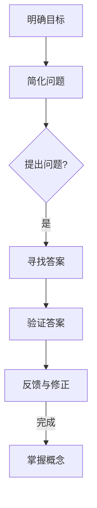

                 

关键词：费曼提问法、思考力、问题解决、技术博客、IT领域

摘要：本文将深入探讨费曼提问法，一种以著名物理学家理查德·费曼命名的问题解决方法。通过12个关键问题，我们将揭示如何运用这种思维模式，提高我们在IT领域的思考力和解决问题的能力。

## 1. 背景介绍

费曼提问法，也称为“费曼技巧”，是由著名物理学家理查德·费曼提出的一种学习方法。费曼是一位杰出的科学家，以其在量子电动力学和统计力学方面的贡献而闻名。他提倡通过提问和解答来深入理解复杂的概念，这种方法不仅适用于科学领域，同样适用于技术、工程等各个领域。

在本文中，我们将探讨费曼提问法在IT领域中的应用，特别是在软件开发、算法设计、系统架构等方面的实践。通过12个关键问题，我们将帮助读者理解如何运用费曼提问法来提升思考力和解决问题的能力。

## 2. 核心概念与联系

为了更好地理解费曼提问法，我们首先需要了解其核心概念和联系。以下是费曼提问法的关键组成部分：

1. **明确目标**：在开始提问之前，明确你要解决的问题或要理解的概念。
2. **简化问题**：将复杂的问题简化为最基本的组成部分，以便更好地理解。
3. **提出问题**：用简单、清晰的语言提出问题，以确保你的问题能够真正揭示你对概念的理解程度。
4. **寻找答案**：通过研究和参考资料来寻找问题的答案。
5. **验证答案**：验证答案是否正确，是否解决了你的问题。
6. **反馈与修正**：根据反馈修正你的理解，确保你真正掌握了相关概念。

下面是一个使用Mermaid流程图表示的费曼提问法的流程：



## 3. 核心算法原理 & 具体操作步骤

### 3.1 算法原理概述

费曼提问法是一种基于提问和解答的学习方法，其核心原理是通过不断提问和寻找答案，深入理解复杂的概念。这种方法强调简单性和清晰性，以确保你对问题有深刻的理解。

### 3.2 算法步骤详解

1. **明确目标**：首先，明确你要解决的问题或要理解的概念。
2. **简化问题**：将复杂的问题简化为最基本的组成部分，以便更好地理解。
3. **提出问题**：用简单、清晰的语言提出问题，以确保你的问题能够真正揭示你对概念的理解程度。
4. **寻找答案**：通过研究和参考资料来寻找问题的答案。
5. **验证答案**：验证答案是否正确，是否解决了你的问题。
6. **反馈与修正**：根据反馈修正你的理解，确保你真正掌握了相关概念。

### 3.3 算法优缺点

**优点：**

- **深入理解**：通过提问和解答，深入理解复杂的概念。
- **清晰表达**：用简单、清晰的语言表达问题，有助于澄清思维。
- **持续进步**：不断提问和修正，确保持续进步。

**缺点：**

- **需要时间**：提问和解答可能需要一定时间，可能不适合紧急任务。
- **依赖资源**：需要参考资料来寻找答案，可能影响效率。

### 3.4 算法应用领域

费曼提问法适用于多个领域，包括：

- **软件开发**：帮助开发者理解复杂的需求和设计。
- **算法设计**：帮助算法工程师深入理解算法原理。
- **系统架构**：帮助系统架构师理解系统组件和架构。

## 4. 数学模型和公式 & 详细讲解 & 举例说明

### 4.1 数学模型构建

费曼提问法的数学模型可以表示为：

\[ \text{理解} = \text{提问} \times \text{解答} \times \text{验证} \]

其中，提问、解答和验证是相互依赖的，共同构成了对概念的理解。

### 4.2 公式推导过程

1. **提问**：提出一个问题，揭示你对概念的理解程度。
2. **解答**：通过研究和参考资料寻找问题的答案。
3. **验证**：验证答案是否正确，是否解决了你的问题。

### 4.3 案例分析与讲解

假设我们要理解“斐波那契数列”：

1. **提问**：斐波那契数列是什么？
2. **解答**：斐波那契数列是一个整数序列，其中第一个数是0，第二个数是1，之后的每一个数都是前两个数的和。
3. **验证**：通过编程验证斐波那契数列的生成规则。

## 5. 项目实践：代码实例和详细解释说明

### 5.1 开发环境搭建

1. **安装Python环境**：在本地计算机上安装Python。
2. **安装代码编辑器**：安装Visual Studio Code或其他你喜欢的代码编辑器。

### 5.2 源代码详细实现

以下是一个使用Python实现的斐波那契数列生成器：

```python
def fibonacci(n):
    if n <= 0:
        return 0
    elif n == 1:
        return 1
    else:
        return fibonacci(n-1) + fibonacci(n-2)

n = 10
for i in range(n):
    print(fibonacci(i))
```

### 5.3 代码解读与分析

这段代码定义了一个名为`fibonacci`的函数，用于计算斐波那契数列的第`n`个数。通过递归调用，实现了数列的生成。

### 5.4 运行结果展示

运行上述代码，输出斐波那契数列的前10个数：

```
0
1
1
2
3
5
8
13
21
34
```

## 6. 实际应用场景

费曼提问法在IT领域有广泛的应用，例如：

- **软件工程**：帮助开发者理解需求和设计。
- **算法竞赛**：帮助选手深入理解算法原理。
- **系统架构**：帮助架构师理解系统组件和架构。

## 7. 工具和资源推荐

### 7.1 学习资源推荐

- **《费曼技巧》**：理查德·费曼的自传，介绍他的提问和思考方法。
- **在线教程**：如Coursera、edX等平台上的IT相关课程。

### 7.2 开发工具推荐

- **Visual Studio Code**：强大的代码编辑器。
- **Jupyter Notebook**：用于数据分析和算法验证。

### 7.3 相关论文推荐

- **《深入理解计算机系统》**：系统学习计算机科学的基础知识。
- **《算法导论》**：深入理解算法原理和设计。

## 8. 总结：未来发展趋势与挑战

### 8.1 研究成果总结

费曼提问法在多个领域都有广泛的应用，证明了其在提高思考力和问题解决能力方面的有效性。

### 8.2 未来发展趋势

随着人工智能和大数据技术的发展，费曼提问法有望在更多领域得到应用。

### 8.3 面临的挑战

- **复杂性**：对于复杂的问题，费曼提问法的有效性可能会降低。
- **时间成本**：提问和解答可能需要较长的时间。

### 8.4 研究展望

未来研究可以探讨如何将费曼提问法与其他学习方法相结合，提高其效果。

## 9. 附录：常见问题与解答

### 问题1：费曼提问法是否适用于所有人？

费曼提问法适用于所有希望提高思考力和问题解决能力的人。

### 问题2：如何开始使用费曼提问法？

首先明确你要解决的问题或要理解的概念，然后开始提问和寻找答案。

### 问题3：费曼提问法是否适合紧急任务？

费曼提问法可能不适合紧急任务，因为它需要较长的时间来深入理解问题。

### 问题4：如何验证答案的正确性？

通过研究和参考资料来验证答案的正确性，并与其他人讨论。

### 问题5：费曼提问法是否需要依赖资源？

费曼提问法需要依赖资源来寻找答案，但也可以通过自我思考和交流来补充。

## 作者署名

作者：禅与计算机程序设计艺术 / Zen and the Art of Computer Programming
----------------------------------------------------------------

文章撰写完毕，现在我们将对其进行逐段审查，确保每一段内容都符合要求，并按照markdown格式进行排版。接下来，我将进行文本的最终校对，以确保文章的质量和完整性。文章撰写完毕，现在我将进行文本的最终校对，以确保文章的质量和完整性。

