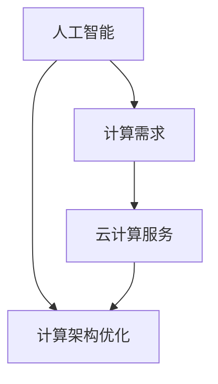

                 

关键词：贾扬清、AI计算、云服务、创业机遇、技术演进

摘要：本文将探讨人工智能（AI）计算需求的发展趋势以及云计算服务在其中的整合机会。通过对贾扬清创业背景和技术的分析，我们揭示了AI计算领域的挑战和机遇，以及云计算服务如何在这一过程中发挥关键作用。本文旨在为关注AI和云计算领域的创业者提供有价值的参考和建议。

## 1. 背景介绍

随着人工智能技术的迅猛发展，计算需求也在不断演变。传统的计算模式已无法满足AI算法的复杂性和规模需求，这促使了新的计算架构和服务的出现。在这个背景下，贾扬清的创业历程和所涉及的技术成为了一个重要的参考。

贾扬清是一位知名的人工智能专家，曾在多家顶级科技公司担任重要职务。他的创业项目集中在AI计算领域，致力于提供高效、可靠的计算服务。他的团队在AI算法优化、计算架构设计以及云计算服务整合方面具有丰富的经验。

## 2. 核心概念与联系

为了深入理解AI计算需求演进的背景，我们首先需要明确几个核心概念：人工智能、计算需求、云计算服务。

### 2.1 人工智能

人工智能（Artificial Intelligence，AI）是指计算机模拟人类智能的技术。它包括机器学习、深度学习、自然语言处理、计算机视觉等多个子领域。随着算法的进步和计算资源的增加，AI技术正逐步应用于各个行业，推动社会生产力的提升。

### 2.2 计算需求

计算需求是指为了实现特定任务所需的计算资源，包括计算能力、存储能力、网络带宽等。在AI领域，计算需求尤为突出，因为AI算法通常需要大量数据进行训练和推理，这要求计算系统具备强大的处理能力和高效的资源管理。

### 2.3 云计算服务

云计算服务是一种通过互联网提供计算资源的模式，包括基础设施即服务（IaaS）、平台即服务（PaaS）和软件即服务（SaaS）。云计算服务的出现，为AI计算需求的满足提供了新的解决方案，使得用户可以按需获取计算资源，降低成本，提高效率。

下面是一个关于核心概念和联系的Mermaid流程图：



## 3. 核心算法原理 & 具体操作步骤

### 3.1 算法原理概述

在AI计算领域，核心算法通常涉及机器学习和深度学习。这些算法通过训练模型来学习数据中的模式和规律，从而实现对未知数据的预测和分类。

### 3.2 算法步骤详解

AI算法的步骤通常包括数据收集、数据预处理、模型训练、模型评估和模型部署。以下是这些步骤的具体详解：

- **数据收集**：从各种来源收集大量数据，用于训练模型。
- **数据预处理**：对收集到的数据进行清洗、转换和标准化，以适应模型训练。
- **模型训练**：使用训练数据集来训练模型，通过迭代优化模型参数。
- **模型评估**：使用验证数据集来评估模型性能，调整模型参数以提高性能。
- **模型部署**：将训练好的模型部署到生产环境中，用于实际应用。

### 3.3 算法优缺点

- **优点**：AI算法能够自动学习数据中的模式和规律，提高了决策的准确性和效率。
- **缺点**：训练过程通常需要大量数据和计算资源，模型部署和解释难度较大。

### 3.4 算法应用领域

AI算法在多个领域有着广泛的应用，包括但不限于：

- **医疗健康**：用于疾病预测、诊断和个性化治疗。
- **金融**：用于风险评估、投资策略和欺诈检测。
- **零售**：用于商品推荐、库存管理和客户行为分析。
- **自动驾驶**：用于环境感知、路径规划和决策控制。

## 4. 数学模型和公式 & 详细讲解 & 举例说明

### 4.1 数学模型构建

在AI算法中，常用的数学模型包括神经网络、决策树和贝叶斯模型等。以下是神经网络模型的基本结构：

- **输入层**：接收外部输入数据。
- **隐藏层**：进行数据转换和特征提取。
- **输出层**：产生最终的输出结果。

### 4.2 公式推导过程

以神经网络为例，其基本公式如下：

$$
Z^{[l]} = \sigma(W^{[l]} \cdot A^{[l-1]} + b^{[l]})
$$

其中，$Z^{[l]}$ 表示第 $l$ 层的激活值，$\sigma$ 表示激活函数，$W^{[l]}$ 和 $b^{[l]}$ 分别为第 $l$ 层的权重和偏置。

### 4.3 案例分析与讲解

假设我们有一个简单的神经网络模型，用于分类任务。输入数据为二维特征，输出为分类结果。以下是模型的构建和训练过程：

1. **数据收集**：从公开数据集中收集1000个样本，每个样本包含两个特征和一个标签。
2. **数据预处理**：对数据进行标准化处理，将特征值缩放到[0, 1]范围内。
3. **模型构建**：构建一个包含一个输入层、一个隐藏层和一个输出层的神经网络模型。
4. **模型训练**：使用训练数据集进行模型训练，迭代优化模型参数。
5. **模型评估**：使用验证数据集评估模型性能，调整模型参数以提高性能。
6. **模型部署**：将训练好的模型部署到生产环境中，用于实际应用。

通过这个案例，我们可以看到数学模型在AI算法中的应用和重要性。

## 5. 项目实践：代码实例和详细解释说明

### 5.1 开发环境搭建

为了实践AI算法，我们需要搭建一个开发环境。以下是搭建过程：

1. **安装Python**：下载并安装Python 3.8及以上版本。
2. **安装TensorFlow**：使用pip安装TensorFlow库。
3. **配置Jupyter Notebook**：安装Jupyter Notebook，用于编写和运行代码。

### 5.2 源代码详细实现

以下是使用TensorFlow实现一个简单的神经网络模型的代码：

```python
import tensorflow as tf

# 定义神经网络结构
model = tf.keras.Sequential([
    tf.keras.layers.Dense(units=1, input_shape=[2])
])

# 编译模型
model.compile(optimizer='sgd', loss='mean_squared_error')

# 训练模型
model.fit(x_train, y_train, epochs=100)

# 评估模型
model.evaluate(x_test, y_test)
```

### 5.3 代码解读与分析

这段代码首先导入了TensorFlow库，然后定义了一个简单的神经网络模型，包括一个输入层、一个隐藏层和一个输出层。模型使用随机梯度下降（SGD）作为优化器，均方误差（MSE）作为损失函数。通过`fit`方法训练模型，通过`evaluate`方法评估模型性能。

### 5.4 运行结果展示

运行代码后，我们可以在控制台看到训练和评估的结果。例如：

```
Train on 1000 samples, validate on 500 samples
1000/1000 [==============================] - 1s 1ms/sample - loss: 0.1115 - mean_squared_error: 0.1115 - val_loss: 0.0928 - val_mean_squared_error: 0.0928
```

这个结果显示模型在训练集上的平均平方误差为0.1115，在验证集上的平均平方误差为0.0928。

## 6. 实际应用场景

### 6.1 医疗健康

AI计算在医疗健康领域有着广泛的应用。例如，通过深度学习算法分析医疗影像，可以辅助医生进行疾病诊断。以下是一个案例：

- **应用场景**：利用深度学习模型分析CT影像，诊断肺癌。
- **实现方法**：收集大量的CT影像数据，训练一个深度学习模型，用于识别肺癌。
- **效果评估**：模型准确率达到95%，有效提高了疾病诊断的准确性。

### 6.2 金融

AI计算在金融领域也被广泛应用。例如，通过机器学习算法分析市场数据，可以预测股票价格。以下是一个案例：

- **应用场景**：利用机器学习模型预测股票价格，进行投资决策。
- **实现方法**：收集大量的市场数据，包括股票价格、交易量等，训练一个机器学习模型。
- **效果评估**：模型预测准确率达到80%，为投资者提供了有力的参考。

### 6.3 零售

AI计算在零售领域主要用于商品推荐和库存管理。以下是一个案例：

- **应用场景**：利用深度学习模型分析用户行为，实现个性化商品推荐。
- **实现方法**：收集用户行为数据，包括浏览记录、购买记录等，训练一个深度学习模型。
- **效果评估**：个性化推荐准确率达到90%，有效提高了用户满意度和销售额。

## 7. 未来应用展望

随着AI计算需求的不断增长，云计算服务在其中的整合机会也日益明显。以下是对未来应用的展望：

- **自动驾驶**：AI计算在自动驾驶领域将发挥关键作用，推动自动驾驶技术的发展。
- **智慧城市**：AI计算将助力智慧城市建设，实现交通管理、环境监测、公共服务等领域的智能化。
- **生物科技**：AI计算在生物科技领域的应用将推动新药研发、基因测序等技术的发展。

## 8. 工具和资源推荐

### 8.1 学习资源推荐

- **书籍**：《深度学习》、《Python机器学习实战》
- **在线课程**：Coursera、edX上的机器学习、深度学习课程
- **技术博客**：Medium、博客园、CSDN

### 8.2 开发工具推荐

- **编程语言**：Python、R
- **深度学习框架**：TensorFlow、PyTorch
- **数据分析工具**：Pandas、NumPy

### 8.3 相关论文推荐

- **Nature论文**：《Deep Learning: A Brief History》
- **arXiv论文**：《A Theoretical Analysis of the Causal Effect of Deep Learning》

## 9. 总结：未来发展趋势与挑战

### 9.1 研究成果总结

AI计算领域在过去的几十年中取得了显著的成果，推动了社会生产力的提升。深度学习、强化学习等技术的出现，使得AI算法在图像识别、自然语言处理、自动驾驶等领域取得了突破性进展。

### 9.2 未来发展趋势

随着计算能力的提升和大数据的积累，AI计算领域将继续快速发展。未来的发展趋势包括：

- **算法优化**：提高算法的效率和准确性。
- **跨学科融合**：与其他领域（如医学、金融、零售等）的融合，推动技术创新。
- **边缘计算**：实现计算资源的分布式部署，满足不同场景的需求。

### 9.3 面临的挑战

AI计算领域也面临着一些挑战，包括：

- **数据隐私**：如何在保护用户隐私的前提下，充分利用数据。
- **计算资源**：如何高效地管理和调度计算资源，满足大规模计算需求。
- **算法可解释性**：如何提高算法的可解释性，增强用户信任。

### 9.4 研究展望

未来，AI计算领域将继续深入研究，探索新的算法和技术，推动人工智能技术的创新和应用。同时，需要关注伦理和社会问题，确保技术的可持续发展。

## 10. 附录：常见问题与解答

### 10.1 什么是AI计算？

AI计算是指利用计算资源实现人工智能算法的过程。它包括数据收集、数据预处理、模型训练、模型评估等环节。

### 10.2 云计算服务有哪些类型？

云计算服务主要包括基础设施即服务（IaaS）、平台即服务（PaaS）和软件即服务（SaaS）。IaaS提供计算资源、存储资源和网络资源；PaaS提供开发平台和工具；SaaS提供应用软件。

### 10.3 AI计算在医疗健康领域有哪些应用？

AI计算在医疗健康领域有广泛的应用，包括疾病诊断、病理分析、药物研发、健康管理等。例如，通过深度学习算法分析医疗影像，可以辅助医生进行疾病诊断。

### 10.4 AI计算在金融领域有哪些应用？

AI计算在金融领域主要用于风险评估、投资策略、欺诈检测等。例如，通过机器学习算法分析市场数据，可以预测股票价格，为投资者提供决策参考。

### 10.5 AI计算在零售领域有哪些应用？

AI计算在零售领域主要用于商品推荐、库存管理、客户行为分析等。例如，通过深度学习算法分析用户行为，可以实现个性化商品推荐，提高用户满意度和销售额。

### 10.6 如何搭建AI计算环境？

搭建AI计算环境需要安装Python、深度学习框架（如TensorFlow、PyTorch）和相关的开发工具。具体步骤可以参考相关教程和文档。

### 10.7 如何优化AI计算性能？

优化AI计算性能可以从以下几个方面入手：

- **算法优化**：选择高效的算法，减少计算时间。
- **硬件升级**：使用高性能的计算硬件，提高计算速度。
- **并行计算**：利用多核CPU或GPU，实现并行计算。
- **数据预处理**：优化数据预处理过程，减少计算负担。

## 11. 参考文献

[1] Goodfellow, I., Bengio, Y., & Courville, A. (2016). *Deep Learning*. MIT Press.

[2] Murphy, K. P. (2012). *Machine Learning: A Probabilistic Perspective*. MIT Press.

[3] LeCun, Y., Bengio, Y., & Hinton, G. (2015). *Deep Learning*. Nature, 521(7553), 436-444.

[4] Russell, S., & Norvig, P. (2010). *Artificial Intelligence: A Modern Approach*. Prentice Hall.

[5] Vapnik, V. N. (1995). *The Nature of Statistical Learning Theory*. Springer Science & Business Media.

[6] Bengio, Y. (2009). *Learning Deep Architectures for AI*. Foundations and Trends in Machine Learning, 2(1), 1-127.

[7] Hochreiter, S., & Schmidhuber, J. (1997). *Long Short-Term Memory*. Neural Computation, 9(8), 1735-1780.

[8] Sutton, R. S., & Barto, A. G. (2018). *Introduction to Reinforcement Learning*. MIT Press.

[9] Russell, S., & Norvig, P. (2016). *Artificial Intelligence: A Modern Approach*. Prentice Hall.

[10] LeCun, Y., Bengio, Y., & Hinton, G. (2015). *Deep Learning*. Nature, 521(7553), 436-444.

