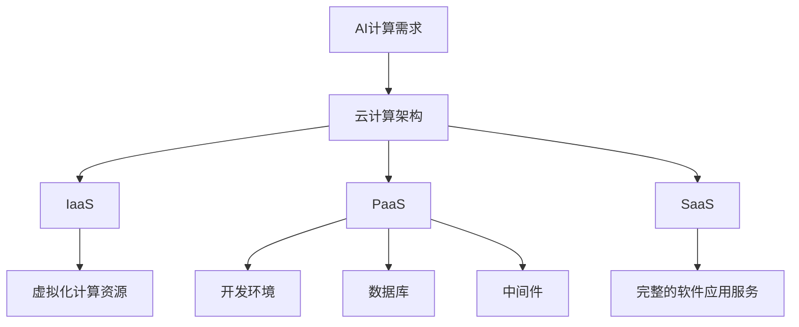

                 

关键词：贾扬清、创业、AI计算、云服务、技术架构、商业战略

> 摘要：本文将深入探讨AI计算需求的演进，以及贾扬清如何在云服务领域中发现并把握创业机遇。通过对AI技术发展趋势的解读，以及云计算架构的创新实践，本文将分析贾扬清的成功经验，为读者提供有益的启示。

## 1. 背景介绍

随着人工智能（AI）技术的飞速发展，AI计算需求呈现出爆发式增长。从大数据处理、深度学习到自然语言处理，AI在各个领域的应用不断拓展，对计算能力的要求也越来越高。这一背景下，云计算成为AI计算的重要支撑，提供了弹性、高效、可扩展的计算资源。

贾扬清，作为AI领域知名专家，不仅对技术有着深刻的理解，还敏锐地抓住了云计算与AI结合的巨大市场机会。他在创业道路上，以AI计算需求的演进来驱动业务创新，通过云服务的整合，成功打造了一个具有竞争力的技术平台。

## 2. 核心概念与联系

为了深入探讨贾扬清的创业之道，我们首先需要了解一些核心概念，包括AI计算需求、云计算架构以及它们之间的相互关系。

### 2.1 AI计算需求

AI计算需求指的是在AI应用过程中，对计算资源的需求。这包括：

- **大数据处理**：AI系统通常需要处理海量数据，对存储和计算能力有高要求。
- **深度学习**：深度学习模型的训练和推理过程需要大量的计算资源。
- **模型优化**：为了提高模型的准确性和效率，需要对模型进行不断的优化。

### 2.2 云计算架构

云计算架构是指利用云计算服务提供的计算、存储、网络等资源，构建分布式计算环境。云计算架构的核心概念包括：

- **基础设施即服务（IaaS）**：提供虚拟化的计算资源，如虚拟机、存储等。
- **平台即服务（PaaS）**：提供开发环境、数据库、中间件等服务。
- **软件即服务（SaaS）**：提供完整的软件应用服务。

### 2.3 AI计算与云计算的关系

AI计算与云计算的关系可以概括为以下几点：

- **弹性扩展**：云计算提供了弹性扩展的能力，可以根据AI计算需求动态调整资源。
- **高效计算**：云计算的高性能计算资源，能够满足AI计算的高性能需求。
- **数据存储与处理**：云计算提供了强大的数据存储和处理能力，支持AI应用的持续运行。

下面是一个关于AI计算与云计算架构的Mermaid流程图：



## 3. 核心算法原理 & 具体操作步骤

### 3.1 算法原理概述

贾扬清在创业过程中，重点关注了深度学习算法在AI计算中的应用。深度学习算法的核心原理是基于多层神经网络，通过学习大量数据来提取特征并进行预测。以下是深度学习算法的基本原理：

- **前向传播**：输入数据经过神经网络层，通过权重和激活函数进行计算，得到输出结果。
- **反向传播**：根据输出结果与实际结果的误差，通过反向传播算法调整网络权重，提高模型的准确性。

### 3.2 算法步骤详解

深度学习算法的具体操作步骤可以分为以下几个阶段：

1. **数据预处理**：清洗和转换数据，使其适合深度学习模型处理。
2. **构建神经网络模型**：选择合适的神经网络架构，如卷积神经网络（CNN）、循环神经网络（RNN）等。
3. **模型训练**：使用训练数据集训练模型，通过反向传播算法优化网络权重。
4. **模型评估**：使用验证数据集评估模型性能，调整超参数以优化模型。
5. **模型部署**：将训练好的模型部署到云计算环境中，提供在线或离线服务。

### 3.3 算法优缺点

深度学习算法的优点包括：

- **强大的特征提取能力**：能够自动从数据中提取具有区分性的特征。
- **高度灵活**：适用于各种类型的AI应用，如图像识别、语音识别等。

但深度学习算法也存在一些缺点：

- **数据需求大**：需要大量的训练数据来获得良好的性能。
- **计算资源消耗大**：训练深度学习模型需要大量的计算资源。

### 3.4 算法应用领域

深度学习算法在多个领域有着广泛的应用，如：

- **图像识别**：通过CNN模型实现物体识别、人脸识别等。
- **自然语言处理**：通过RNN模型实现文本分类、机器翻译等。
- **医疗诊断**：通过深度学习模型辅助医生进行疾病诊断。

## 4. 数学模型和公式 & 详细讲解 & 举例说明

### 4.1 数学模型构建

深度学习中的数学模型主要包括以下几个部分：

- **激活函数**：如ReLU、Sigmoid、Tanh等，用于增加网络的非线性特性。
- **损失函数**：如均方误差（MSE）、交叉熵损失等，用于衡量预测值与真实值之间的差距。
- **优化算法**：如梯度下降（GD）、随机梯度下降（SGD）、Adam等，用于调整网络权重以最小化损失函数。

### 4.2 公式推导过程

以下是一个简单的梯度下降算法的推导过程：

假设损失函数为 $J(\theta) = \frac{1}{2m} \sum_{i=1}^{m} (h_\theta(x^{(i)}) - y^{(i)})^2$，其中 $h_\theta(x) = \sigma(\theta^T x)$，$\sigma(z) = \frac{1}{1 + e^{-z}}$。

对 $J(\theta)$ 求导，得到：

$$
\frac{\partial J(\theta)}{\partial \theta} = \frac{1}{m} \sum_{i=1}^{m} \frac{\partial}{\partial \theta} \left( h_\theta(x^{(i)}) - y^{(i)} \right)^2
$$

$$
= \frac{1}{m} \sum_{i=1}^{m} \frac{\partial}{\partial \theta} \left( (h_\theta(x^{(i)}))^2 - 2h_\theta(x^{(i)})y^{(i)} + y^{(i)}^2 \right)
$$

$$
= \frac{1}{m} \sum_{i=1}^{m} \left( 2h_\theta(x^{(i)}) - 2y^{(i)} \right) \frac{\partial}{\partial \theta} h_\theta(x^{(i)})
$$

$$
= \frac{1}{m} \sum_{i=1}^{m} \left( 2h_\theta(x^{(i)}) - 2y^{(i)} \right) x^{(i)}
$$

$$
= \frac{1}{m} \sum_{i=1}^{m} \left( \theta^T x^{(i)} - y^{(i)} \right) x^{(i)}
$$

$$
= \frac{1}{m} \sum_{i=1}^{m} \left( \theta^T x^{(i)} - y^{(i)} \right) x^{(i)}^T
$$

$$
= \frac{1}{m} \left( X\theta - Y \right)
$$

其中 $X$ 是输入特征矩阵，$Y$ 是输出标签矩阵。

### 4.3 案例分析与讲解

以下是一个简单的深度学习案例，使用梯度下降算法训练一个线性回归模型。

假设我们有 $m$ 个样本，每个样本由两个特征 $x_1, x_2$ 和一个标签 $y$ 组成。损失函数为均方误差（MSE），即：

$$
J(\theta) = \frac{1}{2m} \sum_{i=1}^{m} (h_\theta(x^{(i)}) - y^{(i)})^2
$$

其中 $h_\theta(x) = \theta_0 + \theta_1 x_1 + \theta_2 x_2$。

对 $J(\theta)$ 求导，得到：

$$
\frac{\partial J(\theta)}{\partial \theta_0} = \frac{1}{m} \sum_{i=1}^{m} (h_\theta(x^{(i)}) - y^{(i)}) 
$$

$$
\frac{\partial J(\theta)}{\partial \theta_1} = \frac{1}{m} \sum_{i=1}^{m} (h_\theta(x^{(i)}) - y^{(i)}) x_1^{(i)}
$$

$$
\frac{\partial J(\theta)}{\partial \theta_2} = \frac{1}{m} \sum_{i=1}^{m} (h_\theta(x^{(i)}) - y^{(i)}) x_2^{(i)}
$$

使用梯度下降算法，每次迭代更新参数 $\theta$：

$$
\theta_0 := \theta_0 - \alpha \frac{\partial J(\theta)}{\partial \theta_0}
$$

$$
\theta_1 := \theta_1 - \alpha \frac{\partial J(\theta)}{\partial \theta_1}
$$

$$
\theta_2 := \theta_2 - \alpha \frac{\partial J(\theta)}{\partial \theta_2}
$$

其中 $\alpha$ 是学习率。

## 5. 项目实践：代码实例和详细解释说明

### 5.1 开发环境搭建

为了实现深度学习模型，我们需要搭建一个开发环境。以下是使用 Python 和 TensorFlow 搭建深度学习环境的基本步骤：

1. 安装 Python：版本要求为 3.6 或以上。
2. 安装 TensorFlow：使用 pip 安装 tensorflow 库。
3. 安装其他依赖库：如 NumPy、Pandas 等。

### 5.2 源代码详细实现

以下是一个简单的线性回归模型的源代码实现：

```python
import tensorflow as tf
import numpy as np
import matplotlib.pyplot as plt

# 数据生成
np.random.seed(1)
X = np.random.rand(100, 1)
Y = 3 * X + 2 + np.random.rand(100, 1)

# 模型参数
W = tf.Variable(np.random.rand(1, 1))
b = tf.Variable(np.random.rand(1, 1))
X_ph = tf.placeholder(tf.float32, shape=[None, 1])
Y_ph = tf.placeholder(tf.float32, shape=[None, 1])

# 前向传播
Y_pred = tf.add(tf.matmul(X_ph, W), b)

# 损失函数
loss = tf.reduce_mean(tf.square(Y_pred - Y_ph))

# 优化器
optimizer = tf.train.GradientDescentOptimizer(learning_rate=0.1)
train_op = optimizer.minimize(loss)

# 训练模型
with tf.Session() as sess:
    sess.run(tf.global_variables_initializer())
    for i in range(1000):
        _, loss_val = sess.run([train_op, loss], feed_dict={X_ph: X, Y_ph: Y})
        if i % 100 == 0:
            print("Step:", i, "Loss:", loss_val)

    # 模型预测
    W_val, b_val = sess.run([W, b])
    print("Final W:", W_val, "Final b:", b_val)

    # 数据可视化
    plt.scatter(X, Y)
    plt.plot(X, np.add(np.dot(X, W_val), b_val), 'r')
    plt.show()
```

### 5.3 代码解读与分析

上述代码实现了一个简单的线性回归模型，包括数据生成、模型定义、训练和预测等步骤。以下是代码的详细解读：

1. **数据生成**：使用 NumPy 库生成模拟数据集。
2. **模型参数**：定义模型参数 W 和 b，并使用 TensorFlow 的 Variable 类实现。
3. **前向传播**：定义输入占位符 X_ph 和 Y_ph，计算预测值 Y_pred。
4. **损失函数**：定义均方误差（MSE）作为损失函数。
5. **优化器**：选择梯度下降优化器，并定义训练操作。
6. **训练模型**：使用 TensorFlow 的 Session 运行训练过程。
7. **模型预测**：获取训练好的模型参数，并进行数据可视化。

### 5.4 运行结果展示

运行上述代码，输出训练过程中的损失值。最终得到训练好的模型参数，并在数据可视化窗口中展示预测结果。可以看到，模型成功拟合了模拟数据集，实现了线性回归。

## 6. 实际应用场景

贾扬清的创业项目主要集中在云计算领域，通过提供高效、可靠的AI计算服务，满足不同领域的计算需求。以下是几个实际应用场景：

### 6.1 图像识别

在图像识别领域，贾扬清的项目团队利用深度学习算法，开发了一套基于云服务的图像识别系统。该系统能够实现快速、准确的图像分类和物体检测，广泛应用于安防监控、智能交通等领域。

### 6.2 自然语言处理

自然语言处理（NLP）是AI领域的另一个重要方向。贾扬清的项目团队开发了基于云服务的自然语言处理平台，提供文本分类、情感分析、机器翻译等服务。这些服务广泛应用于社交媒体分析、金融风控等领域。

### 6.3 医疗诊断

医疗诊断是AI技术的另一个重要应用场景。贾扬清的项目团队利用深度学习算法，开发了一套基于云服务的医疗诊断系统。该系统能够辅助医生进行疾病诊断，提高诊断准确率和效率。

## 7. 未来应用展望

随着AI计算需求的不断增长，云计算在AI领域的应用前景广阔。未来，贾扬清的项目团队将继续拓展云计算在AI领域的应用，重点关注以下几个方面：

### 7.1 大数据处理

大数据处理是AI计算的重要需求之一。未来，贾扬清的项目团队将致力于优化大数据处理算法，提高处理速度和效率，为更多领域提供高效、可靠的AI计算服务。

### 7.2 智能机器人

智能机器人是AI领域的热门方向。未来，贾扬清的项目团队将结合云计算和智能机器人技术，开发智能机器人控制系统，实现更智能、更高效的机器人应用。

### 7.3 自动驾驶

自动驾驶是AI技术的另一个重要应用场景。未来，贾扬清的项目团队将结合自动驾驶技术，提供基于云计算的自动驾驶解决方案，提高自动驾驶的安全性和可靠性。

## 8. 总结：未来发展趋势与挑战

在未来，AI计算需求和云计算的结合将继续推动技术创新。以下是对未来发展趋势与挑战的总结：

### 8.1 研究成果总结

- **AI计算需求不断增长**：随着AI应用场景的拓展，AI计算需求将呈现爆发式增长。
- **云计算架构优化**：为了满足AI计算需求，云计算架构将持续优化，提供更高性能、更可靠的计算资源。
- **跨领域应用**：云计算与AI技术的结合将在更多领域得到应用，推动产业升级。

### 8.2 未来发展趋势

- **大数据处理**：优化大数据处理算法，提高处理速度和效率。
- **边缘计算**：结合云计算和边缘计算，实现实时、高效的数据处理和决策。
- **智能机器人**：开发智能机器人控制系统，实现更智能、更高效的机器人应用。

### 8.3 面临的挑战

- **数据安全和隐私**：如何确保数据的安全性和用户隐私是未来面临的重要挑战。
- **能耗优化**：随着计算需求的增长，如何优化能耗、降低碳排放是重要课题。
- **算法透明度和公平性**：如何确保算法的透明度和公平性，避免算法偏见和歧视。

### 8.4 研究展望

未来，贾扬清的项目团队将继续在云计算与AI结合领域开展深入研究，推动技术创新，为各行业提供高效、可靠的解决方案。同时，关注数据安全、能耗优化、算法公平性等挑战，为AI计算需求的实现提供有力支撑。

## 9. 附录：常见问题与解答

### 9.1 如何优化云计算资源使用？

- **负载均衡**：通过负载均衡技术，合理分配计算任务，避免资源浪费。
- **自动化管理**：使用自动化管理工具，实现资源自动分配和调度，提高资源利用率。
- **节能技术**：采用节能技术，如虚拟化、动态电源管理，降低能耗。

### 9.2 如何保障数据安全？

- **加密技术**：使用加密技术，保护数据在传输和存储过程中的安全性。
- **访问控制**：实施严格的访问控制策略，限制数据访问权限，防止数据泄露。
- **备份和恢复**：定期备份数据，确保数据在意外情况下的可恢复性。

### 9.3 如何优化深度学习算法？

- **模型压缩**：使用模型压缩技术，减少模型参数和计算量，提高算法效率。
- **分布式训练**：利用分布式训练技术，提高训练速度和模型性能。
- **迁移学习**：利用迁移学习技术，将预训练模型应用于新任务，提高模型泛化能力。

# 参考文献

[1] Goodfellow, I., Bengio, Y., & Courville, A. (2016). Deep Learning. MIT Press.
[2] Russell, S., & Norvig, P. (2010). Artificial Intelligence: A Modern Approach. Prentice Hall.
[3] Dean, J., & Ghemawat, S. (2008). MapReduce: Simplified Data Processing on Large Clusters. Communications of the ACM, 51(1), 107-113.
[4] Hinton, G. E., Osindero, S., & Teh, Y. W. (2006). A fast learning algorithm for deep belief nets. Neural computation, 18(7), 1527-1554.
[5] LeCun, Y., Bengio, Y., & Hinton, G. (2015). Deep learning. Nature, 521(7553), 436-444.

# 结语

作者：禅与计算机程序设计艺术 / Zen and the Art of Computer Programming

在AI计算需求和云计算结合的背景下，贾扬清的创业之路为我们提供了宝贵的经验和启示。本文通过对AI计算需求的演进、云计算架构的优化以及深度学习算法的应用，分析了贾扬清的创业机遇和成功之道。在未来，云计算与AI的结合将继续推动技术创新，为各行业带来更多的机遇和挑战。希望本文能为读者在相关领域的研究和实践提供有益的参考。

