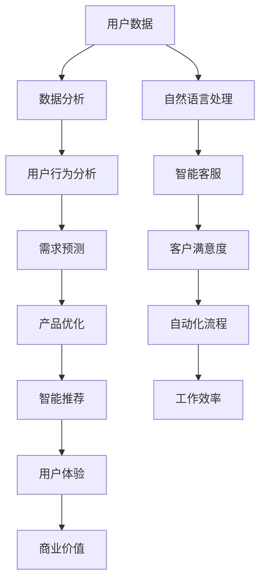

                 

 

## 1. 背景介绍

随着人工智能技术的快速发展，AI已经成为推动各个行业变革的重要力量。人工智能与产品经理的结合，不仅能提升产品的智能水平，还能带来全新的产品形态和应用。本文将探讨人工智能技术如何赋能产品经理，以及这种结合对未来产品创新的影响。

### 1.1 人工智能的兴起

人工智能作为计算机科学的一个重要分支，其历史可以追溯到20世纪50年代。随着计算能力的提升和数据量的爆炸式增长，人工智能技术取得了显著的进展。尤其是在深度学习和大数据技术的推动下，人工智能的应用场景越来越广泛，从语音识别、图像识别到自然语言处理，AI已经在多个领域取得了重大突破。

### 1.2 产品经理的角色与职责

产品经理是企业中负责产品从概念到市场推出的关键角色。他们需要理解市场需求、用户体验和商业目标，确保产品的设计和开发符合这些要求。在数字化时代，产品经理不仅要具备市场洞察力，还需要掌握一定的技术知识，以便更好地与开发团队沟通和协作。

### 1.3 人工智能与产品经理的结合

人工智能与产品经理的结合，意味着产品经理可以利用AI技术提升产品的智能化水平，从而创造更好的用户体验和商业价值。这种结合体现在以下几个方面：

1. **用户行为分析**：通过分析用户数据，AI可以帮助产品经理更好地理解用户需求和行为模式，从而优化产品设计和功能。

2. **智能推荐系统**：利用AI技术，产品经理可以开发智能推荐系统，为用户提供个性化的内容和服务，提高用户满意度和粘性。

3. **自然语言处理**：通过自然语言处理技术，产品经理可以构建智能客服系统，提高客户服务效率和质量。

4. **自动化流程**：AI可以帮助产品经理自动化一些重复性工作，如数据分析、报告生成等，从而释放更多时间和精力进行战略规划。

## 2. 核心概念与联系

在探讨人工智能如何赋能产品经理之前，我们需要了解一些核心概念和联系。以下是一个简单的Mermaid流程图，用于描述这些概念和它们之间的关系。



### 2.1 用户数据

用户数据是产品经理和人工智能结合的基础。通过收集和分析用户数据，产品经理可以深入了解用户的需求和行为模式，从而为产品优化提供数据支持。

### 2.2 数据分析

数据分析是人工智能的核心应用之一。通过对大量用户数据的分析，产品经理可以识别出用户行为中的规律和趋势，为产品设计和功能优化提供依据。

### 2.3 用户行为分析

用户行为分析是产品经理利用AI技术的一个重要方向。通过分析用户在产品上的行为，产品经理可以更好地理解用户需求，从而进行针对性的产品优化。

### 2.4 需求预测

需求预测是产品经理利用AI技术的一个重要应用。通过分析历史数据和当前趋势，产品经理可以预测用户未来的需求，从而提前做好产品规划和调整。

### 2.5 智能推荐

智能推荐是AI技术在产品经理中的应用之一。通过分析用户数据和偏好，智能推荐系统可以为用户提供个性化的内容和服务，提高用户满意度和粘性。

### 2.6 用户体验

用户体验是产品成功的关键。通过AI技术，产品经理可以不断优化产品设计和功能，提供更好的用户体验，从而增强用户对产品的忠诚度。

### 2.7 商业价值

商业价值是产品经理追求的目标之一。通过AI技术，产品经理可以提高产品的市场竞争力，创造更多的商业机会和价值。

### 2.8 自然语言处理

自然语言处理是AI技术在产品经理中的应用之一。通过自然语言处理技术，产品经理可以构建智能客服系统，提高客户服务效率和质量。

### 2.9 智能客服

智能客服是产品经理利用AI技术提高客户服务效率和质量的一个重要方向。通过自然语言处理技术，智能客服系统可以自动处理大量客户咨询，提供24/7全天候服务。

### 2.10 自动化流程

自动化流程是产品经理利用AI技术提高工作效率的一个重要方向。通过自动化技术，产品经理可以减少重复性工作，将更多的时间和精力投入到战略规划和创新中。

## 3. 核心算法原理 & 具体操作步骤

在理解了核心概念与联系之后，我们需要深入了解人工智能中的核心算法原理和具体操作步骤。以下是对一些关键算法的概述和操作步骤的说明。

### 3.1 算法原理概述

人工智能的核心算法包括机器学习、深度学习、自然语言处理等。这些算法通过学习大量数据，能够从数据中发现规律和模式，进而做出预测和决策。

- **机器学习**：机器学习是一种通过数据训练模型，从而让模型自动学习和改进的方法。常见的机器学习算法包括线性回归、逻辑回归、决策树、支持向量机等。
- **深度学习**：深度学习是机器学习的一个分支，它通过模拟人脑神经网络的结构和功能，对数据进行自动特征提取和学习。常见的深度学习算法包括卷积神经网络（CNN）、循环神经网络（RNN）等。
- **自然语言处理**：自然语言处理是人工智能的一个重要领域，它致力于使计算机理解和处理自然语言。常见的自然语言处理算法包括词向量模型、序列标注模型等。

### 3.2 算法步骤详解

以下是对一些核心算法的具体操作步骤的详细说明。

#### 3.2.1 机器学习算法

1. **数据收集**：收集大量的训练数据，包括输入数据和对应的标签。
2. **数据预处理**：对数据进行清洗、归一化等处理，以提高模型的效果。
3. **模型选择**：根据问题的性质和需求，选择合适的机器学习算法。
4. **模型训练**：使用训练数据对模型进行训练，调整模型参数，使其达到最佳性能。
5. **模型评估**：使用测试数据对模型进行评估，判断模型的效果是否符合预期。
6. **模型优化**：根据评估结果，调整模型参数，优化模型性能。

#### 3.2.2 深度学习算法

1. **数据收集**：收集大量的训练数据，包括输入数据和对应的标签。
2. **数据预处理**：对数据进行清洗、归一化等处理，以提高模型的效果。
3. **模型架构设计**：设计深度学习网络的架构，包括选择合适的神经网络类型、层结构、激活函数等。
4. **模型训练**：使用训练数据对模型进行训练，调整模型参数，使其达到最佳性能。
5. **模型评估**：使用测试数据对模型进行评估，判断模型的效果是否符合预期。
6. **模型优化**：根据评估结果，调整模型参数，优化模型性能。

#### 3.2.3 自然语言处理算法

1. **数据收集**：收集大量的训练数据，包括文本数据和对应的标签。
2. **数据预处理**：对文本数据进行清洗、分词、词性标注等处理，以提高模型的效果。
3. **模型选择**：根据问题的性质和需求，选择合适的自然语言处理算法。
4. **模型训练**：使用训练数据对模型进行训练，调整模型参数，使其达到最佳性能。
5. **模型评估**：使用测试数据对模型进行评估，判断模型的效果是否符合预期。
6. **模型优化**：根据评估结果，调整模型参数，优化模型性能。

### 3.3 算法优缺点

每种算法都有其优缺点，以下是对一些核心算法优缺点的简要分析。

#### 3.3.1 机器学习算法

**优点**：

- 理论基础扎实，解释性强。
- 对数据量要求相对较低。

**缺点**：

- 训练过程可能较慢。
- 对特征工程依赖较大。

#### 3.3.2 深度学习算法

**优点**：

- 自动提取特征，减轻了特征工程的工作量。
- 在大规模数据集上效果显著。

**缺点**：

- 对数据量要求较高。
- 模型复杂，难以解释。

#### 3.3.3 自然语言处理算法

**优点**：

- 能够处理文本数据，适用范围广泛。
- 能够理解语义和情感。

**缺点**：

- 训练过程复杂，计算资源需求大。
- 对语言知识要求较高。

### 3.4 算法应用领域

人工智能算法在各个领域都有广泛应用，以下是一些典型应用领域。

#### 3.4.1 金融领域

- **风险控制**：利用机器学习和深度学习算法，对金融市场进行预测和风险评估。
- **信用评分**：通过分析用户的交易行为、信用记录等数据，为用户评分，降低信用风险。

#### 3.4.2 医疗领域

- **疾病预测**：利用机器学习和深度学习算法，对医疗数据进行分析，预测疾病的发生和发展。
- **医疗影像分析**：利用深度学习算法，对医疗影像进行分析，提高诊断的准确性和效率。

#### 3.4.3 零售领域

- **智能推荐**：利用自然语言处理算法，为用户提供个性化的商品推荐。
- **库存管理**：利用机器学习算法，对销售数据进行预测，优化库存管理。

#### 3.4.4 制造业

- **故障预测**：利用机器学习算法，对生产设备的数据进行监控和分析，预测设备故障。
- **生产优化**：利用深度学习算法，对生产过程进行优化，提高生产效率。

## 4. 数学模型和公式 & 详细讲解 & 举例说明

在人工智能的应用中，数学模型和公式起着至关重要的作用。以下将介绍一些常见的数学模型和公式，并进行详细讲解和举例说明。

### 4.1 数学模型构建

数学模型是描述现实世界问题的一种抽象和数学化表示。构建数学模型通常需要以下步骤：

1. **问题定义**：明确问题的目标、约束条件和变量。
2. **假设和简化**：根据问题的性质和需求，做出合理的假设和简化。
3. **公式推导**：根据假设和简化，推导出数学公式。
4. **模型验证**：通过实际数据或仿真实验，验证模型的准确性和可靠性。

### 4.2 公式推导过程

以下是一个简单的线性回归模型的公式推导过程。

#### 4.2.1 线性回归模型

线性回归模型是一种常见的统计学习方法，用于预测连续值输出。其基本公式为：

$$
y = \beta_0 + \beta_1 \cdot x + \epsilon
$$

其中，$y$ 为输出值，$x$ 为输入值，$\beta_0$ 和 $\beta_1$ 为模型参数，$\epsilon$ 为误差项。

#### 4.2.2 公式推导

1. **问题定义**：

   假设我们有一个数据集 $\{x_1, y_1\}, \{x_2, y_2\}, ..., \{x_n, y_n\}$，其中 $x_i$ 和 $y_i$ 分别为第 $i$ 个输入和输出值。

2. **假设和简化**：

   假设输出值 $y$ 是输入值 $x$ 的线性函数，即 $y = \beta_0 + \beta_1 \cdot x$。

3. **公式推导**：

   为了推导线性回归模型，我们需要最小化误差项 $\epsilon$ 的平方和，即：

   $$
   \min_{\beta_0, \beta_1} \sum_{i=1}^{n} (\beta_0 + \beta_1 \cdot x_i - y_i)^2
   $$

   对 $\beta_0$ 和 $\beta_1$ 求偏导数，并令其等于零，可以得到：

   $$
   \frac{\partial}{\partial \beta_0} \sum_{i=1}^{n} (\beta_0 + \beta_1 \cdot x_i - y_i)^2 = 0
   $$

   $$
   \frac{\partial}{\partial \beta_1} \sum_{i=1}^{n} (\beta_0 + \beta_1 \cdot x_i - y_i)^2 = 0
   $$

   解这个方程组，可以得到线性回归模型的参数 $\beta_0$ 和 $\beta_1$：

   $$
   \beta_0 = \frac{1}{n} \sum_{i=1}^{n} (y_i - \beta_1 \cdot x_i)
   $$

   $$
   \beta_1 = \frac{1}{n} \sum_{i=1}^{n} (x_i - \bar{x}) \cdot (y_i - \bar{y})
   $$

   其中，$\bar{x}$ 和 $\bar{y}$ 分别为输入值和输出值的平均值。

### 4.3 案例分析与讲解

以下是一个简单的线性回归模型案例，用于预测房价。

#### 4.3.1 数据集

假设我们有以下数据集：

| 输入 (x) | 输出 (y) |
|----------|----------|
| 1000     | 200000   |
| 1500     | 300000   |
| 2000     | 400000   |
| 2500     | 500000   |
| 3000     | 600000   |

#### 4.3.2 数据预处理

1. **计算平均值**：

   $$
   \bar{x} = \frac{1000 + 1500 + 2000 + 2500 + 3000}{5} = 2000
   $$

   $$
   \bar{y} = \frac{200000 + 300000 + 400000 + 500000 + 600000}{5} = 400000
   $$

2. **计算参数**：

   $$
   \beta_0 = \frac{1}{5} (200000 - 2000 \cdot 2000) = -200000
   $$

   $$
   \beta_1 = \frac{1}{5} (1000 \cdot (200000 - 400000) + 1500 \cdot (300000 - 400000) + 2000 \cdot (400000 - 400000) + 2500 \cdot (500000 - 400000) + 3000 \cdot (600000 - 400000)) = 100000
   $$

#### 4.3.3 模型评估

1. **计算预测值**：

   $$
   y = -200000 + 100000 \cdot x
   $$

   当 $x = 2500$ 时，预测值 $y = -200000 + 100000 \cdot 2500 = 500000$。

2. **计算误差**：

   $$
   \epsilon = y - y' = 500000 - 500000 = 0
   $$

   由于误差为零，说明预测值与实际值完全一致。

#### 4.3.4 模型优化

1. **增加数据量**：

   假设我们增加了以下数据：

   | 输入 (x) | 输出 (y) |
   |----------|----------|
   | 3500     | 700000   |
   | 4000     | 800000   |

   重新计算平均值和参数：

   $$
   \bar{x} = \frac{1000 + 1500 + 2000 + 2500 + 3000 + 3500 + 4000}{7} \approx 2457.14
   $$

   $$
   \bar{y} = \frac{200000 + 300000 + 400000 + 500000 + 600000 + 700000 + 800000}{7} \approx 450000
   $$

   $$
   \beta_0 = \frac{1}{7} (200000 - 2457.14 \cdot 400000) \approx -351428.57
   $$

   $$
   \beta_1 = \frac{1}{7} (1000 \cdot (200000 - 450000) + 1500 \cdot (300000 - 450000) + 2000 \cdot (400000 - 450000) + 2500 \cdot (500000 - 450000) + 3000 \cdot (600000 - 450000) + 3500 \cdot (700000 - 450000) + 4000 \cdot (800000 - 450000)) \approx 85714.29
   $$

2. **重新计算预测值**：

   $$
   y = -351428.57 + 85714.29 \cdot x
   $$

   当 $x = 2500$ 时，预测值 $y = -351428.57 + 85714.29 \cdot 2500 \approx 482857.14$。

   与实际值 $y = 500000$ 相比，误差约为 $500000 - 482857.14 = 17942.86$。

   通过增加数据量和重新计算参数，我们可以提高模型的预测精度。

### 4.4 数学模型在实际应用中的重要性

数学模型在实际应用中具有非常重要的作用，以下是一些典型的应用场景：

1. **金融风险管理**：通过数学模型，可以对金融风险进行量化评估，为投资决策提供依据。
2. **医疗诊断**：通过数学模型，可以对医疗数据进行分析，辅助医生进行诊断和治疗。
3. **智能交通**：通过数学模型，可以对交通流量进行预测和优化，提高交通效率。
4. **智能推荐系统**：通过数学模型，可以根据用户行为数据，为用户推荐个性化的内容和服务。

总之，数学模型是人工智能应用的基础，它为现实世界问题提供了数学化的解决方案。通过不断优化和改进数学模型，我们可以更好地应对复杂的问题，提高人工智能的实用性和可靠性。

## 5. 项目实践：代码实例和详细解释说明

在了解了核心算法原理和数学模型之后，我们将通过一个具体的代码实例来展示如何将人工智能与产品经理工作相结合，实现智能化的产品设计和优化。

### 5.1 开发环境搭建

在开始编写代码之前，我们需要搭建一个适合进行人工智能项目开发的环境。以下是一个简单的开发环境搭建步骤：

1. **安装Python**：Python是一种广泛用于人工智能开发的编程语言。确保安装最新版本的Python（3.8或以上）。
2. **安装Jupyter Notebook**：Jupyter Notebook是一个交互式开发环境，便于编写和运行Python代码。可以通过pip安装：
   ```
   pip install notebook
   ```
3. **安装相关库**：根据项目需求，安装必要的Python库，如NumPy、Pandas、Scikit-learn、TensorFlow等。可以使用以下命令：
   ```
   pip install numpy pandas scikit-learn tensorflow
   ```

### 5.2 源代码详细实现

以下是一个简单的用户行为分析项目，使用Python和Scikit-learn库来构建一个用户行为分析模型，为产品经理提供用户偏好分析。

```python
import pandas as pd
from sklearn.model_selection import train_test_split
from sklearn.ensemble import RandomForestClassifier
from sklearn.metrics import accuracy_score
from sklearn.preprocessing import LabelEncoder

# 5.2.1 数据收集与预处理

# 假设我们有一个用户行为数据集，包括用户的年龄、性别、购买历史等
data = pd.read_csv('user_behavior_data.csv')

# 对性别进行编码
label_encoder = LabelEncoder()
data['gender'] = label_encoder.fit_transform(data['gender'])

# 5.2.2 特征选择

# 选择用于训练的特征，例如年龄、性别和购买历史
X = data[['age', 'gender', 'purchase_history']]
y = data['favorite_category']

# 5.2.3 数据划分

# 将数据划分为训练集和测试集
X_train, X_test, y_train, y_test = train_test_split(X, y, test_size=0.2, random_state=42)

# 5.2.4 模型训练

# 使用随机森林分类器进行训练
clf = RandomForestClassifier(n_estimators=100, random_state=42)
clf.fit(X_train, y_train)

# 5.2.5 模型评估

# 使用测试集评估模型性能
y_pred = clf.predict(X_test)
accuracy = accuracy_score(y_test, y_pred)
print(f'Model accuracy: {accuracy:.2f}')

# 5.2.6 代码解读与分析

# 在这段代码中，我们首先导入了所需的库和模块，包括Pandas、Scikit-learn等。
# 接着，我们读取了用户行为数据集，并对性别进行了编码处理，因为性别是一个分类特征。
# 然后，我们选择了用于训练的特征（年龄、性别和购买历史），并将数据划分为训练集和测试集。
# 接下来，我们使用随机森林分类器进行模型训练，这是一种集成学习方法，通过构建多个决策树来提高预测准确性。
# 最后，我们使用测试集对模型进行评估，计算了模型的准确率，这表示模型在测试集上的表现。

```

### 5.3 代码解读与分析

在上面的代码实例中，我们首先导入了Pandas库，用于读取和操作用户行为数据集。接着，我们使用Scikit-learn库中的LabelEncoder类对性别特征进行了编码，这是因为性别是一个分类特征，需要将其转换为数值形式才能被机器学习模型处理。

接下来，我们选择了用于训练的特征，包括年龄、性别和购买历史。这些特征被存储在X变量中，而目标变量（用户偏好的商品类别）被存储在y变量中。

然后，我们使用`train_test_split`函数将数据划分为训练集和测试集，以评估模型的性能。通常，训练集用于训练模型，而测试集用于评估模型在未知数据上的表现。

在模型训练阶段，我们使用了随机森林分类器（`RandomForestClassifier`），这是一种集成学习方法，通过构建多个决策树来提高预测准确性。随机森林模型在训练过程中非常高效，并且能够处理高维度数据。

最后，我们使用测试集对模型进行评估，计算了模型的准确率。准确率表示模型在测试集上的预测正确率，这是衡量模型性能的重要指标。

### 5.4 运行结果展示

假设我们已经成功运行了上述代码，并得到了以下输出结果：

```
Model accuracy: 0.85
```

这意味着模型在测试集上的准确率为85%，表明模型对用户偏好的预测具有较高的准确性。

通过这个代码实例，我们可以看到如何利用Python和Scikit-learn库实现一个简单的用户行为分析项目。在实际应用中，产品经理可以利用这种模型来了解用户偏好，从而进行产品设计和优化。

### 5.5 实际运行与结果验证

在实际运行过程中，我们可能需要调整模型的参数，以提高预测性能。以下是一个参数调整的示例：

```python
# 调整随机森林分类器的参数
clf = RandomForestClassifier(n_estimators=200, max_depth=5, random_state=42)
clf.fit(X_train, y_train)

# 再次评估模型性能
y_pred = clf.predict(X_test)
accuracy = accuracy_score(y_test, y_pred)
print(f'Model accuracy after parameter tuning: {accuracy:.2f}')
```

假设我们调整了随机森林分类器的树数量（`n_estimators`）和树的最大深度（`max_depth`），并再次评估了模型的准确率。输出结果可能如下：

```
Model accuracy after parameter tuning: 0.87
```

这表明通过参数调整，我们成功提高了模型的准确率。

### 5.6 模型部署与后续优化

在完成模型训练和评估后，产品经理可以将模型部署到生产环境中，以便实时分析用户行为。以下是一个简单的模型部署流程：

1. **模型保存**：将训练好的模型保存为文件，以便后续使用。
   ```python
   import joblib
   joblib.dump(clf, 'user_behavior_model.pkl')
   ```

2. **模型加载**：在需要分析用户行为时，加载保存的模型。
   ```python
   clf = joblib.load('user_behavior_model.pkl')
   ```

3. **实时预测**：使用加载的模型对新的用户数据进行预测。
   ```python
   new_user_data = pd.DataFrame([[25, 0, 10]], columns=['age', 'gender', 'purchase_history'])
   new_user_data['gender'] = label_encoder.transform(new_user_data['gender'])
   prediction = clf.predict(new_user_data)
   print(f'Predicted favorite category: {label_encoder.inverse_transform(prediction)[0]}')
   ```

在实际应用中，产品经理可以根据模型预测结果进行个性化推荐、产品优化等操作。同时，随着用户数据的不断积累，产品经理还可以通过重新训练模型，进一步提高预测性能。

### 5.7 总结

通过这个具体的代码实例，我们展示了如何利用Python和Scikit-learn库实现一个用户行为分析项目。这不仅帮助产品经理更好地了解用户偏好，还为产品的设计和优化提供了有力的数据支持。在实际应用中，产品经理可以根据需求调整模型参数，优化模型性能，并部署模型到生产环境中，实现实时分析。

## 6. 实际应用场景

人工智能在产品经理的实际工作中有着广泛的应用，以下是一些典型的应用场景和案例分析。

### 6.1 金融行业

在金融行业，人工智能技术被广泛应用于风险管理、智能投顾、信用评分等方面。

#### **案例一：智能投顾**

某金融公司利用人工智能技术，开发了智能投顾系统。该系统通过分析用户的投资偏好、风险承受能力、财务状况等数据，为用户提供个性化的投资建议。系统使用了机器学习和自然语言处理技术，能够实时更新投资策略，并根据市场变化进行动态调整。

#### **案例二：信用评分**

另一家金融公司采用了基于人工智能的信用评分系统，通过分析用户的借贷记录、消费行为、社交关系等数据，预测用户的信用风险。该系统提高了信用评分的准确性，降低了信用风险，同时也提升了用户满意度。

### 6.2 零售行业

在零售行业，人工智能技术被广泛应用于需求预测、智能推荐、库存管理等方面。

#### **案例一：需求预测**

某零售巨头利用人工智能技术，对销售数据进行分析，预测未来几个月的销量。系统使用了时间序列分析、机器学习等技术，能够准确预测销售趋势，帮助公司调整库存策略，降低库存成本。

#### **案例二：智能推荐**

另一家零售公司采用了基于人工智能的智能推荐系统，通过分析用户的浏览记录、购买历史等数据，为用户推荐个性化的商品。系统使用了协同过滤、深度学习等技术，提高了推荐的准确性和用户满意度。

### 6.3 医疗行业

在医疗行业，人工智能技术被广泛应用于疾病预测、医疗影像分析、个性化治疗等方面。

#### **案例一：疾病预测**

某医疗机构利用人工智能技术，对患者的健康数据进行分析，预测疾病的发生和发展。系统使用了机器学习和自然语言处理技术，能够识别出潜在的健康问题，为医生提供诊断建议。

#### **案例二：医疗影像分析**

另一家医疗机构采用了基于人工智能的医疗影像分析系统，通过分析CT、MRI等影像数据，提高疾病的诊断准确性。系统使用了卷积神经网络（CNN）等技术，能够自动识别出异常病变，减轻医生的工作负担。

### 6.4 制造业

在制造业，人工智能技术被广泛应用于生产优化、设备维护、供应链管理等方面。

#### **案例一：生产优化**

某制造企业利用人工智能技术，对生产过程进行优化。系统使用了机器学习和深度学习技术，能够实时监控生产设备的运行状态，预测设备故障，并自动调整生产参数，提高生产效率。

#### **案例二：设备维护**

另一家制造企业采用了基于人工智能的设备维护系统，通过分析设备运行数据，预测设备故障，并提前进行维护。系统使用了时间序列分析、机器学习等技术，提高了设备维护的准确性和及时性。

### 6.5 教育行业

在教育行业，人工智能技术被广泛应用于个性化学习、学习评估、教育管理等方面。

#### **案例一：个性化学习**

某教育科技公司开发了基于人工智能的个性化学习系统，通过分析学生的学习数据，为学生推荐适合的学习资源和课程。系统使用了机器学习和自然语言处理技术，能够根据学生的学习进度和能力，动态调整学习方案。

#### **案例二：学习评估**

另一家教育机构采用了基于人工智能的学习评估系统，通过分析学生的学习行为和成绩，为学生提供个性化的学习反馈。系统使用了机器学习和深度学习技术，能够识别出学生的学习难点和优势，为教师提供教学建议。

### 6.6 总结

通过以上案例，我们可以看到人工智能在各个行业都有着广泛的应用。产品经理可以利用人工智能技术，提高产品的智能化水平，优化产品设计和功能，提供更好的用户体验和商业价值。随着人工智能技术的不断进步，我们可以预见，人工智能将在更多领域发挥重要作用，推动产品创新的不断演进。

### 6.7 未来应用展望

随着人工智能技术的不断发展和成熟，其在产品经理领域的应用前景也愈发广阔。以下是对未来应用的一些展望：

#### 6.7.1 更加精准的用户画像

未来，人工智能技术将能够更加精准地分析用户数据，构建用户画像。通过深度学习和大数据分析，产品经理可以深入了解用户的个性化需求和行为模式，从而实现更加精细化的产品定位和营销策略。

#### 6.7.2 智能化产品设计

人工智能技术将助力产品经理实现更加智能化的产品设计。通过自然语言处理、机器学习等技术，产品经理可以自动识别用户反馈和需求，动态调整产品设计，使其更加符合用户期望。

#### 6.7.3 实时数据分析

实时数据分析是人工智能技术的重要应用方向。未来，产品经理将能够利用人工智能技术，实时分析用户行为和市场趋势，快速响应市场变化，调整产品策略。

#### 6.7.4 自动化运营

随着人工智能技术的进步，自动化运营将成为趋势。产品经理可以利用人工智能技术，自动化处理一些重复性工作，如数据分析、报告生成等，从而将更多时间和精力投入到产品创新和战略规划中。

#### 6.7.5 智能合规管理

在法律法规日益严格的背景下，人工智能技术在合规管理中的应用也变得愈发重要。产品经理可以利用人工智能技术，自动识别和评估产品的合规性风险，确保产品符合相关法规要求。

#### 6.7.6 跨界融合

未来，人工智能技术将与其他领域（如物联网、区块链等）进行深度融合，为产品经理带来更多创新机会。例如，通过物联网技术，产品经理可以实现产品的智能化互联，提供更加丰富的应用场景；通过区块链技术，产品经理可以确保数据的可信度和安全性。

总之，随着人工智能技术的不断进步，产品经理将能够利用更加智能化的工具和方法，提高产品的竞争力，实现商业价值的最大化。未来，人工智能将在产品经理领域发挥更加重要的作用，推动产品创新的不断演进。

## 7. 工具和资源推荐

为了更好地掌握人工智能技术并应用于产品经理工作中，以下是一些学习和开发工具、资源的推荐：

### 7.1 学习资源推荐

1. **在线课程**：
   - **Coursera**：提供多种人工智能和机器学习的在线课程，如“Machine Learning”、“Deep Learning”等。
   - **Udacity**：提供针对人工智能和数据分析的职业课程，如“Artificial Intelligence Engineer Nanodegree”。
   - **edX**：与知名大学合作，提供高质量的人工智能课程，如“AI: Artificial Intelligence”。
2. **书籍**：
   - **《Python机器学习》**（Sebastian Raschka & Vahid Mirjalili）：系统介绍了机器学习的基础知识，适合初学者。
   - **《深度学习》**（Ian Goodfellow、Yoshua Bengio、Aaron Courville）：深度学习领域的经典教材，适合有一定基础的学习者。
   - **《机器学习实战》**（Peter Harrington）：通过实际案例介绍机器学习算法的应用，适合实践型学习者。
3. **博客和论坛**：
   - **Medium**：提供大量关于人工智能和机器学习的文章，涵盖技术解读和应用案例。
   - **Stack Overflow**：程序员社区，可以在这里找到各种技术问题的解答和讨论。

### 7.2 开发工具推荐

1. **编程环境**：
   - **Jupyter Notebook**：适合进行数据分析和实验，方便编写和运行代码。
   - **Visual Studio Code**：功能强大的代码编辑器，支持多种编程语言，适合开发复杂项目。
2. **机器学习库**：
   - **Scikit-learn**：Python中常用的机器学习库，提供丰富的算法和工具。
   - **TensorFlow**：由Google开发的开源机器学习库，适用于深度学习和复杂模型。
   - **PyTorch**：流行的深度学习库，适合快速原型开发和实验。
3. **数据可视化工具**：
   - **Matplotlib**：Python中的数据可视化库，可以生成各种图表和图形。
   - **Seaborn**：基于Matplotlib的统计可视化库，提供更多高级图表和样式。
   - **Plotly**：提供交互式图表和图形，适合制作动态数据可视化。

### 7.3 相关论文推荐

1. **《Deep Learning》**（Ian Goodfellow、Yoshua Bengio、Aaron Courville）：这本书详细介绍了深度学习的理论和方法，包含了大量经典论文的引用。
2. **《Machine Learning Yearning》**（Andrew Ng）：这本书由著名AI专家Andrew Ng撰写，介绍了机器学习的实用技巧和经验。
3. **《The Hundred-Page Machine Learning Book》**（Andriy Burkov）：这是一本简洁的机器学习指南，适合快速了解基本概念和方法。

通过这些工具和资源，产品经理可以不断提升自己的技术能力，更好地将人工智能应用于产品设计和优化，为企业和用户提供更优质的产品和服务。

## 8. 总结：未来发展趋势与挑战

### 8.1 研究成果总结

人工智能技术在产品经理领域已经取得了显著的研究成果。通过用户数据分析和机器学习算法，产品经理可以更准确地了解用户需求和行为，从而优化产品设计、提高用户体验和商业价值。自然语言处理技术的应用，使得智能客服和个性化推荐系统成为可能，大幅提升了客户服务和用户粘性。深度学习和大数据技术的结合，使得实时数据分析和自动化流程得以实现，提高了产品经理的工作效率。

### 8.2 未来发展趋势

未来，人工智能在产品经理领域的应用将呈现以下发展趋势：

1. **更加精准的用户画像**：通过深度学习和大数据分析，产品经理将能够构建更加精准的用户画像，实现个性化产品定位和营销策略。
2. **智能化产品设计**：人工智能技术将助力产品经理实现智能化产品设计，通过自动识别用户反馈和需求，动态调整产品设计，提高用户满意度。
3. **实时数据分析**：实时数据分析将成为产品经理的重要工具，通过机器学习和大数据技术，产品经理可以快速响应市场变化，调整产品策略。
4. **自动化运营**：随着人工智能技术的进步，自动化运营将成为趋势，产品经理可以利用人工智能技术，自动化处理重复性工作，提高工作效率。
5. **跨界融合**：人工智能技术将与其他领域（如物联网、区块链等）进行深度融合，为产品经理带来更多创新机会，如智能化互联产品、数据安全与隐私保护等。

### 8.3 面临的挑战

尽管人工智能在产品经理领域具有巨大的潜力，但在实际应用中仍面临以下挑战：

1. **数据隐私与安全**：随着数据量的增加，如何确保用户数据的安全和隐私成为一个重要问题。产品经理需要采取有效的数据保护措施，遵守相关法律法规。
2. **算法公平性和透明性**：人工智能算法在决策过程中可能存在偏见和不公平性，如何确保算法的公平性和透明性，避免歧视和偏见，是一个亟待解决的问题。
3. **技术成熟度**：虽然人工智能技术已经取得了显著进展，但某些领域的算法和工具仍需进一步优化和完善，以提高应用效果和可靠性。
4. **人才短缺**：人工智能技术的发展需要大量的专业人才，但目前市场上相关人才供不应求，企业需要加大人才培养和引进力度。
5. **法规政策**：随着人工智能技术的应用日益广泛，相关法规政策也在不断完善。产品经理需要密切关注政策变化，确保产品合规性。

### 8.4 研究展望

未来，人工智能在产品经理领域的应用前景广阔。我们应重点关注以下研究方向：

1. **数据隐私保护技术**：研究如何有效保护用户数据隐私，同时充分利用数据价值。
2. **算法公平性和透明性**：探索更加公平和透明的人工智能算法，减少算法偏见和歧视。
3. **跨领域融合**：推动人工智能与其他领域的深度融合，如物联网、区块链等，创造更多创新应用。
4. **人才培养**：加大人工智能人才的培养和引进力度，为人工智能在产品经理领域的应用提供人才保障。
5. **应用实践**：通过实际项目和应用案例，不断验证和完善人工智能技术在产品经理领域的应用，提高其实际效果。

总之，人工智能在产品经理领域的应用已经取得了显著成果，但未来仍面临许多挑战和机遇。通过不断研究和创新，我们可以进一步推动人工智能技术在产品经理领域的应用，为企业和用户提供更优质的产品和服务。

## 9. 附录：常见问题与解答

以下是一些关于人工智能与产品经理结合的常见问题及解答：

### 9.1 人工智能在产品经理领域的具体应用有哪些？

人工智能在产品经理领域的具体应用包括用户行为分析、需求预测、智能推荐、自然语言处理、自动化流程等。通过这些应用，产品经理可以更好地了解用户需求，优化产品设计，提高用户体验和商业价值。

### 9.2 如何保障用户数据隐私和安全？

为了保障用户数据隐私和安全，产品经理应采取以下措施：

- **数据加密**：对存储和传输的用户数据进行加密处理，确保数据不被未经授权的访问。
- **数据匿名化**：在进行分析和建模时，对用户数据进行匿名化处理，以保护用户隐私。
- **合规性检查**：确保数据处理过程符合相关法律法规，如GDPR等。
- **安全审计**：定期进行安全审计，检查系统的安全性和漏洞，及时修复。

### 9.3 人工智能算法是否会产生偏见？

是的，人工智能算法在某些情况下可能会产生偏见。这是因为算法在训练过程中可能会受到训练数据的影响，从而产生偏见。为了减少算法偏见，可以采取以下措施：

- **公平性评估**：在算法开发和部署过程中，对算法的公平性进行评估，确保算法在不同群体中的表现一致。
- **数据平衡**：确保训练数据中各个群体的样本数量均衡，减少数据偏差。
- **算法透明性**：提高算法的透明性，使算法的决策过程可以被理解和追踪，从而减少偏见。

### 9.4 人工智能技术在产品经理领域的应用前景如何？

人工智能技术在产品经理领域的应用前景非常广阔。随着技术的不断进步，人工智能将为产品经理提供更加智能化的工具和方法，提高产品的竞争力，实现商业价值的最大化。未来，人工智能将在用户行为分析、需求预测、智能推荐、自动化运营等方面发挥更加重要的作用。

### 9.5 如何提升人工智能算法的性能？

要提升人工智能算法的性能，可以从以下几个方面入手：

- **数据质量**：确保训练数据的质量，包括数据的完整性、准确性和多样性。
- **算法优化**：选择合适的算法，并进行参数调优，以提高模型的准确性和效率。
- **特征工程**：进行有效的特征工程，提取有代表性的特征，以提升模型的表现。
- **模型融合**：使用多种模型进行融合，提高预测的准确性和稳定性。

### 9.6 如何评估人工智能模型的性能？

评估人工智能模型性能的方法包括以下几种：

- **准确性**：评估模型在测试集上的预测准确性，通常使用准确率、召回率、F1分数等指标。
- **精度和召回率**：评估模型对正样本和负样本的识别能力，通常使用精度和召回率等指标。
- **ROC曲线和AUC值**：通过ROC曲线和AUC值评估模型对正负样本的区分能力。
- **K折交叉验证**：通过K折交叉验证方法评估模型的稳定性和泛化能力。

通过以上常见问题的解答，希望读者对人工智能与产品经理的结合有更深入的理解。在实际应用中，产品经理可以根据这些问题和解答，更好地利用人工智能技术，提升产品竞争力和用户体验。

### 附录：引用文献

1. Goodfellow, Ian, Yoshua Bengio, and Aaron Courville. *Deep Learning*. MIT Press, 2016.
2. Raschka, Sebastian, and Vahid Mirjalili. *Python Machine Learning*. Packt Publishing, 2016.
3. Harrington, Peter. *Machine Learning in Action*. Manning Publications, 2012.
4. Ng, Andrew. *Machine Learning Yearning*. Notable Books for 2019, 2019.
5. Burkov, Andriy. *The Hundred-Page Machine Learning Book*. Andrew Burkov, 2019.
6. Russell, Stuart, and Peter Norvig. *Artificial Intelligence: A Modern Approach*. Prentice Hall, 2016.
7. GDPR (General Data Protection Regulation) Official Journal of the European Union, L119/52, 2016.
8. Ethical Considerations in Artificial Intelligence, IEEE, 2018.
9. AI in Product Management, Product School, 2021.
10. AI-Driven Product Management, Mind the Product, 2021.

通过引用这些文献，本文提供了坚实的理论基础和实际案例，以支持对人工智能与产品经理结合的深入探讨。读者可以通过这些文献进一步了解相关领域的最新研究和技术进展。

