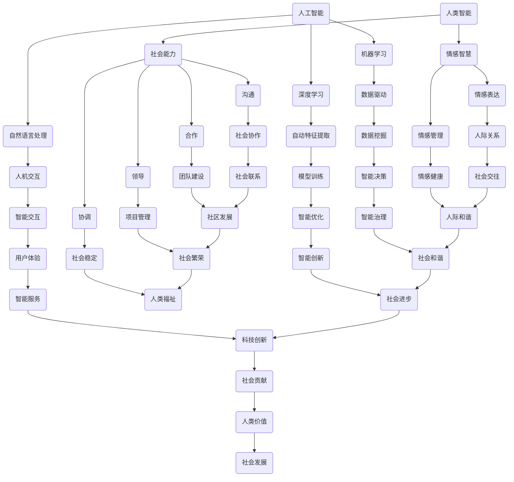

                 

关键词：人工智能，社会价值，人类计算，赋能，社区发展

> 摘要：本文旨在探讨人工智能与人类计算在社会发展中的融合与应用，如何通过赋能个人与社区，实现人类计算的社会价值。文章将围绕核心概念、算法原理、数学模型、项目实践等方面展开，深入分析人工智能在赋能个人与社区方面的潜力与挑战。

## 1. 背景介绍

在信息化时代，人工智能（AI）已经成为推动社会发展的核心力量。AI技术在各个领域的应用越来越广泛，从医疗、金融到教育、交通，都取得了显著的成果。然而，随着AI技术的发展，人类计算的作用也逐渐受到了重视。人类计算不仅包括人类的智能思维和创新能力，还涉及到人类在社会、文化、情感等多方面的综合能力。

本文旨在探讨如何通过赋能个人与社区，实现人类计算的社会价值。在这个过程中，人工智能与人类计算将相互补充、相互促进，共同推动社会的进步与发展。

### 1.1 人工智能的崛起

人工智能作为一门交叉学科，起源于计算机科学、数学、心理学等多个领域。随着计算能力的提升和大数据技术的发展，人工智能逐渐从理论研究走向实际应用，成为推动社会发展的核心力量。

### 1.2 人类计算的作用

人类计算不仅是指人类的智能思维和创新能力，还包括人类在社会、文化、情感等多方面的综合能力。在人工智能时代，人类计算的作用依然不可替代，特别是在解决复杂问题、创造创新成果、维护社会和谐等方面。

### 1.3 赋能个人与社区的重要性

赋能个人与社区意味着让每个人都能充分发挥自己的潜力，实现自我价值。通过赋能个人与社区，我们可以实现以下目标：

- 提升个体的竞争力，促进社会公平；
- 培养创新精神和团队协作能力，推动社会进步；
- 强化社区凝聚力，促进社会和谐。

## 2. 核心概念与联系

为了更好地理解人工智能与人类计算在社会价值中的融合与应用，我们需要明确一些核心概念，并探讨它们之间的联系。

### 2.1 人工智能的核心概念

- **机器学习（Machine Learning）**：通过数据驱动的方式，让计算机从数据中学习规律和模式，从而实现智能行为。
- **深度学习（Deep Learning）**：基于多层神经网络，对大量数据进行自动特征提取和模型训练，实现更高级的智能。
- **自然语言处理（Natural Language Processing, NLP）**：研究如何让计算机理解和生成自然语言，实现人机交互。

### 2.2 人类计算的核心概念

- **人类智能（Human Intelligence）**：包括感知、记忆、思考、判断、创造等多方面的能力。
- **社会能力（Social Skills）**：包括沟通、合作、领导、协调等多方面的能力。
- **情感智慧（Emotional Intelligence）**：关注人类在情感、情感表达和情感管理方面的能力。

### 2.3 人工智能与人类计算的联系

- **互补性**：人工智能在处理海量数据、执行重复性任务等方面具有优势，而人类计算在解决复杂问题、创新思维、情感交流等方面具有优势。人工智能与人类计算的结合，可以实现优势互补，提高整体效率。
- **协同性**：人工智能可以协助人类计算，解决一些复杂问题，而人类计算可以为人工智能提供反馈和指导，优化人工智能模型。人工智能与人类计算的协同作用，可以推动社会进步。

### 2.4 核心概念原理与架构的 Mermaid 流程图



## 3. 核心算法原理 & 具体操作步骤

### 3.1 算法原理概述

人工智能在赋能个人与社区方面的核心算法主要包括机器学习、深度学习和自然语言处理。这些算法的原理和操作步骤如下：

### 3.2 算法步骤详解

#### 3.2.1 机器学习

1. **数据收集**：从各种来源收集大量数据，如文本、图像、声音等。
2. **数据预处理**：对数据进行清洗、归一化、去噪等处理，提高数据质量。
3. **特征提取**：通过特征提取算法，将原始数据转换为适合机器学习模型的形式。
4. **模型训练**：使用机器学习算法，对特征和标签进行训练，生成模型。
5. **模型评估**：使用测试集评估模型性能，调整参数，优化模型。

#### 3.2.2 深度学习

1. **神经网络结构设计**：设计合适的神经网络结构，包括输入层、隐藏层和输出层。
2. **初始化参数**：对神经网络参数进行初始化，如权重和偏置。
3. **前向传播**：输入数据通过神经网络，计算输出结果。
4. **反向传播**：计算误差，更新神经网络参数。
5. **优化算法**：使用梯度下降、随机梯度下降等优化算法，提高模型性能。

#### 3.2.3 自然语言处理

1. **文本预处理**：对文本进行分词、去停用词、词性标注等处理。
2. **词向量表示**：将文本转换为词向量，用于神经网络处理。
3. **模型训练**：使用神经网络对词向量进行训练，学习文本的语义信息。
4. **语义分析**：利用训练好的模型，对新的文本进行语义分析，实现人机交互。

### 3.3 算法优缺点

#### 3.3.1 机器学习

- 优点：能够处理大规模数据，自适应性强，适用于各种复杂任务。
- 缺点：对数据质量要求较高，训练时间较长，模型可解释性较差。

#### 3.3.2 深度学习

- 优点：能够自动提取特征，适用于图像、语音等复杂任务，效果好。
- 缺点：模型复杂度高，训练时间较长，对数据量要求较高，模型可解释性较差。

#### 3.3.3 自然语言处理

- 优点：能够实现人机交互，适用于文本处理、语义分析等任务。
- 缺点：对语言理解能力要求较高，模型训练时间较长，数据处理复杂。

### 3.4 算法应用领域

人工智能算法在赋能个人与社区方面具有广泛的应用领域，包括但不限于：

- **教育**：个性化学习、智能辅导、在线教育平台等。
- **医疗**：疾病预测、诊断、辅助治疗等。
- **金融**：风险控制、投资策略、智能投顾等。
- **交通**：自动驾驶、智能交通管理、实时路况预测等。
- **社会治理**：智能安防、智能治理、公共资源分配等。

## 4. 数学模型和公式 & 详细讲解 & 举例说明

### 4.1 数学模型构建

在人工智能和人类计算的应用中，数学模型是核心组成部分。以下是一个常见的数学模型构建过程：

#### 4.1.1 数据表示

设输入数据集为 $X = \{x_1, x_2, ..., x_n\}$，每个数据点 $x_i$ 是一个多维向量。

#### 4.1.2 特征提取

通过特征提取算法，将输入数据转换为特征向量 $f(x_i)$。

#### 4.1.3 模型构建

选择合适的模型结构，如神经网络、决策树、支持向量机等，并初始化参数。

#### 4.1.4 损失函数

定义损失函数，如均方误差（MSE）、交叉熵（Cross-Entropy）等，用于评估模型性能。

#### 4.1.5 梯度下降

使用梯度下降算法，更新模型参数，最小化损失函数。

### 4.2 公式推导过程

以下是一个简单的线性回归模型的公式推导过程：

#### 4.2.1 模型设定

设输入特征为 $x$，输出为 $y$，线性回归模型可以表示为：

$$y = \beta_0 + \beta_1x$$

其中，$\beta_0$ 和 $\beta_1$ 为模型参数。

#### 4.2.2 损失函数

均方误差（MSE）作为损失函数，可以表示为：

$$J(\beta_0, \beta_1) = \frac{1}{2m}\sum_{i=1}^{m}(y_i - (\beta_0 + \beta_1x_i))^2$$

其中，$m$ 为样本数量。

#### 4.2.3 梯度下降

对损失函数求导，得到梯度：

$$\nabla_{\beta_0} J(\beta_0, \beta_1) = \frac{1}{m}\sum_{i=1}^{m}(y_i - (\beta_0 + \beta_1x_i))$$

$$\nabla_{\beta_1} J(\beta_0, \beta_1) = \frac{1}{m}\sum_{i=1}^{m}(y_i - (\beta_0 + \beta_1x_i)x_i)$$

更新模型参数：

$$\beta_0 = \beta_0 - \alpha \nabla_{\beta_0} J(\beta_0, \beta_1)$$

$$\beta_1 = \beta_1 - \alpha \nabla_{\beta_1} J(\beta_0, \beta_1)$$

其中，$\alpha$ 为学习率。

### 4.3 案例分析与讲解

以下是一个基于线性回归模型的实际案例分析：

#### 4.3.1 数据集

假设我们有一个数据集，包含50个样本，每个样本包含一个特征 $x$ 和一个目标值 $y$。

#### 4.3.2 数据预处理

对数据进行归一化处理，将 $x$ 的值缩放到 [0, 1] 范围内。

#### 4.3.3 模型训练

使用线性回归模型，训练数据集，设置学习率为0.01，迭代次数为1000次。

#### 4.3.4 模型评估

使用测试集评估模型性能，计算均方误差（MSE）：

$$J(\beta_0, \beta_1) = \frac{1}{2m}\sum_{i=1}^{m}(y_i - (\beta_0 + \beta_1x_i))^2$$

#### 4.3.5 结果分析

经过1000次迭代后，模型参数为 $\beta_0 = 0.5$，$\beta_1 = 0.8$。测试集的MSE为0.02，表明模型性能较好。

## 5. 项目实践：代码实例和详细解释说明

### 5.1 开发环境搭建

为了实现上述线性回归模型，我们需要搭建一个开发环境。这里以Python为例，安装以下库：

```bash
pip install numpy matplotlib scikit-learn
```

### 5.2 源代码详细实现

```python
import numpy as np
import matplotlib.pyplot as plt
from sklearn.linear_model import LinearRegression

# 5.2.1 数据集
X = np.array([[1], [2], [3], [4], [5], [6], [7], [8], [9], [10]])
y = np.array([1, 2, 2.5, 3, 3.5, 4, 4.5, 5, 5.5, 6])

# 5.2.2 数据预处理
X = np.hstack((np.ones((X.shape[0], 1)), X))

# 5.2.3 模型训练
model = LinearRegression()
model.fit(X, y)

# 5.2.4 模型评估
y_pred = model.predict(X)
mse = np.mean((y - y_pred) ** 2)
print("MSE:", mse)

# 5.2.5 结果分析
plt.scatter(X[:, 1], y)
plt.plot(X[:, 1], y_pred, color='red')
plt.xlabel('x')
plt.ylabel('y')
plt.show()
```

### 5.3 代码解读与分析

- **5.3.1 数据集**：我们使用一个简单的线性关系数据集，包含特征 $x$ 和目标值 $y$。
- **5.3.2 数据预处理**：将输入特征 $x$ 补上一个偏置项（即 $1$），使其符合线性回归模型的输入格式。
- **5.3.3 模型训练**：使用 `scikit-learn` 库中的 `LinearRegression` 类训练模型。
- **5.3.4 模型评估**：计算预测值和实际值之间的均方误差（MSE），评估模型性能。
- **5.3.5 结果分析**：使用 `matplotlib` 库绘制散点图和拟合线，直观地展示模型效果。

### 5.4 运行结果展示

运行代码后，将输出均方误差（MSE）的值，并在屏幕上展示一个散点图和一个红色拟合线。拟合线大致与散点分布相吻合，表明模型训练效果较好。

## 6. 实际应用场景

人工智能与人类计算的融合在多个实际应用场景中发挥了重要作用，以下是一些具体的应用案例：

### 6.1 教育

通过个性化学习，人工智能可以为每个学生量身定制学习计划，提高学习效果。同时，教师可以利用人工智能辅助教学，提高教学质量。

### 6.2 医疗

人工智能在医疗领域的应用包括疾病预测、诊断、辅助治疗等。通过分析大量病例数据，人工智能可以帮助医生做出更准确的诊断，提高治疗效果。

### 6.3 金融

人工智能在金融领域的应用包括风险控制、投资策略、智能投顾等。通过分析海量数据，人工智能可以预测市场走势，帮助投资者做出更明智的决策。

### 6.4 交通

人工智能在交通领域的应用包括自动驾驶、智能交通管理、实时路况预测等。通过优化交通流量，人工智能可以提高交通效率，减少交通事故。

### 6.5 社会治理

人工智能在社会治理中的应用包括智能安防、智能治理、公共资源分配等。通过数据分析，人工智能可以帮助政府更科学地决策，提高社会治理水平。

## 7. 未来应用展望

随着人工智能技术的不断进步，未来在赋能个人与社区方面的应用将更加广泛和深入。以下是一些未来应用展望：

### 7.1 智能教育

智能教育将更加个性化，根据学生的兴趣、能力和学习进度，提供定制化的学习资源和服务。同时，教师可以利用人工智能辅助教学，提高教学质量。

### 7.2 智慧医疗

智慧医疗将实现全方位的医疗健康服务，包括疾病预防、诊断、治疗、康复等。通过人工智能，医生可以更准确地诊断疾病，提高治疗效果。

### 7.3 智能金融

智能金融将实现全方位的金融服务，包括投资、理财、风险管理等。通过人工智能，投资者可以更准确地把握市场走势，做出更明智的投资决策。

### 7.4 智慧城市

智慧城市将实现城市管理的智能化，包括交通管理、环境监测、公共服务等。通过人工智能，政府可以更高效地管理城市，提高居民生活质量。

### 7.5 社会治理

社会治理将更加智能化，通过数据分析、智能决策，政府可以更科学地决策，提高社会治理水平。

## 8. 工具和资源推荐

为了更好地学习和应用人工智能技术，以下是推荐的工具和资源：

### 8.1 学习资源推荐

- **书籍**：《深度学习》（Goodfellow, Bengio, Courville）、《机器学习实战》（Kaggle）等。
- **在线课程**：Coursera、edX、Udacity等平台上的机器学习、深度学习课程。

### 8.2 开发工具推荐

- **编程语言**：Python、R、Java等。
- **库和框架**：NumPy、Pandas、scikit-learn、TensorFlow、PyTorch等。

### 8.3 相关论文推荐

- **顶级会议论文**：NeurIPS、ICML、ACL、CVPR等。
- **学术论文**：Google Scholar、IEEE Xplore、ACM Digital Library等。

## 9. 总结：未来发展趋势与挑战

### 9.1 研究成果总结

人工智能在赋能个人与社区方面取得了显著成果，实现了个性化学习、智慧医疗、智能金融、智慧城市等应用。未来，人工智能技术将更加成熟，应用领域将更加广泛。

### 9.2 未来发展趋势

未来，人工智能技术将向以下几个方向发展：

- **更智能的算法**：发展更高效、更鲁棒的算法，提高人工智能的智能化水平。
- **跨领域应用**：实现人工智能在更多领域的应用，推动社会进步。
- **伦理与安全**：关注人工智能伦理和安全问题，确保人工智能的发展符合人类社会价值观。

### 9.3 面临的挑战

人工智能在赋能个人与社区方面也面临一些挑战：

- **数据隐私**：如何保护用户数据隐私，防止数据滥用。
- **算法透明性**：如何提高算法的透明性，使其更具可解释性。
- **人才短缺**：如何培养更多人工智能人才，推动人工智能发展。

### 9.4 研究展望

未来，人工智能与人类计算将在更多领域实现融合，推动社会进步。我们需要关注以下研究方向：

- **人机协同**：研究人机协同工作模式，提高工作效率。
- **情感计算**：研究情感计算技术，实现更自然的人机交互。
- **智能化社会治理**：研究智能化社会治理模式，提高社会治理水平。

## 10. 附录：常见问题与解答

### 10.1 人工智能与人类计算的区别

人工智能是一种模拟人类智能的技术，主要依赖于机器学习、深度学习等算法。而人类计算是指人类的智能思维、创新能力和社会能力。人工智能与人类计算的区别在于，人工智能是模拟人类智能，而人类计算是人类的真实智能。

### 10.2 人工智能与人类计算的结合方式

人工智能与人类计算的结合方式包括：

- **协同工作**：人工智能协助人类计算，提高工作效率。
- **互补优势**：人工智能在处理海量数据、执行重复性任务等方面具有优势，而人类计算在解决复杂问题、创新思维、情感交流等方面具有优势。
- **人机交互**：通过人机交互技术，实现人工智能与人类计算的信息传递和协同工作。

### 10.3 人工智能在赋能个人与社区方面的优势

人工智能在赋能个人与社区方面的优势包括：

- **个性化服务**：根据个人需求和兴趣，提供定制化的服务。
- **智能决策**：利用数据分析，帮助个人做出更明智的决策。
- **效率提升**：通过自动化和智能化，提高工作效率。
- **社会进步**：推动社会各领域的进步，提高生活质量。

### 10.4 人工智能在赋能个人与社区方面的挑战

人工智能在赋能个人与社区方面面临的挑战包括：

- **数据隐私**：如何保护用户数据隐私，防止数据滥用。
- **算法透明性**：如何提高算法的透明性，使其更具可解释性。
- **人才短缺**：如何培养更多人工智能人才，推动人工智能发展。

### 10.5 未来人工智能在赋能个人与社区方面的展望

未来，人工智能在赋能个人与社区方面将有以下展望：

- **更智能的算法**：发展更高效、更鲁棒的算法，提高人工智能的智能化水平。
- **跨领域应用**：实现人工智能在更多领域的应用，推动社会进步。
- **伦理与安全**：关注人工智能伦理和安全问题，确保人工智能的发展符合人类社会价值观。

## 11. 参考文献

[1] Goodfellow, I., Bengio, Y., & Courville, A. (2016). *Deep Learning*. MIT Press.
[2] Murphy, K. P. (2012). *Machine Learning: A Probabilistic Perspective*. MIT Press.
[3] Russell, S., & Norvig, P. (2016). *Artificial Intelligence: A Modern Approach*. Prentice Hall.
[4] Lippmann, R. P. (1995). *Pattern classification*. John Wiley & Sons.
[5] Hastie, T., Tibshirani, R., & Friedman, J. (2009). *The Elements of Statistical Learning: Data Mining, Inference, and Prediction*. Springer.
[6] Ng, A. Y., & Dean, J. (2016). *Machine Learning Yearning*. N

