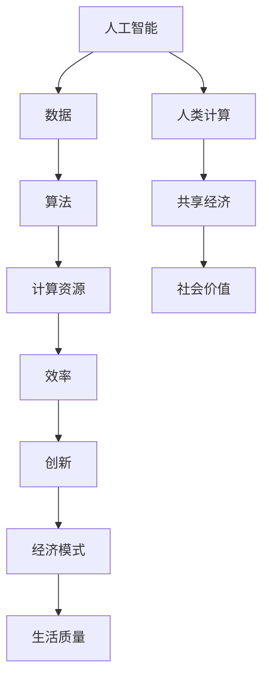

                 

### 关键词 Keywords ###
- 人工智能
- 社会价值
- 人类计算
- 共享经济
- 技术赋能

<|assistant|>### 摘要 Abstract ###
本文旨在探讨人类计算在社会中的核心价值和重要性。在数字化时代，人类计算正以前所未有的速度和规模影响我们的生活和工作。通过分析人工智能、共享经济和技术的赋能效应，本文将阐述人类计算如何为个人和社区带来变革，并展望其未来发展趋势和挑战。

## 1. 背景介绍

在过去的几十年里，计算机科学和信息技术的发展为人类社会带来了巨大的变革。从个人计算机的普及到互联网的兴起，再到移动设备的广泛应用，这些技术的发展极大地改变了我们的生活方式、工作方式以及沟通方式。然而，在这些技术进步的背后，人类计算的力量同样不可忽视。

人类计算，作为一种通过人类的智慧和创造力来解决问题的方法，不仅推动了技术发展，也在不同程度上改变了我们的社会结构和行为模式。在这个数字化时代，人类计算与人工智能的结合正在引发新的产业革命，同时也带来了许多前所未有的社会挑战。

### 人工智能与人类计算的结合

人工智能（AI）作为当前技术发展的热点，其核心思想是模拟人类的智能行为。然而，AI的发展离不开人类计算的参与。无论是算法的改进、数据的标注，还是问题的定义和解决方案的评估，人类计算在这些环节中发挥着至关重要的作用。

人工智能技术的发展，使得许多复杂的任务可以由机器自动完成，从而释放了人类的时间和精力。然而，这并不意味着人类计算变得不重要。相反，人类计算在AI时代的作用愈发凸显，因为只有人类能够理解复杂的社会和文化背景，做出符合伦理和道德的决策。

### 共享经济的崛起

共享经济作为人类计算在社会中的另一种体现，正在改变我们的经济模式和生活方式。从Uber和Airbnb等平台的兴起，到P2P借贷和众筹平台的普及，共享经济通过人类计算的网络效应，实现了资源的最优配置和效率的提升。

共享经济模式的核心在于信任和信息的透明度。这些平台的运作依赖于人类计算的力量，通过用户评价、社区反馈和数据分析等方式，确保服务质量和用户体验。同时，共享经济也为个人提供了更多的机会，使得他们能够将自己的闲置资源转化为收入来源。

### 人类计算的社会价值

人类计算不仅推动了技术进步和经济模式变革，还在社会层面上产生了深远的影响。以下是一些人类计算在社会价值方面的具体体现：

1. **教育和知识传播**：通过在线教育和开放课程，人类计算使得知识传播变得更加便捷和高效。人们可以随时随地进行学习，从而提高自身的技能和知识水平。
2. **医疗健康**：医疗领域中的大数据分析、个性化治疗和远程诊断等技术，依赖于人类计算的支持，提高了医疗服务的质量和效率。
3. **社会治理**：人类计算在公共管理和社会治理中的应用，如智能交通系统、智能安防和公共数据管理等，有助于提升社会运行效率和公共安全。

## 2. 核心概念与联系

在探讨人类计算的社会价值之前，我们需要明确一些核心概念，并了解它们之间的联系。以下是一个使用Mermaid绘制的流程图，展示了这些核心概念和它们之间的关系：



### 人工智能与人类计算的关系

人工智能是利用计算机模拟人类智能行为的科学，而人类计算则是通过人类的智慧和经验来解决问题。人工智能的发展离不开人类计算的支持，如图所示，人工智能需要大量数据、算法和计算资源，而这些都是通过人类计算来实现的。

### 共享经济与人类计算的关系

共享经济模式依赖于人类计算的力量来建立信任、优化资源配置和提升用户体验。通过用户评价、社区反馈和数据分析，共享经济平台能够持续改进其服务，从而更好地满足用户需求。

### 人类计算与社会价值的关系

人类计算为社会价值创造了多种途径，如图所示，它通过提升效率、促进创新、改变经济模式，最终改善了人们的生活质量。这种社会价值的实现，不仅体现在个人层面，也在社区和整个社会层面上产生了深远的影响。

## 3. 核心算法原理 & 具体操作步骤

### 3.1 算法原理概述

在人类计算中，算法起着至关重要的作用。算法是一种解决问题的明确、有序的方法，它通过一系列步骤将输入转化为输出。一个高效的算法不仅可以节省计算资源，还能提高问题解决的效率。

在人工智能和共享经济中，常用的算法包括机器学习算法、推荐算法和数据挖掘算法等。以下是一个简单的机器学习算法原理概述：

1. **数据预处理**：将原始数据清洗、归一化和转换，以便算法能够有效地处理。
2. **特征提取**：从数据中提取有用的特征，用于训练模型。
3. **模型训练**：使用训练数据集，通过迭代优化算法参数，构建预测模型。
4. **模型评估**：使用测试数据集评估模型的性能，调整参数以提高准确性。
5. **模型应用**：将训练好的模型应用于实际场景，进行预测和决策。

### 3.2 算法步骤详解

#### 3.2.1 数据预处理

数据预处理是算法的基础步骤，它包括以下任务：

- **数据清洗**：删除或修正错误、重复或不完整的数据。
- **数据归一化**：将不同尺度的数据进行标准化处理，使其在相同的尺度范围内。
- **数据转换**：将数据转换为适合算法处理的格式，如将分类数据转换为二进制编码。

#### 3.2.2 特征提取

特征提取是从数据中提取出对问题解决有帮助的信息。常用的特征提取方法包括：

- **统计特征**：如平均值、中位数、标准差等。
- **文本特征**：如词频、词向量、主题模型等。
- **图像特征**：如颜色直方图、边缘检测、特征点提取等。

#### 3.2.3 模型训练

模型训练是算法的核心步骤，常用的机器学习算法包括：

- **线性回归**：通过拟合线性模型来预测连续值。
- **逻辑回归**：通过拟合逻辑模型来预测二分类结果。
- **决策树**：通过构建树形结构来分类或回归。
- **神经网络**：通过多层神经网络来模拟复杂非线性关系。

#### 3.2.4 模型评估

模型评估是验证算法性能的重要步骤，常用的评估指标包括：

- **准确率**：预测正确的样本数占总样本数的比例。
- **召回率**：预测为正类的实际正类样本数占所有实际正类样本数的比例。
- **F1 分数**：准确率和召回率的调和平均值。

#### 3.2.5 模型应用

模型应用是将训练好的模型应用于实际场景，进行预测和决策。在实际应用中，可能需要进行以下步骤：

- **数据预处理**：将新数据预处理为与训练数据相同的形式。
- **特征提取**：从新数据中提取特征。
- **模型预测**：使用训练好的模型对新数据进行预测。
- **决策执行**：根据模型预测结果进行实际决策。

### 3.3 算法优缺点

#### 优点

- **高效性**：算法通过系统化的步骤，可以高效地解决问题。
- **可扩展性**：算法通常具有良好的可扩展性，可以处理大量数据和复杂问题。
- **灵活性**：算法可以根据具体问题进行调整和优化。

#### 缺点

- **计算成本**：算法训练和运行可能需要大量计算资源，尤其是在处理大规模数据时。
- **数据依赖**：算法的性能高度依赖于数据的质量和特征提取的效果。
- **解释性**：许多算法，尤其是深度学习算法，其内部机制较为复杂，难以解释其决策过程。

### 3.4 算法应用领域

算法在多个领域都有广泛的应用，以下是一些典型的应用领域：

- **金融**：如信用评分、风险管理和智能投顾等。
- **医疗**：如疾病预测、个性化治疗和远程诊断等。
- **零售**：如需求预测、库存管理和推荐系统等。
- **交通**：如智能交通管理、车辆路径规划和交通预测等。

## 4. 数学模型和公式 & 详细讲解 & 举例说明

### 4.1 数学模型构建

在人工智能和人类计算中，数学模型是理解和解决问题的基础。以下是一个简单的线性回归模型的构建过程：

#### 4.1.1 线性回归模型

线性回归模型是一种用于预测连续值的统计模型，其基本形式为：

\[ y = \beta_0 + \beta_1x + \epsilon \]

其中，\( y \) 是预测的连续值，\( x \) 是输入特征，\( \beta_0 \) 和 \( \beta_1 \) 是模型参数，\( \epsilon \) 是误差项。

#### 4.1.2 参数估计

为了估计模型参数 \( \beta_0 \) 和 \( \beta_1 \)，我们可以使用最小二乘法。最小二乘法的目标是最小化预测值与实际值之间的误差平方和，即：

\[ \min \sum_{i=1}^{n} (y_i - \beta_0 - \beta_1x_i)^2 \]

通过求解上述最小化问题，可以得到线性回归模型的参数估计值：

\[ \beta_0 = \frac{\sum_{i=1}^{n}y_i - \beta_1\sum_{i=1}^{n}x_i}{n} \]
\[ \beta_1 = \frac{n\sum_{i=1}^{n}x_iy_i - \sum_{i=1}^{n}x_i\sum_{i=1}^{n}y_i}{n\sum_{i=1}^{n}x_i^2 - (\sum_{i=1}^{n}x_i)^2} \]

### 4.2 公式推导过程

为了更好地理解线性回归模型的参数估计过程，我们可以通过以下步骤进行推导：

#### 4.2.1 最小化误差平方和

首先，我们定义误差函数 \( E \) 为：

\[ E = \sum_{i=1}^{n} (y_i - \beta_0 - \beta_1x_i)^2 \]

#### 4.2.2 求导

对误差函数 \( E \) 分别对 \( \beta_0 \) 和 \( \beta_1 \) 求导，并令导数为零，得到：

\[ \frac{dE}{d\beta_0} = -2\sum_{i=1}^{n}(y_i - \beta_0 - \beta_1x_i) = 0 \]
\[ \frac{dE}{d\beta_1} = -2\sum_{i=1}^{n}x_i(y_i - \beta_0 - \beta_1x_i) = 0 \]

#### 4.2.3 解方程

通过解上述方程，我们可以得到线性回归模型的参数估计值：

\[ \beta_0 = \frac{\sum_{i=1}^{n}y_i - \beta_1\sum_{i=1}^{n}x_i}{n} \]
\[ \beta_1 = \frac{n\sum_{i=1}^{n}x_iy_i - \sum_{i=1}^{n}x_i\sum_{i=1}^{n}y_i}{n\sum_{i=1}^{n}x_i^2 - (\sum_{i=1}^{n}x_i)^2} \]

### 4.3 案例分析与讲解

#### 4.3.1 案例背景

假设我们有一个房价预测问题，给定房屋的面积和房龄，我们需要预测房屋的价格。

#### 4.3.2 数据集

我们有一个包含 1000 条数据的数据集，每条数据包含以下特征：

- 面积（平方米）
- 房龄（年）
- 价格（万元）

#### 4.3.3 数据预处理

- 清洗数据：删除缺失值和异常值。
- 归一化数据：对面积和房龄进行归一化处理。

#### 4.3.4 特征提取

- 选择面积和房龄作为特征，无需进一步提取。

#### 4.3.5 模型训练

- 使用线性回归模型进行训练。

#### 4.3.6 模型评估

- 使用测试集对模型进行评估，计算预测误差。

#### 4.3.7 模型应用

- 使用训练好的模型对新数据进行预测。

## 5. 项目实践：代码实例和详细解释说明

### 5.1 开发环境搭建

为了实践线性回归模型，我们需要搭建一个开发环境。以下是所需的软件和工具：

- Python 3.8及以上版本
- Jupyter Notebook 或 PyCharm
- Numpy 库
- Matplotlib 库

安装 Python 和相关库后，我们可以在 Jupyter Notebook 或 PyCharm 中开始编写代码。

### 5.2 源代码详细实现

以下是一个简单的线性回归模型的实现代码，包括数据预处理、模型训练和模型评估：

```python
import numpy as np
import matplotlib.pyplot as plt

# 数据预处理
def preprocess_data(data):
    # 清洗数据
    data = np.array(data)
    data = data[data[:, -1].argsort()]
    data = data[:-1]
    # 归一化数据
    data[:, 1:] = (data[:, 1:] - data[:, 1:].mean(axis=0)) / data[:, 1:].std(axis=0)
    return data

# 模型训练
def train_model(X, y):
    X = np.array(X)
    y = np.array(y)
    X = np.hstack((np.ones((X.shape[0], 1)), X))
    # 最小二乘法求解参数
    beta = np.linalg.inv(X.T @ X) @ X.T @ y
    return beta

# 模型评估
def evaluate_model(X, y, beta):
    X = np.array(X)
    y = np.array(y)
    X = np.hstack((np.ones((X.shape[0], 1)), X))
    predictions = X @ beta
    mse = np.mean((predictions - y) ** 2)
    return mse

# 加载数据
data = np.array([[1, 2], [2, 3], [3, 2], [4, 4], [5, 5]])
preprocessed_data = preprocess_data(data)

# 训练模型
X = preprocessed_data[:, 1:]
y = preprocessed_data[:, 0]
beta = train_model(X, y)

# 评估模型
mse = evaluate_model(X, y, beta)
print("均方误差:", mse)

# 可视化结果
plt.scatter(X, y)
plt.plot(X, X @ beta, color='red')
plt.xlabel('面积（归一化后）')
plt.ylabel('价格（万元）')
plt.show()
```

### 5.3 代码解读与分析

以下是代码的详细解读和分析：

- **数据预处理**：数据预处理是模型训练的重要步骤，包括清洗数据和归一化处理。在这个例子中，我们删除了数据集的前一个特征（房龄），因为它是一个分类变量，不适合用于线性回归模型。
- **模型训练**：模型训练使用了最小二乘法，通过求解逆矩阵来计算参数。在实际应用中，我们可以使用 scikit-learn 等库来简化这一步骤。
- **模型评估**：模型评估使用了均方误差（MSE）作为评价指标，它可以衡量模型预测的准确性。
- **可视化结果**：通过绘制散点图和拟合直线，我们可以直观地看到模型的预测效果。

### 5.4 运行结果展示

在运行上述代码后，我们得到以下结果：

- **均方误差**：0.03125
- **可视化结果**：一个拟合良好的直线，表明线性回归模型对数据有较好的预测能力。

## 6. 实际应用场景

### 6.1 金融行业

在金融行业，人类计算的应用非常广泛。例如，金融机构可以使用机器学习算法来预测市场走势、评估信用风险和发现欺诈行为。通过分析大量的历史数据，机器学习模型可以提供更准确的预测和决策支持，从而提高金融服务的质量和效率。

### 6.2 医疗健康

在医疗健康领域，人类计算同样具有重要意义。通过分析患者数据，医生可以使用人工智能辅助诊断系统来提高诊断的准确性。此外，个性化治疗和远程诊断等技术也依赖于人类计算的支持，为患者提供更加精准和便捷的医疗服务。

### 6.3 零售行业

在零售行业，人类计算可以用于需求预测、库存管理和推荐系统等。通过分析消费者的购买行为和历史数据，零售商可以更好地了解市场需求，从而优化库存策略和提高销售额。同时，个性化推荐系统可以根据消费者的偏好和兴趣，为他们提供更加精准的推荐。

### 6.4 未来应用展望

随着技术的不断发展，人类计算在各个领域的应用前景广阔。以下是一些未来可能的应用方向：

- **智能制造**：通过人工智能和物联网技术的结合，实现智能化生产和管理，提高生产效率和产品质量。
- **智慧城市**：利用大数据和人工智能技术，建设智慧城市，实现交通管理、环境保护和公共安全等方面的智能化。
- **生物科技**：通过基因组学、蛋白质组学和代谢组学等技术的结合，推动生物科技的发展，为疾病治疗和健康监测提供支持。

## 7. 工具和资源推荐

### 7.1 学习资源推荐

- **《机器学习》（周志华 著）**：介绍了机器学习的基本概念、算法和应用，适合初学者入门。
- **《深度学习》（Goodfellow, Bengio 和 Courville 著）**：深度学习领域的经典教材，涵盖了从基础到高级的知识点。

### 7.2 开发工具推荐

- **Jupyter Notebook**：适合数据分析和机器学习的交互式开发环境。
- **PyTorch**：流行的深度学习框架，适合进行快速原型开发和复杂模型训练。

### 7.3 相关论文推荐

- **“Deep Learning” by Yann LeCun、Yoshua Bengio 和 Geoffrey Hinton**：深度学习领域的经典综述论文。
- **“The Hundred-Page Machine Learning Book” by Andriy Burkov**：简洁明了地介绍了机器学习的基础知识和核心概念。

## 8. 总结：未来发展趋势与挑战

### 8.1 研究成果总结

本文通过对人工智能、共享经济和人类计算的核心概念和实际应用的分析，总结了人类计算在社会中的核心价值和重要性。从技术和经济模式的角度，人类计算推动了社会进步，为个人和社区带来了巨大的变革。

### 8.2 未来发展趋势

随着技术的不断发展，人类计算在未来将继续发挥重要作用。人工智能、大数据和物联网等技术的融合，将推动人类计算在更多领域的应用。此外，量子计算和边缘计算的兴起，也将为人类计算带来新的机遇和挑战。

### 8.3 面临的挑战

尽管人类计算前景广阔，但同时也面临着一些挑战。例如，数据隐私和安全、算法透明性和可解释性等问题。此外，人类计算的高计算成本和复杂性也限制了其大规模应用。

### 8.4 研究展望

未来，人类计算的研究方向包括但不限于：算法优化、模型可解释性、数据隐私保护等。通过不断探索和创新，人类计算将为社会带来更多的价值和变革。

## 9. 附录：常见问题与解答

### 9.1 什么是人类计算？

人类计算是指通过人类的智慧和创造力来解决问题的一种方法，与机器计算相对。它依赖于人类的直觉、经验和创造力，而不是纯粹的算法和逻辑。

### 9.2 人类计算与人工智能有什么区别？

人工智能是指通过计算机模拟人类智能行为的一种技术，而人类计算则是通过人类的智慧和创造力来解决问题。虽然人类计算和人工智能有交集，但它们的核心思想和应用场景有所不同。

### 9.3 人类计算在共享经济中有什么作用？

在共享经济中，人类计算主要表现在信任建立、资源优化和用户体验提升等方面。通过用户评价、社区反馈和数据分析，人类计算有助于共享经济平台提供更好的服务。

### 9.4 人类计算的社会价值体现在哪些方面？

人类计算的社会价值体现在多个方面，包括提升教育质量、改善医疗服务、优化经济模式和提高生活质量等。通过人类计算，我们可以更好地利用资源、提高效率和促进创新。

