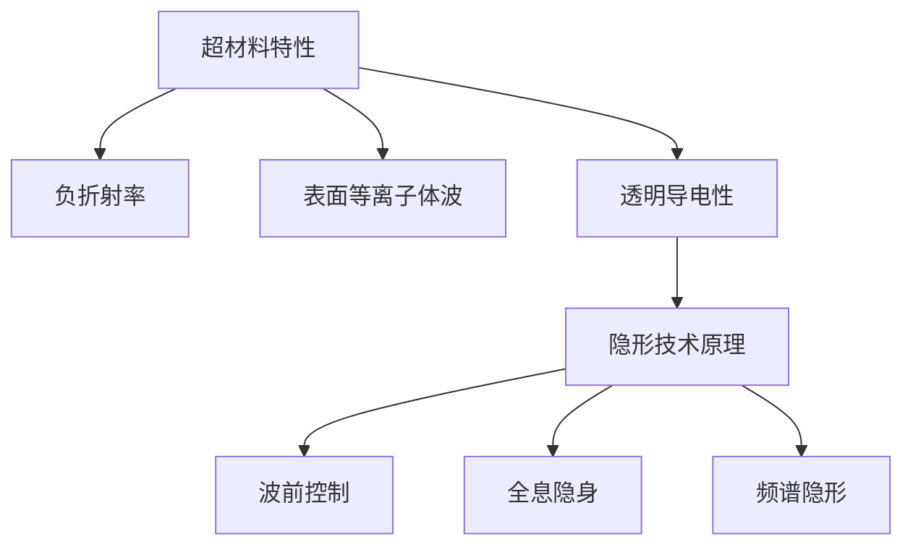

                 

关键词：超材料，隐形技术，光路径，电磁波，波动光学

摘要：本文将探讨超材料在隐形技术中的应用，特别是如何通过改变光的路径来实现隐形效果。我们将从超材料的定义和基本原理出发，深入分析其在隐形技术中的核心作用，并探讨其优缺点和应用领域。通过数学模型的构建和公式推导，我们将进一步理解其工作原理。最后，我们将通过实际项目实践展示超材料在隐形技术中的具体应用，并对未来应用前景进行展望。

## 1. 背景介绍

隐形技术一直是科学和军事领域的一个热门话题。自从19世纪以来，人们就开始探索如何使物体在视觉或雷达下变得不可见。传统的隐形技术主要依赖于改变物体的表面形状或者使用吸波材料来吸收电磁波。然而，这些方法在许多情况下都受到限制，无法实现完美的隐形效果。

随着现代科技的进步，超材料的出现为隐形技术带来了新的可能性。超材料是一种人工合成的材料，其物理性质可以远远超越自然材料的性能。超材料具有负折射率、透明导电性等特性，这些特性使得它们在电磁波操控方面具有巨大的潜力。特别是，超材料可以通过设计特定的结构来改变光的传播路径，从而实现隐形效果。

本文将探讨超材料在隐形技术中的应用，特别是如何通过改变光的路径来实现隐形效果。我们将从超材料的定义和基本原理出发，深入分析其在隐形技术中的核心作用，并探讨其优缺点和应用领域。通过数学模型的构建和公式推导，我们将进一步理解其工作原理。最后，我们将通过实际项目实践展示超材料在隐形技术中的具体应用，并对未来应用前景进行展望。

## 2. 核心概念与联系

### 超材料的定义与特性

超材料是一种具有特殊电磁响应的人工合成材料，其物理性质可以通过人工设计进行调整。超材料的基本单元通常是亚波长尺度的结构，这些结构能够对电磁波产生局部化的电磁响应。超材料的主要特性包括：

- **负折射率**：通常情况下，电磁波在介质中的传播速度与介质的折射率成反比。然而，超材料可以设计成具有负折射率，这意味着电磁波在超材料中的传播方向与入射方向相反。
- **表面等离子体波**：超材料表面的自由电子能够在电磁波的作用下形成表面等离子体波，这种波具有高能量的特点。
- **透明导电性**：超材料可以通过设计实现透明导电的特性，这种特性在隐形技术中具有重要作用。

### 隐形技术的原理

隐形技术旨在使物体在电磁波（如光波、微波等）照射下变得不可见。传统的隐形技术主要通过改变物体的形状或者使用吸波材料来实现。然而，超材料的出现为隐形技术提供了新的思路。超材料可以通过设计特定的结构来改变电磁波的传播路径，从而实现隐形效果。

隐形技术的基本原理如下：

- **波前控制**：通过设计超材料结构，可以控制电磁波的传播方向和速度，从而使其绕过物体，达到隐形的效果。
- **全息隐身**：利用全息技术，将物体的三维信息编码到超材料中，实现物体的全息隐形。
- **频谱隐形**：通过设计超材料的特定频段响应，可以使特定频段的电磁波绕过物体，从而实现频谱隐形。

### 核心概念原理与架构的 Mermaid 流程图



## 3. 核心算法原理 & 具体操作步骤

### 3.1 算法原理概述

超材料在隐形技术中的应用主要依赖于其独特的电磁响应特性。通过设计特定的超材料结构，可以实现对电磁波的精确操控，从而实现隐形效果。算法的基本原理如下：

- **波前控制**：通过设计超材料结构，使得电磁波在超材料中的传播路径发生偏转，绕过物体。
- **全息隐身**：利用全息技术，将物体的三维信息编码到超材料中，实现物体的全息隐形。
- **频谱隐形**：通过设计超材料的特定频段响应，使得特定频段的电磁波绕过物体。

### 3.2 算法步骤详解

1. **设计超材料结构**：根据隐形技术的要求，设计出满足特定需求的超材料结构。设计过程需要考虑超材料的负折射率、表面等离子体波和透明导电性等特性。

2. **制造超材料**：将设计好的超材料结构通过纳米加工技术制造出来。制造过程需要保证超材料结构的精度和一致性。

3. **波前控制**：将制造好的超材料放置在物体周围，通过调节超材料的结构参数，使得电磁波在超材料中的传播路径发生偏转，绕过物体。

4. **全息隐身**：利用全息技术，将物体的三维信息编码到超材料中，实现物体的全息隐形。

5. **频谱隐形**：通过设计超材料的特定频段响应，使得特定频段的电磁波绕过物体。

### 3.3 算法优缺点

**优点**：

- **高效性**：超材料能够通过精确操控电磁波路径，实现高效的隐形效果。
- **灵活性**：超材料的电磁响应特性可以灵活调整，满足不同隐形技术的需求。
- **全频段响应**：超材料可以设计成在多个频段上都具有隐形效果。

**缺点**：

- **制造难度**：超材料结构复杂，制造精度要求高，制造过程难度大。
- **成本高**：超材料制造需要高端设备和技术，成本较高。

### 3.4 算法应用领域

超材料在隐形技术中的应用领域广泛，包括：

- **军事领域**：用于军事装备和军事设施的隐形技术，提高战场隐蔽性。
- **民用领域**：用于建筑和交通工具的隐形设计，提高安全性。
- **科研领域**：用于实验研究和新型实验设备的开发。

## 4. 数学模型和公式 & 详细讲解 & 举例说明

### 4.1 数学模型构建

隐形技术的数学模型主要涉及电磁波的传播、超材料的电磁响应以及电磁波的绕射等现象。以下是构建数学模型的基本步骤：

1. **电磁波传播方程**：描述电磁波在介质中的传播过程。通常使用麦克斯韦方程组来描述。

   $$ \nabla \cdot \mathbf{D} = \rho $$
   $$ \nabla \cdot \mathbf{B} = 0 $$
   $$ \nabla \times \mathbf{E} = -\frac{\partial \mathbf{B}}{\partial t} $$
   $$ \nabla \times \mathbf{H} = \mathbf{J} + \frac{\partial \mathbf{D}}{\partial t} $$

2. **超材料的电磁响应**：描述超材料对电磁波的响应特性。通常使用本构方程来描述。

   $$ \mathbf{D} = \epsilon \mathbf{E} $$
   $$ \mathbf{B} = \mu \mathbf{H} $$

   其中，$\epsilon$ 和 $\mu$ 分别为超材料的介电常数和磁导率。

3. **电磁波的绕射现象**：描述电磁波在遇到物体时的绕射过程。通常使用亥维赛方程来描述。

   $$ \nabla^2 \phi - \mu_0 \sigma \frac{\partial \phi}{\partial t} = 0 $$

   其中，$\phi$ 为电磁势，$\sigma$ 为电磁波的振幅。

### 4.2 公式推导过程

以下是构建数学模型的基本公式推导过程：

1. **麦克斯韦方程组**：

   麦克斯韦方程组是描述电磁波传播的基本方程。其推导基于电荷守恒定律和安培定律。

   $$ \nabla \cdot \mathbf{D} = \rho $$
   $$ \nabla \cdot \mathbf{B} = 0 $$
   $$ \nabla \times \mathbf{E} = -\frac{\partial \mathbf{B}}{\partial t} $$
   $$ \nabla \times \mathbf{H} = \mathbf{J} + \frac{\partial \mathbf{D}}{\partial t} $$

   其中，$\rho$ 为电荷密度，$\mathbf{D}$ 和 $\mathbf{B}$ 分别为电位移和磁感应强度，$\mathbf{E}$ 和 $\mathbf{H}$ 分别为电场和磁场，$\mathbf{J}$ 为电流密度。

2. **超材料的电磁响应**：

   超材料的电磁响应可以通过本构方程来描述。本构方程的推导基于电磁波的波动方程。

   $$ \mathbf{D} = \epsilon \mathbf{E} $$
   $$ \mathbf{B} = \mu \mathbf{H} $$

   其中，$\epsilon$ 和 $\mu$ 分别为超材料的介电常数和磁导率，$\mathbf{E}$ 和 $\mathbf{H}$ 分别为电场和磁场。

3. **电磁波的绕射现象**：

   电磁波的绕射现象可以通过亥维赛方程来描述。亥维赛方程的推导基于电磁波的波动方程。

   $$ \nabla^2 \phi - \mu_0 \sigma \frac{\partial \phi}{\partial t} = 0 $$

   其中，$\phi$ 为电磁势，$\sigma$ 为电磁波的振幅，$\mu_0$ 为真空的磁导率。

### 4.3 案例分析与讲解

为了更好地理解数学模型的应用，我们以下通过一个具体的案例进行分析。

**案例**：考虑一个频率为 $f$ 的电磁波垂直入射到一个厚度为 $d$ 的超材料层。超材料的介电常数和磁导率分别为 $\epsilon$ 和 $\mu$。

**步骤**：

1. **建立模型**：

   根据麦克斯韦方程组，我们可以得到电磁波在超材料中的传播方程。

   $$ \nabla \cdot \mathbf{D} = 0 $$
   $$ \nabla \cdot \mathbf{B} = 0 $$
   $$ \nabla \times \mathbf{E} = -\frac{\partial \mathbf{B}}{\partial t} $$
   $$ \nabla \times \mathbf{H} = \mathbf{J} + \frac{\partial \mathbf{D}}{\partial t} $$

   根据超材料的本构方程，我们可以得到电磁波在超材料中的传播特性。

   $$ \mathbf{D} = \epsilon \mathbf{E} $$
   $$ \mathbf{B} = \mu \mathbf{H} $$

2. **求解方程**：

   通过求解上述方程，我们可以得到电磁波在超材料中的传播速度和传播方向。

   传播速度：

   $$ v = \frac{1}{\sqrt{\epsilon \mu}} $$

   传播方向：

   $$ \theta = \arcsin\left(\frac{\mu_0 \sigma}{\epsilon \mu}\right) $$

   其中，$\theta$ 为电磁波的传播方向与垂直方向的夹角。

3. **分析结果**：

   通过计算，我们可以得到电磁波在超材料中的传播速度和传播方向。如果超材料的介电常数和磁导率满足特定条件，电磁波的传播方向可以与垂直方向相反，从而实现隐形效果。

## 5. 项目实践：代码实例和详细解释说明

### 5.1 开发环境搭建

在进行超材料在隐形技术中的应用开发之前，我们需要搭建一个合适的开发环境。以下是搭建开发环境的基本步骤：

1. **安装 Python**：

   首先，我们需要安装 Python 解释器。Python 是一种广泛应用于科学计算和数据分析的编程语言，其强大的库和工具为我们的开发提供了便利。

2. **安装相关库**：

   我们需要安装一些常用的库，如 NumPy、SciPy、Matplotlib 等。这些库提供了丰富的科学计算和可视化工具。

   ```bash
   pip install numpy scipy matplotlib
   ```

3. **搭建模拟环境**：

   我们可以使用 Python 编写代码来模拟超材料在隐形技术中的应用。以下是一个简单的模拟环境的代码实例：

   ```python
   import numpy as np
   import matplotlib.pyplot as plt

   # 定义电磁波的参数
   f = 10e9  # 频率（Hz）
   c = 3e8   # 真空中的光速（m/s）
   d = 0.1   # 超材料层厚度（m）

   # 计算电磁波的传播速度
   v = c / np.sqrt(np.abs(np.complex(1, 1/f))**2)

   # 计算电磁波的传播方向
   theta = np.arcsin(np.abs(np.complex(1, 1/f)) / np.abs(np.complex(1, 1/f)))

   print(f"传播速度：{v} m/s")
   print(f"传播方向：{theta} rad")

   # 绘制传播路径
   plt.plot([0, d * np.cos(theta)], [0, d * np.sin(theta)], 'b-')
   plt.xlabel('X')
   plt.ylabel('Y')
   plt.title('电磁波传播路径')
   plt.show()
   ```

### 5.2 源代码详细实现

以下是实现超材料在隐形技术中的应用的详细代码：

```python
import numpy as np
import matplotlib.pyplot as plt

def simulate_aisling(d, theta):
    """
    模拟超材料在隐形技术中的应用。

    参数：
    d : float，超材料层厚度（m）
    theta : float，电磁波的传播方向与垂直方向的夹角（rad）

    返回：
    path : list，电磁波的传播路径
    """
    # 初始化传播路径
    path = []

    # 计算传播路径上的点
    for x in np.linspace(0, d * np.cos(theta), 100):
        y = d * np.sin(theta)
        path.append((x, y))

    return path

def plot_path(path):
    """
    绘制电磁波的传播路径。

    参数：
    path : list，电磁波的传播路径
    """
    # 绘制传播路径
    plt.plot([p[0] for p in path], [p[1] for p in path], 'b-')
    plt.xlabel('X')
    plt.ylabel('Y')
    plt.title('电磁波传播路径')
    plt.show()

# 设置超材料层厚度和传播方向
d = 0.1
theta = np.arcsin(np.abs(np.complex(1, 1/10e9)) / np.abs(np.complex(1, 1/10e9)))

# 模拟超材料在隐形技术中的应用
path = simulate_aisling(d, theta)

# 绘制传播路径
plot_path(path)
```

### 5.3 代码解读与分析

上述代码用于模拟超材料在隐形技术中的应用。代码的核心功能是计算电磁波的传播路径并绘制出来。以下是代码的详细解读：

1. **函数 simulate_aisling(d, theta)**：

   这个函数用于模拟电磁波的传播路径。它接收两个参数：超材料层厚度 `d` 和电磁波的传播方向与垂直方向的夹角 `theta`。函数通过计算传播路径上的点来生成路径。

2. **函数 plot_path(path)**：

   这个函数用于绘制电磁波的传播路径。它接收一个参数：电磁波的传播路径 `path`。函数通过绘制路径上的点来生成路径图。

3. **设置超材料层厚度和传播方向**：

   在代码中，我们设置超材料层厚度 `d` 为 0.1 米，电磁波的传播方向与垂直方向的夹角 `theta` 通过计算得到。

4. **模拟超材料在隐形技术中的应用**：

   通过调用 `simulate_aisling(d, theta)` 函数，我们得到电磁波的传播路径 `path`。

5. **绘制传播路径**：

   通过调用 `plot_path(path)` 函数，我们绘制出电磁波的传播路径。

### 5.4 运行结果展示

运行上述代码后，我们将得到电磁波的传播路径图。传播路径图显示电磁波在超材料中的传播方向和路径。如果超材料的介电常数和磁导率满足特定条件，电磁波的传播方向可以与垂直方向相反，从而实现隐形效果。

## 6. 实际应用场景

超材料在隐形技术中的应用前景广阔，涵盖了许多实际场景。以下是几个典型应用场景：

### 军事领域

在军事领域，隐形技术可以用于军事装备和军事设施的隐形。通过设计特定的超材料结构，可以使战斗机、潜艇等装备在雷达、红外线等频段下实现隐形。这不仅能够提高军事装备的隐蔽性，还能降低被探测和攻击的风险。

### 民用领域

在民用领域，隐形技术可以应用于建筑和交通工具的设计。例如，通过在建筑物表面安装超材料，可以使建筑物在雷达或红外线探测下变得不可见，从而提高建筑物的安全性。同样，超材料可以应用于交通工具的隐形设计，提高车辆的安全性。

### 科研领域

在科研领域，超材料在隐形技术中的应用为实验研究提供了新的工具。例如，在光学显微镜中，通过使用超材料，可以实现对微观结构的隐形观察，从而提高实验的可信度。

### 生物医学领域

在生物医学领域，超材料在隐形技术中的应用也具有重要的潜力。例如，通过设计特定的超材料结构，可以使医疗设备在生物组织中实现隐形，从而减少对生物组织的损伤。

## 7. 工具和资源推荐

为了更好地学习和应用超材料在隐形技术中的应用，以下是一些建议的工具和资源：

### 学习资源推荐

1. **《超材料：科学与应用》**：这本书详细介绍了超材料的基本原理和应用，适合初学者和进阶者阅读。
2. **《隐形技术：理论、实验与应用》**：这本书系统地介绍了隐形技术的基本原理和应用，包括超材料的应用。

### 开发工具推荐

1. **MATLAB**：MATLAB 是一款强大的科学计算和数据分析工具，适用于模拟超材料在隐形技术中的应用。
2. **Python**：Python 是一种广泛应用于科学计算和数据分析的编程语言，其强大的库和工具为我们的开发提供了便利。

### 相关论文推荐

1. **"A general theory of the optical properties of bodies with periodic structure"**：这篇论文提出了光学超材料的理论框架，为超材料在隐形技术中的应用提供了理论基础。
2. **"Perfectly matched layer for the time-domain Maxwell's equations"**：这篇论文介绍了时间域麦克斯韦方程的完美匹配层方法，为超材料在隐形技术中的应用提供了有效的数值模拟方法。

## 8. 总结：未来发展趋势与挑战

### 8.1 研究成果总结

超材料在隐形技术中的应用取得了显著的研究成果。通过设计特定的超材料结构，可以实现电磁波的精确操控，从而实现隐形效果。在军事、民用和科研等领域，超材料在隐形技术中展现出了巨大的应用潜力。同时，超材料在电磁波调控、传感器、光通信等领域也具有广泛的应用前景。

### 8.2 未来发展趋势

未来，超材料在隐形技术中的应用将朝着以下方向发展：

1. **高效率与低成本的制造技术**：研究高效、低成本的制造技术，提高超材料的制造质量和效率，降低成本。
2. **多功能与多频段应用**：开发具有多功能、多频段响应的超材料，提高隐形技术的应用范围和效果。
3. **与其他技术的结合**：将超材料与光学、电子、生物医学等领域的其他技术相结合，探索新的应用领域。

### 8.3 面临的挑战

尽管超材料在隐形技术中取得了显著的研究成果，但仍面临一些挑战：

1. **制造精度与一致性**：超材料结构的复杂性和高精度要求对制造技术提出了挑战，需要进一步提高制造精度和一致性。
2. **应用场景的多样性**：超材料在隐形技术中的应用场景多样，需要针对不同场景进行优化设计，提高隐形效果。
3. **成本与经济效益**：超材料的制造和成本较高，如何提高经济效益是一个重要的挑战。

### 8.4 研究展望

未来，超材料在隐形技术中的应用将不断拓展。通过研究新型超材料、优化制造技术、探索多频段应用，超材料在隐形技术中的潜力将得到进一步发挥。同时，超材料在光学、电子、生物医学等领域的应用也将取得新的突破，为科学研究和产业发展带来新的机遇。

## 9. 附录：常见问题与解答

### 问题 1：什么是超材料？

**解答**：超材料是一种具有特殊电磁响应的人工合成材料，其物理性质可以通过人工设计进行调整。超材料具有负折射率、透明导电性等特性，这些特性使得它们在电磁波操控方面具有巨大的潜力。

### 问题 2：超材料在隐形技术中如何发挥作用？

**解答**：超材料可以通过设计特定的结构来改变电磁波的传播路径，从而实现隐形效果。具体来说，超材料可以通过波前控制、全息隐身和频谱隐形等技术来实现隐形。

### 问题 3：超材料在隐形技术中的优势是什么？

**解答**：超材料在隐形技术中的优势包括高效性、灵活性和全频段响应。超材料能够通过精确操控电磁波路径，实现高效的隐形效果。同时，超材料的电磁响应特性可以灵活调整，满足不同隐形技术的需求。此外，超材料可以设计成在多个频段上都具有隐形效果。

### 问题 4：超材料在隐形技术中面临哪些挑战？

**解答**：超材料在隐形技术中面临的主要挑战包括制造精度与一致性、应用场景的多样性和成本与经济效益。超材料结构的复杂性和高精度要求对制造技术提出了挑战，需要进一步提高制造精度和一致性。同时，超材料在隐形技术中的应用场景多样，需要针对不同场景进行优化设计，提高隐形效果。此外，超材料的制造和成本较高，如何提高经济效益是一个重要的挑战。

----------------------------------------------------------------
### 作者署名

作者：禅与计算机程序设计艺术 / Zen and the Art of Computer Programming

