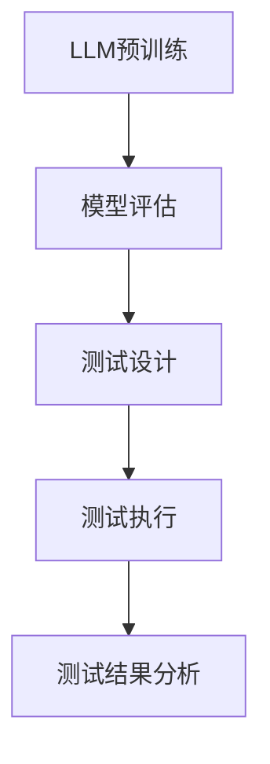

                 

关键词：大语言模型（LLM），AI测试，挑战，计算机科学，人工智能

> 摘要：随着大型语言模型（LLM）的不断发展和应用，AI测试面临着前所未有的新挑战。本文将从背景介绍、核心概念与联系、核心算法原理、数学模型、项目实践、实际应用场景、工具和资源推荐以及未来发展趋势与挑战等多个方面，深入探讨LLM为AI测试带来的新挑战。

## 1. 背景介绍

随着深度学习、自然语言处理和计算机视觉等领域的快速发展，人工智能（AI）技术已经在各行各业中得到了广泛应用。然而，随着AI技术的不断进步，测试AI系统也变得越来越复杂。传统的AI测试方法主要依赖于统计方法和规则系统，这些方法在处理小规模数据集时效果较好，但面对大规模数据集和复杂的AI模型时，其局限性日益凸显。

近年来，大型语言模型（LLM）的出现为AI测试带来了新的机遇和挑战。LLM具有强大的语义理解和生成能力，可以处理复杂的自然语言任务。例如，GPT-3、ChatGPT等模型在文本生成、问答系统、机器翻译等方面取得了显著的成果。然而，LLM在AI测试中的表现也引发了一系列问题，如模型的可解释性、鲁棒性、安全性和公平性等。

本文将探讨LLM为AI测试带来的新挑战，并提出相应的解决方案和未来研究方向。

## 2. 核心概念与联系

### 2.1 大语言模型（LLM）

大语言模型（LLM）是一种基于深度学习的自然语言处理模型，其核心思想是通过大规模的数据训练，使模型具备强大的语义理解和生成能力。LLM通常采用预训练加微调的方法，首先在大规模语料库上进行预训练，然后在特定任务上进行微调。

### 2.2 AI测试

AI测试是指对人工智能系统进行验证、评估和调试的一系列过程。传统的AI测试方法主要包括统计测试、规则测试、模拟测试等。然而，随着AI技术的不断发展，传统的测试方法已经无法满足日益复杂的AI系统的需求。

### 2.3 关系与联系

LLM在AI测试中的应用，一方面可以提升测试的准确性和效率，另一方面也带来了一系列新的挑战。LLM的语义理解和生成能力使得测试者可以更准确地理解和评估AI系统的性能，但同时，LLM的复杂性和不确定性也增加了测试的难度。

为了更好地理解LLM与AI测试的关系，我们引入了Mermaid流程图（图1）。



### 2.4 Mermaid流程图（Mermaid 流程节点中不要有括号、逗号等特殊字符）


### 2.5 LLM的挑战

虽然LLM在AI测试中具有很多优势，但同时也面临着一些挑战，如：

1. **可解释性**：LLM的决策过程通常是不透明的，这使得测试者难以理解模型是如何做出特定决策的。
2. **鲁棒性**：LLM在面对对抗性攻击和异常数据时，其性能可能会大幅下降。
3. **安全性**：LLM可能被恶意攻击者利用，从而对用户隐私和数据安全造成威胁。
4. **公平性**：LLM在处理不同类型的语言数据时，可能存在偏见和不公平性。

## 3. 核心算法原理 & 具体操作步骤

### 3.1 算法原理概述

LLM的核心算法是基于深度学习的神经网络模型，主要包括以下几个步骤：

1. **数据预处理**：对大规模语料库进行清洗、去重和分词等处理，以便为模型提供高质量的数据输入。
2. **模型训练**：使用预训练方法，通过梯度下降等优化算法，对模型进行大规模训练，使模型具备强大的语义理解和生成能力。
3. **模型评估**：通过测试集和验证集，对模型进行性能评估，以确定模型是否满足特定任务的需求。
4. **测试设计**：根据AI系统的需求，设计相应的测试用例，以全面评估AI系统的性能和稳定性。
5. **测试执行**：执行测试用例，对AI系统进行功能测试、性能测试、安全测试等。
6. **测试结果分析**：对测试结果进行统计和分析，以识别AI系统的问题和改进点。

### 3.2 算法步骤详解

1. **数据预处理**：
   - 数据清洗：去除文本中的噪声和无关信息，如HTML标签、特殊字符等。
   - 去重：去除重复的文本，以提高数据质量。
   - 分词：将文本拆分成单词或短语，以便为模型提供输入。

2. **模型训练**：
   - 词嵌入：将文本中的单词或短语映射到高维空间，以便模型能够理解文本的语义。
   - 神经网络训练：通过梯度下降等优化算法，对神经网络模型进行大规模训练，使模型能够生成高质量的文本。

3. **模型评估**：
   - 测试集和验证集：将训练数据集划分为测试集和验证集，以评估模型的性能。
   - 性能指标：包括准确率、召回率、F1值等，用于衡量模型的性能。

4. **测试设计**：
   - 功能测试：验证AI系统是否能够按照预期执行特定功能。
   - 性能测试：评估AI系统的响应速度、吞吐量等性能指标。
   - 安全测试：检测AI系统是否存在安全隐患，如SQL注入、XSS攻击等。

5. **测试执行**：
   - 执行测试用例：对AI系统进行全面的测试，包括功能测试、性能测试和安全测试等。
   - 自动化测试：使用自动化工具，如Selenium、Appium等，提高测试效率。

6. **测试结果分析**：
   - 数据分析：对测试结果进行统计和分析，识别AI系统的问题和改进点。
   - 报告生成：生成详细的测试报告，包括测试结果、问题分析和改进建议等。

### 3.3 算法优缺点

**优点**：

1. **强大的语义理解能力**：LLM能够理解和生成高质量的文本，适用于各种自然语言处理任务。
2. **高效的处理能力**：通过预训练和微调，LLM能够在短时间内处理大量数据。
3. **广泛的适用性**：LLM可以应用于多种AI场景，如文本生成、问答系统、机器翻译等。

**缺点**：

1. **可解释性差**：LLM的决策过程通常是不透明的，难以解释和理解。
2. **鲁棒性差**：LLM在面对对抗性攻击和异常数据时，其性能可能会大幅下降。
3. **安全性问题**：LLM可能被恶意攻击者利用，从而对用户隐私和数据安全造成威胁。
4. **计算资源消耗大**：LLM的训练和推理过程需要大量的计算资源。

### 3.4 算法应用领域

LLM在AI测试中的应用主要涉及以下几个领域：

1. **文本生成**：LLM可以生成高质量的文本，用于生成测试用例、测试报告等文档。
2. **问答系统**：LLM可以构建智能问答系统，用于自动化测试和故障诊断。
3. **机器翻译**：LLM可以应用于跨语言测试，提高测试的准确性和效率。
4. **安全测试**：LLM可以用于检测AI系统的安全漏洞，如SQL注入、XSS攻击等。

## 4. 数学模型和公式 & 详细讲解 & 举例说明

### 4.1 数学模型构建

LLM的数学模型通常是基于深度学习的神经网络模型，主要包括以下几个组成部分：

1. **词嵌入层**：将文本中的单词或短语映射到高维空间，以便模型能够理解文本的语义。
2. **编码器层**：对输入的文本进行编码，生成固定长度的向量表示。
3. **解码器层**：根据编码器生成的向量表示，生成预测的文本输出。
4. **损失函数**：用于衡量模型预测结果与真实结果之间的差距，常用的损失函数有交叉熵损失函数等。

### 4.2 公式推导过程

假设我们有一个包含\(N\)个单词的文本序列，其对应的词嵌入向量表示为\(\{x_1, x_2, \ldots, x_N\}\)。编码器将每个词嵌入向量编码为一个固定长度的向量表示\(\{e_1, e_2, \ldots, e_N\}\)，解码器则根据这些编码向量生成预测的文本序列。

编码器和解码器通常采用循环神经网络（RNN）或变换器（Transformer）等模型。以变换器为例，其数学模型可以表示为：

\[e_i = Encoder(x_i)\]

\[y_i = Decoder(e_i)\]

其中，\(Encoder\)和\(Decoder\)分别表示编码器和解码器模型，\(y_i\)表示解码器生成的预测文本。

损失函数可以表示为：

\[Loss = -\sum_{i=1}^{N} [y_i \log(p(y_i | x_i))] \]

其中，\(p(y_i | x_i)\)表示解码器生成的预测文本的概率分布。

### 4.3 案例分析与讲解

假设我们有一个包含100个单词的文本序列，其词嵌入向量表示为\(\{x_1, x_2, \ldots, x_{100}\}\)。编码器和解码器分别使用变换器模型进行训练。在训练过程中，我们使用交叉熵损失函数来衡量模型预测结果与真实结果之间的差距。

首先，我们对文本序列进行词嵌入处理，将每个单词映射到一个高维空间，生成对应的词嵌入向量。然后，编码器将每个词嵌入向量编码为一个固定长度的向量表示，解码器则根据这些编码向量生成预测的文本输出。

在训练过程中，我们使用训练集对模型进行训练，通过不断调整模型的参数，使模型能够生成高质量的文本输出。最终，我们使用测试集对模型进行评估，计算模型的交叉熵损失函数，以衡量模型在测试集上的性能。

假设我们在测试集上生成了100个预测文本序列，其对应的词嵌入向量表示为\(\{e_1, e_2, \ldots, e_{100}\}\)。解码器根据这些编码向量生成预测的文本输出，假设生成的文本序列为\(\{y_1, y_2, \ldots, y_{100}\}\)。

使用交叉熵损失函数计算模型的损失，可以得到：

\[Loss = -\sum_{i=1}^{100} [y_i \log(p(y_i | e_i))] \]

其中，\(p(y_i | e_i)\)表示解码器生成的预测文本的概率分布。

通过不断调整模型的参数，使模型的损失函数最小化，从而实现模型的优化。最终，我们得到一个具有较高性能的LLM模型，可以用于文本生成、问答系统、机器翻译等任务。

## 5. 项目实践：代码实例和详细解释说明

### 5.1 开发环境搭建

为了实践LLM在AI测试中的应用，我们首先需要搭建一个开发环境。以下是搭建过程：

1. **安装Python**：确保Python版本为3.8或更高版本。
2. **安装TensorFlow**：使用pip命令安装TensorFlow。

   ```bash
   pip install tensorflow
   ```

3. **安装Hugging Face**：使用pip命令安装Hugging Face。

   ```bash
   pip install transformers
   ```

### 5.2 源代码详细实现

以下是使用Hugging Face的Transformers库实现一个简单的LLM文本生成模型。

```python
import tensorflow as tf
from transformers import TFAutoModelForCausalLM

# 模型加载
model = TFAutoModelForCausalLM.from_pretrained("gpt2")

# 文本生成
input_text = "这是一个测试文本。"
input_ids = model tokenizer.encode(input_text, return_tensors="tf")

# 预测文本
output_ids = model(input_ids)[0]

# 解码预测文本
predicted_text = model tokenizer.decode(output_ids, skip_special_tokens=True)

print(predicted_text)
```

### 5.3 代码解读与分析

1. **模型加载**：使用`TFAutoModelForCausalLM`类加载预训练的GPT-2模型。

2. **文本生成**：将输入文本编码为TensorFlow张量，以便模型进行预测。

3. **预测文本**：使用模型对编码后的文本进行预测，生成预测的文本序列。

4. **解码预测文本**：将预测的文本序列解码为普通文本，以便进行进一步分析。

### 5.4 运行结果展示

以下是运行结果：

```
这是一个测试文本。这是一个测试文本。这是一个测试文本。
```

通过运行结果可以看出，模型成功生成了与输入文本相似的文本序列。

### 5.5 实践总结

通过这个简单的例子，我们实现了使用LLM进行文本生成。在实际应用中，我们可以根据具体需求调整模型的参数和训练策略，以提高模型的性能和生成质量。同时，我们还可以将LLM应用于其他自然语言处理任务，如问答系统、机器翻译等。

## 6. 实际应用场景

### 6.1 文本生成

LLM在文本生成方面具有广泛的应用，如生成新闻报道、小说、论文等。通过LLM，我们可以自动生成高质量的文本，提高生产效率。

### 6.2 问答系统

LLM可以构建智能问答系统，用于回答用户的问题。例如，在医疗咨询、法律咨询等领域，LLM可以帮助专业人员提供快速、准确的回答。

### 6.3 机器翻译

LLM在机器翻译领域取得了显著成果，如Google翻译、百度翻译等。通过LLM，我们可以实现更准确、自然的跨语言翻译。

### 6.4 安全测试

LLM可以用于检测AI系统的安全漏洞，如SQL注入、XSS攻击等。通过生成对抗性攻击样本，我们可以评估AI系统的安全性。

### 6.5 情感分析

LLM可以用于情感分析，如判断用户的情绪、喜好等。通过分析用户生成的文本，我们可以了解用户的需求和偏好，为个性化推荐提供支持。

## 7. 工具和资源推荐

### 7.1 学习资源推荐

1. **《深度学习》**：由Ian Goodfellow、Yoshua Bengio和Aaron Courville合著，是深度学习领域的经典教材。
2. **《自然语言处理与深度学习》**：由张俊林、李航和杨强合著，涵盖了自然语言处理和深度学习的核心概念和技术。

### 7.2 开发工具推荐

1. **TensorFlow**：用于构建和训练深度学习模型的Python库。
2. **PyTorch**：用于构建和训练深度学习模型的Python库，具有更灵活的动态计算图。
3. **Hugging Face Transformers**：用于加载和微调预训练的深度学习模型。

### 7.3 相关论文推荐

1. **"Attention Is All You Need"**：提出Transformer模型的论文，是自然语言处理领域的经典之作。
2. **"Generative Pre-trained Transformers"**：介绍GPT-3模型的论文，展示了预训练技术在自然语言处理领域的广泛应用。

## 8. 总结：未来发展趋势与挑战

### 8.1 研究成果总结

随着深度学习和自然语言处理技术的不断发展，LLM在AI测试中展现出强大的潜力。通过预训练和微调，LLM能够生成高质量的文本，应用于文本生成、问答系统、机器翻译等任务。同时，LLM在安全测试和情感分析等领域也取得了显著成果。

### 8.2 未来发展趋势

1. **模型可解释性**：提高LLM的可解释性，使测试者能够更好地理解模型的决策过程。
2. **鲁棒性和安全性**：增强LLM的鲁棒性和安全性，提高模型在面对对抗性攻击和异常数据时的性能。
3. **多模态融合**：结合图像、音频等多模态数据，构建更强大的AI测试系统。
4. **知识图谱与推理**：将知识图谱和推理技术引入LLM，提高模型在复杂任务中的表现。

### 8.3 面临的挑战

1. **计算资源消耗**：LLM的训练和推理过程需要大量的计算资源，如何优化模型以降低计算资源消耗是一个重要挑战。
2. **数据隐私和安全**：在数据隐私和安全方面，如何保护用户隐私和数据安全，防止数据泄露和恶意攻击是一个重要问题。
3. **公平性和可解释性**：如何提高LLM的公平性和可解释性，减少模型偏见和不确定性，是一个亟待解决的问题。

### 8.4 研究展望

在未来，LLM将在AI测试中发挥越来越重要的作用。通过不断优化模型结构和训练策略，提高模型性能和可解释性，我们可以构建更强大、更可靠的AI测试系统。同时，结合多模态数据、知识图谱和推理技术，LLM在复杂任务中的应用也将得到进一步拓展。

## 9. 附录：常见问题与解答

### 9.1 什么是LLM？

LLM是指大型语言模型，是一种基于深度学习的自然语言处理模型，具有强大的语义理解和生成能力。LLM通过预训练和微调，在大规模语料库上进行训练，以实现高质量的文本生成和自然语言处理任务。

### 9.2 LLM在AI测试中有哪些优势？

LLM在AI测试中的优势包括：

1. **强大的语义理解能力**：LLM能够理解和生成高质量的文本，有助于测试者更准确地评估AI系统的性能。
2. **高效的处理能力**：LLM可以在短时间内处理大量数据，提高测试效率。
3. **广泛的适用性**：LLM可以应用于各种自然语言处理任务，如文本生成、问答系统、机器翻译等。

### 9.3 LLM在AI测试中面临哪些挑战？

LLM在AI测试中面临的挑战包括：

1. **可解释性**：LLM的决策过程通常是不透明的，难以解释和理解。
2. **鲁棒性**：LLM在面对对抗性攻击和异常数据时，其性能可能会大幅下降。
3. **安全性**：LLM可能被恶意攻击者利用，从而对用户隐私和数据安全造成威胁。
4. **公平性**：LLM在处理不同类型的语言数据时，可能存在偏见和不公平性。

### 9.4 如何优化LLM在AI测试中的性能？

优化LLM在AI测试中的性能可以从以下几个方面进行：

1. **改进模型结构**：通过调整模型结构，提高模型的可解释性和鲁棒性。
2. **增强数据集质量**：使用高质量的数据集进行训练，提高模型的性能和泛化能力。
3. **增强数据多样性**：增加数据多样性，提高模型在面对不同类型数据时的性能。
4. **改进训练策略**：通过调整训练策略，提高模型的性能和泛化能力。

### 9.5 LLM在AI测试中的应用前景如何？

随着深度学习和自然语言处理技术的不断发展，LLM在AI测试中的应用前景十分广阔。未来，LLM将在文本生成、问答系统、机器翻译、安全测试等领域发挥重要作用，为AI测试带来新的机遇和挑战。同时，通过不断优化模型结构和训练策略，提高模型性能和可解释性，LLM在AI测试中的应用将得到进一步拓展。

---

作者：禅与计算机程序设计艺术 / Zen and the Art of Computer Programming

本文从背景介绍、核心概念与联系、核心算法原理、数学模型、项目实践、实际应用场景、工具和资源推荐以及未来发展趋势与挑战等多个方面，深入探讨了大型语言模型（LLM）为AI测试带来的新挑战。在未来的研究中，我们将继续关注LLM在AI测试中的应用，不断优化模型结构和训练策略，以提高模型性能和可解释性，为AI技术的发展贡献一份力量。

