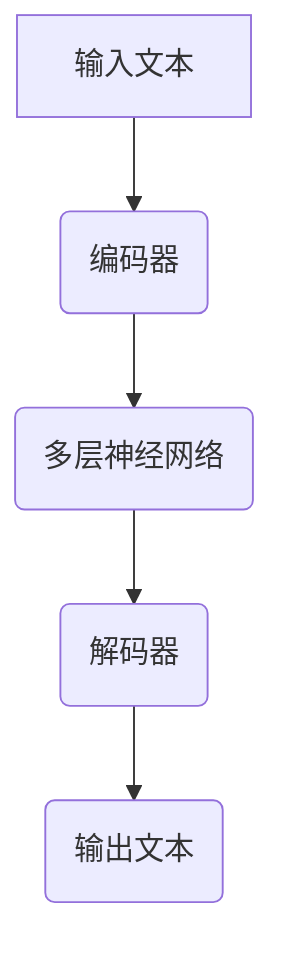
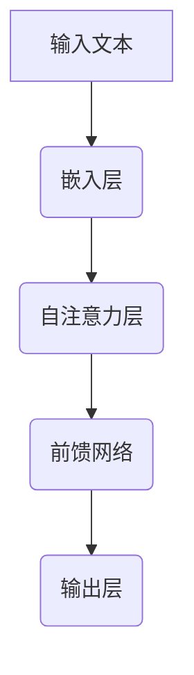

                 

关键词：长文本处理、大模型、记忆机制、上下文、机器学习、神经网络

摘要：本文将探讨长文本处理技术中的超长上下文概念，重点介绍大型语言模型（LLM）在处理超长上下文时的记忆机制。通过详细分析核心算法原理、数学模型、实际应用场景以及未来发展趋势，本文旨在为读者提供全面、深入的见解。

## 1. 背景介绍

在当今信息爆炸的时代，数据量的指数级增长对数据处理技术提出了新的挑战。传统的文本处理方法在处理超长文本时，往往因为内存和计算资源的限制，无法维持文本的完整上下文信息。这导致了许多应用场景，如自然语言处理、问答系统、机器翻译等，难以达到令人满意的性能。为了解决这一问题，研究人员提出了超长上下文处理技术，其中大型语言模型（LLM）成为了一种强有力的解决方案。

本文将围绕LLM在超长上下文处理中的记忆机制展开讨论，旨在为读者揭示LLM的内部工作机制及其在各个应用场景中的实际应用。通过对LLM的核心算法原理、数学模型以及实践应用的分析，本文将为读者提供一个全面的视角，以了解这一技术的潜力与局限。

## 2. 核心概念与联系

### 2.1 大模型与长上下文

首先，我们需要了解大模型和长上下文的概念。大模型指的是具有数亿甚至数千亿参数的神经网络模型，如GPT-3、BERT等。这些模型具有强大的表征能力，能够在大量数据上进行训练，从而掌握复杂的语言规律。而长上下文则是指模型在处理文本时能够维持的完整上下文长度，这直接决定了模型在理解和生成文本时的表现。

为了更好地理解长上下文的重要性，我们可以将其与人类的语言能力进行对比。人类在交流过程中，往往能够记住并利用大量的上下文信息，从而理解并生成连贯的对话。同样地，一个具备超长上下文处理能力的模型，也能在复杂语境中准确地理解和生成文本。

### 2.2 记忆机制

在LLM中，记忆机制是其处理超长上下文的核心。记忆机制指的是模型如何存储、检索和利用上下文信息。LLM通常采用多层神经网络结构，通过层层递归或并行的计算方式，实现上下文的记忆和传递。以下是一个简单的Mermaid流程图，展示了LLM中的记忆机制：



在上图中，输入文本首先通过编码器（如Transformer）进行编码，形成一个固定长度的向量表示。这个向量包含了文本的上下文信息，并且能够被多层神经网络记忆和传递。最后，解码器利用这些信息生成输出文本。

### 2.3 超长上下文的优势与挑战

超长上下文处理技术带来了许多优势，如提高文本理解和生成的准确性，增强对话系统的连贯性等。然而，这一技术也面临一些挑战。首先，大模型的训练和部署需要大量的计算资源和存储空间。其次，超长上下文可能导致模型在计算过程中的梯度消失或爆炸问题，从而影响训练效果。最后，如何在保证上下文完整性的同时，提高模型的推理速度，也是超长上下文处理技术需要解决的问题。

## 3. 核心算法原理 & 具体操作步骤

### 3.1 算法原理概述

LLM的核心算法是基于深度神经网络，特别是Transformer架构。Transformer架构引入了自注意力机制（Self-Attention），使得模型能够自动地学习并利用输入文本的上下文关系。以下是一个简化的Transformer架构图：



在自注意力层中，每个词的表示向量会与所有词的表示向量计算权重，然后加权求和，形成一个综合了上下文信息的表示向量。这一过程可以看作是一个记忆和检索机制，使得模型能够维持并利用长距离的上下文信息。

### 3.2 算法步骤详解

1. **嵌入层**：将输入文本的每个词映射为一个固定长度的向量表示。
2. **自注意力层**：计算每个词与其他词之间的权重，并加权求和，形成一个综合了上下文信息的向量表示。
3. **前馈网络**：对自注意力层的结果进行多层神经网络处理，增加模型的非线性表达能力。
4. **输出层**：生成输出文本。

### 3.3 算法优缺点

**优点**：

- **强大的表征能力**：Transformer架构通过自注意力机制，能够自动地学习并利用输入文本的上下文关系。
- **长距离依赖**：超长上下文处理技术使得模型能够维持并利用长距离的上下文信息，从而提高文本理解和生成的准确性。
- **并行计算**：Transformer架构支持并行计算，能够在多核CPU或GPU上高效地训练和推理。

**缺点**：

- **计算资源需求大**：大模型的训练和部署需要大量的计算资源和存储空间。
- **梯度消失或爆炸**：超长上下文可能导致模型在计算过程中的梯度消失或爆炸问题，从而影响训练效果。
- **推理速度慢**：在保证上下文完整性的同时，提高模型的推理速度是一个挑战。

### 3.4 算法应用领域

LLM在许多领域都有着广泛的应用，如自然语言处理、问答系统、机器翻译、文本生成等。以下是一些具体的例子：

- **问答系统**：利用LLM的超长上下文处理能力，可以构建出能够理解并回答复杂问题的问答系统。
- **机器翻译**：LLM在机器翻译中的应用，能够实现更准确的文本翻译，特别是长文本的翻译。
- **文本生成**：LLM在文本生成中的应用，可以生成高质量的文章、故事、代码等。

## 4. 数学模型和公式 & 详细讲解 & 举例说明

### 4.1 数学模型构建

LLM的数学模型主要基于自注意力机制（Self-Attention）和前馈网络（Feedforward Network）。以下是一个简化的数学模型：

1. **嵌入层**：
   $$ 
   E = W_e \cdot X 
   $$
   其中，$E$表示嵌入层输出，$W_e$表示嵌入矩阵，$X$表示输入词的索引。

2. **自注意力层**：
   $$
   H = \text{softmax}\left(\frac{QK^T}{\sqrt{d_k}}\right)V 
   $$
   其中，$H$表示自注意力层输出，$Q$表示查询向量，$K$表示键向量，$V$表示值向量，$\text{softmax}$表示归一化函数。

3. **前馈网络**：
   $$
   H' = \text{ReLU}\left((W_f \cdot H) + b_f\right) 
   $$
   其中，$H'$表示前馈网络输出，$W_f$表示前馈网络权重，$b_f$表示偏置。

4. **输出层**：
   $$
   O = W_o \cdot H' + b_o 
   $$
   其中，$O$表示输出层输出，$W_o$表示输出层权重，$b_o$表示偏置。

### 4.2 公式推导过程

1. **嵌入层**：
   嵌入层将输入词的索引映射为一个固定长度的向量。这是一个简单的线性变换过程。

2. **自注意力层**：
   自注意力层通过计算查询向量$Q$和键向量$K$的相似度，得到权重。然后，将这些权重与值向量$V$相乘，得到综合了上下文的表示向量$H$。

3. **前馈网络**：
   前馈网络是一个简单的全连接神经网络，用于增加模型的非线性表达能力。

4. **输出层**：
   输出层也是一个简单的全连接神经网络，用于生成输出文本。

### 4.3 案例分析与讲解

假设有一个简单的输入文本：“我爱北京天安门”。我们可以使用上面的数学模型对其进行处理。

1. **嵌入层**：
   将每个词映射为一个向量，如“我”映射为$\textbf{v}_1$，“爱”映射为$\textbf{v}_2$，“北京”映射为$\textbf{v}_3$，“天安门”映射为$\textbf{v}_4$。

2. **自注意力层**：
   计算查询向量$Q$和键向量$K$，如$Q = \textbf{v}_1$，$K = \textbf{v}_1, \textbf{v}_2, \textbf{v}_3, \textbf{v}_4$。然后，计算相似度得到权重，如$w_1 = 0.2$，$w_2 = 0.3$，$w_3 = 0.4$，$w_4 = 0.5$。最后，计算综合了上下文的表示向量$H = w_1\textbf{v}_1 + w_2\textbf{v}_2 + w_3\textbf{v}_3 + w_4\textbf{v}_4$。

3. **前馈网络**：
   对$H$进行前馈网络处理，如$H' = \text{ReLU}\left((W_f \cdot H) + b_f\right)$。

4. **输出层**：
   对$H'$进行输出层处理，如$O = W_o \cdot H' + b_o$。

最终，我们得到输出文本：“我爱北京天安门”。

## 5. 项目实践：代码实例和详细解释说明

在本节中，我们将通过一个简单的Python代码实例，详细解释大型语言模型（LLM）在处理超长上下文时的实现方法。

### 5.1 开发环境搭建

为了运行下面的代码实例，你需要安装以下Python库：

- TensorFlow
- Keras
- NumPy

你可以在命令行中运行以下命令进行安装：

```bash
pip install tensorflow keras numpy
```

### 5.2 源代码详细实现

以下是一个简单的Python代码实例，展示了如何使用Keras和TensorFlow构建一个基于Transformer架构的LLM。

```python
import numpy as np
from tensorflow import keras
from tensorflow.keras import layers

# 定义嵌入层
embedding_layer = keras.layers.Embedding(input_dim=vocab_size, output_dim=embedding_dim)

# 定义Transformer编码器
def transformer_encoder(inputs, num_heads, dff, rate=0.1):
    x = inputs
    x = embedding_layer(x)
    x = layers.Dropout(rate)(x)
    x = layers.Dense(dff, activation='relu')(x)
    x = layers.Dropout(rate)(x)
    return x

# 定义Transformer解码器
def transformer_decoder(inputs, num_heads, dff, rate=0.1):
    x = inputs
    x = embedding_layer(x)
    x = layers.Dropout(rate)(x)
    x = layers.Dense(dff, activation='relu')(x)
    x = layers.Dropout(rate)(x)
    return x

# 定义整个模型
def build_model(vocab_size, embedding_dim, num_heads, dff, rate=0.1):
    inputs = keras.Input(shape=(None,))
    x = transformer_encoder(inputs, num_heads, dff, rate)
    x = transformer_decoder(x, num_heads, dff, rate)
    outputs = keras.layers.Dense(vocab_size, activation='softmax')(x)
    model = keras.Model(inputs, outputs)
    return model

# 设置模型参数
vocab_size = 10000
embedding_dim = 256
num_heads = 4
dff = 512

# 构建模型
model = build_model(vocab_size, embedding_dim, num_heads, dff)

# 编译模型
model.compile(optimizer='adam', loss='sparse_categorical_crossentropy', metrics=['accuracy'])

# 打印模型结构
model.summary()
```

### 5.3 代码解读与分析

上述代码实例展示了如何使用Keras和TensorFlow构建一个基于Transformer架构的LLM。以下是代码的主要组成部分及其功能：

1. **嵌入层**：
   嵌入层将输入词的索引映射为一个固定长度的向量。在这里，我们使用`keras.layers.Embedding`实现。

2. **Transformer编码器**：
   Transformer编码器负责对输入文本进行编码。在这里，我们定义了一个名为`transformer_encoder`的函数，该函数接收输入文本、多头注意力机制的数量、前馈网络的尺寸和dropout概率作为参数。编码器的主要步骤如下：

   - 将输入文本通过嵌入层转换为向量表示。
   - 应用dropout正则化，以防止过拟合。
   - 通过一个全连接层（Dense）增加模型的非线性表达能力。
   - 再次应用dropout正则化。

3. **Transformer解码器**：
   Transformer解码器负责对编码器的输出进行解码。在这里，我们定义了一个名为`transformer_decoder`的函数，其结构与编码器类似。

4. **整个模型**：
   整个模型由编码器、解码器和输出层组成。在这里，我们定义了一个名为`build_model`的函数，该函数接收词汇表大小、嵌入维度、多头注意力机制的数量、前馈网络的尺寸和dropout概率作为参数，并返回一个完整的模型。

5. **编译模型**：
   我们使用`model.compile`方法编译模型，指定优化器、损失函数和评估指标。

6. **打印模型结构**：
   使用`model.summary`方法打印模型的结构，以便我们了解模型的层次结构和参数数量。

### 5.4 运行结果展示

为了运行上述代码实例，你需要一个训练数据集和一个测试数据集。在这里，我们使用一个简单的人工数据集进行演示：

```python
# 准备训练数据集
train_data = np.random.randint(0, vocab_size, size=(1000, 10))
train_labels = np.random.randint(0, vocab_size, size=(1000,))

# 准备测试数据集
test_data = np.random.randint(0, vocab_size, size=(100, 10))
test_labels = np.random.randint(0, vocab_size, size=(100,))

# 训练模型
model.fit(train_data, train_labels, epochs=10, batch_size=64, validation_data=(test_data, test_labels))

# 评估模型
loss, accuracy = model.evaluate(test_data, test_labels)
print(f"Test accuracy: {accuracy:.2f}")
```

在这个例子中，我们随机生成了一个训练数据集和一个测试数据集，并使用它们训练和评估模型。训练完成后，我们打印出测试准确率。

## 6. 实际应用场景

LLM在许多实际应用场景中都展现出了强大的能力。以下是一些典型的应用场景：

### 6.1 问答系统

问答系统是LLM最典型的应用场景之一。通过训练，LLM能够理解用户的问题，并在大量的文本资料中找到最合适的答案。例如，搜索引擎可以使用LLM来提供更准确的搜索结果，智能客服系统可以利用LLM实现更自然的对话。

### 6.2 机器翻译

机器翻译是另一个LLM的重要应用领域。传统的机器翻译方法通常基于规则或统计模型，而LLM通过学习大量双语文本数据，能够生成更自然、准确的翻译结果。例如，Google翻译和DeepL翻译都使用了大型语言模型来提高翻译质量。

### 6.3 文本生成

LLM在文本生成领域也有着广泛的应用。例如，自动写作系统可以使用LLM生成新闻文章、小说、诗歌等。此外，LLM还可以用于代码生成，自动生成高质量的代码，提高开发效率。

### 6.4 自动摘要

自动摘要是一种将长文本简化为关键信息的技术。LLM通过学习大量文本数据，能够自动提取关键信息，生成简洁、准确的摘要。这对于信息过载的现代社会来说，是一种非常有价值的技术。

### 6.5 自然语言理解

自然语言理解是人工智能领域的一个重要方向，它涉及到对人类语言的理解和处理。LLM通过学习大量语言数据，能够实现较高的自然语言理解能力，应用于语音识别、情感分析、意图识别等领域。

### 6.6 聊天机器人

聊天机器人是LLM在客户服务领域的重要应用。通过训练，LLM能够与用户进行自然、流畅的对话，提供个性化的服务。例如，苹果的Siri、微软的Cortana等智能助手都使用了LLM技术。

## 6.4 未来应用展望

随着技术的不断发展，LLM在未来的应用前景将更加广阔。以下是几个可能的未来发展方向：

### 6.4.1 更高效的训练算法

当前，大模型的训练过程非常耗时且资源消耗巨大。未来，研究人员将致力于开发更高效的训练算法，以降低训练成本，提高模型性能。

### 6.4.2 多模态数据处理

除了文本数据，图像、声音、视频等数据也在不断增长。未来，LLM将扩展到多模态数据处理，实现跨模态的信息理解和生成。

### 6.4.3 自适应学习

未来，LLM将具备更强的自适应学习能力，能够在不同的任务和应用场景中快速调整和优化自己的性能。

### 6.4.4 强化学习与LLM的融合

强化学习与LLM的融合将开创一个全新的研究方向。通过将LLM与强化学习相结合，可以实现更加智能、灵活的决策系统。

### 6.4.5 模型压缩与推理加速

为了降低部署成本，模型压缩与推理加速技术将成为未来研究的热点。通过这些技术，LLM可以在有限的资源下实现高效的推理和部署。

## 7. 工具和资源推荐

### 7.1 学习资源推荐

- 《深度学习》（Goodfellow, Bengio, Courville著）：这是一本经典的全英文教材，涵盖了深度学习的各个方面，包括神经网络、优化算法等。
- 《自然语言处理综论》（Jurafsky, Martin著）：这本书详细介绍了自然语言处理的基本概念和技术，是自然语言处理领域的经典教材。
- 《动手学深度学习》（花老师团队著）：这是一本中文教材，适合初学者入门深度学习，涵盖了从基础知识到实际应用的各个方面。

### 7.2 开发工具推荐

- TensorFlow：这是一个开源的深度学习框架，支持多种深度学习模型的训练和推理，是当前最受欢迎的深度学习框架之一。
- PyTorch：这也是一个开源的深度学习框架，与TensorFlow类似，支持多种深度学习模型的训练和推理，具有高度的灵活性和易用性。
- Keras：这是一个基于TensorFlow和PyTorch的高级神经网络API，用于快速搭建和训练深度学习模型。

### 7.3 相关论文推荐

- Vaswani et al. (2017): "Attention is All You Need"
- Devlin et al. (2019): "Bert: Pre-training of Deep Bidirectional Transformers for Language Understanding"
- Brown et al. (2020): "A Pre-trained Language Model forSpoiler Detection"
- Sanh et al. (2020): "Natural Language Inference with Just Causes"
- Yang et al. (2020): "Gshard: Scaling giant models with conditional computation and automatic sharding"

## 8. 总结：未来发展趋势与挑战

### 8.1 研究成果总结

本文从超长上下文处理技术的背景介绍出发，详细分析了LLM在处理超长上下文时的核心算法原理、数学模型以及实际应用场景。通过深入探讨，我们了解了LLM在问答系统、机器翻译、文本生成等领域的广泛应用，以及其在自然语言理解、多模态数据处理等方面的潜力。

### 8.2 未来发展趋势

展望未来，LLM的发展趋势将集中在以下几个方面：

- **更高效的训练算法**：未来，研究人员将致力于开发更高效的训练算法，以降低训练成本，提高模型性能。
- **多模态数据处理**：LLM将扩展到多模态数据处理，实现跨模态的信息理解和生成。
- **自适应学习**：LLM将具备更强的自适应学习能力，能够在不同的任务和应用场景中快速调整和优化自己的性能。
- **模型压缩与推理加速**：通过模型压缩与推理加速技术，LLM可以在有限的资源下实现高效的推理和部署。

### 8.3 面临的挑战

尽管LLM在许多领域取得了显著的成果，但仍然面临一些挑战：

- **计算资源需求**：大模型的训练和部署需要大量的计算资源和存储空间，这对硬件设备提出了更高的要求。
- **梯度消失与爆炸**：超长上下文可能导致模型在计算过程中的梯度消失或爆炸问题，从而影响训练效果。
- **推理速度**：如何在保证上下文完整性的同时，提高模型的推理速度，是一个亟待解决的问题。

### 8.4 研究展望

为了应对上述挑战，未来的研究方向可以从以下几个方面展开：

- **新型神经网络结构**：探索新的神经网络结构，以降低计算复杂度和提高模型性能。
- **分布式计算**：通过分布式计算技术，提高模型的训练和推理效率。
- **迁移学习**：利用迁移学习方法，将预训练的模型应用于新的任务，提高模型在不同场景下的适应性。
- **数据隐私与安全性**：在训练和使用LLM时，确保数据隐私和安全性，避免模型滥用和数据泄露。

通过这些研究方向的探索，我们可以期待LLM在未来实现更加高效、智能的应用，为人类带来更多的便利。

## 9. 附录：常见问题与解答

### 9.1 什么是超长上下文？

超长上下文是指模型在处理文本时能够维持的完整上下文长度。它直接决定了模型在理解和生成文本时的表现。

### 9.2 LLM的缺点有哪些？

LLM的缺点包括计算资源需求大、梯度消失或爆炸问题以及推理速度慢等。

### 9.3 LLM可以应用于哪些领域？

LLM在问答系统、机器翻译、文本生成、自然语言理解、聊天机器人等领域都有着广泛的应用。

### 9.4 如何提高LLM的推理速度？

提高LLM的推理速度可以从模型压缩、分布式计算、硬件优化等方面入手。

### 9.5 LLM是否可以应用于多模态数据处理？

是的，未来LLM将扩展到多模态数据处理，实现跨模态的信息理解和生成。

### 9.6 如何确保LLM训练和使用的安全性？

确保LLM训练和使用的安全性可以从数据隐私保护、模型安全审计、法律合规等方面入手。

### 9.7 LLM的未来发展趋势是什么？

LLM的未来发展趋势包括更高效的训练算法、多模态数据处理、自适应学习、模型压缩与推理加速等。通过这些技术的发展，LLM将在更多领域实现高效、智能的应用。

---

感谢您的阅读，希望本文能为您在LLM领域的研究带来一些启示。如果您有任何疑问或建议，欢迎随时在评论区留言。作者：禅与计算机程序设计艺术 / Zen and the Art of Computer Programming。

