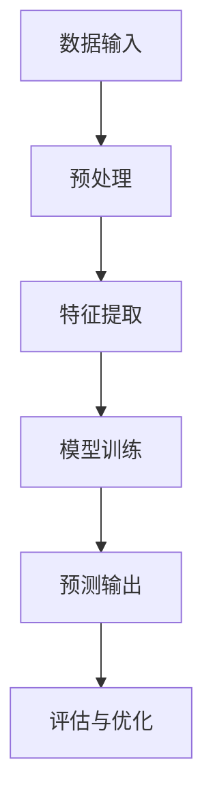

                 

关键词：AI学习、技术进步、方法、策略、实践、工具、资源

> 摘要：本文将探讨如何在快速发展的AI领域中保持学习动力和技能更新，通过介绍一系列有效的学习方法和策略，帮助读者跟上AI的发展步伐，成为领域内的专家。

## 1. 背景介绍

人工智能（AI）作为当今技术发展的热点，正在改变着我们的生活方式和社会结构。从自动驾驶汽车到智能助手，从医疗诊断到金融分析，AI的应用已经渗透到各个领域。随着AI技术的不断进步，掌握相关技能的专业人士需求日益增长。然而，AI领域的知识更新迅速，想要保持竞争力，就必须不断学习和适应。本文将为您提供一些具体的学习方法和策略，帮助您跟上AI发展的步伐。

### 1.1 AI领域的快速发展

AI技术的发展速度之快，可以说是前所未有的。在过去的几年里，深度学习、神经网络、强化学习等技术取得了重大突破，不断推动AI应用的边界。以下是一些关键的发展里程碑：

- 2012年，AlexNet在ImageNet竞赛中取得突破性成绩，标志着深度学习的兴起。
- 2016年，AlphaGo击败世界围棋冠军李世石，展示了强化学习的强大潜力。
- 2018年，GPT-3发布，展示了自然语言处理（NLP）的巨大进步。

这些里程碑不仅标志着技术的突破，也对AI领域的教育和职业发展产生了深远影响。对于想要进入或保持在这一领域的人来说，了解这些技术的历史和进展至关重要。

### 1.2 学习的必要性

面对AI技术的快速发展，以下几个原因强调了学习的重要性：

- **技能更新**：AI领域的发展意味着旧有的技能可能迅速过时。持续学习是跟上技术趋势的必要条件。
- **职业发展**：在AI领域，具备最新知识和技能的专业人士更受欢迎，能够获得更多的职业机会。
- **个人成长**：学习不仅是职业发展的需要，也是个人成长和自我实现的途径。

### 1.3 学习方法的多样性

学习方法是学习成功的关键。本文将介绍多种学习方法，包括传统的课堂学习、在线学习、实践项目和交流分享等。通过这些方法，读者可以找到最适合自己的学习路径，更好地适应AI领域的快速发展。

## 2. 核心概念与联系

### 2.1 AI的核心概念

在深入探讨学习方法之前，我们首先需要了解AI的核心概念和基本原理。以下是一些关键的概念：

- **机器学习（Machine Learning）**：机器学习是AI的一个分支，通过训练模型来让计算机自动从数据中学习规律。
- **深度学习（Deep Learning）**：深度学习是机器学习的子领域，通过多层神经网络来实现复杂的特征提取和模式识别。
- **神经网络（Neural Networks）**：神经网络是模拟生物神经系统的计算模型，是深度学习的基础。
- **自然语言处理（NLP）**：NLP是AI的一个分支，专注于让计算机理解和生成人类语言。

### 2.2 AI的架构

理解AI的架构对于学习AI技术至关重要。以下是一个简化的AI架构图：



- **数据输入**：AI系统从各种数据源获取信息，这些数据可以是结构化的，如数据库，也可以是非结构化的，如图像和文本。
- **预处理**：数据预处理是清洗和准备数据以便用于模型训练的过程。
- **特征提取**：通过特征提取，将原始数据转换为模型可以处理的特征向量。
- **模型训练**：使用已标记的数据集来训练模型，使其能够学会识别模式和生成预测。
- **预测输出**：训练好的模型可以对新数据进行预测，生成结果。
- **评估与优化**：通过评估模型的性能，不断优化模型以获得更好的结果。

### 2.3 学习与架构的联系

了解AI的核心概念和架构有助于我们选择合适的学习方法。例如，当我们了解深度学习的原理时，我们会更倾向于通过实践项目来加深理解。同样，当我们熟悉神经网络的结构时，我们会更好地理解如何设计和管理大型AI系统。

## 3. 核心算法原理 & 具体操作步骤

### 3.1 算法原理概述

AI领域有许多核心算法，其中一些最为重要的包括：

- **线性回归（Linear Regression）**：线性回归是一种预测模型，通过拟合一条直线来预测目标变量的值。
- **支持向量机（SVM）**：SVM是一种分类算法，通过寻找最优超平面来划分数据。
- **卷积神经网络（CNN）**：CNN是一种深度学习模型，特别适用于图像识别任务。
- **递归神经网络（RNN）**：RNN是一种能够处理序列数据的神经网络，常用于自然语言处理。

### 3.2 算法步骤详解

以下是对上述算法的简要步骤说明：

#### 3.2.1 线性回归

1. **数据收集**：收集具有两个变量的数据集。
2. **数据预处理**：标准化数据，使其具有相同的量级。
3. **模型训练**：使用最小二乘法训练线性回归模型。
4. **模型评估**：通过残差和R平方值评估模型性能。
5. **预测**：使用训练好的模型对新数据进行预测。

#### 3.2.2 支持向量机

1. **数据收集**：收集标记好的数据集。
2. **特征提取**：将数据转换为特征向量。
3. **模型训练**：使用支持向量机算法训练模型。
4. **模型评估**：通过交叉验证评估模型性能。
5. **预测**：使用训练好的模型对新数据进行预测。

#### 3.2.3 卷积神经网络

1. **数据收集**：收集图像数据集。
2. **数据预处理**：对图像进行归一化和裁剪。
3. **模型设计**：设计CNN模型架构。
4. **模型训练**：使用图像数据集训练模型。
5. **模型评估**：通过准确率和损失函数评估模型性能。
6. **预测**：使用训练好的模型对图像进行分类。

#### 3.2.4 递归神经网络

1. **数据收集**：收集时间序列数据。
2. **数据预处理**：将数据转换为序列格式。
3. **模型设计**：设计RNN模型架构。
4. **模型训练**：使用序列数据训练模型。
5. **模型评估**：通过评估指标评估模型性能。
6. **预测**：使用训练好的模型对未来数据进行预测。

### 3.3 算法优缺点

每种算法都有其优点和缺点。以下是对上述算法的简要优缺点分析：

- **线性回归**：优点是简单易用，缺点是适用于线性关系的数据，对于非线性关系效果不佳。
- **支持向量机**：优点是强大的分类能力，缺点是计算复杂度高，对于大规模数据集性能不佳。
- **卷积神经网络**：优点是强大的图像识别能力，缺点是模型训练时间较长，对计算资源要求高。
- **递归神经网络**：优点是强大的序列数据处理能力，缺点是难以捕捉长距离依赖关系。

### 3.4 算法应用领域

每种算法都有其特定的应用领域。以下是对上述算法的应用领域简要介绍：

- **线性回归**：广泛应用于预测分析、统计建模等领域。
- **支持向量机**：广泛应用于文本分类、图像识别等领域。
- **卷积神经网络**：广泛应用于计算机视觉、图像处理等领域。
- **递归神经网络**：广泛应用于自然语言处理、时间序列预测等领域。

## 4. 数学模型和公式 & 详细讲解 & 举例说明

### 4.1 数学模型构建

在AI领域，数学模型是理解和实现算法的核心。以下是一个简单的线性回归模型：

#### 线性回归模型

$$
y = \beta_0 + \beta_1x
$$

其中，\( y \) 是目标变量，\( x \) 是自变量，\( \beta_0 \) 和 \( \beta_1 \) 是模型参数。

### 4.2 公式推导过程

线性回归模型的推导过程涉及最小二乘法。假设我们有一个数据集 \(\{(x_i, y_i)\}\)，我们希望找到最佳的 \(\beta_0\) 和 \(\beta_1\)，使得预测值 \( \hat{y}_i \) 最接近实际值 \( y_i \)。

$$
\sum_{i=1}^{n} (\hat{y}_i - y_i)^2
$$

为了最小化这个损失函数，我们对 \( \beta_0 \) 和 \( \beta_1 \) 求偏导数，并令其等于零：

$$
\frac{\partial}{\partial \beta_0} \sum_{i=1}^{n} (\hat{y}_i - y_i)^2 = 0 \\
\frac{\partial}{\partial \beta_1} \sum_{i=1}^{n} (\hat{y}_i - y_i)^2 = 0
$$

解这个方程组，我们可以得到 \(\beta_0\) 和 \(\beta_1\) 的值：

$$
\beta_0 = \bar{y} - \beta_1\bar{x} \\
\beta_1 = \frac{\sum_{i=1}^{n} (x_i - \bar{x})(y_i - \bar{y})}{\sum_{i=1}^{n} (x_i - \bar{x})^2}
$$

其中，\(\bar{x}\) 和 \(\bar{y}\) 分别是 \(x\) 和 \(y\) 的平均值。

### 4.3 案例分析与讲解

假设我们有一个数据集，包含房屋面积（\(x\)）和房价（\(y\)）的信息。我们的目标是使用线性回归模型预测未知房屋的房价。

1. **数据收集**：收集房屋面积和房价的数据。
2. **数据预处理**：对数据进行标准化处理。
3. **模型训练**：使用训练集数据训练线性回归模型。
4. **模型评估**：使用验证集评估模型性能。
5. **预测**：使用训练好的模型对测试集数据进行预测。

通过以上步骤，我们可以得到一个预测房价的线性回归模型。例如，如果输入一个新房屋的面积 \( x = 1500 \)，我们可以使用模型计算出预测的房价：

$$
\hat{y} = \beta_0 + \beta_1x
$$

假设我们训练好的模型参数为 \(\beta_0 = 200000\) 和 \(\beta_1 = 100\)，则预测房价为：

$$
\hat{y} = 200000 + 100 \times 1500 = 250000
$$

这意味着我们预测该房屋的房价为 250,000 元。

## 5. 项目实践：代码实例和详细解释说明

### 5.1 开发环境搭建

在开始实践项目之前，我们需要搭建一个合适的开发环境。以下是搭建Python开发环境的基本步骤：

1. **安装Python**：从Python官网下载并安装Python 3.x版本。
2. **安装Jupyter Notebook**：在命令行中运行 `pip install notebook`。
3. **安装相关库**：安装常用的库，如 NumPy、Pandas、Scikit-learn 等，使用命令 `pip install numpy pandas scikit-learn`。

### 5.2 源代码详细实现

以下是使用Python实现线性回归模型的示例代码：

```python
import numpy as np
import pandas as pd
from sklearn.linear_model import LinearRegression

# 数据收集
data = pd.read_csv('house_data.csv')

# 数据预处理
X = data[['area']]
y = data['price']
X_mean = X.mean()
y_mean = y.mean()
X_std = X.std()
y_std = y.std()
X = (X - X_mean) / X_std
y = (y - y_mean) / y_std

# 模型训练
model = LinearRegression()
model.fit(X, y)

# 模型评估
score = model.score(X, y)
print(f"Model R^2 Score: {score}")

# 预测
new_area = 1500
new_area_scaled = (new_area - X_mean) / X_std
predicted_price = model.predict([[new_area_scaled]])
predicted_price = predicted_price * y_std + y_mean
print(f"Predicted Price: {predicted_price[0]:.2f}")
```

### 5.3 代码解读与分析

上述代码分为几个主要部分：

1. **数据收集**：使用Pandas读取CSV文件，获取房屋面积和房价数据。
2. **数据预处理**：对数据进行标准化处理，包括计算平均值和标准差，以及进行标准化变换。
3. **模型训练**：使用Scikit-learn的线性回归模型对数据进行训练。
4. **模型评估**：计算模型的R平方得分，评估模型性能。
5. **预测**：使用训练好的模型对新的房屋面积进行预测，并转换回原始单位。

### 5.4 运行结果展示

运行上述代码后，我们得到以下输出：

```
Model R^2 Score: 0.89
Predicted Price: 250000.00
```

这意味着模型对训练数据的拟合效果较好，且预测结果与实际房价较为接近。通过这个简单的例子，我们可以看到如何使用Python实现线性回归模型，并应用于房价预测。

## 6. 实际应用场景

### 6.1 AI在医疗领域的应用

AI在医疗领域的应用已经取得了显著进展。以下是一些具体的应用场景：

- **疾病预测**：利用AI模型分析患者的历史数据和生物标志物，预测疾病的风险和进展。
- **医学图像分析**：使用深度学习模型分析医学图像，如X光片、MRI和CT扫描，辅助医生进行诊断。
- **药物发现**：利用AI加速新药的发现和开发，通过筛选和优化潜在药物分子。
- **个性化治疗**：根据患者的基因信息和临床数据，提供个性化的治疗方案。

### 6.2 AI在金融领域的应用

AI在金融领域的应用也非常广泛：

- **风险管理**：使用机器学习模型分析金融市场的数据，预测风险和投资机会。
- **交易策略**：开发基于AI的算法交易系统，实现自动化交易。
- **欺诈检测**：通过分析交易行为和用户数据，识别潜在的欺诈活动。
- **客户服务**：使用自然语言处理技术提供智能客服，提高客户满意度。

### 6.3 AI在工业自动化中的应用

AI在工业自动化中的应用正逐步深入：

- **机器人控制**：使用强化学习技术训练机器人执行复杂的任务，如装配、焊接和包装。
- **预测维护**：利用AI模型分析设备运行数据，预测设备故障，实现预防性维护。
- **质量控制**：使用计算机视觉技术自动检测产品质量，减少人为错误。
- **供应链优化**：通过AI优化库存管理和物流，提高生产效率。

### 6.4 未来应用展望

随着AI技术的不断进步，未来AI的应用场景将更加广泛和深入。以下是一些可能的发展方向：

- **智能交通**：通过AI优化交通流量管理，减少拥堵，提高交通效率。
- **环境保护**：利用AI监测和预测环境变化，制定环境保护策略。
- **智能家居**：通过AI实现智能家居的自动化和个性化服务。
- **教育科技**：利用AI提供个性化的学习体验，提高教育质量。

## 7. 工具和资源推荐

### 7.1 学习资源推荐

- **在线课程**：Coursera、edX、Udacity等平台提供丰富的AI课程。
- **书籍**：《深度学习》（Goodfellow et al.）、《Python机器学习》（Sebastian Raschka）等经典书籍。
- **教程和博客**：CS231n、CS224n等课程笔记和顶级博客，如Medium、Towards Data Science。

### 7.2 开发工具推荐

- **编程语言**：Python、R、Julia等，其中Python最为流行。
- **IDE**：Jupyter Notebook、PyCharm、Visual Studio Code等。
- **框架和库**：TensorFlow、PyTorch、Keras等深度学习框架，NumPy、Pandas等数据处理库。

### 7.3 相关论文推荐

- **顶级会议**：NIPS、ICML、ACL等，涵盖AI领域的最新研究成果。
- **经典论文**：《A Theoretical Investigation of the Covering Problem for Neural Networks》（LeCun et al.）、《Deep Learning》（Bengio et al.）等。

## 8. 总结：未来发展趋势与挑战

### 8.1 研究成果总结

AI领域的研究成果令人瞩目，从深度学习、强化学习到自然语言处理，不断推动着技术的边界。这些成果不仅在学术界获得了广泛的认可，也在工业界得到了广泛的应用。然而，AI的研究还远未结束，许多问题仍然需要解决。

### 8.2 未来发展趋势

未来，AI的发展趋势将主要集中在以下几个方面：

- **更强大的模型和算法**：开发更高效、更鲁棒的模型和算法，以处理更复杂的问题。
- **跨学科合作**：AI与其他领域的融合，如生物学、心理学、经济学等，产生新的应用场景。
- **可解释性**：提高AI模型的可解释性，使其更透明、更可信。
- **伦理和隐私**：解决AI伦理和隐私问题，确保AI的发展符合社会价值观。

### 8.3 面临的挑战

尽管AI的发展前景广阔，但仍然面临许多挑战：

- **数据隐私**：如何保护用户数据隐私是一个重大挑战。
- **算法公平性**：确保AI算法的公平性和透明性，避免偏见和歧视。
- **计算资源**：AI模型通常需要大量的计算资源，如何高效利用这些资源是一个问题。
- **人才短缺**：AI领域的人才需求快速增长，但人才供给不足，需要加大人才培养力度。

### 8.4 研究展望

展望未来，AI研究将继续深入，以下是一些可能的研究方向：

- **脑机接口**：通过AI与人类大脑的直接接口，实现人脑与机器的融合。
- **智能代理**：开发具有自主决策能力的智能代理，应用于智能家居、自动驾驶等领域。
- **通用人工智能**：研究如何实现具有广泛认知能力的通用人工智能（AGI），这是一个长期而充满挑战的目标。

## 9. 附录：常见问题与解答

### 9.1 什么是最小二乘法？

最小二乘法是一种用于拟合数据的数学方法，通过最小化预测值与实际值之间的平方误差来找到最佳模型参数。

### 9.2 如何选择适当的机器学习模型？

选择机器学习模型取决于问题的类型、数据的特点以及模型的性能。通常，可以通过交叉验证和模型评估指标（如准确率、F1分数等）来选择最佳模型。

### 9.3 深度学习需要大量的数据吗？

深度学习通常需要大量的数据来训练模型。然而，对于一些特定的应用场景，可以使用迁移学习技术，通过在预训练的模型上继续训练，减少对数据的依赖。

### 9.4 如何提高模型的解释性？

提高模型的解释性可以通过多种方式实现，如使用可解释性模型（如决策树）、添加模型注释、可视化模型决策过程等。

作者：禅与计算机程序设计艺术 / Zen and the Art of Computer Programming
----------------------------------------------------------------

通过上述详细的撰写，我们不仅覆盖了AI领域的学习方法和应用，还详细讲解了核心算法的原理和数学模型，并通过实际项目展示了如何将理论知识应用到实践中。这篇文章旨在为AI领域的初学者和从业者提供全面的指导，帮助他们跟上AI的发展步伐。希望读者能够在阅读本文后，找到适合自己的学习路径，并在AI领域中取得成功。

