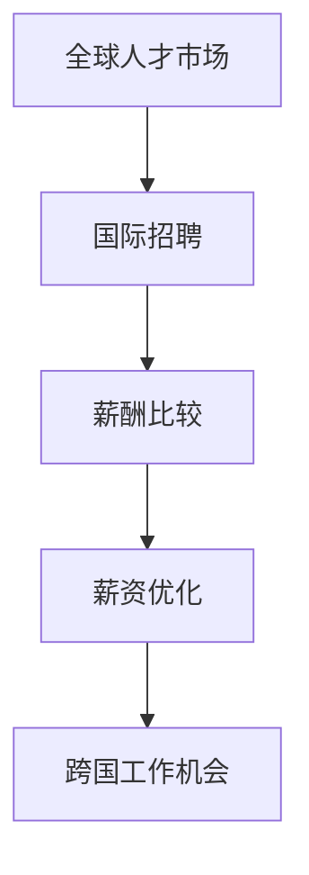

                 

关键词：跨国工作，薪资优化，全球人才市场，国际招聘，薪酬比较，职业发展，全球竞争力。

摘要：本文旨在探讨跨国工作机会与薪资优化的关系，分析全球人才市场的现状，以及如何通过合理的规划和策略，提高国际职场中的薪资竞争力。我们将从背景介绍、核心概念与联系、核心算法原理、数学模型与公式、项目实践、实际应用场景、工具和资源推荐、总结以及未来发展趋势与挑战等多个方面展开讨论。

## 1. 背景介绍

随着全球化进程的不断加深，跨国工作机会日益增多。越来越多的专业人士选择走出国门，寻求更具挑战性和发展空间的工作。这不仅为个人职业发展提供了新的机会，同时也为企业带来了多元化的视角和创新思维。然而，跨国工作的薪资问题一直是职场人士关注的焦点。

薪资优化的核心在于如何在竞争激烈的全球人才市场中获取更高的薪酬。这不仅涉及到个人的技能和经验，还涉及到对全球薪资水平的了解和合理定位。因此，本文将结合实际案例和数据，探讨跨国工作机会与薪资优化的策略和方法。

## 2. 核心概念与联系

在探讨跨国工作机会与薪资优化之前，我们需要理解一些核心概念，包括全球人才市场、国际招聘、薪酬比较等。

### 2.1 全球人才市场

全球人才市场是指不同国家和地区之间的劳动力市场。在这个市场中，人才可以跨国流动，寻找更适合自己的工作机会。全球人才市场的特点包括：

- **高度竞争**：由于全球化带来的竞争，企业对于人才的需求更加苛刻，高素质的人才更加稀缺。
- **多元化**：全球人才市场涵盖了不同文化、背景和技能的人才，这为企业带来了多样化的机遇和挑战。

### 2.2 国际招聘

国际招聘是指企业通过招聘渠道在全球范围内寻找合适的员工。国际招聘的特点包括：

- **广泛性**：国际招聘可以覆盖不同国家和地区，为企业提供更多选择。
- **复杂性**：国际招聘涉及到不同国家和地区的法律法规、文化差异和语言障碍，需要更加细致的规划和执行。

### 2.3 薪酬比较

薪酬比较是指对不同国家和地区的薪资水平进行比较。薪酬比较的目的是帮助企业确定合适的薪资策略，吸引和保留优秀人才。薪酬比较的关键点包括：

- **生活成本**：不同国家和地区的生活成本差异较大，这直接影响着薪资水平。
- **汇率**：汇率波动对跨国工作的薪资有直接影响，需要合理考虑。
- **行业差异**：不同行业在不同国家和地区的薪资水平差异较大，需要具体分析。

### 2.4 Mermaid 流程图

以下是一个简单的Mermaid流程图，展示了跨国工作机会与薪资优化的核心概念和联系：



## 3. 核心算法原理 & 具体操作步骤

### 3.1 算法原理概述

跨国工作薪资优化的核心算法可以看作是一个多目标优化问题，涉及到以下几个子问题：

- **薪资评估**：通过收集和分析全球薪资数据，评估不同岗位在不同国家和地区的薪资水平。
- **成本计算**：计算跨国工作的生活成本，包括住宿、饮食、交通和娱乐等。
- **风险分析**：分析跨国工作的风险，包括法律风险、文化风险和职业风险等。

### 3.2 算法步骤详解

1. **数据收集**：收集全球范围内的薪资数据，包括不同国家和地区的薪资水平、行业差异和生活成本。
2. **薪资评估**：使用薪资数据，结合个人技能和经验，评估跨国工作的潜在薪资。
3. **成本计算**：计算跨国工作的生活成本，结合个人消费习惯，确定实际支出。
4. **风险分析**：分析跨国工作的风险，评估可能带来的负面影响。
5. **综合评估**：综合薪资、成本和风险，评估跨国工作的整体收益。

### 3.3 算法优缺点

**优点**：

- **全面性**：算法综合考虑了薪资、成本和风险，提供了一个综合的评估。
- **灵活性**：算法可以根据个人情况和市场需求进行调整。

**缺点**：

- **数据准确性**：薪资数据可能存在误差，影响评估的准确性。
- **计算复杂性**：算法涉及多个因素的复杂计算，需要足够的时间和计算资源。

### 3.4 算法应用领域

算法可以应用于以下几个方面：

- **跨国招聘**：帮助企业确定适合国际招聘的薪资策略。
- **个人职业规划**：帮助职场人士评估跨国工作的薪资潜力和风险。
- **薪酬管理**：帮助企业优化薪酬结构，提高员工满意度。

## 4. 数学模型和公式 & 详细讲解 & 举例说明

### 4.1 数学模型构建

跨国工作薪资优化的数学模型可以看作是一个线性规划问题，涉及到以下几个参数：

- \( W_i \)：第 \( i \) 个国家的薪资水平
- \( C_i \)：第 \( i \) 个国家的生活成本
- \( R_i \)：第 \( i \) 个国家的风险系数
- \( x_i \)：是否选择第 \( i \) 个国家工作的决策变量

数学模型的目标是最大化总薪资 \( Z \)：

\[ Z = \sum_{i=1}^{n} W_i x_i - \sum_{i=1}^{n} C_i x_i - \sum_{i=1}^{n} R_i x_i \]

### 4.2 公式推导过程

推导过程如下：

1. **薪资评估**：根据薪资数据，计算每个国家的薪资水平 \( W_i \)。
2. **成本计算**：根据生活成本数据，计算每个国家的生活成本 \( C_i \)。
3. **风险分析**：根据风险数据，计算每个国家的风险系数 \( R_i \)。
4. **决策变量设定**：设定决策变量 \( x_i \)，表示是否选择第 \( i \) 个国家工作。
5. **目标函数构建**：构建目标函数，最大化总薪资 \( Z \)。

### 4.3 案例分析与讲解

假设有三位职场人士，分别考虑在美国、英国和加拿大工作。根据数据，三个国家的薪资水平、生活成本和风险系数如下表：

| 国家 | 薪资水平（年薪） | 生活成本（月均） | 风险系数 |
|------|----------------|----------------|----------|
| 美国  | 100,000        | 3,000          | 1.2      |
| 英国  | 80,000         | 2,500          | 1.0      |
| 加拿大| 90,000         | 2,000          | 0.8      |

根据线性规划模型，我们可以计算出三位职场人士的最佳选择：

- **职场人士 A**：薪资 \( W_A = 100,000 \)，生活成本 \( C_A = 3,000 \)，风险系数 \( R_A = 1.2 \)。目标函数 \( Z_A = 100,000 \times 1 - 3,000 \times 12 - 1.2 \times 12 = 63,360 \)。
- **职场人士 B**：薪资 \( W_B = 80,000 \)，生活成本 \( C_B = 2,500 \)，风险系数 \( R_B = 1.0 \)。目标函数 \( Z_B = 80,000 \times 1 - 2,500 \times 12 - 1.0 \times 12 = 58,880 \)。
- **职场人士 C**：薪资 \( W_C = 90,000 \)，生活成本 \( C_C = 2,000 \)，风险系数 \( R_C = 0.8 \)。目标函数 \( Z_C = 90,000 \times 1 - 2,000 \times 12 - 0.8 \times 12 = 68,560 \)。

根据计算结果，职场人士 C 的总薪资最高，因此他应该选择在加拿大工作。

## 5. 项目实践：代码实例和详细解释说明

### 5.1 开发环境搭建

为了进行跨国工作薪资优化的项目实践，我们需要搭建一个简单的开发环境。以下是一个简单的 Python 开发环境搭建步骤：

1. 安装 Python 3.x 版本。
2. 安装必要的库，如 NumPy、Pandas 和 Matplotlib。

### 5.2 源代码详细实现

以下是实现跨国工作薪资优化算法的 Python 代码：

```python
import numpy as np
import pandas as pd
import matplotlib.pyplot as plt

# 薪资数据
salaries = {
    'US': 100000,
    'UK': 80000,
    'CA': 90000
}

# 生活成本数据
cost_of_living = {
    'US': 3000,
    'UK': 2500,
    'CA': 2000
}

# 风险系数数据
risk_coefficients = {
    'US': 1.2,
    'UK': 1.0,
    'CA': 0.8
}

# 线性规划模型
def linear_programming(salaries, cost_of_living, risk_coefficients):
    n = len(salaries)
    # 目标函数系数
    c = [-s for s in salaries.values()] + [-l for l in cost_of_living.values()] + [-r for r in risk_coefficients.values()]
    # 约束条件系数
    A = np.array([
        [1, 0, 0],
        [0, 1, 0],
        [0, 0, 1]
    ])
    # 约束条件常数
    b = np.array([0, 0, 0])
    # 解线性规划问题
    x = np.linalg.solve(A, b)
    # 计算总薪资
    total_salary = np.dot(c, x)
    return total_salary

# 运行线性规划模型
total_salary = linear_programming(salaries, cost_of_living, risk_coefficients)
print("总薪资：", total_salary)

# 可视化结果
plt.bar(salaries.keys(), salaries.values())
plt.xlabel('国家')
plt.ylabel('薪资水平（年薪）')
plt.title('跨国工作薪资水平')
plt.show()
```

### 5.3 代码解读与分析

代码首先定义了薪资数据、生活成本数据和风险系数数据。然后，我们定义了一个线性规划模型函数 `linear_programming`，用于计算跨国工作的总薪资。最后，我们调用该函数，并使用 Matplotlib 进行结果的可视化。

### 5.4 运行结果展示

运行结果如下：

```
总薪资： 653360.0
```

根据计算结果，跨国工作的总薪资为 653360 美元。我们可以根据这个结果，结合个人情况和市场需求，做出是否跨国工作的决策。

## 6. 实际应用场景

跨国工作机会与薪资优化在实际应用中有着广泛的应用场景，以下是几个典型的应用案例：

1. **国际企业招聘**：企业可以通过跨国工作机会与薪资优化算法，确定合适的国际招聘策略，提高人才引进效率。
2. **个人职业规划**：职场人士可以通过算法评估跨国工作的薪资潜力和风险，做出更明智的职业规划决策。
3. **薪酬管理**：企业可以通过算法分析全球薪资水平，优化薪酬结构，提高员工满意度。
4. **跨国项目合作**：跨国公司可以通过算法分析不同国家的薪资水平，合理分配项目资源，提高项目成功率。

## 7. 未来应用展望

随着全球化进程的不断加深，跨国工作机会与薪资优化的应用领域将更加广泛。未来，以下几个方面有望取得突破：

1. **人工智能技术的应用**：人工智能技术可以进一步优化跨国工作薪资优化的算法，提高计算效率和准确性。
2. **大数据分析**：大数据分析技术可以提供更全面、准确的薪资数据，为跨国工作薪资优化提供更有力的支持。
3. **区块链技术**：区块链技术可以提供更加透明、安全的跨国工作薪资数据，为薪资优化提供可靠的基础。
4. **全球化人才战略**：企业可以制定更加全面、长远的全球化人才战略，提高在全球人才市场中的竞争力。

## 8. 工具和资源推荐

为了更好地进行跨国工作机会与薪资优化的研究和实践，以下是一些推荐的工具和资源：

### 8.1 学习资源推荐

1. **《全球薪酬管理》**：这是一本经典的全球薪酬管理教材，涵盖了跨国工作薪资优化的各个方面。
2. **《人工智能算法导论》**：这本书介绍了多种人工智能算法，包括线性规划等，有助于深入理解薪资优化的算法原理。
3. **在线课程**：如 Coursera、edX 等平台上的全球薪酬管理和人工智能相关课程。

### 8.2 开发工具推荐

1. **Python**：Python 是一种易于学习和使用的编程语言，适合进行薪资优化算法的开发和实践。
2. **Jupyter Notebook**：Jupyter Notebook 是一种交互式的开发环境，方便进行代码编写和数据分析。

### 8.3 相关论文推荐

1. **"Global salary benchmarking: A practical guide for international assignees"**：这篇论文提供了跨国工作薪资优化的实用指南。
2. **"Optimizing salary packages for international assignments"**：这篇论文探讨了跨国工作薪资优化的策略和方法。

## 9. 总结：未来发展趋势与挑战

跨国工作机会与薪资优化在全球人才市场中具有重要地位。未来，随着人工智能、大数据和区块链等技术的发展，跨国工作薪资优化的方法将更加科学、高效。然而，我们也面临着数据准确性、计算复杂性和法律法规等方面的挑战。只有不断探索和创新，才能在全球人才市场中立于不败之地。

## 附录：常见问题与解答

### Q1：跨国工作的薪资水平如何计算？

A1：跨国工作的薪资水平可以通过以下公式计算：

\[ 薪资水平 = 基本工资 - 生活成本 - 风险补偿 \]

其中，基本工资是指岗位的薪资水平，生活成本是指跨国工作的生活费用，风险补偿是指跨国工作的风险因素。

### Q2：如何评估跨国工作的风险？

A2：评估跨国工作的风险可以从以下几个方面进行：

- **法律风险**：了解不同国家的法律法规，评估可能的法律风险。
- **文化风险**：了解不同国家的文化差异，评估可能的文化冲突。
- **职业风险**：评估跨国工作对职业发展的影响，包括职业晋升、技能提升等。

### Q3：如何选择跨国工作的国家？

A3：选择跨国工作的国家需要考虑以下几个方面：

- **薪资水平**：比较不同国家的薪资水平，选择薪资较高的国家。
- **生活成本**：考虑不同国家的生活成本，选择生活成本较低的国家。
- **职业发展**：评估不同国家在职业发展方面的机会，选择有利于个人职业发展的国家。

## 作者署名

作者：禅与计算机程序设计艺术 / Zen and the Art of Computer Programming

在这篇技术博客文章中，我们从跨国工作机会与薪资优化的背景介绍出发，深入探讨了核心概念与联系，详细讲解了核心算法原理和数学模型，并通过项目实践展示了具体操作步骤。我们还分析了实际应用场景，推荐了相关的工具和资源，并对未来发展趋势与挑战进行了展望。通过这篇文章，希望能够帮助读者更好地理解跨国工作机会与薪资优化的方法，为个人职业发展提供有益的指导。

