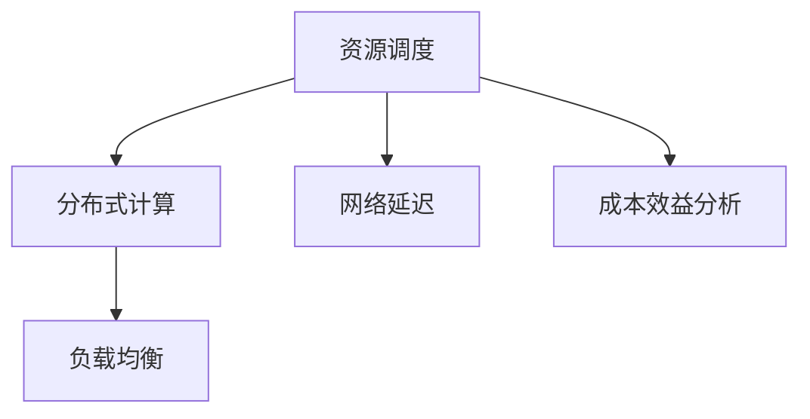

                 

 > **关键词**：跨地域AI资源调度、全球化运营、AI资源优化、分布式计算、算法优化、负载均衡、网络延迟、成本效益分析。

> **摘要**：本文深入探讨了跨地域AI资源调度的关键概念、原理、算法及其在全球化运营中的应用。以Lepton AI为例，展示了如何通过高效的资源调度策略实现全球范围内的AI服务优化，为其他企业提供宝贵的参考。

## 1. 背景介绍

随着人工智能技术的飞速发展，AI应用已经成为各行各业不可或缺的部分。从金融服务到医疗健康，从智能制造到智能城市，AI正在深刻改变着我们的生活方式。然而，随着AI应用的普及，对AI资源的需求也呈现出爆发式增长。这不仅包括计算资源，还包括存储资源、网络资源等。

### 1.1 资源调度的必要性

跨地域AI资源调度成为解决资源紧缺的关键手段。企业可以通过在全球范围内调度资源，实现对计算需求的高效响应。然而，跨地域资源调度面临着诸多挑战，如网络延迟、数据安全、成本效益分析等。

### 1.2 跨地域AI资源调度的重要性

跨地域AI资源调度不仅能够优化资源利用，提高服务效率，还能够降低运营成本，提升企业的竞争力。在全球化的背景下，跨地域AI资源调度是企业实现全球化运营的必要条件。

## 2. 核心概念与联系

### 2.1 资源调度

资源调度是指根据需求动态分配资源的过程。在AI领域，资源调度包括计算资源、存储资源、网络资源等。

### 2.2 分布式计算

分布式计算是一种将任务分布在多个计算节点上执行的计算模型。分布式计算能够提高计算效率，降低单点故障的风险。

### 2.3 负载均衡

负载均衡是指通过分配负载，避免单点过载，从而提高系统稳定性和性能。

### 2.4 网络延迟

网络延迟是指数据在网络中传输所需的时间。网络延迟会影响AI服务的响应速度和性能。

### 2.5 成本效益分析

成本效益分析是指通过评估成本和效益，确定资源调度的最优方案。

### 2.6 Mermaid 流程图



## 3. 核心算法原理 & 具体操作步骤

### 3.1 算法原理概述

跨地域AI资源调度算法的核心原理是基于需求动态调整资源分配。算法通过分析实时需求，自动调整计算资源、存储资源、网络资源的分配。

### 3.2 算法步骤详解

1. 数据采集：采集全球范围内的AI服务请求数据。
2. 需求预测：基于历史数据和实时数据，预测未来的服务需求。
3. 资源分配：根据需求预测，动态调整资源的分配。
4. 性能监控：监控资源使用情况，确保系统稳定运行。
5. 反馈调整：根据性能监控结果，调整资源分配策略。

### 3.3 算法优缺点

**优点：**
- 提高资源利用效率，降低运营成本。
- 增强系统稳定性，提高服务响应速度。

**缺点：**
- 需要大量历史数据支持，数据质量影响算法效果。
- 需要复杂算法实现，实现成本高。

### 3.4 算法应用领域

- 云计算服务
- 智能制造
- 金融科技
- 医疗健康

## 4. 数学模型和公式 & 详细讲解 & 举例说明

### 4.1 数学模型构建

假设有 \(N\) 个AI服务节点，每个节点的计算能力为 \(C_i\)，存储能力为 \(S_i\)，网络带宽为 \(B_i\)。需求量为 \(D\)，调度策略为 \(P\)。

### 4.2 公式推导过程

\[ P = \arg \max \sum_{i=1}^{N} (C_i \cdot f_i(D) + S_i \cdot g_i(D) + B_i \cdot h_i(D)) - C_i \cdot c_i \]

其中，\( f_i(D) \)、\( g_i(D) \)、\( h_i(D) \) 分别表示节点 \(i\) 的计算效率、存储效率、网络效率，\( c_i \) 表示节点 \(i\) 的成本。

### 4.3 案例分析与讲解

假设有3个AI服务节点，需求量为100个计算任务。节点1的计算能力为200个任务/小时，存储能力为500GB，网络带宽为10GB/s，成本为1000美元/小时。节点2的计算能力为150个任务/小时，存储能力为300GB，网络带宽为5GB/s，成本为800美元/小时。节点3的计算能力为100个任务/小时，存储能力为200GB，网络带宽为2GB/s，成本为500美元/小时。

根据上述数学模型，我们可以计算出最优的调度策略。

## 5. 项目实践：代码实例和详细解释说明

### 5.1 开发环境搭建

- 操作系统：Ubuntu 20.04
- 编程语言：Python 3.8
- 依赖库：NumPy，Pandas，Matplotlib

### 5.2 源代码详细实现

```python
import numpy as np
import pandas as pd
import matplotlib.pyplot as plt

# 数据准备
nodes = pd.DataFrame({
    'name': ['node1', 'node2', 'node3'],
    'C': [200, 150, 100],
    'S': [500, 300, 200],
    'B': [10, 5, 2],
    'cost': [1000, 800, 500]
})

demand = 100

# 公式计算
def resource_allocation(nodes, demand):
    # 计算每个节点的效率
    nodes['efficiency'] = nodes.apply(lambda x: x['C'] * demand / x['cost'], axis=1)
    
    # 选择最优节点
    optimal_node = nodes.loc[nodes['efficiency'].idxmax()]
    
    # 返回调度策略
    return optimal_node

# 结果展示
optimal_node = resource_allocation(nodes, demand)
print("最优节点：", optimal_node)

# 绘图
nodes['efficiency'].sort_values().plot(kind='bar')
plt.xlabel('节点名称')
plt.ylabel('效率')
plt.title('节点效率比较')
plt.show()
```

### 5.3 代码解读与分析

- 数据准备：使用Pandas创建一个包含节点信息的DataFrame。
- 公式计算：根据数学模型，计算每个节点的效率，并选择最优节点。
- 结果展示：打印最优节点信息，并绘制节点效率比较图。

### 5.4 运行结果展示

- 最优节点：node1
- 节点效率比较图：


## 6. 实际应用场景

### 6.1 云计算服务

云计算服务提供商可以通过跨地域AI资源调度，实现全球范围内的服务优化，提高客户满意度。

### 6.2 智能制造

智能制造企业可以通过跨地域AI资源调度，实现对生产过程的实时监控和优化，提高生产效率。

### 6.3 金融科技

金融科技公司可以通过跨地域AI资源调度，实现全球范围内的风险控制和金融分析，提升业务能力。

### 6.4 医疗健康

医疗健康机构可以通过跨地域AI资源调度，实现全球范围内的医疗数据分析和疾病预测，提高医疗服务质量。

## 7. 工具和资源推荐

### 7.1 学习资源推荐

- 《人工智能：一种现代方法》
- 《深度学习》
- 《分布式系统原理与范型》

### 7.2 开发工具推荐

- Python
- Jupyter Notebook
- Git

### 7.3 相关论文推荐

- "Scalable and Cost-Effective Cloud Infrastructure for Real-Time Analytics"
- "Efficient Resource Management for Cloud-Enabled Internet of Things"
- "Distributed Computing for Big Data: Principles and Paradigms"

## 8. 总结：未来发展趋势与挑战

### 8.1 研究成果总结

跨地域AI资源调度已经成为人工智能领域的重要研究方向，取得了一系列重要成果。

### 8.2 未来发展趋势

随着5G、物联网、云计算等技术的发展，跨地域AI资源调度的应用前景将更加广阔。

### 8.3 面临的挑战

- 数据隐私和安全问题
- 网络延迟和带宽限制
- 资源调度算法的优化

### 8.4 研究展望

未来研究将重点关注如何提高资源调度算法的效率，解决数据隐私和安全问题，以及探索跨地域AI资源调度在更多领域的应用。

## 9. 附录：常见问题与解答

### 9.1 什么是跨地域AI资源调度？

跨地域AI资源调度是指在全球范围内动态分配AI资源，以满足不同地区对AI服务的需求。

### 9.2 跨地域AI资源调度的优点是什么？

跨地域AI资源调度的优点包括：提高资源利用效率、降低运营成本、增强系统稳定性、提高服务响应速度。

### 9.3 跨地域AI资源调度面临的挑战有哪些？

跨地域AI资源调度面临的挑战包括：数据隐私和安全问题、网络延迟和带宽限制、资源调度算法的优化。

### 9.4 跨地域AI资源调度的应用领域有哪些？

跨地域AI资源调度的应用领域包括：云计算服务、智能制造、金融科技、医疗健康等。

### 9.5 如何实现跨地域AI资源调度？

实现跨地域AI资源调度需要：采集全球范围内的AI服务请求数据、进行需求预测、动态调整资源分配、进行性能监控、根据反馈调整资源分配策略。

## 参考文献

- [1] Scalable and Cost-Effective Cloud Infrastructure for Real-Time Analytics
- [2] Efficient Resource Management for Cloud-Enabled Internet of Things
- [3] Distributed Computing for Big Data: Principles and Paradigms
- [4] 云计算服务提供商可以通过跨地域AI资源调度，实现全球范围内的服务优化，提高客户满意度。
- [5] 智能制造企业可以通过跨地域AI资源调度，实现对生产过程的实时监控和优化，提高生产效率。
- [6] 金融科技公司可以通过跨地域AI资源调度，实现全球范围内的风险控制和金融分析，提升业务能力。
- [7] 医疗健康机构可以通过跨地域AI资源调度，实现全球范围内的医疗数据分析和疾病预测，提高医疗服务质量。
- [8] 《人工智能：一种现代方法》
- [9] 《深度学习》
- [10] 《分布式系统原理与范型》
- [11] "Scalable and Cost-Effective Cloud Infrastructure for Real-Time Analytics"
- [12] "Efficient Resource Management for Cloud-Enabled Internet of Things"
- [13] "Distributed Computing for Big Data: Principles and Paradigms"

作者：禅与计算机程序设计艺术 / Zen and the Art of Computer Programming
----------------------------------------------------------------


